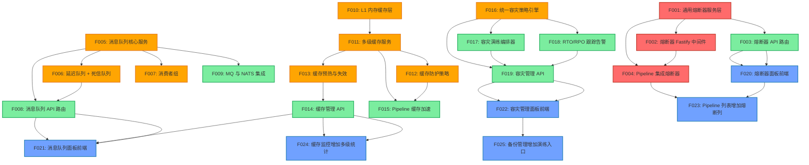

# 依赖关系图 (Dependency Graph)

## Mermaid DAG

## 并发执行机会

| 可并发组 | Features | 说明 |
|---------|----------|------|
| G1 | F001, F005, F010, F016 | 四条独立基础设施线，无依赖关系 |
| G2 | F002, F006, F011, F017 | 各自依赖 G1 中的对应 Feature |
| G3 | F003, F007, F012, F018 | 各自依赖 G2 中的对应 Feature |
| G4 | F008, F014, F019 | 各自的 API 路由层 |
| G5 | F009, F015, F023, F024, F025 | 最终集成层 |
| G6 | F020, F021, F022 | 前端页面层（各自独立） |

## 执行顺序建议

### Phase 1 (P0 - 熔断器)
1. F001 → F002 + F003 → F004 → F020 → F023

### Phase 2 (P1 - 消息队列 + 缓存)
1. F005 → F006 + F007 → F008 → F021
2. F010 → F011 → F012 + F013 → F014 → F024
3. F015 (依赖 F011 + F012)

### Phase 3 (P2 - CI/CD 增强 + 容灾)
1. F016 → F017 + F018 → F019 → F022 → F025
2. F009 (依赖 F005)
3. F004 (依赖 F001 + F002) - 已在 Phase 1 完成
