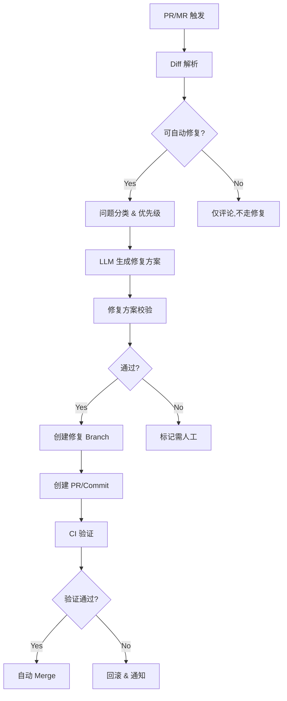

# AI Code Review 建设性改进方案

## 1. 问题根因分析

### 1.1 当前实现现状

通过代码分析，Orion 现有 AI Code Review 能力：

| 组件 | 状态 | 说明 |
|------|------|------|
| 规则引擎 | ✅ 完整 | 基于正则的规则匹配（Security/Performance/Style/Best Practice） |
| LLM 集成 | ⚠️ 基础 | 仅简单 Prompt，无上下文优化 |
| Diff 分析 | ✅ 基础 | 解析增减行、hunks、文件变更 |
| 结果聚合 | ✅ 完整 | 去重、评分、汇总 |
| 自动修复 | ❌ 缺失 | **核心差距** |
| 多模型路由 | ❌ 缺失 | 仅支持单一模型切换 |
| 代码理解 | ⚠️ 浅层 | 无语义嵌入、上下文关联 |

### 1.2 根因分析

| 维度 | 竞品能力 | Orion 差距 | 根因 |
|------|----------|------------|------|
| **Autofix** | GitHub Copilot Autofix 修复 90%+ 漏洞 | 无法自动修复 | 缺少代码生成与Patch应用能力 |
| **代码理解深度** | Copilot 基于完整仓库上下文 | 仅看当前 diff | 缺少代码嵌入 + 语义检索 |
| **多模型接入** | 阿里云效智能调度 | 手动二选一 | 缺少模型路由层 |
| **审查速度** | 并行处理 + 缓存 | 串行 + 无缓存 | 缺少流式 + 缓存机制 |
| **修复质量** | 自动验证修复正确性 | 无验证 | 缺少沙箱验证环节 |

---

## 2. 技术实现方案

### 2.1 Autofix 整体架构



### 2.2 关键能力实现

| 能力 | 技术方案 | 难度 | 依赖 |
|------|----------|------|------|
| **代码修复生成** | LLM 接收 `原始代码 + 问题描述 + 修复建议` → 输出 Patch | 高 | 现有 LLMClient 扩展 |
| **Patch 解析与应用** | `diff-parser` 解析 → `patch` 库应用 | 中 | diff-parser, patch |
| **修复验证** | 沙箱环境编译 + 单元测试执行 | 高 | Docker/K8s 沙箱 |
| **代码语义理解** | 代码嵌入 (CodeBERT/GraphCodeBERT) + 向量检索 | 高 | 嵌入模型服务 |
| **多模型路由** | 问题分类 → 模型匹配策略 (小模型快审, 大模型复杂问题) | 中 | 模型网关 |
| **流式审查** | Server-Sent Events (SSE) 实时推送 | 中 | 后端流式接口 |
| **上下文缓存** | Redis 缓存 Embedding + 审查结果 | 低 | Redis |

### 2.3 Autofix 核心实现细节

```typescript
// 新增: AutofixService.ts 接口设计
interface AutofixRequest {
  reviewId: string;
  comments: ReviewComment[];           // 需要修复的问题
  fileContents: Map<string, string>;   // 修复需要的完整文件内容
  mode: 'branch' | 'commit';           // 修复模式
}

interface AutofixResult {
  success: boolean;
  fixedComments: string[];             // 成功修复的问题ID
  failedComments: string[];            // 失败的问题ID
  newBranch?: string;
  newPrId?: string;
  verificationPassed: boolean;
  error?: string;
}

// LLM Prompt 增强
const AUTOFIX_SYSTEM_PROMPT = `You are an expert code repair assistant.
For each issue, you must:
1. Understand the original code context
2. Generate a precise fix
3. Ensure the fix compiles and preserves behavior
Return a JSON array with: { filePath, originalSnippet, fixedSnippet, diff, explanation }`;
```

---

## 3. 分阶段实现路径

### 3.1 阶段规划

| 阶段 | 时间 | 目标 | 关键交付物 |
|------|------|------|------------|
| **Phase 1: 基础能力** | 4 周 | 支持简单问题 Autofix | `AutofixService`, `PatchApplier`, 简单 UI |
| **Phase 2: 智能增强** | 6 周 | 代码理解 + 多模型路由 | `CodeEmbeddingService`, `ModelRouter`, 缓存层 |
| **Phase 3: 生产级** | 4 周 | 验证 + 监控 + 优化 | 沙箱验证, 指标看板, 性能优化 |

### 3.2 详细任务分解

#### Phase 1 (4 周)

| 周次 | 任务 | 交付 |
|------|------|------|
| W1 | Autofix 核心架构设计, 接口定义 | `AutofixService.ts`, `AutofixRequest/Result` types |
| W2 | LLM 修复方案生成 (扩展 LLMClient) | 支持生成 diff/patch 的新 Prompt 模板 |
| W3 | Patch 解析与应用, 基本验证 | `PatchApplier` 类, 单元测试 |
| W4 | 前端 Autofix UI, 修复确认流程 | "一键修复" 按钮, 修复预览 Modal |

#### Phase 2 (6 周)

| 周次 | 任务 | 交付 |
|------|------|------|
| W5-6 | 代码嵌入服务, 仓库上下文检索 | `CodeEmbeddingService`, 向量存储 (Milvus/Pinecone) |
| W7 | 多模型路由层, 问题→模型匹配 | `ModelRouter`, 模型选择策略配置 |
| W8-9 | 流式审查 (SSE), 增量审查 | `reviewDiff` 流式接口, 文件级增量 |
| W10 | 结果缓存, 性能优化 | Redis 缓存, 并行处理优化 |

#### Phase 3 (4 周)

| 周次 | 任务 | 交付 |
|------|------|------|
| W11 | 沙箱验证环境, 编译/测试执行 | `VerificationSandbox`, Docker 执行器 |
| W12 | 自动 Merge 流程, 失败回滚 | 自动 Merge 策略, 回滚机制 |
| W13 | 监控指标, 告警 | 审查成功率, 修复通过率, 延迟 P99 |
| W14 | 整体优化, 文档, 验收 | 完整功能, 技术文档, 性能达标 |

---

## 4. 资源估算

### 4.1 人力需求

| 角色 | 人数 | 投入周期 | 备注 |
|------|------|----------|------|
| 后端开发 (含 AI) | 2 人 | 14 人月 | Autofix, LLM 集成, 嵌入服务 |
| 前端开发 | 1 人 | 4 人月 | Autofix UI, 修复预览 |
| AI/算法 | 1 人 | 6 人月 (兼职) | Prompt 工程, 模型调优, 嵌入 |
| DevOps | 0.5 人 | 3 人月 (兼职) | 沙箱环境, 监控 |
| **合计** | **4.5 人** | **~14 人月** | |

### 4.2 技术成本估算

| 项目 | 估算 | 说明 |
|------|------|------|
| LLM API 调用 | ¥50,000-100,000/月 | 取决于审查量, 初期可用免费 quota |
| 向量数据库 | ¥10,000-20,000/月 | Milvus Cloud / Pinecone |
| 沙箱计算资源 | ¥5,000-10,000/月 | 按需 K8s Pod |
| 监控/日志 | ¥2,000-5,000/月 | 现有基础设施复用 |

**初期月成本: ¥67,000-135,000** (随着用量增长需动态调整)

---

## 5. 风险与对策

| 风险 | 影响 | 概率 | 对策 |
|------|------|------|------|
| **LLM 修复生成错误** | 引入 bug 到生产代码 | 高 | 强制沙箱验证 + CI 门禁, 失败自动回滚 |
| **安全风险** | 恶意代码注入 | 中 | 沙箱执行 + 权限最小化 + 代码审查 |
| **修复冲突** | 与其他 PR 冲突无法自动合并 | 中 | 检测冲突, 冲突时改为手动 MR |
| **模型选择不当** | 复杂问题修复失败 | 低 | 多模型兜底 (GPT-4 → Claude → 本地模型) |
| **审查延迟** | 影响开发体验 | 中 | 流式输出 + 缓存 + 分级处理 (简单问题快速通道) |
| **成本失控** | LLM API 费用超支 | 中 | 限流 + 缓存 + 问题分级 (仅复杂问题调用大模型) |

### 5.1 质量保障措施

1. **修复必须经过验证**:
   - 沙箱编译通过
   - 原有单元测试通过
   - 可选: 静态分析 (SonarQube)

2. **渐进式自动程度**:
   - Phase 1: 仅简单问题自动修复 (style, small bugs)
   - Phase 2: 复杂问题提供修复建议 (人工确认)
   - Phase 3: 智能判断是否可自动修复

3. **回滚机制**:
   - 自动创建修复分支, 不直接修改主分支
   - CI 失败自动通知, 48h 未处理自动删除分支

---

## 6. 竞品对标

| 能力 | GitHub Copilot Autofix | 阿里云效 | 百度 Comate | Orion (目标) |
|------|------------------------|----------|-------------|--------------|
| 自动修复 | ✅ 90%+ 漏洞 | ✅ 部分 | ✅ 部分 | **Phase 1 实现** |
| 多模型 | ✅ GPT-4 + Codex | ✅ 通义 + 自研 | ✅ ERNIE | **Phase 2 实现** |
| 代码理解 | ✅ 仓库级上下文 | ✅ 项目级 | ✅ 文件级 | **Phase 2 实现** |
| 速度 | ~30s | ~60s | ~45s | **<60s** |
| 验证 | ✅ CI 集成 | ✅ CI 集成 | ⚠️ 基础 | **Phase 3 实现** |

---

## 7. 立即行动项

1. **本周**: 完成 Autofix 架构设计评审, 确定 Phase 1 详细设计
2. **下周**: 开始 LLM 修复 Prompt 迭代 (先用简单 case 验证)
3. **2 周内**: PoC 端到端 Autofix 流程 (demo 环境)

---

*方案版本: v1.0*  
*生成时间: 2026-05-03*  
*后续迭代: 根据 Phase 1 实际情况调整后续计划*