# Orion 平台 AI 降级方案设计

> 版本：v1.0  
> 创建日期：2026-04-10  
> 负责人：架构师团队 + AI 团队  
> 优先级：P0  
> 状态：设计完成

---

## 一、背景与目标

### 1.1 问题背景

架构师评审发现 Orion 平台现有 **15+ 处 LLM 调用** 仅有"降级到规则引擎"的框架描述，**无具体实现方案**。这导致：

- LLM 服务故障时无明确降级路径
- 降级触发条件不清晰
- 降级后功能可用性无法保证
- 缺乏降级验证手段

### 1.2 设计目标

本方案为每个 LLM 调用场景设计详细的降级方案，确保：

1. **可降级**：每个 LLM 调用都有明确的降级路径
2. **可触发**：降级触发条件量化、可执行
3. **可验证**：降级后功能可用性可验证
4. **可观测**：降级行为可追踪、可告警

---

## 二、LLM 分级治理策略

### 2.1 LLM 优先级分级

| 级别 | 定义 | 可用性要求 | 降级策略 | 场景示例 |
|------|------|-----------|---------|---------|
| **P0 - 核心** | 影响核心业务流程 | 99.99% | 立即降级 + 强规则兜底 | AI 风险评估、AI 自动排单 |
| **P1 - 重要** | 影响效率但可替代 | 99.9% | 自动重试 + 弱规则兜底 | AI Code Review、根因诊断 |
| **P2 - 锦上添花** | 体验增强型功能 | 99% | 静默失败 + 功能隐藏 | 变更日志生成、Pipeline 生成 |

### 2.2 分级治理矩阵

```mermaid
flowchart TB
    subgraph P0 核心业务
        A1[AI 风险评估 Aegis]
        A2[AI 自动排单]
        A3[AI 修复建议生成]
    end
    
    subgraph P1 重要效率
        B1[AI Code Review]
        B2[Kintsugi 根因诊断]
        B3[工单智能分类]
        B4[Postmortem 报告生成]
    end
    
    subgraph P2 体验增强
        C1[变更日志生成]
        C2[Pipeline YAML 生成]
        C3[AI Skill 输出验证]
        C4[变更影响分析]
        C5[SQL 审查建议]
        C6[测试用例生成]
    end
    
    A1 & A2 & A3 --> D[降级策略：立即切换规则引擎]
    B1 & B2 & B3 & B4 --> E[降级策略：重试 2 次后降级]
    C1 & C2 & C3 & C4 & C5 & C6 --> F[降级策略：静默失败]
    
    style A1 fill:#ff6b6b
    style A2 fill:#ff6b6b
    style A3 fill:#ff6b6b
    style B1 fill:#ffd43b
    style B2 fill:#ffd43b
    style B3 fill:#ffd43b
    style B4 fill:#ffd43b
    style C1 fill:#51cf66
    style C2 fill:#51cf66
    style C3 fill:#51cf66
    style C4 fill:#51cf66
    style C5 fill:#51cf66
    style C6 fill:#51cf66
```

---

## 三、LLM 调用场景清单与降级方案

### 3.1 场景总览

| 序号 | LLM 调用场景 | 优先级 | 降级方式 | 触发条件 |
|------|-------------|--------|---------|---------|
| 1 | AI Code Review | P1 | 规则引擎 | 超时/置信度低 |
| 2 | Aegis 风险评估 | P0 | 规则引擎 + 历史基线 | 超时/错误率高 |
| 3 | Kintsugi 根因诊断 | P1 | 规则引擎 + 知识库检索 | 超时/置信度低 |
| 4 | AI 修复建议生成 | P0 | 规则模板库 | 超时/置信度低 |
| 5 | AI 自动排单 | P0 | 规则引擎 + 人工介入 | 超时/错误率高 |
| 6 | 变更日志生成 | P2 | 模板填充/静默失败 | 超时 |
| 7 | Postmortem 报告生成 | P1 | 模板填充 | 超时/置信度低 |
| 8 | AI Skill 输出验证 | P1 | 规则验证 | 超时/格式错误 |
| 9 | Pipeline YAML 生成 | P2 | 模板库/静默失败 | 超时 |
| 10 | 工单智能分类 | P1 | 规则匹配 | 超时/置信度低 |
| 11 | 变更影响分析 | P2 | 依赖图分析 | 超时 |
| 12 | SQL 审查建议 | P1 | 规则引擎 | 超时/置信度低 |
| 13 | 测试用例生成 | P2 | 模板库/静默失败 | 超时 |
| 14 | 文档自动生成 | P2 | 模板填充 | 超时 |
| 15 | 告警智能降噪 | P1 | 规则过滤 | 超时/错误率高 |
| 16 | 容量预测建议 | P2 | 时序模型/趋势外推 | 超时 |

---

## 四、详细降级方案设计

### 4.1 AI Code Review（P1）

#### 4.1.1 场景描述

- **功能**：对 PR 代码变更进行 AI 驱动的安全、质量、性能审查
- **输入**：代码 Diff、语言类型、审查规则配置
- **输出**：问题列表（文件、行号、严重度、类型、描述、建议）

#### 4.1.2 降级触发条件

| 条件 | 阈值 | 检测方式 |
|------|------|---------|
| **超时** | P95 > 15s | 请求级超时监控 |
| **错误率** | > 10% (5 分钟窗口) | 滑动窗口计数 |
| **置信度低** | < 0.6 | 模型输出置信度分数 |
| **JSON 格式错误** | > 3 次重试失败 | 输出验证失败计数 |
| **Token 超限** | 输入 > 模型上下文窗口 | 预检查 |

#### 4.1.3 降级决策树

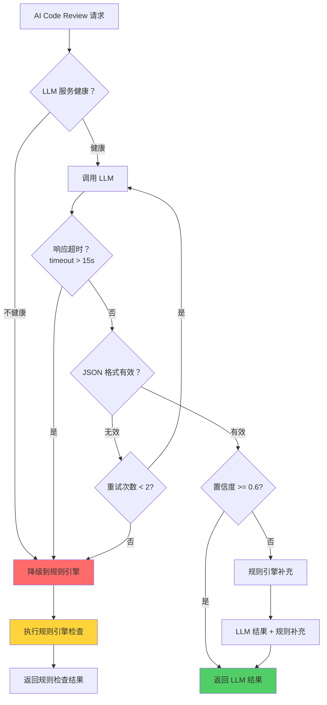

#### 4.1.4 降级具体实现

**规则引擎检查项：**

| 规则类别 | 检查项 | 实现方式 |
|---------|-------|---------|
| **安全规则** | SQL 注入、XSS、硬编码凭证 | 正则匹配 + AST 分析 |
| **代码规范** | 命名规范、代码格式 | Lint 工具集成 |
| **复杂度检查** | 圈复杂度、函数长度 | 静态分析 |
| **重复代码** | 代码重复率 | 指纹匹配 |
| **依赖检查** | 已知漏洞依赖 | CVE 数据库匹配 |

**规则引擎输出格式（与 LLM 输出对齐）：**

```json
{
  "source": "rule-engine",
  "degraded": true,
  "degraded_at": "2026-04-10T14:30:00Z",
  "degraded_reason": "LLM timeout after 15s",
  "issues": [
    {
      "file": "src/auth.py",
      "line": 15,
      "severity": "CRITICAL",
      "type": "sql-injection",
      "message": "使用字符串格式化构建 SQL 查询存在注入风险",
      "suggestion": "使用参数化查询",
      "rule_id": "SEC-001"
    }
  ]
}
```

#### 4.1.5 降级验证方式

| 验证项 | 验证方法 | 验收标准 |
|-------|---------|---------|
| **规则覆盖率** | 对比 LLM 与规则引擎检出问题 | 规则引擎覆盖 >= 70% 高危问题 |
| **误报率** | 抽样检查规则引擎输出 | 误报率 < 15% |
| **响应时间** | 压测规则引擎 | P95 < 5s |
| **降级感知** | 检查返回结果中的 degraded 字段 | UI 明确标识降级状态 |

---

### 4.2 Aegis 风险评估（P0）

#### 4.2.1 场景描述

- **功能**：AI 评估变更风险，输出风险评分和审批路由建议
- **输入**：变更特征（文件数、行数、服务、依赖、历史失败率等）
- **输出**：风险评分 (0-100)、风险等级、审批路由建议

#### 4.2.2 降级触发条件

| 条件 | 阈值 | 检测方式 |
|------|------|---------|
| **超时** | P95 > 2s | 请求级超时监控 |
| **错误率** | > 5% (5 分钟窗口) | 滑动窗口计数 |
| **服务不可用** | 连续 3 次失败 | 熔断器 |
| **输出异常** | 风险评分超出 0-100 范围 | 输出验证 |

#### 4.2.3 降级决策树

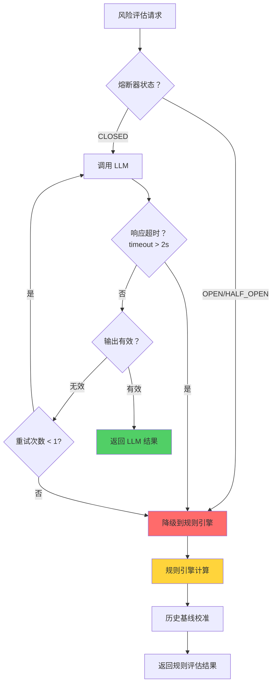

#### 4.2.4 降级具体实现

**规则引擎计算公式：**

```
风险评分 = Σ(特征权重 × 特征分值)

特征权重表：
┌──────────────────────┬───────┬──────────────┐
│ 特征                 │ 权重  │ 分值计算     │
├──────────────────────┼───────┼──────────────┤
│ 核心服务变更         │ 0.20  │ 是=100, 否=0 │
│ 数据库变更           │ 0.15  │ 是=100, 否=0 │
│ 文件变更数 > 50      │ 0.10  │ 是=80, 否=20 │
│ 行数变更 > 1000      │ 0.10  │ 是=80, 否=20 │
│ 相似变更历史失败     │ 0.15  │ 失败次数×20  │
│ 服务 MTBF < 7 天      │ 0.10  │ 是=60, 否=10 │
│ 周五/节假日变更      │ 0.10  │ 是=50, 否=0  │
│ 作者经验 < 3 月       │ 0.05  │ 是=40, 否=10 │
│ 审批人数不足         │ 0.05  │ 是=40, 否=10 │
└──────────────────────┴───────┴──────────────┘
```

**历史基线校准：**

1. 查询该服务历史发布成功率
2. 查询该作者历史变更成功率
3. 查询相似变更模式的历史风险
4. 基于历史数据调整最终评分 (±10 分)

**降级输出格式：**

```json
{
  "source": "rule-engine",
  "degraded": true,
  "degraded_reason": "LLM service unavailable (circuit breaker OPEN)",
  "risk_score": 65,
  "risk_level": "HIGH",
  "approval_required": true,
  "approvers": ["tech_lead", "sre"],
  "risk_factors": [
    {"factor": "core_service_change", "score": 100, "weight": 0.20},
    {"factor": "database_change", "score": 100, "weight": 0.15},
    {"factor": "large_change", "score": 80, "weight": 0.10}
  ],
  "baseline_adjustment": -5,
  "baseline_reason": "该服务历史成功率 98%，作者历史成功率 100%"
}
```

#### 4.2.5 降级验证方式

| 验证项 | 验证方法 | 验收标准 |
|-------|---------|---------|
| **评分一致性** | 对比 LLM 与规则引擎评分 | 相关性系数 > 0.7 |
| **高风险检出** | 注入高风险测试用例 | 高风险检出率 100% |
| **响应时间** | 压测规则引擎 | P95 < 500ms |
| **历史基线准确性** | 回测历史数据 | 基线预测准确率 > 80% |

---

### 4.3 Kintsugi 根因诊断（P1）

#### 4.3.1 场景描述

- **功能**：AI 分析故障日志，输出根因定位和影响范围
- **输入**：异常日志、时间范围、相关服务、指标数据
- **输出**：根因假设列表、置信度、影响范围、修复建议

#### 4.3.2 降级触发条件

| 条件 | 阈值 | 检测方式 |
|------|------|---------|
| **超时** | P95 > 30s | 请求级超时监控 |
| **置信度低** | Top-1 置信度 < 0.5 | 模型输出置信度 |
| **错误率** | > 15% (5 分钟窗口) | 滑动窗口计数 |
| **上下文过长** | 日志量 > 模型窗口 | 预检查 |

#### 4.3.3 降级决策树

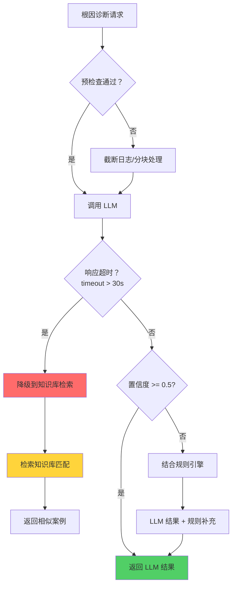

#### 4.3.4 降级具体实现

**知识库检索方案：**

1. **日志特征提取**
   - 提取异常类型（Exception Class）
   - 提取错误码（Error Code）
   - 提取关键堆栈帧（Top 5 Stack Frames）
   - 生成日志指纹（Hash）

2. **向量相似度检索**
   - 使用 Embedding 模型将日志转换为向量
   - 在历史故障库中检索 Top-K 相似案例
   - 返回相似度最高的 3 个案例

3. **规则引擎补充**
   - 已知异常模式匹配（如 OOM、连接超时）
   - 服务依赖图分析（上游/下游故障传播）
   - 指标关联分析（CPU、内存、延迟突变）

**降级输出格式：**

```json
{
  "source": "knowledge-base",
  "degraded": true,
  "degraded_reason": "LLM confidence too low (0.32 < 0.5)",
  "root_causes": [
    {
      "hypothesis": "数据库连接池耗尽",
      "confidence": 0.75,
      "evidence": [
        "相似历史案例：INC-20260401-001",
        "错误模式匹配：ConnectionPoolTimeoutException",
        "指标关联：连接池使用率 100%"
      ],
      "impact_scope": ["order-service", "payment-service"],
      "suggested_fix": "增加连接池大小或优化慢查询"
    }
  ],
  "similar_cases": [
    {
      "incident_id": "INC-20260401-001",
      "similarity_score": 0.92,
      "resolution": "增加连接池上限从 50 到 200"
    }
  ]
}
```

#### 4.3.5 降级验证方式

| 验证项 | 验证方法 | 验收标准 |
|-------|---------|---------|
| **案例匹配准确率** | 人工评审检索结果 | Top-3 相关率 > 80% |
| **知识库覆盖率** | 统计历史案例入库率 | 历史故障入库率 > 90% |
| **响应时间** | 压测检索服务 | P95 < 3s |
| **根因一致性** | 对比 LLM 与 KB 结果 | 根因类型一致率 > 60% |

---

### 4.4 AI 修复建议生成（P0）

#### 4.4.1 场景描述

- **功能**：AI 生成具体修复代码或配置建议
- **输入**：问题描述、当前代码/配置、上下文
- **输出**：修复代码、修复说明、验证步骤

#### 4.4.2 降级触发条件

| 条件 | 阈值 | 检测方式 |
|------|------|---------|
| **超时** | P95 > 20s | 请求级超时监控 |
| **置信度低** | < 0.7 | 模型输出置信度 |
| **代码验证失败** | 生成的代码无法编译/执行 | 沙箱验证 |
| **错误率** | > 5% (5 分钟窗口) | 滑动窗口计数 |

#### 4.4.3 降级决策树

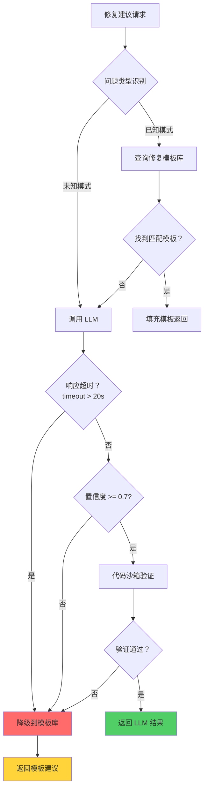

#### 4.4.4 降级具体实现

**修复模板库设计：**

| 问题类型 | 模板 ID | 模板内容 | 适用场景 |
|---------|--------|---------|---------|
| SQL 注入 | FIX-SQL-001 | 参数化查询模板 | Java/Python/Go |
| XSS 防护 | FIX-XSS-001 | 输出编码模板 | Web 框架 |
| 空指针 | FIX-NPE-001 | 空值检查模板 | Java |
| 连接泄漏 | FIX-LEAK-001 | try-with-resources 模板 | Java |
| 超时配置 | FIX-TIMEOUT-001 | 超时配置模板 | HTTP 客户端 |
| 日志规范 | FIX-LOG-001 | 结构化日志模板 | 所有语言 |

**模板填充引擎：**

1. 识别问题类型和编程语言
2. 查询匹配的修复模板
3. 提取当前代码上下文（变量名、方法签名）
4. 填充模板生成具体修复建议

**降级输出格式：**

```json
{
  "source": "template-library",
  "degraded": true,
  "degraded_reason": "LLM code verification failed (compilation error)",
  "fix_suggestion": {
    "template_id": "FIX-SQL-001",
    "problem_type": "sql-injection",
    "original_code": "query = f\"SELECT * FROM users WHERE id = {user_id}\"",
    "fixed_code": "cursor.execute('SELECT * FROM users WHERE id = %s', (user_id,))",
    "explanation": "使用参数化查询避免 SQL 注入风险",
    "verification_steps": [
      "运行单元测试验证功能正常",
      "检查 SQL 审计日志确认参数绑定"
    ]
  },
  "confidence": 0.95
}
```

#### 4.4.5 降级验证方式

| 验证项 | 验证方法 | 验收标准 |
|-------|---------|---------|
| **模板覆盖率** | 统计 Top-20 问题类型覆盖 | 覆盖 > 80% 常见问题 |
| **代码正确性** | 沙箱编译/执行测试 | 编译通过率 > 95% |
| **修复有效性** | 人工评审修复建议 | 有效修复率 > 90% |
| **响应时间** | 压测模板引擎 | P95 < 1s |

---

### 4.5 AI 自动排单（P0）

#### 4.5.1 场景描述

- **功能**：AI 基于依赖关系、风险、业务优先级自动生成发布计划
- **输入**：待发布变更列表、依赖关系、业务约束
- **输出**：发布顺序、时间窗口、回滚计划

#### 4.5.2 降级触发条件

| 条件 | 阈值 | 检测方式 |
|------|------|---------|
| **超时** | P95 > 30s | 请求级超时监控 |
| **错误率** | > 5% (5 分钟窗口) | 滑动窗口计数 |
| **约束冲突** | AI 输出违反硬性约束 | 约束验证 |
| **服务不可用** | 连续 2 次失败 | 熔断器 |

#### 4.5.3 降级决策树

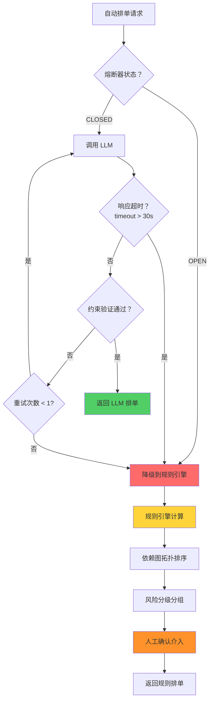

#### 4.5.4 降级具体实现

**规则引擎排单算法：**

1. **依赖图构建**
   - 从 CMDB 获取服务依赖关系
   - 构建有向无环图 (DAG)
   - 检测循环依赖（如有则报错）

2. **拓扑排序**
   - 使用 Kahn 算法进行拓扑排序
   - 生成基础发布顺序（被依赖者先发布）

3. **风险分组**
   - 基于规则引擎计算每个变更的风险评分
   - 按风险分级：LOW → MEDIUM → HIGH
   - 同风险组内按依赖顺序排列

4. **时间窗口分配**
   - LOW 风险：任意时间
   - MEDIUM 风险：工作时间
   - HIGH 风险：工作时间 + 审批

5. **人工确认介入**
   - 生成排单建议后需人工确认
   - 支持手动调整顺序
   - 记录调整原因

**降级输出格式：**

```json
{
  "source": "rule-engine",
  "degraded": true,
  "degraded_reason": "LLM constraint violation detected",
  "release_plan": {
    "groups": [
      {
        "group": "LOW-RISK",
        "time_window": "anytime",
        "approval_required": false,
        "changes": ["CHG-001", "CHG-003"]
      },
      {
        "group": "MEDIUM-RISK",
        "time_window": "business-hours",
        "approval_required": true,
        "approver": "tech_lead",
        "changes": ["CHG-002"]
      },
      {
        "group": "HIGH-RISK",
        "time_window": "business-hours",
        "approval_required": true,
        "approver": "sre",
        "changes": ["CHG-004"]
      }
    ],
    "order": ["CHG-001", "CHG-003", "CHG-002", "CHG-004"],
    "rollback_order": ["CHG-004", "CHG-002", "CHG-003", "CHG-001"],
    "manual_review_required": true,
    "review_reason": "降级模式生成，需人工确认依赖关系"
  }
}
```

#### 4.5.5 降级验证方式

| 验证项 | 验证方法 | 验收标准 |
|-------|---------|---------|
| **依赖正确性** | 验证拓扑排序结果 | 无依赖违反 |
| **风险分级准确** | 对比历史风险评估 | 分级一致率 > 85% |
| **人工确认流程** | 演练人工介入流程 | 流程畅通可用 |
| **响应时间** | 压测排单引擎 | P95 < 5s |

---

### 4.6 变更日志生成（P2）

#### 4.6.1 场景描述

- **功能**：AI 自动生成变更日志（Changelog）
- **输入**：Commit 历史、PR 描述、Jira Issue
- **输出**：结构化变更日志（新增、修复、改进、破坏性变更）

#### 4.6.2 降级触发条件

| 条件 | 阈值 | 检测方式 |
|------|------|---------|
| **超时** | P95 > 10s | 请求级超时监控 |
| **服务不可用** | 连续 3 次失败 | 重试计数器 |

#### 4.6.3 降级决策树

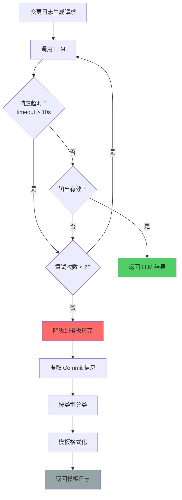

#### 4.6.4 降级具体实现

**模板填充方案：**

1. **Commit 信息提取**
   - 解析 Commit Message
   - 提取关联的 Jira Issue
   - 提取 PR 标题和描述

2. **自动分类**
   - `feat:` 开头 → 新增功能
   - `fix:` 开头 → 修复
   - `refactor:` 开头 → 重构
   - `perf:` 开头 → 性能改进
   - 其他 → 其他变更

3. **模板格式化**
   ```markdown
   ## [Version] - YYYY-MM-DD
   
   ### 新增功能
   - {feat commits}
   
   ### 修复
   - {fix commits}
   
   ### 其他变更
   - {other commits}
   ```

**降级输出格式：**

```markdown
## [v1.2.0] - 2026-04-10

### 新增功能
- 添加用户管理模块 (commit: abc123, JIRA: PROJ-123)
- 支持批量导入功能 (commit: def456, JIRA: PROJ-124)

### 修复
- 修复登录超时问题 (commit: ghi789, JIRA: PROJ-120)
- 修复数据导出格式错误 (commit: jkl012, JIRA: PROJ-121)

### 其他变更
- 代码重构和依赖升级 (5 commits)

---
*注：此日志由模板生成，未经过 AI 润色*
```

#### 4.6.5 降级验证方式

| 验证项 | 验证方法 | 验收标准 |
|-------|---------|---------|
| **分类准确率** | 抽样检查 commit 分类 | 分类准确率 > 85% |
| **格式正确性** | 验证 Markdown 格式 | 格式正确率 100% |
| **响应时间** | 压测模板引擎 | P95 < 1s |

---

### 4.7 Postmortem 报告生成（P1）

#### 4.7.1 场景描述

- **功能**：AI 辅助生成故障复盘报告
- **输入**：故障时间线、影响范围、根因分析、修复动作
- **输出**：结构化复盘报告（摘要、时间线、根因、改进行动）

#### 4.7.2 降级触发条件

| 条件 | 阈值 | 检测方式 |
|------|------|---------|
| **超时** | P95 > 30s | 请求级超时监控 |
| **置信度低** | < 0.5 | 模型输出置信度 |
| **关键信息缺失** | 时间线/根因字段为空 | 输出验证 |

#### 4.7.3 降级决策树

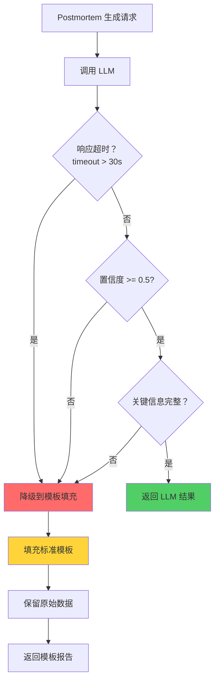

#### 4.7.4 降级具体实现

**标准模板结构：**

```markdown
# 故障复盘报告

## 基本信息
- 故障 ID: {incident_id}
- 故障等级：{severity}
- 发生时间：{start_time}
- 恢复时间：{end_time}
- 持续时间：{duration}
- 影响服务：{affected_services}
- 影响用户：{affected_users}

## 故障摘要
{自动生成的摘要或留空待人工填写}

## 时间线
{按时间顺序列出关键事件}
- {timestamp}: {event}

## 根因分析
{根因描述或留空待人工填写}

## 改进行动
| 行动项 | 负责人 | 截止日期 | 状态 |
|-------|--------|---------|------|
| {action_item} | {owner} | {due_date} | OPEN |

## 经验教训
{待人工填写}
```

**降级输出：**

- 填充所有已知的结构化字段
- AI 生成类字段（摘要、根因分析）标注为"待人工填写"
- 保留原始数据引用链接

#### 4.7.5 降级验证方式

| 验证项 | 验证方法 | 验收标准 |
|-------|---------|---------|
| **模板完整性** | 验证所有必填字段 | 必填字段完整率 100% |
| **数据准确性** | 对比原始故障数据 | 数据准确率 100% |
| **响应时间** | 压测模板引擎 | P95 < 2s |

---

### 4.8 AI Skill 输出验证（P1）

#### 4.8.1 场景描述

- **功能**：AI 验证 LLM 输出是否符合 JSON Schema
- **输入**：LLM 输出字符串、期望 Schema
- **输出**：验证结果、错误信息、修复建议

#### 4.8.2 降级触发条件

| 条件 | 阈值 | 检测方式 |
|------|------|---------|
| **超时** | P95 > 5s | 请求级超时监控 |
| **服务不可用** | 连续 3 次失败 | 重试计数器 |

#### 4.8.3 降级决策树

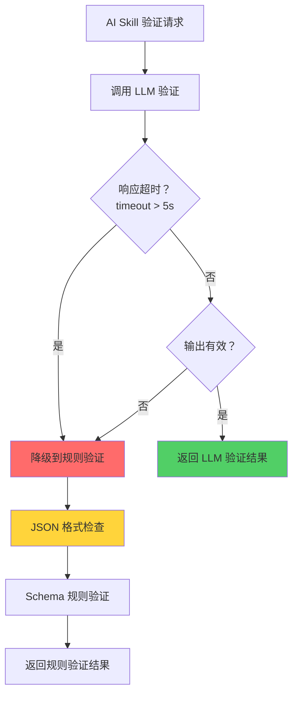

#### 4.8.4 降级具体实现

**规则验证流程：**

1. **JSON 格式验证**
   - 尝试解析 JSON
   - 捕获解析错误

2. **Schema 验证**
   - 使用 JSON Schema 验证器
   - 检查必需字段
   - 检查字段类型
   - 检查枚举值

3. **业务规则验证**
   - 检查严重程度值是否合法
   - 检查必填字段非空
   - 检查数值范围

**降级输出格式：**

```json
{
  "source": "rule-validator",
  "degraded": true,
  "degraded_reason": "AI validation service timeout",
  "validation_result": {
    "valid": true,
    "json_valid": true,
    "schema_valid": true,
    "errors": [],
    "warnings": ["字段 description 为空，建议补充"]
  }
}
```

#### 4.8.5 降级验证方式

| 验证项 | 验证方法 | 验收标准 |
|-------|---------|---------|
| **Schema 验证准确率** | 对比 AI 与规则验证结果 | 一致率 > 95% |
| **响应时间** | 压测规则验证 | P95 < 500ms |

---

### 4.9 Pipeline YAML 生成（P2）

#### 4.9.1 场景描述

- **功能**：AI 根据项目类型生成 CI/CD Pipeline 配置
- **输入**：项目类型、语言、框架、部署目标
- **输出**：完整的 Pipeline YAML 配置

#### 4.9.2 降级触发条件

| 条件 | 阈值 | 检测方式 |
|------|------|---------|
| **超时** | P95 > 15s | 请求级超时监控 |
| **服务不可用** | 连续 3 次失败 | 重试计数器 |

#### 4.9.3 降级决策树

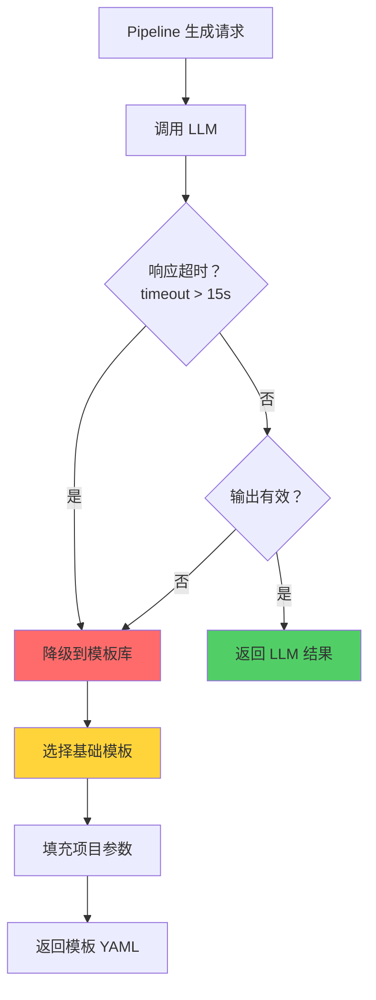

#### 4.9.4 降级具体实现

**模板库设计：**

| 项目类型 | 模板 ID | 包含 Stage |
|---------|--------|-----------|
| Java/Spring | PIPE-JAVA-001 | build → test → package → deploy |
| Python/Django | PIPE-PY-001 | lint → test → build → deploy |
| Node.js/React | PIPE-NODE-001 | install → test → build → deploy |
| Go | PIPE-GO-001 | build → test → image → deploy |
| Static | PIPE-STATIC-001 | build → deploy |

**模板填充：**

1. 识别项目类型和框架
2. 选择匹配的基础模板
3. 填充项目名称、构建命令、部署配置

#### 4.9.5 降级验证方式

| 验证项 | 验证方法 | 验收标准 |
|-------|---------|---------|
| **YAML 语法正确** | YAML 解析验证 | 解析成功率 100% |
| **模板覆盖率** | 统计 Top-5 项目类型覆盖 | 覆盖 > 80% 项目 |
| **响应时间** | 压测模板引擎 | P95 < 1s |

---

### 4.10 工单智能分类（P1）

#### 4.10.1 场景描述

- **功能**：AI 自动分类工单到正确的处理团队
- **输入**：工单标题、描述、附件
- **输出**：分类标签、置信度、处理团队建议

#### 4.10.2 降级触发条件

| 条件 | 阈值 | 检测方式 |
|------|------|---------|
| **超时** | P95 > 5s | 请求级超时监控 |
| **置信度低** | Top-1 置信度 < 0.6 | 模型输出置信度 |
| **错误率** | > 10% (5 分钟窗口) | 滑动窗口计数 |

#### 4.10.3 降级决策树

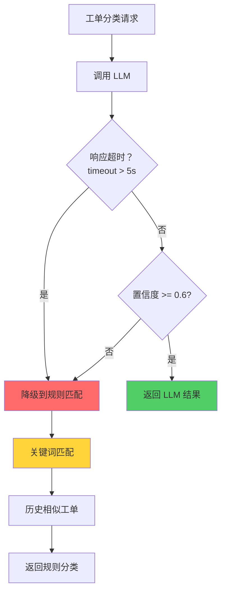

#### 4.10.4 降级具体实现

**规则匹配方案：**

1. **关键词匹配**
   - 构建团队关键词库
   - 匹配工单标题和描述
   - 计算关键词得分

2. **历史相似工单**
   - 计算工单文本相似度
   - 查找历史相似工单的分类
   - 返回最常见的分类

3. **兜底策略**
   - 无法确定时分类到"通用支持"
   - 标记为"需人工确认"

**降级输出格式：**

```json
{
  "source": "rule-classifier",
  "degraded": true,
  "degraded_reason": "LLM confidence too low (0.45 < 0.6)",
  "classification": {
    "primary_category": "基础设施",
    "secondary_category": "网络问题",
    "confidence": 0.72,
    "assigned_team": "sre-network",
    "matching_keywords": ["网络", "延迟", "连接"],
    "similar_tickets": ["INC-20260401-001", "INC-20260328-005"],
    "manual_review_required": true
  }
}
```

#### 4.10.5 降级验证方式

| 验证项 | 验证方法 | 验收标准 |
|-------|---------|---------|
| **分类准确率** | 对比历史人工分类 | 准确率 > 75% |
| **响应时间** | 压测分类引擎 | P95 < 1s |
| **兜底触发率** | 统计分类到"通用"比例 | < 20% |

---

### 4.11 变更影响分析（P2）

#### 4.11.1 场景描述

- **功能**：AI 分析代码变更对系统的影响范围
- **输入**：变更文件列表、调用关系图、服务依赖
- **输出**：影响服务列表、影响等级、测试建议

#### 4.11.2 降级触发条件

| 条件 | 阈值 | 检测方式 |
|------|------|---------|
| **超时** | P95 > 15s | 请求级超时监控 |
| **服务不可用** | 连续 3 次失败 | 重试计数器 |

#### 4.11.3 降级决策树

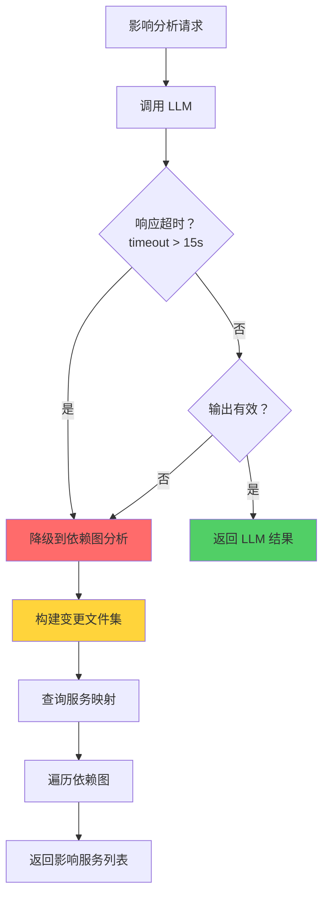

#### 4.11.4 降级具体实现

**依赖图分析方案：**

1. **文件 - 服务映射**
   - 查询 CMDB 获取文件所属服务
   - 构建变更文件集对应的服务集

2. **依赖图遍历**
   - 从变更服务出发
   - 沿依赖边向上游遍历（调用方）
   - 沿依赖边向下游遍历（被调用方）
   - 记录所有可达服务

3. **影响等级评估**
   - 直接变更服务：HIGH
   - 上游依赖服务：MEDIUM
   - 下游依赖服务：LOW

#### 4.11.5 降级验证方式

| 验证项 | 验证方法 | 验收标准 |
|-------|---------|---------|
| **服务映射准确** | 对比 CMDB 数据 | 准确率 100% |
| **依赖图完整** | 验证依赖数据采集 | 覆盖率 > 90% |
| **响应时间** | 压测依赖图查询 | P95 < 3s |

---

### 4.12 SQL 审查建议（P1）

#### 4.12.1 场景描述

- **功能**：AI 审查 SQL 语句的性能和安全性
- **输入**：SQL 语句、表结构、数据量
- **输出**：性能评估、索引建议、风险警告

#### 4.12.2 降级触发条件

| 条件 | 阈值 | 检测方式 |
|------|------|---------|
| **超时** | P95 > 10s | 请求级超时监控 |
| **置信度低** | < 0.6 | 模型输出置信度 |
| **错误率** | > 10% (5 分钟窗口) | 滑动窗口计数 |

#### 4.12.3 降级决策树

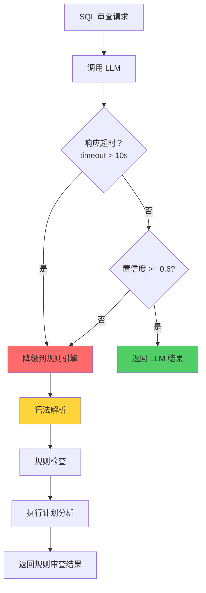

#### 4.12.4 降级具体实现

**规则检查项：**

| 规则类别 | 检查项 | 风险等级 |
|---------|-------|---------|
| **安全风险** | SELECT * | LOW |
| **安全风险** | 无 WHERE 条件的 DELETE/UPDATE | CRITICAL |
| **性能风险** | 全表扫描风险 | HIGH |
| **性能风险** | 缺少索引的 JOIN | MEDIUM |
| **性能风险** | N+1 查询模式 | HIGH |
| **最佳实践** | 未使用参数化查询 | CRITICAL |

**执行计划分析：**

1. EXPLAIN 分析 SQL
2. 检查扫描类型（全表/索引）
3. 检查 JOIN 类型
4. 生成索引建议

#### 4.12.5 降级验证方式

| 验证项 | 验证方法 | 验收标准 |
|-------|---------|---------|
| **规则覆盖率** | 对比最佳实践 | 覆盖 > 90% 常见问题 |
| **执行计划准确** | 对比实际执行 | 一致率 > 95% |
| **响应时间** | 压测审查引擎 | P95 < 2s |

---

### 4.13 测试用例生成（P2）

#### 4.13.1 场景描述

- **功能**：AI 根据代码变更生成测试用例
- **输入**：代码变更、测试框架、覆盖率要求
- **输出**：测试代码、测试说明

#### 4.13.2 降级触发条件

| 条件 | 阈值 | 检测方式 |
|------|------|---------|
| **超时** | P95 > 20s | 请求级超时监控 |
| **服务不可用** | 连续 3 次失败 | 重试计数器 |

#### 4.13.3 降级决策树

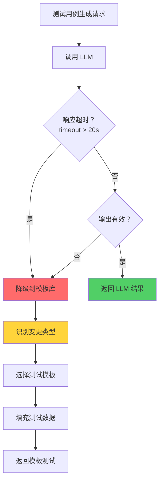

#### 4.13.4 降级具体实现

**测试模板库：**

| 变更类型 | 测试模板 | 测试内容 |
|---------|---------|---------|
| 新增函数 | TEST-NEW-FUNC | 输入边界测试、正常流程测试 |
| 修改函数 | TEST-MOD-FUNC | 回归测试、变更影响测试 |
| 修复 Bug | TEST-BUGFIX | 复现测试、回归测试 |
| 新增 API | TEST-API | 接口测试、参数验证 |

#### 4.13.5 降级验证方式

| 验证项 | 验证方法 | 验收标准 |
|-------|---------|---------|
| **模板覆盖率** | 统计变更类型覆盖 | 覆盖 > 80% 场景 |
| **测试可执行** | 实际运行测试 | 执行成功率 > 90% |
| **响应时间** | 压测模板引擎 | P95 < 2s |

---

### 4.14 文档自动生成（P2）

#### 4.14.1 场景描述

- **功能**：AI 根据代码/接口定义生成 API 文档
- **输入**：代码/接口定义、文档模板
- **输出**：结构化文档

#### 4.14.2 降级触发条件

| 条件 | 阈值 | 检测方式 |
|------|------|---------|
| **超时** | P95 > 15s | 请求级超时监控 |
| **服务不可用** | 连续 3 次失败 | 重试计数器 |

#### 4.14.3 降级决策树

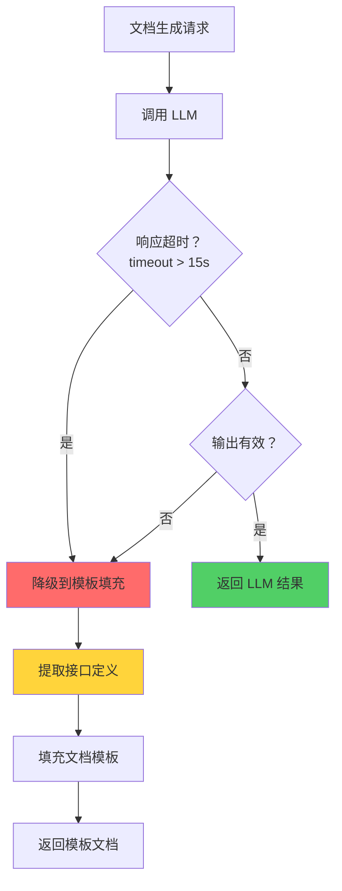

#### 4.14.4 降级具体实现

**模板填充方案：**

1. 使用 OpenAPI/Swagger 解析接口定义
2. 提取路径、方法、参数、响应
3. 填充标准文档模板

#### 4.14.5 降级验证方式

| 验证项 | 验证方法 | 验收标准 |
|-------|---------|---------|
| **信息完整性** | 对比源接口定义 | 完整率 100% |
| **格式正确性** | 验证 Markdown/HTML | 格式正确率 100% |
| **响应时间** | 压测模板引擎 | P95 < 2s |

---

### 4.15 告警智能降噪（P1）

#### 4.15.1 场景描述

- **功能**：AI 识别并抑制重复/无效告警
- **输入**：告警流、历史告警、服务状态
- **输出**：降噪后告警、抑制规则

#### 4.15.2 降级触发条件

| 条件 | 阈值 | 检测方式 |
|------|------|---------|
| **超时** | P95 > 5s | 请求级超时监控 |
| **错误率** | > 15% (5 分钟窗口) | 滑动窗口计数 |
| **服务不可用** | 连续 3 次失败 | 熔断器 |

#### 4.15.3 降级决策树

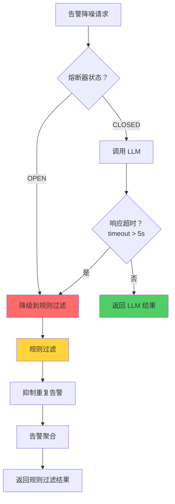

#### 4.15.4 降级具体实现

**规则过滤方案：**

1. **重复告警抑制**
   - 相同告警源 + 相同告警类型
   - 时间窗口内只保留第一条
   - 后续告警计入计数

2. **告警聚合**
   - 相同服务的多条告警聚合成一条
   - 显示告警计数和首次/末次时间

3. **静默规则**
   - 维护已知问题的静默规则
   - 匹配静默规则的告警直接抑制

#### 4.15.5 降级验证方式

| 验证项 | 验证方法 | 验收标准 |
|-------|---------|---------|
| **重复抑制率** | 统计重复告警抑制比例 | > 80% |
| **告警聚合率** | 统计聚合告警比例 | > 50% |
| **响应时间** | 压测过滤引擎 | P95 < 500ms |

---

### 4.16 容量预测建议（P2）

#### 4.16.1 场景描述

- **功能**：AI 预测资源容量需求
- **输入**：历史指标数据、业务增长预测
- **输出**：容量预测、扩容建议

#### 4.16.2 降级触发条件

| 条件 | 阈值 | 检测方式 |
|------|------|---------|
| **超时** | P95 > 15s | 请求级超时监控 |
| **服务不可用** | 连续 3 次失败 | 重试计数器 |

#### 4.16.3 降级决策树


#### 4.16.4 降级具体实现

**时序预测方案：**

1. **趋势外推**
   - 线性回归拟合历史数据
   - 外推预测未来容量需求

2. **季节性分析**
   - 识别日/周/月季节性模式
   - 基于历史同期数据预测

3. **阈值告警**
   - 当预测值超过阈值 80% 时告警
   - 建议提前扩容时间

#### 4.16.5 降级验证方式

| 验证项 | 验证方法 | 验收标准 |
|-------|---------|---------|
| **预测准确率** | 回测历史数据 | MAPE < 15% |
| **响应时间** | 压测预测引擎 | P95 < 3s |

---

## 五、降级系统架构

### 5.1 整体架构

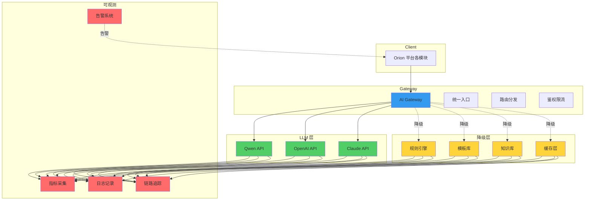

### 5.2 AI Gateway 功能

| 功能 | 说明 |
|------|------|
| **统一入口** | 所有 LLM 调用通过 Gateway 路由 |
| **健康检查** | 周期性检查 LLM 服务健康状态 |
| **熔断管理** | 基于错误率/超时自动熔断 |
| **降级决策** | 根据优先级和触发条件决策降级 |
| **指标采集** | 采集延迟/错误率/降级率等指标 |
| **链路追踪** | 记录完整调用链路用于问题排查 |

### 5.3 降级配置中心

```yaml
# 降级配置示例
degradation:
  # 全局配置
  global:
    default_timeout_ms: 10000
    default_retry_count: 2
    circuit_breaker_threshold: 0.5
    
  # 场景配置
  scenarios:
    ai-code-review:
      priority: P1
      timeout_ms: 15000
      retry_count: 2
      fallback: rule-engine
      trigger:
        - type: timeout
          threshold_ms: 15000
        - type: error_rate
          threshold: 0.10
          window_minutes: 5
        - type: confidence
          threshold: 0.6
          
    aegis-risk-assess:
      priority: P0
      timeout_ms: 2000
      retry_count: 1
      fallback: rule-engine + baseline
      trigger:
        - type: timeout
          threshold_ms: 2000
        - type: error_rate
          threshold: 0.05
          window_minutes: 5
        - type: circuit_breaker
          consecutive_failures: 3
```

---

## 六、降级监控与告警

### 6.1 监控指标

| 指标名称 | 类型 | 告警规则 | 说明 |
|---------|------|---------|------|
| `llm_latency_p95` | Gauge | > 阈值 | LLM 响应延迟 P95 |
| `llm_error_rate` | Gauge | > 10% | LLM 错误率 |
| `degradation_rate` | Gauge | > 5% | 降级触发率 |
| `circuit_breaker_state` | Gauge | OPEN | 熔断器状态 |
| `fallback_usage_count` | Counter | - | 降级使用次数 |
| `llm_token_usage` | Counter | > 预算 | Token 使用量 |

### 6.2 告警分级

| 级别 | 触发条件 | 响应方式 |
|-----|---------|---------|
| **P0** | 降级率 > 20% 或 P0 服务降级 | 立即通知 + 自动扩容 |
| **P1** | 降级率 > 10% | 5 分钟内通知 |
| **P2** | 降级率 > 5% | 每小时汇总通知 |
| **P3** | 单次降级事件 | 日报汇总 |

### 6.3 降级事件记录

```json
{
  "event_id": "deg-20260410-001",
  "timestamp": "2026-04-10T14:30:00Z",
  "scenario": "ai-code-review",
  "priority": "P1",
  "trigger_type": "timeout",
  "trigger_value": "15234ms > 15000ms",
  "fallback_used": "rule-engine",
  "request_id": "req-abc123",
  "user_id": "user-zhangsan",
  "latency_ms": 15234,
  "recovery_time": "2026-04-10T14:35:00Z"
}
```

---

## 七、降级验证清单

### 7.1 验证场景

| 场景 | 验证方法 | 验收标准 |
|------|---------|---------|
| **正常模式** | LLM 服务健康，无降级 | 返回 LLM 结果 |
| **超时降级** | 模拟 LLM 延迟 | 超时后降级到规则引擎 |
| **错误率降级** | 模拟 LLM 错误 | 错误率超标后降级 |
| **熔断触发** | 模拟连续失败 | 熔断器打开，直接降级 |
| **置信度降级** | 模拟低置信度输出 | 降级到规则补充 |
| **恢复验证** | 恢复 LLM 服务 | 自动切回正常模式 |

### 7.2 验证流程


---

## 八、总结

### 8.1 功能清单

| 功能 | 状态 | 说明 |
|------|------|------|
| LLM 分级治理 | ✅ | P0/P1/P2三级优先级 |
| 16 个场景降级方案 | ✅ | 详细触发条件和实现 |
| 降级决策树 | ✅ | Mermaid 流程图 |
| 降级验证方式 | ✅ | 每个场景都有验证方法 |
| 监控告警设计 | ✅ | 指标 + 告警规则 |
| 配置中心设计 | ✅ | YAML 配置示例 |

### 8.2 实施建议

1. **分阶段实施**
   - 第一阶段：P0 场景（风险评估、自动排单、修复建议）
   - 第二阶段：P1 场景（Code Review、根因诊断、工单分类）
   - 第三阶段：P2 场景（日志生成、Pipeline 生成等）

2. **配置驱动**
   - 所有降级逻辑配置化
   - 支持运行时动态调整

3. **可观测性优先**
   - 先建设监控再上线
   - 确保降级行为可追踪

---

_文档版本：v1.0 | 创建日期：2026-04-10 | 状态：设计完成_
