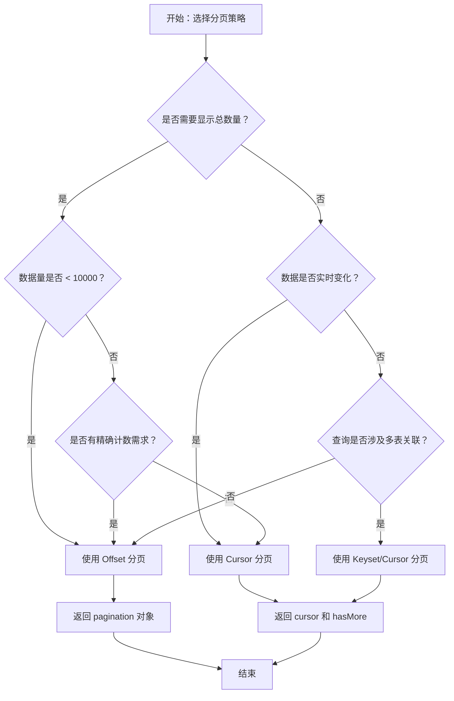
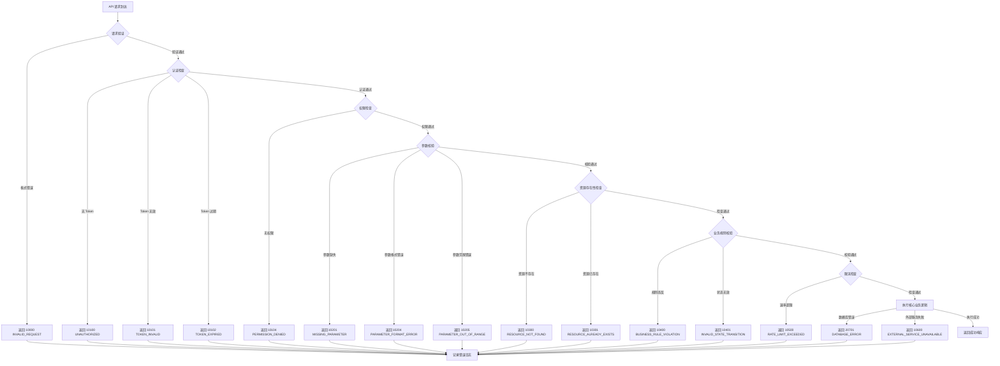
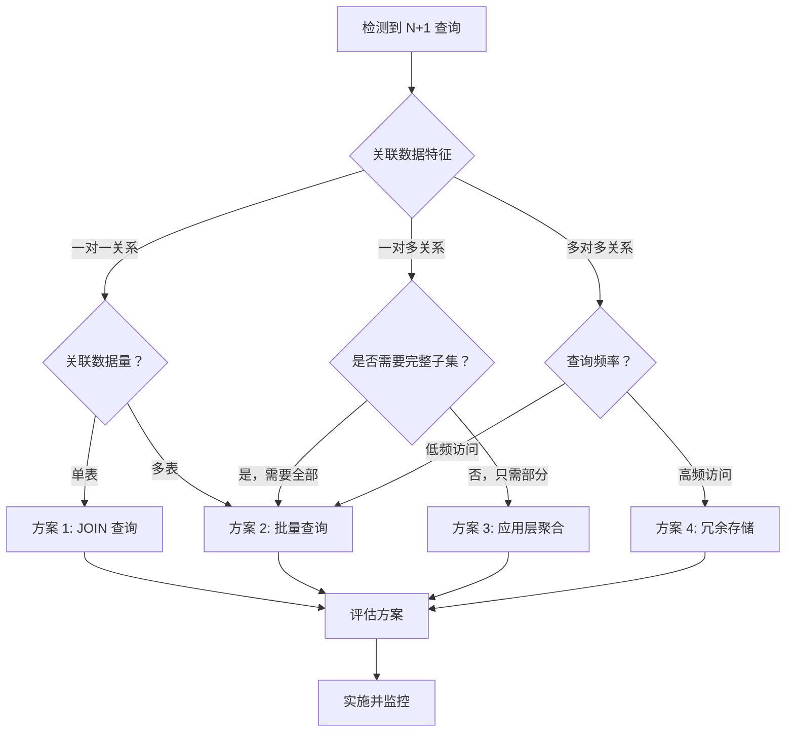
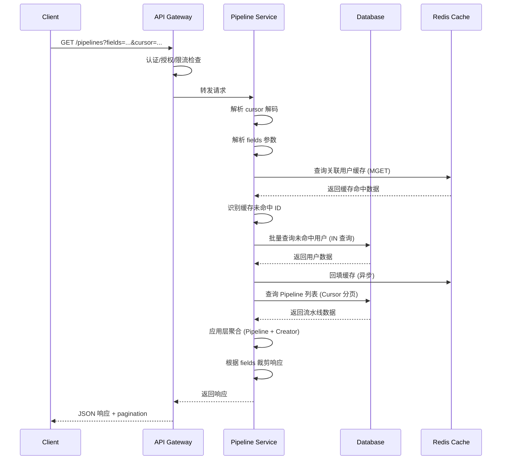

# Orion API 分页与错误码规范

> 版本：v1.0  
> 创建日期：2026-04-10  
> 适用范围：所有 REST/GraphQL API

---

## 一、背景与目标

### 1.1 问题背景

后端评审发现当前 API 设计存在以下缺陷：

| 问题 | 描述 | 影响 |
|------|------|------|
| 分页策略混用 | Offset 与 Cursor 分页无明确区分 | 大数据量场景性能差、实时数据不一致 |
| 错误码设计笼统 | 错误分类粒度粗，难以定位问题 | 客户端处理困难，调试效率低 |
| N+1 查询问题 | 列表查询伴随多次数据库往返 | 响应延迟高，数据库负载大 |

### 1.2 设计目标

- **分页策略分离**：根据数据特性选择合适的分页方案
- **错误码精细化**：二级分类 + 明确语义，支持精准处理
- **查询优化**：消除 N+1 问题，提升批量查询性能
- **标准化**：统一的响应结构与处理流程

---

## 二、分页策略设计

### 2.1 分页类型对比

| 分页类型 | 适用场景 | 优点 | 缺点 |
|----------|----------|------|------|
| **Offset 分页** | 静态数据、总数量需求、任意页跳转 | 实现简单、支持页码跳转 | 深分页性能差、数据可能重复/遗漏 |
| **Cursor 分页** | 实时数据、大数据量、流式场景 | 高性能、数据一致性好 | 不支持随机页跳转 |

### 2.2 分页决策树



### 2.3 分页策略选择矩阵

| 资源类型 | 数据特性 | 推荐分页 | 理由 |
|----------|----------|----------|------|
| Pipeline 列表 | 静态配置 | Offset | 支持页码跳转，总数固定 |
| Pipeline Run 历史 | 实时增长 | Cursor | 数据持续追加，避免重复 |
| 审批列表 | 状态频繁变化 | Cursor | 避免审批过程中状态变化导致数据错乱 |
| 部署历史 | 追加型数据 | Cursor | 高性能，支持流式加载 |
| 效能指标 | 聚合计算 | Offset | 需要显示总记录数 |
| 通知列表 | 高频写入 | Cursor | 避免新通知插入导致分页偏移 |
| 工具市场 | 相对稳定 | Offset | 支持任意页浏览 |
| 日志流 | 实时流式 | Cursor | 天然适合游标遍历 |

### 2.4 Offset 分页规范

**请求参数**：

| 参数 | 类型 | 默认值 | 必填 | 说明 |
|------|------|--------|------|------|
| `page` | integer | 1 | 否 | 页码，从 1 开始 |
| `page_size` | integer | 20 | 否 | 每页数量，最大 100 |

**响应结构**：

```json
{
  "code": 0,
  "message": "success",
  "data": {
    "items": [...],
    "pagination": {
      "type": "offset",
      "page": 1,
      "page_size": 20,
      "total": 150,
      "total_pages": 8,
      "has_next": true,
      "has_prev": false
    }
  },
  "meta": {
    "requestId": "req-abc123",
    "timestamp": "2026-04-10T09:00:00Z"
  }
}
```

**Offset 分页 SQL 优化**：

```
-- 深分页优化（使用子查询）
SELECT * FROM resources
WHERE id IN (
  SELECT id FROM resources
  WHERE team_id = ?
  ORDER BY created_at DESC
  LIMIT 20 OFFSET 10000
)
ORDER BY created_at DESC;

-- 或使用游标优化（当有连续 ID 时）
SELECT * FROM resources
WHERE id < last_seen_id
ORDER BY id DESC
LIMIT 20;
```

### 2.5 Cursor 分页规范

**请求参数**：

| 参数 | 类型 | 默认值 | 必填 | 说明 |
|------|------|--------|------|------|
| `cursor` | string | - | 否 | 游标（Base64 编码的 JSON） |
| `limit` | integer | 20 | 否 | 每页数量，最大 100 |

**游标格式**：

```
# 游标内容（JSON → Base64）
{
  "sort_key": "created_at",
  "sort_value": "2026-04-10T09:00:00Z",
  "id": "pl-123"
}

# 编码后
cursor = eyJzb3J0X2tleSI6ImNyZWF0ZWRfYXQiLCJzb3J0X3ZhbHVlIjoiMjAyNi0wNC0xMFQwOTowMDowMFoiLCJpZCI6InBsLTEyMyJ9
```

**响应结构**：

```json
{
  "code": 0,
  "message": "success",
  "data": {
    "items": [...],
    "pagination": {
      "type": "cursor",
      "cursor": "eyJzb3J0X2tleSI6ImNyZWF0ZWRfYXQiLCJzb3J0X3ZhbHVlIjoiMjAyNi0wNC0xMFQwOTowMDowMFoiLCJpZCI6InBsLTEyMyJ9",
      "has_more": true,
      "has_prev": false,
      "prev_cursor": "eyJ...abc"
    }
  },
  "meta": {
    "requestId": "req-abc123",
    "timestamp": "2026-04-10T09:00:00Z"
  }
}
```

**Cursor 分页 SQL**：

```sql
-- 下一页
SELECT * FROM resources
WHERE (created_at, id) < (:cursor_time, :cursor_id)
ORDER BY created_at DESC, id DESC
LIMIT :limit;

-- 上一页
SELECT * FROM resources
WHERE (created_at, id) > (:cursor_time, :cursor_id)
ORDER BY created_at ASC, id ASC
LIMIT :limit;
```

### 2.6 分页响应结构标准化

**统一分页接口**：

```typescript
interface PaginatedResponse<T> {
  code: number;
  message: string;
  data: {
    items: T[];
    pagination: OffsetPagination | CursorPagination;
  };
  meta: ResponseMeta;
}

interface OffsetPagination {
  type: 'offset';
  page: number;
  page_size: number;
  total: number;
  total_pages: number;
  has_next: boolean;
  has_prev: boolean;
}

interface CursorPagination {
  type: 'cursor';
  cursor?: string;      // 下一页游标
  prev_cursor?: string; // 上一页游标
  has_more: boolean;
  has_prev: boolean;
}
```

---

## 三、错误码二级分类设计

### 3.1 错误码结构

```
错误码格式：XYYZZ
├─ X: 系统类别（1=客户端错误，2=服务端错误）
├─ YY: 一级分类（错误大类）
└─ ZZ: 二级分类（具体错误）

示例：
  10101 → 1(客户端) + 01(认证授权) + 01(未认证)
  10205 → 1(客户端) + 02(参数错误) + 05(参数缺失)
  20103 → 2(服务端) + 01(数据库) + 03(连接超时)
```

### 3.2 错误码一级分类表

| 一级分类代码 | 分类名称 | 代码范围 | 说明 |
|-------------|----------|----------|------|
| 00 | 通用错误 | X0000-X0099 | 无法归类的通用错误 |
| 01 | 认证授权 | X0100-X0199 | Token、权限相关 |
| 02 | 参数错误 | X0200-X0299 | 请求参数校验失败 |
| 03 | 资源错误 | X0300-X0399 | 资源不存在/冲突 |
| 04 | 业务规则 | X0400-X0499 | 业务逻辑校验失败 |
| 05 | 限流配额 | X0500-X0599 | 速率限制、配额超限 |
| 06 | 外部依赖 | X0600-X0699 | 第三方服务调用失败 |
| 07 | 系统内部 | X0700-X0799 | 服务端内部错误 |

### 3.3 错误码二级分类详表

#### 通用错误 (X0000-X0099)

| 错误码 | 错误名称 | HTTP 状态 | 说明 | 处理建议 |
|--------|----------|-----------|------|----------|
| 10000 | INVALID_REQUEST | 400 | 请求格式无效 | 检查请求体 JSON 格式 |
| 10001 | METHOD_NOT_ALLOWED | 405 | HTTP 方法不支持 | 使用正确的 HTTP 方法 |
| 10002 | CONTENT_TYPE_UNSUPPORTED | 415 | Content-Type 不支持 | 使用 application/json |
| 10003 | REQUEST_TOO_LARGE | 413 | 请求体过大 | 减小请求大小 |
| 10004 | MALFORMED_JSON | 400 | JSON 解析失败 | 检查 JSON 语法 |

#### 认证授权错误 (X0100-X0199)

| 错误码 | 错误名称 | HTTP 状态 | 说明 | 处理建议 |
|--------|----------|-----------|------|----------|
| 10100 | UNAUTHORIZED | 401 | 未提供认证信息 | 添加 Authorization header |
| 10101 | TOKEN_INVALID | 401 | Token 无效 | 重新获取 Token |
| 10102 | TOKEN_EXPIRED | 401 | Token 已过期 | 刷新或重新获取 Token |
| 10103 | TOKEN_REVOKED | 401 | Token 已撤销 | 重新认证 |
| 10104 | PERMISSION_DENIED | 403 | 权限不足 | 申请对应权限 |
| 10105 | RESOURCE_FORBIDDEN | 403 | 资源无访问权限 | 检查资源归属 |
| 10106 | API_KEY_INVALID | 401 | API Key 无效 | 检查 API Key 配置 |
| 10107 | API_KEY_EXPIRED | 401 | API Key 已过期 | 更新 API Key |
| 10108 | SIGNATURE_INVALID | 401 | 签名验证失败 | 检查签名算法 |

#### 参数错误 (X0200-X0299)

| 错误码 | 错误名称 | HTTP 状态 | 说明 | 处理建议 |
|--------|----------|-----------|------|----------|
| 10200 | INVALID_PARAMETER | 400 | 参数值无效 | 检查参数值格式 |
| 10201 | MISSING_PARAMETER | 400 | 参数缺失 | 补充必填参数 |
| 10202 | UNKNOWN_PARAMETER | 400 | 未知参数 | 移除不支持的参数 |
| 10203 | PARAMETER_TYPE_MISMATCH | 400 | 参数类型不匹配 | 检查参数类型 |
| 10204 | PARAMETER_FORMAT_ERROR | 400 | 参数格式错误 | 如日期格式应为 ISO8601 |
| 10205 | PARAMETER_OUT_OF_RANGE | 400 | 参数超出范围 | 检查参数取值范围 |
| 10206 | PARAMETER_LENGTH_EXCEEDED | 400 | 参数长度超限 | 缩短参数值 |
| 10207 | PARAMETER_DUPLICATE | 400 | 参数重复 | 移除重复参数 |
| 10208 | ENUM_VALUE_INVALID | 400 | 枚举值无效 | 使用允许的枚举值 |

#### 资源错误 (X0300-X0399)

| 错误码 | 错误名称 | HTTP 状态 | 说明 | 处理建议 |
|--------|----------|-----------|------|----------|
| 10300 | RESOURCE_NOT_FOUND | 404 | 资源不存在 | 检查资源 ID |
| 10301 | RESOURCE_ALREADY_EXISTS | 409 | 资源已存在 | 使用不同标识符 |
| 10302 | RESOURCE_DELETED | 410 | 资源已删除 | 资源无法恢复 |
| 10303 | RESOURCE_LOCKED | 423 | 资源被锁定 | 等待锁释放 |
| 10304 | RESOURCE_CONFLICT | 409 | 资源冲突 | 解决冲突后重试 |
| 10305 | DEPENDENT_RESOURCES_EXIST | 409 | 存在依赖资源 | 先删除依赖资源 |

#### 业务规则错误 (X0400-X0499)

| 错误码 | 错误名称 | HTTP 状态 | 说明 | 处理建议 |
|--------|----------|-----------|------|----------|
| 10400 | BUSINESS_RULE_VIOLATION | 400 | 违反业务规则 | 查看 details 了解具体规则 |
| 10401 | INVALID_STATE_TRANSITION | 400 | 状态转换无效 | 检查当前状态允许的操作 |
| 10402 | PREREQUISITE_NOT_MET | 400 | 前置条件不满足 | 完成前置操作 |
| 10403 | QUOTA_EXCEEDED | 400 | 配额不足 | 提升配额或清理资源 |
| 10404 | OPERATION_TIMEOUT | 408 | 操作超时 | 稍后重试 |
| 10405 | CIRCULAR_DEPENDENCY | 400 | 循环依赖 | 检查依赖关系 |
| 10406 | INVALID_WORKFLOW | 400 | 工作流无效 | 检查工作流配置 |

#### 限流配额错误 (X0500-X0599)

| 错误码 | 错误名称 | HTTP 状态 | 说明 | 处理建议 |
|--------|----------|-----------|------|----------|
| 10500 | RATE_LIMIT_EXCEEDED | 429 | 请求速率超限 | 降低请求频率 |
| 10501 | QUOTA_EXHAUSTED | 429 | 配额已用尽 | 等待配额重置 |
| 10502 | CONCURRENT_LIMIT_EXCEEDED | 429 | 并发数超限 | 减少并发请求 |
| 10503 | BURST_LIMIT_EXCEEDED | 429 | 突发流量超限 | 平滑请求分布 |

#### 外部依赖错误 (X0600-X0699)

| 错误码 | 错误名称 | HTTP 状态 | 说明 | 处理建议 |
|--------|----------|-----------|------|----------|
| 10600 | EXTERNAL_SERVICE_UNAVAILABLE | 502 | 外部服务不可用 | 稍后重试 |
| 10601 | EXTERNAL_SERVICE_TIMEOUT | 504 | 外部服务超时 | 检查外部服务状态 |
| 10602 | EXTERNAL_SERVICE_ERROR | 502 | 外部服务返回错误 | 查看外部服务日志 |
| 10603 | THIRD_PARTY_API_LIMIT | 429 | 第三方 API 限流 | 降低调用频率 |

#### 系统内部错误 (X0700-X0799)

| 错误码 | 错误名称 | HTTP 状态 | 说明 | 处理建议 |
|--------|----------|-----------|------|----------|
| 20700 | INTERNAL_ERROR | 500 | 内部服务器错误 | 联系运维，提供 requestId |
| 20701 | DATABASE_ERROR | 500 | 数据库错误 | 检查数据库状态 |
| 20702 | CACHE_ERROR | 500 | 缓存服务错误 | 检查缓存服务 |
| 20703 | QUEUE_ERROR | 500 | 消息队列错误 | 检查 MQ 状态 |
| 20704 | SERVICE_UNAVAILABLE | 503 | 服务暂时不可用 | 稍后重试 |
| 20705 | SERVICE_OVERLOADED | 503 | 服务过载 | 稍后重试 |

### 3.4 错误处理流程图



### 3.5 错误响应标准结构

```json
{
  "code": 10201,
  "message": "参数缺失",
  "error": "MISSING_PARAMETER",
  "details": {
    "field": "pipeline_id",
    "reason": "此字段为必填项",
    "position": "query_parameter"
  },
  "meta": {
    "requestId": "req-abc123",
    "timestamp": "2026-04-10T09:00:00Z",
    "path": "/api/v1/pipelines",
    "method": "GET"
  },
  "help_url": "https://orion.internal/docs/errors/10201"
}
```

### 3.6 错误码映射表（HTTP 状态 → 业务错误码）

| HTTP 状态 | 业务错误码 | 使用场景 |
|----------|-----------|----------|
| 400 | 102xx | 参数校验失败 |
| 401 | 101xx | 认证失败 |
| 403 | 10104 | 权限不足 |
| 404 | 10300 | 资源不存在 |
| 405 | 10001 | 方法不允许 |
| 408 | 10404 | 请求超时 |
| 409 | 103xx | 资源冲突 |
| 410 | 10302 | 资源已删除 |
| 413 | 10003 | 请求体过大 |
| 415 | 10002 | 不支持的媒体类型 |
| 422 | 104xx | 业务规则违反 |
| 423 | 10303 | 资源被锁定 |
| 429 | 105xx | 限流/配额 |
| 500 | 207xx | 内部错误 |
| 502 | 106xx | 网关/外部服务错误 |
| 503 | 20704/20705 | 服务不可用/过载 |
| 504 | 10601 | 网关超时 |

---

## 四、N+1 查询解决方案

### 4.1 N+1 问题识别

**典型场景**：

```
场景：获取流水线列表，每条流水线需要查询创建者信息

问题查询模式：
1. SELECT * FROM pipelines WHERE team_id = ?     -- 1 次查询
2. SELECT * FROM users WHERE id = ?              -- N 次查询（每条流水线一次）
3. SELECT * FROM users WHERE id = ?
...

总查询次数：1 + N（N 为流水线数量）
```

**影响**：
- 数据库连接池耗尽
- 网络往返延迟累积
- 响应时间随数据量线性增长

### 4.2 N+1 解决方案决策树



### 4.3 解决方案详解

#### 方案 1：JOIN 查询（一对一/紧密关联）

**适用场景**：
- 一对一关系（如 Pipeline → Creator）
- 关联表数据量小
- 需要强一致性

**实现方式**：

```sql
-- 优化前：N+1 查询
SELECT * FROM pipelines WHERE team_id = ?;
-- 对每条 pipeline 执行：SELECT * FROM users WHERE id = ?;

-- 优化后：JOIN 查询
SELECT 
  p.id, p.name, p.status, p.created_at,
  u.id as creator_id, u.name as creator_name, u.avatar as creator_avatar
FROM pipelines p
LEFT JOIN users u ON p.creator_id = u.id
WHERE p.team_id = ?
ORDER BY p.created_at DESC
LIMIT 20 OFFSET 0;
```

**优缺点**：

| 优点 | 缺点 |
|------|------|
| 单次查询，网络开销最小 | 大表 JOIN 性能可能下降 |
| 强一致性保证 | 结果集可能因笛卡尔积膨胀 |
| 实现简单，无需额外逻辑 | 难以利用应用层缓存 |

---

#### 方案 2：批量查询（IN 查询 / DataLoader 模式）

**适用场景**：
- 一对多关系（如 Pipeline → Stages）
- 关联数据量中等
- 需要灵活的数据加载

**实现方式**：

```sql
-- 步骤 1：获取主表数据
SELECT id, name, status, creator_id FROM pipelines WHERE team_id = ?;
-- 返回：[{id: 1, creator_id: 10}, {id: 2, creator_id: 20}, ...]

-- 步骤 2：批量查询关联数据
SELECT id, name, avatar FROM users WHERE id IN (10, 20, 30, ...);

-- 步骤 3：应用层聚合
-- 将用户数据按 ID 映射回对应的 Pipeline
```

**DataLoader 模式流程**：

```
1. 收集阶段：批量收集所有需要加载的 ID
   - pipeline1 → need user_id: 10
   - pipeline2 → need user_id: 20
   - pipeline3 → need user_id: 10 (重复，去重)
   
2. 去重：[10, 20]

3. 批量加载：SELECT * FROM users WHERE id IN (10, 20)

4. 分发：将结果映射回请求源头
```

**优缺点**：

| 优点 | 缺点 |
|------|------|
| 避免笛卡尔积膨胀 | 需要额外的应用层逻辑 |
| 可充分利用缓存 | 存在短暂不一致窗口 |
| 可并行加载多个关联 | 实现复杂度较高 |

---

#### 方案 3：冗余存储（空间换时间）

**适用场景**：
- 高频访问的关联数据
- 关联数据变更频率低
- 对查询性能要求极高

**实现方式**：

```sql
-- 在 pipelines 表中冗余创建者信息
ALTER TABLE pipelines ADD COLUMN creator_name VARCHAR(100);
ALTER TABLE pipelines ADD COLUMN creator_avatar VARCHAR(255);

-- 查询时无需 JOIN
SELECT id, name, status, creator_name, creator_avatar 
FROM pipelines WHERE team_id = ?;
```

**数据一致性保障**：

| 策略 | 实现方式 | 适用场景 |
|------|----------|----------|
| 同步更新 | 用户信息变更时同步更新冗余字段 | 写少读多 |
| 异步更新 | 通过消息队列异步刷新冗余数据 | 可接受短暂不一致 |
| 定期刷新 | 定时任务校验并修复不一致 | 容忍一定延迟 |
| 双写校验 | 写入时同时写主表和冗余，校验一致性 | 高一致性要求 |

**优缺点**：

| 优点 | 缺点 |
|------|------|
| 查询性能最优（零 JOIN） | 存储空间增加 |
| 实现简单 | 存在数据一致性风险 |
| 降低数据库负载 | 写入逻辑复杂化 |

---

#### 方案 4：应用层缓存

**适用场景**：
- 关联数据读多写少
- 可接受短暂不一致
- 热点数据集中

**实现方式**：

```
查询流程：
1. 查询 pipelines 列表
2. 提取所有 creator_id
3. 批量查询 Redis 缓存：MGET user:10, user:20, ...
4. 对缓存未命中 ID，批量从 DB 查询并回填缓存
5. 应用层聚合结果
```

**缓存策略**：

| 配置项 | 推荐值 | 说明 |
|--------|--------|------|
| TTL | 5-30 分钟 | 根据数据变更频率调整 |
| 缓存穿透保护 | 布隆过滤器 | 防止查询不存在的数据 |
| 热点数据 | 永不过期 + 异步刷新 | 如系统管理员信息 |
| 缓存更新 | 延迟双删 | 写 DB 后删缓存，延迟后再次删除 |

---

### 4.4 方案选择矩阵

| 场景 | 推荐方案 | 理由 |
|------|----------|------|
| Pipeline → Creator（一对一） | JOIN | 关系紧密，结果集不膨胀 |
| Pipeline → Stages（一对多） | 批量查询 | 避免笛卡尔积 |
| Pipeline → Runs（一对多，大数据量） | 分开查询 | 数据量大，通常分页加载 |
| Resource → Owner（高频访问） | 冗余存储 | 读多写少，性能关键 |
| User → Team（多对多） | JOIN 或批量查询 | 根据是否需要完整集合 |
| Approval → Approvers（动态变化） | 批量查询 + 缓存 | 状态频繁变化，需平衡一致性 |

### 4.5 N+1 检测与监控

**检测指标**：

| 指标 | 告警阈值 | 说明 |
|------|----------|------|
| 单请求 DB 查询数 | > 10 次 | 可能存在 N+1 |
| 循环内查询 | 任何次数 | 代码审查重点关注 |
| 平均查询延迟/总延迟 | < 50% | 网络/应用层开销过大 |

**SQL 日志分析**：

```sql
-- 识别重复查询模式
SELECT 
  query_pattern,
  COUNT(*) as execution_count,
  AVG(execution_time) as avg_time
FROM query_logs
WHERE request_id = ?
GROUP BY query_pattern
HAVING COUNT(*) > 5;
```

---

## 五、Fields 参数支持（字段裁剪）

### 5.1 功能描述

允许客户端指定返回字段，减少不必要的数据传输，提升响应速度。

**核心价值**：
- 减少网络传输量（尤其对移动端/低带宽场景）
- 降低序列化/反序列化开销
- 提升列表页渲染性能

### 5.2 请求参数规范

| 参数 | 类型 | 必填 | 说明 |
|------|------|------|------|
| `fields` | string | 否 | 逗号分隔的字段列表 |
| `expand` | string | 否 | 需要展开的关联资源 |

**语法支持**：

| 语法 | 示例 | 说明 |
|------|------|------|
| 简单字段 | `fields=id,name,status` | 返回指定顶层字段 |
| 嵌套字段 | `fields=id,name,creator(id,name)` | 返回嵌套对象指定字段 |
| 通配符 | `fields=id,name,*` | 返回所有字段 + 指定嵌套展开 |
| 排除字段 | `fields=-description,-metadata` | 排除指定字段（前缀 -） |

### 5.3 响应示例

**完整响应**：

```json
{
  "code": 0,
  "message": "success",
  "data": {
    "items": [
      {
        "id": "pl-123",
        "name": "Deploy Pipeline",
        "description": "Production deployment workflow",
        "status": "active",
        "creator": {
          "id": "u-001",
          "name": "张三",
          "email": "zhangsan@example.com",
          "avatar": "https://..."
        },
        "created_at": "2026-04-01T10:00:00Z",
        "updated_at": "2026-04-10T09:00:00Z",
        "metadata": {
          "version": "1.0",
          "tags": ["prod", "critical"]
        }
      }
    ]
  }
}
```

**使用 fields 裁剪后**：

```
GET /api/v1/pipelines?fields=id,name,status,creator(id,name)
```

```json
{
  "code": 0,
  "message": "success",
  "data": {
    "items": [
      {
        "id": "pl-123",
        "name": "Deploy Pipeline",
        "status": "active",
        "creator": {
          "id": "u-001",
          "name": "张三"
        }
      }
    ]
  }
}
```

### 5.4 字段权限过滤

**规则**：
- `fields` 参数只能请求用户有权限查看的字段
- 敏感字段（如 email、phone）需要额外权限
- 无权字段自动过滤，不返回错误

```
GET /api/v1/users?fields=id,name,email,salary

# 如果用户无 salary 权限：
{
  "data": {
    "items": [
      {
        "id": "u-001",
        "name": "张三",
        "email": "zhangsan@example.com"
        # salary 字段被自动过滤
      }
    ]
  }
}
```

### 5.5 数据库层优化

**实现策略**：

```sql
-- 根据 fields 动态构建 SELECT 子句
-- 请求：fields=id,name,creator(id,name)

SELECT 
  p.id,
  p.name,
  p.status,
  COALESCE(
    json_build_object('id', u.id, 'name', u.name),
    NULL
  ) as creator
FROM pipelines p
LEFT JOIN users u ON p.creator_id = u.id
WHERE p.team_id = ?;
```

**字段映射表**：

| 请求字段 | 数据库列 | 转换函数 |
|----------|----------|----------|
| id | p.id | - |
| name | p.name | - |
| creator.id | u.id | json_build_object |
| creator.name | u.name | json_build_object |

---

## 六、综合应用案例

### 6.1 流水线列表查询（完整场景）

**需求**：
- 获取团队下的流水线列表
- 需要显示创建者信息
- 实时数据，避免重复
- 只展示必要字段

**请求**：

```http
GET /api/v1/pipelines?team_id=team-001&cursor=eyJpZCI6InBsLTEwMCJ9&limit=20&fields=id,name,status,creator(id,name),created_at

Authorization: Bearer eyJ...
Accept: application/json
```

**处理流程**：



**响应**：

```json
{
  "code": 0,
  "message": "success",
  "data": {
    "items": [
      {
        "id": "pl-101",
        "name": "Build Pipeline",
        "status": "active",
        "created_at": "2026-04-10T08:00:00Z",
        "creator": {
          "id": "u-001",
          "name": "张三"
        }
      },
      {
        "id": "pl-102",
        "name": "Test Pipeline",
        "status": "active",
        "created_at": "2026-04-10T07:00:00Z",
        "creator": {
          "id": "u-002",
          "name": "李四"
        }
      }
    ],
    "pagination": {
      "type": "cursor",
      "cursor": "eyJpZCI6InBsLTEwMiJ9",
      "has_more": true,
      "has_prev": false
    }
  },
  "meta": {
    "requestId": "req-xyz789",
    "timestamp": "2026-04-10T09:00:00Z",
    "timings": {
      "db_query_ms": 15,
      "cache_lookup_ms": 3,
      "total_ms": 25
    }
  }
}
```

---

## 七、实施检查清单

### 7.1 分页实施检查

- [ ] 所有列表接口明确指定分页类型（Offset/Cursor）
- [ ] Offset 分页返回 total 和 total_pages
- [ ] Cursor 分页返回 cursor 和 has_more
- [ ] page_size/limit 有合理上限（默认 20，最大 100）
- [ ] Cursor 使用 Base64 编码的不透明字符串
- [ ] 支持上一页导航（prev_cursor）
- [ ] 深分页场景（Offset > 10000）有性能优化

### 7.2 错误码实施检查

- [ ] 所有错误使用二级分类编码
- [ ] 错误响应包含 error 名称码
- [ ] 错误响应包含 details 详情
- [ ] 错误响应包含 requestId
- [ ] 提供错误文档 URL（help_url）
- [ ] HTTP 状态码与业务错误码映射正确
- [ ] 敏感信息不泄露（如 SQL 详情）

### 7.3 N+1 优化检查

- [ ] 代码审查识别循环内查询
- [ ] 列表接口使用 JOIN 或批量查询
- [ ] 关联数据加载使用 DataLoader 模式
- [ ] 热点数据配置缓存策略
- [ ] 监控单请求查询次数
- [ ] 慢查询日志分析 N+1 模式

### 7.4 Fields 参数检查

- [ ] 支持简单字段选择
- [ ] 支持嵌套字段选择
- [ ] 支持字段权限过滤
- [ ] 无效字段名不报错（静默忽略）
- [ ] 数据库查询根据 fields 裁剪 SELECT

---

## 八、附录

### 8.1 错误码速查表

| 错误码 | 名称 | 含义 |
|--------|------|------|
| 10000 | INVALID_REQUEST | 无效请求 |
| 10100 | UNAUTHORIZED | 未认证 |
| 10101 | TOKEN_INVALID | Token 无效 |
| 10102 | TOKEN_EXPIRED | Token 过期 |
| 10104 | PERMISSION_DENIED | 权限不足 |
| 10200 | INVALID_PARAMETER | 参数无效 |
| 10201 | MISSING_PARAMETER | 参数缺失 |
| 10204 | PARAMETER_FORMAT_ERROR | 参数格式错误 |
| 10300 | RESOURCE_NOT_FOUND | 资源不存在 |
| 10301 | RESOURCE_ALREADY_EXISTS | 资源已存在 |
| 10400 | BUSINESS_RULE_VIOLATION | 业务规则违反 |
| 10500 | RATE_LIMIT_EXCEEDED | 速率超限 |
| 20700 | INTERNAL_ERROR | 内部错误 |
| 20701 | DATABASE_ERROR | 数据库错误 |

### 8.2 参考规范

- [RFC 7807 - Problem Details for HTTP APIs](https://tools.ietf.org/html/rfc7807)
- [JSON:API - Fetching Resources](https://jsonapi.org/format/#fetching)
- [GraphQL - Field Selection](https://graphql.org/learn/queries/#fields)
- [Google API Design Guide - Pagination](https://cloud.google.com/apis/design/design_patterns#pagination)

---

_文档版本：v1.0_  
_创建日期：2026-04-10_  
_状态：草稿，待评审_
