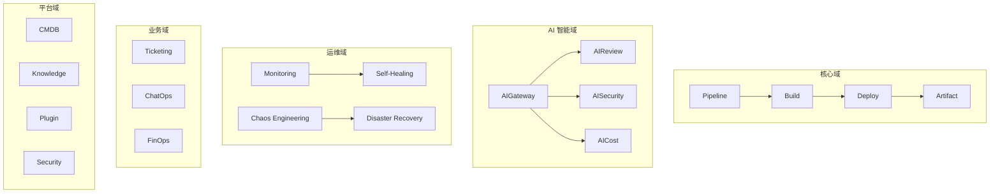
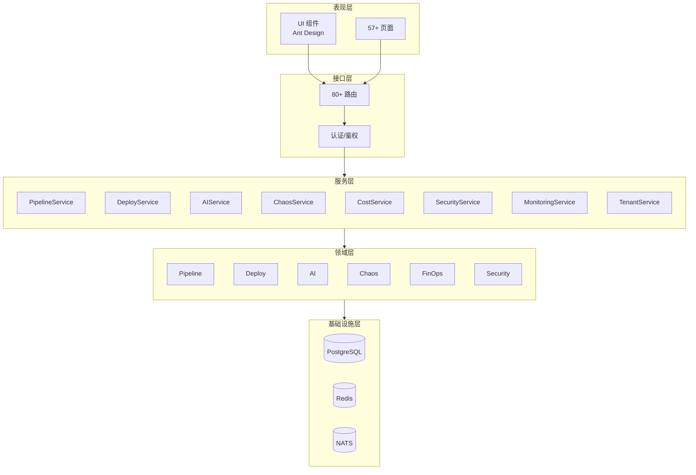
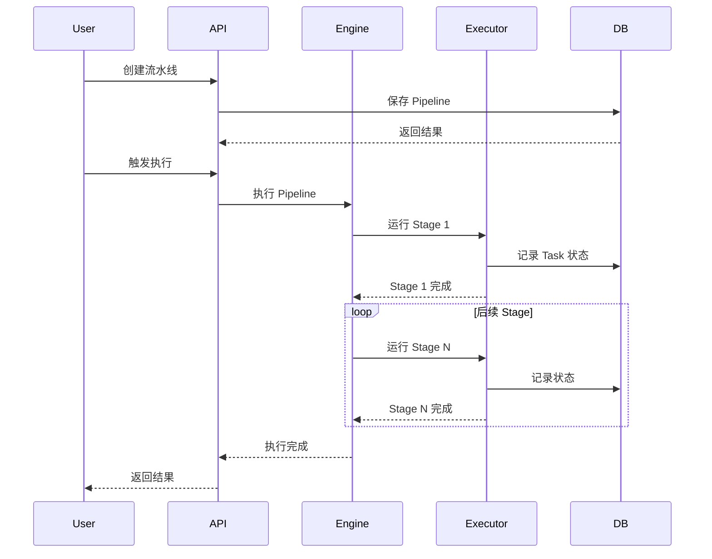
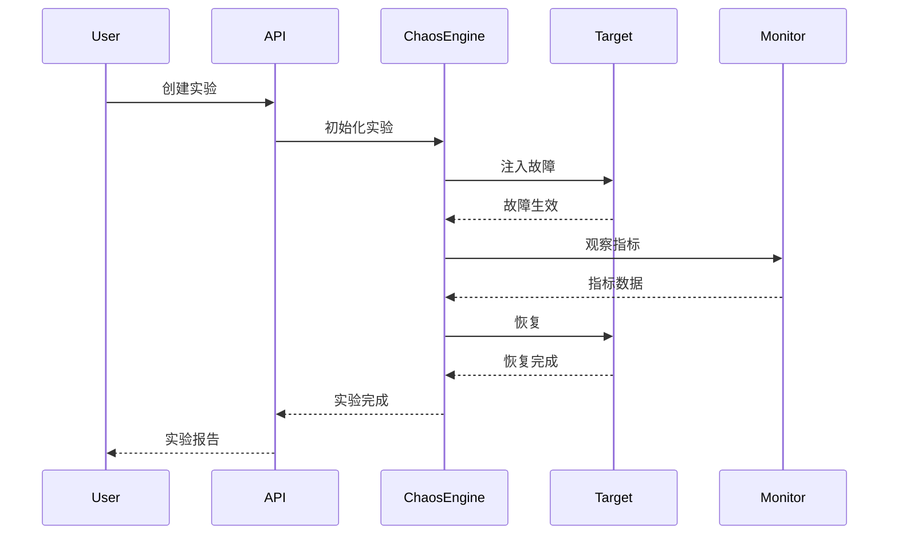

# Orion 系统功能架构分析

> 更新日期：2026-05-06 | 版本：v6.0

---

## 一、系统功能要素分析

基于系统功能设计要素，对 Orion 平台进行完整分析：

### 1.1 核心功能层

| 功能域 | 核心功能 | 业务规则 | 流程编排 |
|--------|----------|----------|----------|
| **流水线** | Pipeline CRUD、版本管理、模板 | 状态机、预算控制 | PipelineEngine → StageExecutor → TaskRunner |
| **部署** | 智能部署、金丝雀、滚动回滚 | 部署窗口、审批流 | DeployService → CanaryAnalysis |
| **AI 服务** | AI 网关、代码审查、安全扫描 | 速率限制、成本控制 | AIGateway → 多个 AI Provider |
| **混沌工程** | 故障注入、实验管理 | 安全策略、爆炸半径 | ChaosEngine → ExperimentRunner |
| **成本管理** | 成本分析、优化建议 | 预算告警、计费规则 | FinOpsService → CostAnalyzer |

### 1.2 用户交互层

| 模块 | 界面功能 | 操作功能 | 展示功能 |
|------|----------|----------|----------|
| **前端** | 57+ 页面、Ant Design 组件 | 批量操作、快捷键 | 列表、图表、仪表盘 |
| **微前端** | wujie 3 子应用隔离 | 跨应用操作 | 模块化加载 |
| **API** | RESTful 80+ 路由 | 分页、筛选、排序 | JSON 响应封装 |

### 1.3 接口层

| 接口类型 | 数量 | 说明 |
|----------|------|------|
| **内部 API** | 80+ routes | Fastify 路由统一注册 |
| **外部集成** | Webhook、Plugin SPI | 扩展点设计 |
| **事件总线** | NATS (可选) | EventBus 事件发布订阅 |

### 1.4 权限安全层

| 安全要素 | 实现 |
|----------|------|
| **认证** | JWT + Session |
| **授权** | RBAC 角色权限、租户隔离 (4层) |
| **数据安全** | RLS (行级安全)、加密 |
| **边界防护** | Rate Limiting、Tenant Isolation |

### 1.5 非功能层

| 要素 | 实现方式 |
|------|----------|
| **性能** | Redis 缓存、数据库索引 |
| **可用性** | 健康检查、优雅降级 |
| **扩展性** | Plugin SPI、微前端架构 |
| **可维护性** | 监控告警、日志审计 |

### 1.6 数据与存储层

| 存储 | 用途 |
|------|------|
| **PostgreSQL** | 主数据库 70+ migrations |
| **Redis** | Token/Session/Cache |
| **NATS** | 事件总线 (可选) |

---

## 二、系统模块功能矩阵

### 2.1 模块分类总览



### 2.2 详细功能矩阵

| 模块 | 子模块 | 核心功能 | API 路由 | 状态 |
|------|--------|----------|----------|------|
| **Pipeline (流水线)** | pipeline | 流水线 CRUD、版本管理 | pipeline-routes | ✅ |
| | pipeline-run | 运行控制、状态追踪 | - | ✅ |
| | pipeline-version | 版本管理、回滚 | pipeline-version-routes | ✅ |
| | pipeline-budget | 预算控制 | pipeline-budget-routes | ✅ |
| | pipeline-template | 模板市场 | pipeline-template-routes | ✅ |
| | autonomous-pipeline | 自主决策流水线 | autonomous-pipeline-routes | ✅ |
| **Build (构建)** | build | 构建环境管理 | build-routes | ✅ |
| **Deploy (部署)** | deploy | 智能部署策略 | deploy-routes | ✅ |
| | deploy-enhanced | 增强部署 | deploy-enhanced-routes | ✅ |
| | canary-analysis | 金丝雀分析 | canary-analysis-routes | ✅ |
| | canary-traffic | 流量管理 | canary-traffic-routes | ✅ |
| | smart-deploy | 智能部署 | - | ✅ |
| **Artifact (产物)** | artifact | 产物管理 | artifact-routes | ✅ |
| | artifact-ops | 产物运营 | artifact-ops-routes | ✅ |
| **AI (人工智能)** | ai-gateway | AI 网关统 | ai-gateway-routes | ✅ |
| | ai-review | AI 代码审查 | ai-review-routes | ✅ |
| | ai-security | AI 安全扫描 | ai-security-routes | ✅ |
| | ai-cost | AI 成本优化 | ai-cost-routes | ✅ |
| | ai-decision | AI 决策引擎 | ai-decision-routes | ✅ |
| | ai | 通用 AI 服务 | 多个子目录 | ✅ |
| | llm-trace | LLM 调用追踪 | llm-trace-routes | ✅ |
| | vector-store | 向量存储 | vector-store-rout      NATS[(NATS<br/>EventBus)]
    end
    
    FE <--> API_GW
    FE <--> BE
    DBA <--> API_GW
    KNOW <--> API_GW
    VISOR <--> API_GW
    
    API_GW <--> BE
    BE <--> PG
    BE <--> REDIS
    BE <--> NATS
```

### 3.2 模块功能分层



### 3.3 核心业务流程

#### 流水线执行流程



#### 混沌实验流程



---

## 四、功能要素映射

### 4.1 功能 → 组件映射

| 功能要素 | Orion 实现 | 文件位置 |
|----------|------------|----------|
| 业务功能 | 80+ Service 目录 | `src/services/` |
| API 接口 | 80+ Routes | `src/api/routes.ts` |
| 数据模型 | 70+ Migrations | `src/db/migrations/` |
| 权限控制 | RBAC + Tenant | `src/middleware/` |
| 事件驱动 | EventBus + NATS | `src/events/` |
| 流程编排 | PipelineEngine | `src/engine/` |
| 插件扩展 | Plugin SPI | `src/services/plugin-spi/` |

### 4.2 非功能实现

| 非功能要素 | 实现方式 | 关键文件 |
|------------|----------|----------|
| 性能优化 | Redis Cache | `src/services/cache/` |
| 高可用 | Health Check | `src/health.ts` |
| 可观测性 | 监控 + 日志 | `src/services/monitoring/` |
| 安全性 | JWT + RLS | `src/middleware/authMiddleware` |
| 扩展性 | Plugin SPI | `src/services/plugin-spi/` |
| 多租户 | 4层隔离 | `src/services/tenant/` |

---

## 五、统计汇总

| 维度 | 数量 |
|------|------|
| **API 路由** | 80+ |
| **Service** | 100+ |
| **Controller** | 42+ |
| **Repository** | 38+ |
| **数据库表** | 70+ |
| **前端页面** | 57+ |
| **前端组件** | Ant Design 5 组件库 |

---

## 六、后续演进建议

### 6.1 当前架构 (单体)

- 优点：开发简单、部署方便、调试容易
- 缺点：扩展性受限、技术栈耦合

### 6.2 演进方向

1. **Plugin 化** - 核心功能插件化，按需加载
2. **事件驱动** - 强化 EventBus 解耦
3. **边界服务** - 将大领域拆分为独立服务
4. **多云支持** - 完善 Federation 和 Multi-cloud

---

> 本文档基于系统功能设计要素对 Orion 平台进行了完整分析，涵盖核心功能、用户交互、接口、权限安全、非功能性需求、数据存储和运维支撑等各个方面。