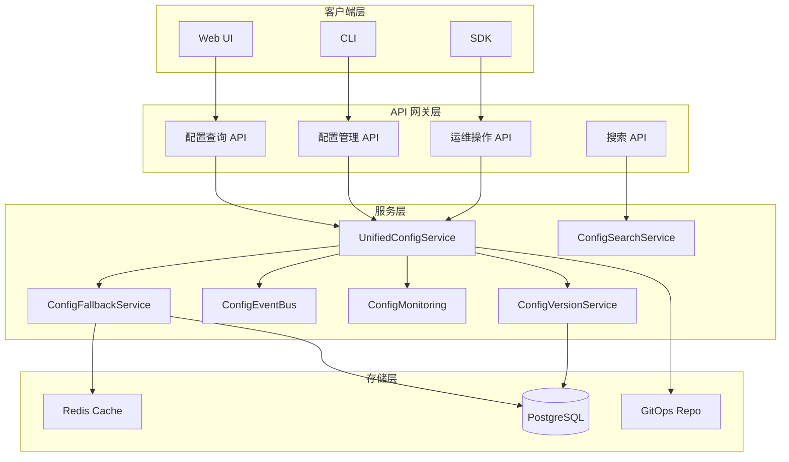
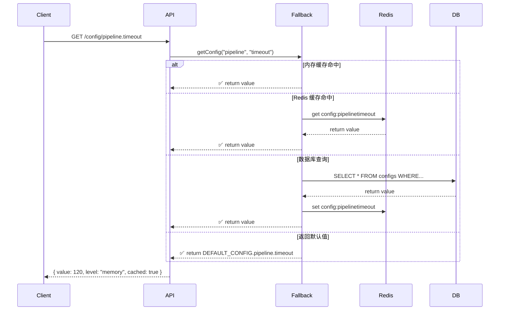

# Orion 统一配置中心设计方案

## 1. 概述

**Orion 统一配置中心** 是企业级 DevOps 中台的核心基础设施，为整个平台提供集中化、规范化、可追溯的配置管理能力。

### 1.1 核心目标

- ✅ **集中管理**: 71 个配置域，700+ 配置参数统一管理
- ✅ **类型安全**: 完整的 TypeScript 类型定义
- ✅ **热更新**: 配置变更实时生效，无需重启
- ✅ **版本管理**: 支持配置变更历史与回滚
- ✅ **多级降级**: 内存 → Redis → 数据库 → 默认值
- ✅ **智能搜索**: 配置元数据 + Fuzzy 搜索

---

## 2. 架构设计

### 2.1 整体架构图



### 2.2 配置域分类 (71 域)

| 类别 | 数量 | 配置域 |
|------|------|--------|
| 核心基础设施 | 7 | app, database, redis, nats, monitoring, security, audit |
| DevOps 管道 | 8 | pipeline, build, deploy, artifact, configMgmt, codeRepo, environment, project |
| 运维能力 | 11 | alert, selfHealing, chaos, canary, diagnostic, backup, incident, scheduler, smartDeploy, deploymentWindow, degradation |
| 业务流程 | 9 | ticketing, chatops, notification, approval, releaseApproval, environmentPromotion, qualityGate, efficiency, cost |
| 安全合规 | 7 | role, apiKey, privacy, policy, apiGovernance, escalation, disasterRecovery |
| 平台扩展 | 12 | cmdb, plugin, webhook, queue, session, user, tenant, cache, consistency, outputValidation, configSensitivity |
| 消息中间件 | 3 | kafka, rabbitMQ, rocketMQ |
| 数据存储 | 3 | mongodb, elasticsearch, minio |
| 服务治理 | 4 | gateway, circuitBreaker, rateLimit, serviceDiscovery |
| 容器编排 | 3 | kubernetes, helm, containerRegistry |
| 可观测性 | 3 | logging, trace, logRetention |
| 智能运维 | 2 | aiops, anomalyDetection |
| 合规审计 | 3 | soc2, iso27001, dataGovernance |
| 计量计费 | 3 | billing, usageTracking, quotaManagement |
| 其他 | 5 | serviceMesh, workflow, knowledge, reporting, notificationOrchestration |

---

## 3. 配置加载流程



---

## 4. 核心服务

### 4.1 UnifiedConfigService

统一配置服务主类，提供配置读取、写入、订阅能力。

```typescript
// 使用示例
import { config } from './config';

const pipelineTimeout = config.pipeline.defaultTimeoutMinutes;
const dbConfig = config.database;
```

### 4.2 ConfigVersionService

配置版本管理，支持变更历史追踪与回滚。

- `recordChange()` - 记录配置变更
- `getHistory()` - 获取变更历史
- `rollback()` - 回滚到指定版本
- `createSnapshot()` - 创建配置快照
- `diff()` - 比较版本差异

### 4.3 ConfigEventBus

配置变更事件总线，本地事件通知实现。

- `publish()` - 发布配置变更事件
- `subscribe()` - 订阅配置变更
- `getHistory()` - 获取事件历史

### 4.4 ConfigMonitoring

Prometheus 监控指标导出。

- `configLoadTotal` - 配置加载计数
- `configLoadDuration` - 配置加载耗时
- `configCacheHits` - 缓存命中
- `configHealthStatus` - 健康状态

### 4.5 ConfigFallbackService

多级降级服务。

- Memory → Redis → Database → Default

### 4.6 RedisConfigCache

Redis 分布式缓存，支持集群模式。

- 集群支持
- 读写分离
- Pipeline 批量操作
- 数据压缩

### 4.7 ConfigSearchService

智能搜索与 UI Schema 生成。

- Fuzzy 搜索
- 自动补全
- JSON Schema 生成
- Markdown 文档生成
- 预定义配置元数据

### 4.8 ConfigGitOpsService

GitOps 配置同步。

- 从 Git 拉取配置
- 推送到 Git
- 版本历史
- 回滚

---

## 5. API 接口

### 5.1 查询类

| API | 方法 | 说明 |
|-----|------|------|
| `/api/config/:domain` | GET | 获取域配置 |
| `/api/config/all` | GET | 获取全部配置 |
| `/api/config/search` | GET | 搜索配置 |
| `/api/config/suggest` | GET | 自动补全 |
| `/api/config/domains` | GET | 获取域列表 |
| `/api/config/metadata` | GET | 获取配置元数据 |
| `/api/config/ui-schema` | GET | 获取 UI Schema |
| `/api/config/docs` | GET | 获取配置文档 |

### 5.2 管理类

| API | 方法 | 说明 |
|-----|------|------|
| `/api/config` | POST | 创建配置 |
| `/api/config/:domain/:key` | PUT | 更新配置 |
| `/api/config/:domain/:key` | DELETE | 删除配置 |
| `/api/config/batch` | POST | 批量更新 |
| `/api/config/import` | POST | 导入配置 |
| `/api/config/export` | GET | 导出配置 |

### 5.3 运维类

| API | 方法 | 说明 |
|-----|------|------|
| `/api/config/:domain/:key/history` | GET | 获取变更历史 |
| `/api/config/:domain/:key/rollback` | POST | 回滚配置 |
| `/api/config/:domain/:key/restore` | POST | 恢复配置 |
| `/api/config/deleted` | GET | 列出已删除配置 |
| `/api/config/validate` | POST | 校验配置 |

---

## 6. 安全机制

### 6.1 配置分级

| 级别 | 说明 | 示例 |
|------|------|------|
| secret | 最高机密 | jwtSecret, password |
| confidential | 机密 | host, token |
| internal | 内部使用 | timeouts, limits |
| public | 公开 | ports, strategies |

### 6.2 密钥托管

支持集成外部密钥管理服务：

- HashiCorp Vault
- AWS Secrets Manager
- Azure Key Vault
- 环境变量 (默认)

### 6.3 审计日志

所有配置变更记录：

- 变更人
- 变更时间
- 变更前后值
- 变更类型
- Checksum 校验

---

## 7. 配置项统计

| 维度 | 数值 |
|------|------|
| 配置域总数 | 71 |
| 配置参数总数 | 700+ |
| 服务实现 | 91 个目录 |
| 支持语言 | TypeScript |
| 存储支持 | PostgreSQL + Redis |

---

## 8. 部署建议

### 8.1 环境要求

- Node.js 18+
- PostgreSQL 14+
- Redis 7+
- NATS (可选，用于事件通知)

### 8.2 初始化

```typescript
import { config } from './config';
import { addConfigHealthRoutes } from './services/config/ConfigMonitoring';

// 初始化配置
await config.initialize();

// 添加健康检查路由
addConfigHealthRoutes(app);

// 监听配置变更
config.subscribe('pipeline', (newValue, oldValue) => {
  console.log('Pipeline config changed:', newValue);
});
```

---

## 9. 监控指标

| 指标名 | 类型 | 说明 |
|--------|------|------|
| orion_config_load_total | Counter | 配置加载总数 |
| orion_config_load_duration_seconds | Histogram | 配置加载耗时 |
| orion_config_cache_hits_total | Counter | 缓存命中 |
| orion_config_cache_misses_total | Counter | 缓存未命中 |
| orion_config_health_status | Gauge | 健康状态 |
| orion_config_errors_total | Counter | 错误计数 |

---

## 10. 附录

### 配置域完整列表

详见 `ExtendedConfig.ts` 和 `EnterpriseConfig.ts`

### 错误码

| 错误码 | 说明 |
|--------|------|
| CONFIG_NOT_FOUND | 配置不存在 |
| CONFIG_INVALID | 配置值无效 |
| PERMISSION_DENIED | 权限不足 |
| VERSION_NOT_FOUND | 版本不存在 |

---

*文档版本: 1.0*  
*最后更新: 2026-05-06*