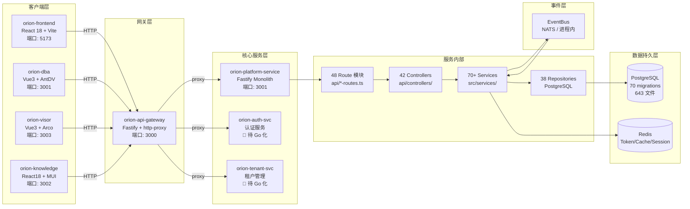
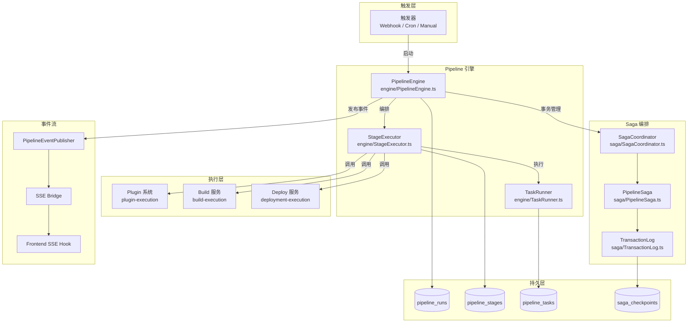
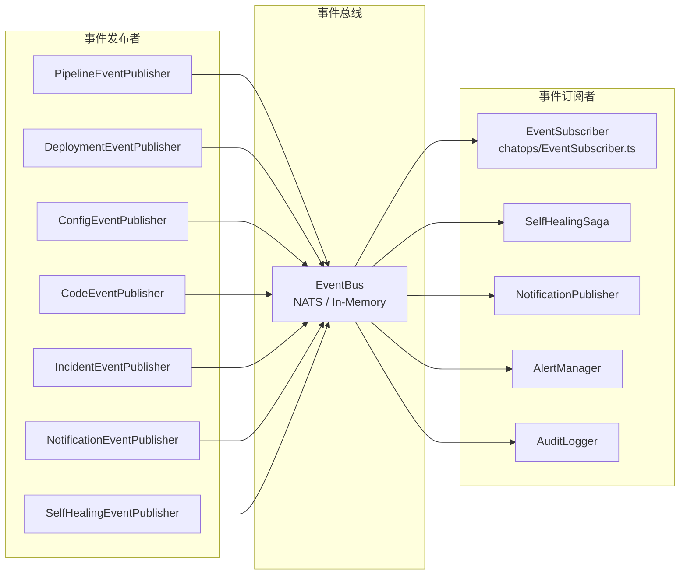

# 数据流架构图

> **生成日期**: 2026-07-03
> **对应任务**: Phase 2.33
> **数据来源**: `docs/architecture/当前系统架构.md` + `docs/architecture/actual-service-dependency-map.md` + `docs/architecture/架构设计详解.md`

---

## 一、请求数据流（HTTP 请求全链路）



### 路由转发规则

API Gateway 根据请求路径将流量分发到不同的后端服务：

```
前端 (orion-frontend, React+微前端)
    │
    ▼
API Gateway (orion-api-gateway, Fastify 代理, 端口 3000)
    │
    ├── /api/v1/pipelines      → localhost:3002 (Go, Pipeline)
    ├── /api/v1/deployments    → localhost:3003 (Go, Deploy)
    ├── /api/v1/tickets        → localhost:3004 (Go, Ticket)
    ├── /api/v1/monitoring     → localhost:3005 (Go, Monitor)
    ├── /api/v1/intelligence   → localhost:3006 (Go, Intelligence)
    ├── /api/v1/ai             → localhost:8000 (Python, AI 服务)
    ├── /api/v1/knowledge      → localhost:8002 (Python, PandaWiki)
    ├── /api/v1/notifications  → localhost:3001 (Node.js, 平台服务)
    ├── /api/v1/chatops        → localhost:3001 (Node.js, 平台服务)
    ├── /api/v1/cmdb           → localhost:3030 (Go, CMDB)
    └── /api/v1/* (其余)       → localhost:3001 (Node.js, 平台服务)
```

---

## 二、Pipeline 执行数据流



### Pipeline SSE 实时日志流

```
Pipeline Engine → StageExecutor → TaskRunner
                                        │
                                        ▼
                                 日志输出 (stdout/stderr)
                                        │
                                        ▼
                            ┌───────────────────────┐
                            │   SSE Bridge Service  │
                            │   sse/SseBridge.ts    │
                            │   • Connect           │
                            │   • Emit              │
                            │   • Close             │
                            └───────┬───────────────┘
                                    │
                                    ▼
                            ┌───────────────────────┐
                            │   SSE Route           │
                            │   GET /sse/run/:id     │
                            │   Response: text/event-stream
                            └───────┬───────────────┘
                                    │
                                    ▼
                            ┌───────────────────────┐
                            │   Frontend Hook       │
                            │   useEventSource()    │
                            │   onMessage → 日志显示 │
                            └───────────────────────┘
```

---

## 三、事件驱动数据流

### 3.1 事件发布/订阅总览



### 3.2 当前有效的事件通信

| 发布者 | 主题 | 消费者 | 状态 |
|--------|------|--------|------|
| PipelineEventPublisher | `pipeline.run.completed` | PipelineEventListener, ChatOps | ⚠️ 命名不一致 |
| PipelineEventPublisher | `pipeline.run.created` | — | ⚠️ 无消费者（命名不一致） |
| CodeEventPublisher | `code.pr.opened` | ChatOps, Approval | ✅ |
| DeploymentEventPublisher | `deploy.completed` | Notification, ChatOps | ✅ |
| IncidentEventPublisher | `incident.created` | SelfHealing, ChatOps | ✅ |

> ⚠️ 已知问题: 发布时无 `orion.` 前缀，订阅时带前缀，导致事件无法送达。详见 `actual-service-dependency-map.md`。

---

## 四、多租户数据流

```mermaid
graph TD
    subgraph 请求入口
        REQ[HTTP Request]
    end

    subgraph 租户上下文
        TC[TenantContext<br/>AsyncLocalStorage]
        MW[TenantMiddleware<br/>authMiddleware]
    end

    subgraph 数据隔离
        REPO_T[Repository 层<br/>自动注入 tenant_id]
        RLS[(PostgreSQL RLS<br/>Row Level Security)]
    end

    subgraph 缓存隔离
        REDIS_T[Redis Key 前缀<br/>tenant:{id}:*]
    end

    REQ --> MW
    MW -->|提取 tenant_id| TC
    TC -->|注入| REPO_T
    REPO_T -->|WHERE tenant_id| RLS
    REPO_T -->|key 前缀| REDIS_T
```

### 多租户隔离层级

| 层级 | 实现方式 | 状态 |
|------|---------|------|
| 请求层 | AuthMiddleware → JWT 解析 → TenantContext | ✅ 已实现 |
| 服务层 | AsyncLocalStorage 存储租户上下文 | ✅ 已实现 |
| 数据层 | Repository 自动注入 `tenant_id` WHERE 子句 | ✅ 已实现（38 repos） |
| 数据库层 | Row Level Security (RLS) 策略 | ✅ 已实现 |
| 缓存层 | Redis Key 前缀 `tenant:{id}:*` | ⚠️ 部分实现 |

---

## 五、核心数据对象流

| 数据对象 | 来源 | 流转路径 | 存储 |
|---------|------|---------|------|
| Pipeline 定义 | 前端 → API → PipelineService | PipelineService → PipelineRepository | PostgreSQL `pipelines` |
| Pipeline 运行 | PipelineEngine 启动 | Engine → TaskRunner → Plugin → 结果写回 | PostgreSQL `pipeline_runs/stages/tasks` |
| 部署事件 | DeployService | → EventPublisher → EventBus → 订阅者 | PostgreSQL `deployments` + NATS |
| 配置变更 | ConfigService | → EventBus → 审计日志 | PostgreSQL `configs` + `audit_logs` |
| 告警 | MetricCollector | → AlertRuleEngine → NotificationService | PostgreSQL `monitoring_alerts` |
| 自愈事件 | SelfHealingSaga | → EventBus → ChatOps → 通知 | 内存(Map) + PostgreSQL |
| 审批请求 | ApprovalService | → Notification → 用户审批 | PostgreSQL `approvals` |
| 工单 | TicketService | → TicketController → TicketRepository | PostgreSQL `tickets` |
| 代码 PR | CodeService | → CodeEventPublisher → EventBus → ChatOps | PostgreSQL `code_repos` |

---

## 六、数据存储拓扑

```
┌──────────────────────────────────────────────────────────────────┐
│                      数据存储层                                    │
│                                                                  │
│  ┌─────────────────┐    ┌────────────────┐    ┌─────────────┐  │
│  │   PostgreSQL     │    │      Redis      │    │    NATS     │  │
│  │                 │    │                 │    │             │  │
│  │  • 70+ 业务表   │    │  • Token/Session │    │  EventBus   │  │
│  │  • 643 migrations│   │  • 缓存          │    │  (可选)     │  │
│  │  • 30+ Repo     │    │  • Rate Limit    │    │             │  │
│  │  • RLS 多租户   │    │  • SSE 连接      │    │             │  │
│  └────────┬────────┘    └─────────────────┘    └─────────────┘  │
│           │                                                      │
│  ┌────────▼──────────────────────────────────────────────┐      │
│  │              共享存储抽象层                            │      │
│  │  • FallbackStorageService (Phase 1.18)                │      │
│  │  • Map → PostgreSQL 降级路径                           │      │
│  └───────────────────────────────────────────────────────┘      │
└──────────────────────────────────────────────────────────────────┘
```

### 基础设施依赖

| 基础设施 | 类型 | 用途 | 当前状态 | 风险 |
|---------|------|------|---------|------|
| **PostgreSQL** | 关系数据库 | 统一元数据存储（70+ 表） | ✅ 已部署 | 单点风险 |
| **Redis** | KV 缓存 | Token/Session/Cache | ⚠️ 可选（部分模块降级为内存 Map） | 性能/一致性问题 |
| **NATS JetStream** | 消息队列 | 事件总线（EventBus） | ⚠️ 可选（无 NATS 时降级为内存事件） | 事件丢失风险 |

---

## 七、数据流关键路径

| # | 路径 | 协议 | 数据量 | 实时性 | 可靠性 |
|---|------|------|--------|--------|--------|
| 1 | 前端 → API Gateway → Platform Service | HTTP/REST | 小 (KB) | 实时 | 同步请求 |
| 2 | Platform Service → PostgreSQL | TCP/pg | 中 (KB-MB) | 实时 | ACID 事务 |
| 3 | Platform Service → Redis | TCP/redis | 小 (KB) | 实时 | 内存级 |
| 4 | EventBus → 订阅者 | NATS/内存 | 小 (KB) | 近实时 | at-least-once |
| 5 | SSE → 前端 | HTTP/SSE | 中 (日志流) | 实时 | TCP 长连接 |
| 6 | Plugin → Pipeline Engine | stdio/gRPC | 大 (MB-GB) | 异步 | 插件隔离 |
| 7 | Notification → 外部 (钉钉/企微/飞书) | HTTP/Webhook | 小 (KB) | 异步 | 最大努力 |
| 8 | Webhook → 外部系统 | HTTP/POST | 小 (KB) | 实时 | 重试机制 |

---

## 八、进程内调用链（单体架构）

由于后端是单体架构，大部分服务间调用为**进程内函数调用**，无网络开销：

```
Controller → Service → Repository → PostgreSQL
    ↑           ↑          ↑
    │           │          │
    └─── 同一 Node.js 进程 ┘
```

### 高耦合依赖链

```
Pipeline → ArtifactService
         → DeployService
         → NotificationService
         → CodeService
         → ApprovalService
         → EventBusService
         (10+ 直接 import)

Auth → UserService
     → RoleService
     → TenantService
     (10+ 模块依赖)

Approval → UserRepository
         → CapabilityRepository
         → PipelineService
```

---

## 九、前端 → 后端的 API 调用方式

| 调用类型 | 前端方式 | 后端处理 | 适用场景 |
|---------|---------|---------|---------|
| RESTful | axios GET/POST/PUT/DELETE | Route → Controller → Service | CRUD 操作 |
| SSE | EventSource / useEventSource() | SSE Bridge → Pipeline Engine | 实时日志流 |
| Webhook | — | Webhook Receiver → EventBus | 外部系统回调 |
| WebSocket | (未集成) | — | 未来实时推送 |

---

_文档版本：v2.0 | 生成日期：2026-07-03 | 对应任务：Phase 2.33 | 状态：✅ 已完成_
