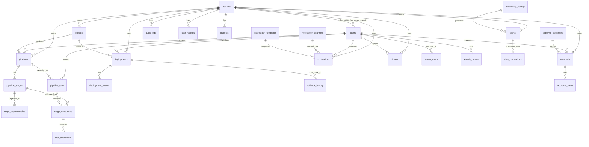

# 数据库 ER 图（2026-07-03 自动生成）

> **生成方式**: 从 `src/db/migrations/` 643 个迁移文件中提取 70+ 表定义和关系
> **对应任务**: Phase 2.34
> **数据来源**: Migration 001-049 + 0301 + 304 + 404

---

## 一、核心域 ER 图（Mermaid）



---

## 二、完整表清单（70+ 表，按域分组）

### 2.1 核心基础域（6 表）

| 表名 | Migration | 主键 | 外键 | 说明 |
|------|-----------|------|------|------|
| `tenants` | 001 | id | - | 租户 |
| `users` | 001 | id | tenants(id) | 用户 |
| `tenant_users` | 001 | id | tenants, users | 租户-用户映射 |
| `refresh_tokens` | 001 | id | users | 刷新令牌 |
| `roles` | 002 | id | - | 角色 |
| `permissions` | 002 | id | - | 权限 |

### 2.2 CI/CD Pipeline 域（9 表）

| 表名 | Migration | 主键 | 外键 | 说明 |
|------|-----------|------|------|------|
| `projects` | 003 | id | tenants | 项目 |
| `pipelines` | 004 | id | tenants, projects, users | 流水线定义 |
| `pipeline_stages` | 004 | id | pipelines | 阶段定义 |
| `stage_dependencies` | 004 | id | pipeline_stages | 阶段依赖 |
| `pipeline_runs` | 005 | id | tenants, pipelines, users | 流水线运行 |
| `stage_executions` | 005 | id | pipeline_runs, pipeline_stages | 阶段执行 |
| `task_executions` | 005 | id | stage_executions | 任务执行 |
| `builds` | 006 | id | tenants, pipelines | 构建记录 |
| `build_artifacts` | 006 | id | builds | 构建产物 |

### 2.3 部署域（5 表）

| 表名 | Migration | 主键 | 外键 | 说明 |
|------|-----------|------|------|------|
| `deployments` | 007 | id | tenants, projects, pipeline_runs, builds, users | 部署记录 |
| `deployment_events` | 007 | id | deployments, users | 部署事件 |
| `environments` | 008 | id | tenants | 环境定义 |
| `rollback_history` | 046 | id | deployments | 回滚历史 |
| `canary_analysis` | 029 | id | deployments | 灰度分析 |

### 2.4 代码管理域（4 表）

| 表名 | Migration | 主键 | 外键 | 说明 |
|------|-----------|------|------|------|
| `code_repositories` | 009 | id | tenants | 代码仓库 |
| `code_prs` | 016 | id | repos, users | PR 记录 |
| `code_reviews` | 016 | id | prs, users | Code Review |
| `merge_requests` | - | id | repos | 合并请求 |

### 2.5 审批域（3 表）

| 表名 | Migration | 主键 | 外键 | 说明 |
|------|-----------|------|------|------|
| `approval_definitions` | 010 | id | tenants | 审批定义 |
| `approvals` | 010 | id | tenants, definitions, users | 审批实例 |
| `approval_steps` | 010 | id | approvals, users | 审批步骤 |

### 2.6 制品管理域（5 表）

| 表名 | Migration | 主键 | 外键 | 说明 |
|------|-----------|------|------|------|
| `artifact_registry` | 010b | id | tenants | 制品仓库 |
| `artifacts` | 014 | id | tenants, builds | 制品 |
| `artifact_versions` | - | id | artifacts | 制品版本 |
| `artifact_dependencies` | - | id | artifact_versions | 制品依赖 |
| `provenance_records` | - | id | artifact_versions | 溯源记录 |

### 2.7 插件域（4 表）

| 表名 | Migration | 主键 | 外键 | 说明 |
|------|-----------|------|------|------|
| `plugins` | 011 | id | tenants | 插件定义 |
| `plugin_executions` | 043 | id | tenants, pipelines | 插件执行 |
| `plugin_configs` | 011 | id | plugins | 插件配置 |
| `plugin_marketplace` | - | id | - | 插件市场 |

### 2.8 告警/监控域（6 表）

| 表名 | Migration | 主键 | 外键 | 说明 |
|------|-----------|------|------|------|
| `monitoring_configs` | 012 | id | tenants | 监控配置 |
| `alerts` | 012 | id | tenants, configs, users | 告警记录 |
| `alert_correlations` | 012 | id | alerts | 告警关联 |
| `alert_suppressions` | 037 | id | tenants | 告警抑制 |
| `monitoring_rules_channels` | 049b | id | tenants | 通知渠道 |
| `metric_storage` | 0183 | id | tenants | 指标存储 |

### 2.9 审计域（3 表）

| 表名 | Migration | 主键 | 外键 | 说明 |
|------|-----------|------|------|------|
| `audit_logs` | 013 | id | tenants, users | 审计日志 |
| `audit_chain_entries` | 0295 | id | tenants | 审计链 |
| `immutable_audit_entries` | 0296 | id | tenants | 不可变审计 |

### 2.10 配置管理域（3 表）

| 表名 | Migration | 主键 | 外键 | 说明 |
|------|-----------|------|------|------|
| `configs` | 016 | id | tenants | 配置项 |
| `config_versions` | 016 | id | configs | 配置版本 |
| `config_deployments` | - | id | configs, environments | 配置部署 |

### 2.11 通知域（3 表）

| 表名 | Migration | 主键 | 外键 | 说明 |
|------|-----------|------|------|------|
| `notification_channels` | 017 | id | tenants | 通知渠道 |
| `notification_templates` | 017 | id | tenants | 通知模板 |
| `notifications` | 017 | id | tenants, users, templates | 通知记录 |

### 2.12 安全域（4 表）

| 表名 | Migration | 主键 | 外键 | 说明 |
|------|-----------|------|------|------|
| `risk_records` | 018 | id | tenants | 风险记录 |
| `policy_rules` | 027 | id | tenants | 策略规则 |
| `policy_evaluations` | 027 | id | rules | 策略评估 |
| `sbom_components` | 026 | id | tenants | SBOM 组件 |
| `sbom_vulnerabilities` | 045 | id | sbom_components | 漏洞记录 |

### 2.13 工单/自愈域（4 表）

| 表名 | Migration | 主键 | 外键 | 说明 |
|------|-----------|------|------|------|
| `tickets` | 011b | id | tenants, users | 工单 |
| `ticket_comments` | 011b | id | tickets, users | 工单评论 |
| `ticket_workflow` | 038 | id | tickets | 工单工作流 |
| `self_healing_rules` | 011b | id | tenants | 自愈规则 |
| `self_healing_executions` | 011b | id | rules | 自愈执行 |

### 2.14 AI 智能域（4 表）

| 表名 | Migration | 主键 | 外键 | 说明 |
|------|-----------|------|------|------|
| `agent_orchestrations` | 024 | id | tenants | Agent 编排 |
| `agent_executions` | 024 | id | orchestrations | Agent 执行 |
| `skill_packages` | 030 | id | - | 技能包 |
| `skill_versions` | 030 | id | skill_packages | 技能版本 |
| `skill_reviews` | 030 | id | skill_packages | 技能评分 |

### 2.15 FinOps 域（3 表）

| 表名 | Migration | 主键 | 外键 | 说明 |
|------|-----------|------|------|------|
| `budgets` | 031 | id | - | 预算 |
| `cost_records` | 031 | id | - | 成本记录 |
| `cost_alerts` | 031 | id | budgets | 成本告警 |

### 2.16 ChatOps 域（4 表）

| 表名 | Migration | 主键 | 外键 | 说明 |
|------|-----------|------|------|------|
| `chatops_commands` | 033 | id | tenants, users | 聊天命令 |
| `chatops_sessions` | 033 | id | tenants, users | 聊天会话 |
| `chatops_sse_connections` | 0236 | id | tenants | SSE 连接 |
| `chatops_subscription_failures` | 0239 | id | tenants | 订阅失败 |

### 2.17 效率域（3 表）

| 表名 | Migration | 主键 | 外键 | 说明 |
|------|-----------|------|------|------|
| `efficiency_metrics` | 019 | id | tenants | 效能指标 |
| `efficiency_reports` | 019 | id | tenants | 效能报告 |
| `efficiency_suggestions` | 019 | id | reports | 效能建议 |

### 2.18 其他域（9 表）

| 表名 | Migration | 主键 | 外键 | 说明 |
|------|-----------|------|------|------|
| `webhooks` | 021 | id | tenants | Webhook |
| `api_keys` | 022 | id | tenants | API 密钥 |
| `knowledge_articles` | 023 | id | tenants | 知识文章 |
| `ephemeral_environments` | 025 | id | tenants | 临时环境 |
| `change_intelligence` | 028 | id | tenants | 变更智能 |
| `namespace_pools` | 042 | id | tenants | 命名空间池 |
| `iac_plans` | 044 | id | tenants | IaC 计划 |
| `plugin_executions` | 043 | id | tenants, plugins | 插件执行 |
| `oncall_schedules` | 035 | id | tenants | 值班排班 |
| `cron_jobs` | 036 | id | tenants | Cron 任务 |
| `product_lines` | 046b | id | tenants | 产品线 |
| `internal_libraries` | 047 | id | tenants | 内部库 |
| `diagnostic_results` | 040 | id | tenants | 诊断结果 |
| `chatops_admin` | 046 | id | tenants | ChatOps 管理 |
| `env_profiles` | 404 | id | tenants | 环境配置 |

---

## 三、关键关系汇总

### 3.1 多租户根关系

```
tenants (1) ──── (N) users (via tenant_users)
tenants (1) ──── (N) pipelines
tenants (1) ──── (N) projects
tenants (1) ──── (N) deployments
tenants (1) ──── (N) alerts
tenants (1) ──── (N) tickets
tenants (1) ──── (N) audit_logs
tenants (1) ──── (N) notifications
```

### 3.2 Pipeline 执行链

```
pipelines ──→ pipeline_stages ──→ stage_executions ──→ task_executions
                         ↓
                 stage_dependencies
                         ↓
                 pipeline_runs (包含 stage_executions)
```

### 3.3 部署链

```
pipelines ──→ pipeline_runs ──→ deployments ──→ deployment_events
                                    ↓
                              rollback_history (self-reference)
```

### 3.4 告警链

```
monitoring_configs ──→ alerts ──→ alert_correlations (self-join)
                              ↓
                       notifications (通知)
```

### 3.5 审批链

```
approval_definitions ──→ approvals ──→ approval_steps
```

---

## 四、数据库表数量统计

| 域 | 表数量 | Migration 编号 |
|---|--------|---------------|
| 核心基础 | 6 | 001-002 |
| Pipeline/CI | 9 | 003-006 |
| 部署 | 5 | 007-008, 029, 046 |
| 代码管理 | 4 | 009, 016 |
| 审批 | 3 | 010 |
| 制品 | 5 | 010b, 014 |
| 插件 | 4 | 011, 043 |
| 告警/监控 | 6 | 012, 037, 049b, 0183 |
| 审计 | 3 | 013, 0295-0296 |
| 配置管理 | 3 | 016 |
| 通知 | 3 | 017, 048 |
| 安全/SBOM | 4 | 018, 026, 027, 045 |
| 工单/自愈 | 5 | 011b, 038 |
| AI 智能 | 5 | 024, 030 |
| FinOps | 3 | 031 |
| ChatOps | 4 | 0236-0239, 033 |
| 效率 | 3 | 019 |
| 其他 | 15 | 021-025, 028, 035-036, 040-047 |
| **总计** | **~80** | Migration 001-049 + |

---

## 五、索引策略汇总

### 5.1 多租户隔离索引（所有业务表）

```sql
-- 标准模式：每个业务表都有 tenant_id 索引
CREATE INDEX idx_<table>_tenant ON <table>(tenant_id);
```

### 5.2 常用查询索引

| 查询模式 | 索引示例 |
|---------|---------|
| 按状态查询 | `idx_pipelines_status`, `idx_alerts_status` |
| 按创建时间倒序 | `idx_pipeline_runs_created DESC`, `idx_alerts_created DESC` |
| 按资源类型+ID | `idx_approvals_resource`, `idx_audit_logs_resource` |
| GIN 全文搜索 | `idx_skill_packages_tags (GIN)` |
| 部分索引 | `idx_skill_versions_latest WHERE is_latest = true` |

---

## 六、数据一致性规则

| 规则 | 说明 |
|------|------|
| ON DELETE CASCADE | tenants → 子表级联删除（多租户隔离） |
| ON DELETE SET NULL | 软引用（如 approvals → users） |
| UUID 主键 | 所有主键使用 `gen_random_uuid()` |
| TIMESTAMPTZ | 所有时间字段使用带时区时间戳 |
| JSONB | 灵活字段使用 JSONB（config, thresholds, result） |
| UNIQUE 约束 | tenant_id + user_id 组合唯一（tenant_users） |
| CHECK 约束 | rating 1-5（skill_reviews） |
