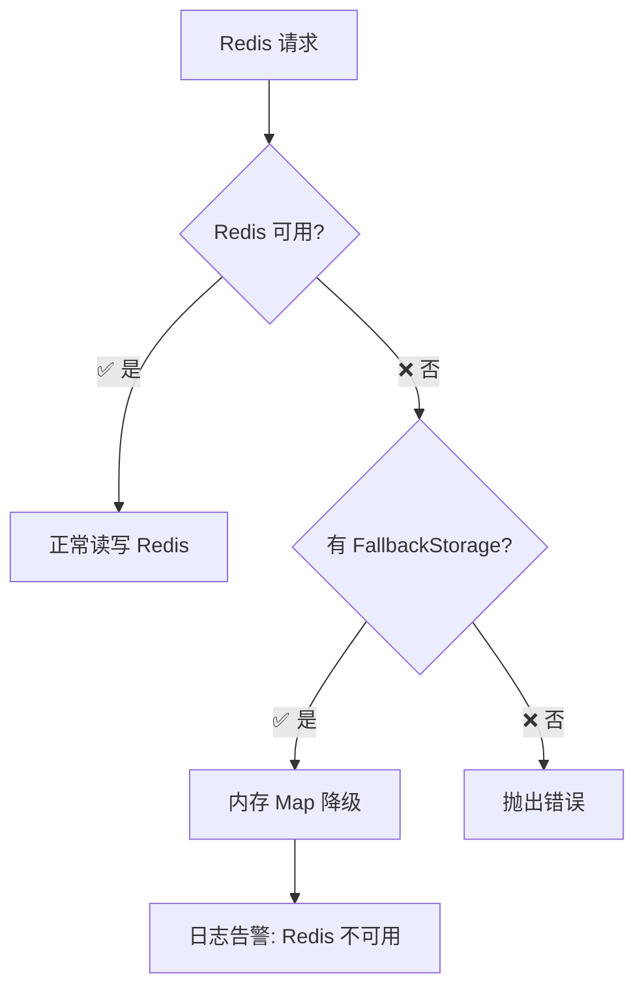
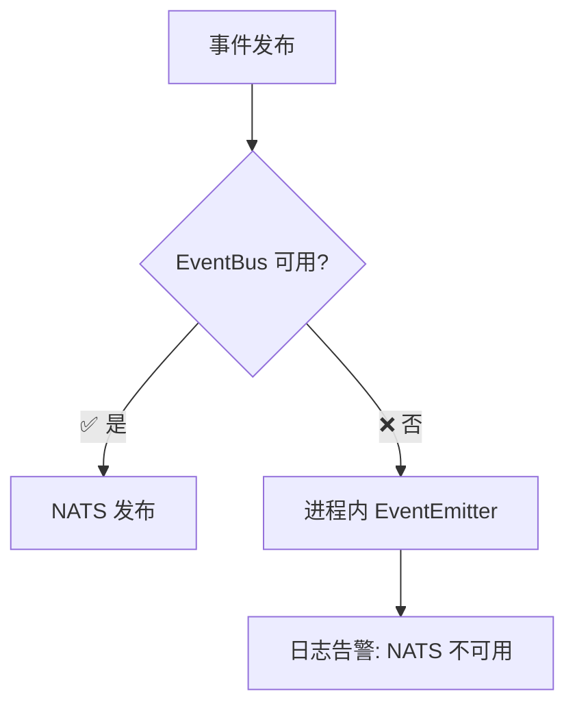

# 基础设施拓扑图

> **生成日期**: 2026-07-03
> **对应任务**: Phase 2.35
> **数据来源**: `docs/architecture/service-authority-registry.md` + `docs/architecture/当前系统架构.md` + `docs/architecture/actual-service-dependency-map.md`

---

## 一、当前部署拓扑（单体模式）

```
                            ┌─────────────────────────────────────────┐
                            │          Load Balancer / Ingress          │
                            │              (nginx / k8s)                │
                            └─────────────────┬───────────────────────┘
                                              │
                        ┌─────────────────────┼─────────────────────┐
                        │                     │                     │
                        ▼                     ▼                     ▼
            ┌───────────────────┐  ┌───────────────────┐  ┌───────────────────┐
            │ orion-api-gateway │  │   orion-frontend  │  │    orion-dba      │
            │   Fastify Proxy   │  │   Vite Dev Server │  │   Vue3 + AntDV    │
            │    端口: 3000     │  │    端口: 5173     │  │    端口: 3001     │
            │   healthz: 3000   │  │                   │  │                   │
            └─────────┬─────────┘  └───────────────────┘  └───────────────────┘
                      │
                      │ HTTP 代理
                      ▼
            ┌───────────────────────────────────────────────────┐
            │              orion-platform-service               │
            │              (Node.js + Fastify)                  │
            │              端口: 3001                           │
            │                                                    │
            │  ┌─────────────────────────────────────────────┐  │
            │  │  48 Route 模块 → 42 Controllers             │  │
            │  │  → 70+ Services → 38 PostgreSQL Repos       │  │
            │  │  → EventBus (NATS optional) → Redis          │  │
            │  └─────────────────────────────────────────────┘  │
            └───────────┬───────────────────┬───────────────────┘
                        │                   │
                        ▼                   ▼
            ┌───────────────────┐  ┌───────────────────┐
            │   PostgreSQL      │  │      Redis        │
            │   端口: 5432      │  │   端口: 6379      │
            │  70+ tables       │  │  Token/Cache      │
            │  643 migrations   │  │  Session/SSE      │
            └───────────────────┘  └───────────────────┘

                        │
                        │ (NATS, 可选)
                        ▼
            ┌───────────────────┐
            │   NATS Message    │
            │     Bus            │
            │   端口: 4222      │
            │  EventPub/Sub     │
            └───────────────────┘
```

### 当前服务端口总表

| 服务 | 目录 | 端口 | 协议 | 状态 |
|------|------|------|------|------|
| API Gateway | `orion-api-gateway/` | 3000 | HTTP | ✅ 运行中 |
| Platform Service | `orion-platform-service/` | 3001 | HTTP | ✅ 运行中 |
| DBA (子应用) | `orion-dba/` | 3001 | HTTP | ✅ 运行中 |
| Knowledge (子应用) | `orion-knowledge/` | 3002 | HTTP | ✅ 运行中 |
| Visor (子应用) | `orion-visor/` | 3003 | HTTP | ✅ 运行中 |
| PostgreSQL | 外部 | 5432 | TCP | ✅ 运行中 |
| Redis | 外部 | 6379 | TCP | ⚪ 可选 |
| NATS | 外部 | 4222 | TCP | ⚪ 可选 |

---

## 二、Go 微服务迁移目标拓扑（Phase 6）

```
                            ┌─────────────────────────────────────────┐
                            │          Load Balancer / Ingress          │
                            └─────────────────┬───────────────────────┘
                                              │
              ┌─────────────────────────────────┼─────────────────────────────────┐
              │                                 │                                 │
              ▼                                 ▼                                 ▼
    ┌───────────────────┐           ┌───────────────────┐           ┌───────────────────┐
    │ orion-api-gateway │           │  orion-frontend  │           │    orion-visor     │
    │    端口: 3000     │           │    端口: 5173     │           │    端口: 3003     │
    └─────────┬─────────┘           └───────────────────┘           └───────────────────┘
              │
              │ gRPC / HTTP2
              ▼
    ┌───────────────────────────────────────────────────────────────────┐
    │                    Orion Service Mesh (istio / k8s)              │
    │                                                                   │
    │  ┌────────────┐ ┌────────────┐ ┌────────────┐ ┌────────────┐    │
    │  │ Auth-Svc   │ │Tenant-Svc │ │ Pipeline  │ │  Deploy   │    │
    │  │   Go 3025  │ │  Go 3026  │ │ -Svc Go   │ │ -Svc Go   │    │
    │  └────────────┘ └────────────┘ └────────────┘ └────────────┘    │
    │  ┌────────────┐ ┌────────────┐ ┌────────────┐ ┌────────────┐    │
    │  │  Code-Svc  │ │ Ticket-   │ │  Chatops  │ │  Self-    │    │
    │  │   Go 3010  │ │   Svc Go  │ │ -Svc Go   │ │ Healing   │    │
    │  │            │ │  3004     │ │  3027     │ │ -Svc Go   │    │
    │  └────────────┘ └────────────┘ └────────────┘ └────────────┘    │
    │  ┌────────────┐ ┌────────────┐ ┌────────────┐ ┌────────────┐    │
    │  │ Finops-Svc │ │ Security  │ │ Notify-   │ │  Build-   │    │
    │  │   Go 3009  │ │ -Svc Go   │ │   Svc Go  │ │   Svc Go  │    │
    │  │            │ │  3013     │ │  3019     │ │  3037     │    │
    │  └────────────┘ └────────────┘ └────────────┘ └────────────┘    │
    │  ┌────────────┐ ┌────────────┐ ┌────────────┐ ┌────────────┐    │
    │  │ CMDB-Svc   │ │ Artifact  │ │ Approval  │ │  Plugin   │    │
    │  │   Go 3030  │ │ -Svc Go   │ │ -Svc Go   │ │ -Svc Go   │    │
    │  │            │ │  3014     │ │  3018     │ │  3011     │    │
    │  └────────────┘ └────────────┘ └────────────┘ └────────────┘    │
    │                                                                   │
    │  [Wave 1: 8 Go 服务已就绪] [Wave 2: 18 Go 需补充] [Wave 3: 5 待建] │
    └──────────────────────────┬────────────────────────────────────────┘
                               │
                               ▼
                    ┌───────────────────────┐
                    │   PostgreSQL 集群     │
                    │   读写分离 + 分片     │
                    └───────────────────────┘
                    ┌───────────────────────┐
                    │   NATS Cluster        │
                    │   (事件总线)           │
                    └───────────────────────┘
                    ┌───────────────────────┐
                    │   Redis Cluster       │
                    │   (缓存/会话)          │
                    └───────────────────────┘
```

---

## 三、Go 微服务分波部署计划

### Wave 1: 已就绪（8 服务）

| 服务 | Go 目录 | 目标端口 | 构建状态 | 行数 |
|------|---------|---------|---------|------|
| CMDB | `orion-cmdb-svc-go` | 3030 | ✅ 构建通过 | 1772 |
| Runner | `orion-runner-svc-go` | 3028 | ✅ 构建通过 | 2171 |
| Visor-Go | `orion-visor-svc-go` | 3034 | ✅ 构建通过 | 2067 |
| Inception | `orion-inception-svc-go` | 3031 | ✅ 构建通过 | 1211 |
| Config-Mgmt | `orion-config-mgmt-svc-go` | 3029 | ✅ 构建通过 | 2551 |
| Skill | `orion-skill-svc-go` | 3023 | ✅ 构建通过 | 2577 |
| Digital-Twin | `orion-digital-twin-svc-go` | 3008 | ✅ 构建通过 | 2261 |
| Canary | `orion-canary-svc-go` | — | ✅ 构建通过 | 2396 |

### Wave 2: 待补充（18 服务）

| 服务 | Go 目录 | 目标端口 | Go 行数 | Node.js 行数 | 差距 |
|------|---------|---------|:-------:|:------------:|:----:|
| Pipeline | `orion-pipeline-svc-go` | 3002 | 3478 | 26197 | 🔴 需大幅补充 |
| Ticket | `orion-ticket-svc-go` | 3004 | 7321 | 13816 | 🟡 需补充 |
| Deploy | `orion-deploy-svc-go` | 3003 | 1197 | 6732 | 🔴 需大幅补充 |
| Code | `orion-code-svc-go` | 3010 | 1873 | 13379 | 🔴 需大幅补充 |
| Finops | `orion-finops-svc-go` | 3009 | 2500 | 8383 | 🔴 需大幅补充 |
| Chatops | `orion-chatops-svc-go` | 3027 | 2853 | 9185 | 🔴 需大幅补充 |
| Security | `orion-security-svc-go` | 3013 | 1276 | 7759 | 🔴 需大幅补充 |
| Approval | `orion-approval-svc-go` | 3018 | 1411 | 2890 | 🟡 需补充 |
| Artifact | `orion-artifact-svc-go` | 3014 | 1184 | 3580 | 🔴 需大幅补充 |
| Notify | `orion-notify-svc-go` | 3019 | 1182 | 1701 | 🟡 需补充 |
| SelfHealing | `orion-selfhealing-svc-go` | 3024 | 1108 | 2313 | 🟡 需补充 |
| Plugin | `orion-plugin-svc-go` | 3011 | 950 | 4446 | 🔴 需大幅补充 |

### Wave 3: 待新建（5 服务）

| 服务 | Go 目录 | 目标端口 | 状态 |
|------|---------|---------|------|
| AI | `orion-ai-svc-go` | 3012 | 需新建 |
| Graph | `orion-graph-svc-go` | 3021 | 需补充 |
| PandaWiki | `orion-pandawiki-svc-go` | 3020 | 需补充 |
| Intelligence | `orion-intelligence-svc-go` | 3006 | 需补充 |
| Tool | `orion-tool-svc-go` | 3036 | 已完成 |

---

## 四、网络拓扑（K8s 部署视图）

```
                    ┌──────────────────┐
                    │   Ingress NGINX  │
                    │   (或 API GW)    │
                    └────────┬─────────┘
                             │
                    ┌────────▼────────────────────────┐
                    │       Kubernetes Cluster         │
                    │                                   │
                    │  ┌────────────┐  ┌────────────┐  │
                    │  │ orion-     │  │ orion-     │  │
                    │  │ platform   │  │   dba      │  │
                    │  │ -service   │  │            │  │
                    │  │ Replica: 3 │  │ Replica: 1 │  │
                    │  └────────────┘  └────────────┘  │
                    │                                   │
                    │  ┌────────────┐  ┌────────────┐  │
                    │  │ orion-     │  │ orion-     │  │
                    │  │ knowledge  │  │  visor     │  │
                    │  │ Replica: 1 │  │ Replica: 1 │  │
                    │  └────────────┘  └────────────┘  │
                    │                                   │
                    │  ┌──────────────────────────┐     │
                    │  │   PostgreSQL StatefulSet │     │
                    │  │   Primary + 2 Replicas   │     │
                    │  └──────────────────────────┘     │
                    │                                   │
                    │  ┌──────────────────────────┐     │
                    │  │   Redis Cluster (3m+3s)  │     │
                    │  └──────────────────────────┘     │
                    │                                   │
                    │  ┌──────────────────────────┐     │
                    │  │   NATS Cluster (3 nodes) │     │
                    │  └──────────────────────────┘     │
                    │                                   │
                    └───────────────────────────────────┘
                             │
                    ┌────────▼─────────┐
                    │   Monitoring     │
                    │   Prometheus     │
                    │   + Grafana      │
                    └──────────────────┘
```

---

## 五、存储分层架构

```
┌─────────────────────────────────────────────────────────────────┐
│                    存储分层架构                                  │
├─────────────────────────────────────────────────────────────────┤
│                                                                 │
│  L1: 热数据 (Hot)                                               │
│  ├── Redis (内存)                                               │
│  │   • Token / Session / 验证码                                  │
│  │   • Pipeline 运行状态缓存                                      │
│  │   • Rate Limiter                                             │
│  └── 内存 Map (进程内)                                           │
│      • Saga 会话 (healingSessions)                              │
│      • SSE 连接映射                                              │
│                                                                 │
│  L2: 温数据 (Warm)                                              │
│  ├── PostgreSQL 主库                                             │
│  │   • 业务数据 (70+ tables)                                    │
│  │   • 近期 Pipeline 运行记录                                    │
│  └── PostgreSQL 从库                                             │
│      • 读查询分流                                                │
│                                                                 │
│  L3: 冷数据 (Cold)                                              │
│  ├── PostgreSQL 归档                                            │
│  │   • 历史 Pipeline 运行 (>90天)                               │
│  │   • 审计日志 (>1年)                                          │
│  └── 对象存储 (S3/MinIO)                                        │
│      • 构建产物                                                 │
│      • 日志归档                                                 │
│                                                                 │
└─────────────────────────────────────────────────────────────────┘
```

### 存储技术选型

| 存储组件 | 用途 | 数据量预估 | 高可用策略 |
|---------|------|-----------|-----------|
| PostgreSQL | 业务元数据、Pipeline 运行记录、配置、工单 | 中 (GB-TB) | Primary + Replica 主从 |
| Redis | Token/Session/缓存/SSE 连接 | 小 (MB-GB) | Sentinel / Cluster |
| NATS JetStream | 事件总线消息持久化 | 中 (GB) | Cluster 3 节点 |
| S3/MinIO (未来) | 构建产物、日志归档 | 大 (TB+) | 对象存储多副本 |

---

## 六、基础设施依赖关系

```
                    ┌──────────────────┐
                    │   orion-frontend │
                    └────────┬─────────┘
                             │ HTTP/REST
                    ┌────────▼─────────┐
                    │ orion-api-gateway│
                    └────────┬─────────┘
                             │
          ┌──────────────────┼──────────────────┐
          │                  │                  │
          ▼                  ▼                  ▼
┌─────────────────┐ ┌──────────────┐ ┌──────────────────┐
│ Platform Svc    │ │  Auth Svc    │ │  Tenant Svc     │
│ (核心单体)       │ │ (待 Go 化)   │ │ (待 Go 化)      │
└────────┬────────┘ └──────────────┘ └──────────────────┘
         │
    ┌────┴────┬──────────┬──────────┐
    │         │          │          │
    ▼         ▼          ▼          ▼
┌───────┐ ┌───────┐ ┌───────┐ ┌────────┐
│ PG    │ │ Redis │ │ NATS  │ │ S3     │
│主库   │ │缓存   │ │事件   │ │制品   │
└───────┘ └───────┘ └───────┘ └────────┘
```

### 依赖强度

| 基础设施 | Frontend | Gateway | Platform | Go Services | 微前端子应用 |
|---------|:--------:|:-------:|:--------:|:-----------:|:----------:|
| PostgreSQL | — | — | 🔴 强依赖 | 🔴 强依赖 | — |
| Redis | — | — | 🟡 可选 | 🟡 可选 | — |
| NATS | — | — | 🟡 可选 | 🟡 可选 | — |
| K8s API | — | — | 🟡 部署 | 🔴 运行时 | 🟡 部署 |
| S3/MinIO | — | — | 🟢 未来 | 🟢 未来 | — |

---

## 七、容量规划参考

| 组件 | 当前规模 | 目标规模 (Phase 6) | 备注 |
|------|---------|-------------------|------|
| orion-platform-service | 1 实例 | 3 实例 (拆分后) | 单体 → 微服务 |
| orion-api-gateway | 1 实例 | 2 实例 (HA) | 高可用 |
| Go 微服务 | 0 实例 | 31 个独立服务 | 分波部署 |
| PostgreSQL | 1 主库 | 1 主 + 2 从 | 读写分离 |
| Redis | 1 实例 | 3 节点 Cluster | 高可用 |
| NATS | 1 实例 | 3 节点 Cluster | 事件持久化 |
| K8s Pod 总数 | ~5 | ~50+ | Go 微服务全量部署 |

---

## 八、已知风险与降级策略

### 8.1 PostgreSQL 单点风险

当前 PostgreSQL 为单实例部署，无读写分离。进程重启或 PG 故障将导致全系统不可用。

**降级策略**: 无（PostgreSQL 为强依赖，所有业务数据仅存储于此）

**Phase 6 目标**: 主从复制 + 连接池 (PgBouncer)

### 8.2 Redis 不可用降级



### 8.3 NATS 不可用降级



---

## 九、外部系统集成拓扑

| 外部系统 | 用途 | 连接方式 | 网络要求 |
|---------|------|---------|---------|
| GitLab / GitHub | 代码托管 + Webhook | REST API + Webhook | 出站 HTTPS |
| Tekton | CI/CD 引擎 | K8s CRD + API | 集群内 |
| Prometheus + Grafana | 监控指标 | 拉取 + 可视化 | 集群内 |
| Harbor / Nexus | 制品仓库 | REST API | 出站 HTTPS |
| K8s API | 部署/伸缩 | client-go | 集群内 |
| 钉钉/企业微信/飞书 | 通知 + ChatOps | Webhook + Bot API | 出站 HTTPS |
| SSO (OIDC/SAML) | 统一认证 | OAuth 2.0 / SAML | 出站 HTTPS |
| 对象存储 (S3/MinIO) | 制品/日志归档 | S3 API | 集群内/出站 |

---

_文档版本：v2.0 | 生成日期：2026-07-03 | 对应任务：Phase 2.35 | 状态：✅ 已完成_
