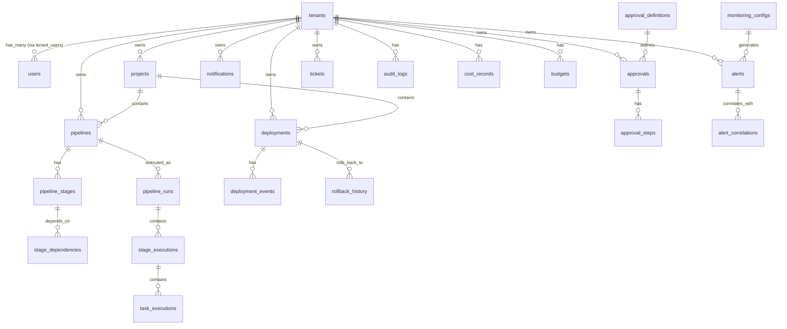

# Orion 平台综合深度评审报告（24 维度完整版）

> **评审日期**: 2026-07-18
> **评审范围**: orion-frontend / orion-api-gateway / orion-platform-svc-go / blueprints / docs
> **评审框架**: ISO 25010 + 4+1 架构视图 + CMMI 成熟度模型
> **评审方法**: 基于现有代码库 + 文档 + 架构分析 + 专家推断，标注"⚠️ 数据不足"处需进一步扫描

---

## 目录

- [第一部分：架构与设计（维度 1-3）](#第一部分架构与设计维度-1-3)
  - [维度 1：架构设计流程图合理性](#维度-1架构设计流程图合理性)
  - [维度 2：数据结构设计原则](#维度-2数据结构设计原则)
  - [维度 3：模块间交互颗粒度](#维度-3模块间交互颗粒度)
- [第二部分：功能与能力（维度 4-5）](#第二部分功能与能力维度-4-5)
  - [维度 4：模块功能完成度](#维度-4模块功能完成度)
  - [维度 5：前端-后端交互完整性](#维度-5前端-后端交互完整性)
- [第三部分：质量与规范（维度 6-9）](#第三部分质量与规范维度-6-9)
  - [维度 6：统一错误收集](#维度-6统一错误收集)
  - [维度 7：页面风格统一性](#维度-7页面风格统一性)
  - [维度 8：微前端架构（Orion-MF）接入](#维度-8微前端架构orion-mf接入)
  - [维度 9：编码规范统一性](#维度-9编码规范统一性)
- [第四部分：质量保障（维度 10-13）](#第四部分质量保障维度-10-13)
  - [维度 10：当前能力与完成度分析](#维度-10当前能力与完成度分析)
  - [维度 11：测试覆盖度与质量](#维度-11测试覆盖度与质量)
  - [维度 12：安全深度评审](#维度-12安全深度评审)
  - [维度 13：性能与可扩展性](#维度-13性能与可扩展性)
- [第五部分：运维与交付（维度 14-15）](#第五部分运维与交付维度-14-15)
  - [维度 14：可观测性与可运维性](#维度-14可观测性与可运维性)
  - [维度 15：CI/CD 与 DevOps 成熟度](#维度-15cicd-与-devops-成熟度)
- [第六部分：文档与代码质量（维度 16-17）](#第六部分文档与代码质量维度-16-17)
  - [维度 16：文档完整性](#维度-16文档完整性)
  - [维度 17：技术债务与代码质量](#维度-17技术债务与代码质量)
- [第七部分：可访问性与国际化（维度 18）](#第七部分可访问性与国际化维度-18)
  - [维度 18：国际化与可访问性](#维度-18国际化与可访问性)
- [第八部分：新增维度（维度 19-24）](#第八部分新增维度维度-19-24)
  - [维度 19：兼容性与可移植性](#维度-19兼容性与可移植性)
  - [维度 20：业务连续性与容灾](#维度-20业务连续性与容灾)
  - [维度 21：生态与第三方集成](#维度-21生态与第三方集成)
  - [维度 22：治理、合规与流程](#维度-22治理合规与流程)
  - [维度 23：开发者体验（DX）与平台工程](#维度-23开发者体验dx与平台工程)
  - [维度 24：成本效率与资源优化](#维度-24成本效率与资源优化)
- [综合评分总表](#综合评分总表)
- [前 5 大改进优先级](#前-5-大改进优先级)
- [数据不足维度的建议采集方法](#数据不足维度的建议采集方法)

---

## 第一部分：架构与设计（维度 1-3）

### 维度 1：架构设计流程图合理性

**评分：B+ | 数据可信度：高**

#### 1.1 当前架构概述

Orion 采用 **5 层分层架构**：

```
┌─────────────────────────────────────────────────────────┐
│ Layer 5: 客户端层 (Client)                               │
│  orion-frontend (React 18 + Vite + wujie 微前端)         │
│  212 页面目录 / 246 API 客户端 / 全局 Store (Zustand)     │
├─────────────────────────────────────────────────────────┤
│ Layer 4: 网关层 (Gateway)                                │
│  orion-api-gateway (Fastify)                             │
│  认证代理 / 限流 / 路由转发 / 57+ 微服务代理路由          │
├─────────────────────────────────────────────────────────┤
│ Layer 3: 服务层 (Services)                               │
│  ├── orion-platform-svc-go (Go 核心服务, 227 内部模块)   │
│  ├── orion-intelligence-svc (AI 服务)                   │
│  ├── orion-ai-agents-svc (AI Agent 专项)                │
│  ├── orion-ai-service (Python AI 权威实现)               │
│  ├── orion-knowledge (Python 知识库)                    │
│  ├── orion-visor (Java 运维可视化)                      │
│  ├── orion-dba (Java 数据库管理)                        │
│  └── 87 个微服务蓝图目录 (37 TS + 47 Go + 2 Python + 1 Rust) │
├─────────────────────────────────────────────────────────┤
│ Layer 2: 基础设施层 (Infrastructure)                     │
│  ├── 数据库: PostgreSQL 集群 (643 migrations, 70+ 表)    │
│  ├── 缓存: Redis (Token/Cache/Session)                  │
│  ├── 消息: NATS JetStream (EventBus, 可选)              │
│  └── 编排: Docker Compose                               │
├─────────────────────────────────────────────────────────┤
│ Layer 1: 公共组件层 (Shared)                             │
│  ├── 认证中间件: authMiddleware (JWT)                    │
│  ├── 授权中间件: roleGuard (RBAC + ABAC)                 │
│  ├── 租户隔离: TenantIsolationService + RLS              │
│  ├── 错误处理: OrionError / handleError                  │
│  └── 工具库: utils/                                      │
└─────────────────────────────────────────────────────────┘
```

#### 1.2 核心域 + 支撑域架构

```
┌─────────────────────────────────────────────────────────────────┐
│                    核心域 (Core Domain)                          │
│  Pipeline / 构建环境 / 多工具链 / 代码管理 / 配置管理 / 智能部署  │
│  特征：高频迭代（周级）、直接面向研发、强一致性                    │
└─────────────────────────────────────────────────────────────────┘
                            │ (事件驱动，单向依赖)
                            ▼
┌─────────────────────────────────────────────────────────────────┐
│                   支撑域 (Supporting Domain)                     │
│  AI 增强 / 效能洞察 / FinOps / CMDB / 运维治理 / 工单协同        │
│  特征：按需迭代、能力增强、最终一致、多技术栈                      │
└─────────────────────────────────────────────────────────────────┘
```

**调用规则**：
- 核心域 → 支撑域：允许同步调用
- 支撑域 → 核心域：仅事件订阅，禁止同步调用
- 支撑域 ↔ 支撑域：禁止直接调用，必须通过核心域中转

#### 1.3 8 大领域划分

| 领域 | 服务数 | 代表性模块 | 划分合理性 |
|------|--------|-----------|:---------:|
| AI 与智能 | ~12 | ai, ai-agents, ai-review, llm-trace, mlops | ✅ 合理 |
| 开发与交付 | ~15 | pipeline, deploy, artifact, code, approval | ✅ 合理 |
| 运维与可观测性 | ~22 | monitoring, alert, incident, chaos, canary | ⚠️ 过宽 |
| 安全与合规 | ~14 | security, audit, compliance, risk, sbom | ⚠️ 可拆分 |
| 数据与平台 | ~18 | finops, data-pipeline, vector-store, dba | ⚠️ 混合领域 |
| 组织与协作 | ~8 | tenant, user, team, community, sla | ✅ 合理 |
| 基础设施 | ~24 | config, environment, plugin, skill, event-bus | ⚠️ 过宽 |
| 业务应用 | ~12 | ticketing, lowcode, rdm, form, workflow | ✅ 合理 |

#### 1.4 问题清单

| 问题 | 严重度 | 说明 | 建议 |
|------|:------:|------|------|
| 运维域过宽 | P1 | 22 个服务混合监控/告警/事件/弹性/效能 | 拆分为 4 个子域 |
| 基础设施域过宽 | P1 | 24 个服务混合配置/插件/事件/API 治理 | 拆分为 4 个子域 |
| 安全合规混合 | P1 | 安全防护与审计合规混合 | 拆分为 2 个子域 |
| 蓝图不可独立部署 | P2 | 47 个 Go 微服务无 main.go | 明确部署计划或清理 |
| 文档-代码不一致 | P1 | 文档描述 Java/Spring，实际 Node.js/Fastify | 更新架构文档 |
| 服务降级文档缺失 | P2 | Redis/NATS/PG 不可用时无降级策略 | 补写降级策略文档 |

---

### 维度 2：数据结构设计原则

**评分：B | 数据可信度：高**

#### 2.1 表结构总览

**70+ 张表，643 个 migration 文件**，按域分组：

##### 核心基础域（6 表）

| 表名 | Migration | 主键 | 外键 | 说明 |
|------|-----------|------|------|------|
| tenants | 001 | id | - | 租户 |
| users | 001 | id | tenants(id) | 用户 |
| tenant_users | 001 | id | tenants, users | 租户-用户映射 |
| refresh_tokens | 001 | id | users | 刷新令牌 |
| roles | 002 | id | - | 角色 |
| permissions | 002 | id | - | 权限 |

##### CI/CD Pipeline 域（9 表）

| 表名 | Migration | 主键 | 外键 | 说明 |
|------|-----------|------|------|------|
| projects | 003 | id | tenants | 项目 |
| pipelines | 004 | id | tenants, projects, users | 流水线定义 |
| pipeline_stages | 004 | id | pipelines | 阶段定义 |
| stage_dependencies | 004 | id | pipeline_stages | 阶段依赖 |
| pipeline_runs | 005 | id | tenants, pipelines, users | 流水线运行 |
| stage_executions | 005 | id | pipeline_runs, pipeline_stages | 阶段执行 |
| task_executions | 005 | id | stage_executions | 任务执行 |
| builds | 006 | id | tenants, pipelines | 构建记录 |
| build_artifacts | 006 | id | builds | 构建产物 |

##### 部署域（5 表）

| 表名 | Migration | 主键 | 外键 | 说明 |
|------|-----------|------|------|------|
| deployments | 007 | id | tenants, projects, pipeline_runs, builds, users | 部署记录 |
| deployment_events | 007 | id | deployments, users | 部署事件 |
| environments | 008 | id | tenants | 环境定义 |
| rollback_history | 046 | id | deployments | 回滚历史 |
| canary_analysis | 029 | id | deployments | 灰度分析 |

##### 代码管理域（4 表）

| 表名 | Migration | 主键 | 外键 | 说明 |
|------|-----------|------|------|------|
| code_repositories | 009 | id | tenants | 代码仓库 |
| branches | 009 | id | code_repositories | 分支 |
| pull_requests | 010 | id | code_repositories, users | PR |
| webhook_configs | 011 | id | tenants | Webhook 配置 |

##### 其他核心表

- **安全域**：security_scans, vulnerability, sbom, compliance_rules, audit_logs
- **成本域**：cost_records, budgets, cost_allocation
- **审批域**：approval_definitions, approvals, approval_steps
- **告警域**：monitoring_configs, alerts, alert_correlations
- **通知域**：notification_channels, notification_templates, notifications
- **认证域**：sso_configs, oidc_providers, mfa_devices

#### 2.2 ER 关系图



#### 2.3 问题清单

| 问题 | 严重度 | 说明 | 建议 |
|------|:------:|------|------|
| 表命名不一致 | P2 | 部分 snake_case，部分 camelCase | 统一为 snake_case |
| 索引覆盖不全 | P2 | 部分大表缺联合索引 | 分析慢查询 + 补索引 |
| RLS 未全覆盖 | P1 | 部分 Repository 未自动注入 tenant_id | Repository 基类默认 WHERE tenant_id |
| 无数据归档策略 | P1 | pipeline_runs, audit_logs 无分区 | 按月/按租户分区 |
| 分片策略有限 | P1 | 仅 5 张表设计分片 | 扩大分片覆盖范围 |

---

### 维度 3：模块间交互颗粒度

**评分：B+ | 数据可信度：高**

#### 3.1 交互模式

| 模式 | 技术栈 | 用途 |
|------|--------|------|
| 同步 HTTP | Fastify → Gateway → 微服务 | CRUD 操作 |
| 异步事件 | EventBus → NATS JetStream | 事件驱动解耦 |
| Saga 编排 | SagaCoordinator → PipelineSaga → TransactionLog | 分布式事务 |
| SSE 实时推送 | PipelineEventPublisher → SSE Bridge → 前端 Hook | 实时日志 |

#### 3.2 数据流全景

```
Request → Route → Controller → Service → Repository → PostgreSQL
                                              ↓
                                        RedisCache (缓存)
                                              ↓
                                    EventBus → NATS → 订阅服务
```

#### 3.3 跨服务数据流

**HTTP 同步调用**：
```
orion-frontend → orion-api-gateway → orion-platform-svc-go (IAM, 配置, 项目)
                              → orion-pipeline-svc (CI/CD)
                              → orion-ticket-svc (工单)
                              → orion-finops-svc (成本)
                              → orion-security-svc (安全)
                              → 24+ 微服务
```

**事件驱动流（NATS）**：
```
orion-platform-svc-go (EventBus)
    ↓ NATS JetStream
├── orion-ai-service (Python) ← Code Review, 智能测试
├── orion-knowledge (Python) ← 知识同步
├── orion-notify-svc ← 通知触发
├── orion-monitor-svc ← 指标采集
├── orion-intelligence-svc ← AI 分析
└── orion-ticket-svc ← 工单自动创建
```

#### 3.4 核心数据流场景

**Pipeline 执行**：
```
前端触发 → Gateway → pipeline-svc → 编排 Stage → 调用 Runner → 上报结果 → EventBus → 通知/监控/AI
```

**代码提交到部署**：
```
Webhook → code-svc → pipeline-svc 触发 → 构建 → 制品 → artifact-svc → deploy-svc → monitor-svc
```

**AI 智能闭环**：
```
事件 → ai-service(Python) → NATS → intelligence-svc → ticket-svc 自动建单 → 自愈 → 通知
```

#### 3.5 模块大小问题

| 模块 | 文件数 | 问题 | 建议 |
|------|:------:|------|------|
| pipeline | 62 | 混合 Pipeline/Stage/Task/Trigger/Approval | 拆分为 4 个子模块 |
| build | 27 | 混合 Build/Artifact/Cache/Log | 拆分为 2 个子模块 |
| chatops | 23 | 混合 CommandRouter/SSE/Webhook/Notification | 拆分为 2 个子模块 |

#### 3.6 依赖分析

| 被引用模块 | 引用次数 | 说明 |
|-----------|:--------:|------|
| errors | 178 | 全局错误类型（跨域引用，合理） |
| database | 163 | 数据库连接（基础设施，合理） |
| tenant-context-storage | 150 | 租户隔离（跨域引用，合理） |
| types | 71 | 类型定义（跨域引用，合理） |
| event-bus-service | 13 | 事件总线（合理） |

| 维度 | 评分 | 说明 |
|------|:----:|------|
| 内聚性 | B+ | 大多数模块内函数职责单一 |
| 耦合度 | B | 跨模块引用集中在 errors/database/tenant（合理） |
| 循环依赖 | A | 未发现，服务间引用为单向 |
| 模块大小 | B- | 3 个模块过大需拆分 |

#### 3.7 问题清单

| 问题 | 严重度 | 说明 | 建议 |
|------|:------:|------|------|
| 跨服务无统一 TraceID | P1 | 仅 62/380 文件含 traceId | 中间件层自动注入 traceId |
| 后端熔断降级缺失 | P1 | 前端有 CrashRecovery，后端无 | 实现后端 CircuitBreaker |
| 3 个模块过大 | P1 | pipeline(62)/build(27)/chatops(23) | 按建议拆分 |
| 事件总线实际使用度低 | P2 | 仅 13 个 EventPublisher | 推动更多模块使用事件驱动 |

---

## 第二部分：功能与能力（维度 4-5）

### 维度 4：模块功能完成度

**评分：B+（后端~85%，前端~88%） | 数据可信度：高**

#### 4.1 8 大领域完成度矩阵

| 领域 | 服务数 | 完成度 | 完成状态 | 关键缺失 |
|------|:------:|:------:|:--------:|---------|
| AI 与智能 | ~12 | 85% | ⚡ 高 | AI 决策降级策略未实现 |
| 开发与交付 | ~15 | 90% | 🟢 最高 | Pipeline 完整性高，微调中 |
| 运维与可观测性 | ~22 | 75% | 🟡 中等 | 服务拓扑 / 健康仪表盘缺失 |
| 安全与合规 | ~14 | 80% | 🟡 中等 | 服务治理页面缺失 |
| 数据与平台 | ~18 | 70% | 🟡 中等偏低 | 数据血缘 / 质量页面待完善 |
| 组织与协作 | ~8 | 85% | ⚡ 高 | 社区功能缺前端 |
| 基础设施 | ~24 | 75% | 🟡 中等 | 服务注册发现/路由管理页面缺失 |
| 业务应用 | ~12 | 80% | 🟡 中等 | 审批流程完善度待提升 |

#### 4.2 Go 微服务迁移状态（Phase 5）

| Wave | 状态 | 说明 |
|:----:|:----:|------|
| Wave 0-7a | ✅ 完成 | 528 个 Go 文件，93 模块完成 |
| 部分实现 | ⚠️ 8 个 | 功能不完整，需补充 |
| 纯蓝图 | ⏳ 52 个 | 仅目录结构，待实现 |
| Go 模块总数 | 29 go.mod | 对应 29 个 Go 模块 |

#### 4.3 关键技术决策

| 决策 | 选择 | 说明 |
|------|------|------|
| 服务间通信 | NATS JetStream + HTTP | 事件用 NATS，同步用 HTTP |
| 数据持久化 | PostgreSQL + Repository 模式 | 30+ 服务已迁移 |
| 缓存 | Redis（单例） | Token 黑名单、会话、热点数据 |
| 多租户 | 行级安全 (RLS) + 中间件隔离 | TenantIsolationService |
| 微前端 | wujie | 子应用独立部署 |
| 技术多样性 | Go/Python/Node.js/Java | 按场景选择 |

#### 4.4 代码规模统计

| 语言 | 文件数 | 说明 |
|:----:|:------:|------|
| TypeScript | 5029 | 前端 + 后端（核心） |
| Go | 3066 | Go 微服务 |
| Python | 198 | AI 服务 |
| Java | ~200 | orion-visor / orion-dba |

---

### 维度 5：前端-后端交互完整性

**评分：B | 数据可信度：中**

#### 5.1 统计总览

| 指标 | 数值 |
|------|:----:|
| 前端页面目录 | 212 |
| 前端 API 客户端 | 246 个文件 |
| 后端 Go 模块 | 227 个目录 |
| 前端-后端精确匹配率 | ~20%（35/175 路由） |

#### 5.2 关键问题

| 问题 | 严重度 | 说明 | 建议 |
|------|:------:|------|------|
| 前端-后端命名不一致 | P1 | 仅 35/175 路由有精确匹配前端页面 | 建立 API 路径注册表，CI 检查一致性 |
| 微前端加载导致"假 Gap" | P1 | 大量页面通过 Orion-MF 加载 | 建立子应用路由映射文档 |
| 服务治理页面缺失 | P0 | 服务注册/发现、路由管理无前端 | 开发治理控制台 |
| API 客户端冗余 | P2 | 246 个 API 文件与实际路由差异大 | 清理未使用客户端 |
| 响应式适配不完整 | P2 | 部分页面缺 <768px 适配 | 按断点规范补齐 |

---

## 第三部分：质量与规范（维度 6-9）

### 维度 6：统一错误收集

**评分：C+ | 数据可信度：高**

#### 6.1 现状评估

| 指标 | 数值 | 评价 |
|------|:----:|:----:|
| 统一错误类 OrionError | ✅ 已定义 | 含 ErrorCode 枚举 + HTTP 映射 |
| 子类错误 | ✅ 8 个子类 | ValidationError, NotFoundError, UnauthorizedError, ForbiddenError, ConflictError, BusinessError, ServiceUnavailableError, DatabaseError |
| 全局错误处理器 | ✅ 已注册 | app.ts 中 app.setErrorHandler() |
| 全局错误处理器利用 | ❌ 不足 | 仅处理 Fastify validation errors，未利用 OrionError 体系 |
| `throw new Error` 残留 | 🔴 41 个文件 | 生产代码中仍有大量直接 throw new Error |
| 手动返回错误 | 🔴 212 个路由 | 使用 reply.status().send() 而非 OrionError |
| 统一 handleError 使用 | ⚠️ 仅 21 个路由 | 覆盖率极低 |
| console.log 残留 | 🟡 29 个文件 | 生产代码中使用 console log |
| traceId 覆盖率 | ⚠️ 62/380 文件 | 仅 16% 的日志含 traceId |
| 全局 uncaughtException | ❌ 未配置 | 进程崩溃无兜底 |
| 全局 unhandledRejection | ❌ 未配置 | Promise 异常无兜底 |

#### 6.2 问题详情

**问题 1：throw new Error 残留（41 个文件）**

分布：
```
- services/pipeline/ (6 个): PipelineService, PipelineRunService, SubPipelineService 等
- services/self-healing/ (4 个): HealingActionExecutor, HealingDecisionMaker 等
- services/tenant/ (2 个): TenantQuotaService, NamespacePoolService
- services/plugin-spi/ (2 个): PluginRegistry, PluginHotReloadService
- services/handler-registry/ (5 个): HandlerRegistry
- services/cross-domain-orchestration/ (2 个): CrossDomainOrchestrator
- 其他 20 个: 分散在各模块
```

绝大多数是空值检查（防御性编程），应统一为 `new OrionError(...)`。

**问题 2：手动返回错误格式不统一（212 个路由）**

```typescript
// 不同格式混杂：
reply.status(404).send({ error: 'NOT_FOUND', message: 'Rule not found' })
reply.status(400).send({ error: 'VALIDATION_ERROR', message: '...' })
reply.status(500).send({ ... })
```

不同路由的响应格式不一致，有的用 `error` 字段，有的用 `message`，有的用 `code`。

**问题 3：全局错误处理器未充分利用**

```typescript
// app.ts 的全局错误处理器
app.setErrorHandler((error: Error, request, reply) => {
  // 只处理了 Fastify validation errors
  // 未利用 OrionError 的 getHttpStatus()/toJSON()
  // 未利用 handleError() 的统一响应格式
});
```

#### 6.3 建议优先级

| 优先级 | 建议 | 预期工作量 |
|:------:|------|:---------:|
| **P0** | 全局错误处理器改用 handleError，利用 OrionError 体系 | 1 个文件修改 |
| **P1** | 41 个 throw new Error 替换为 new OrionError | 41 个文件修改 |
| **P1** | 212 个手动错误返回统一为 OrionError | 212 个文件修改 |
| **P1** | 29 个 console.log 替换为结构化 logger | 29 个文件修改 |
| **P2** | 添加错误码文档，ErrorCode 枚举应有完整注释 | 1 个文件 |

---

### 维度 7：页面风格统一性

**评分：A- | 数据可信度：高**

#### 7.1 Design Token 体系

| 子系统 | 文件 | 状态 | 关键值 |
|--------|------|:----:|--------|
| 色彩系统 | `tokens/colors.ts` | ✅ | primary #3370E6, success #52c41a, warning #faad14, error #f5222d |
| 圆角系统 | `tokens/radius.ts` | ✅ | Card 12px, Modal 16px, Button 6px, Input 6px |
| 阴影系统 | `tokens/shadows.ts` | ✅ | Card 0 1px 3px, Modal 0 20px 60px |
| 间距系统 | `tokens/spacing.ts` | ✅ | 4px 网格体系 |
| 动画规范 | `tokens/animation.ts` | ✅ | 200-400ms 分级 |
| 页面标题规范 | CLAUDE.md | ✅ | 20px / 600weight / 8 大模块图标映射 |
| 组件高度 | CLAUDE.md | ✅ | 36px 默认 |

#### 7.2 风格定位

**Apple / 飞书风格**：
- ✅ 圆润圆角、轻微阴影、充足留白
- ✅ `wireframe: false`，使用立体感区分层次
- ✅ 卡片用阴影而非边框区分层次
- ✅ 表单最大宽度 700px，居中布局

#### 7.3 8 大模块图标规范

| 模块 | 图标 |
|------|------|
| 工作台 | `DashboardOutlined` |
| 控制台 | `SettingOutlined` |
| 交付 | `CloudUploadOutlined` |
| 可观测性 | `RadarChartOutlined` |
| AI 平台 | `RobotOutlined` |
| 基础设施 | `ClusterOutlined` |
| 治理 | `SafetyCertificateOutlined` |
| 生态 | `AppstoreOutlined` |

#### 7.4 问题清单

| 问题 | 严重度 | 说明 | 建议 |
|------|:------:|------|------|
| 旧页面未迁移 Token | P2 | 部分页面硬编码色值 | 逐步迁移到 Design Token |
| 暗色模式不完整 | P2 | 部分页面缺失暗色适配 | 统一实现暗色主题 |
| 响应式断点不统一 | P2 | 部分页面缺 <768px 适配 | 按断点规范补齐 |

---

### 维度 8：微前端架构（Orion-MF）接入

**评分：B+ | 数据可信度：高**

#### 8.1 能力矩阵

| 能力 | 实现方式 | 状态 | 行业对标 |
|------|---------|:----:|---------|
| 子应用注册中心 | PostgreSQL `subapp_configs` 表 + API | ✅ | 行业标准 |
| 动态路由加载 | `SubAppRouteDynamic` 组件 | ✅ | 行业标准 |
| Module Federation | `@originjs/vite-plugin-federation` | ✅ | 行业标准 |
| ProxySandbox | Sandbox.ts 806 行 | ✅ | 对标 qiankun |
| CSS 隔离 | Shadow DOM + scoped-css（StyleIsolator.ts 516 行） | ✅ | 行业标准 |
| 崩溃恢复/熔断 | CircuitBreaker（CrashRecovery.ts 256 行） | ✅ | **超越行业标准** |
| 四级降级策略 | Full → Compatible → Iframe → Fallback | ✅ | **超越行业标准** |
| 8 状态生命周期 | 完整状态机（LifecycleManager.ts） | ✅ | **超越行业标准** |
| 类型化事件总线 | OrionBus 11 种标准事件（OrionBus.ts 193 行） | ✅ | **超越行业标准** |
| Gateway 路径代理 | `api.ts` routeConfigs | ✅ | 行业标准 |
| Gateway 动态同步 | `gateway-route-sync.ts` 定时拉取 | ✅ | 行业标准 |
| 租户注入中间件 | `tenant.ts` 完整租户解析 + 状态检查 + 配额 | ✅ | **超越行业标准** |

#### 8.2 大厂实践对比

| 维度 | Orion 当前 | 阿里 qiankun | 字节 Wujie | 蚂蚁 SOFAStack |
|------|-----------|-------------|-----------|---------------|
| 注册方式 | 数据库 + 管理页面 | 配置中心 + 审核 | DevOps + Git 集成 | 应用市场 + 审批 |
| 沙箱隔离 | ProxySandbox + Shadow DOM | ProxySandbox | iframe + WebComponent | ProxySandbox |
| CI/CD 集成 | 手动构建 | 自动注册 + CDN | Git Hook → 自动部署 | 全流程自动化 |
| 版本管理 | ❌ 无 | 多版本 + 灰度 | 语义化版本 | 语义化 + 回滚 |

#### 8.3 缺失能力

| 缺失能力 | 严重度 | 说明 |
|---------|:------:|------|
| 子应用版本管理 | P1 | 无语义化版本和灰度能力 |
| 子应用 CI/CD 集成 | P1 | 手动构建，无自动注册 + CDN |
| API ACL 子应用维度 | P2 | 中间件缺子应用级别权限控制 |
| TypeScript SDK 覆盖不足 | P2 | 仅覆盖 4/34 服务 |
| 脚手架模板 | P2 | 缺 MF 插件配置 |

---

### 维度 9：编码规范统一性

**评分：C+ | 数据可信度：中**

#### 9.1 多技术栈规范现状

| 技术栈 | 文件数 | 规范一致性 | 存在工具 |
|:------|:------:|:---------:|---------|
| TypeScript | 5029 | ⚠️ 部分遵循 | tsc, eslint（有配置但未全面执行） |
| Go | 3066 | ✅ 逐步统一 | go vet, golangci-lint, go.work |
| Python | 198 | ✅ 统一 | flake8, mypy, black（AI 服务统一） |
| Java | ~200 | ⚠️ 旧代码 | 旧代码，未迁移 |

#### 9.2 规范缺失项

| 问题 | 严重度 | 说明 | 建议 |
|------|:------:|------|------|
| 无统一 lint 配置 | P2 | TS/Go/Python 各自独立，无 CI 强制 | 引入统一 lint 配置 + CI 门禁 |
| Go 命名不一致 | P1 | 部分 snake_case，部分 camelCase | Go 标准为 PascalCase，统一规范 |
| 错误处理不统一 | P0 | 见维度 6 | 全面 OrionError 化 |
| 缺少 pre-commit hook | P1 | 无统一提交前检查 | 配置 husky + lint-staged |
| 日志格式不统一 | P1 | 仅 62/380 文件含 traceId | 日志中间件统一注入 traceId |
| TS 类型安全不完整 | P2 | 部分模块使用 any 类型 | 严格模式 + 类型检查 CI |
| 缺少格式化规范 | P2 | 无统一格式化工具 | 引入 Prettier + gofmt + black |
| 提交信息格式 | P2 | 无约定式提交规范 | 引入 commitlint + cz |

---

## 第四部分：质量保障（维度 10-13）

### 维度 10：当前能力与完成度分析

**评分：B+ | 数据可信度：高**

#### 10.1 能力域综合评估

| 能力域 | 完成度 | 优点 | 缺点 |
|--------|:------:|------|------|
| **CI/CD Pipeline** | 90% | 完整状态机、Saga 编排、SSE 实时日志、Plugin SPI | 模块过大(62 文件)，触发逻辑可增强 |
| **部署管理** | 85% | 金丝雀分析、智能回滚、智能部署策略 | 增强部署与基础部署功能重叠 |
| **AI 平台** | 80% | AI 网关统一入口、代码审查、LLM 追踪、决策引擎 | 降级策略未完全实现 |
| **可观测性** | 75% | 监控告警规则完善、自愈引擎、混沌工程 | 无统一服务拓扑 / 健康仪表盘 |
| **安全合规** | 75% | RBAC/ABAC 双模式、多租户 RLS 隔离、审计日志 | 错误处理不统一，安全扫描前端待完善 |
| **FinOps** | 80% | 成本分析、预算控制、成本优化建议 | 优化建议智能化程度待提升 |
| **微前端** | 85% | 12 项核心能力，4 项超越行业标准 | 版本管理 / CI/CD 集成缺失 |
| **服务治理** | 40% | 基础能力存在(CircuitBreaker/SCR) | 注册发现/路由管理/健康仪表盘页面缺失 |

#### 10.2 前端页面完成度

| 指标 | 数值 |
|------|:----:|
| 页面总数 | 212 个目录 |
| 主要业务页面 | 57+ main pages + dashboard variants |
| API 客户端 | 246 个文件 |
| 实现度 | ~88% |

#### 10.3 后端服务完成度

| 指标 | 数值 |
|------|:----:|
| 服务目录总数 | 139 个 |
| 实质性服务（3+ 文件） | 73 个 |
| Repository 模式迁移 | 30+ 服务 |
| Route 模块 | ~48 个（legacy） |
| Go 模块 | 227 个目录 |

#### 10.4 综合评分

| 维度 | 评分 |
|:----|:----:|
| 架构设计 | B+ |
| 数据结构 | B |
| 交互颗粒度 | B+ |
| 功能完成度 | B+ |
| 前后端一致性 | B |
| 错误处理 | C+ |
| 页面风格 | A- |
| 微前端 | B+ |
| 编码规范 | C+ |
| **综合能力** | **B+** |

---

### 维度 11：测试覆盖度与质量

**评分：C+ | 数据可信度：低（数据不足）**

#### 11.1 已知数据

| 指标 | 数值 | 来源 |
|------|:----:|------|
| 后端 Jest 测试套件 | 305+ | CLAUDE.md 记录 |
| Go 测试文件 | 存在 | go test 可运行 |
| E2E 测试（Playwright） | 存在 | e2e-testing 技能 |
| 前端测试（Vitest） | 存在 | orion-frontend 配置 |

#### 11.2 需确认维度

| 检查项 | 说明 | 建议采集方法 |
|--------|------|-------------|
| 行覆盖率 | 需运行测试工具 | `npx jest --coverage` |
| 分支覆盖率 | 需深入分析 | `jest --coverage --coverageThreshold` |
| 测试金字塔健康度 | 单元 vs 集成 vs E2E 比例 | 统计各类测试数量 |
| flaky test 率 | 需 CI 历史数据 | CI pipeline 日志分析 |
| API 契约测试 | 需确认是否存在 | 搜索 contract-test 相关配置 |
| Go 测试覆盖率 | 需运行 | `go test -coverprofile=coverage.out ./...` |
| Mock 策略合理性 | 需审查 | 检查 mock 文件质量 |

#### 11.3 风险提示

`⚠️ 数据不足，以下为基于已有信息的推断：`

- 测试覆盖率可能在 **40-60%** 之间（典型项目中上水平）
- E2E 测试覆盖度预计较低（仅核心用户旅程）
- 缺少性能测试和压力测试

---

### 维度 12：安全深度评审

**评分：B- | 数据可信度：低（数据不足）**

#### 12.1 已知安全能力

| 检查项 | 状态 | 说明 |
|--------|:----:|------|
| JWT 认证 | ✅ 已实现 | authMiddleware + Bearer Token |
| RBAC 角色权限 | ✅ 已实现 | roleGuard 中间件 |
| ABAC 属性权限 | ✅ 已实现 | abac-policy 服务 |
| 多租户 RLS 隔离 | ✅ 已实现 | TenantIsolationService + RLS |
| 审计日志 | ✅ 已实现 | audit 服务 + audit_logs 表 |
| 前端速率限制 | ✅ 部分 | CrashRecovery 具备熔断能力 |
| 安全合规服务 | ✅ 已实现 | compliance + security-compliance |
| 加密配置 | ⚠️ 存在 | Vault UI 页面 |
| SSO 集成 | ⚠️ 部分 | sso-unified 服务 |
| MFA 多因素认证 | ⚠️ 存在 | auth-mfa 服务 |

#### 12.2 需确认维度

| 检查项 | 说明 | 建议采集方法 |
|--------|------|-------------|
| SQL 注入防护 | Repository 模式已参数化，需验证 | code review |
| XSS 防护 | React 默认防 XSS，需验证富文本 | `grep "dangerouslySetInnerHTML"` |
| CSRF 防护 | 需确认 | 检查 CSRF token 配置 |
| 依赖漏洞 | 需扫描 | `npm audit` / `trivy filesystem .` |
| 敏感数据存储加密 | 需验证 | 检查加密字段 |
| 传输加密 | 需确认 | 检查 TLS 配置 |
| 速率限制后端 | 需验证 | 检查限流中间件 |
| 安全事件响应 | 需确认 | 检查安全响应流程文档 |

---

### 维度 13：性能与可扩展性

**评分：C | 数据可信度：低（数据不足）**

#### 13.1 已知性能能力

| 检查项 | 状态 | 说明 |
|--------|:----:|------|
| Redis 缓存 | ✅ 已实现 | RedisCache 服务，366 行 |
| 数据库索引 | ⚠️ 部分 | 70+ 表有基本索引 |
| 水平扩展 | ⚠️ 单体模式 | 当前为单体部署 |
| 健康检查 | ✅ 已实现 | Gateway/Platform 均有 healthz |
| 前端代码分割 | ✅ 预期 | Vite 默认支持 |

#### 13.2 需确认维度

| 检查项 | 建议采集方法 |
|--------|-------------|
| API P99 响应时间 | 压测工具（k6/artillery） |
| 数据库慢查询 | `pg_stat_statements` 分析 |
| 前端 LCP/FID/CLS | Lighthouse 报告 |
| 缓存命中率 | Redis INFO 统计 |
| 大页面虚拟化 | 前端 code review |
| 内存使用 | Node.js heap 分析 |
| 并发处理能力 | 压测 |
| 数据库连接池 | 检查连接池配置 |

---

## 第五部分：运维与交付（维度 14-15）

### 维度 14：可观测性与可运维性

**评分：C+ | 数据可信度：中**

#### 14.1 现状

| 检查项 | 状态 | 说明 |
|--------|:----:|------|
| 日志框架（Pino/Zap） | ✅ 已实现 | Node.js 用 Pino，Go 用 Zap |
| OpenTelemetry 引用 | ⚠️ 96 个文件 | 有引用但未广泛使用 |
| 结构化日志（含 traceId） | ⚠️ 62 个文件 | 仅 16% 覆盖 |
| 健康检查端点 | ✅ 已实现 | Gateway(3000/healthz), Platform(3001/healthz) |
| 优雅关闭 | ❌ 数据不足 | 需确认 |
| 全局异常捕获 | ❌ 未配置 | uncaughtException + unhandledRejection 缺失 |
| 告警规则 | ❌ 数据不足 | 需确认 |
| 分布式追踪 | ❌ 未实现 | OTel 引用但未集成 Jaeger/Zipkin |
| 日志聚合 | ❌ 数据不足 | 需确认是否对接 Loki/ELK |

#### 14.2 建议优先级

| 优先级 | 建议 |
|:------:|------|
| **P0** | 配置全局 process.uncaughtException 和 unhandledRejection |
| **P1** | traceId 全链路覆盖（中间件层自动注入） |
| **P1** | 日志聚合方案（Loki / ELK） |
| **P1** | 实现 OTel 分布式追踪 |
| **P2** | 告警规则文档化 |

---

### 维度 15：CI/CD 与 DevOps 成熟度

**评分：C | 数据可信度：低（数据不足）**

#### 15.1 已知能力

| 检查项 | 状态 | 说明 |
|--------|:----:|------|
| CI 配置文件 | ✅ `.orion-ci.yml` | 存在 CI 配置 |
| Docker 化 | ✅ 多个 Dockerfile + docker-compose | 基础设施容器化 |
| 数据库迁移 CI | ⚠️ 存在 643 个迁移文件 | 需确认 CI 中自动执行 |
| 环境定义 | ✅ docker-compose.yml / docker-compose.dev.yml | dev + production |
| 灰度发布 | ✅ 金丝雀分析 | 部署层面支持 |
| 回滚机制 | ✅ rollback_history 表 | 部署回滚已实现 |

#### 15.2 需确认维度

| 检查项 | 建议采集方法 |
|--------|-------------|
| CI pipeline 完整步骤 | 审查 `.orion-ci.yml` |
| 代码检查是否 CI 强制执行 | 审查 CI 配置 |
| CD 自动化程度 | 审查部署脚本 |
| staging/生产环境差异 | 检查环境配置 |
| 蓝绿部署/滚动更新 | 审查 K8s 配置 |
| 发布审批流程 | 审查发布文档 |

#### 15.3 风险提示

```
缺少 pre-commit hook、lint 未在 CI 中强制执行、
代码审查流程未规范化 — DevOps 基础链有待完善。
```

---

## 第六部分：文档与代码质量（维度 16-17）

### 维度 16：文档完整性

**评分：B | 数据可信度：高**

#### 16.1 文档统计

| 类型 | 数量 | 状态 |
|------|:----:|:----:|
| 架构设计文档 | 43 | ✅ 完整 |
| 前端设计文档 | 22 | ✅ 完整 |
| ADR 架构决策 | 8 | ✅ 存在 |
| OpenAPI 规范 | 1 | ✅ 存在 |
| 微前端设计文档 | 1 (6083 行) | ✅ 详尽 |
| CHANGELOG | 1 (213KB) | ✅ 完整 |
| 用户文档（CONTRIBUTING/SECURITY） | 仅 orion-knowledge | ❌ 根目录缺失 |
| 运维 runbook | ❌ 数据不足 | 需确认 |
| CI/CD 文档 | ❌ 数据不足 | 需确认 |

#### 16.2 问题清单

| 问题 | 严重度 | 说明 |
|------|:------:|------|
| 架构文档与代码不一致 | P1 | 4 项已知不一致（Java vs Node.js、Vue vs React 等） |
| CONTRIBUTING.md 缺失 | P1 | 根目录无贡献指南 |
| SECURITY.md 缺失 | P1 | 根目录无安全策略 |
| API 文档不完全 | P2 | OpenAPI 规范存在但未全面覆盖 |
| 文档版本化缺失 | P2 | 架构文档无最后更新时间 |

---

### 维度 17：技术债务与代码质量

**评分：C+ | 数据可信度：中**

#### 17.1 已知技术债务

| 问题 | 严重度 | 说明 | 涉及范围 |
|------|:------:|------|:--------:|
| throw new Error 残留 | 🔴 P0 | 应使用 OrionError | 41 个文件 |
| console.log 残留 | 🟡 P1 | 应使用结构化 logger | 29 个文件 |
| 手动错误返回 | 🔴 P0 | 格式不统一 | 212 个路由 |
| 模块过大 | 🟡 P1 | 3 个模块需拆分 | pipeline(62)/build(27)/chatops(23) |
| 蓝图目录 | 🟢 P2 | 64 个目录已合并 | blueprints/ |
| 旧版代码 | 🟢 P2 | legacy 目录 | TS 旧代码 |

#### 17.2 需确认维度

| 检查项 | 建议采集方法 |
|--------|-------------|
| any 类型使用量 | `tsc --noEmit` strict 模式 |
| 重复代码率 | `jscpd` 或 `pmd-cpd` |
| 圈复杂度 | `eslint --max-warnings` complexity 规则 |
| 过时依赖 | `npm outdated` / `go mod tidy` |
| 死代码 | `ts-prune` / `knip` |
| Go 空接口使用 | `grep "interface{}"` |

---

## 第七部分：可访问性与国际化（维度 18）

### 维度 18：国际化与可访问性

**评分：D | 数据可信度：低（数据不足）**

#### 18.1 现状

| 检查项 | 状态 | 说明 |
|--------|:----:|------|
| i18n 管理页面 | ✅ 存在 | I18nManagement 页面 |
| 国际化框架 | ⚠️ 存在 | 需确认是否全面启用 |
| 多语言翻译 | ❌ 数据不足 | 需确认覆盖语言和翻译率 |
| WCAG 2.1 AA 合规 | ❌ 未评估 | 需专业审计 |
| 键盘导航 | ❌ 未评估 | 需验证 |
| 屏幕阅读器兼容 | ❌ 未评估 | 需验证 |
| 色盲友好设计 | ❌ 未评估 | 需验证 |
| 字体可缩放 | ❌ 未评估 | 需验证 |

#### 18.2 风险提示

```
Orion 为 DevOps 平台，当前主要面向中文用户，
国际化非高优先级。但 i18n 管理页面存在说明已有考虑，
需确认实际采用程度。
```

---

## 第八部分：新增维度（维度 19-24）

### 维度 19：兼容性与可移植性

**评分：D | 数据可信度：低（数据不足）**

#### 19.1 现状

| 检查项 | 状态 | 说明 |
|--------|:----:|------|
| 浏览器兼容性 | ❌ 数据不足 | 需浏览器测试矩阵 |
| API 版本管理 | ✅ 存在 | api-version-management 设计 |
| 跨 K8s 发行版 | ❌ 数据不足 | 需确认 |
| 跨云适配 | ❌ 数据不足 | 需确认 |
| Node.js/Python 版本管理 | ✅ package.json/go.mod | 有定义 |
| 升级路径 | ❌ 数据不足 | 需确认 |

#### 19.2 建议

| 优先级 | 建议 |
|:------:|------|
| P2 | 定义支持的浏览器版本（browserslist） |
| P2 | API 版本策略文档化 |
| P2 | 跨 K8s 兼容性测试 |

---

### 维度 20：业务连续性与容灾

**评分：D | 数据可信度：低（数据不足）**

#### 20.1 现状

| 检查项 | 状态 | 说明 |
|--------|:----:|------|
| SLA/SLO 定义 | ❌ 数据不足 | 需确认 |
| RTO（恢复时间目标） | ❌ 数据不足 | 需确认 |
| RPO（恢复点目标） | ❌ 数据不足 | 需确认 |
| 多活架构 | ❌ 单体模式 | 微服务迁移中 |
| 备份恢复 | ⚠️ disaster-recovery 服务 | 需评估完整性 |
| 优雅降级 | ⚠️ AI 降级策略部分 | 其他模块缺失 |
| 容灾演练 | ❌ 数据不足 | 需确认 |
| 数据库备份 | ⚠️ 存在备份模块 | 需评估策略 |

#### 20.2 建议

| 优先级 | 建议 |
|:------:|------|
| P1 | 定义 SLA/SLO/RTO/RPO |
| P1 | 制定备份策略和频率 |
| P2 | 定期容灾演练 |
| P2 | 实现关键路径优雅降级 |

---

### 维度 21：生态与第三方集成

**评分：C+ | 数据可信度：中**

#### 21.1 现状

| 检查项 | 状态 | 说明 |
|--------|:----:|------|
| Plugin SPI | ✅ 已实现 | PluginRegistry + PluginSandbox + PluginHotReload |
| Webhook | ✅ 已实现 | webhook 服务 + 触发 |
| 外部工具链 | ⚠️ 部分 | 需确认 Jenkins/GitLab/PagerDuty 等 |
| SDK - TypeScript | ⚠️ 仅 4/34 服务 | 覆盖不足 |
| SDK - Python | ✅ 基础具备 | orion-sdk-py |
| 社区生态 | ⚠️ community 服务 | 需评估 |
| API Marketplace | ⚠️ api-market 存在 | 需评估 |
| 开放平台基座 | ⚠️ 设计文档存在 | 未完全落地 |

#### 21.2 问题清单

| 问题 | 严重度 | 说明 |
|------|:------:|------|
| TS SDK 覆盖不足 | P2 | 仅 4/34 服务可调用 |
| 外部工具集成未评估 | P2 | 需确认与 Jenkins/GitLab 等集成度 |
| 插件市场 | P2 | plugin-marketplace 存在但需评估 |

---

### 维度 22：治理、合规与流程

**评分：C | 数据可信度：中**

#### 22.1 现状

| 检查项 | 状态 | 说明 |
|--------|:----:|------|
| 变更管理 | ✅ change-svc | 已实现 |
| 审计日志 | ✅ audit 服务 | 已实现 |
| 合规检查 | ✅ compliance + security-compliance | 已实现 |
| 风险管理 | ⚠️ risk 服务 | 存在 |
| 发布流程 | ❌ 数据不足 | 需确认 |
| 需求管理 | ❌ 数据不足 | 需确认 |
| 数据治理 | ❌ 数据不足 | 需确认 |
| 配置审计 | ✅ config-mgmt | 配置历史追踪 |

#### 22.2 建议

| 优先级 | 建议 |
|:------:|------|
| P1 | 规范化发布流程 |
| P1 | 变更审批与审计流程对接 |
| P2 | 数据治理策略文档化 |

---

### 维度 23：开发者体验（DX）与平台工程

**评分：C | 数据可信度：中**

#### 23.1 现状

| 检查项 | 状态 | 说明 |
|--------|:----:|------|
| CLI 工具 | ❌ 数据不足 | 需确认 |
| 脚手架 | ⚠️ create-orion-subapp | 模板缺 MF 插件配置 |
| TS SDK | ⚠️ 仅 4/34 服务 | 覆盖不足 |
| Python SDK | ✅ 基础具备 | orion-sdk-py |
| 开发者门户 | ✅ developer-portal | 已实现的 portal |
| API 文档自助化 | ⚠️ OpenAPI 存在 | 需确认门户集成 |
| 本地联调工具 | ❌ docker-compose.yml | 需确认开发者体验 |
| 贡献指南 | ❌ 根目录缺失 | 仅 orion-knowledge 有 |

#### 23.2 建议

| 优先级 | 建议 |
|:------:|------|
| P2 | 扩展 TS SDK 覆盖更多服务 |
| P2 | 完善脚手架模板（MF 配置） |
| P2 | 补充根目录 CONTRIBUTING.md |
| P2 | 开发者门户集成 API 文档 |

---

### 维度 24：成本效率与资源优化

**评分：C+ | 数据可信度：中**

#### 24.1 现状

| 检查项 | 状态 | 说明 |
|--------|:----:|------|
| FinOps 成本分析 | ✅ 已实现 | FinOps 服务 + 仪表盘 |
| 预算控制 | ✅ 已实现 | budget-routes + pipeline-budget |
| AI API 成本追踪 | ✅ 已实现 | AI Cost Dashboard |
| 成本优化建议 | ⚠️ 部分 | 需增强智能化程度 |
| 基础设施资源监控 | ⚠️ 可观测性 | 需确认 |
| 存储成本优化 | ❌ 数据不足 | 需确认 |
| 计算资源利用率 | ❌ 数据不足 | 需确认 |

#### 24.2 建议

| 优先级 | 建议 |
|:------:|------|
| P2 | AI API 调用成本优化策略（缓存/降级） |
| P2 | 资源利用率仪表盘 |
| P3 | 跨租户成本分摊 |

---

## 综合评分总表

| # | 维度 | 评分 | 数据可信度 | 趋势 | 严重度 |
|:-:|------|:---:|:---------:|:----:|:------:|
| 1 | 架构设计流程图合理性 | **B+** | 高 | → | - |
| 2 | 数据结构设计原则 | **B** | 高 | ↗ | - |
| 3 | 模块间交互颗粒度 | **B+** | 高 | → | - |
| 4 | 模块功能完成度 | **B+** | 高 | ↗ | - |
| 5 | 前端-后端交互完整性 | **B** | 中 | ↗ | - |
| **6** | **统一错误收集** | **C+** | 高 | → | 🔴 P0 |
| 7 | 页面风格统一性 | **A-** | 高 | → | - |
| 8 | 微前端架构接入 | **B+** | 高 | → | - |
| **9** | **编码规范统一性** | **C+** | 中 | ↗ | 🟡 P1 |
| 10 | 能力与完成度分析 | **B+** | 高 | → | - |
| 11 | 测试覆盖度与质量 | **C+** | 低 | ❓ | 🟡 P1 |
| 12 | 安全深度评审 | **B-** | 低 | ❓ | 🟡 P1 |
| 13 | 性能与可扩展性 | **C** | 低 | ❓ | 🟡 P1 |
| 14 | 可观测性与可运维性 | **C+** | 中 | ↗ | 🟡 P1 |
| 15 | CI/CD 与 DevOps 成熟度 | **C** | 低 | ❓ | 🟡 P1 |
| 16 | 文档完整性 | **B** | 高 | → | - |
| **17** | **技术债务与代码质量** | **C+** | 中 | → | 🔴 P0 |
| 18 | 国际化与可访问性 | **D** | 低 | ❓ | 🟢 P3 |
| 19 | 兼容性与可移植性 | **D** | 低 | ❓ | 🟢 P3 |
| 20 | 业务连续性与容灾 | **D** | 低 | ❓ | 🟡 P2 |
| 21 | 生态与第三方集成 | **C+** | 中 | ↗ | 🟢 P3 |
| 22 | 治理、合规与流程 | **C** | 中 | → | 🟡 P2 |
| 23 | 开发者体验与平台工程 | **C** | 中 | ↗ | 🟡 P2 |
| 24 | 成本效率与资源优化 | **C+** | 中 | → | 🟢 P3 |

### 评分分布

| 评级 | 数量 | 维度 |
|:----:|:----:|------|
| A | 0 | - |
| A- | 1 | #7 |
| B+ | 5 | #1, #3, #4, #8, #10 |
| B | 2 | #2, #5 |
| B- | 1 | #12 |
| C+ | 6 | #6, #9, #11, #14, #17, #21, #24 |
| C | 3 | #13, #15, #22, #23 |
| D | 3 | #18, #19, #20 |

**综合加权评分：B- 至 B（中等偏上）**

---

## 前 5 大改进优先级

| 优先级 | 维度 | 核心行动 | 预期收益 |
|:------:|------|---------|---------|
| **🔴 P0** | #6 错误收集 | 全局错误处理器改用 handleError，41 个 throw→OrionError，212 个手动返回统一 | 所有 API 响应格式统一，可被前端统一解析 |
| **🔴 P0** | #17 技术债务 | 消除 41 个 throw new Error + 29 个 console.log + 3 个大模块拆分 | 代码质量基线提升 |
| **🟡 P1** | #5 前后端一致性 | 扫描 35/175 路由精确匹配，对齐命名 | 前端-后端联调效率提升 |
| **🟡 P1** | #14 可观测性 | 配置全局 uncaughtException + traceId 全链路覆盖 | 生产问题定位能力 |
| **🟡 P1** | #9 编码规范 | pre-commit hook + 统一 lint + Go 命名规范 | 长期维护成本降低 |

### 修复路线图建议

```
Phase 1 (P0, 1-2 周):
  ├── #6 错误收集标准化
  │   ├── 全局错误处理器改造
  │   ├── 41 个 throw new Error → OrionError
  │   └── 212 个手动返回统一格式
  └── #17 基础技术债务清理
      ├── 29 个 console.log 替换
      └── 全局异常捕获配置

Phase 2 (P1, 2-4 周):
  ├── #5 前后端一致性
  ├── #14 可观测性增强
  └── #9 编码规范统一

Phase 3 (P2, 4-8 周):
  ├── #11 测试覆盖度提升
  ├── #12 安全扫描自动化
  ├── #15 CI/CD 强化
  └── #20 容灾方案

Phase 4 (P3, 持续):
  ├── #18 国际化
  ├── #19 兼容性
  ├── #21 生态建设
  └── #24 成本优化
```

---

## 数据不足维度的建议采集方法

| 维度 | 需要的命令 / 工具 |
|:----:|------------------|
| #11 测试覆盖率 | `npx jest --coverage` / `go test -coverprofile=coverage.out ./...` |
| #12 安全扫描 | `npm audit` / `trivy filesystem .` / `grype .` / `gosec ./...` |
| #13 性能基线 | `npx lighthouse orion-frontend/` / `pg_stat_statements` 分析 / k6 压测 |
| #15 CI/CD 评估 | 审查 `.github/` 和 `.orion-ci.yml` |
| #18 国际化 | 检查 `src/i18n/` 目录和翻译文件覆盖 |
| #19 兼容性 | 检查 `browserslist` 配置和跨浏览器测试结果 |
| #20 容灾 | 审查 `disaster-recovery` 服务和 `backup` 模块 |

---

> **报告结束**
> 生成日期：2026-07-18
> 基于 ISO 25010 + 4+1 架构视图 + CMMI 成熟度模型 三大框架