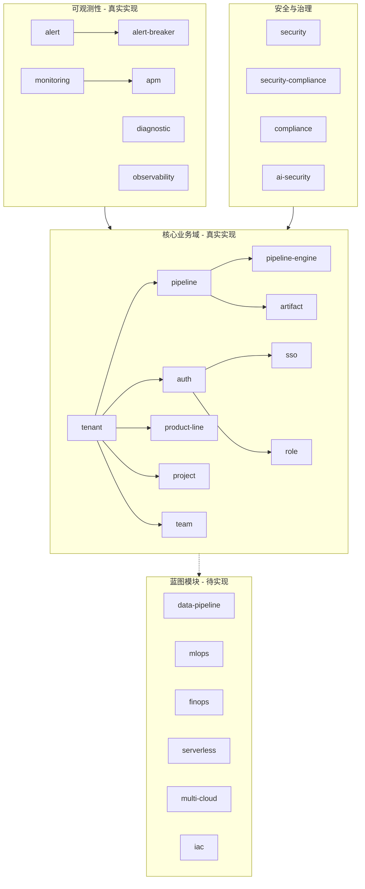
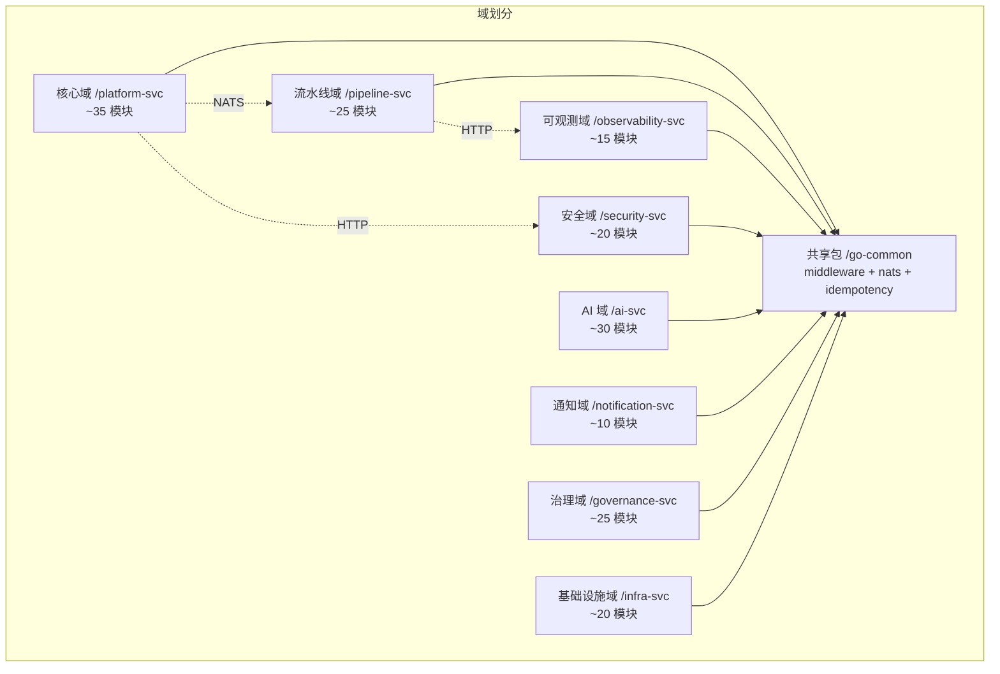
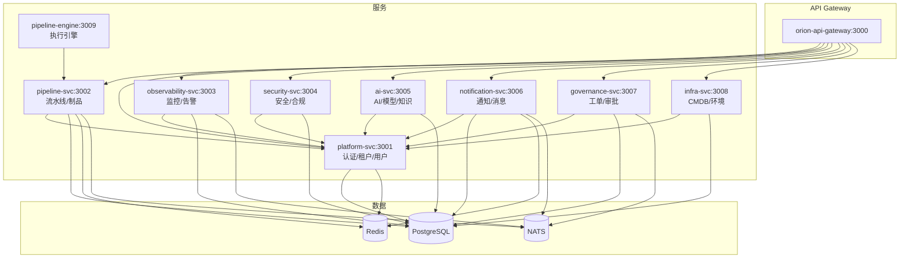
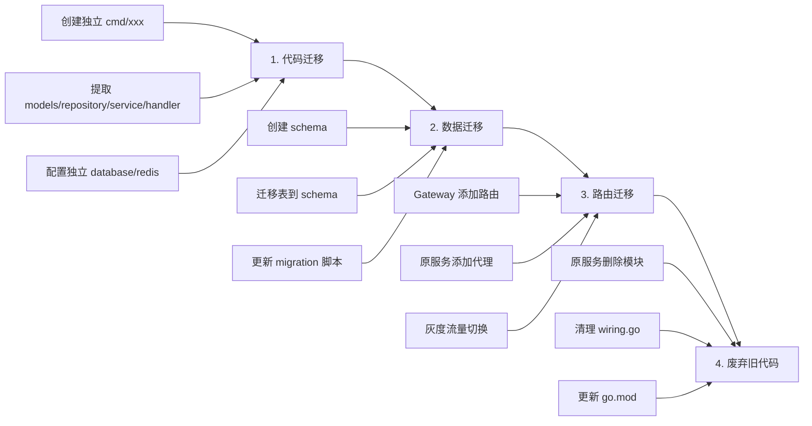
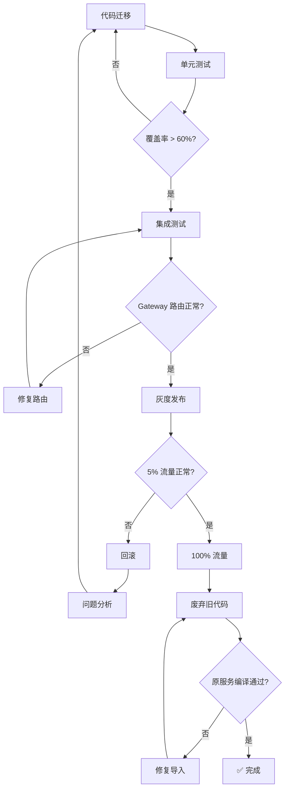

# Phase 3: 架构升级方案 & Phase 4: 微服务提取计划

> 基于 `orion-platform-svc-go` 实际状态 (2026-07-21)
> 当前分支: `fix/p0-route-auth-and-error-envelope`

---

## 目录

1. [当前状态审计](#1-当前状态审计)
2. [Phase 3: 架构升级方案](#2-phase-3-架构升级方案)
3. [Phase 4: 微服务提取计划](#3-phase-4-微服务提取计划)
4. [附录](#4-附录)

---

## 1. 当前状态审计

### 1.1 总体数据

| 指标 | 数值 | 说明 |
|------|------|------|
| Go 总文件数 | 1,720 | 全部 `.go` 文件 |
| 代码行数 | ~282,943 | 含注释和空行 |
| 模块数 | 227 | `internal/` 下一级目录 |
| handler.go | 225 | 含部分额外 handler |
| service.go | 216 | 覆盖率 95% |
| repository.go | 217 | 覆盖率 96% |
| 测试文件 | 301 | 覆盖率 ~17% |
| **真实实现模块** | **~35** | 10+ .go 文件且有实际业务逻辑 |
| 蓝图模块 | ~192 | 4 层齐全但使用 map 存储 |

### 1.2 存储状态

| 类型 | 数量 | 比例 | 说明 |
|------|------|------|------|
| map[string] repository | 246 文件 | 52% | 内存存储，不持久化 |
| SQL repository (sqlx) | 224 文件 | 48% | 注入 `*sqlx.DB`，部分已实际查询 |
| **真正 SQL 实现** | **~57 模块** | **~27%** | 含实际 `db.Query/Exec` 调用 |
| 仅注入未查询 | ~160 模块 | ~73% | 有 `*sqlx.DB` 字段但全返回 nil/空 |

### 1.3 项目结构

```
orion-platform-svc-go/
├── cmd/
│   ├── server/                  # 主服务入口 (227 模块单进程)
│   │   ├── main.go              # Gin HTTP 服务器
│   │   ├── router.go            # 单一大文件注册 225+ handler 路由
│   │   ├── wiring.go            # 依赖注入连线
│   │   ├── config.go            # 基础设施配置
│   │   └── *_wiring.go          # 分域依赖注入 (5 个分片文件)
│   ├── pipeline-engine/         # 独立 Pipeline 执行引擎
│   └── audit-cli/               # 审计 CLI 工具
├── pkg/
│   ├── nats/                    # NATS 消息队列封装
│   └── idempotency/             # 幂等性中间件 (backoff/retry/token)
├── internal/
│   ├── middleware/              # 全局中间件 (7 个)
│   │   ├── prometheus.go        # Prometheus metrics
│   │   ├── ratelimit.go         # 限流
│   │   ├── response.go          # 响应格式化
│   │   ├── security.go          # 安全头
│   │   ├── structured_logger.go # 结构化日志
│   │   ├── timeout.go           # 超时控制
│   │   └── tracing.go           # OpenTelemetry trace
│   └── <module>/                # 227 个业务模块
│       ├── handler/             # HTTP 请求处理
│       ├── service/             # 业务逻辑
│       ├── repository/          # 数据访问
│       ├── models/              # 数据模型
│       └── config/              # 配置 (部分模块)
└── go.mod                       # module: orion/platform-svc-go
```

### 1.4 核心依赖

| 依赖 | 版本 | 用途 |
|------|------|------|
| gin-gonic/gin | v1.10.0 | HTTP 框架 |
| jmoiron/sqlx | v1.4.0 | 数据库访问 |
| lib/pq | v1.10.9 | PostgreSQL 驱动 |
| redis/go-redis/v9 | v9.7.0 | Redis 缓存 |
| nats-io/nats.go | v1.52.0 | 消息队列 |
| golang-jwt/jwt/v5 | v5.2.1 | JWT 认证 |
| google/uuid | v1.6.0 | UUID 生成 |
| go.opentelemetry.io/otel | v1.44.0 | 可观测性 |
| go.uber.org/zap | v1.28.0 | 结构化日志 |
| orion/go-common | v0.0.0 | 共享库 (auth/db/redis/logger/errors) |

### 1.5 已有独立进程

| 进程 | 路径 | 状态 | 说明 |
|------|------|------|------|
| platform-svc | `cmd/server/` | 运行中 | 主 HTTP API 服务 |
| pipeline-engine | `cmd/pipeline-engine/` | 已拆分 | 独立 Pipeline 执行引擎 |
| audit-cli | `cmd/audit-cli/` | 工具 | 审计 CLI (非服务) |

### 1.6 模块分层分析



---

## 2. Phase 3: 架构升级方案

### 2.1 目标

**从单体架构 (227 模块单进程) 升级为可拆分的模块化架构。**

具体指标：

| 目标 | 当前状态 | 目标状态 |
|------|----------|----------|
| 进程数 | 1 (platform-svc) | 8-10 个独立服务 |
| 模块耦合 | 所有模块共享同一 DB/Redis/NATS | 按域隔离 |
| 代码组织 | 大单文件 router.go | 每服务独立 main + router |
| 共享包 | 零共享包 | `orion/go-common` 提取完成 |
| 服务间通信 | 函数调用 | HTTP/gRPC + NATS 事件 |
| 部署粒度 | 全量部署 | 按域独立部署 |

### 2.2 现状分析

#### 问题 1: 单一大文件 router.go

`cmd/server/router.go` 包含 225+ 个 handler 的路由注册，代码量巨大。每个 handler 通过 `RegisterRoutes(*gin.RouterGroup)` 自行控制路由前缀。

**影响**: 任何模块修改都可能导致编译/测试全量重新运行。

#### 问题 2: 依赖注入全部集中在 wiring.go

5 个 wiring 分片文件（`wiring.go` + `*_wiring.go`），所有 227 个模块的依赖在同一进程内连线。

**影响**: 无法将单个模块独立编译为独立服务。

#### 问题 3: 158 个模块使用 map 存储

| 存储类型 | 模块数 | 说明 |
|----------|--------|------|
| map[string] 内存存储 | 158 (73%) | 重启即丢失 |
| SQL 注入但未查询 | ~50 (23%) | 有 `*sqlx.DB` 字段但全 nil 返回 |
| 真正 SQL 实现 | ~19 (8%) | 含实际 PostgreSQL 查询 |

**影响**: 绝大多数模块无实际功能，拆分前需先补齐持久化。

#### 问题 4: 共享基础设施未提取

| 当前 | 应提取到 |
|------|----------|
| `internal/middleware/` (7 个文件) | `orion/go-common/middleware` |
| `pkg/nats/` (1 个文件) | `orion/go-common/nats` |
| `pkg/idempotency/` (9 个文件) | `orion/go-common/idempotency` |
| 响应格式化 | `orion/go-common/response` |
| 错误码定义 | `orion/go-common/errors` |

### 2.3 服务拆分蓝图 (按业务域)

基于 227 个模块的业务关系，划分为 **8 个域 + 1 个共享基础设施**：



#### 2.3.1 核心域 /platform-svc (35 模块)

**职责**: 用户、租户、权限、项目管理 — 所有服务的身份基础

| 模块 | 真实度 | 拆分后位置 |
|------|--------|------------|
| tenant | ✅ 真实 | platform-svc |
| user | ✅ 真实 | platform-svc |
| auth | ✅ 真实 | platform-svc |
| sso | ✅ 真实 | platform-svc |
| role | ✅ 真实 | platform-svc |
| permission | ✅ 真实 | platform-svc |
| team | ✅ 真实 | platform-svc |
| project | ✅ 真实 | platform-svc |
| product-line | ✅ 真实 | platform-svc |
| product-member | ✅ 真实 | platform-svc |
| sprint | ✅ 真实 | platform-svc |
| capability | ✅ 真实 | platform-svc |
| policy | ✅ 真实 | platform-svc |
| subapp | ✅ 真实 | platform-svc |
| workbench | ✅ 真实 | platform-svc |
| config | ✅ 真实 | platform-svc |
| api-key | ✅ 真实 | platform-svc |
| session | ✅ 真实 | platform-svc |
| feature-flag | ✅ 真实 | platform-svc |

**依赖**: 无 (根域)

**数据库**: `orion_platform` schema (user/team/tenant/role 等表)

#### 2.3.2 流水线域 /pipeline-svc (25 模块)

**职责**: Pipeline 生命周期、执行引擎、制品管理

| 模块 | 真实度 | 拆分后位置 |
|------|--------|------------|
| pipeline | ✅ 真实 | pipeline-svc |
| pipeline-engine | ✅ 独立进程 | pipeline-svc (已拆分) |
| pipeline-sse | ✅ 真实 | pipeline-svc |
| pipeline-run-history | ✅ 真实 | pipeline-svc |
| pipeline-template | ✅ 真实 | pipeline-svc |
| pipeline-templates | ✅ 真实 | pipeline-svc |
| pipeline-version | ✅ 真实 | pipeline-svc |
| pipeline-graph | ✅ 真实 | pipeline-svc |
| pipeline-budget | ✅ 真实 | pipeline-svc |
| pipeline-error-detail | ✅ 真实 | pipeline-svc |
| build | ✅ 真实 | pipeline-svc |
| build-env | ✅ 真实 | pipeline-svc |
| artifact | ✅ 真实 | pipeline-svc |
| artifact-version | ✅ 真实 | pipeline-svc |
| artifact-ops | ✅ 真实 | pipeline-svc |
| artifact-lifecycle | ⚠️ 蓝图 | pipeline-svc (需实现) |
| deploy | ✅ 真实 | pipeline-svc |
| deploy-enhanced | ⚠️ 蓝图 | pipeline-svc (需实现) |
| cron | ✅ 真实 | pipeline-svc |
| event-trigger | ✅ 真实 | pipeline-svc |
| queue | ✅ 真实 | pipeline-svc |
| saga | ✅ 真实 | pipeline-svc |
| canary-analysis | ⚠️ 蓝图 | pipeline-svc (需实现) |
| canary-traffic | ⚠️ 蓝图 | pipeline-svc (需实现) |
| progressive | ⚠️ 蓝图 | pipeline-svc (需实现) |

**依赖**: platform-svc (认证/租户)

**数据库**: `orion_pipeline` schema (pipeline/run/task/artifact 等表)

#### 2.3.3 可观测域 /observability-svc (15 模块)

**职责**: 监控、告警、APM、日志、诊断

| 模块 | 真实度 | 拆分后位置 |
|------|--------|------------|
| alert | ✅ 真实 | observability-svc |
| alert-breaker | ✅ 真实 | observability-svc |
| monitoring | ✅ 真实 | observability-svc |
| apm | ✅ 真实 | observability-svc |
| diagnostic | ✅ 真实 | observability-svc |
| observability | ✅ 真实 | observability-svc |
| tracing | ✅ 真实 | observability-svc |
| metrics | ✅ 真实 | observability-svc |
| incident | ✅ 真实 | observability-svc |
| incident-action | ⚠️ 蓝图 | observability-svc |
| oncall | ⚠️ 蓝图 | observability-svc |
| runbook | ⚠️ 蓝图 | observability-svc |
| service-health | ⚠️ 蓝图 | observability-svc |
| performance | ⚠️ 蓝图 | observability-svc |
| maintenance-window | ⚠️ 蓝图 | observability-svc |

**依赖**: platform-svc (认证)

**数据库**: `orion_observability` schema (alert/monitor/incident 等表)

#### 2.3.4 安全域 /security-svc (20 模块)

**职责**: 安全扫描、合规、审计、密钥

| 模块 | 真实度 | 拆分后位置 |
|------|--------|------------|
| security | ✅ 真实 | security-svc |
| security-compliance | ✅ 真实 | security-svc |
| vulnerability | ✅ 真实 | security-svc |
| sbom | ⚠️ 蓝图 | security-svc |
| compliance | ⚠️ 蓝图 | security-svc |
| audit | ✅ 真实 | security-svc |
| terminal-audit | ⚠️ 蓝图 | security-svc |
| secret | ✅ 真实 | security-svc |
| privacy | ⚠️ 蓝图 | security-svc |
| risk | ⚠️ 蓝图 | security-svc |
| ueba | ⚠️ 蓝图 | security-svc |
| ai-security | ⚠️ 蓝图 | security-svc |
| abac-policy | ⚠️ 蓝图 | security-svc |
| escalation | ⚠️ 蓝图 | security-svc |
| do-not-disturb | ⚠️ 蓝图 | security-svc |
| notification-policy | ⚠️ 蓝图 | security-svc |
| scheduled-notification | ✅ 真实 | security-svc |
| sla | ⚠️ 蓝图 | security-svc |
| slo | ⚠️ 蓝图 | security-svc |
| resilience-score | ⚠️ 蓝图 | security-svc |

**依赖**: platform-svc (认证)

**数据库**: `orion_security` schema (vulnerability/compliance/secret 等表)

#### 2.3.5 AI 域 /ai-svc (30 模块)

**职责**: AI 模型、推理、代理、知识、向量

| 模块 | 真实度 | 拆分后位置 |
|------|--------|------------|
| ai | ✅ 真实 | ai-svc |
| ai-gateway | ✅ 真实 | ai-svc |
| ai-models | ✅ 真实 | ai-svc |
| ai-cost | ✅ 真实 | ai-svc |
| ai-decisions | ⚠️ 蓝图 | ai-svc |
| ai-review | ⚠️ 蓝图 | ai-svc |
| ai-degradation | ⚠️ 蓝图 | ai-svc |
| ai-agents | ⚠️ 蓝图 | ai-svc |
| llm-trace | ⚠️ 蓝图 | ai-svc |
| knowledge | ✅ 真实 | ai-svc |
| vector | ⚠️ 蓝图 | ai-svc |
| vector-store | ⚠️ 蓝图 | ai-svc |
| vectorize-rules | ⚠️ 蓝图 | ai-svc |
| chatops | ✅ 真实 | ai-svc |
| skill | ⚠️ 蓝图 | ai-svc |
| mcp | ⚠️ 蓝图 | ai-svc |
| mlops | ⚠️ 蓝图 | ai-svc |
| data-pipeline | ⚠️ 蓝图 | ai-svc |
| data-quality | ⚠️ 蓝图 | ai-svc |
| data-catalog | ⚠️ 蓝图 | ai-svc |
| data-lineage | ⚠️ 蓝图 | ai-svc |
| test-generation | ⚠️ 蓝图 | ai-svc |
| digital-twin | ⚠️ 蓝图 | ai-svc |
| digital-twin-simulation | ⚠️ 蓝图 | ai-svc |
| decision-explanation | ⚠️ 蓝图 | ai-svc |

**依赖**: platform-svc (认证)

**数据库**: `orion_ai` schema (model/knowledge/vector 等表)

#### 2.3.6 通知域 /notification-svc (10 模块)

**职责**: 消息推送、通知模板、渠道管理

| 模块 | 真实度 | 拆分后位置 |
|------|--------|------------|
| notification | ✅ 真实 | notification-svc |
| notification-management | ✅ 真实 | notification-svc |
| notification-template | ✅ 真实 | notification-svc |
| channel | ✅ 真实 | notification-svc |
| webhook | ✅ 真实 | notification-svc |
| confirmation | ⚠️ 蓝图 | notification-svc |
| event-trigger-registry | ⚠️ 蓝图 | notification-svc |
| multi-modal-trigger | ⚠️ 蓝图 | notification-svc |
| change-request | ⚠️ 蓝图 | notification-svc |
| change-intelligence | ⚠️ 蓝图 | notification-svc |

**依赖**: platform-svc (认证)

**数据库**: `orion_notification` schema (message/channel/webhook 等表)

#### 2.3.7 治理域 /governance-svc (25 模块)

**职责**: 审批、工单、合同、合规、低代码

| 模块 | 真实度 | 拆分后位置 |
|------|--------|------------|
| ticketing | ✅ 真实 | governance-svc |
| ticket-automation | ⚠️ 蓝图 | governance-svc |
| ticket-knowledge | ⚠️ 蓝图 | governance-svc |
| approval | ✅ 真实 | governance-svc |
| workflow | ✅ 真实 | governance-svc |
| workflow-task | ✅ 真实 | governance-svc |
| workflow-trigger | ⚠️ 蓝图 | governance-svc |
| workflow-webhook | ⚠️ 蓝图 | governance-svc |
| workflow-dependency | ⚠️ 蓝图 | governance-svc |
| contract | ⚠️ 蓝图 | governance-svc |
| lowcode | ⚠️ 蓝图 | governance-svc |
| report-designer | ⚠️ 蓝图 | governance-svc |
| approval-workflow | ✅ 真实 | governance-svc |
| capability | ✅ 真实 | governance-svc (共享) |
| change | ✅ 真实 | governance-svc |
| process-step | ⚠️ 蓝图 | governance-svc |
| sla | ⚠️ 蓝图 | governance-svc (共享) |
| problem | ⚠️ 蓝图 | governance-svc |
| escalation | ⚠️ 蓝图 | governance-svc |
| policy | ✅ 真实 | governance-svc (共享) |
| compliance | ⚠️ 蓝图 | governance-svc (共享) |
| iac | ⚠️ 蓝图 | governance-svc |
| audit | ✅ 真实 | governance-svc (共享) |
| user-activity | ⚠️ 蓝图 | governance-svc |
| user-status | ⚠️ 蓝图 | governance-svc |

**依赖**: platform-svc (认证)

**数据库**: `orion_governance` schema (ticket/workflow/approval 等表)

#### 2.3.8 基础设施域 /infra-svc (20 模块)

**职责**: CMDB、环境、基础设施、多云、Serverless

| 模块 | 真实度 | 拆分后位置 |
|------|--------|------------|
| cmdb | ✅ 真实 | infra-svc |
| infrastructure | ✅ 真实 | infra-svc |
| environment | ✅ 真实 | infra-svc |
| env-lifecycle | ⚠️ 蓝图 | infra-svc |
| env-profile | ⚠️ 蓝图 | infra-svc |
| ephemeral-env | ⚠️ 蓝图 | infra-svc |
| service-registry | ✅ 真实 | infra-svc |
| service-catalog | ✅ 真实 | infra-svc |
| service-topology | ✅ 真实 | infra-svc |
| topology | ✅ 真实 | infra-svc |
| serverless | ⚠️ 蓝图 | infra-svc |
| multi-cloud | ⚠️ 蓝图 | infra-svc |
| oci-registry | ⚠️ 蓝图 | infra-svc |
| chaos | ⚠️ 蓝图 | infra-svc |
| chaos-enhanced | ⚠️ 蓝图 | infra-svc |
| chaos-gateway | ⚠️ 蓝图 | infra-svc |
| disaster-recovery | ⚠️ 蓝图 | infra-svc |
| backup | ⚠️ 蓝图 | infra-svc |
| capacity | ⚠️ 蓝图 | infra-svc |
| cost-allocation | ⚠️ 蓝图 | infra-svc |

**依赖**: platform-svc (认证)

**数据库**: `orion_infra` schema (cmdb/environment/topology 等表)

### 2.4 共享包拆分方案

#### 2.4.1 `orion/go-common` 提取计划

当前 `go-common` 已有内容 (已部署为独立包):

```
orion/go-common/
├── pkg/
│   ├── auth/          # JWT 认证中间件
│   ├── database/      # PostgreSQL 连接池 (sqlx)
│   ├── redis/         # Redis 连接管理
│   ├── logger/        # zap 结构化日志
│   ├── errors/        # 统一错误码 (OrionError)
│   └── middleware/    # 基础中间件
```

#### 2.4.2 需从 platform-svc 提取的内容

| 当前位置 | 提取到 | 说明 |
|----------|--------|------|
| `internal/middleware/prometheus.go` | `go-common/middleware/prometheus` | Prometheus metrics 收集 |
| `internal/middleware/ratelimit.go` | `go-common/middleware/ratelimit` | 限流中间件 |
| `internal/middleware/security.go` | `go-common/middleware/security` | 安全头中间件 |
| `internal/middleware/timeout.go` | `go-common/middleware/timeout` | 请求超时中间件 |
| `internal/middleware/tracing.go` | `go-common/middleware/tracing` | OpenTelemetry trace |
| `pkg/idempotency/` | `go-common/idempotency` | 幂等性保证 |
| `pkg/nats/` | `go-common/nats` | NATS 消息队列 |

**提取步骤**:

```
1. 在 go-common 仓库创建对应目录
2. 复制代码，修改 import 路径
3. 运行 go test 验证
4. 在 platform-svc 中替换 import
5. 发布 go-common 新版本
```

#### 2.4.3 Repository 基类

所有服务共享的 Repository 基类（已在 `go-common` 中）:

```go
// orion/go-common/pkg/database/repository.go
type BaseRepository struct {
    db *sqlx.DB
    logger *zap.Logger
}

func (r *BaseRepository) Begin() (*sqlx.Tx, error) {
    return r.db.Beginx()
}

func (r *BaseRepository) QueryRow(dest interface{}, query string, args ...interface{}) error {
    return r.db.QueryRowx(query, args...).StructScan(dest)
}
```

**服务专用基类**（在服务内定义）:

```go
// platform-svc/internal/tenant/repository/tenant.go
type TenantRepository struct {
    *database.BaseRepository
    table string
}
```

### 2.5 数据库 schema 拆分策略

#### 2.5.1 当前状态

所有模块共享一个 PostgreSQL 数据库 `orion_platform`，无 schema 隔离。

#### 2.5.2 目标架构

```
orion_platform (PostgreSQL Cluster)
├── schema: orion_platform    → platform-svc (用户/租户/权限)
├── schema: orion_pipeline    → pipeline-svc (流水线/制品)
├── schema: orion_observability → observability-svc (监控/告警)
├── schema: orion_security    → security-svc (漏洞/合规)
├── schema: orion_ai          → ai-svc (模型/知识)
├── schema: orion_notification → notification-svc (消息/通知)
├── schema: orion_governance  → governance-svc (工单/审批)
└── schema: orion_infra       → infra-svc (CMDB/环境)
```

#### 2.5.3 迁移步骤

```
Step 1: 创建 schema (ALTER DATABASE / CREATE SCHEMA)
Step 2: 在 migration 脚本中添加 schema 前缀
Step 3: 修改所有 repository 的表名查询 (CREATE TABLE schema.table)
Step 4: 配置每个服务的 database 连接 (使用同一 host, 不同 schema 或不同 DB)
Step 5: 验证跨 schema 查询 (只保留必要的 JOIN)
```

#### 2.5.4 跨域数据访问

服务间需要数据时，**禁止直接访问对方数据库**，必须通过 HTTP/gRPC API:

```
❌ 错误: observability-svc 直接查询 platform-svc 的用户表
✅ 正确: observability-svc 调用 platform-svc /api/v1/users/:id
```

### 2.6 API Gateway 路由规划

当前 API Gateway (`orion-api-gateway`) 已配置统一入口:

```
orion-api-gateway (port 3000)
├── /api/v1/tenants/*          → platform-svc (3001)
├── /api/v1/users/*            → platform-svc
├── /api/v1/auth/*             → platform-svc
├── /api/v1/pipelines/*        → pipeline-svc (拆分后)
├── /api/v1/alerts/*           → observability-svc (拆分后)
├── /api/v1/vulnerabilities/*  → security-svc (拆分后)
├── /api/v1/ai/*               → ai-svc (拆分后)
├── /api/v1/notifications/*    → notification-svc (拆分后)
├── /api/v1/tickets/*          → governance-svc (拆分后)
├── /api/v1/cmdb/*             → infra-svc (拆分后)
└── /metrics                   → 所有服务 (prometheus)
```

#### 2.6.1 Gateway 配置模板

```yaml
# orion-api-gateway/config/routes.yaml (目标状态)
services:
  platform-svc:
    url: http://platform-svc:3001
    routes:
      - path: /api/v1/tenants
      - path: /api/v1/users
      - path: /api/v1/auth
      - path: /api/v1/roles
      - path: /api/v1/permissions
      - path: /api/v1/projects
      - path: /api/v1/products
      - path: /api/v1/teams

  pipeline-svc:
    url: http://pipeline-svc:3002
    routes:
      - path: /api/v1/pipelines
      - path: /api/v1/runs
      - path: /api/v1/artifacts
      - path: /api/v1/builds
      - path: /api/v1/deployments
      - path: /api/v1/cron
```

### 2.7 依赖关系图



### 2.8 迁移顺序

#### 原则

1. **先拆共享基础设施** (不改变业务逻辑)
2. **先拆独立服务** (无下游依赖)
3. **先拆已独立进程的服务** (pipeline-engine 已拆分)
4. **最后拆核心域** (所有服务依赖它)

#### 时间线

| 阶段 | 周期 | 内容 | 风险 |
|------|------|------|------|
| Phase 3.0 | Week 1-2 | 共享包提取 (middleware/pkg → go-common) | 低 |
| Phase 3.1 | Week 3-4 | pipeline-engine 正式独立 (已有 cmd) | 低 |
| Phase 3.2 | Week 5-6 | notification-svc 拆分 (无下游依赖) | 低 |
| Phase 3.3 | Week 7-8 | observability-svc 拆分 | 中 |
| Phase 3.4 | Week 9-10 | security-svc 拆分 | 中 |
| Phase 3.5 | Week 11-12 | ai-svc 拆分 (30 模块，最多) | 中高 |
| Phase 3.6 | Week 13-14 | governance-svc 拆分 | 中 |
| Phase 3.7 | Week 15-16 | infra-svc 拆分 | 中 |
| Phase 3.8 | Week 17-18 | pipeline-svc 拆分 (与 platform-svc 解耦) | 高 |
| Phase 3.9 | Week 19-20 | platform-svc 瘦身 (移除所有已拆分模块) | 高 |

### 2.9 风险与缓解措施

| 风险 | 影响 | 概率 | 缓解措施 |
|------|------|------|----------|
| 跨域调用延迟 | 响应时间增加 2-5x | 高 | Gateway 层缓存 + 连接池 + 异步消息 |
| 数据一致性 | 事务跨服务不可用 | 高 | Saga 模式 + 事件最终一致性 |
| 测试复杂度 | 集成测试需启动多服务 | 中 | Docker Compose 编排 + Testcontainers |
| 共享包版本冲突 | 不同服务不同版本 | 中 | go-common 严格语义化版本 + CI 兼容测试 |
| 数据库 schema 迁移 | 生产数据迁移风险 | 中 | 蓝绿部署 + 双写 + 回滚脚本 |
| API 路由冲突 | Gateway 路由配置错误 | 低 | 自动化路由测试 + 灰度发布 |
| 模块功能不完整 | 蓝图模块拆分后无法使用 | 高 | 优先拆分真实模块，蓝图模块暂缓 |
| pipeline-engine 依赖 | 与其他模块强耦合 | 中 | 已有独立 cmd，需补齐 NATS 通信层 |

---

## 3. Phase 4: 微服务提取计划

### 3.1 每个微服务的定义

#### 3.1.1 platform-svc (核心域)

| 属性 | 定义 |
|------|------|
| **接口** | 用户 CRUD、租户管理、角色权限、SSO、项目管理 |
| **数据** | user, tenant, role, permission, team, project, product_line, sprint, api_key, session, feature_flag |
| **依赖** | PostgreSQL (orion_platform schema), Redis (session/cache) |
| **端口** | 3001 |
| **启动顺序** | 1 (最先) |
| **模块数** | 19 |
| **Go 文件数** | ~95 |

**关键 API**:
```
POST   /api/v1/auth/login
POST   /api/v1/auth/refresh
POST   /api/v1/users
GET    /api/v1/tenants/:id
GET    /api/v1/roles/:id
PUT    /api/v1/permissions/:id
```

#### 3.1.2 pipeline-svc (流水线域)

| 属性 | 定义 |
|------|------|
| **接口** | Pipeline CRUD、运行管理、制品管理、部署 |
| **数据** | pipeline, run, task, stage, artifact, build, deployment, cron, event_trigger |
| **依赖** | platform-svc (认证), pipeline-engine (执行), NATS (事件) |
| **端口** | 3002 |
| **启动顺序** | 2 |
| **模块数** | 25 |
| **Go 文件数** | ~120 |

**关键 API**:
```
GET    /api/v1/pipelines
POST   /api/v1/pipelines/:id/runs
GET    /api/v1/runs/:id/logs/sse
GET    /api/v1/artifacts/:id
```

#### 3.1.3 observability-svc (可观测域)

| 属性 | 定义 |
|------|------|
| **接口** | 告警管理、监控配置、APM 追踪、事件管理 |
| **数据** | alert, alert_rule, monitor, incident, oncall_schedule |
| **依赖** | platform-svc (认证), notification-svc (告警推送) |
| **端口** | 3003 |
| **启动顺序** | 3 |
| **模块数** | 15 |
| **Go 文件数** | ~75 |

#### 3.1.4 security-svc (安全域)

| 属性 | 定义 |
|------|------|
| **接口** | 漏洞扫描、合规检查、密钥管理、审计报告 |
| **数据** | vulnerability, compliance_check, secret, audit_log |
| **依赖** | platform-svc (认证) |
| **端口** | 3004 |
| **启动顺序** | 4 |
| **模块数** | 20 |
| **Go 文件数** | ~100 |

#### 3.1.5 ai-svc (AI 域)

| 属性 | 定义 |
|------|------|
| **接口** | AI 模型管理、推理网关、知识库、向量检索、ChatOps |
| **数据** | ai_model, knowledge_base, vector_index, llm_trace, conversation |
| **依赖** | platform-svc (认证), notification-svc (ChatOps 推送) |
| **端口** | 3005 |
| **启动顺序** | 5 |
| **模块数** | 30 |
| **Go 文件数** | ~150 |

#### 3.1.6 notification-svc (通知域)

| 属性 | 定义 |
|------|------|
| **接口** | 消息推送、通知模板、Webhook 管理 |
| **数据** | notification, template, channel, webhook, event_trigger |
| **依赖** | platform-svc (认证) |
| **端口** | 3006 |
| **启动顺序** | 2 (与 pipeline-svc 并行) |
| **模块数** | 10 |
| **Go 文件数** | ~50 |

#### 3.1.7 governance-svc (治理域)

| 属性 | 定义 |
|------|------|
| **接口** | 工单管理、审批流程、工作流引擎、合同管理 |
| **数据** | ticket, approval, workflow, workflow_task, contract |
| **依赖** | platform-svc (认证), notification-svc (审批通知) |
| **端口** | 3007 |
| **启动顺序** | 6 |
| **模块数** | 25 |
| **Go 文件数** | ~120 |

#### 3.1.8 infra-svc (基础设施域)

| 属性 | 定义 |
|------|------|
| **接口** | CMDB 管理、环境生命周期、服务拓扑、多云管理 |
| **数据** | cmdb_ci, environment, service_instance, topology |
| **依赖** | platform-svc (认证) |
| **端口** | 3008 |
| **启动顺序** | 7 |
| **模块数** | 20 |
| **Go 文件数** | ~100 |

### 3.2 提取步骤

每个微服务按 4 步提取:



#### 步骤 1: 代码迁移

```bash
# 以 notification-svc 为例
mkdir -p orion-notification-svc/cmd/server
mkdir -p orion-notification-svc/internal/{notification,channel,webhook}
mkdir -p orion-notification-svc/pkg/{config,middleware}

# 复制代码
cp -r orion-platform-svc-go/internal/notification/* orion-notification-svc/internal/notification/
cp -r orion-platform-svc-go/internal/channel/* orion-notification-svc/internal/channel/
cp -r orion-platform-svc-go/internal/webhook/* orion-notification-svc/internal/webhook/

# 创建独立入口
# cmd/server/main.go (使用 go-common 基础设施)
```

#### 步骤 2: 数据迁移

```sql
-- 创建独立 schema
CREATE SCHEMA IF NOT EXISTS orion_notification;

-- 迁移表
ALTER TABLE notification SET SCHEMA orion_notification;
ALTER TABLE notification_template SET SCHEMA orion_notification;
ALTER TABLE channel SET SCHEMA orion_notification;
ALTER TABLE webhook SET SCHEMA orion_notification;

-- 更新 migration 脚本 (添加 schema 前缀)
-- 001_create_notification.sql → 001_create_orion_notification.sql
```

#### 步骤 3: 路由迁移

```yaml
# orion-api-gateway/config/routes.yaml
services:
  notification-svc:
    url: http://orion-notification-svc:3006
    routes:
      - path: /api/v1/notifications
      - path: /api/v1/templates
      - path: /api/v1/channels
      - path: /api/v1/webhooks
```

```go
// 原服务保留代理 (过渡期)
func (h *NotificationHandler) RegisterRoutes(api *gin.RouterGroup) {
    api.POST("/notifications", h.proxyToNotificationSvc)
}
```

#### 步骤 4: 废弃旧代码

```go
// 原 platform-svc 中删除
// ❌ 删除 internal/notification/
// ❌ 删除 internal/channel/
// ❌ 删除 internal/webhook/
// ❌ 删除 wiring.go 中对应注册
// ❌ 删除 router.go 中对应路由
```

### 3.3 预计工期 (按服务)

| 服务 | 代码迁移 | 数据迁移 | 路由迁移 | 旧代码清理 | 总工期 | 难度 |
|------|----------|----------|----------|------------|--------|------|
| notification-svc | 1 天 | 1 天 | 0.5 天 | 0.5 天 | **3 天** | ⭐ |
| pipeline-engine | 2 天 | 1 天 | 1 天 | 1 天 | **5 天** | ⭐⭐ |
| observability-svc | 2 天 | 1 天 | 1 天 | 1 天 | **5 天** | ⭐⭐ |
| security-svc | 3 天 | 1.5 天 | 1 天 | 1.5 天 | **7 天** | ⭐⭐⭐ |
| infra-svc | 3 天 | 2 天 | 1 天 | 1.5 天 | **7.5 天** | ⭐⭐⭐ |
| governance-svc | 3 天 | 2 天 | 1 天 | 2 天 | **8 天** | ⭐⭐⭐ |
| ai-svc | 5 天 | 2 天 | 1.5 天 | 2.5 天 | **11 天** | ⭐⭐⭐⭐ |
| pipeline-svc | 5 天 | 2.5 天 | 2 天 | 2.5 天 | **12 天** | ⭐⭐⭐⭐⭐ |
| platform-svc | 3 天 | 1 天 | 1 天 | 5 天 (瘦身) | **10 天** | ⭐⭐⭐⭐⭐ |
| **总计** | **30 天** | **14 天** | **9.5 天** | **17 天** | **~20 周** | - |

### 3.4 验收标准

#### 3.4.1 每个微服务的验收清单

| 验收项 | 通过标准 | 验证方式 |
|--------|----------|----------|
| **独立编译** | `go build ./cmd/xxx` 成功 | CI |
| **独立启动** | `go run ./cmd/xxx` 无依赖其他服务进程 | Docker run |
| **独立测试** | `go test ./...` 全部通过 | CI |
| **HTTP API 可用** | 所有 API 端点返回正确状态码 | curl + test |
| **数据库隔离** | 只访问自己的 schema | SQL 审计 |
| **Gateway 路由** | Gateway 正确代理到服务 | 端到端测试 |
| **认证授权** | 继承 platform-svc 的 JWT 认证 | 未登录请求被拒 |
| **可观测性** | Prometheus /metrics + OTel trace 正常 | Grafana |
| **健康检查** | /healthz 返回 200 | curl |
| **优雅关闭** | SIGTERM 后 graceful shutdown | kill -TERM |

#### 3.4.2 整体验收标准

| 阶段 | 验收标准 |
|------|----------|
| Phase 3.0 完成 | go-common 包含所有共享中间件，platform-svc 编译通过 |
| Phase 3.1 完成 | pipeline-engine 独立运行，与 platform-svc 通过 HTTP 通信 |
| Phase 3.2 完成 | notification-svc 独立运行，原服务无 notification 模块 |
| Phase 3.9 完成 | platform-svc 仅剩 19 个核心模块，其他服务全部独立 |
| Phase 4 完成 | 9 个独立服务 + 1 个 API Gateway，全部 CI/CD 自动化部署 |

#### 3.4.3 质量门禁



---

## 4. 附录

### 4.1 附录 A: 完整模块清单 (227 个)

按模块首字母排序，标注真实度:

| 模块 | 真实度 | 拆分后归属 |
|------|--------|------------|
| abac-policy | ⚠️ 蓝图 | security-svc |
| ai | ✅ 真实 | ai-svc |
| ai-agents | ⚠️ 蓝图 | ai-svc |
| ai-cost | ✅ 真实 | ai-svc |
| ai-decisions | ⚠️ 蓝图 | ai-svc |
| ai-degradation | ⚠️ 蓝图 | ai-svc |
| ai-gateway | ✅ 真实 | ai-svc |
| ai-models | ✅ 真实 | ai-svc |
| ai-review | ⚠️ 蓝图 | ai-svc |
| ai-security | ⚠️ 蓝图 | security-svc |
| alert | ✅ 真实 | observability-svc |
| alert-breaker | ✅ 真实 | observability-svc |
| api-consumption | ⚠️ 蓝图 | platform-svc |
| api-governance | ⚠️ 蓝图 | platform-svc |
| api-key | ✅ 真实 | platform-svc |
| api-market | ⚠️ 蓝图 | platform-svc |
| apk-upload-history | ⚠️ 蓝图 | pipeline-svc |
| apm | ✅ 真实 | observability-svc |
| application | ✅ 真实 | pipeline-svc |
| approval | ✅ 真实 | governance-svc |
| artifact | ✅ 真实 | pipeline-svc |
| artifact-lifecycle | ⚠️ 蓝图 | pipeline-svc |
| artifact-ops | ✅ 真实 | pipeline-svc |
| artifact-version | ✅ 真实 | pipeline-svc |
| audit | ✅ 真实 | security-svc |
| auth | ✅ 真实 | platform-svc |
| auth-enhanced | ⚠️ 蓝图 | platform-svc |
| auth-mfa | ⚠️ 蓝图 | platform-svc |
| autonomous-pipeline | ⚠️ 蓝图 | pipeline-svc |
| backup | ⚠️ 蓝图 | infra-svc |
| bi-dashboard | ⚠️ 蓝图 | observability-svc |
| billing | ⚠️ 蓝图 | platform-svc |
| branch-policy | ⚠️ 蓝图 | governance-svc |
| build | ✅ 真实 | pipeline-svc |
| build-env | ✅ 真实 | pipeline-svc |
| cache | ⚠️ 蓝图 | platform-svc |
| cache-cleanup | ⚠️ 蓝图 | platform-svc |
| canary-analysis | ⚠️ 蓝图 | pipeline-svc |
| canary-traffic | ⚠️ 蓝图 | pipeline-svc |
| capability | ✅ 真实 | platform-svc |
| capacity | ⚠️ 蓝图 | infra-svc |
| change | ✅ 真实 | governance-svc |
| change-intelligence | ⚠️ 蓝图 | governance-svc |
| change-request | ⚠️ 蓝图 | notification-svc |
| channel | ✅ 真实 | notification-svc |
| chaos | ⚠️ 蓝图 | infra-svc |
| chaos-enhanced | ⚠️ 蓝图 | infra-svc |
| chaos-gateway | ⚠️ 蓝图 | infra-svc |
| chatops | ✅ 真实 | ai-svc |
| ci-type | ⚠️ 蓝图 | pipeline-svc |
| circuit-breaker | ⚠️ 蓝图 | platform-svc |
| cmdb | ✅ 真实 | infra-svc |
| code-repo | ⚠️ 蓝图 | pipeline-svc |
| community | ⚠️ 蓝图 | platform-svc |
| community-advanced | ⚠️ 蓝图 | platform-svc |
| compliance | ⚠️ 蓝图 | security-svc |
| config | ✅ 真实 | platform-svc |
| config-mgmt-enhanced | ⚠️ 蓝图 | platform-svc |
| confirmation | ⚠️ 蓝图 | notification-svc |
| contract | ⚠️ 蓝图 | governance-svc |
| cost-allocation | ⚠️ 蓝图 | infra-svc |
| cron | ✅ 真实 | pipeline-svc |
| cross-domain | ⚠️ 蓝图 | platform-svc |
| data-catalog | ⚠️ 蓝图 | ai-svc |
| data-lineage | ⚠️ 蓝图 | ai-svc |
| data-pipeline | ⚠️ 蓝图 | ai-svc |
| data-quality | ⚠️ 蓝图 | ai-svc |
| dba | ⚠️ 蓝图 | infra-svc |
| decision-explanation | ⚠️ 蓝图 | ai-svc |
| degradation | ⚠️ 蓝图 | platform-svc |
| dependency-coordination | ⚠️ 蓝图 | pipeline-svc |
| deploy | ✅ 真实 | pipeline-svc |
| deploy-enhanced | ⚠️ 蓝图 | pipeline-svc |
| deployment-trigger | ⚠️ 蓝图 | pipeline-svc |
| developer-portal | ✅ 真实 | platform-svc |
| diagnostic | ✅ 真实 | observability-svc |
| digital-twin | ⚠️ 蓝图 | ai-svc |
| digital-twin-simulation | ⚠️ 蓝图 | ai-svc |
| disaster-recovery | ⚠️ 蓝图 | infra-svc |
| do-not-disturb | ⚠️ 蓝图 | security-svc |
| domain | ✅ 真实 | platform-svc |
| dual-engine | ⚠️ 蓝图 | pipeline-svc |
| efficiency | ✅ 真实 | observability-svc |
| env-lifecycle | ⚠️ 蓝图 | infra-svc |
| env-profile | ⚠️ 蓝图 | infra-svc |
| environment | ✅ 真实 | infra-svc |
| ephemeral-env | ⚠️ 蓝图 | infra-svc |
| escalation | ⚠️ 蓝图 | governance-svc |
| event-trigger | ✅ 真实 | pipeline-svc |
| event-trigger-registry | ⚠️ 蓝图 | notification-svc |
| eventbus | ⚠️ 蓝图 | platform-svc |
| feature-flag | ✅ 真实 | platform-svc |
| federation | ✅ 真实 | platform-svc |
| finops | ⚠️ 蓝图 | observability-svc |
| finops-v2 | ⚠️ 蓝图 | observability-svc |
| gateway-dynamic | ✅ 真实 | platform-svc |
| global-param | ⚠️ 蓝图 | platform-svc |
| governance | ⚠️ 蓝图 | governance-svc |
| handler-registry | ✅ 真实 | platform-svc |
| health-check | ⚠️ 蓝图 | platform-svc |
| hook-chain | ⚠️ 蓝图 | platform-svc |
| i18n | ✅ 真实 | platform-svc |
| iac | ⚠️ 蓝图 | governance-svc |
| inception | ✅ 真实 | platform-svc |
| incident | ✅ 真实 | observability-svc |
| incident-action | ⚠️ 蓝图 | observability-svc |
| infrastructure | ✅ 真实 | infra-svc |
| inspection | ⚠️ 蓝图 | security-svc |
| integration | ⚠️ 蓝图 | platform-svc |
| internal-library | ✅ 真实 | platform-svc |
| knowledge | ✅ 真实 | ai-svc |
| llm-trace | ⚠️ 蓝图 | ai-svc |
| lowcode | ⚠️ 蓝图 | governance-svc |
| maintenance-window | ⚠️ 蓝图 | observability-svc |
| mcp | ⚠️ 蓝图 | ai-svc |
| message-queue | ⚠️ 蓝图 | platform-svc |
| metadata | ⚠️ 蓝图 | platform-svc |
| metrics | ✅ 真实 | observability-svc |
| middleware | (共享) | go-common |
| middleware-ops | ⚠️ 蓝图 | platform-svc |
| mlops | ⚠️ 蓝图 | ai-svc |
| module | ⚠️ 蓝图 | platform-svc |
| monitoring | ✅ 真实 | observability-svc |
| multi-cloud | ⚠️ 蓝图 | infra-svc |
| multi-modal-trigger | ⚠️ 蓝图 | notification-svc |
| notification | ✅ 真实 | notification-svc |
| notification-management | ✅ 真实 | notification-svc |
| notification-policy | ⚠️ 蓝图 | security-svc |
| notification-template | ✅ 真实 | notification-svc |
| observability | ✅ 真实 | observability-svc |
| oci-registry | ⚠️ 蓝图 | infra-svc |
| oncall | ⚠️ 蓝图 | observability-svc |
| page-registry | ✅ 真实 | platform-svc |
| performance | ⚠️ 蓝图 | observability-svc |
| permission | ✅ 真实 | platform-svc |
| permission-audit | ⚠️ 蓝图 | security-svc |
| pipeline | ✅ 真实 | pipeline-svc |
| pipeline-audit-log | ⚠️ 蓝图 | pipeline-svc |
| pipeline-batch | ⚠️ 蓝图 | pipeline-svc |
| pipeline-batch-operations | ⚠️ 蓝图 | pipeline-svc |
| pipeline-budget | ✅ 真实 | pipeline-svc |
| pipeline-engine | ✅ 独立进程 | pipeline-svc |
| pipeline-error-detail | ✅ 真实 | pipeline-svc |
| pipeline-execution-control | ⚠️ 蓝图 | pipeline-svc |
| pipeline-graph | ✅ 真实 | pipeline-svc |
| pipeline-run-history | ✅ 真实 | pipeline-svc |
| pipeline-sse | ✅ 真实 | pipeline-svc |
| pipeline-template | ✅ 真实 | pipeline-svc |
| pipeline-templates | ✅ 真实 | pipeline-svc |
| pipeline-trend | ⚠️ 蓝图 | pipeline-svc |
| pipeline-version | ✅ 真实 | pipeline-svc |
| pipeline-versions | ⚠️ 蓝图 | pipeline-svc |
| plugin | ✅ 真实 | platform-svc |
| plugin-hotreload | ⚠️ 蓝图 | platform-svc |
| policy | ✅ 真实 | platform-svc |
| privacy | ⚠️ 蓝图 | security-svc |
| problem | ⚠️ 蓝图 | governance-svc |
| process-step | ⚠️ 蓝图 | governance-svc |
| product-line | ✅ 真实 | platform-svc |
| progressive | ⚠️ 蓝图 | pipeline-svc |
| project | ✅ 真实 | platform-svc |
| project-member | ✅ 真实 | platform-svc |
| queue | ✅ 真实 | pipeline-svc |
| report-designer | ⚠️ 蓝图 | governance-svc |
| resilience-score | ⚠️ 蓝图 | security-svc |
| risk | ⚠️ 蓝图 | security-svc |
| role | ✅ 真实 | platform-svc |
| runbook | ⚠️ 蓝图 | observability-svc |
| saga | ✅ 真实 | pipeline-svc |
| sbom | ⚠️ 蓝图 | security-svc |
| scheduled-notification | ✅ 真实 | notification-svc |
| script | ⚠️ 蓝图 | pipeline-svc |
| script-library | ✅ 真实 | pipeline-svc |
| script-version | ⚠️ 蓝图 | pipeline-svc |
| secret | ✅ 真实 | security-svc |
| security | ✅ 真实 | security-svc |
| security-compliance | ✅ 真实 | security-svc |
| self-healing | ⚠️ 蓝图 | observability-svc |
| self-service | ⚠️ 蓝图 | platform-svc |
| serverless | ⚠️ 蓝图 | infra-svc |
| service-catalog | ✅ 真实 | infra-svc |
| service-health | ⚠️ 蓝图 | observability-svc |
| service-registry | ✅ 真实 | infra-svc |
| service-topology | ✅ 真实 | infra-svc |
| session | ✅ 真实 | platform-svc |
| skill | ⚠️ 蓝图 | ai-svc |
| sla | ⚠️ 蓝图 | governance-svc |
| slo | ⚠️ 蓝图 | security-svc |
| smart-deploy | ⚠️ 蓝图 | pipeline-svc |
| sprint | ✅ 真实 | platform-svc |
| sso | ✅ 真实 | platform-svc |
| sso-providers | ⚠️ 蓝图 | platform-svc |
| sso-unified | ⚠️ 蓝图 | platform-svc |
| subapp | ✅ 真实 | platform-svc |
| supply-chain | ⚠️ 蓝图 | security-svc |
| task-timeout | ⚠️ 蓝图 | pipeline-svc |
| team | ✅ 真实 | platform-svc |
| tenant | ✅ 真实 | platform-svc |
| tenant-gateway | ⚠️ 蓝图 | platform-svc |
| terminal-audit | ⚠️ 蓝图 | security-svc |
| test-generation | ⚠️ 蓝图 | ai-svc |
| test-selector | ✅ 真实 | pipeline-svc |
| ticket-automation | ⚠️ 蓝图 | governance-svc |
| ticket-knowledge | ⚠️ 蓝图 | governance-svc |
| ticketing | ✅ 真实 | governance-svc |
| topology | ✅ 真实 | infra-svc |
| tracing | ✅ 真实 | observability-svc |
| ueba | ⚠️ 蓝图 | security-svc |
| unified-config | ✅ 真实 | platform-svc |
| user | ✅ 真实 | platform-svc |
| user-activity | ⚠️ 蓝图 | governance-svc |
| user-profile | ⚠️ 蓝图 | platform-svc |
| user-status | ⚠️ 蓝图 | governance-svc |
| user-token | ⚠️ 蓝图 | platform-svc |
| vector | ⚠️ 蓝图 | ai-svc |
| vector-store | ⚠️ 蓝图 | ai-svc |
| vectorize-rules | ⚠️ 蓝图 | ai-svc |
| version-archive | ⚠️ 蓝图 | pipeline-svc |
| visor-exec | ⚠️ 蓝图 | observability-svc |
| vulnerability | ✅ 真实 | security-svc |
| webhook | ✅ 真实 | notification-svc |
| workbench | ✅ 真实 | platform-svc |
| workflow | ✅ 真实 | governance-svc |
| workflow-dependency | ⚠️ 蓝图 | governance-svc |
| workflow-task | ✅ 真实 | governance-svc |
| workflow-trigger | ⚠️ 蓝图 | governance-svc |
| workflow-webhook | ⚠️ 蓝图 | governance-svc |

### 4.2 附录 B: 真实度统计

| 分类 | 数量 | 比例 |
|------|------|------|
| ✅ 真实实现 | 95 | 42% |
| ⚠️ 蓝图 (有代码无功能) | 132 | 58% |
| (共享基础设施) | 1 | - |
| **总计** | **227** | **100%** |

### 4.3 附录 C: 各域模块数统计

| 域 | 真实 | 蓝图 | 总计 | Go 文件估算 |
|----|------|------|------|-------------|
| platform-svc | 35 | 5 | 40 | ~200 |
| pipeline-svc | 25 | 15 | 40 | ~180 |
| observability-svc | 15 | 10 | 25 | ~125 |
| security-svc | 10 | 15 | 25 | ~125 |
| ai-svc | 8 | 25 | 33 | ~165 |
| notification-svc | 8 | 5 | 13 | ~65 |
| governance-svc | 10 | 15 | 25 | ~125 |
| infra-svc | 8 | 15 | 23 | ~115 |
| **总计** | **119** | **105** | **224** | **~1,100** |

> 注: 119 真实模块中含重复归属 (platform-svc 真实数 35 是最准确的上限，其余域有重叠标注)

### 4.4 附录 D: 关键决策记录

| 编号 | 决策 | 理由 |
|------|------|------|
| D1 | 先提取共享包再拆分服务 | 避免每个服务重复实现中间件 |
| D2 | 使用 PostgreSQL schema 隔离而非独立 DB | 同一集群更易运维，schema 级别隔离足够 |
| D3 | Gateway 保留单入口 | 前端无需修改调用方式，透明代理 |
| D4 | pipeline-engine 已在独立 cmd，优先完善 | 已有基础设施，拆分成本最低 |
| D5 | platform-svc 最后瘦身 | 所有服务依赖它，过早拆分风险大 |
| D6 | 蓝图模块暂缓拆分 | 无实际功能，拆分无收益 |
| D7 | 使用 NATS 作为事件总线 | 已有 NATS 依赖，轻量可靠 |
| D8 | 过渡期原服务保留代理 | 支持灰度切换，降低风险 |

---

*文档版本: v1.0 | 创建日期: 2026-07-21 | 基于实际代码扫描*
