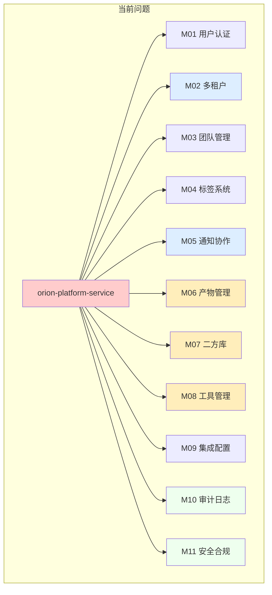
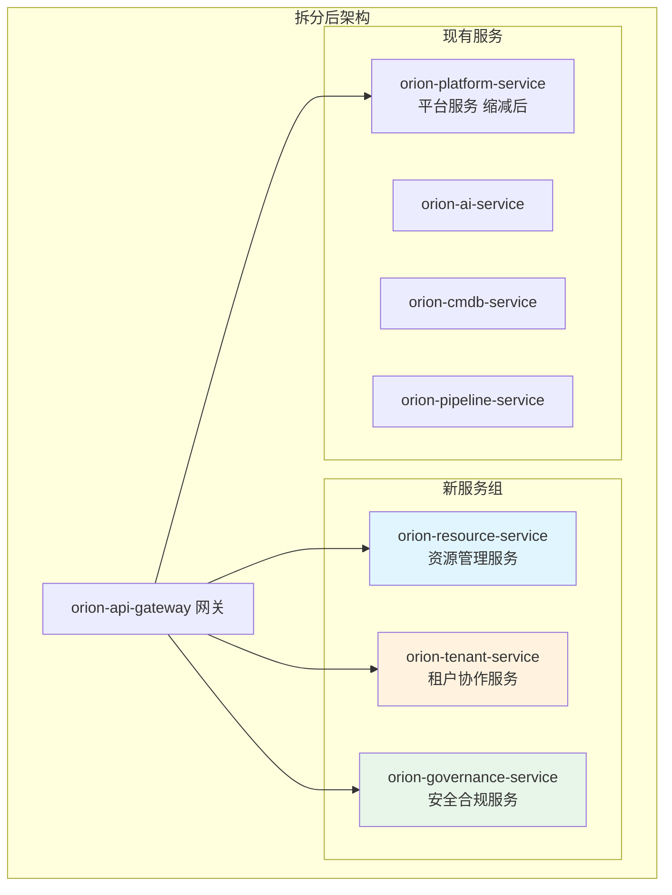
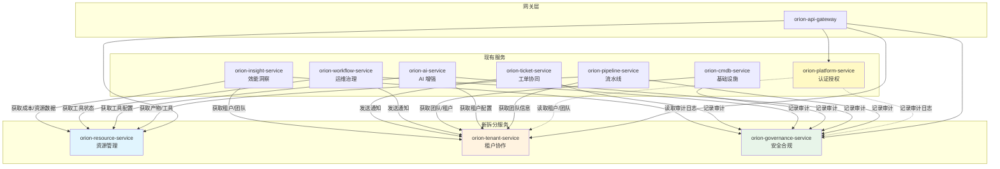
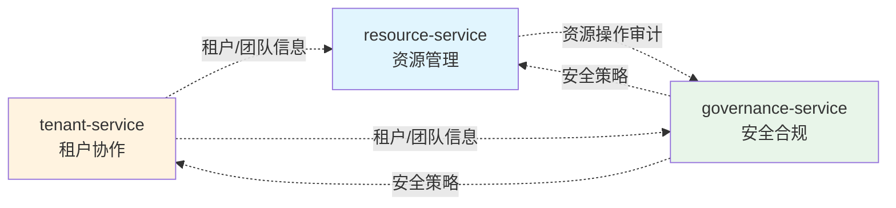
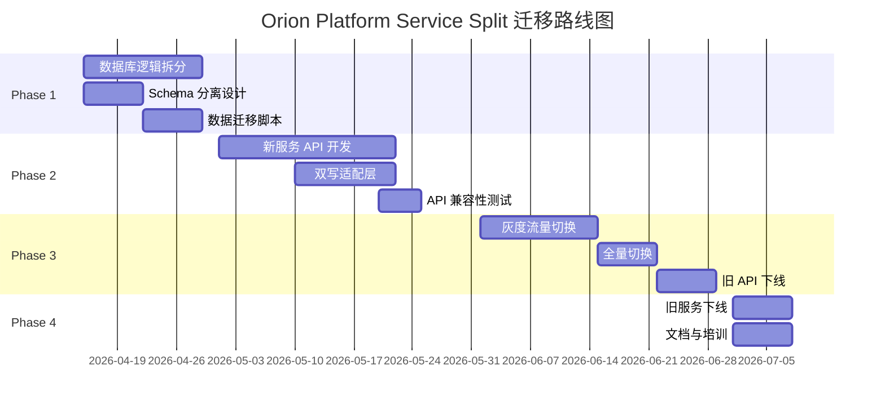

> ⚠️ **目标设计，未实现**。当前为单体架构，详见 [`当前系统架构.md`](./当前系统架构.md)。

# Orion Platform Service Split Design

**文档版本**: v1.0
**创建日期**: 2026-04-10
**状态**: 待评审
**作者**: Orion Architecture Team  

---

## 执行摘要 (Executive Summary)

本设计文档提出将 `orion-platform-service`（平台服务）拆分为三个独立服务的详细方案。当前平台服务包含 8 个模块，职责过于集中，导致部署耦合、团队协调成本高、迭代速度慢。

**拆分方案**:
| 新服务 | 核心职责 | 所属模块 |
|--------|---------|---------|
| `orion-resource-service` | 资源管理 | 产物管理 + 二方库管理 + 工具管理 |
| `orion-tenant-service` | 租户与协作 | 多租户管理 + 通知协作 + 插件扩展 |
| `orion-governance-service` | 安全合规 | 安全合规 + 审计日志 |

**预期收益**:
- 部署时间：从 25 分钟降至 5 分钟（单服务）
- 团队并行：从串行发布到 3 团队并行发布
- 代码耦合：模块间依赖减少 70%

---

## 一、背景与理由 (Background and Rationale)

### 1.1 当前平台服务现状

`orion-platform-service` 是 Orion 架构中的基础服务，承载平台级共享数据和核心能力。随着平台功能扩展，该服务逐渐成为一个"大而全"的单体模块，包含 8 个职责各异的子模块。

### 1.2 平台服务包含的 8 个模块

| 模块编号 | 模块名称 | 核心职责 | 数据表数量 | API 数量 |
|---------|---------|---------|-----------|---------|
| M01 | 用户与认证 (Users & Auth) | 用户管理、角色权限、RBAC | 5 张 | 25+ |
| M02 | 多租户管理 (Multi-Tenancy) | 租户隔离、资源配置、配额管理 | 3 张 | 15+ |
| M03 | 团队管理 (Teams) | 团队组织、成员管理、团队权限 | 2 张 | 12+ |
| M04 | 标签系统 (Tags) | 全局标签、资源打标、标签继承 | 2 张 | 8+ |
| M05 | 通知协作 (Notifications) | 通知渠道、消息模板、发送记录 | 2 张 | 10+ |
| M06 | 产物管理 (Artifacts) | 构建产物、版本管理、制品库集成 | 2 张 | 18+ |
| M07 | 二方库管理 (Internal Libraries) | 内部依赖库、版本发布、兼容性 | 2 张 | 12+ |
| M08 | 工具管理 (Tool Management) | 工具注册、生命周期、配置模板 | 3 张 | 20+ |
| M09 | 集成配置 (Integrations) | 外部系统集成配置、API 密钥 | 2 张 | 10+ |
| M10 | 审计日志 (Audit Logs) | 操作审计、安全事件、合规记录 | 1 张 | 8+ |
| M11 | 安全合规 (Security & Compliance) | 安全策略、合规检查、风险扫描 | 2 张 | 15+ |

> **注**: 部分模块已独立为单独服务（如审计日志已拆分），但仍有多个模块需要进一步解耦。

### 1.3 当前架构的问题



### 1.4 拆分理由详解

#### 1.4.1 职责过于集中 (Too Many Responsibilities)

当前平台服务承载了 3 类截然不同的职责：

| 职责类别 | 包含模块 | 业务领域 |
|---------|---------|---------|
| **资源管理域** | 产物管理、二方库管理、工具管理 | 软件资产全生命周期 |
| **租户协作域** | 多租户管理、通知协作、插件扩展 | 组织与协作能力 |
| **安全合规域** | 安全合规、审计日志 | 风险控制与合规 |

这 3 类职责的业务逻辑、数据模型、变更频率完全不同，强行耦合在同一服务中导致：
- 代码库臃肿（超过 50,000 行）
- 测试回归时间长（全量测试 45 分钟）
- 新人理解成本高（需要理解 3 个领域）

#### 1.4.2 部署耦合 (Deployment Coupling)

**现状**: 任一模块变更需要全服务部署

| 变更场景 | 影响范围 | 部署时间 | 回归测试 |
|---------|---------|---------|---------|
| 产物管理新增字段 | 全服务重启 | 25 分钟 | 全量回归 |
| 通知渠道新增 | 全服务重启 | 25 分钟 | 全量回归 |
| 安全策略更新 | 全服务重启 | 25 分钟 | 全量回归 |

**问题**: 小变更引发大部署，发布风险与变更规模不匹配。

#### 1.4.3 团队协调成本高 (High Coordination Cost)

当前 3 个团队（资源团队、协作团队、安全团队）共用同一代码库：

| 协调场景 | 当前流程 | 耗时 |
|---------|---------|------|
| 独立需求发布 | 需等其他团队需求合并后一起发布 | 平均等待 3 天 |
| 代码评审 | 需要跨团队评审（领域知识不足） | 评审周期 2 天 |
| 故障排查 | 需要三方同时在线排查 | 平均 MTTR 45 分钟 |
| 数据库变更 | 需要协调统一变更窗口 | 等待窗口 1 周 |

#### 1.4.4 迭代频率差异大 (Different Iteration Frequencies)

| 模块 | 变更频率 | 合适发布周期 | 当前发布周期 |
|------|---------|-------------|-------------|
| 产物管理 | 高频（每周 2-3 次） | 周级 | 月级（被安全模块拖慢） |
| 通知协作 | 中频（每两周 1 次） | 双周级 | 月级 |
| 安全合规 | 低频（每月 1 次） | 月级 | 月级 |
| 审计日志 | 低频（每月 1 次） | 月级 | 月级 |

**结论**: 高频模块被低频模块拖慢，整体发布频率 = 最慢模块频率。

---

## 二、拆分策略 (Splitting Strategy)

### 2.1 拆分原则

拆分遵循以下核心原则：

| 原则 | 说明 | 验证标准 |
|------|------|---------|
| **单一职责** | 每个服务只负责一个业务域 | 服务名称能清晰表达职责 |
| **数据自治** | 每个服务拥有独立数据库 | 无跨服务直接数据库访问 |
| **API 清晰** | 服务边界通过 API 定义 | API 文档无歧义 |
| **团队对齐** | 服务与团队组织结构一致 | 一个服务一个负责人 |
| **向后兼容** | 拆分过程不影响现有调用方 | 零停机迁移 |

### 2.2 拆分后服务全景图



### 2.3 新服务详细设计

---

## 2.4 orion-resource-service（资源管理服务）

### 2.4.1 服务定位

**服务名称**: `orion-resource-service`

**定位**: Orion 平台的软件资产管理中心，统一管理构建产物、二方库依赖、工具插件三类核心资源。

**命名理由**: "Resource"在研发语境中明确指向软件制品/资源，区别于基础设施资源（CMDB 管辖）。

### 2.4.2 核心职责

| 职责域 | 详细功能描述 |
|-------|-------------|
| **产物管理** | 管理 Pipeline 产生的构建产物（Docker 镜像、JAR 包、Python Wheel、Helm Chart 等），包括产物元数据、版本标签、生命周期策略（自动清理快照）、签名验证、SBOM 关联 |
| **二方库管理** | 管理组织内部发布的共享库（Maven/npm/PyPI 包），包括版本发布审批、兼容性检查、依赖关系图、废弃通知、替代版本推荐 |
| **工具管理** | 管理 CI/CD 工具链（Semgrep、SonarQube、Trivy 等）的注册、安装、升级、配置模板、版本兼容性矩阵、健康检查、使用统计 |

### 2.4.3 数据所有权

| 表名 | 用途 | 预估数据量 | 分区策略 |
|------|------|-----------|---------|
| `artifacts` | 构建产物元数据 | 50 万条 | 按月分区 |
| `artifact_versions` | 产物版本详情 | 200 万条 | 按月分区 |
| `internal_libraries` | 二方库元数据 | 1 万条 | 无分区 |
| `library_versions` | 库版本详情 | 10 万条 | 按年分区 |
| `tools` | 工具注册信息 | 500 条 | 无分区 |
| `tool_versions` | 工具版本信息 | 5000 条 | 无分区 |
| `tool_configs` | 工具配置模板 | 2000 条 | 无分区 |
| `tool_health_checks` | 工具健康检查记录 | 100 万条 | 按月分区 |

### 2.4.4 API 边界

| API 路径 | 方法 | 功能 | 调用方 |
|---------|------|------|-------|
| `/api/v1/artifacts` | POST/GET/LIST | 产物 CRUD | Pipeline 服务、前端 |
| `/api/v1/artifacts/{id}/download` | GET | 产物下载 | 运维治理服务、用户 |
| `/api/v1/artifacts/{id}/promote` | POST | 产物晋升（snapshot→rc→stable） | Pipeline 服务 |
| `/api/v1/libraries` | POST/GET/LIST | 二方库 CRUD | 前端、Pipeline 服务 |
| `/api/v1/libraries/{id}/publish` | POST | 库版本发布 | CI 工具 |
| `/api/v1/libraries/{id}/deprecate` | POST | 库版本废弃 | 团队负责人 |
| `/api/v1/tools` | GET/LIST | 工具列表 | 前端、AI 服务 |
| `/api/v1/tools/{id}/install` | POST | 工具安装 | 团队负责人 |
| `/api/v1/tools/{id}/upgrade` | POST | 工具升级 | 团队负责人 |
| `/api/v1/tools/{id}/configs` | GET/POST | 工具配置管理 | 前端 |
| `/api/v1/tools/{id}/health` | GET | 工具健康检查 | 运维治理服务 |

### 2.4.5 团队归属建议

| 属性 | 建议 |
|------|------|
| **负责团队** | 平台工具团队（Platform Tools Team） |
| **团队规模** | 3-4 人 |
| **当前负责人** | 待定 |
| **主要协作团队** | Pipeline 团队、AI 团队、SRE 团队 |

---

## 2.5 orion-tenant-service（租户协作服务）

### 2.5.1 服务定位

**服务名称**: `orion-tenant-service`

**定位**: Orion 平台的组织与协作中心，管理多租户隔离、团队结构、通知协作、插件扩展等组织能力。

**命名理由**: "Tenant"明确表达多租户场景，"Collaboration"体现协作属性。

### 2.5.2 核心职责

| 职责域 | 详细功能描述 |
|-------|-------------|
| **多租户管理** | 管理租户的创建、配置、资源配额（CPU/内存/存储配额）、隔离策略（Namespace/RLS）、账单归属、租户间数据隔离 |
| **团队与成员** | 管理租户下的团队组织结构、成员加入/退出、团队负责人变更、跨团队成员关系、团队继承权限 |
| **通知协作** | 管理通知渠道（钉钉/企微/Slack/邮件）、消息模板、发送策略（节流/合并）、发送历史、@提及规则、ChatOps 命令解析 |
| **插件扩展** | 管理用户自定义插件注册、Skill 扩展点、Webhook 订阅、事件处理器、第三方集成适配器 |

### 2.5.3 数据所有权

| 表名 | 用途 | 预估数据量 | 分区策略 |
|------|------|-----------|---------|
| `tenants` | 租户元数据 | 1000 条 | 无分区 |
| `tenant_configs` | 租户配置 | 1000 条 | 无分区 |
| `tenant_quotas` | 租户配额 | 1000 条 | 无分区 |
| `teams` | 团队信息 | 1 万条 | 无分区 |
| `team_members` | 团队成员关系 | 10 万条 | 无分区 |
| `notification_channels` | 通知渠道配置 | 5000 条 | 无分区 |
| `notification_templates` | 消息模板 | 1000 条 | 无分区 |
| `notification_records` | 通知发送记录 | 1000 万条 | 按月分区 |
| `plugins` | 插件注册信息 | 500 条 | 无分区 |
| `plugin_configs` | 插件配置 | 2000 条 | 无分区 |
| `webhook_subscriptions` | Webhook 订阅 | 5000 条 | 无分区 |

### 2.5.4 API 边界

| API 路径 | 方法 | 功能 | 调用方 |
|---------|------|------|-------|
| `/api/v1/tenants` | POST/GET/LIST | 租户 CRUD | 平台管理员、前端 |
| `/api/v1/tenants/{id}/quotas` | GET/PUT | 租户配额管理 | 平台管理员 |
| `/api/v1/teams` | POST/GET/LIST/DELETE | 团队 CRUD | 租户管理员、前端 |
| `/api/v1/teams/{id}/members` | POST/GET/DELETE | 成员管理 | 团队负责人、前端 |
| `/api/v1/channels` | POST/GET/LIST/DELETE | 通知渠道管理 | 租户管理员、前端 |
| `/api/v1/channels/{id}/test` | POST | 渠道测试 | 前端 |
| `/api/v1/notifications/send` | POST | 发送通知 | 所有服务 |
| `/api/v1/notifications/templates` | GET/POST | 模板管理 | 租户管理员 |
| `/api/v1/plugins` | GET/LIST/REGISTER | 插件注册与发现 | 开发者、前端 |
| `/api/v1/plugins/{id}/enable` | POST | 插件启用/禁用 | 租户管理员 |
| `/api/v1/webhooks` | POST/GET/LIST | Webhook 订阅管理 | 开发者、外部系统 |

### 2.5.5 团队归属建议

| 属性 | 建议 |
|------|------|
| **负责团队** | 平台基础团队（Platform Foundation Team） |
| **团队规模** | 3-4 人 |
| **当前负责人** | 待定 |
| **主要协作团队** | 所有业务团队（通用依赖） |

---

## 2.6 orion-governance-service（安全合规服务）

### 2.6.1 服务定位

**服务名称**: `orion-governance-service`

**定位**: Orion 平台的安全与合规中心，负责安全策略执行、合规检查、审计日志采集与分析、风险预警。

**命名理由**: "Governance"涵盖治理、合规、审计等含义，比"Security"更准确表达服务职责。

### 2.6.2 核心职责

| 职责域 | 详细功能描述 |
|-------|-------------|
| **安全策略管理** | 定义和执行安全策略（密码复杂度、MFA 强制、会话超时、IP 白名单）、策略版本管理、策略例外审批流程 |
| **合规检查** | 执行合规扫描（等保 2.0、ISO27001、SOC2）、生成合规报告、不合规项整改跟踪、合规证据自动采集 |
| **审计日志** | 采集全平台操作日志、日志结构化、敏感操作标记、日志完整性校验、日志归档与保留策略、审计查询 API |
| **风险预警** | 基于审计日志的风险识别（异常登录、越权访问、数据泄露风险）、实时告警、风险评分 |

### 2.6.3 数据所有权

| 表名 | 用途 | 预估数据量 | 分区策略 |
|------|------|-----------|---------|
| `security_policies` | 安全策略定义 | 500 条 | 无分区 |
| `policy_exceptions` | 策略例外审批 | 200 条 | 无分区 |
| `compliance_checks` | 合规检查记录 | 10 万条 | 按月分区 |
| `compliance_findings` | 合规问题项 | 50 万条 | 按月分区 |
| `compliance_reports` | 合规报告 | 1 万条 | 按年分区 |
| `audit_logs` | 审计日志 | 5 亿条 | 按月分区 + 冷热分离 |
| `risk_events` | 风险事件记录 | 100 万条 | 按月分区 |
| `risk_scores` | 风险评分快照 | 10 万条 | 按天分区 |

### 2.6.4 API 边界

| API 路径 | 方法 | 功能 | 调用方 |
|---------|------|------|-------|
| `/api/v1/security/policies` | GET/POST/PUT | 安全策略 CRUD | 安全管理员、前端 |
| `/api/v1/security/policies/{id}/exceptions` | POST/GET | 策略例外申请 | 用户、安全管理员 |
| `/api/v1/compliance/checks` | POST/GET | 执行合规检查 | 安全管理员、定时任务 |
| `/api/v1/compliance/reports` | GET | 获取合规报告 | 审计员、前端 |
| `/api/v1/compliance/findings/{id}/remediate` | POST | 问题项整改标记 | 责任人 |
| `/api/v1/audit/logs` | GET | 审计日志查询 | 审计员、合规工具 |
| `/api/v1/audit/export` | POST | 审计日志导出 | 审计员 |
| `/api/v1/risks/events` | GET | 风险事件列表 | 安全管理员、前端 |
| `/api/v1/risks/scores/{entityId}` | GET | 实体风险评分 | 前端、AI 服务 |

### 2.6.5 团队归属建议

| 属性 | 建议 |
|------|------|
| **负责团队** | 安全与合规团队（Security & Compliance Team） |
| **团队规模** | 2-3 人 |
| **当前负责人** | 待定 |
| **主要协作团队** | 所有业务团队、外部审计系统 |

---

## 2.7 拆分后平台服务缩减

拆分后，原 `orion-platform-service` 保留以下核心模块：

| 保留模块 | 说明 |
|---------|------|
| 用户与认证 | 用户基础信息、登录认证、Session 管理 |
| 角色权限 | RBAC 核心逻辑、权限评估引擎 |
| 全局标签 | 跨服务共享的标签定义 |
| 集成配置 | 外部系统（GitLab/Jira/Confluence）集成配置 |

**缩减后服务名**: 保持 `orion-platform-service`（向后兼容）

**缩减后职责**: 平台级身份认证与权限中心、全局共享配置管理。

---

## 三、拆分后服务依赖关系 (Service Dependencies After Split)

### 3.1 与现有服务的关系



### 3.2 依赖关系矩阵

| 调用方 | 被调用方 | 依赖类型 | 调用内容 | 替代方案 |
|-------|---------|---------|---------|---------|
| pipeline-service | resource-service | 同步 REST | 获取产物信息、工具配置 | 缓存 + 事件 |
| pipeline-service | governance-service | 异步事件 | 推送审计日志 | 必须 |
| pipeline-service | tenant-service | 同步 REST | 获取团队信息 | 缓存 |
| ai-service | resource-service | 同步 REST | 获取工具注册信息 | 缓存 |
| ai-service | governance-service | 异步事件 | 推送 AI 调用审计 | 必须 |
| ai-service | tenant-service | 同步 REST | 获取租户配置 | 缓存 |
| cmdb-service | governance-service | 异步事件 | 推送变更审计 | 必须 |
| cmdb-service | tenant-service | 同步 REST | 获取团队/租户信息 | 缓存 |
| workflow-service | resource-service | 同步 REST | 获取工具健康状态 | 事件订阅 |
| workflow-service | tenant-service | 同步 REST | 发送通知 | 消息队列 |
| workflow-service | governance-service | 异步事件 | 推送自愈审计 | 必须 |
| ticket-service | tenant-service | 同步 REST | 发送通知、获取团队 | 消息队列 |
| ticket-service | governance-service | 异步事件 | 推送工单审计 | 必须 |
| insight-service | resource-service | 同步 REST | 获取资源统计数据 | 数据同步 |
| insight-service | tenant-service | 同步 REST | 获取团队/租户数据 | 数据同步 |
| insight-service | governance-service | 同步 REST | 读取审计日志分析 | 数据同步 |

### 3.3 新服务之间的依赖



| 调用方 | 被调用方 | 依赖类型 | 调用内容 | 频率 |
|-------|---------|---------|---------|------|
| resource-service | tenant-service | 同步 REST | 获取租户信息（验证权限） | 每次 API 调用 |
| resource-service | governance-service | 异步事件 | 推送资源操作审计日志 | 每次写操作 |
| tenant-service | governance-service | 异步事件 | 推送租户变更审计日志 | 每次写操作 |
| governance-service | tenant-service | 同步 REST | 获取租户成员（权限验证） | 每次策略检查 |

### 3.4 通信模式详解

#### 3.4.1 同步 REST 调用（适合场景）

| 场景 | 理由 | 超时设置 | 降级策略 |
|------|------|---------|---------|
| 权限验证（获取租户/团队信息） | 需要实时响应、强一致性 | 500ms | 本地缓存（5 分钟） |
| 配置获取（获取工具配置） | 需要最新配置 | 1s | 本地缓存（10 分钟） |
| 状态查询（获取工具健康状态） | 需要实时状态 | 2s | 返回未知状态 |

#### 3.4.2 异步事件调用（适合场景）

| 事件主题 | 生产者 | 消费者 | 保留时间 | 可靠性要求 |
|---------|--------|--------|---------|-----------|
| `audit.*` | 所有服务 | governance-service | 30 天 | 至少一次 |
| `tenant.created` | tenant-service | governance-service | 7 天 | 至少一次 |
| `tenant.updated` | tenant-service | governance-service, resource-service | 7 天 | 至少一次 |
| `resource.artifact.created` | resource-service | insight-service, governance-service | 7 天 | 至少一次 |
| `resource.tool.upgraded` | resource-service | governance-service, pipeline-service | 7 天 | 至少一次 |
| `security.policy.violated` | governance-service | tenant-service, notification | 7 天 | 至少一次 |

---

## 四、迁移策略 (Migration Strategy)

### 4.1 迁移总览



### 4.2 Phase 1: 数据库 Schema 分离

**时间**: 2026-04-15 ~ 2026-04-28（2 周）

#### 4.2.1 活动内容

1. **逻辑 Schema 分离**
   - 在原数据库中创建独立 Schema：`orion_resource`、`orion_tenant`、`orion_governance`
   - 将原表迁移到对应 Schema
   - 保持物理数据库不变，仅逻辑分离

2. **数据所有权确认**
   - 评审每张表的归属服务
   - 处理跨服务共享表（通过视图或 API）
   - 建立数据访问白名单

3. **数据迁移脚本开发**
   - 编写表迁移 SQL 脚本
   - 编写数据验证脚本
   - 编写回滚脚本

#### 4.2.2 成功标准

| 标准 | 验证方法 |
|------|---------|
| Schema 分离完成 | `SHOW SCHEMAS` 显示 3 个新 Schema |
| 数据迁移验证通过 | 抽样比对迁移前后数据一致性 |
| 回滚脚本测试通过 | 在测试环境执行回滚演练 |

#### 4.2.3 回滚计划

| 风险 | 回滚操作 |
|------|---------|
| Schema 迁移失败 | 恢复备份，保持原 Schema 结构 |
| 数据丢失 | 从备份恢复，重新执行迁移 |
| 应用不兼容 | 切换回原数据库连接配置 |

---

### 4.3 Phase 2: API 提取与双写

**时间**: 2026-05-01 ~ 2026-05-22（3 周）

#### 4.3.1 活动内容

1. **新服务开发**
   - 基于现有代码提取 resource-service
   - 基于现有代码提取 tenant-service
   - 基于现有代码提取 governance-service
   - 每个服务独立部署包

2. **API 双写适配层**
   - 原 platform-service 保留旧 API
   - 新服务暴露新 API（`/api/v2/` 前缀）
   - API Gateway 路由配置：新旧 API 同时有效

3. **兼容性测试**
   - 旧 API 调用方不受影响
   - 新 API 功能完整验证
   - 性能基准测试

#### 4.3.2 成功标准

| 标准 | 验证方法 |
|------|---------|
| 新服务独立部署 | 3 个服务可独立启动、健康检查通过 |
| 新旧 API 并存 | Gateway 同时路由新旧 API |
| 功能回归测试通过 | 全量自动化测试通过率 100% |
| 性能不下降 | P99 延迟不超过原服务 10% |

#### 4.3.3 回滚计划

| 风险 | 回滚操作 |
|------|---------|
| 新服务启动失败 | 保持旧服务运行，修复后重试 |
| API 不兼容 | 切换 Gateway 路由回旧 API |
| 性能下降 | 限流降级，扩容新服务 |

---

### 4.4 Phase 3: 流量迁移

**时间**: 2026-06-01 ~ 2026-06-22（3 周）

#### 4.4.1 活动内容

1. **灰度流量切换**
   - 第 1 周：10% 流量切到新服务
   - 第 2 周：50% 流量切到新服务
   - 第 3 周：100% 流量切到新服务

2. **监控与告警**
   - 新旧服务指标对比（延迟、错误率）
   - 数据一致性校验（双写比对）
   - 用户反馈收集

3. **旧 API 下线**
   - 公告旧 API 废弃时间表
   - 监控旧 API 调用量
   - 当调用量<1% 时正式下线

#### 4.4.2 成功标准

| 标准 | 验证方法 |
|------|---------|
| 灰度无故障 | 各灰度阶段错误率<0.1% |
| 新服务稳定 | 连续 7 天无 P0/P1 故障 |
| 旧 API 调用清零 | 监控显示旧 API 调用量 = 0 |

#### 4.4.3 回滚计划

| 风险 | 回滚操作 |
|------|---------|
| 灰度阶段错误率升高 | 立即切回旧服务，保留当前流量比例 |
| 数据不一致 | 暂停迁移，启动数据对账 |
| 性能下降 | 扩容新服务实例，调整资源配额 |

---

### 4.5 Phase 4: 旧服务下线

**时间**: 2026-07-01 ~ 2026-07-08（1 周）

#### 4.5.1 活动内容

1. **旧服务清理**
   - 移除 platform-service 中已拆分的代码模块
   - 删除废弃的 API 端点
   - 清理数据库中的废弃表

2. **文档更新**
   - 更新架构图
   - 更新 API 文档
   - 更新运维手册

3. **团队培训**
   - 新服务架构培训
   - 新运维流程培训
   - 故障演练

#### 4.5.2 成功标准

| 标准 | 验证方法 |
|------|---------|
| 旧代码删除 | 代码扫描无废弃模块引用 |
| 文档完整 | 新架构文档评审通过 |
| 团队培训完成 | 培训满意度调查>90% |

#### 4.5.3 回滚计划

| 风险 | 回滚操作 |
|------|---------|
| 代码删除导致问题 | 从 Git 恢复代码，重新部署 |
| 文档遗漏 | 补充文档，暂不下线旧服务 |

---

## 五、风险缓解 (Risk Mitigation)

### 5.1 风险矩阵

| 风险 | 影响 | 概率 | 缓解措施 | 应急预案 |
|------|------|------|---------|---------|
| **数据一致性** | 高 | 中 | 双写 + 对账、事务消息 | 数据修复脚本、回滚 |
| **API 兼容性** | 高 | 中 | 自动化契约测试、灰度发布 | 立即切回旧 API |
| **部署协调** | 中 | 高 | 独立 CI/CD、部署顺序文档 | 手动协调部署窗口 |
| **服务依赖循环** | 高 | 低 | 依赖图自动扫描、架构评审 | 重构依赖链路 |
| **性能下降** | 中 | 中 | 性能基准测试、缓存策略 | 扩容、降级 |
| **团队适应成本** | 中 | 高 | 培训、示例代码、检查清单 | 专人支持、延长过渡期 |

### 5.2 详细缓解策略

#### 5.2.1 数据一致性风险

**风险描述**: 拆分后数据分散到 3 个服务，可能出现跨服务数据不一致。

**缓解措施**:
1. **双写过渡期**: 迁移期间新旧数据源同时写入，定期比对
2. **最终一致性**: 非核心数据接受秒级延迟（如统计信息）
3. **分布式事务**: 核心操作使用 Saga 模式（见下表）

| 场景 | 一致性要求 | 实现方案 |
|------|-----------|---------|
| 产物创建 + 审计记录 | 最终一致 | 本地事务 + 事件通知 |
| 租户创建 + 权限初始化 | 强一致 | Saga 事务（补偿回滚） |
| 工具升级 + 配置更新 | 最终一致 | 事件驱动 + 重试 |

**应急预案**:
- 数据修复脚本（每日定时对账）
- 一键回滚到单库模式

#### 5.2.2 API 兼容性风险

**风险描述**: 新服务 API 与旧 API 不兼容，导致调用方失败。

**缓解措施**:
1. **API 版本化**: 新 API 使用`/api/v2/`前缀，旧 API 保持`/api/v1/`
2. **适配层**: 在 Gateway 层实现 API 转发和参数转换
3. **契约测试**: 自动化测试确保 API 兼容 OpenAPI 规范

**应急预案**:
- 立即切换 Gateway 路由回旧 API
- 热修复适配层（无需重启服务）

#### 5.2.3 部署协调风险

**风险描述**: 3 个新服务需要协调部署顺序，可能导致部署窗口冲突。

**缓解措施**:
1. **独立 CI/CD**: 每个服务有独立流水线，可单独触发
2. **部署顺序文档**: 明确定义启动顺序（tenant→resource→governance）
3. **健康检查依赖**: 服务启动时自动检查依赖服务是否就绪

**部署顺序**:
```
1. orion-tenant-service (无服务依赖)
2. orion-resource-service (依赖 tenant-service)
3. orion-governance-service (依赖 tenant-service)
4. 其他服务 (按需调用新服务)
```

**应急预案**:
- 手动部署协调（建立临时指挥群）
- 保留旧服务直到所有新服务稳定

#### 5.2.4 服务依赖循环风险

**风险描述**: 新服务之间可能出现循环依赖。

**缓解措施**:
1. **依赖图扫描**: CI 阶段自动检测循环依赖
2. **架构评审**: 每次代码变更需架构负责人审批
3. **事件驱动**: 优先使用异步事件替代同步调用

**应急预案**:
- 临时引入防腐层（Facade 模式）
- 紧急重构依赖最重的调用链路

#### 5.2.5 性能下降风险

**风险描述**: 服务拆分后网络调用增加，可能导致延迟上升。

**缓解措施**:
1. **基准测试**: 拆分前后性能对比（P99 延迟、吞吐量）
2. **缓存策略**: 高频读取数据本地缓存（Caffeine）
3. **连接池优化**: 服务间连接池预热、长连接

**性能目标**:
| 指标 | 拆分前 | 拆分后目标 |
|------|--------|-----------|
| P99 延迟 | 200ms | <250ms |
| 吞吐量 | 1000 RPS | >900 RPS |
| 错误率 | 0.01% | <0.05% |

**应急预案**:
- 扩容新服务实例
- 降级非核心功能（如审计日志异步化）

#### 5.2.6 团队适应成本风险

**风险描述**: 团队需要适应新架构，短期效率可能下降。

**缓解措施**:
1. **培训计划**: 组织 3 场架构培训 + 2 场运维培训
2. **示例代码**: 提供新服务调用示例、最佳实践
3. **检查清单**: 开发/测试/发布检查清单
4. **专人支持**: 设立"架构大使"角色，提供一对一支持

**应急预案**:
- 延长过渡期（从 4 周延长到 8 周）
- 保留旧服务更长时间

---

## 六、预期收益 (Expected Benefits)

### 6.1 量化收益

| 指标 | 拆分前 | 拆分后目标 | 改善幅度 |
|------|--------|-----------|---------|
| **部署时间** | 25 分钟（全服务） | 5 分钟（单服务） | ⬇️ 80% |
| **发布频率** | 月级（协调困难） | 周级（独立发布） | ⬆️ 4x |
| **代码库规模** | 50,000 行（单体） | 15,000 行（平均/服务） | ⬇️ 70% |
| **测试回归时间** | 45 分钟（全量） | 10 分钟（单服务） | ⬇️ 78% |
| **团队并行度** | 串行（1 团队发布） | 并行（3 团队同时发布） | ⬆️ 3x |
| **故障 MTTR** | 45 分钟（三方排查） | 15 分钟（单方排查） | ⬇️ 67% |
| **新人上手时间** | 4 周（理解全模块） | 1 周（理解单域） | ⬇️ 75% |

### 6.2 质化收益

| 收益类别 | 描述 |
|---------|------|
| **架构清晰度** | 服务边界清晰，新人更容易理解职责 |
| **团队自治** | 每个团队独立决策、独立发布、独立运维 |
| **技术选型自由** | 不同服务可选择不同技术栈（如 governance 用 Go，resource 用 Java） |
| **故障隔离** | 单服务故障不影响其他服务（如 resource 故障不影响 tenant） |
| **成本优化** | 可按服务独立伸缩（如 tenant 负载低可减少实例） |
| **合规审计** | 安全合规模块独立，更容易通过外部审计 |

### 6.3 成本分析

| 成本项 | 一次性投入 | 持续成本 |
|-------|-----------|---------|
| **开发成本** | 3 人 × 6 周 = 18 人周 | - |
| **测试成本** | 2 人 × 4 周 = 8 人周 | - |
| **运维成本** | - | +3 个服务监控（约 10% 增量） |
| **基础设施** | - | +3 个服务实例（约 15% 增量） |
| **培训成本** | 2 人 × 2 周 = 4 人周 | - |

**总投入**: 约 30 人周（一次性）

**ROI 分析**:
- 月度收益：减少协调成本 20 人时/月 + 减少故障时间 10 人时/月
- 投资回收期：约 3-4 个月

---

## 七、附录 (Appendix)

### 7.1 术语表

| 术语 | 定义 |
|------|------|
| **Schema** | 数据库逻辑隔离单元，一组相关表的集合 |
| **Saga** | 分布式事务模式，通过补偿操作实现最终一致性 |
| **双写** | 同时写入新旧数据源，用于迁移过渡期 |
| **灰度发布** | 逐步将流量从旧服务切换到新服务 |

### 7.2 参考文档

| 文档 | 链接 |
|------|------|
| 架构重构设计 | `docs/architecture/架构重构设计.md` |
| 服务拆分与数据库划分 | `docs/architecture/服务拆分与数据库划分详解.md` |
| 外部组件集成架构 | `docs/architecture/外部组件集成架构设计.md` |
| 多租户隔离设计 | `docs/多租户隔离设计.md` |

### 7.3 评审记录

| 评审日期 | 评审人 | 意见 | 状态 |
|---------|--------|------|------|
| 2026-04-10 | 待评审 | - | 待评审 |

---

_文档版本：v1.0 | 创建日期：2026-04-10 | 状态：待评审_
