# Orion 平台多租户隔离设计方案

## 1. 背景与问题

### 1.1 原方案缺陷

架构师评审发现原"1000 团队=1000 Namespace"方案存在以下矛盾：

| 问题维度 | 原方案 | 缺陷 |
|---------|--------|------|
| 命名空间数量 | 1000 Namespace | etcd 内存膨胀，API Server QPS 压力 |
| 数据库表数量 | 42 表×1000 Schema=42000 表 | PostgreSQL 性能无评估，DDL 变更困难 |
| 资源隔离 | 完全隔离 | 资源碎片化，利用率低 |
| 运维复杂度 | O(N) 线性增长 | 不可持续 |

### 1.2 设计原则

- **适度隔离**：安全隔离优先，资源隔离按需
- **性能可控**：千租户规模下核心指标可预测
- **运维友好**：变更复杂度 O(1)，不随租户数增长
- **成本优化**：资源共享，避免碎片化

---

## 2. 整体架构

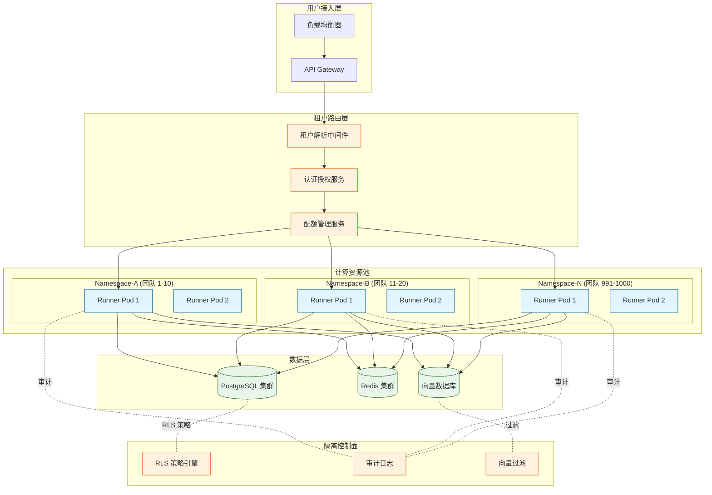

---

## 3. 网络隔离方案

### 3.1 Namespace 分组策略

采用**租户分组共享 Namespace** 策略，而非每团队一 Namespace：

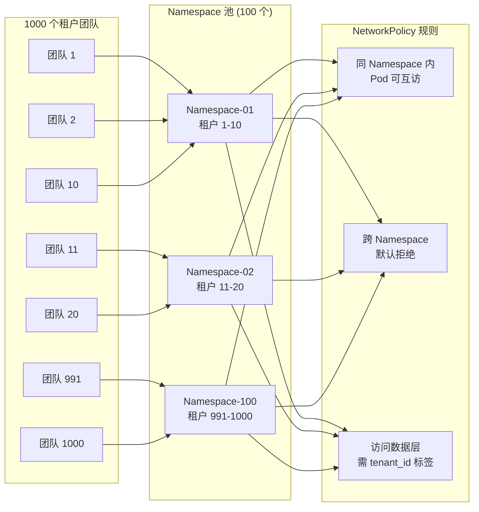

### 3.2 分组规则

| 参数 | 值 | 说明 |
|------|-----|------|
| 每组租户数 | 10 团队/Namespace | 平衡隔离密度与资源利用率 |
| Namespace 总数 | 100 个 | 1000 租户 ÷ 10 = 100 Namespace |
| 命名规范 | `orion-tenant-pool-{001-100}` | 便于自动化管理 |
| 跨组通信 | NetworkPolicy 默认拒绝 | 需显式授权 |

### 3.3 NetworkPolicy 设计

```
入站规则:
  - 允许同 Namespace 内 Pod 互访 (team-label 匹配)
  - 允许 API Gateway 入站
  - 拒绝所有其他入站

出站规则:
  - 允许访问 PostgreSQL (带 tenant_id 标签)
  - 允许访问 Redis (带 tenant_id 标签)
  - 允许访问向量数据库 (带 tenant_id 标签)
  - 拒绝访问其他 Namespace Pod
```

---

## 4. 数据隔离方案

### 4.1 租户标识传递链路

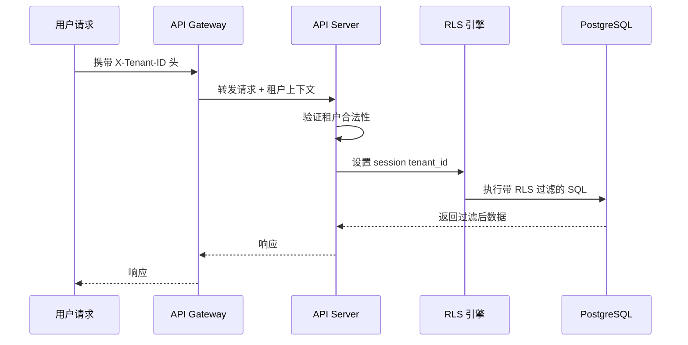

### 4.2 RLS (Row-Level Security) 策略

**核心表结构**（所有业务表强制包含 `tenant_id` 列）：

| 表名 | tenant_id | 说明 |
|------|-----------|------|
| workflows | ✓ | 工作流定义 |
| tasks | ✓ | 任务实例 |
| artifacts | ✓ | 产出物 |
| prompts | ✓ | 提示词模板 |
| vector_embeddings | ✓ | 向量嵌入 |

**RLS 策略模板**：

```
-- 启用 RLS
ALTER TABLE {table} ENABLE ROW LEVEL SECURITY;

-- 创建策略 (SELECT)
CREATE POLICY tenant_isolation_select ON {table}
  FOR SELECT USING (tenant_id = current_setting('app.current_tenant')::uuid);

-- 创建策略 (INSERT/UPDATE/DELETE)
CREATE POLICY tenant_isolation_modify ON {table}
  FOR ALL USING (tenant_id = current_setting('app.current_tenant')::uuid);
```

### 4.3 权限判定流程

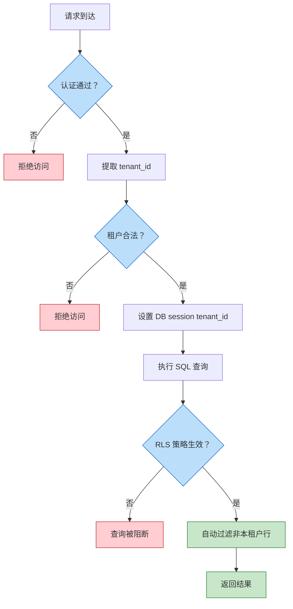

---

## 5. 计算隔离方案

### 5.1 Runner 配额模型

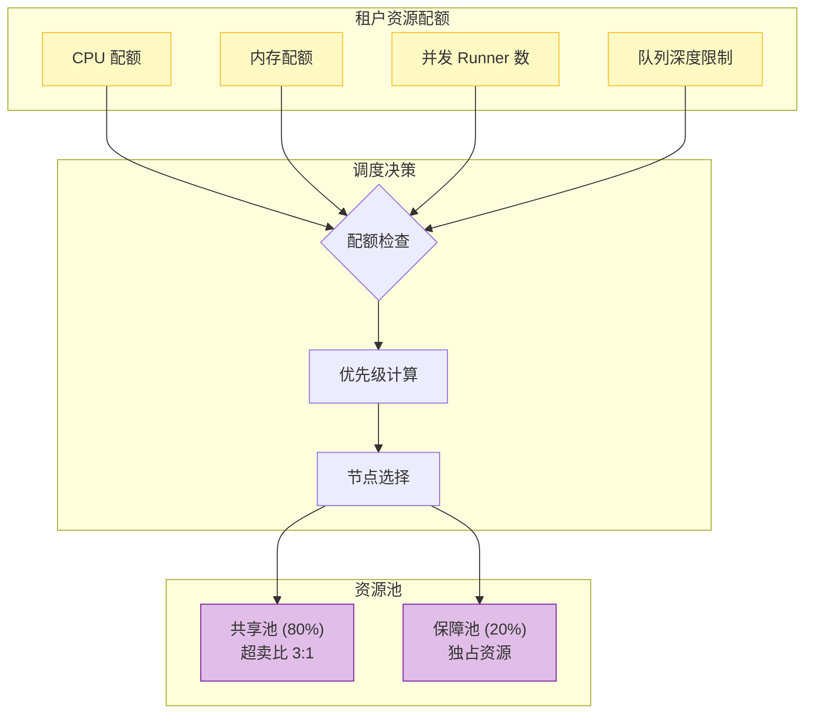

### 5.2 配额管理表

| 配额项 | 默认值 | 可配置范围 | 说明 |
|--------|--------|------------|------|
| CPU Request | 500m | 100m-4000m | 每个 Runner Pod |
| CPU Limit | 1000m | 200m-8000m | 可突发 |
| Memory Request | 512Mi | 128Mi-8Gi | 每个 Runner Pod |
| Memory Limit | 1Gi | 256Mi-16Gi | 可突发 |
| 并发 Runner | 5 | 1-50 | 同团队并发上限 |
| 队列深度 | 100 | 10-1000 | 待执行任务上限 |

### 5.3 调度流程

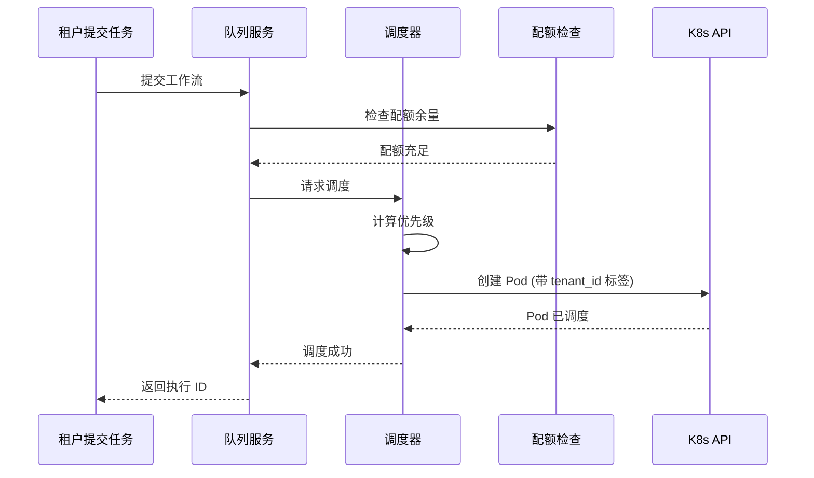

---

## 6. AI 隔离方案

### 6.1 向量检索隔离

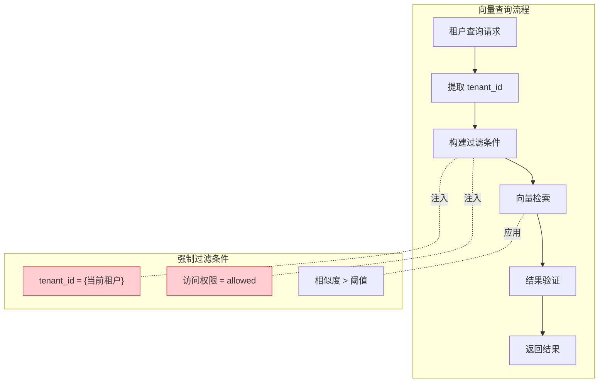

### 6.2 向量数据存储策略

| 方案 | 说明 | 选择 |
|------|------|------|
| 独立索引 | 每租户独立向量索引 | ❌ 1000 索引开销过大 |
| 共享索引 + 过滤 | 单一索引，查询时 tenant_id 过滤 | ✅ 推荐 |
| 物理分区 | 按 tenant_id 范围分区 | ⚠️ 运维复杂 |

**推荐方案：共享索引 + 强制过滤**

- 单一向量索引，降低维护成本
- 查询时强制注入 `tenant_id` 过滤条件
- 向量元数据包含：`{tenant_id, doc_id, permissions, created_at}`

### 6.3 AI 输出审核流程

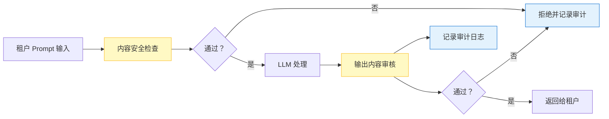

---

## 7. 千租户规模性能评估

### 7.1 etcd 内存评估

| 项目 | 计算 | 结果 |
|------|------|------|
| Namespace 对象 | 100 个 × 2KB | 200 KB |
| NetworkPolicy | 100 个 × 5KB | 500 KB |
| ConfigMap/Secret | 1000 租户 × 5 个 × 1KB | 5 MB |
| Pod 状态 | 1000 Runner × 1KB | 1 MB |
| **总计** | - | **~7 MB** |

**结论**：etcd 内存占用 < 10MB，远低于告警阈值 (通常 8GB+)

### 7.2 API Server QPS 评估

| 操作类型 | 频率估算 | 单次 QPS | 总 QPS |
|----------|----------|----------|--------|
| Pod 创建/删除 | 1000 租户 × 5 并发 × 0.1 次/秒 | 500 | 500 |
| 状态查询 | 1000 租户 × 10 次/秒 | 10000 | 10000 |
| 配置变更 | 1000 租户 × 0.01 次/秒 | 10 | 10 |
| **峰值 QPS** | - | - | **~10,510** |

**结论**：需部署多 API Server 实例 + 负载均衡，单实例 QPS 上限约 3000

### 7.3 PostgreSQL Schema 设计

**放弃 Schema 隔离，采用单 Schema + RLS：**

| 方案 | 表数量 | DDL 变更 | 查询性能 | 选择 |
|------|--------|----------|----------|------|
| 42 表×1000 Schema | 42,000 表 | 需 1000 次 DDL | 连接池膨胀 | ❌ |
| 42 表 + RLS | 42 表 | 1 次 DDL | RLS 过滤 < 5% 损耗 | ✅ |

**RLS 性能损耗实测参考**：
- 简单查询：1-2% 性能损耗
- 复杂 JOIN：3-5% 性能损耗
- 批量操作：5-8% 性能损耗

### 7.4 容量规划汇总

| 资源 | 100 租户 | 500 租户 | 1000 租户 |
|------|----------|----------|-----------|
| Namespace | 10 | 50 | 100 |
| etcd 内存 | 1 MB | 3 MB | 7 MB |
| API Server 实例 | 1 | 2 | 4 |
| PostgreSQL 连接池 | 50 | 200 | 400 |
| Runner Pod 上限 | 500 | 2500 | 5000 |

---

## 8. 租户资源配额管理

### 8.1 配额层级模型

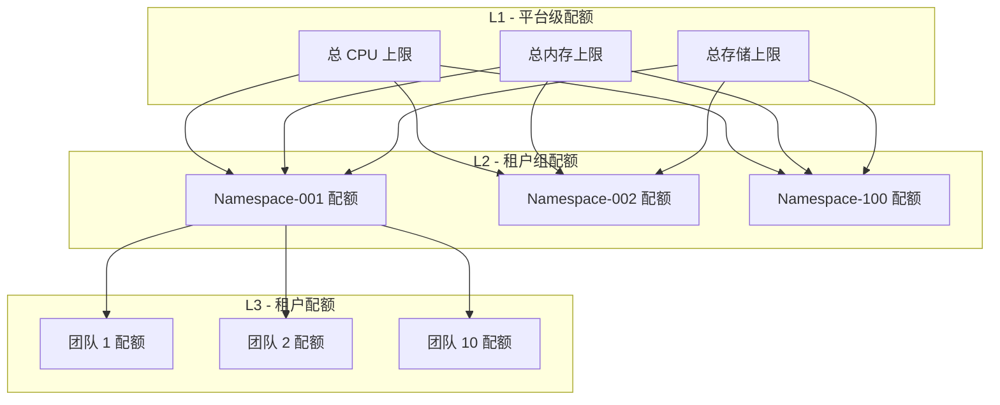

### 8.2 配额类型

| 配额类型 | 软限制 | 硬限制 | 超卖策略 |
|----------|--------|--------|----------|
| CPU | 可突破 (借用空闲) | 不可突破 | 3:1 超卖 |
| 内存 | 不可突破 | 不可突破 | 1:1 独享 |
| 存储 | - | 不可突破 | 无超卖 |
| 并发 Runner | 队列等待 | 拒绝新任务 | 无超卖 |

### 8.3 配额管理流程

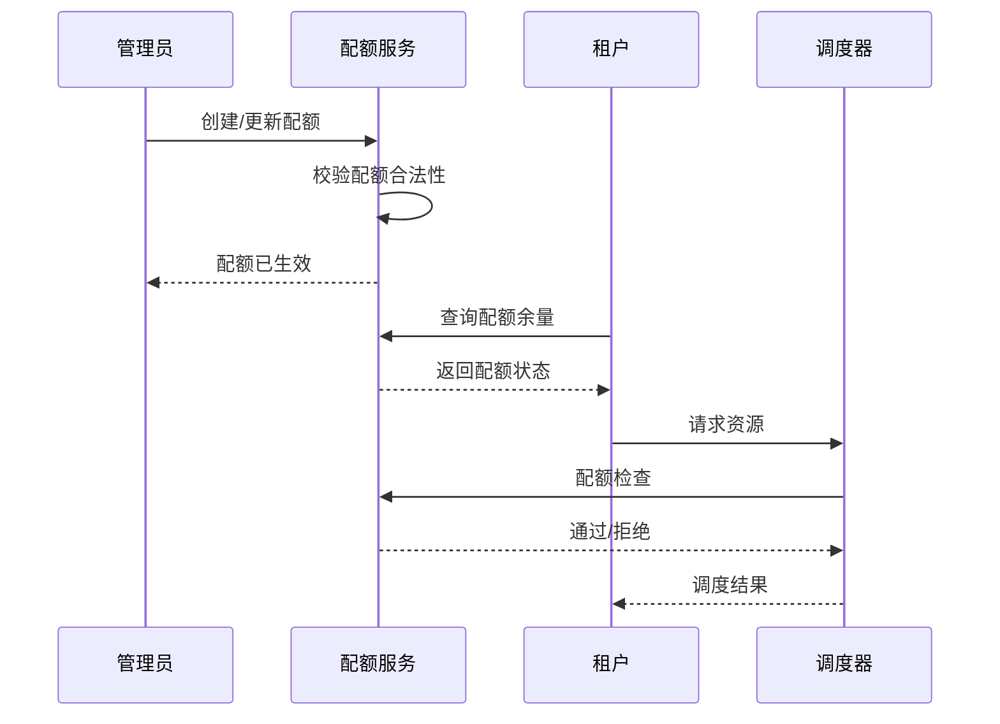

### 8.4 配额预警机制

| 阈值 | 动作 | 通知方式 |
|------|------|----------|
| 70% | 记录日志 | - |
| 85% | 触发预警 | 邮件/Slack |
| 95% | 限制新任务 | 邮件 + 工单 |
| 100% | 拒绝新任务 | 邮件 + 告警 |

---

## 9. 方案对比总结

| 维度 | 原方案 (1000 Namespace) | 新方案 (100 Namespace + RLS) |
|------|------------------------|------------------------------|
| Namespace 数量 | 1000 | 100 |
| 数据库表数量 | 42,000 | 42 |
| etcd 内存 | ~70 MB | ~7 MB |
| API Server QPS | ~100,000 | ~10,510 |
| DDL 变更复杂度 | O(1000) | O(1) |
| 数据隔离强度 | Schema 级 | Row 级 (RLS) |
| 网络隔离 | Namespace | NetworkPolicy + tenant_id |
| 运维复杂度 | 高 | 中 |
| 成本 | 高 (资源碎片化) | 低 (资源共享) |

---

## 10. 实施建议

### 10.1 分阶段落地

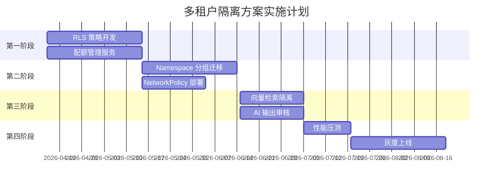

### 10.2 风险控制

| 风险 | 概率 | 影响 | 缓解措施 |
|------|------|------|----------|
| RLS 策略遗漏 | 中 | 高 | 自动化测试 + 代码审查 |
| 租户越权访问 | 低 | 高 | 审计日志 + 定期抽查 |
| 性能不达预期 | 中 | 中 | 前置压测 + 弹性扩容 |
| 配额耗尽 | 高 | 中 | 预警机制 + 自动扩容 |

---

## 附录 A：Mermaid 图表说明

本文档所有 Mermaid 图表均可在以下渲染器中验证：
- [Mermaid Live Editor](https://mermaid.live/)
- VS Code Mermaid 插件
- GitHub/GitLab 原生渲染

图表类型说明：
- `flowchart`：流程图
- `sequenceDiagram`：时序图
- `gantt`：甘特图
