# Orion 架构重构设计：从分层架构到核心域 + 支撑域

**版本**: v1.0  
**创建日期**: 2026-04-10  
**状态**: 待评审  

---

## 一、背景与问题

### 1.1 原分层架构的循环依赖问题

原 5 层分层架构存在严重的循环依赖，导致模块无法独立部署：

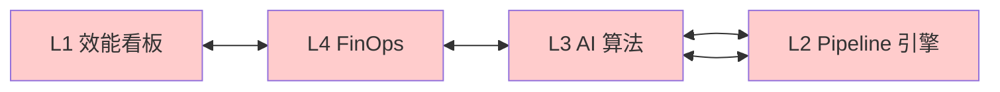

**具体循环依赖链路**:

| 循环链路 | 问题描述 | 导致后果 |
|---------|---------|---------|
| L2 Pipeline 引擎 → L3 AI 算法 → L2 | ai-review Task 注入 Pipeline，AI 服务又依赖 Pipeline 获取上下文 | 无法单独升级 AI 服务 |
| L3 AI 算法 → L4 FinOps → L3 | AI 成本计算依赖 FinOps，FinOps 又调用 AI 做成本预测 | 成本模块无法独立部署 |
| L4 FinOps → L1 效能看板 → L4 | 效能看板展示成本，成本依赖效能数据计算 ROI | 看板发布需协调多个团队 |
| L1 效能看板 → L2 Pipeline 引擎 → L3 → L1 | 看板获取 Pipeline 数据，Pipeline 调用 AI，AI 写效能数据 | 全链路耦合，一损俱损 |

### 1.2 分层架构的根本问题

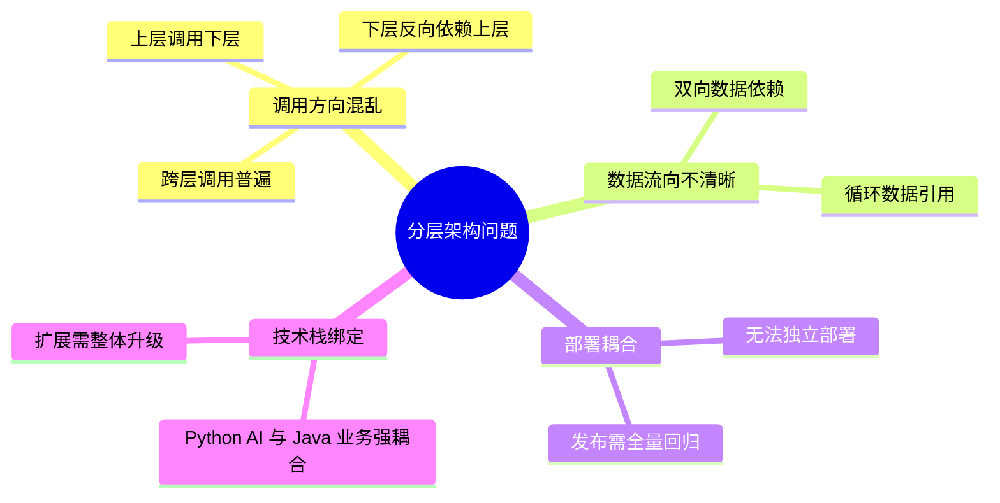

---

## 二、重构目标与原则

### 2.1 重构目标

| 目标 | 描述 | 衡量标准 |
|------|------|---------|
| **消除循环依赖** | 域间调用单向，无环路 | 依赖图无环 |
| **独立部署** | 每个域可独立发布 | 单域部署时间 < 5 分钟 |
| **清晰边界** | 核心域与支撑域职责明确 | 模块归属争议 = 0 |
| **事件驱动解耦** | 用 NATS 事件替代直接调用 | 同步调用减少 70% |
| **技术栈解耦** | 不同域可用不同技术栈 | AI 域独立扩展 GPU |

### 2.2 设计原则

```
┌─────────────────────────────────────────────────────────────────┐
│                    架构重构核心原则                               │
├─────────────────────────────────────────────────────────────────┤
│ 1. 核心域优先：核心业务逻辑不依赖支撑逻辑                         │
│ 2. 单向依赖：依赖方向必须指向核心域                              │
│ 3. 事件解耦：跨域通信优先用事件，而非同步调用                     │
│ 4. 防腐层：外部依赖必须通过防腐层隔离                            │
│ 5. 自治性：每个域有独立的数据存储和业务逻辑                       │
└─────────────────────────────────────────────────────────────────┘
```

---

## 三、核心域与支撑域划分

### 3.1 域定义

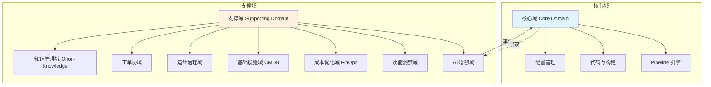

### 3.2 核心域（Core Domain）

**定义**: 直接产生业务价值的域，是 Orion 平台的竞争力所在。

| 模块 | 归属 | 职责 |
|------|------|------|
| Pipeline 引擎 | 核心域 | 流水线编排、Task 调度、Stage 管理 |
| 构建环境 | 核心域 | 容器化构建、Builder 镜像、构建缓存 |
| 多工具链 | 核心域 | Plugin SPI、工具注册、版本管理 |
| 代码管理 | 核心域 | Git 平台集成、Branch Policy、Code Ownership |
| 配置管理 | 核心域 | 多环境配置、GitOps 晋升、配置漂移检测 |

**核心域特征**:
- ✅ 高频迭代（周级发布）
- ✅ 直接面向研发流程
- ✅ 需要强一致性保证
- ✅ 技术栈统一（Java/Spring）

### 3.3 支撑域（Supporting Domain）

**定义**: 为核心域提供能力增强，但不直接参与核心业务流程。

| 模块 | 归属 | 职责 |
|------|------|------|
| AI 增强域 | 支撑域 | AI Code Review、智能测试选择、风险评估、诊断 Agent |
| 效能洞察域 | 支撑域 | DORA 指标、效能看板、自动周报、改进建议 |
| 成本优化域 (FinOps) | 支撑域 | 成本追踪、ROI 计算、预算告警 |
| 基础设施域 (CMDB) | 支撑域 | 服务器/应用/终端管理、关系拓扑、脚本执行 |
| 运维治理域 | 支撑域 | 智能部署、自愈引擎、监控告警、SLO |
| 工单协同域 | 支撑域 | 智能工单、自动排单、SLA 管理 |
| 知识管理域 | 支撑域 | AI 文档、RAG 问答、知识图谱、自动积累 |

**支撑域特征**:
- ✅ 低频迭代（月级发布）
- ✅ 面向分析与决策
- ✅ 可接受最终一致性
- ✅ 技术栈多样（Python AI / Java 业务）

---

## 四、域间调用规则

### 4.1 依赖方向

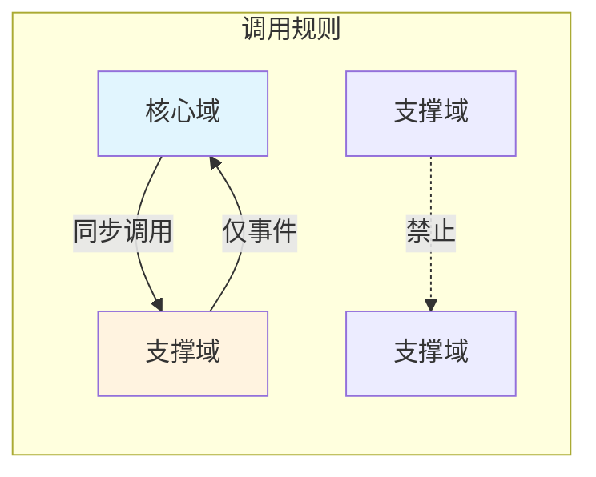

**调用规则矩阵**:

| 调用方 | 被调用方 | 允许 | 方式 | 说明 |
|-------|---------|------|------|------|
| 核心域 | 支撑域 | ✅ | 同步 REST | 核心域需要支撑域能力增强 |
| 核心域 | 支撑域 | ✅ | 异步事件 | 非关键路径解耦 |
| 支撑域 | 核心域 | ❌ | 同步调用 | 禁止！会导致循环依赖 |
| 支撑域 | 核心域 | ✅ | 事件订阅 | 支撑域订阅核心域事件 |
| 支撑域 | 支撑域 | ❌ | 直接调用 | 禁止！支撑域之间应解耦 |
| 支撑域 | 支撑域 | ✅ | 通过核心域中转 | 需要数据时由核心域聚合 |

### 4.2 禁止的调用模式

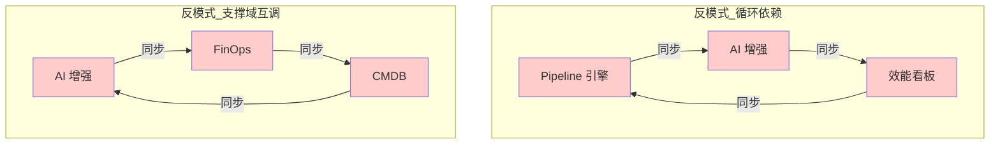

### 4.3 推荐的调用模式

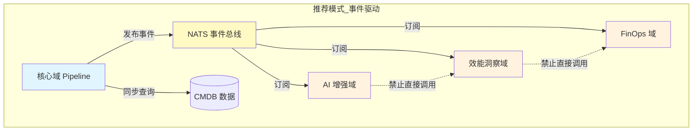

---

## 五、事件驱动解耦方案

### 5.1 NATS 事件总线架构

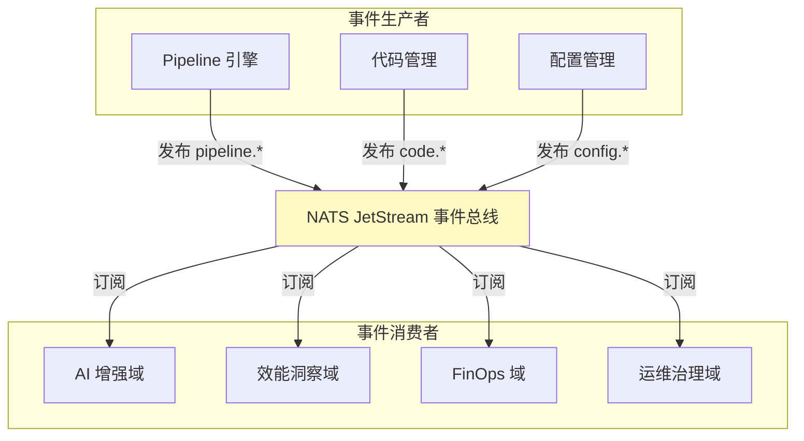

### 5.2 核心事件定义

| 事件主题 | 事件类型 | 生产者 | 消费者 | 载荷示例 |
|---------|---------|--------|--------|---------|
| `pipeline.run.created` | PipelineRun 创建 | Pipeline 引擎 | AI 增强、效能洞察 | `{runId, projectId, triggerType}` |
| `pipeline.run.completed` | PipelineRun 完成 | Pipeline 引擎 | AI 增强、效能洞察、FinOps | `{runId, status, duration, stages}` |
| `pipeline.stage.failed` | Stage 失败 | Pipeline 引擎 | AI 增强（诊断）、运维治理 | `{runId, stageName, error}` |
| `code.pr.opened` | PR 打开 | 代码管理 | AI 增强（AI Review） | `{prId, repo, author, diff}` |
| `code.pr.merged` | PR 合并 | 代码管理 | 效能洞察、配置管理 | `{prId, repo, targetBranch}` |
| `deployment.started` | 部署开始 | 配置管理 | 运维治理、效能洞察 | `{deployId, appId, environment}` |
| `deployment.completed` | 部署完成 | 配置管理 | 效能洞察、FinOps | `{deployId, status, duration}` |
| `incident.detected` | 故障检测 | 运维治理 | 工单协同、效能洞察 | `{incidentId, severity, service}` |

### 5.3 事件 Schema 标准

```yaml
# CloudEvents 标准格式
specversion: "1.0"
id: "pipeline-run-12345"
source: "orion-pipeline-service"
type: "com.orion.pipeline.run.completed"
subject: "pipeline/my-project-main"
time: "2026-04-10T10:00:00Z"
datacontenttype: "application/json"
data:
  runId: "12345"
  pipelineId: "67890"
  projectId: "proj-001"
  status: "success"
  duration: 480  # 秒
  stages:
    - name: "Scan"
      status: "success"
    - name: "Build"
      status: "success"
    - name: "Test"
      status: "success"
```

### 5.4 事件替代同步调用的场景

**场景 1: Pipeline 完成后触发 AI 分析**

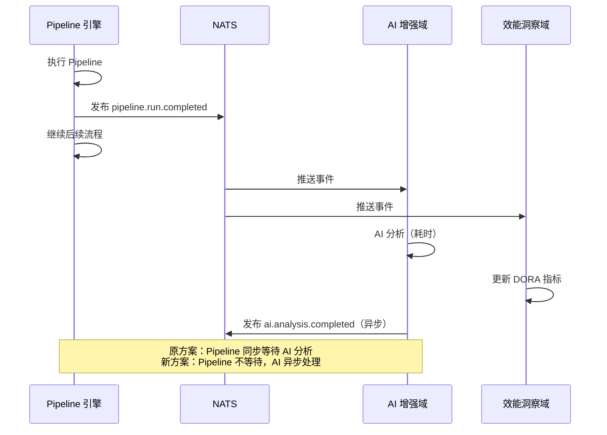

**场景 2: PR 打开触发 AI Code Review**

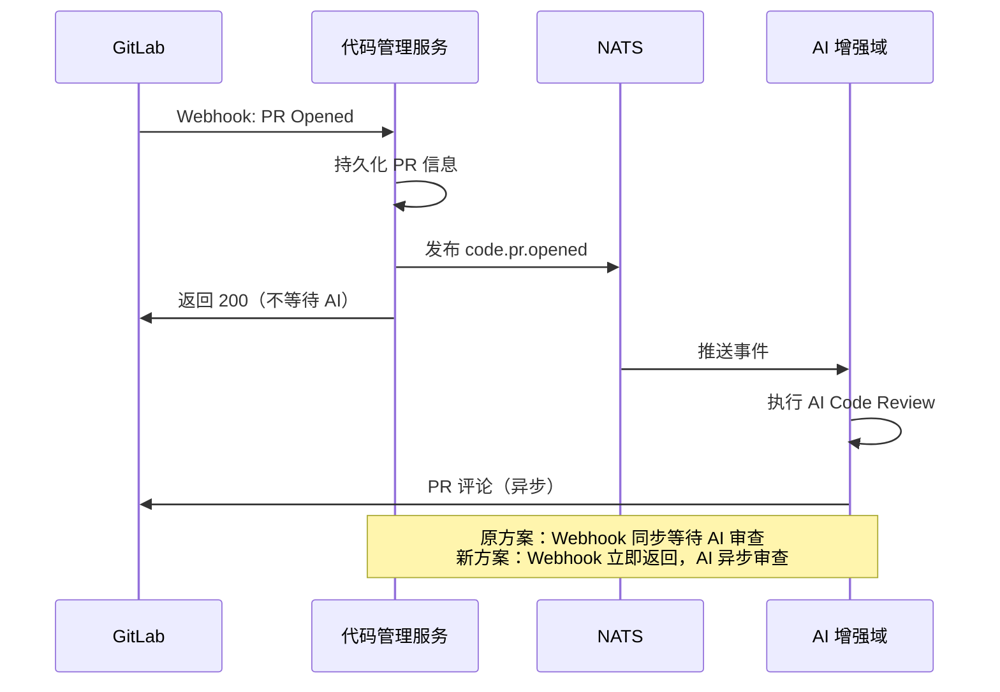

### 5.5 事件可靠性保障

| 机制 | 说明 | 配置 |
|------|------|------|
| 持久化 | JetStream 持久化存储 | `Storage: file` |
| 确认机制 | 消费者 ACK 确认 | `AckPolicy: explicit` |
| 重试策略 | 失败自动重试 | `MaxDeliver: 5` |
| 死信队列 | 多次失败后转入死信 | `DeadLetter: orion.dlq` |
| 顺序保证 | 同主题消息有序 | `Replicas: 3` |

---

## 六、模块归属详解

### 6.1 完整模块归属表

| 原模块 | 新归属域 | 变更说明 |
|-------|---------|---------|
| Pipeline 引擎 | 核心域 | 保持不变，核心职责 |
| 构建环境 | 核心域 | 保持不变 |
| 多工具链 | 核心域 | 保持不变 |
| 代码管理 | 核心域 | 保持不变 |
| 配置管理 | 核心域 | 保持不变 |
| AI Code Review | AI 增强域 | 从 L3 移至支撑域 |
| 智能测试选择 | AI 增强域 | 从 L3 移至支撑域 |
| 风险评估 (Aegis) | AI 增强域 | 从 L3 移至支撑域 |
| 诊断 Agent | AI 增强域 | 从 L3 移至支撑域 |
| 效能看板 | 效能洞察域 | 从 L1 移至支撑域 |
| DORA 指标 | 效能洞察域 | 从 L1 移至支撑域 |
| FinOps | 成本优化域 | 从 L4 移至支撑域 |
| CMDB | 基础设施域 | 保持支撑域定位 |
| 智能部署 | 运维治理域 | 从 L4 移至支撑域 |
| 自愈引擎 (Kintsugi) | 运维治理域 | 从 L4 移至支撑域 |
| 智能工单 | 工单协同域 | 新划分 |

### 6.2 模块职责边界

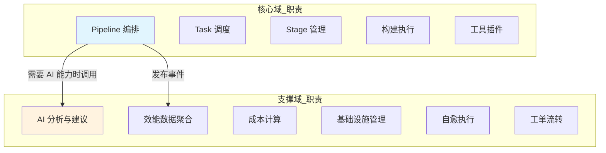

---

## 七、重构前后对比

### 7.1 依赖图对比

**重构前（循环依赖）**:

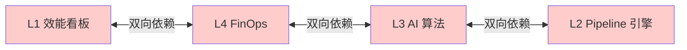

**重构后（单向依赖）**:

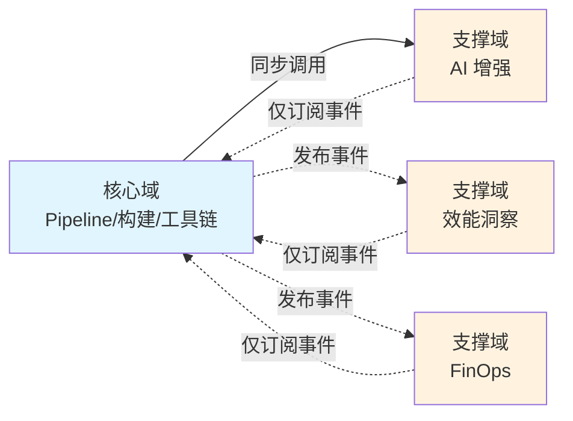

### 7.2 部署独立性对比

| 维度 | 重构前 | 重构后 |
|------|--------|--------|
| Pipeline 单独发布 | ❌ 需等 AI 服务回归 | ✅ 独立发布 |
| AI 服务单独发布 | ❌ 需等 Pipeline 回归 | ✅ 独立发布 |
| 效能看板单独发布 | ❌ 需等 FinOps 回归 | ✅ 独立发布 |
| CMDB 单独发布 | ❌ 需等多处回归 | ✅ 独立发布 |
| 平均部署时间 | 25 分钟（全量） | 5 分钟（单域） |

### 7.3 技术栈解耦

| 域 | 技术栈 | 扩展方式 |
|---|--------|---------|
| 核心域 | Java + Spring Boot | 水平扩展副本数 |
| AI 增强域 | Python + FastAPI | 独立扩展 GPU |
| 效能洞察域 | Java + Spring Boot | 水平扩展 + ES |
| 成本优化域 | Java + Spring Boot | 水平扩展 |
| 基础设施域 | Java + Spring Boot | 水平扩展 + Neo4j |
| 运维治理域 | Python + Java | 按组件扩展 |
| 工单协同域 | Java + Spring Boot | 水平扩展 |
| 知识管理域 | Go + Next.js | 独立部署，可插拔 |

---

## 八、独立部署可行性

### 8.1 部署依赖层级

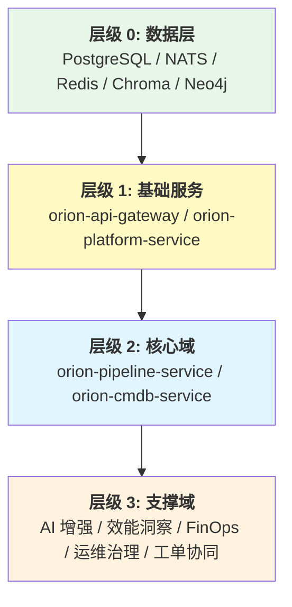

### 8.2 最小可行部署（MVP）

| 部署范围 | 包含服务 | 功能 | 部署时间 |
|---------|---------|------|---------|
| **最小部署** | gateway + platform | 登录 + 权限 + 基础配置 | 5 分钟 |
| **核心域部署** | 最小部署 + pipeline + cmdb | 完整 CI/CD + CMDB | 10 分钟 |
| **单支撑域部署** | 核心域部署 + AI 增强 | + AI Code Review | 12 分钟 |
| **全量部署** | 所有服务 | 完整平台 | 25 分钟 |

### 8.3 增量部署场景

**场景：仅升级 AI 增强域**

```bash
# 原方案：需全量回归，25 分钟
# 新方案：只部署 AI 服务，5 分钟

$ kubectl rollout restart deployment/orion-ai-service -n orion
$ kubectl rollout status deployment/orion-ai-service -n orion --timeout=5m

# 影响范围:
# - 不影响 Pipeline 引擎运行
# - 不影响效能数据记录
# - 仅 AI 功能短暂不可用（滚动更新）
```

### 8.4 部署独立性验证清单

| 验证项 | 验证方法 | 通过标准 |
|-------|---------|---------|
| AI 服务独立部署 | 只重启 ai-service | Pipeline 正常运行 |
| 效能服务独立部署 | 只重启 insight-service | 流水线数据正常记录 |
| FinOps 独立部署 | 只重启 platform-service 成本模块 | 成本计算短暂中断后恢复 |
| CMDB 独立部署 | 只重启 cmdb-service | Pipeline 使用缓存继续 |
| 网关注册验证 | 服务重启后自动注册到 gateway | /healthz 返回 200 |

---

## 九、迁移方案

### 9.1 迁移阶段

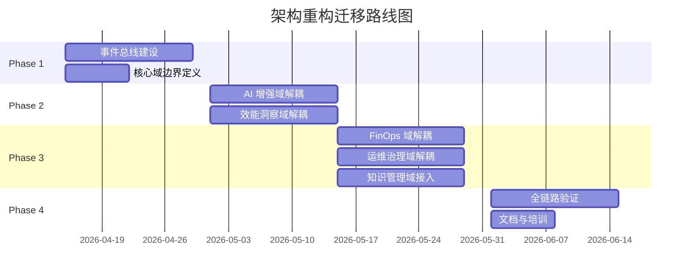

### 9.2 迁移步骤

**Phase 1: 基础建设（2026-04-15 ~ 2026-04-28）**

1. 完成 NATS JetStream 部署
2. 定义核心事件 Schema
3. 实现事件发布/订阅 SDK
4. 核心域与支撑域边界评审

**Phase 2: AI 与效能解耦（2026-05-01 ~ 2026-05-14）**

1. AI Code Review 改为事件驱动
2. 效能数据改为事件聚合
3. 移除 L1→L4→L3→L2 循环调用

**Phase 3: FinOps 与运维解耦（2026-05-15 ~ 2026-05-28）**

1. FinOps 成本计算改为事件订阅
2. 自愈引擎与 Pipeline 解耦
3. 移除支撑域间直接调用

**Phase 4: 验证与收尾（2026-06-01 ~ 2026-06-14）**

1. 依赖图扫描验证无环
2. 单域独立部署演练
3. 性能回归测试
4. 文档更新与团队培训

---

## 十、风险与应对

| 风险 | 影响 | 概率 | 应对措施 |
|------|------|------|---------|
| 事件丢失 | 效能数据不完整 | 低 | JetStream 持久化 + ACK |
| 事件延迟 | 支撑域数据滞后 | 中 | 接受最终一致性，SLA<5s |
| 循环依赖残留 | 无法独立部署 | 中 | 依赖图自动扫描 + 人工评审 |
| 同步改异步兼容性 | 旧客户端超时 | 低 | 双写过渡，逐步切换 |
| 团队适应成本 | 开发习惯改变 | 中 | 培训 + 示例代码 + 检查清单 |

---

## 十一、总结

### 11.1 重构收益

| 指标 | 重构前 | 重构后 | 提升 |
|------|--------|--------|------|
| 循环依赖 | 4 处 | 0 处 | ✅ 消除 |
| 单域部署时间 | 25 分钟 | 5 分钟 | ⬆️ 80% |
| 发布频率 | 月级 | 周级 | ⬆️ 4x |
| 团队并行 | 串行 | 并行 | ⬆️ 7 团队 |

### 11.2 核心变更

1. **架构模式**: 分层架构 → 核心域 + 支撑域
2. **通信方式**: 同步调用 → 事件驱动
3. **依赖方向**: 双向循环 → 单向依赖
4. **部署方式**: 全量部署 → 单域独立部署

### 11.3 下一步行动

- [ ] 召开架构评审会（2026-04-12）
- [ ] 完成事件总线 POC（2026-04-20）
- [ ] 启动 Phase 1 迁移（2026-04-25）

---

_文档版本：v1.0 | 创建日期：2026-04-10 | 状态：待评审_
