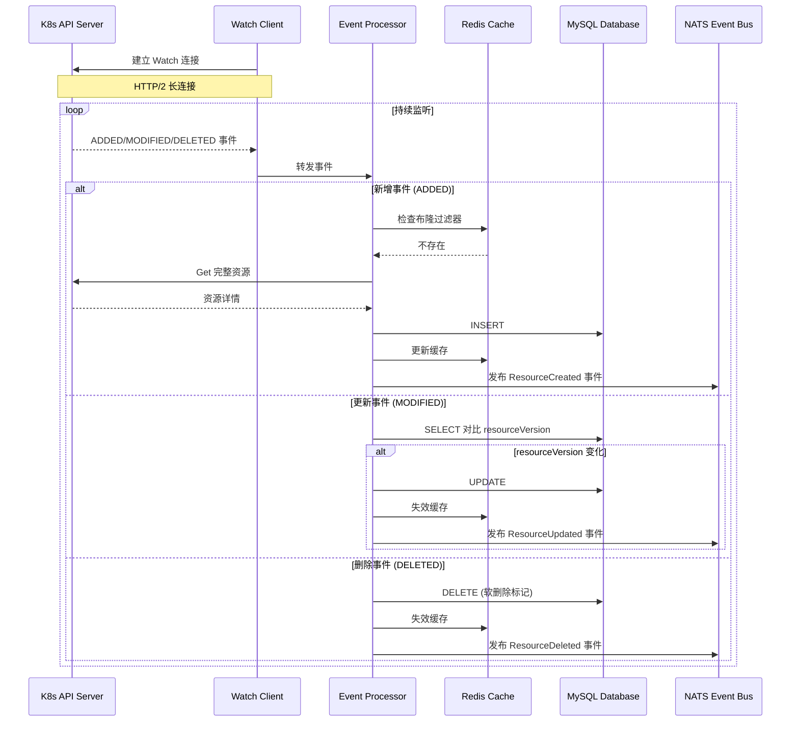
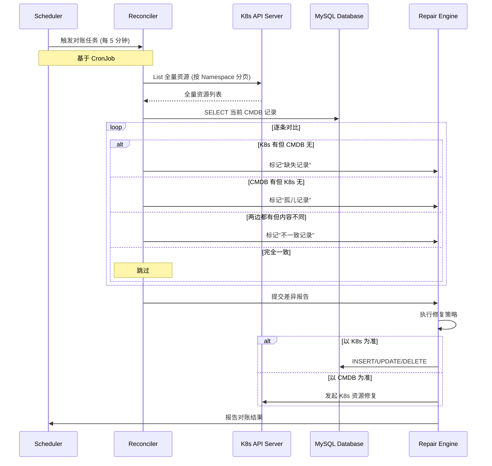
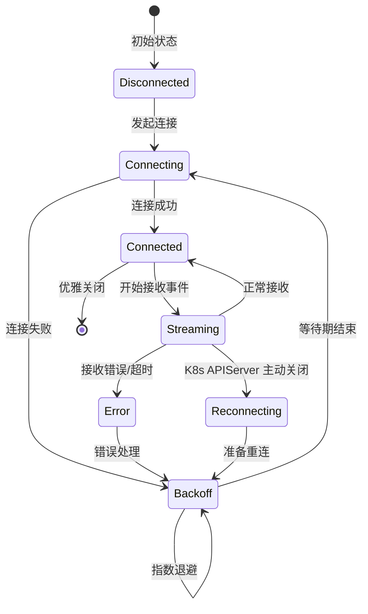
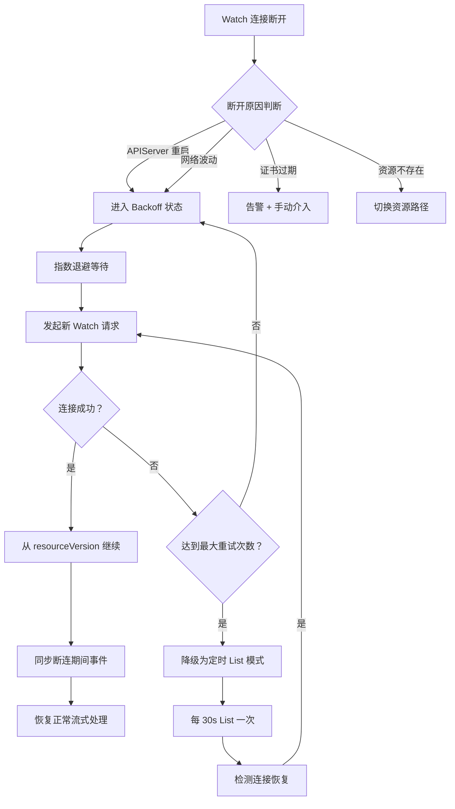
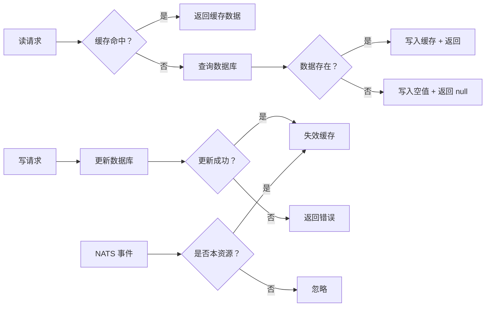
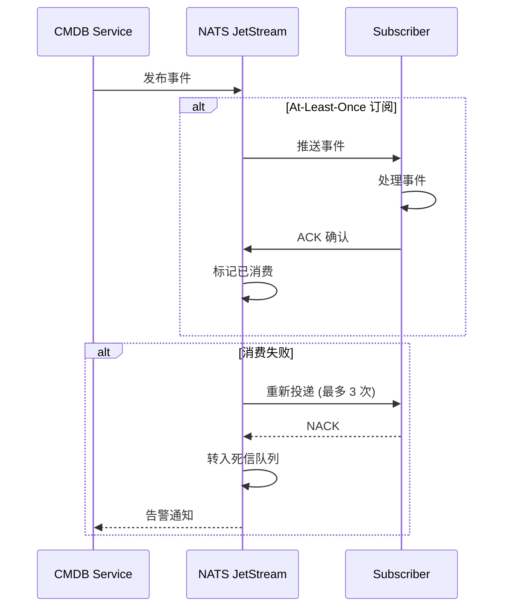
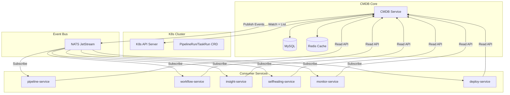

# CMDB 集成接口设计

> 版本：v1.0  
> 日期：2026-04-10  
> 状态：设计稿

---

## 一、设计目标

本文档定义 Orion 平台 CMDB 与 26 个模块的集成方案，包括：

- **CMDB Read API 设计规范**：统一查询接口，降低模块间耦合
- **26 模块调用关系矩阵**：明确各模块与 CMDB 的交互边界
- **K8s 资源同步机制**：Watch + 定时对账双保障
- **缓存与事件通知**：降低数据库压力，实现变更解耦

---

## 二、CMDB Read API 设计

### 2.1 API 分层架构

```
┌─────────────────────────────────────────────────────────┐
│                   API Gateway Layer                      │
│              (统一鉴权、限流、审计日志)                    │
├─────────────────────────────────────────────────────────┤
│                   Read API Service                       │
│  ┌─────────────┬─────────────┬─────────────────────┐    │
│  │ Host API    │ K8s API     │ Relation API        │    │
│  │ 主机查询    │ 资源查询    │ 拓扑关系查询        │    │
│  └─────────────┴─────────────┴─────────────────────┘    │
├─────────────────────────────────────────────────────────┤
│                   Cache Layer (Redis)                    │
│         (热点数据缓存、分布式锁、布隆过滤器)               │
├─────────────────────────────────────────────────────────┤
│                   Data Access Layer                      │
│    ┌──────────┐  ┌──────────┐  ┌──────────────────┐    │
│    │  MySQL   │  │ClickHouse│  │  K8s API Server  │    │
│    └──────────┘  └──────────┘  └──────────────────┘    │
└─────────────────────────────────────────────────────────┘
```

### 2.2 核心 API 清单

#### 2.2.1 主机资源 API

| 接口路径 | 方法 | 功能 | 调用方 |
|---------|------|------|--------|
| `/api/cmdb/v1/hosts` | GET | 分页查询主机列表 | 所有模块 |
| `/api/cmdb/v1/hosts/{id}` | GET | 查询主机详情 | 所有模块 |
| `/api/cmdb/v1/hosts/{id}/relations` | GET | 查询主机关联关系 | insight, selfhealing |
| `/api/cmdb/v1/hosts/batch` | POST | 批量查询主机（按 ID 列表） | pipeline, workflow |
| `/api/cmdb/v1/hosts/search` | POST | 高级搜索（标签/分组/状态） | 所有模块 |

#### 2.2.2 K8s 资源 API

| 接口路径 | 方法 | 功能 | 调用方 |
|---------|------|------|--------|
| `/api/cmdb/v1/k8s/namespaces` | GET | 查询 Namespace 列表 | pipeline, workflow |
| `/api/cmdb/v1/k8s/pods` | GET | 查询 Pod 列表（含筛选） | pipeline, insight |
| `/api/cmdb/v1/k8s/deployments` | GET | 查询 Deployment 列表 | pipeline, workflow |
| `/api/cmdb/v1/k8s/services` | GET | 查询 Service 列表 | workflow, insight |
| `/api/cmdb/v1/k8s/resources/{kind}/{name}` | GET | 查询指定资源详情 | 所有模块 |
| `/api/cmdb/v1/k8s/resources/by-label` | POST | 按 Label 查询资源 | selfhealing |

#### 2.2.3 CI/CD 资源 API

| 接口路径 | 方法 | 功能 | 调用方 |
|---------|------|------|--------|
| `/api/cmdb/v1/cicd/pipelineruns` | GET | 查询 PipelineRun 列表 | pipeline, insight |
| `/api/cmdb/v1/cicd/taskruns` | GET | 查询 TaskRun 列表 | pipeline |
| `/api/cmdb/v1/cicd/pipelineruns/{id}` | GET | 查询 PipelineRun 详情 | workflow, insight |

#### 2.2.4 拓扑关系 API

| 接口路径 | 方法 | 功能 | 调用方 |
|---------|------|------|--------|
| `/api/cmdb/v1/topology/hosts` | GET | 获取主机拓扑图 | workflow, insight |
| `/api/cmdb/v1/topology/services` | GET | 获取服务调用链 | workflow, selfhealing |
| `/api/cmdb/v1/topology/dependencies` | GET | 获取资源依赖关系 | selfhealing, workflow |
| `/api/cmdb/v1/topology/impact-analysis` | POST | 影响分析（故障传播路径） | selfhealing |

### 2.3 API 统一响应格式

```json
{
  "code": 200,
  "message": "success",
  "data": {
    "items": [],
    "total": 0,
    "page": 1,
    "pageSize": 20
  },
  "traceId": "abc123xyz"
}
```

### 2.4 缓存策略

| 数据类型 | 缓存键 | TTL | 更新策略 |
|---------|--------|-----|---------|
| 主机详情 | `cmdb:host:{id}` | 5 分钟 | 被动失效 + 事件主动失效 |
| K8s 资源列表 | `cmdb:k8s:{kind}:{ns}` | 1 分钟 | Watch 事件主动失效 |
| 拓扑关系 | `cmdb:topo:{type}:{key}` | 10 分钟 | 定时刷新 + 事件失效 |
| 批量查询结果 | `cmdb:batch:{hash}` | 30 秒 | 无主动失效 |

---

## 三、26 模块与 CMDB 调用关系矩阵

### 3.1 模块分类

| 分类 | 模块列表 |
|------|---------|
| **核心编排** | pipeline-service, workflow-service, scheduler-service |
| **可观测性** | insight-service, monitor-service, log-service, trace-service |
| **稳定性** | selfhealing-service, alert-service, dr-service |
| **安全合规** | security-service, audit-service, compliance-service |
| **资源管理** | quota-service, cost-service, capacity-service |
| **交付部署** | deploy-service, release-service, rollback-service |
| **AI 工程** | llmops-service, feature-store-service, vector-db-service |
| **基础设施** | network-service, storage-service, compute-service |

### 3.2 完整调用矩阵

| 模块编号 | 模块名称 | 调用 CMDB API | 调用频率 | 数据敏感度 | 缓存需求 |
|---------|---------|-------------|---------|-----------|---------|
| 01 | **orion-pipeline-service** | Pod, Deployment, PipelineRun, TaskRun | 高 | 中 | 高 |
| 02 | **orion-workflow-service** | Host, Service, Topology, Dependencies | 中 | 中 | 中 |
| 03 | **orion-insight-service** | Host, Pod, Service, PipelineRun | 高 | 低 | 高 |
| 04 | **orion-selfhealing-service** | Host Relations, Dependencies, Impact-Analysis | 中 | 高 | 中 |
| 05 | **orion-scheduler-service** | Host, Pod (调度目标查询) | 中 | 低 | 低 |
| 06 | **orion-monitor-service** | Host, Pod (指标采集目标) | 高 | 低 | 中 |
| 07 | **orion-log-service** | Pod, Container (日志源查询) | 高 | 低 | 中 |
| 08 | **orion-trace-service** | Service, Pod (链路拓扑) | 高 | 低 | 中 |
| 09 | **orion-alert-service** | Host, Service (告警对象) | 中 | 低 | 中 |
| 10 | **orion-dr-service** | Host, Dependencies (容灾切换) | 低 | 高 | 低 |
| 11 | **orion-security-service** | Host, Pod (安全扫描目标) | 中 | 高 | 低 |
| 12 | **orion-audit-service** | All (审计日志关联) | 中 | 高 | 低 |
| 13 | **orion-compliance-service** | Host, K8s (合规检查) | 低 | 中 | 低 |
| 14 | **orion-quota-service** | Host, Pod, Namespace (配额核算) | 中 | 中 | 中 |
| 15 | **orion-cost-service** | Host, Pod, GPU (成本采集) | 中 | 中 | 中 |
| 16 | **orion-capacity-service** | Host, Pod (容量规划) | 低 | 中 | 低 |
| 17 | **orion-deploy-service** | K8s Resources, Host (部署目标) | 高 | 中 | 高 |
| 18 | **orion-release-service** | Deployment, Service (发布查询) | 中 | 中 | 中 |
| 19 | **orion-rollback-service** | Deployment, PipelineRun (回滚参考) | 低 | 中 | 低 |
| 20 | **orion-llmops-service** | GPU, VectorDB (AI 资源查询) | 中 | 中 | 中 |
| 21 | **orion-feature-store-service** | Host, Pod (特征计算资源) | 中 | 中 | 中 |
| 22 | **orion-vector-db-service** | Host, Pod (向量库实例) | 中 | 中 | 中 |
| 23 | **orion-network-service** | Host, Service (网络配置) | 中 | 高 | 中 |
| 24 | **orion-storage-service** | Host, PVC (存储挂载) | 中 | 中 | 中 |
| 25 | **orion-compute-service** | Host, Pod (计算资源池) | 高 | 中 | 高 |
| 26 | **orion-gateway-service** | Service, Pod (路由目标) | 高 | 中 | 高 |

### 3.3 高频调用模块 Top 5

| 排名 | 模块 | 日均调用量估算 | 主要用途 |
|------|------|--------------|---------|
| 1 | insight-service | 100 万+ | 效能看板数据展示 |
| 2 | pipeline-service | 50 万+ | 流水线资源查询 |
| 3 | deploy-service | 30 万+ | 部署目标查询 |
| 4 | monitor-service | 20 万+ | 监控指标采集 |
| 5 | compute-service | 20 万+ | 计算资源调度 |

---

## 四、K8s 资源同步机制

### 4.1 双机制架构

```
┌─────────────────────────────────────────────────────────────┐
│                    K8s API Server                            │
└───────────────────────┬─────────────────────────────────────┘
                        │
         ┌──────────────┴──────────────┐
         │                             │
         ▼                             ▼
┌─────────────────┐           ┌─────────────────┐
│   Watch 机制    │           │  定时对账机制   │
│  (实时增量同步)  │           │  (全量一致性)   │
└────────┬────────┘           └────────┬────────┘
         │                             │
         │  ADDED/MODIFIED/DELETED     │  全量列表对比
         │  事件流                     │  差异检测
         ▼                             ▼
┌─────────────────────────────────────────────────────────────┐
│                    CMDB Sync Service                         │
│  ┌────────────────┐  ┌────────────────┐  ┌────────────────┐ │
│  │ Event Processor│  │ Reconciler     │  │ Conflict       │ │
│  │ (事件处理器)   │  │ (对账器)       │  │ Resolver       │ │
│  └────────────────┘  └────────────────┘  └────────────────┘ │
└─────────────────────────────────────────────────────────────┘
         │                             │
         └──────────────┬──────────────┘
                        ▼
┌─────────────────────────────────────────────────────────────┐
│              CMDB Database (MySQL + Redis Cache)            │
└─────────────────────────────────────────────────────────────┘
```

### 4.2 Watch 机制流程



### 4.3 定时对账流程



---

## 五、Watch 断连重连策略

### 5.1 重连状态机



### 5.2 重连策略配置

| 参数 | 初始值 | 最大值 | 说明 |
|------|--------|--------|------|
| 初始重试间隔 | 1s | - | 首次失败后等待时间 |
| 最大重试间隔 | 60s | - | 指数退避上限 |
| 退避倍数 | 2x | - | 每次失败后间隔翻倍 |
| 连续成功重置 | 3 次 | - | 连续 3 次成功后重置退避计数器 |
| 资源列表刷新 | 30s | - | 断连期间定期 List 保活 |

### 5.3 断连恢复流程



### 5.4 降级策略

| 等级 | 触发条件 | 行为 | 数据一致性 |
|------|---------|------|-----------|
| L0 - 正常 | Watch 连接正常 | 流式处理事件 | 实时一致 |
| L1 - 抖动 | 偶尔断连 (<3 次/分钟) | 快速重连 + 补事件 | 近实时 |
| L2 - 波动 | 频繁断连 (>3 次/分钟) | 延长退避 + 启用 List 兜底 | 秒级延迟 |
| L3 - 故障 | 持续不可用 (>5 分钟) | 切换定时 List 模式 + 告警 | 分钟级延迟 |

---

## 六、对账不一致修复策略

### 6.1 数据源权威原则 (Source of Truth)

| 数据类型 | 权威数据源 | 修复方向 | 说明 |
|---------|----------|---------|------|
| **K8s 原生资源** (Pod/Deployment/Service 等) | K8s API Server | K8s → CMDB | K8s 是唯一真实状态 |
| **CMDB 扩展属性** (业务标签/成本中心/负责人) | CMDB | CMDB → 外部 | 仅 CMDB 存储的业务属性 |
| **混合资源** (PipelineRun/TaskRun 等 CRD) | K8s API Server | K8s → CMDB | CRD 状态以 K8s 为准 |
| **主机资源** (物理机/虚拟机) | CMDB | CMDB → 外部 | CMDB 是权威来源 |

### 6.2 不一致场景处理

```mermaid
flowchart TD
    A[对账发现不一致] --> B{不一致类型}
    
    B -->|场景 1: K8s 有/CMDB 无 | C[CMDB 缺失]
    B -->|场景 2: CMDB 有/K8s 无 | D[CMDB 孤儿]
    B -->|场景 3: 内容不一致 | E[属性差异]
    
    C --> C1{是否 K8s 原生资源？}
    C1 -->|是 | C2[CMDB 执行 INSERT]
    C1 -->|否 | C3[告警 + 人工确认]
    
    D --> D1{是否超过宽限期？}
    D1 -->|是 (>5 分钟) | D2[CMDB 标记已删除]
    D1 -->|否 | D3[等待最终一致性]
    
    E --> E1{差异字段类型}
    E1 -->|状态字段 | E2[以 K8s 为准 UPDATE]
    E1 -->|业务标签 | E3[保留 CMDB 值]
    E1 -->|元数据 | E4[以 K8s 为准 UPDATE]
```

### 6.3 修复执行流程

| 步骤 | 操作 | 可回滚 | 说明 |
|------|------|--------|------|
| 1 | 记录差异快照 | 是 | 保存修复前状态 |
| 2 | 获取分布式锁 | 是 | 防止并发修复 |
| 3 | 执行修复操作 | 部分 | INSERT/UPDATE 可回滚 |
| 4 | 验证修复结果 | 是 | 再次对账确认 |
| 5 | 发布修复事件 | 否 | 通知相关模块 |
| 6 | 释放锁 + 清理快照 | 否 | 修复完成 |

---

## 七、缓存层设计

### 7.1 缓存架构

```
┌─────────────────────────────────────────────────────────────┐
│                      Client Layer                            │
│    (Pipeline/Workflow/Insight/Selfhealing Services)         │
└─────────────────────────┬───────────────────────────────────┘
                          │
                          ▼
┌─────────────────────────────────────────────────────────────┐
│                   API Gateway + Cache Proxy                  │
│  ┌─────────────────┐  ┌─────────────────┐                  │
│  │ Cache Aside     │  │ Write-Through   │                  │
│  │ (读缓存)        │  │ (写缓存)        │                  │
│  └─────────────────┘  └─────────────────┘                  │
└─────────────────────────┬───────────────────────────────────┘
                          │
          ┌───────────────┼───────────────┐
          ▼               ▼               ▼
┌─────────────────┐ ┌─────────────┐ ┌─────────────────┐
│   Redis Cluster │ │  Bloom Filter│ │  Distributed Lock│
│   (数据缓存)    │ │  (防穿透)    │ │  (防并发)       │
└─────────────────┘ └─────────────┘ └─────────────────┘
          │
          ▼
┌─────────────────────────────────────────────────────────────┐
│                    MySQL Database                            │
└─────────────────────────────────────────────────────────────┘
```

### 7.2 缓存键设计规范

| 场景 | 键格式 | 示例 | TTL |
|------|--------|------|-----|
| 主机详情 | `cmdb:host:{id}` | `cmdb:host:host-001` | 5m |
| 主机列表 | `cmdb:hosts:{queryHash}` | `cmdb:hosts:a1b2c3` | 1m |
| K8s 资源 | `cmdb:k8s:{kind}:{ns}:{name}` | `cmdb:k8s:pod:default:nginx-xxx` | 2m |
| K8s 列表 | `cmdb:k8s:list:{kind}:{ns}` | `cmdb:k8s:list:pods:default` | 1m |
| 拓扑关系 | `cmdb:topo:{type}:{rootId}` | `cmdb:topo:service:svc-001` | 10m |
| 批量查询 | `cmdb:batch:{md5Hash}` | `cmdb:batch:5d41402abc4b2a76b9719d911017c592` | 30s |

### 7.3 缓存更新策略



### 7.4 缓存容量估算

| 数据类型 | 单条大小 | 预计数量 | 总容量 | 建议分配 |
|---------|---------|---------|--------|---------|
| 主机缓存 | 2KB | 10,000 | 20MB | 100MB |
| K8s 资源缓存 | 1KB | 100,000 | 100MB | 500MB |
| 拓扑缓存 | 10KB | 5,000 | 50MB | 200MB |
| 查询结果缓存 | 5KB | 20,000 | 100MB | 500MB |
| **合计** | - | - | **270MB** | **1.3GB** |

---

## 八、事件通知机制

### 8.1 NATS 事件架构

```
┌─────────────────────────────────────────────────────────────┐
│                    CMDB Change Events                        │
└───────────────────────┬─────────────────────────────────────┘
                        │
                        ▼
┌─────────────────────────────────────────────────────────────┐
│                      NATS JetStream                          │
│  ┌─────────────┐  ┌─────────────┐  ┌─────────────┐         │
│  │ cmdb.host.* │  │ cmdb.k8s.*  │  │ cmdb.topo.* │         │
│  │ (主机事件)  │  │ (K8s 事件)   │  │ (拓扑事件)  │         │
│  └─────────────┘  └─────────────┘  └─────────────┘         │
└─────────────────────────────────────────────────────────────┘
                        │
        ┌───────────────┼───────────────┐
        ▼               ▼               ▼
┌──────────────┐ ┌──────────────┐ ┌──────────────┐
│ Insight      │ │ Selfhealing  │ │ Monitor      │
│ (看板更新)   │ │ (自愈触发)   │ │ (监控刷新)   │
└──────────────┘ └──────────────┘ └──────────────┘
```

### 8.2 事件类型定义

| 事件主题 | 事件类型 | 触发条件 | 订阅模块 |
|---------|---------|---------|---------|
| `cmdb.host.created` | 主机创建 | 新主机入库 | insight, monitor, quota |
| `cmdb.host.updated` | 主机更新 | 主机属性变更 | insight, selfhealing |
| `cmdb.host.deleted` | 主机删除 | 主机下线 | insight, quota, cost |
| `cmdb.k8s.pod.created` | Pod 创建 | 新 Pod 调度 | pipeline, monitor, log |
| `cmdb.k8s.pod.updated` | Pod 更新 | Pod 状态变更 | pipeline, selfhealing |
| `cmdb.k8s.pod.deleted` | Pod 删除 | Pod 终止 | pipeline, monitor |
| `cmdb.k8s.deployment.*` | Deployment 变更 | 发布/扩缩容 | workflow, insight |
| `cmdb.topo.changed` | 拓扑变更 | 依赖关系变化 | selfhealing, workflow |

### 8.3 事件格式规范

```json
{
  "header": {
    "eventId": "evt-20260410-001",
    "eventType": "cmdb.host.updated",
    "timestamp": "2026-04-10T10:30:00Z",
    "source": "cmdb-service",
    "version": "1.0"
  },
  "data": {
    "resourceType": "host",
    "resourceId": "host-001",
    "changeType": "updated",
    "changedFields": ["status", "labels"],
    "before": {
      "status": "running",
      "labels": {"env": "prod"}
    },
    "after": {
      "status": "stopped",
      "labels": {"env": "prod", "reason": "maintenance"}
    }
  },
  "metadata": {
    "traceId": "trace-abc123",
    "operator": "system-sync"
  }
}
```

### 8.4 事件消费流程



### 8.5 事件可靠性保障

| 机制 | 配置 | 说明 |
|------|------|------|
| 持久化 | JetStream File Storage | 事件落盘，防止丢失 |
| 重试 | 最大 3 次，间隔 1s/5s/30s | 临时失败自动恢复 |
| 死信队列 | `cmdb.dlx.*` | 无法消费事件隔离 |
| 顺序保证 | Subject 内有序 | 同一资源事件顺序消费 |
| 回溯消费 | 保留 7 天 | 支持新订阅者回补历史 |

---

## 九、集成架构总览



---

## 十、附录

### 10.1 术语表

| 术语 | 说明 |
|------|------|
| CMDB | Configuration Management Database，配置管理数据库 |
| Watch | K8s 提供的资源变更流式监听机制 |
| resourceVersion | K8s 资源版本号，用于乐观锁和增量同步 |
| JetStream | NATS 的持久化消息流存储 |
| Source of Truth | 权威数据源，指数据的唯一真实来源 |

### 10.2 参考文档

- [Kubernetes Watch API](https://kubernetes.io/docs/reference/using-api/api-concepts/#watch-requests)
- [NATS JetStream Documentation](https://docs.nats.io/nats-concepts/jetstream)
- [Cache-Aside Pattern](https://learn.microsoft.com/en-us/azure/architecture/patterns/cache-aside)

---

_文档版本：v1.0_  
_创建日期：2026-04-10_  
_最后更新：2026-04-10_
