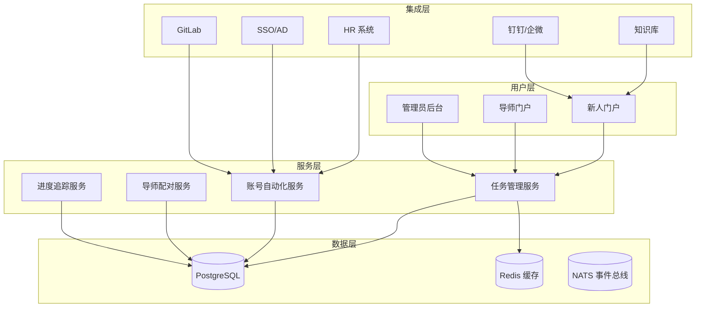
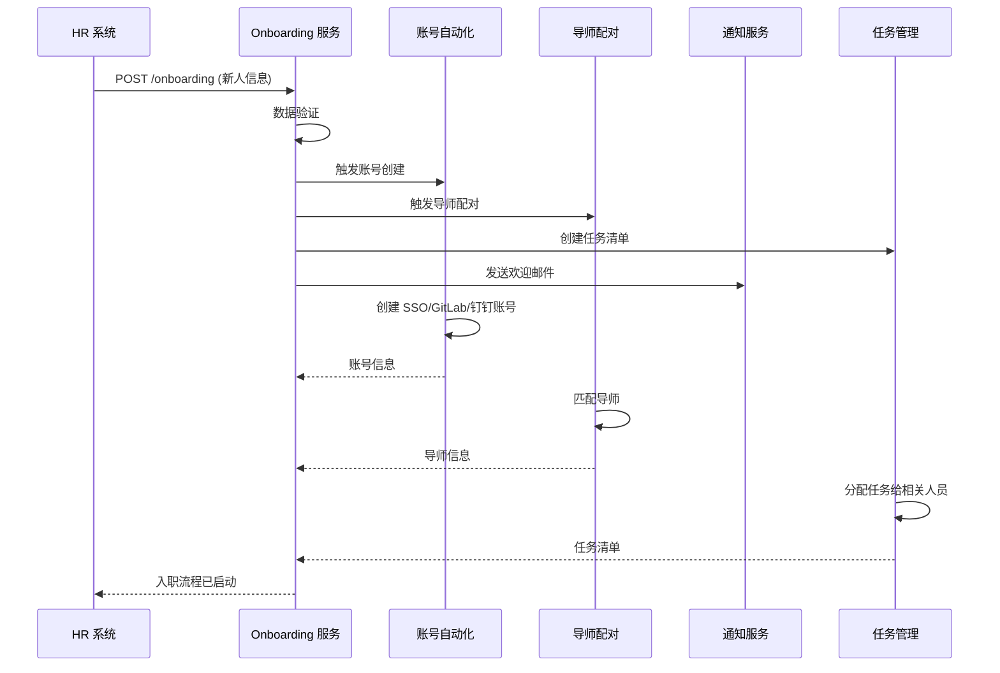
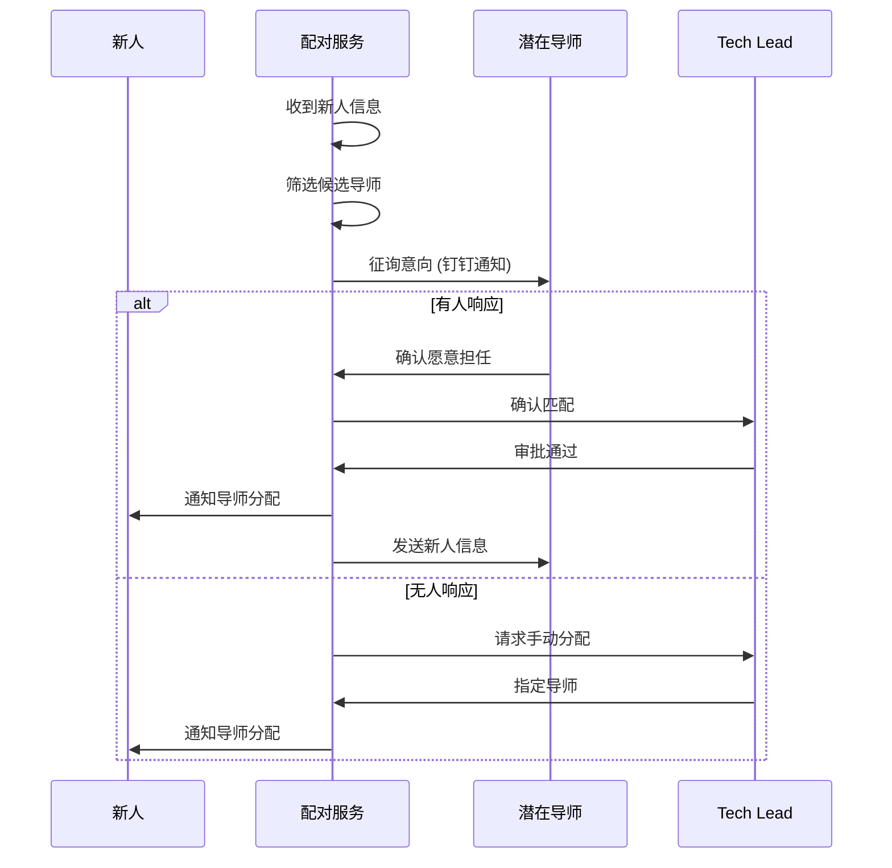

# 新人 Onboarding 设计

> 版本：v1.0 | 创建日期：2026-04-11 | 状态：草案

---

## 1. 概述

### 1.1 设计目标

构建自动化的新人入职流程，帮助新人快速融入团队，缩短上手时间，提升入职体验。

**对应需求**: E2E-11 — 新人 Onboarding，帮助新人快速上手

### 1.2 核心能力

| 能力 | 说明 | 优先级 |
|------|------|--------|
| 任务清单 | 账号、权限、环境、培训 | P0 |
| 自动化流程 | 自动创建账号、分配权限 | P0 |
| 导师配对 | 自动匹配导师、预约见面 | P0 |
| 进度追踪 | 任务完成度可视化 | P0 |
| 知识库集成 | 学习资料、常见问题 | P1 |
| 反馈收集 | 入职体验调研 | P1 |

### 1.3 新人入职旅程

```
┌─────────────────────────────────────────────────────────────────────────┐
│  新人入职旅程地图                                                       │
├─────────────────────────────────────────────────────────────────────────┤
│                                                                         │
│  入职前 1 周          入职第 1 天          入职第 1 周          入职第 1 月    │
│  ─────────          ──────────          ──────────          ──────────   │
│                                                             │            │
│  • 发送欢迎邮件       • 办理入职手续       • 完成基础培训       • 独立负责   │
│  • 准备办公设备       • 领取办公设备       • 熟悉开发环境       │  一个模块  │
│  • 创建账号权限       • 团队介绍           • 完成第一个 PR      │            │
│  • 分配导师           • 配置开发环境       • 参加团队周会       • 参与 OnCall│
│  • 发送入职指南       • 与导师见面         • 提交入职反馈       │  轮值      │
│                                                             │            │
│  目标：做好准备       目标：融入团队       目标：上手开发       目标：独立    │
│                                                                         │
└─────────────────────────────────────────────────────────────────────────┘
```

---

## 2. Onboarding 系统架构

### 2.1 架构分层



### 2.2 组件说明

| 组件 | 职责 | 技术选型 |
|------|------|---------|
| 任务管理服务 | 任务创建、分配、追踪 | Go + Echo |
| 账号自动化服务 | 自动创建账号、分配权限 | Go + Terraform |
| 导师配对服务 | 导师匹配、预约管理 | Go + 规则引擎 |
| 进度追踪服务 | 进度统计、提醒通知 | Go + Cron |
| 数据存储 | 任务数据、进度记录 | PostgreSQL + Redis |

---

## 3. 新人任务清单

### 3.1 任务分类

```yaml
# 新人任务清单模板
onboarding_tasks:
  # 入职前 (Pre-Day 1)
  pre_day1:
    - id: welcome_email
      name: "发送欢迎邮件"
      owner: hr
      due: "入职前 3 天"
      auto_complete: true
    
    - id: equipment_prep
      name: "准备办公设备"
      owner: admin
      due: "入职前 1 天"
      checklist:
        - 笔记本电脑
        - 显示器
        - 键鼠
        - 门禁卡
    
    - id: account_creation
      name: "创建账号权限"
      owner: it
      due: "入职前 1 天"
      checklist:
        - 企业邮箱
        - SSO 账号
        - GitLab 账号
        - 钉钉/企微
  
  # 第 1 天 (Day 1)
  day1:
    - id: orientation
      name: "入职Orientation"
      owner: hr
      due: "第 1 天 10:00"
      duration: "2 小时"
    
    - id: team_intro
      name: "团队介绍"
      owner: tech_lead
      due: "第 1 天 14:00"
      duration: "1 小时"
    
    - id: mentor_meet
      name: "与导师见面"
      owner: mentor
      due: "第 1 天 16:00"
      duration: "1 小时"
      agenda:
        - 互相介绍
        - 制定学习计划
        - 解答疑问
    
    - id: dev_env_setup
      name: "配置开发环境"
      owner: new_hire
      due: "第 1 天下班前"
      checklist:
        - IDE 安装
        - Git 配置
        - 代码克隆
        - 本地运行
  
  # 第 1 周 (Week 1)
  week1:
    - id: security_training
      name: "安全培训"
      owner: security_team
      due: "第 1 周"
      duration: "2 小时"
      type: required
    
    - id: codebase_overview
      name: "代码库概览"
      owner: mentor
      due: "第 1 周"
      duration: "2 小时"
    
    - id: first_pr
      name: "完成第一个 PR"
      owner: new_hire
      due: "第 1 周"
      description: "修复一个简单的 bug 或添加文档"
    
    - id: team_standup
      name: "参加团队站会"
      owner: new_hire
      due: "第 1 周每天"
      recurring: true
    
    - id: onboarding_feedback
      name: "提交入职反馈"
      owner: new_hire
      due: "第 1 周末"
      type: survey
  
  # 第 1 月 (Month 1)
  month1:
    - id: independent_task
      name: "独立负责一个模块"
      owner: new_hire
      due: "第 1 月"
      description: "在导师指导下独立完成一个小功能"
    
    - id: oncall_shadow
      name: "参与 OnCall 轮值"
      owner: new_hire
      due: "第 1 月"
      description: "跟随导师参与 OnCall，学习故障处理"
    
    - id: month1_review
      name: "满月回顾"
      owner: tech_lead
      due: "第 1 月末"
      duration: "1 小时"
      agenda:
        - 回顾成长
        - 制定下月目标
        - 收集反馈
```

### 3.2 任务状态

```yaml
任务状态:
  - pending:      待开始
  - in_progress:  进行中
  - completed:    已完成
  - skipped:      已跳过
  - overdue:      已逾期

状态流转:
  pending → in_progress (开始任务)
  in_progress → completed (完成任务)
  pending → skipped (跳过任务，需管理员)
  in_progress → overdue (超过截止时间)
```

---

## 4. 自动化入职流程

### 4.1 HR 系统触发



### 4.2 账号自动化

```yaml
# 账号创建配置
account_automation:
  # SSO/AD 账号
  sso:
    provider: "azure_ad"
    attributes:
      userPrincipalName: "{email}"
      displayName: "{name}"
      givenName: "{first_name}"
      surname: "{last_name}"
      department: "{department}"
      jobTitle: "{job_title}"
      manager: "{manager_email}"
    groups:
      - "{department}-all"
      - "orion-users"
  
  # GitLab 账号
  gitlab:
    provider: "gitlab"
    username: "{email}"
    name: "{name}"
    projects:
      - "{team}-backend"
      - "{team}-frontend"
    access_level: developer
  
  # 钉钉/企微
  im:
    provider: "dingtalk"
    userid: "{employee_id}"
    name: "{name}"
    department:
      - "{department_id}"
    position: "{job_title}"
  
  # 数据库权限
  database:
    provider: "mysql"
    username: "{first_name}_{last_name}"
    databases:
      - "{team}_dev"
    privileges:
      - SELECT
      - INSERT
      - UPDATE
      - DELETE
```

---

## 5. 导师配对机制

### 5.1 配对规则

```yaml
导师配对规则:
  # 匹配条件
  matching_criteria:
    - 同一团队 (权重：50%)
    - 技术栈匹配 (权重：30%)
    - 职级差异 1-2 级 (权重：10%)
    - 过往导师评价 (权重：10%)
  
  # 排除条件
  exclusion_rules:
    - 不能是直属上级
    - 不能同时带超过 2 个新人
    - 新人入职前 1 个月无重要交付
  
  # 优先级
  priority:
    - 自愿报名的导师优先
    - 有过往良好评价的导师优先
    - 最近 3 个月未带过新人的优先

# 导师职责
mentor_responsibilities:
  - 制定学习计划
  - 每周 1 对 1 会议
  - 代码审查指导
  - 解答技术问题
  - 帮助融入团队
  - 满月评估反馈

# 导师激励
mentor_incentives:
  - 导师津贴
  - 晋升加分
  - 年度优秀导师评选
  - 外部培训机会
```

### 5.2 配对流程



---

## 6. 学习进度追踪

### 6.1 进度看板

```
┌─────────────────────────────────────────────────────────────────────────┐
│  张三的入职进度                                                         │
│  入职日期：2026-04-01 | 导师：李四 | 团队：支付平台组                   │
├─────────────────────────────────────────────────────────────────────────┤
│                                                                         │
│  总体进度：███████████████████████████░░░░░ 75%                         │
│                                                                         │
│  📋 任务完成情况                                                        │
│  ──────────────────────────────────────────────────────────────────     │
│                                                                         │
│  ✅ 入职前 (5/5)                                                        │
│     • 发送欢迎邮件                                                      │
│     • 准备办公设备                                                      │
│     • 创建账号权限                                                      │
│     • 分配导师                                                          │
│     • 发送入职指南                                                      │
│                                                                         │
│  ✅ 第 1 天 (4/4)                                                         │
│     • 入职 Orientation                                                   │
│     • 团队介绍                                                          │
│     • 与导师见面                                                        │
│     • 配置开发环境                                                      │
│                                                                         │
│  ✅ 第 1 周 (5/5)                                                         │
│     • 安全培训                                                          │
│     • 代码库概览                                                        │
│     • 完成第一个 PR ✅                                                   │
│     • 参加团队站会                                                      │
│     • 提交入职反馈                                                      │
│                                                                         │
│  🔄 第 1 月 (2/4)                                                         │
│     • 独立负责一个模块 🔄进行中                                          │
│     • 参与 OnCall 轮值 🔄进行中                                            │
│     • 满月回顾 ⏰ 待开始 (截止：2026-05-01)                                │
│                                                                         │
│  逾期任务：无                                                           │
│                                                                         │
└─────────────────────────────────────────────────────────────────────────┘
```

### 6.2 自动提醒

```yaml
提醒规则:
  # 任务即将到期
  - trigger: "task_due_soon"
    condition: "due_date - now < 24h"
    recipients: [new_hire]
    message: "提醒：任务「{task_name}」将在 24 小时内到期"
  
  # 任务已逾期
  - trigger: "task_overdue"
    condition: "now > due_date AND status != completed"
    recipients: [new_hire, mentor]
    message: "逾期：任务「{task_name}」已逾期，请尽快完成"
  
  # 里程碑完成
  - trigger: "milestone_completed"
    condition: "milestone_status == completed"
    recipients: [new_hire, mentor, tech_lead]
    message: "恭喜完成里程碑：{milestone_name}"
  
  # 入职周年
  - trigger: "onboarding_anniversary"
    condition: "days_since_onboarding IN [7, 30, 90]"
    recipients: [new_hire, mentor, team]
    message: "今天是 {name} 入职{days}天纪念日！"
```

---

## 7. 知识库集成

### 7.1 学习资料

```yaml
# 新人学习资料包
learning_resources:
  # 公司层面
  company:
    - 公司发展历程
    - 组织架构
    - 企业文化
    - 员工手册
    - IT 安全规范
  
  # 团队层面
  team:
    - 团队介绍
    - 技术栈概览
    - 开发规范
    - 代码审查清单
    - 发布流程
  
  # 技术层面
  technical:
    - Orion 平台架构
    - 本地开发环境配置
    - 常见问题 FAQ
    - 最佳实践
    - 技术分享录像

# 学习路径
learning_path:
  week1:
    - [ ] 阅读员工手册
    - [ ] 完成安全培训
    - [ ] 配置开发环境
    - [ ] 运行 Hello World
  
  week2_4:
    - [ ] 深入学习 Orion 架构
    - [ ] 阅读开发规范
    - [ ] 参与代码审查
    - [ ] 完成第一个功能
```

### 7.2 常见问题

```yaml
faq:
  账号权限:
    - Q: 忘记 SSO 密码怎么办？
      A: 访问 sso.company.com 点击"忘记密码"
    
    - Q: 如何申请生产环境权限？
      A: 提交权限申请单，经 Tech Lead 审批后开通
    
  开发环境:
    - Q: 本地无法连接数据库？
      A: 检查 VPN 是否连接，数据库配置是否正确
    
    - Q: 如何获取测试数据？
      A: 访问测试数据平台 testdata.company.com
    
  流程规范:
    - Q: PR 提交后多久会被审查？
      A: 通常 24 小时内，紧急 PR 可@审查人
    
    - Q: 如何申请部署到生产？
      A: 创建部署申请单，附风险评估，Tech Lead 审批
```

---

## 8. API 设计

```yaml
# Onboarding API
api:
  base_path: /api/v1/onboarding

  endpoints:
    # 新人管理
    - POST   /new-hires                    # 创建新人记录
    - GET    /new-hires                    # 新人列表
    - GET    /new-hires/{id}               # 新人详情
    - PUT    /new-hires/{id}               # 更新新人信息
    
    # 任务管理
    - GET    /new-hires/{id}/tasks         # 任务列表
    - PUT    /tasks/{id}                   # 更新任务状态
    - POST   /tasks/{id}/complete          # 完成任务
    
    # 导师管理
    - GET    /mentors                      # 导师列表
    - POST   /mentors/assign               # 分配导师
    - GET    /new-hires/{id}/mentor        # 获取导师信息
    
    # 进度追踪
    - GET    /new-hires/{id}/progress      # 进度详情
    - GET    /progress/summary             # 进度汇总
    
    # 反馈
    - POST   /feedback                     # 提交反馈
    - GET    /feedback/{id}                # 反馈详情
```

---

## 9. 实施计划

| Phase | 时间 | 任务 | 产出 |
|-------|------|------|------|
| **Phase 1** | 1 周 | 任务清单、进度追踪 | 任务管理 MVP |
| **Phase 2** | 1 周 | 账号自动化、HR 集成 | 自动化入职 |
| **Phase 3** | 3 天 | 导师配对、通知提醒 | 导师系统 |
| **Phase 4** | 2 天 | 知识库集成、反馈收集 | 学习资源 |

---

_Onboarding 系统让每位新人都能顺利融入团队，快速成长为独当一面的成员。_
