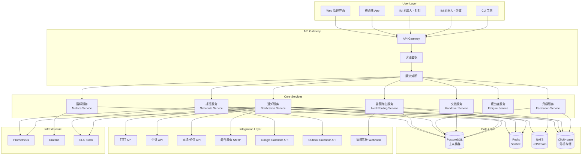
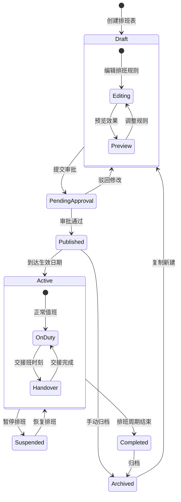
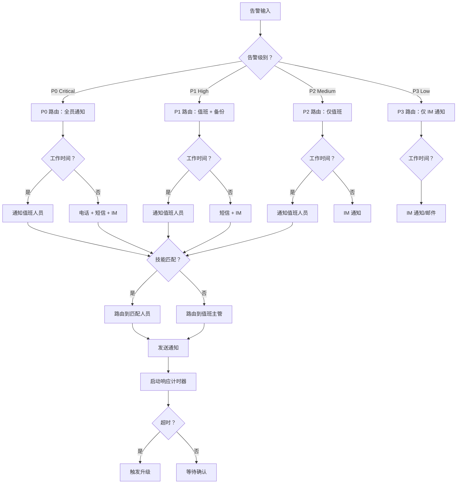
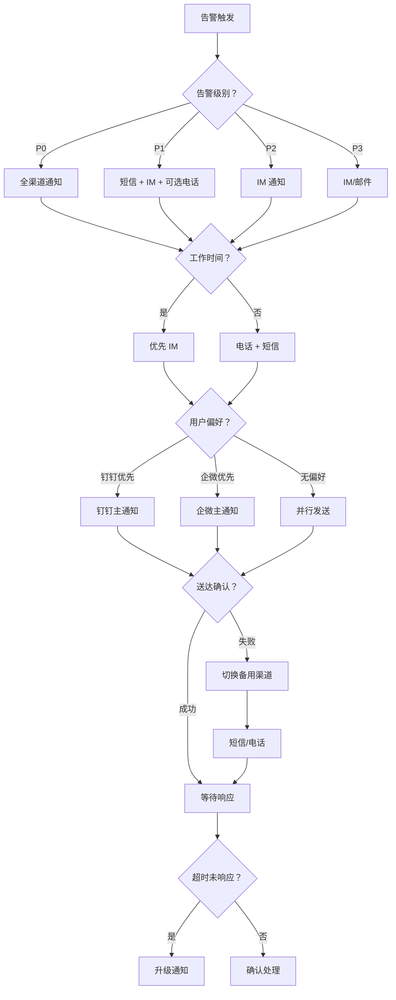
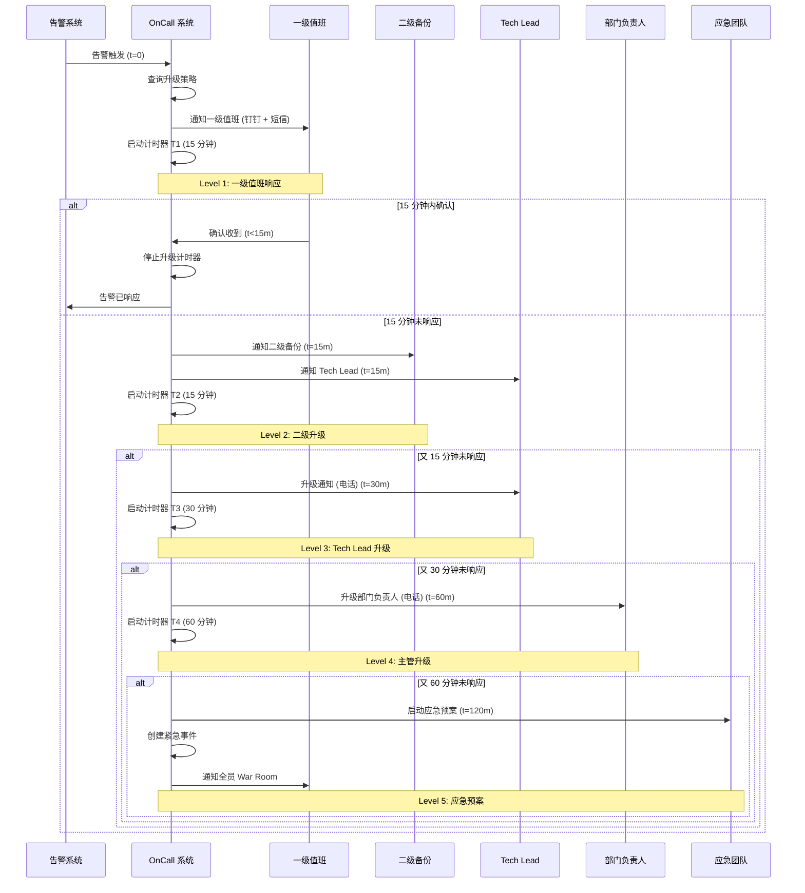
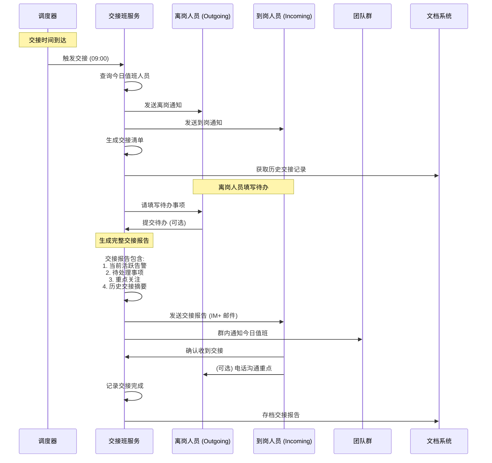
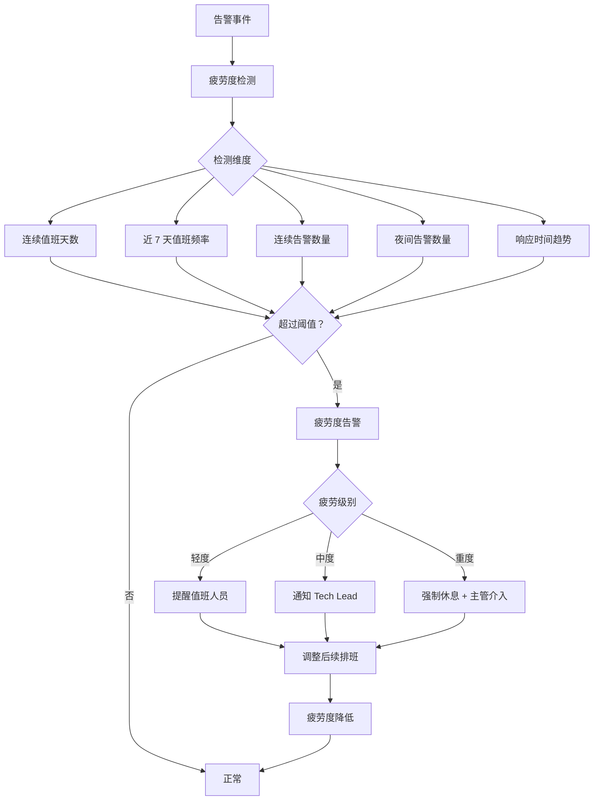
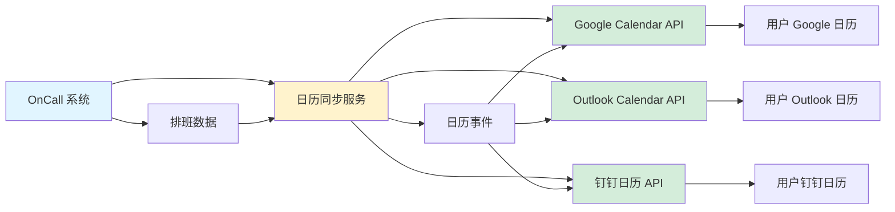

# OnCall 排班系统设计 (OnCall Scheduling System Design)

> 版本：v1.0 | 创建日期：2026-04-11 | 状态：草案 | 优先级：P2

---

## 执行摘要 (Executive Summary)

本设计文档详细描述 Orion 平台 OnCall 排班管理系统的完整架构与实现方案。OnCall 系统作为 SRE 运维体系的核心组件，负责确保每个告警都能及时响应，每个值班人员都清晰明确。

### 设计目标

| 目标 | 说明 | 优先级 |
|------|------|--------|
| 智能排班 | 支持轮班、固定班、弹性班、节假日覆盖 | P0 |
| 告警路由 | 基于服务、级别、时间、技能的路由策略 | P0 |
| 多渠道通知 | 电话、短信、IM、邮件、App 推送 | P0 |
| 升级策略 | 超时升级、轮流升级、主管升级 | P0 |
| 交接班管理 | 交接清单、未完成事项、重点关注 | P1 |
| 疲劳度管理 | 连续值班限制、告警频率限制、强制休息 | P1 |
| 健康度指标 | 响应时间、解决时间、值班满意度 | P1 |
| 日历集成 | Google Calendar、Outlook、钉钉日历 | P2 |
| 审计与报告 | 值班记录、告警统计、绩效评估 | P1 |

### 核心能力量化

| 能力 | 当前状态 | 目标状态 | 衡量指标 |
|------|---------|---------|---------|
| 告警响应时间 | 人工通知，5-15 分钟 | 自动通知，<3 分钟 | P95 < 3 分钟 |
| 排班准确率 | 手工排班，错误率 5% | 自动排班，错误率<0.1% | 排班冲突<1 次/月 |
| 升级成功率 | 无自动升级 | 100% 自动升级 | 升级失败=0 |
| 交接班完整性 | 口头交接，遗漏率 20% | 系统交接，遗漏率<1% | 交接完成率 100% |

---

## 一、OnCall 整体架构 (OnCall System Architecture)

### 1.1 系统定位

OnCall 系统在运维体系中的位置：

```
┌─────────────────────────────────────────────────────────────────────────┐
│                     Orion 运维生态系统                                   │
├─────────────────────────────────────────────────────────────────────────┤
│                                                                         │
│  ┌──────────────┐    ┌──────────────┐    ┌──────────────────────────┐  │
│  │   监控系统    │───>│  告警聚合    │───>│      OnCall 系统          │  │
│  │  (Prometheus)│    │  (Alertmanager)│   │  ┌────────────────────┐  │  │
│  └──────────────┘    └──────────────┘    │  │  排班引擎          │  │  │
│                                          │  ├────────────────────┤  │  │
│  ┌──────────────┐    ┌──────────────┐    │  │  告警路由          │  │  │
│  │   日志系统    │───>│  日志告警    │───>│  ├────────────────────┤  │  │
│  │  (ELK/Loki)  │    │  (Log Alert) │    │  │  通知调度          │  │  │
│  └──────────────┘    └──────────────┘    │  ├────────────────────┤  │  │
│                                          │  │  升级策略          │  │  │
│  ┌──────────────┐    ┌──────────────┐    │  ├────────────────────┤  │  │
│  │   链路追踪    │───>│  异常检测    │───>│  │  交接班管理        │  │  │
│  │  (Jaeger)    │    │  (Anomaly)   │    │  ├────────────────────┤  │  │
│  └──────────────┘    └──────────────┘    │  │  疲劳度管理        │  │  │
│                                          │  ├────────────────────┤  │  │
│                                          │  │  健康度指标        │  │  │
│                                          │  ├────────────────────┤  │  │
│                                          │  │  日历集成          │  │  │
│                                          │  ├────────────────────┤  │  │
│                                          │  │  审计与报告        │  │  │
│                                          │  └────────────────────┘  │  │
│                                          └──────────────────────────┘  │
│                                                         │               │
│           ┌─────────────────────────────────────────────┼───────────┐   │
│           │                                             │           │   │
│           ▼                                             ▼           ▼   │
│    ┌──────────────┐                            ┌──────────────┐       │
│    │   值班人员    │                            │   通知渠道    │       │
│    │  (钉钉/企微)  │                            │  (电话/短信)  │       │
│    └──────────────┘                            └──────────────┘       │
│                                                                         │
└─────────────────────────────────────────────────────────────────────────┘

告警响应流程:
1. 监控系统检测到异常指标
2. 告警聚合服务去重、合并相关告警
3. OnCall 系统查询当前值班人员
4. 根据路由策略选择通知渠道
5. 发送通知并启动响应计时器
6. 超时未响应 → 触发升级策略
7. 告警解决 → 记录响应数据，生成报告
```

### 1.2 架构分层设计



### 1.3 核心组件职责

| 组件 | 职责描述 | 技术选型 | SLA | 负责人 |
|------|---------|---------|-----|--------|
| **排班服务** | 排班表管理、轮班计算、替班处理、节假日覆盖 | Go + Echo + PostgreSQL | 99.9% | 平台基础团队 |
| **告警路由服务** | 告警接收、路由决策、技能匹配、时间窗口 | Go + Redis + ClickHouse | 99.95% | SRE 团队 |
| **通知服务** | 多渠道通知、送达确认、模板管理、频率控制 | Go + NATS + 钉钉/企微 API | 99.99% | 平台工具团队 |
| **升级服务** | 升级策略、超时检测、升级链管理、应急预案 | Go + Cron + NATS | 99.99% | SRE 团队 |
| **交接服务** | 交接清单生成、待办同步、重点关注提醒 | Go + NATS + 钉钉 | 99.9% | 平台基础团队 |
| **疲劳度服务** | 连续值班检测、告警频率限制、强制休息 | Go + Redis + 规则引擎 | 99.9% | SRE 团队 |
| **指标服务** | 响应时间统计、健康度计算、报表生成 | Go + ClickHouse + Grafana | 99.9% | 效能团队 |

### 1.4 数据流向

```
告警数据流:
┌─────────────┐    ┌─────────────┐    ┌─────────────┐    ┌─────────────┐
│   监控系统   │───>│  告警路由   │───>│  排班查询   │───>│  通知服务   │
└─────────────┘    └─────────────┘    └─────────────┘    └─────────────┘
                                              │                   │
                                              ▼                   ▼
                                     ┌─────────────┐    ┌─────────────┐
                                     │   值班人员   │    │  升级服务   │
                                     └─────────────┘    └─────────────┘
                                                              │
                                              ┌───────────────┼───────────────┐
                                              ▼               ▼               ▼
                                     ┌─────────────┐ ┌─────────────┐ ┌─────────────┐
                                     │  二级值班   │ │  Tech Lead  │ │  主管/负责人 │
                                     └─────────────┘ └─────────────┘ └─────────────┘

配置数据流:
┌─────────────┐    ┌─────────────┐    ┌─────────────┐
│  Web 管理端  │───>│  排班服务   │───>│  PostgreSQL │
└─────────────┘    └─────────────┘    └─────────────┘
                                              │
                                              ▼
                                     ┌─────────────┐
                                     │    Redis    │
                                     │   (缓存)    │
                                     └─────────────┘

指标数据流:
┌─────────────┐    ┌─────────────┐    ┌─────────────┐    ┌─────────────┐
│ 通知服务    │───>│  指标服务   │───>│ ClickHouse  │───>│   Grafana   │
│ 升级服务    │───>│             │    │  (分析库)   │    │  (Dashboard)│
│ 交接服务    │───>│             │    │             │    │             │
└─────────────┘    └─────────────┘    └─────────────┘    └─────────────┘
```

---

## 二、排班规则设计 (Scheduling Rules Design)

### 2.1 排班模型总览

OnCall 系统支持四种核心排班模式：

| 模式 | 说明 | 适用场景 | 配置复杂度 |
|------|------|---------|-----------|
| **轮班制 (Rotation)** | 按固定周期循环轮换 | 标准 SRE 团队，7×24 覆盖 | 低 |
| **固定班 (Fixed)** | 指定人员在指定时间值班 | 管理层、特定负责人 | 低 |
| **弹性班 (Flexible)** | 人员可自主选择时段 | 分布式团队、跨时区 | 中 |
| **节假日覆盖 (Holiday)** | 特殊日期特殊安排 | 法定节假日、重大活动 | 中 |

### 2.2 排班规则状态机



### 2.3 轮班制 (Rotation Schedule)

#### 2.3.1 轮班周期类型

```yaml
# 轮班制配置示例
rotation_schedule:
  id: "sre-team-2026-Q2-rotation"
  name: "SRE 团队 2026 年 Q2 轮班"
  team_id: "sre-team"
  
  # 轮班周期类型
  rotation_type: "weekly"  # 可选：daily/weekly/monthly/custom
  
  # 轮班周期配置
  rotation_config:
    # 每周轮换：每周一 09:00 交接
    weekly:
      day_of_week: "monday"
      time: "09:00"
      timezone: "Asia/Shanghai"
    
    # 每日轮换：每天早上 09:00 交接
    daily:
      time: "09:00"
      timezone: "Asia/Shanghai"
    
    # 每月轮换：每月 1 号 09:00 交接
    monthly:
      day_of_month: 1
      time: "09:00"
      timezone: "Asia/Shanghai"
    
    # 自定义周期：每 3 天轮换一次
    custom:
      interval_days: 3
      start_date: "2026-04-01"
      time: "09:00"
      timezone: "Asia/Shanghai"
  
  # 值班人员顺序（按轮班顺序排列）
  oncall_order:
    - user_id: "sre-wang"
      name: "王大伟"
      position: 1
      skills: ["kubernetes", "mysql", "networking"]
    
    - user_id: "sre-li"
      name: "李强"
      position: 2
      skills: ["redis", "kafka", "monitoring"]
    
    - user_id: "sre-zhang"
      name: "张三"
      position: 3
      skills: ["linux", "security", "backup"]
    
    - user_id: "sre-liu"
      name: "刘明"
      position: 4
      skills: ["application", "database", "networking"]
  
  # 备份人员（二级升级）
  backup_order:
    - user_id: "sre-lead-chen"
      name: "陈主任"
      role: "primary_backup"
    
    - user_id: "sre-director-zhou"
      name: "周总监"
      role: "secondary_backup"
  
  # 生效周期
  validity_period:
    start_date: "2026-04-01"
    end_date: "2026-06-30"
```

#### 2.3.2 轮班计算算法

```
轮班计算逻辑:
┌─────────────────────────────────────────────────────────────────────────┐
│                                                                         │
│  输入：当前时间 T                                                        │
│  输出：当前值班人员 P                                                    │
│                                                                         │
│  步骤:                                                                   │
│  1. 计算轮班开始时间 S = rotation_start_date                            │
│  2. 计算经过时间 E = T - S                                              │
│  3. 计算当前轮次 R = floor(E / rotation_period)                         │
│  4. 计算人员索引 I = R mod N (N = 值班人员数量)                          │
│  5. 返回人员 P = oncall_order[I]                                        │
│                                                                         │
│  示例 (周轮换，4 人团队):                                                  │
│  - 轮班开始：2026-04-01 (周一)                                           │
│  - 当前时间：2026-04-15 (周一)                                           │
│  - 经过周数：2 周                                                         │
│  - 人员索引：2 mod 4 = 2                                                 │
│  - 当前值班：张三 (第 3 位)                                                 │
│                                                                         │
└─────────────────────────────────────────────────────────────────────────┘
```

### 2.4 固定班 (Fixed Schedule)

```yaml
# 固定班配置示例
fixed_schedule:
  id: "sre-management-fixed"
  name: "SRE 管理层固定值班"
  team_id: "sre-team"
  
  # 固定时段
  shifts:
    - name: "工作日白天"
      user_id: "sre-wang"
      days_of_week: ["monday", "tuesday", "wednesday", "thursday", "friday"]
      start_time: "09:00"
      end_time: "18:00"
      timezone: "Asia/Shanghai"
    
    - name: "工作日晚间"
      user_id: "sre-li"
      days_of_week: ["monday", "tuesday", "wednesday", "thursday", "friday"]
      start_time: "18:00"
      end_time: "22:00"
      timezone: "Asia/Shanghai"
    
    - name: "周末白天"
      user_id: "sre-zhang"
      days_of_week: ["saturday", "sunday"]
      start_time: "10:00"
      end_time: "18:00"
      timezone: "Asia/Shanghai"
  
  # 优先级（高优先级覆盖低优先级）
  priority: 100
```

### 2.5 弹性班 (Flexible Schedule)

```yaml
# 弹性班配置示例
flexible_schedule:
  id: "sre-flexible-2026-Q2"
  name: "SRE 弹性值班 2026 年 Q2"
  team_id: "sre-team"
  
  # 可选时段池
  available_slots:
    - id: "slot-001"
      date: "2026-04-01"
      start_time: "09:00"
      end_time: "18:00"
      min_claimers: 1
      max_claimers: 2
    
    - id: "slot-002"
      date: "2026-04-01"
      start_time: "18:00"
      end_time: "09:00"  # 次日
      min_claimers: 1
      max_claimers: 1
    
    - id: "slot-003"
      date: "2026-04-02"
      start_time: "09:00"
      end_time: "18:00"
      min_claimers: 1
      max_claimers: 2
  
  # 认领规则
  claim_rules:
    # 最早可认领时间（提前多少天）
    claim_open_days: 30
    # 最晚可认领时间（最少提前多少天）
    claim_close_days: 1
    # 每人每周最多认领班次数
    max_claims_per_week: 3
    # 每人每月最少认领班次数
    min_claims_per_month: 5
    # 自动分配未认领班次
    auto_assign_unclaimed: true
  
  # 积分激励（可选）
  point_system:
    enabled: true
    points_per_shift:
      weekday_day: 10
      weekday_night: 20
      weekend_day: 15
      weekend_night: 30
      holiday: 50
```

### 2.6 节假日覆盖 (Holiday Coverage)

```yaml
# 节假日配置示例
holiday_coverage:
  id: "2026-holidays"
  name: "2026 年节假日排班"
  
  # 法定节假日
  holidays:
    - name: "元旦"
      date: "2026-01-01"
      type: "public"
      coverage:
        primary: "sre-wang"
        backup: "sre-lead-chen"
    
    - name: "春节"
      date_range:
        start: "2026-02-17"
        end: "2026-02-23"
      type: "public"
      coverage:
        daily_rotation: ["sre-wang", "sre-li", "sre-zhang", "sre-liu"]
        backup: "sre-lead-chen"
    
    - name: "清明节"
      date: "2026-04-05"
      type: "public"
      coverage:
        primary: "sre-li"
        backup: "sre-lead-chen"
    
    - name: "劳动节"
      date_range:
        start: "2026-05-01"
        end: "2026-05-05"
      type: "public"
      coverage:
        daily_rotation: ["sre-zhang", "sre-liu", "sre-wang"]
        backup: "sre-director-zhou"
    
    - name: "端午节"
      date: "2026-06-19"
      type: "public"
      coverage:
        primary: "sre-liu"
        backup: "sre-lead-chen"
    
    - name: "国庆节"
      date_range:
        start: "2026-10-01"
        end: "2026-10-07"
      type: "public"
      coverage:
        daily_rotation: ["sre-wang", "sre-li", "sre-zhang", "sre-liu"]
        backup: "sre-director-zhou"
  
  # 调休工作日
  makeup_workdays:
    - date: "2026-02-15"  # 周日上班
      original_holiday: "春节"
      schedule_type: "weekend"  # 按周末排班
    
    - date: "2026-04-26"  # 周日上班
      original_holiday: "劳动节"
      schedule_type: "weekend"
    
    - date: "2026-09-27"  # 周日上班
      original_holiday: "国庆节"
      schedule_type: "weekend"
  
  # 特殊时期（如双 11、618）
  special_periods:
    - name: "618 大促"
      date_range:
        start: "2026-06-15"
        end: "2026-06-20"
      level: "enhanced"
      coverage:
        primary_count: 2  # 双人值班
        primary: ["sre-wang", "sre-li"]
        backup: "sre-lead-chen"
        on_site: true  # 现场值班
    
    - name: "双 11 大促"
      date_range:
        start: "2026-11-10"
        end: "2026-11-12"
      level: "enhanced"
      coverage:
        primary_count: 2
        primary: ["sre-zhang", "sre-liu"]
        backup: "sre-director-zhou"
        on_site: true
```

### 2.7 替班规则 (Shift Swap)

```yaml
# 替班管理配置
shift_swap:
  # 替班申请流程
  request_flow:
    steps:
      - step: 1
        action: "申请人选择替班人"
        required_fields: ["swap_date", "replacement_user", "reason"]
      
      - step: 2
        action: "系统检查替班人资格"
        checks:
          - "替班人是否有空"
          - "替班人是否有相应技能"
          - "替班人本月替班次数是否超限"
      
      - step: 3
        action: "提交审批"
        approvers: ["team_lead", "schedule_admin"]
        approval_timeout_hours: 24
      
      - step: 4
        action: "审批通过，更新排班表"
        notifications: ["申请人", "替班人", "团队群"]
      
      - step: 5
        action: "记录替班历史"
        audit_log: true
  
  # 限制条件
  constraints:
    # 每人每月最多替班次数
    max_swaps_per_month: 2
    # 不能连续替班天数
    max_consecutive_swap_days: 3
    # 替班人必须有相应资质
    require_matching_skills: true
    # 提前申请时间（最少提前多少小时）
    min_advance_hours: 24
    # 紧急替班（可突破部分限制）
    emergency_swap:
      enabled: true
      requires_approval: true
      approvers: ["team_lead"]
  
  # 自动匹配替班人（可选）
  auto_matching:
    enabled: false
    matching_criteria:
      - "技能匹配度"
      - "历史值班表现"
      - "近期值班频率（低者优先）"
      - "时间可用性"
```

---

## 三、告警路由策略 (Alert Routing Strategy)

### 3.1 路由决策树



### 3.2 基于服务的路由 (Service-Based Routing)

```yaml
# 基于服务的路由配置
service_routing:
  # 服务分组
  service_groups:
    - group: "core-services"
      services: ["api-gateway", "user-service", "auth-service"]
      oncall_team: "sre-team"
      escalation_policy: "critical"
    
    - group: "data-services"
      services: ["mysql-cluster", "redis-cluster", "mongodb"]
      oncall_team: "dba-team"
      escalation_policy: "critical"
    
    - group: "middleware"
      services: ["kafka", "rabbitmq", "elasticsearch"]
      oncall_team: "platform-team"
      escalation_policy: "high"
    
    - group: "business-services"
      services: ["order-service", "payment-service", "inventory-service"]
      oncall_team: "app-team"
      escalation_policy: "standard"
    
    - group: "frontend"
      services: ["web-portal", "mobile-api"]
      oncall_team: "frontend-team"
      escalation_policy: "standard"
  
  # 服务依赖路由（上游服务告警路由到下游负责人）
  dependency_routing:
    enabled: true
    rules:
      - upstream: "api-gateway"
        downstream: ["user-service", "order-service"]
        route_to: "upstream_owner"  # 上游服务负责人优先
      
      - upstream: "mysql-cluster"
        downstream: ["user-service", "order-service", "payment-service"]
        route_to: "dba-team"  # 数据库问题直接路由到 DBA
```

### 3.3 基于级别的路由 (Severity-Based Routing)

```yaml
# 基于告警级别的路由配置
severity_routing:
  # P0 - Critical
  p0:
    name: "紧急告警"
    description: "系统完全不可用、数据丢失、安全漏洞"
    response_time_minutes: 5
    notification_channels: ["phone", "sms", "dingtalk", "wecom"]
    notify_roles: ["primary_oncall", "backup_oncall", "team_lead"]
    escalation_timeout_minutes: 10
    auto_create_incident: true
    war_room_enabled: true
    
  # P1 - High
  p1:
    name: "高优先级告警"
    description: "核心功能受损、性能严重下降"
    response_time_minutes: 15
    notification_channels: ["sms", "dingtalk", "wecom"]
    notify_roles: ["primary_oncall", "backup_oncall"]
    escalation_timeout_minutes: 30
    auto_create_incident: true
    war_room_enabled: false
    
  # P2 - Medium
  p2:
    name: "中优先级告警"
    description: "非核心功能异常、可自愈问题"
    response_time_minutes: 60
    notification_channels: ["dingtalk", "wecom"]
    notify_roles: ["primary_oncall"]
    escalation_timeout_minutes: 120
    auto_create_incident: false
    war_room_enabled: false
    
  # P3 - Low
  p3:
    name: "低优先级告警"
    description: "轻微问题、信息性通知"
    response_time_minutes: 240
    notification_channels: ["dingtalk", "email"]
    notify_roles: ["primary_oncall"]
    escalation_timeout_minutes: 480
    auto_create_incident: false
    war_room_enabled: false
```

### 3.4 基于时间的路由 (Time-Based Routing)

```yaml
# 基于时间的路由配置
time_routing:
  # 工作时间定义
  business_hours:
    timezone: "Asia/Shanghai"
    weekdays:
      start: "09:00"
      end: "18:00"
    weekends:
      enabled: false
  
  # 不同时段的路由策略
  routing_by_time:
    - period: "business_hours"
      rule: "route_to_primary"
      channels: ["dingtalk", "wecom"]
    
    - period: "after_hours"
      rule: "route_to_primary_and_backup"
      channels: ["sms", "dingtalk", "wecom"]
    
    - period: "night"
      time_range:
        start: "22:00"
        end: "07:00"
      rule: "route_to_all"
      channels: ["phone", "sms", "dingtalk"]
      min_severity: "p1"  # 夜间仅通知 P1 及以上告警
    
    - period: "holiday"
      rule: "route_to_holiday_coverage"
      channels: ["phone", "sms", "dingtalk"]
```

### 3.5 基于技能的路由 (Skill-Based Routing)

```yaml
# 基于技能的路由配置
skill_routing:
  # 技能分类
  skills:
    - category: "infrastructure"
      skills: ["kubernetes", "docker", "networking", "linux"]
    
    - category: "database"
      skills: ["mysql", "postgresql", "redis", "mongodb", "clickhouse"]
    
    - category: "middleware"
      skills: ["kafka", "rabbitmq", "elasticsearch", "nginx"]
    
    - category: "application"
      skills: ["go", "java", "python", "nodejs"]
    
    - category: "monitoring"
      skills: ["prometheus", "grafana", "elk", "jaeger"]
    
    - category: "security"
      skills: ["firewall", "waf", "ssl", "compliance"]
  
  # 人员技能画像
  team_members:
    - user_id: "sre-wang"
      skills: ["kubernetes", "mysql", "networking", "go"]
      skill_level:
        kubernetes: "expert"
        mysql: "advanced"
        networking: "advanced"
        go: "intermediate"
    
    - user_id: "sre-li"
      skills: ["redis", "kafka", "prometheus", "python"]
      skill_level:
        redis: "expert"
        kafka: "advanced"
        prometheus: "advanced"
        python: "expert"
  
  # 告警 - 技能映射
  alert_skill_mapping:
    - alert_type: "kubernetes_pod_crashloop"
      required_skills: ["kubernetes"]
      preferred_level: "advanced"
    
    - alert_type: "mysql_replication_lag"
      required_skills: ["mysql"]
      preferred_level: "advanced"
    
    - alert_type: "redis_memory_high"
      required_skills: ["redis"]
      preferred_level: "intermediate"
    
    - alert_type: "kafka_consumer_lag"
      required_skills: ["kafka"]
      preferred_level: "intermediate"
  
  # 路由匹配逻辑
  matching_logic:
    # 优先匹配技能最符合的人员
    priority: "skill_match"
    # 如果多人匹配，选择近期值班较少的人
    tie_breaker: "least_recent_oncall"
    # 如果无人匹配，路由到值班主管
    no_match_action: "route_to_team_lead"
```

---

## 四、通知渠道管理 (Notification Channel Management)

### 4.1 通知渠道选择流程



### 4.2 通知渠道特性对比

| 渠道 | 延迟 | 到达率 | 成本 | 适用场景 | 优先级 |
|------|------|--------|------|---------|--------|
| **钉钉** | <5 秒 | 95% | 免费 | 日常通知、P2/P3 告警、交接班 | P2 |
| **企微** | <5 秒 | 95% | 免费 | 日常通知、P2/P3 告警、团队群 | P2 |
| **短信** | <30 秒 | 99% | ¥0.05/条 | 紧急告警、升级通知、非工作时间 | P1 |
| **电话** | <60 秒 | 99.9% | ¥0.15/分钟 | P0 告警、多级升级、紧急事件 | P0 |
| **邮件** | <5 分钟 | 90% | 免费 | 日报、周报、总结、低优先级 | P3 |
| **App 推送** | <10 秒 | 85% | 免费 | 辅助通知、告警更新 | P3 |

### 4.3 通知模板设计

```yaml
# 通知模板配置
notification_templates:
  # 钉钉/企微模板
  im_template: |
    ## {{ emoji }} {{ severity }} 告警
    
    **服务**: {{ service_name }}
    **告警**: {{ alert_name }}
    **当前值**: {{ current_value }}
    **阈值**: {{ threshold }}
    **开始时间**: {{ start_time }}
    **持续时间**: {{ duration }}
    **值班人员**: {{ oncall_person }}
    
    [查看监控面板]({{ grafana_url }})
    [查看 Runbook]({{ runbook_url }})
    
    ---
    <a href="{{ ack_url }}">✅ 收到</a> | 
    <a href="{{ in_progress_url }}">🔧 处理中</a> | 
    <a href="{{ resolve_url }}">✅ 已解决</a>
  
  # 短信模板
  sms_template: |
    【Orion 告警】{{ severity }}: {{ service_name }} - {{ alert_name }}. 
    当前值：{{ current_value }}, 阈值：{{ threshold }}. 
    请登录 {{ dashboard_url }} 查看。回复 Y 确认。
  
  # 电话语音模板
  phone_template: |
    您好，Orion 告警系统通知。
    {{ severity }}告警：{{ service_name }}，{{ alert_name }}。
    当前值{{ current_value }}，超过阈值{{ threshold }}。
    请及时登录系统处理。请按 1 确认收到。
  
  # 邮件模板
  email_template: |
    主题：[{{ severity }}] {{ service_name }} - {{ alert_name }}
    
    告警详情:
    --------------
    服务名称：{{ service_name }}
    告警名称：{{ alert_name }}
    告警级别：{{ severity }}
    当前值：{{ current_value }}
    阈值：{{ threshold }}
    开始时间：{{ start_time }}
    持续时间：{{ duration }}
    
    告警描述:
    {{ alert_description }}
    
    建议操作:
    {{ recommended_actions }}
    
    相关链接:
    - 监控面板：{{ grafana_url }}
    - 告警详情：{{ alert_url }}
    - Runbook: {{ runbook_url }}
    
    ---
    Orion OnCall 系统
    
    此邮件由系统自动发送，请勿回复。
```

### 4.4 通知频率控制

```yaml
# 通知频率控制配置
notification_rate_limit:
  # 每人每分钟最多通知数
  per_user_per_minute: 5
  # 每人每小时最多通知数
  per_user_per_hour: 30
  # 每人每天最多通知数
  per_user_per_day: 200
  
  # 每告警每小时最多通知数（避免重复）
  per_alert_per_hour: 3
  
  # 相同告警合并窗口（秒）
  dedup_window_seconds: 300
  
  # 通知静默时段（免打扰）
  quiet_hours:
    enabled: true
    start: "22:00"
    end: "07:00"
    # P0 告警不受静默限制
    p0_override: true
    # P1 告警在静默时段降级为 IM 通知
    p1_downgrade_to_im: true
  
  # 通知疲劳检测
  fatigue_detection:
    enabled: true
    # 连续收到 N 条告警后触发
    consecutive_alerts_threshold: 10
    # 触发后动作
    actions:
      - "通知团队主管"
      - "建议启动应急预案"
      - "生成告警分析报告"
```

---

## 五、升级策略设计 (Escalation Policy Design)

### 5.1 升级策略时序图



### 5.2 升级策略配置

```yaml
# 升级策略定义
escalation_policies:
  # 默认策略
  default:
    id: "default-policy"
    name: "默认升级策略"
    description: "适用于标准 P1/P2 告警"
    
    levels:
      - level: 1
        name: "一级值班"
        notify_after_seconds: 0
        channels: ["dingtalk", "wecom"]
        recipients: ["primary_oncall"]
        timeout_minutes: 15
        reminder_interval_minutes: 5
        max_reminders: 2
      
      - level: 2
        name: "二级备份"
        notify_after_seconds: 900  # 15 分钟后
        channels: ["sms", "dingtalk"]
        recipients: ["backup_oncall"]
        timeout_minutes: 15
        reminder_interval_minutes: 5
        max_reminders: 2
      
      - level: 3
        name: "Tech Lead"
        notify_after_seconds: 1800  # 30 分钟后
        channels: ["phone", "dingtalk"]
        recipients: ["tech_lead"]
        timeout_minutes: 30
        reminder_interval_minutes: 10
        max_reminders: 3
      
      - level: 4
        name: "部门负责人"
        notify_after_seconds: 3600  # 60 分钟后
        channels: ["phone"]
        recipients: ["dept_head"]
        timeout_minutes: 60
        reminder_interval_minutes: 15
        max_reminders: 2
  
  # 激进策略（P0 告警）
  aggressive:
    id: "aggressive-policy"
    name: "激进升级策略"
    description: "适用于 P0 紧急告警，缩短所有超时"
    
    levels:
      - level: 1
        name: "一级值班"
        notify_after_seconds: 0
        channels: ["phone", "sms", "dingtalk"]
        recipients: ["primary_oncall"]
        timeout_minutes: 5
        reminder_interval_minutes: 2
        max_reminders: 2
      
      - level: 2
        name: "二级备份"
        notify_after_seconds: 300  # 5 分钟后
        channels: ["phone", "sms", "dingtalk"]
        recipients: ["backup_oncall"]
        timeout_minutes: 5
        reminder_interval_minutes: 2
        max_reminders: 2
      
      - level: 3
        name: "Tech Lead"
        notify_after_seconds: 600  # 10 分钟后
        channels: ["phone", "dingtalk"]
        recipients: ["tech_lead"]
        timeout_minutes: 10
        reminder_interval_minutes: 5
        max_reminders: 2
      
      - level: 4
        name: "部门负责人"
        notify_after_seconds: 1200  # 20 分钟后
        channels: ["phone"]
        recipients: ["dept_head"]
        timeout_minutes: 10
        reminder_interval_minutes: 5
        max_reminders: 2
      
      - level: 5
        name: "应急预案"
        notify_after_seconds: 1800  # 30 分钟后
        channels: ["phone"]
        recipients: ["emergency_team"]
        actions:
          - "create_p0_incident"
          - "notify_all_stakeholders"
          - "start_war_room"
          - "page_oncall_rotation"
  
  # 宽松策略（P2 告警）
  relaxed:
    id: "relaxed-policy"
    name: "宽松升级策略"
    description: "适用于 P2 中优先级告警，延长超时"
    
    levels:
      - level: 1
        name: "一级值班"
        notify_after_seconds: 0
        channels: ["dingtalk", "wecom"]
        recipients: ["primary_oncall"]
        timeout_minutes: 30
        reminder_interval_minutes: 10
        max_reminders: 2
      
      - level: 2
        name: "二级备份"
        notify_after_seconds: 1800  # 30 分钟后
        channels: ["sms", "dingtalk"]
        recipients: ["backup_oncall"]
        timeout_minutes: 30
        reminder_interval_minutes: 10
        max_reminders: 2
      
      - level: 3
        name: "Tech Lead"
        notify_after_seconds: 3600  # 60 分钟后
        channels: ["dingtalk"]
        recipients: ["tech_lead"]
        timeout_minutes: 60
```

### 5.3 升级链管理

```yaml
# 升级链配置
escalation_chain:
  # 标准 SRE 团队升级链
  sre_team:
    chain_id: "sre-escalation-chain"
    team_id: "sre-team"
    
    chain:
      - position: 1
        role: "primary_oncall"
        description: "当前值班人员"
        lookup: "schedule_service"
      
      - position: 2
        role: "backup_oncall"
        description: "备份值班人员"
        lookup: "schedule_service"
      
      - position: 3
        role: "tech_lead"
        description: "技术负责人"
        users: ["sre-lead-chen"]
      
      - position: 4
        role: "dept_head"
        description: "部门总监"
        users: ["sre-director-zhou"]
      
      - position: 5
        role: "emergency_team"
        description: "应急团队"
        users: ["sre-emergency-group"]
  
  # DBA 团队升级链
  dba_team:
    chain_id: "dba-escalation-chain"
    team_id: "dba-team"
    
    chain:
      - position: 1
        role: "primary_oncall"
        lookup: "schedule_service"
      
      - position: 2
        role: "backup_oncall"
        lookup: "schedule_service"
      
      - position: 3
        role: "dba_lead"
        users: ["dba-lead-wang"]
      
      - position: 4
        role: "sre_lead"  # 升级到 SRE 负责人
        users: ["sre-lead-chen"]
  
  # 升级链跳过规则
  skip_rules:
    # 如果值班人员本身就是 Tech Lead，跳过 Level 3
    - condition: "primary_oncall == tech_lead"
      action: "skip_level_3"
    
    # 如果是非工作时间，直接升级到 Level 2
    - condition: "is_after_hours"
      action: "start_from_level_2"
```

---

## 六、交接班流程 (Handover Process)

### 6.1 交接班流程图



### 6.2 交接清单模板

```markdown
## 📋 OnCall 交接报告

**日期**: 2026-04-11 (周一)
**离岗**: 王大伟 (sre-wang)
**到岗**: 李强 (sre-li)
**交接时间**: 09:00

---

### 🔴 当前活跃告警 (2)

| 级别 | 告警 | 服务 | 开始时间 | 持续 | 当前状态 | 备注 |
|------|------|------|----------|------|----------|------|
| P1 | 订单服务错误率偏高 | order-service | 04-10 22:15 | 10h45m | 处理中 | 已定位到数据库连接池问题 |
| P2 | 缓存命中率下降 | redis-cluster | 04-11 03:30 | 5h30m | 观察中 | 夜间批处理导致，白天会恢复 |

---

### 📝 待处理事项 (4)

#### 高优先级
1. **订单服务数据库连接池优化**
   - 状态：进行中
   - 负责人：王大伟
   - 截止时间：今日 12:00
   - 备注：已提交 PR，待 Review
   
2. **MySQL 主库磁盘空间扩容**
   - 状态：待开始
   - 负责人：李强
   - 截止时间：今日 18:00
   - 备注：需在低峰期执行，预计 20:00

#### 中优先级
3. **Kafka 消费者滞后调查**
   - 状态：待调查
   - 负责人：待定
   - 备注：昨夜告警，目前滞后已恢复

4. **SRE 周会准备**
   - 状态：待准备
   - 时间：明日 14:00
   - 备注：准备本周值班报告

---

### ⚠️ 重点关注

1. **今晚 20:00-22:00 数据库维护窗口**
   - 操作：MySQL 主库磁盘扩容
   - 影响：可能有短暂抖动
   - 负责人：DBA 团队
   
2. **明天上午 10:00 产品发布会**
   - 影响：预计流量增长 50%
   - 准备：已扩容、限流配置就绪

3. **本周四防火墙规则变更**
   - 影响：可能影响部分内网访问
   - 负责人：安全团队

---

### 📊 昨日值班摘要

- 处理告警：12 次
- P1 告警：1 次（已解决）
- P2 告警：3 次
- 平均响应时间：2.5 分钟
- 平均解决时间：35 分钟

---

[查看详细报告](http://oncall/handover/20260411)
[昨日报告](http://oncall/handover/20260410)

---
_此报告由 Orion OnCall 系统自动生成_
```

### 6.3 交接班配置

```yaml
# 交接班配置
handover:
  # 交接时间
  schedule:
    timezone: "Asia/Shanghai"
    weekday_time: "09:00"
    weekend_time: "10:00"
    holiday_time: "10:00"
  
  # 通知配置
  notifications:
    # 离岗通知（提前多久发送）
    outgoing_reminder_minutes: 30
    # 到岗通知（准时发送）
    incoming_notify_at_time: true
    # 团队群通知
    team_channel_notify: true
    # 通知渠道
    channels: ["dingtalk", "email"]
  
  # 交接清单内容
  checklist:
    include_active_alerts: true
    include_pending_items: true
    include_focus_items: true
    include_upcoming_events: true
    include_yesterday_summary: true
    include_historical_trend: false
  
  # 交接确认
  confirmation:
    required: true
    timeout_minutes: 60
    escalation_on_timeout: true
    escalation_to: "tech_lead"
  
  # 交接报告存储
  storage:
    retention_days: 90
    export_format: ["markdown", "pdf"]
    archive_location: "docs/sre/handover/"
```

---

## 七、疲劳度管理 (Fatigue Management)

### 7.1 疲劳度管理图



### 7.2 疲劳度检测规则

```yaml
# 疲劳度管理配置
fatigue_management:
  # 检测维度与阈值
  detection_rules:
    # 连续值班限制
    consecutive_shifts:
      enabled: true
      max_consecutive_days: 5
      max_consecutive_nights: 3
      action: "block_scheduling"
    
    # 近 7 天值班频率
    weekly_frequency:
      enabled: true
      max_days_per_week: 4
      max_nights_per_week: 2
      action: "block_scheduling"
    
    # 近 30 天值班频率
    monthly_frequency:
      enabled: true
      max_days_per_month: 15
      max_nights_per_month: 6
      action: "block_scheduling"
    
    # 连续告警数量
    consecutive_alerts:
      enabled: true
      max_alerts_per_hour: 10
      max_alerts_per_shift: 30
      action: "alert_and_escalate"
    
    # 夜间告警数量
    night_alerts:
      enabled: true
      night_hours: "22:00-07:00"
      max_night_alerts_per_shift: 5
      action: "next_day_off"
    
    # 响应时间趋势
    response_time_trend:
      enabled: true
      degradation_threshold: 50%  # 响应时间变慢 50%
      action: "alert_team_lead"
  
  # 疲劳度计算
  fatigue_score:
    enabled: true
    calculation:
      # 基础分 (0-100，越高越疲劳)
      base_score: 0
      
      # 加分项
      add_consecutive_day: +10  # 每连续值班 1 天
      add_night_shift: +15  # 每次夜班
      add_night_alert: +5  # 每次夜间告警
      add_consecutive_alert: +2  # 每小时超过 5 条告警
      add_weekend_shift: +5  # 周末值班
      
      # 减分项
      subtract_rest_day: -10  # 每休息 1 天
      subtract_normal_response: -5  # 响应时间正常
      
      # 疲劳级别
      levels:
        - name: "正常"
          range: "0-30"
          color: "green"
          action: "无限制"
        
        - name: "轻度疲劳"
          range: "31-50"
          color: "yellow"
          action: "提醒 + 建议休息"
        
        - name: "中度疲劳"
          range: "51-70"
          color: "orange"
          action: "通知主管 + 调整排班"
        
        - name: "重度疲劳"
          range: "71-100"
          color: "red"
          action: "强制休息 + 主管介入"
  
  # 自动干预措施
  auto_interventions:
    # 强制休息
    forced_rest:
      enabled: true
      trigger_score: 70
      rest_days: 2
      notification: ["user", "team_lead", "schedule_admin"]
    
    # 自动调班
    auto_reschedule:
      enabled: false
      trigger_score: 60
      find_replacement: true
      require_approval: true
    
    # 告警限流
    alert_throttling:
      enabled: true
      trigger_score: 50
      action: "route_to_backup"
```

### 7.3 疲劳度 Dashboard

```
┌─────────────────────────────────────────────────────────────────────────┐
│                     OnCall 疲劳度监控 Dashboard                           │
├─────────────────────────────────────────────────────────────────────────┤
│                                                                         │
│  团队疲劳度概览 (SRE Team)                                               │
│  ──────────────────────────────────────────────────────────────────     │
│  平均疲劳分：35 (轻度疲劳)                                               │
│  高风险人员：1 人                                                         │
│                                                                         │
│  人员疲劳分:                                                              │
│  ┌─────────────────────────────────────────────────────────────────┐   │
│  │ 王大伟 ████████████████░░░░░░░░░░░░░░░░░  38 (轻度) 连续 3 天      │   │
│  │ 李  强 ██████████████░░░░░░░░░░░░░░░░░░  32 (正常)               │   │
│  │ 张  三 ████████████████████████░░░░░░░░  52 (中度) ⚠️ 连续 5 天    │   │
│  │ 刘  明 ████████░░░░░░░░░░░░░░░░░░░░░░░  20 (正常) 休息中         │   │
│  └─────────────────────────────────────────────────────────────────┘   │
│                                                                         │
│  告警统计 (近 7 天)                                                       │
│  ──────────────────────────────────────────────────────────────────     │
│  总告警数：156 次                                                        │
│  夜间告警：45 次 (29%)                                                   │
│  人均告警：39 次                                                         │
│  峰值时段：02:00-04:00 (32 次)                                            │
│                                                                         │
│  响应时间趋势:                                                            │
│  ──────────────────────────────────────────────────────────────────     │
│  平均响应：3.2 分钟 (↑15% vs 上周)                                        │
│  P95 响应：8.5 分钟 (↑20% vs 上周)                                        │
│  超时响应：5 次 (3 次疲劳相关)                                              │
│                                                                         │
│  干预记录:                                                                │
│  ──────────────────────────────────────────────────────────────────     │
│  2026-04-10: 张三触发中度疲劳，已调整排班                                 │
│  2026-04-08: 王大伟夜间告警超限，已安排调休                             │
│                                                                         │
└─────────────────────────────────────────────────────────────────────────┘
```

---

## 八、健康度指标 (Health Metrics)

### 8.1 核心指标定义

| 指标 | 定义 | 计算方式 | 目标值 | 告警阈值 |
|------|------|---------|--------|---------|
| **MTTA** (Mean Time To Acknowledge) | 平均响应时间 | Σ(确认时间 - 告警时间) / 告警数 | <3 分钟 | >5 分钟 |
| **MTTR** (Mean Time To Resolve) | 平均解决时间 | Σ(解决时间 - 告警时间) / 告警数 | <30 分钟 | >60 分钟 |
| **响应率** | 及时响应的告警比例 | 及时响应数 / 总告警数 | >98% | <95% |
| **升级率** | 需要升级的告警比例 | 升级告警数 / 总告警数 | <10% | >20% |
| **值班覆盖率** | 实际值班/计划值班 | 实际值班人次 / 计划值班人次 | 100% | <98% |
| **告警噪音比** | 无效告警比例 | (误报 + 重复)/总告警数 | <20% | >30% |
| **值班满意度** | 值班人员满意度评分 | 问卷评分平均值 | >4.0/5 | <3.5 |

### 8.2 健康度 Dashboard

```
┌─────────────────────────────────────────────────────────────────────────┐
│                    OnCall 健康度 Dashboard                                │
├─────────────────────────────────────────────────────────────────────────┤
│                                                                         │
│  核心指标 (本周 vs 上周)                                                  │
│  ──────────────────────────────────────────────────────────────────     │
│  ┌─────────────┐ ┌─────────────┐ ┌─────────────┐ ┌─────────────┐       │
│  │  MTTA       │ │  MTTR       │ │  响应率     │ │  升级率     │       │
│  │  2.8 分钟   │ │  28 分钟    │ │  98.5%     │ │  8.2%      │       │
│  │  ↓0.3      │ │  ↓2        │ │  ↑0.5%     │ │  ↓1.5%     │       │
│  │  ✅        │ │  ✅        │ │  ✅        │ │  ✅        │       │
│  └─────────────┘ └─────────────┘ └─────────────┘ └─────────────┘       │
│                                                                         │
│  告警统计 (近 30 天)                                                       │
│  ──────────────────────────────────────────────────────────────────     │
│  总告警数：2,456 次 (↓12% vs 上月)                                        │
│  P0 告警：3 次 (已解决 3 次)                                                │
│  P1 告警：45 次 (已解决 44 次，处理中 1 次)                                  │
│  P2 告警：520 次                                                          │
│  P3 告警：1,888 次                                                        │
│                                                                         │
│  响应时间分布:                                                            │
│  ──────────────────────────────────────────────────────────────────     │
│  <1 分钟：   ████████████████████████████████  45%                       │
│  1-3 分钟：  ████████████████████████░░░░░░░░  32%                       │
│  3-5 分钟：  ████████████░░░░░░░░░░░░░░░░░░░░  15%                       │
│  5-10 分钟： ████████░░░░░░░░░░░░░░░░░░░░░░░░   6%                       │
│  >10 分钟：  ████░░░░░░░░░░░░░░░░░░░░░░░░░░░░   2%                       │
│                                                                         │
│  值班人员绩效:                                                            │
│  ──────────────────────────────────────────────────────────────────     │
│  ┌─────────────────────────────────────────────────────────────────┐   │
│  │ 姓名    │ 值班天数 │ 告警数 │ MTTA   │ MTTR   │ 满意度 │         │   │
│  ├─────────────────────────────────────────────────────────────────┤   │
│  │ 王大伟  │   12    │  156   │ 2.1 分 │ 25 分  │ 4.5   │ ✅      │   │
│  │ 李  强  │   10    │  132   │ 2.5 分 │ 28 分  │ 4.3   │ ✅      │   │
│  │ 张  三  │    8    │  98    │ 3.2 分 │ 32 分  │ 4.0   │ ⚠️      │   │
│  │ 刘  明  │   11    │  145   │ 2.8 分 │ 30 分  │ 4.2   │ ✅      │   │
│  └─────────────────────────────────────────────────────────────────┘   │
│                                                                         │
│  告警趋势 (近 7 天)                                                       │
│  ──────────────────────────────────────────────────────────────────     │
│  周一: ████████████████████████████████████  412                        │
│  周二: ████████████████████████████████░░░░  356                        │
│  周三: ██████████████████████████████████░░░░  385                        │
│  周四: ████████████████████████████████████████  445                        │
│  周五: ██████████████████████████████████░░░░  392                        │
│  周六: ████████████████████░░░░░░░░░░░░░░░░░░  210                        │
│  周日: ██████████████████░░░░░░░░░░░░░░░░░░░░  185                        │
│                                                                         │
└─────────────────────────────────────────────────────────────────────────┘
```

### 8.3 指标采集与计算

```yaml
# 健康度指标配置
health_metrics:
  # 数据采集
  collection:
    # 采集频率
    frequency: "1m"
    # 数据保留
    retention_days: 90
    # 存储后端
    storage: "clickhouse"
  
  # MTTA 计算
  mtta:
    enabled: true
    calculation:
      - include_p0: true
      - include_p1: true
      - include_p2: true
      - exclude_p3: true  # P3 告警不计入
      - exclude_test_alerts: true
    aggregation:
      - "avg_1h"
      - "avg_24h"
      - "avg_7d"
      - "p95_7d"
  
  # MTTR 计算
  mttr:
    enabled: true
    calculation:
      - include_p0: true
      - include_p1: true
      - include_p2: false  # P2 通常不需要解决
      - exclude_p3: true
      - exclude_test_alerts: true
    aggregation:
      - "avg_1h"
      - "avg_24h"
      - "avg_7d"
      - "p95_7d"
  
  # 响应率计算
  response_rate:
    enabled: true
    calculation:
      timely_response_minutes: 5  # 5 分钟内响应算及时
      include_p0: true
      include_p1: true
      include_p2: true
      exclude_p3: true
    aggregation:
      - "avg_24h"
      - "avg_7d"
      - "avg_30d"
  
  # 升级率计算
  escalation_rate:
    enabled: true
    calculation:
      - count_escalations: true
      - divide_by_total_alerts: true
    aggregation:
      - "avg_24h"
      - "avg_7d"
      - "avg_30d"
  
  # 值班满意度
  satisfaction:
    enabled: true
    collection_method: "survey"
    survey_trigger:
      - "after_shift_end"
      - "weekly_summary"
    questions:
      - "本周值班压力如何？(1-5)"
      - "告警通知是否合理？(1-5)"
      - "交接班是否清晰？(1-5)"
      - "有任何改进建议？(开放)"
```

---

## 九、日历集成 (Calendar Integration)

### 9.1 日历集成架构



### 9.2 日历同步配置

```yaml
# 日历集成配置
calendar_integration:
  # Google Calendar 集成
  google_calendar:
    enabled: true
    oauth:
      client_id: "${GOOGLE_CLIENT_ID}"
      client_secret: "${GOOGLE_CLIENT_SECRET}"
      redirect_uri: "https://oncall.internal/oauth/google/callback"
      scopes:
        - "https://www.googleapis.com/auth/calendar"
    
    sync_settings:
      # 同步方向
      direction: "bidirectional"  # oncall-to-calendar, calendar-to-oncall, bidirectional
      # 提前创建事件（天）
      create_days_ahead: 30
      # 事件标题格式
      event_title_format: "OnCall: {name}"
      # 事件描述
      event_description: |
        值班人员：{name}
        备份人员：{backup_name}
        值班时间：{start_time} - {end_time}
        
        查看排班：{oncall_url}
      # 提醒设置
      reminders:
        - method: "email"
          minutes_before: 1440  # 提前 1 天
        - method: "popup"
          minutes_before: 60  # 提前 1 小时
    
    calendar_selection:
      # 创建新日历
      create_dedicated_calendar: true
      dedicated_calendar_name: "OnCall 值班"
      # 或使用现有日历
      use_existing_calendar: false
      existing_calendar_id: ""
  
  # Outlook Calendar 集成
  outlook_calendar:
    enabled: true
    oauth:
      client_id: "${MS_CLIENT_ID}"
      client_secret: "${MS_CLIENT_SECRET}"
      tenant_id: "${MS_TENANT_ID}"
      redirect_uri: "https://oncall.internal/oauth/microsoft/callback"
      scopes:
        - "Calendars.ReadWrite"
    
    sync_settings:
      direction: "oncall-to-calendar"
      create_days_ahead: 30
      event_title_format: "OnCall Duty: {name}"
      reminders:
        - method: "email"
          minutes_before: 1440
  
  # 钉钉日历集成
  dingtalk_calendar:
    enabled: true
    app_key: "${DINGTALK_APP_KEY}"
    app_secret: "${DINGTALK_APP_SECRET}"
    
    sync_settings:
      direction: "oncall-to-calendar"
      create_days_ahead: 14
      event_title_format: "OnCall 值班：{name}"
      # 钉盘同步
      sync_to_dingtalk: true
      # 部门日历
      department_calendar_id: "${DINGTALK_DEPT_CALENDAR}"
```

### 9.3 日历事件格式

```yaml
# 日历事件格式
calendar_event:
  # 标准事件模板
  template:
    summary: "OnCall 值班：{primary_name}"
    description: |
      ## OnCall 值班信息
      
      **值班人员**: {primary_name} ({primary_contact})
      **备份人员**: {backup_name} ({backup_contact})
      
      **值班时间**: {start_time} - {end_time}
      **时区**: {timezone}
      
      **相关链接**:
      - 查看排班：{oncall_schedule_url}
      - 告警 Dashboard: {alert_dashboard_url}
      - 交接报告：{handover_url}
      
      ---
      由 Orion OnCall 系统自动创建
    start:
      dateTime: "{start_datetime}"
      timeZone: "{timezone}"
    end:
      dateTime: "{end_datetime}"
      timeZone: "{timezone}"
    transparency: "opaque"  # 显示为忙碌
    visibility: "default"
    
    # 提醒配置
    reminders:
      useDefault: false
      overrides:
        - method: "email"
          minutes: 1440  # 提前 1 天邮件提醒
        - method: "popup"
          minutes: 60  # 提前 1 小时弹窗提醒
    
    # 扩展属性
    extended_properties:
      private:
        oncall_schedule_id: "{schedule_id}"
        oncall_shift_id: "{shift_id}"
        oncall_primary_user: "{primary_user_id}"
        oncall_backup_user: "{backup_user_id}"
    
    # 颜色（不同级别不同颜色）
    color:
      p0_schedule: "#d93025"  # 红色 - P0 值班
      p1_schedule: "#f9ab00"  # 橙色 - P1 值班
      normal_schedule: "#1a73e8"  # 蓝色 - 正常值班
      holiday_schedule: "#188038"  # 绿色 - 节假日值班
```

---

## 十、审计与报告 (Audit and Reporting)

### 10.1 审计日志设计

```yaml
# 审计日志配置
audit_logging:
  # 审计事件类型
  event_types:
    - category: "schedule"
      events:
        - "schedule_created"
        - "schedule_updated"
        - "schedule_deleted"
        - "shift_swapped"
        - "shift_assigned"
        - "holiday_coverage_added"
    
    - category: "alert"
      events:
        - "alert_received"
        - "alert_routed"
        - "alert_acknowledged"
        - "alert_resolved"
        - "alert_escalated"
        - "alert_snoozed"
    
    - category: "notification"
      events:
        - "notification_sent"
        - "notification_delivered"
        - "notification_failed"
        - "notification_acknowledged"
    
    - category: "handover"
      events:
        - "handover_initiated"
        - "handover_completed"
        - "handover_confirmed"
        - "handover_report_generated"
    
    - category: "escalation"
      events:
        - "escalation_triggered"
        - "escalation_completed"
        - "escalation_cancelled"
    
    - category: "system"
      events:
        - "user_login"
        - "user_logout"
        - "permission_changed"
        - "config_updated"
  
  # 审计日志字段
  log_schema:
    required_fields:
      - "event_id"  # 事件唯一 ID
      - "event_type"  # 事件类型
      - "timestamp"  # 事件时间
      - "actor_id"  # 操作人 ID
      - "actor_name"  # 操作人姓名
      - "resource_type"  # 资源类型
      - "resource_id"  # 资源 ID
      - "action"  # 操作类型
    
    optional_fields:
      - "previous_value"  # 变更前值
      - "new_value"  # 变更后值
      - "ip_address"  # IP 地址
      - "user_agent"  # 用户代理
      - "request_id"  # 请求 ID
      - "correlation_id"  # 关联 ID
  
  # 存储配置
  storage:
    # 热存储（近期查询）
    hot_storage:
      type: "postgresql"
      table: "audit_logs"
      retention_days: 30
    
    # 冷存储（长期归档）
    cold_storage:
      type: "clickhouse"
      table: "audit_logs_archive"
      retention_days: 365
    
    # 导出配置
    export:
      enabled: true
      format: ["json", "csv"]
      destination: "s3://orion-audit-logs/"
```

### 10.2 值班记录报告

```markdown
# OnCall 值班记录报告

## 报告周期：2026-04-01 ~ 2026-04-30

---

### 值班概览

| 指标 | 数值 | 环比变化 |
|------|------|---------|
| 总值班天数 | 124 天 | - |
| 人均值班天数 | 8.3 天 | ↑0.5 天 |
| 夜班天数 | 42 天 | ↓3 天 |
| 节假日值班 | 8 天 | - |
| 替班次数 | 5 次 | ↓2 次 |

---

### 人员值班明细

| 姓名 | 值班天数 | 夜班天数 | 替班天数 | 告警数 | MTTA | MTTR | 满意度 |
|------|---------|---------|---------|--------|------|------|--------|
| 王大伟 | 12 | 4 | 1 | 156 | 2.1 分 | 25 分 | 4.5 |
| 李  强 | 10 | 3 | 0 | 132 | 2.5 分 | 28 分 | 4.3 |
| 张  三 | 8 | 3 | 2 | 98 | 3.2 分 | 32 分 | 4.0 |
| 刘  明 | 11 | 4 | 1 | 145 | 2.8 分 | 30 分 | 4.2 |
| 陈主任 | 3 | 0 | 1 | 12 | 1.5 分 | 15 分 | 4.8 |

---

### 告警统计

| 告警级别 | 总数 | 已解决 | 处理中 | 平均响应 | 平均解决 | 升级次数 |
|---------|------|--------|--------|---------|---------|---------|
| P0 | 3 | 3 | 0 | 1.2 分 | 18 分 | 1 |
| P1 | 45 | 44 | 1 | 2.5 分 | 35 分 | 8 |
| P2 | 520 | 520 | 0 | 3.8 分 | - | 25 |
| P3 | 1,888 | 1,888 | 0 | - | - | 0 |
| **合计** | **2,456** | **2,455** | **1** | **3.2 分** | **28 分** | **34** |

---

### 交接班统计

| 指标 | 数值 |
|------|------|
| 交接次数 | 30 次 |
| 按时完成 | 29 次 (96.7%) |
| 延迟完成 | 1 次 (3.3%) |
| 平均交接时长 | 15 分钟 |

---

### 异常事件记录

| 日期 | 事件 | 影响 | 处理 |
|------|------|------|------|
| 2026-04-08 | 值班人员手机静音，P0 告警升级 | 响应延迟 12 分钟 | 已通知教育，更新值班规范 |
| 2026-04-15 | 钉钉通知延迟 5 分钟 | 部分告警延迟送达 | 已联系钉钉技术支持 |
| 2026-04-22 | 交接报告未生成 | 交接清单缺失 | 系统修复，已补发报告 |

---

### 改进建议

1. **优化通知渠道**：考虑增加电话通知作为 P0 告警的首选渠道
2. **改进交接流程**：增加交接确认环节，确保交接完整
3. **加强培训**：对新入职 SRE 进行 OnCall 系统培训
4. **告警降噪**：优化告警规则，减少 P3 告警数量

---

_报告生成时间：2026-05-01 09:00_
_报告生成系统：Orion OnCall 系统_
```

### 10.3 绩效评估

```yaml
# 绩效评估配置
performance_evaluation:
  # 评估维度
  dimensions:
    # 响应表现 (40%)
    response_performance:
      weight: 0.4
      metrics:
        - name: "mtta_score"
          calculation: "max(0, 100 - (mtta_minutes / 5) * 100)"
          weight: 0.5
        - name: "response_rate_score"
          calculation: "response_rate * 100"
          weight: 0.5
    
    # 解决表现 (30%)
    resolution_performance:
      weight: 0.3
      metrics:
        - name: "mttr_score"
          calculation: "max(0, 100 - (mttr_minutes / 60) * 100)"
          weight: 0.5
        - name: "resolution_rate_score"
          calculation: "resolved_count / total_count * 100"
          weight: 0.5
    
    # 团队协作 (20%)
    team_collaboration:
      weight: 0.2
      metrics:
        - name: "swap_flexibility"
          calculation: "accepted_swap_requests / total_requests * 100"
          weight: 0.3
        - name: "handover_quality"
          calculation: "handover_completeness_score"
          weight: 0.4
        - name: "peer_rating"
          calculation: "average_peer_rating * 20"
          weight: 0.3
    
    # 改进贡献 (10%)
    improvement_contribution:
      weight: 0.1
      metrics:
        - name: "runbook_updates"
          calculation: "min(runbook_count * 10, 50)"
          weight: 0.4
        - name: "alert_optimization"
          calculation: "reduced_noise_alerts * 5"
          weight: 0.4
        - name: "tool_improvements"
          calculation: "tool_contributions * 20"
          weight: 0.2
  
  # 评分等级
  rating_levels:
    - level: "S"
      min_score: 95
      description: "卓越表现"
      bonus_multiplier: 1.5
    
    - level: "A"
      min_score: 85
      description: "优秀表现"
      bonus_multiplier: 1.2
    
    - level: "B"
      min_score: 70
      description: "良好表现"
      bonus_multiplier: 1.0
    
    - level: "C"
      min_score: 60
      description: "需要改进"
      bonus_multiplier: 0.8
    
    - level: "D"
      min_score: 0
      description: "不合格"
      bonus_multiplier: 0.5
  
  # 评估周期
  evaluation_period:
    monthly: true
    quarterly: true
    yearly: true
  
  # 评估报告
  report:
    generate_pdf: true
    include_charts: true
    include_peer_comments: true
    send_to_employee: true
    send_to_manager: true
```

---

## 十一、实施计划 (Implementation Plan)

### 11.1 实施路线图

```
┌─────────────────────────────────────────────────────────────────────────┐
│                    OnCall 系统实施路线图                                  │
├─────────────────────────────────────────────────────────────────────────┤
│                                                                         │
│  Phase 1: 基础功能 (Week 1-4)                                            │
│  ─────────────────────────────────────────────────                       │
│  Week 1-2: 排班服务开发                                                   │
│  Week 3:   通知服务开发                                                   │
│  Week 4:   基础告警路由开发                                               │
│  Milestone: MVP 可用                                                     │
│                                                                         │
│  Phase 2: 核心功能 (Week 5-8)                                            │
│  ─────────────────────────────────────────────────                       │
│  Week 5:   升级策略开发                                                   │
│  Week 6:   交接班功能开发                                                 │
│  Week 7:   疲劳度管理开发                                                 │
│  Week 8:   集成测试                                                      │
│  Milestone: 核心功能完整                                                 │
│                                                                         │
│  Phase 3: 增强功能 (Week 9-12)                                           │
│  ─────────────────────────────────────────────────                       │
│  Week 9-10: 日历集成开发                                                  │
│  Week 11:  健康度指标 Dashboard                                           │
│  Week 12:  审计与报告功能                                                 │
│  Milestone: 增强功能完整                                                 │
│                                                                         │
│  Phase 4: 上线准备 (Week 13-14)                                          │
│  ─────────────────────────────────────────────────                       │
│  Week 13: 灰度测试                                                       │
│  Week 14: 全量上线                                                       │
│  Milestone: 正式上线                                                     │
│                                                                         │
└─────────────────────────────────────────────────────────────────────────┘
```

### 11.2 优先级矩阵

| 功能 | 优先级 | 复杂度 | 依赖 | 预计工时 |
|------|--------|--------|------|---------|
| 排班管理 | P0 | 中 | 无 | 2 周 |
| 通知服务 | P0 | 中 | 无 | 1.5 周 |
| 告警路由 | P0 | 中 | 排班 | 1.5 周 |
| 升级策略 | P0 | 低 | 路由 | 1 周 |
| 交接班 | P1 | 低 | 排班 | 1 周 |
| 疲劳度管理 | P1 | 中 | 排班 | 1 周 |
| 健康度指标 | P1 | 中 | 数据收集 | 1.5 周 |
| 日历集成 | P2 | 高 | OAuth | 2 周 |
| 审计日志 | P1 | 低 | 无 | 0.5 周 |
| 绩效评估 | P2 | 中 | 指标 | 1 周 |

---

## 十二、附录 (Appendix)

### 12.1 API 设计概览

```yaml
# OnCall 系统 API 概览
api:
  base_path: /api/v1/oncall
  
  # 排班管理
  schedules:
    - POST   /schedules              # 创建排班表
    - GET    /schedules              # 获取排班列表
    - GET    /schedules/{id}         # 获取排班详情
    - PUT    /schedules/{id}         # 更新排班表
    - DELETE /schedules/{id}         # 删除排班表
    - POST   /schedules/{id}/publish # 发布排班
    - GET    /schedules/{id}/preview # 预览排班效果
  
  # 当前值班
  current:
    - GET    /current                # 获取当前值班人员
    - GET    /current/backup         # 获取备份人员
    - GET    /current/team/{team_id} # 获取团队当前值班
  
  # 替班管理
  swaps:
    - POST   /swaps                  # 申请替班
    - GET    /swaps                  # 替班列表
    - GET    /swaps/{id}             # 替班详情
    - POST   /swaps/{id}/approve     # 审批替班
    - POST   /swaps/{id}/reject      # 拒绝替班
    - POST   /swaps/{id}/cancel      # 取消替班
  
  # 告警路由
  alerts:
    - POST   /alerts/receive         # 接收告警
    - POST   /alerts/{id}/route      # 执行路由
    - POST   /alerts/{id}/ack        # 确认告警
    - POST   /alerts/{id}/resolve    # 解决告警
    - GET    /alerts                 # 告警列表
    - GET    /alerts/{id}            # 告警详情
  
  # 升级管理
  escalations:
    - POST   /escalations/{alert_id}/trigger  # 触发升级
    - GET    /escalations                    # 升级记录
    - POST   /escalations/{id}/cancel        # 取消升级
  
  # 交接班
  handovers:
    - GET    /handovers              # 交接记录列表
    - GET    /handovers/{id}         # 交接详情
    - POST   /handovers/{id}/confirm # 确认交接
    - GET    /handovers/pending      # 待交接列表
  
  # 疲劳度
  fatigue:
    - GET    /fatigue                # 疲劳度列表
    - GET    /fatigue/{user_id}      # 用户疲劳度
    - POST   /fatigue/{user_id}/rest # 安排强制休息
  
  # 指标
  metrics:
    - GET    /metrics/summary        # 指标摘要
    - GET    /metrics/mtta           # MTTA 趋势
    - GET    /metrics/mttr           # MTTR 趋势
    - GET    /metrics/response-rate  # 响应率
    - GET    /metrics/escalation-rate # 升级率
  
  # 日历
  calendar:
    - POST   /calendar/sync          # 同步日历
    - GET    /calendar/events        # 日历事件
    - DELETE /calendar/events/{id}   # 删除事件
  
  # 报告
  reports:
    - GET    /reports/daily          # 日报
    - GET    /reports/weekly         # 周报
    - GET    /reports/monthly        # 月报
    - GET    /reports/performance    # 绩效报告
    - POST   /reports/export         # 导出报告
  
  # 审计
  audit:
    - GET    /audit/logs             # 审计日志
    - GET    /audit/events           # 审计事件类型
    - POST   /audit/export           # 导出审计
```

### 12.2 数据库 Schema 概览

```sql
-- OnCall 系统核心表结构

-- 排班表
CREATE TABLE oncall_schedules (
    id BIGSERIAL PRIMARY KEY,
    team_id VARCHAR(64) NOT NULL,
    name VARCHAR(256) NOT NULL,
    schedule_type VARCHAR(32) NOT NULL,  -- rotation/fixed/flexible/holiday
    rotation_config JSONB,
    validity_period TSRANGE,
    status VARCHAR(32) DEFAULT 'draft',  -- draft/published/archived
    created_by VARCHAR(64),
    created_at TIMESTAMP DEFAULT CURRENT_TIMESTAMP,
    updated_at TIMESTAMP DEFAULT CURRENT_TIMESTAMP
);

-- 值班时段表
CREATE TABLE oncall_shifts (
    id BIGSERIAL PRIMARY KEY,
    schedule_id BIGINT REFERENCES oncall_schedules(id),
    user_id VARCHAR(64) NOT NULL,
    role VARCHAR(32) DEFAULT 'primary',  -- primary/backup
    start_time TIMESTAMP NOT NULL,
    end_time TIMESTAMP NOT NULL,
    is_swap BOOLEAN DEFAULT false,
    swapped_from BIGINT,
    status VARCHAR(32) DEFAULT 'scheduled',
    created_at TIMESTAMP DEFAULT CURRENT_TIMESTAMP
);

-- 告警表
CREATE TABLE oncall_alerts (
    id VARCHAR(64) PRIMARY KEY,
    source VARCHAR(64) NOT NULL,
    severity VARCHAR(16) NOT NULL,  -- p0/p1/p2/p3
    service_name VARCHAR(128),
    alert_name VARCHAR(256),
    current_value TEXT,
    threshold TEXT,
    received_at TIMESTAMP DEFAULT CURRENT_TIMESTAMP,
    acknowledged_at TIMESTAMP,
    acknowledged_by VARCHAR(64),
    resolved_at TIMESTAMP,
    resolved_by VARCHAR(64),
    status VARCHAR(32) DEFAULT 'new',  -- new/acknowledged/resolved/escalated
    routing_result JSONB,
    metadata JSONB
);

-- 通知记录表
CREATE TABLE oncall_notifications (
    id BIGSERIAL PRIMARY KEY,
    alert_id VARCHAR(64) REFERENCES oncall_alerts(id),
    recipient VARCHAR(64) NOT NULL,
    channel VARCHAR(32) NOT NULL,  -- dingtalk/wecom/sms/phone/email
    content TEXT,
    sent_at TIMESTAMP DEFAULT CURRENT_TIMESTAMP,
    delivered_at TIMESTAMP,
    acknowledged_at TIMESTAMP,
    status VARCHAR(32) DEFAULT 'pending',  -- pending/sent/delivered/acknowledged/failed
    error_message TEXT
);

-- 升级记录表
CREATE TABLE oncall_escalations (
    id BIGSERIAL PRIMARY KEY,
    alert_id VARCHAR(64) REFERENCES oncall_alerts(id),
    from_level INT NOT NULL,
    to_level INT NOT NULL,
    from_user VARCHAR(64),
    to_user VARCHAR(64) NOT NULL,
    reason VARCHAR(256),
    triggered_at TIMESTAMP DEFAULT CURRENT_TIMESTAMP,
    acknowledged_at TIMESTAMP,
    status VARCHAR(32) DEFAULT 'pending'
);

-- 交接记录表
CREATE TABLE oncall_handovers (
    id BIGSERIAL PRIMARY KEY,
    date DATE NOT NULL,
    outgoing_user VARCHAR(64) NOT NULL,
    incoming_user VARCHAR(64) NOT NULL,
    report JSONB,
    confirmed_at TIMESTAMP,
    confirmed_by VARCHAR(64),
    status VARCHAR(32) DEFAULT 'pending',  -- pending/completed/overdue
    created_at TIMESTAMP DEFAULT CURRENT_TIMESTAMP
);

-- 疲劳度记录表
CREATE TABLE oncall_fatigue_scores (
    id BIGSERIAL PRIMARY KEY,
    user_id VARCHAR(64) NOT NULL,
    score INT NOT NULL,
    level VARCHAR(32),  -- normal/light/moderate/severe
    factors JSONB,
    calculated_at TIMESTAMP DEFAULT CURRENT_TIMESTAMP,
    UNIQUE(user_id, DATE(calculated_at))
);

-- 审计日志表
CREATE TABLE oncall_audit_logs (
    id BIGSERIAL PRIMARY KEY,
    event_id VARCHAR(64) UNIQUE NOT NULL,
    event_type VARCHAR(64) NOT NULL,
    actor_id VARCHAR(64),
    actor_name VARCHAR(128),
    resource_type VARCHAR(64),
    resource_id VARCHAR(64),
    action VARCHAR(64),
    previous_value JSONB,
    new_value JSONB,
    ip_address INET,
    created_at TIMESTAMP DEFAULT CURRENT_TIMESTAMP
);

-- 索引
CREATE INDEX idx_oncall_shifts_user_time ON oncall_shifts(user_id, start_time, end_time);
CREATE INDEX idx_oncall_alerts_status ON oncall_alerts(status, received_at);
CREATE INDEX idx_oncall_notifications_alert ON oncall_notifications(alert_id, status);
CREATE INDEX idx_oncall_escalations_alert ON oncall_escalations(alert_id, triggered_at);
CREATE INDEX idx_oncall_handovers_date ON oncall_handovers(date);
CREATE INDEX idx_oncall_audit_logs_event ON oncall_audit_logs(event_type, created_at);
```

### 12.3 术语表

| 术语 | 定义 |
|------|------|
| **OnCall** | 值班待命，确保故障及时响应 |
| **排班 (Schedule)** | 预先安排的值班计划表 |
| **轮班 (Rotation)** | 按周期循环的值班方式 |
| **固定班 (Fixed Shift)** | 指定人员在指定时间值班 |
| **替班 (Shift Swap)** | 值班人员交换班次 |
| **升级 (Escalation)** | 告警未响应时通知更高级别人员 |
| **交接班 (Handover)** | 值班人员更替时的信息交接 |
| **疲劳度 (Fatigue Score)** | 衡量值班人员疲劳程度的指标 |
| **MTTA** | Mean Time To Acknowledge，平均响应时间 |
| **MTTR** | Mean Time To Resolve，平均解决时间 |
| **War Room** | 紧急事件处理群/会议 |

---

_OnCall 排班系统确保每个告警都能及时响应，每个值班人员都清晰明确。_

_文档版本：v1.0 | 创建日期：2026-04-11 | 状态：草案 | 维护团队：Orion Platform Team_
