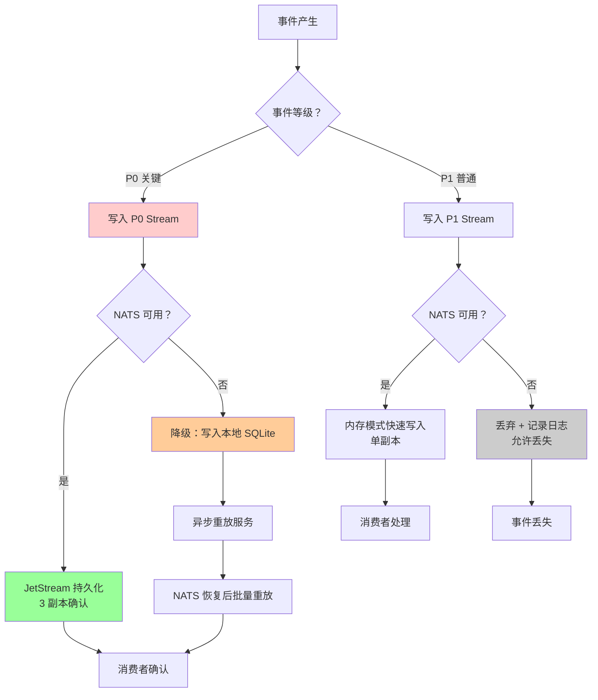
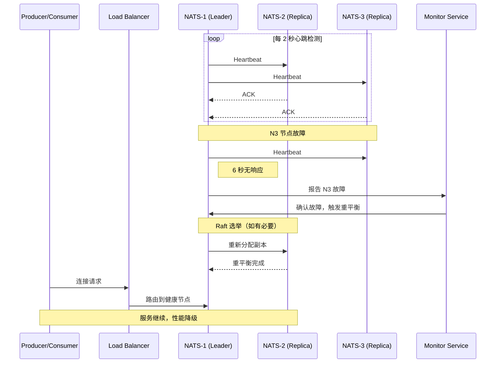
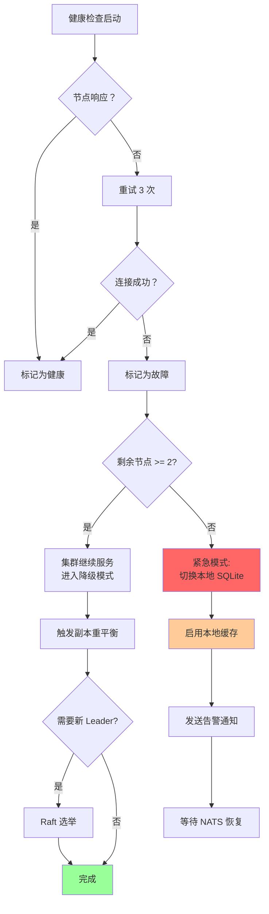
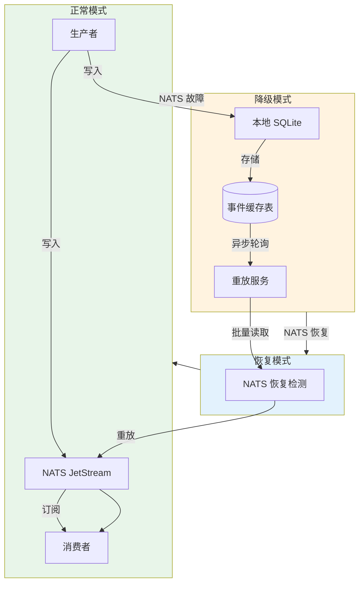
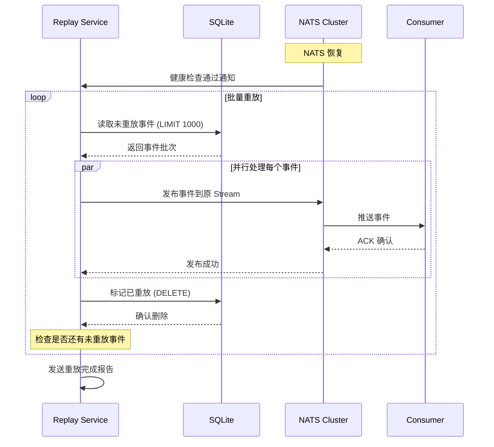
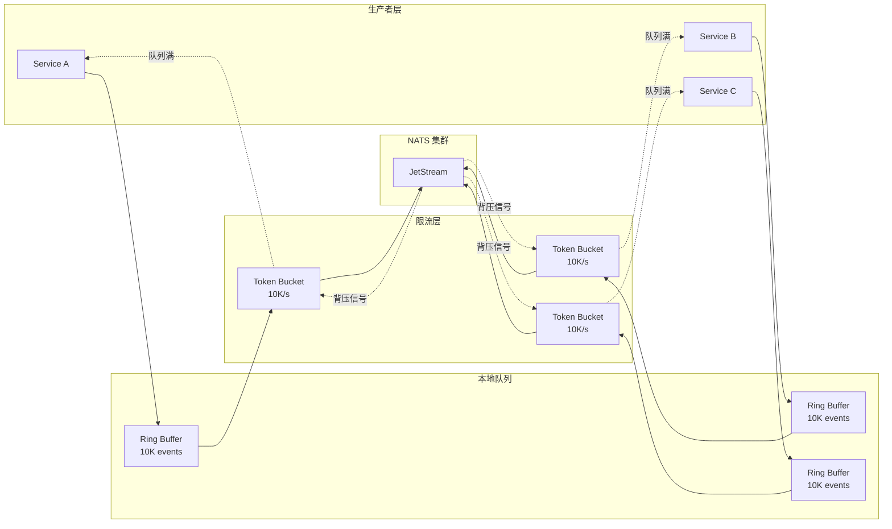
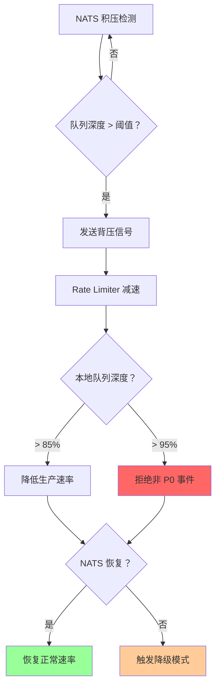

# Orion 平台 NATS 事件总线高可用方案设计

## 1. 背景与目标

### 1.1 问题陈述

当前 Orion 平台事件总线采用单节点 NATS 服务，存在以下风险：

- **单点故障**：NATS 服务宕机导致整个事件系统瘫痪
- **无故障切换**：缺乏自动故障检测和切换机制
- **数据丢失风险**：未持久化的事件在故障时丢失
- **背压缺失**：生产者可能压垮 NATS 服务

### 1.2 设计目标

| 目标 | 指标 |
|------|------|
| 可用性 | 99.99%（年停机时间 < 52 分钟）|
| 故障切换时间 | < 5 秒 |
| 数据持久化 | P0 事件零丢失 |
| 吞吐量 | ≥ 100K msg/s（单分区）|
| 降级恢复 | 本地缓存支持 ≥ 100K 事件，恢复后 30 分钟内重放完成 |

---

## 2. NATS JetStream 集群架构

### 2.1 集群配置

```
┌─────────────────────────────────────────────────────────────────────────┐
│                           NATS JetStream Cluster                        │
│  ┌─────────────┐    ┌─────────────┐    ┌─────────────┐                 │
│  │   Node-1    │    │   Node-2    │    │   Node-3    │                 │
│  │  (Leader)   │◄──►│  (Replica)  │◄──►│  (Replica)  │                 │
│  │  Rack-A     │    │  Rack-B     │    │  Rack-C     │                 │
│  └──────┬──────┘    └──────┬──────┘    └──────┬──────┘                 │
│         │                  │                  │                         │
│         └──────────────────┼──────────────────┘                         │
│                            │                                            │
│                    ┌───────▼───────┐                                   │
│                    │   Load Balancer                                    │
│                    │   (VIP/Haproxy)                                    │
│                    └───────┬───────┘                                   │
└────────────────────────────┼───────────────────────────────────────────┘
                             │
              ┌──────────────┼──────────────┐
              │              │              │
     ┌────────▼────────┐    │    ┌────────▼────────┐
     │   Producers     │    │    │   Consumers     │
     │   (Services)    │    │    │   (Workers)     │
     └─────────────────┘    │    └─────────────────┘
                            │
              ┌─────────────▼──────────────┐
              │    Fallback: Local SQLite  │
              │    (当 NATS 不可用时)        │
              └────────────────────────────┘
```

### 2.2 集群参数配置

| 参数 | 配置值 | 说明 |
|------|--------|------|
| 节点数 | 3 | 奇数节点避免脑裂，支持 1 节点故障 |
| 副本数 (Replicas) | 3 | 每个 Stream 数据复制 3 份 |
| 仲裁写入 | 2 | 写入成功需 2 节点确认 (N/2+1) |
| 心跳间隔 | 2 秒 | 节点间健康检查频率 |
| 故障判定 | 3 次心跳 | 6 秒无响应判定节点故障 |
| Leader 选举 | Raft 算法 | 1 秒内完成选举 |

### 2.3 节点部署策略

```
可用区 A (Rack-A)     可用区 B (Rack-B)     可用区 C (Rack-C)
      │                    │                    │
      ▼                    ▼                    ▼
  ┌─────────┐          ┌─────────┐          ┌─────────┐
  │ NATS-1  │          │ NATS-2  │          │ NATS-3  │
  │ Leader  │          │ Replica │          │ Replica │
  │         │          │         │          │         │
  │  JetStream         │  JetStream         │  JetStream
  │  Storage           │  Storage           │  Storage │
  └─────────┘          └─────────┘          └─────────┘
      │                    │                    │
      └────────────────────┼────────────────────┘
                           │
                  ┌────────▼────────┐
                  │   Cluster Bus   │
                  │   (Gossip 协议)  │
                  └─────────────────┘
```

**部署原则**：
- 跨可用区部署，避免单点故障域
- 每节点独立存储（SSD），避免共享存储成为瓶颈
- 节点间网络延迟 < 5ms（同数据中心内）

---

## 3. Stream 分区策略

### 3.1 分区维度

采用**复合分区策略**：租户优先，事件类型次之。

```
Stream 层级结构：

ORION-PLATFORM (Root)
│
├── TENANT-{id} (按租户分区)
│   │
│   ├── EVENTS-ALERTS    (告警事件)
│   ├── EVENTS-AUDIT     (审计事件)
│   ├── EVENTS-METRICS   (指标事件)
│   └── EVENTS-BUSINESS  (业务事件)
│
└── SYSTEM (系统级事件)
    ├── CLUSTER-HEALTH
    └── PLATFORM-ALERTS
```

### 3.2 Stream 配置模板

| Stream 名称 | 分区键 | 副本数 | 保留策略 | 最大消息数 | 适用事件等级 |
|-------------|--------|--------|----------|------------|--------------|
| `TENANT-{id}-P0` | tenant_id + event_type | 3 | Interest | 无限制 | P0（必须投递）|
| `TENANT-{id}-P1` | tenant_id | 1 | Limits (7d) | 1M | P1（可丢失）|
| `SYSTEM-P0` | event_type | 3 | Interest | 无限制 | P0 系统事件 |

### 3.3 事件分类与路由



### 3.4 事件等级定义

| 等级 | 描述 | 投递保证 | 示例 |
|------|------|----------|------|
| **P0** | 关键业务事件 | 至少一次 (At-Least-Once) | 支付完成、订单创建、安全告警 |
| **P1** | 普通业务事件 | 最多一次 (At-Most-Once) | 用户登录日志、UI 操作记录 |
| **P2** | 可丢弃事件 | 尽力而为 (Best-Effort) | 调试信息、临时通知 |

---

## 4. 故障检测与自动切换

### 4.1 故障检测机制



### 4.2 故障切换流程



### 4.3 切换时间指标

| 阶段 | 目标时间 | 说明 |
|------|----------|------|
| 故障检测 | ≤ 6 秒 | 3 次心跳失败（2 秒间隔）|
| Leader 选举 | ≤ 1 秒 | Raft 协议选举 |
| 副本重平衡 | ≤ 10 秒 | 数据重新复制 |
| **总切换时间** | **≤ 15 秒** | 从故障到完全恢复 |
| 客户端重连 | ≤ 2 秒 | 连接池自动重连 |

---

## 5. 脑裂处理方案

### 5.1 脑裂场景

```
场景：网络分区导致集群分裂

  ┌─────────────┐         网络分区          ┌─────────────┐
  │   Rack-A    │◄──────X  中断 X─────────►│   Rack-B+C  │
  │   NATS-1    │                          │  NATS-2,3   │
  │  (原 Leader)│                          │             │
  └─────────────┘                          └─────────────┘
       分区 A                                    分区 B
    (1 节点，少数派)                        (2 节点，多数派)
```

### 5.2 处理策略

```mermaid
flowchart TD
    Split[网络分区发生] --> CheckQuorum{本分区节点数?}
    
    CheckQuorum -->|≥ 2 (多数派)| Majority[继续提供服务]
    CheckQuorum -->|1 (少数派)| Minority[停止写入服务]
    
    Majority --> AcceptWrite[接受写入请求]
    Majority --> ElectLeader[选举新 Leader]
    
    Minority --> ReadOnly[仅允许读请求]
    Minority --> LogError[记录错误日志]
    Minority --> AlertOps[发送告警]
    
    NetworkRecover[网络恢复] --> SyncCheck{数据冲突？}
    
    SyncCheck -->|无冲突 | Merge[合并数据]
    SyncCheck -->|有冲突 | Conflict[启动冲突解决]
    
    Conflict --> CompareTS[比较时间戳]
    CompareTS --> KeepNewer[保留较新版本]
    KeepNewer --> AuditLog[记录审计日志]
    AuditLog --> Merge
    
    Merge --> Normal[恢复正常集群]
    
    style Majority fill:#99ff99
    style Minority fill:#ffcccc
    style Conflict fill:#ffcc99
    style Normal fill:#99ff99
```

### 5.3 脑裂解决原则

| 原则 | 实现方式 |
|------|----------|
| **多数派优先** | 只有≥2 节点的分区可选举 Leader |
| **少数派只读** | 少数派分区拒绝写入，避免数据分歧 |
| **时间戳决断** | 网络恢复后，以较新版本为准 |
| **审计追踪** | 所有冲突解决记录审计日志 |
| **人工介入** | P0 事件冲突触发人工审核流程 |

---

## 6. 降级方案

### 6.1 降级架构



### 6.2 SQLite 缓存设计

| 配置项 | 值 | 说明 |
|--------|-----|------|
| 最大缓存容量 | 100K 事件 | 约 500MB 存储空间 |
| 写入模式 | WAL（预写日志）| 崩溃安全，快速恢复 |
| 分表策略 | 按租户分表 | `events_{tenant_id}` |
| 清理策略 | 重放后删除 | 确认投递后清理 |
| 压缩策略 | 7 天自动过期 | 防止磁盘爆满 |

### 6.3 降级触发条件

```
┌─────────────────────────────────────────────────────────────┐
│                    降级触发判断流程                          │
└─────────────────────────────────────────────────────────────┘

  生产者写入事件
       │
       ▼
  ┌─────────────────┐
  │ 尝试写入 NATS   │
  └────────┬────────┘
           │
     ┌─────┴─────┐
     │ 超时/错误？│
     └─────┬─────┘
      否 │  是
         │       ┌──────────────────┐
         │       │ 错误计数器 +1    │
         │       └────────┬─────────┘
         │                │
         │       ┌────────▼─────────┐
         │       │ 连续错误 ≥ 3 次？  │
         │       └────────┬─────────┘
         │           是 │  否
         │              │
         │       ┌──────┴──────┐
         │       │ 触发降级    │
         │       │ 写入 SQLite │
         │       └─────────────┘
         │
         ▼
    正常写入成功
```

### 6.4 重放流程



### 6.5 重放速率控制

| 参数 | 值 | 说明 |
|------|-----|------|
| 批次大小 | 1000 条/批 | 平衡吞吐量与负载 |
| 批次间隔 | 100ms | 避免压垮 NATS |
| 最大并发 | 10 个重放任务 | 限制资源占用 |
| 优先级 | P0 优先 | 按事件等级排序 |
| 暂停阈值 | NATS 延迟>100ms | 自动暂停重放 |

---

## 7. 背压机制

### 7.1 背压架构



### 7.2 背压层级

| 层级 | 阈值 | 动作 |
|------|------|------|
| **软限流** | 队列 > 70% | 增加日志采样率，发送预警 |
| **限流** | 队列 > 85% | 令牌桶限流，P1 事件降级为异步 |
| **拒绝** | 队列 > 95% | 拒绝 P2 事件，返回 429 Too Many Requests |
| **紧急** | NATS 延迟 > 500ms | 切换降级模式，写入 SQLite |

### 7.3 背压传播流程



---

## 8. 吞吐量基准测试目标

### 8.1 测试场景

| 场景 | 目标吞吐量 | 延迟要求 | 说明 |
|------|------------|----------|------|
| **单分区写入** | 100K msg/s | P99 < 10ms | 单 Stream 基准 |
| **多分区并发** | 500K msg/s | P99 < 50ms | 10 分区并行 |
| **故障切换** | 无丢失 | 切换时间 < 15s | 模拟节点宕机 |
| **降级重放** | 10K msg/s | 不影响正常写入 | SQLite 重放场景 |
| **混合负载** | 300K msg/s | P0: P99 < 20ms<br/>P1: P99 < 100ms | P0/P1 混合 |

### 8.2 测试配置

```
测试环境配置：
├── NATS 集群：3 节点，每节点 8C16G，SSD
├── 网络：万兆以太网，延迟 < 1ms
├── 生产者：10 个并发客户端
├── 消费者：20 个并发订阅者
├── 消息大小：1KB 有效负载
└── 测试时长：30 分钟持续压测
```

### 8.3 监控指标

| 指标 | 告警阈值 | 说明 |
|------|----------|------|
| 发布延迟 P99 | > 100ms | 写入延迟过高 |
| 消费延迟 P99 | > 500ms | 消费积压 |
| 队列深度 | > 10K | 背压触发 |
| 副本同步延迟 | > 1s | 数据不一致风险 |
| 磁盘使用率 | > 80% | 存储告警 |
| 连接数 | > 10K | 连接池耗尽风险 |

---

## 9. 实施路线图

| 阶段 | 内容 | 优先级 |
|------|------|--------|
| **Phase 1** | NATS JetStream 3 节点集群部署 | P0 |
| **Phase 2** | Stream 分区与事件分类实现 | P0 |
| **Phase 3** | 故障检测与自动切换 | P0 |
| **Phase 4** | SQLite 降级方案实现 | P1 |
| **Phase 5** | 背压机制与限流 | P1 |
| **Phase 6** | 基准测试与调优 | P2 |

---

## 10. 附录：Mermaid 图表汇总

本文档包含以下 Mermaid 图表，可直接在支持 Mermaid 的编辑器中渲染：

1. **集群架构图** - 第 2.1 节
2. **节点部署策略** - 第 2.3 节
3. **事件分类与路由** - 第 3.3 节
4. **故障检测序列图** - 第 4.1 节
5. **故障切换流程** - 第 4.2 节
6. **脑裂处理流程** - 第 5.2 节
7. **降级架构** - 第 6.1 节
8. **重放流程序列图** - 第 6.4 节
9. **背压架构** - 第 7.1 节
10. **背压传播流程** - 第 7.3 节
