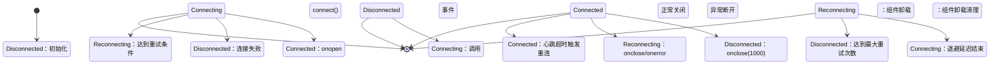
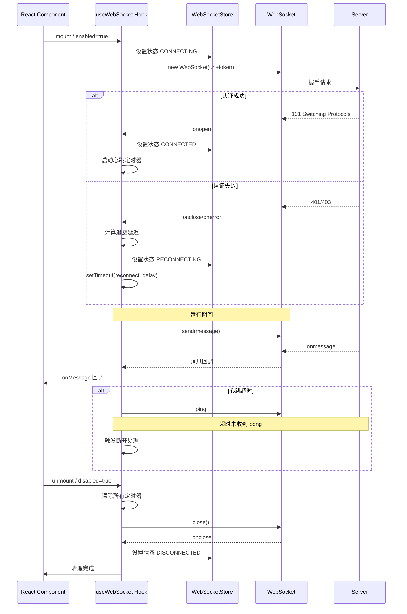
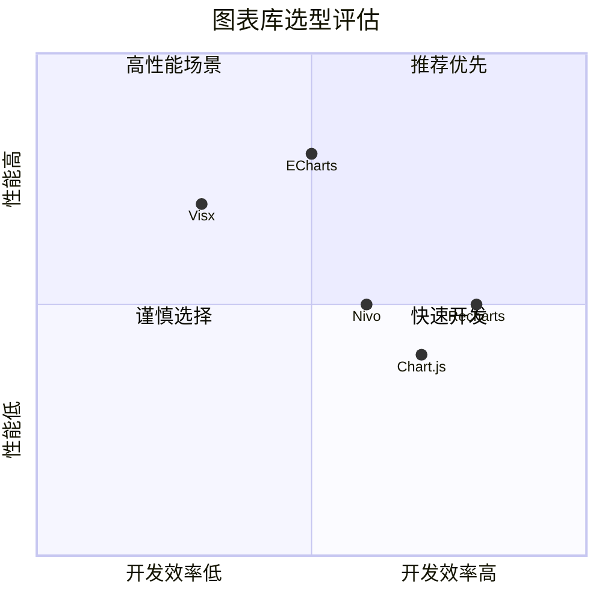
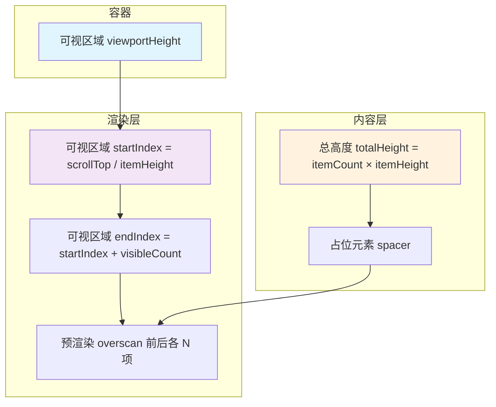
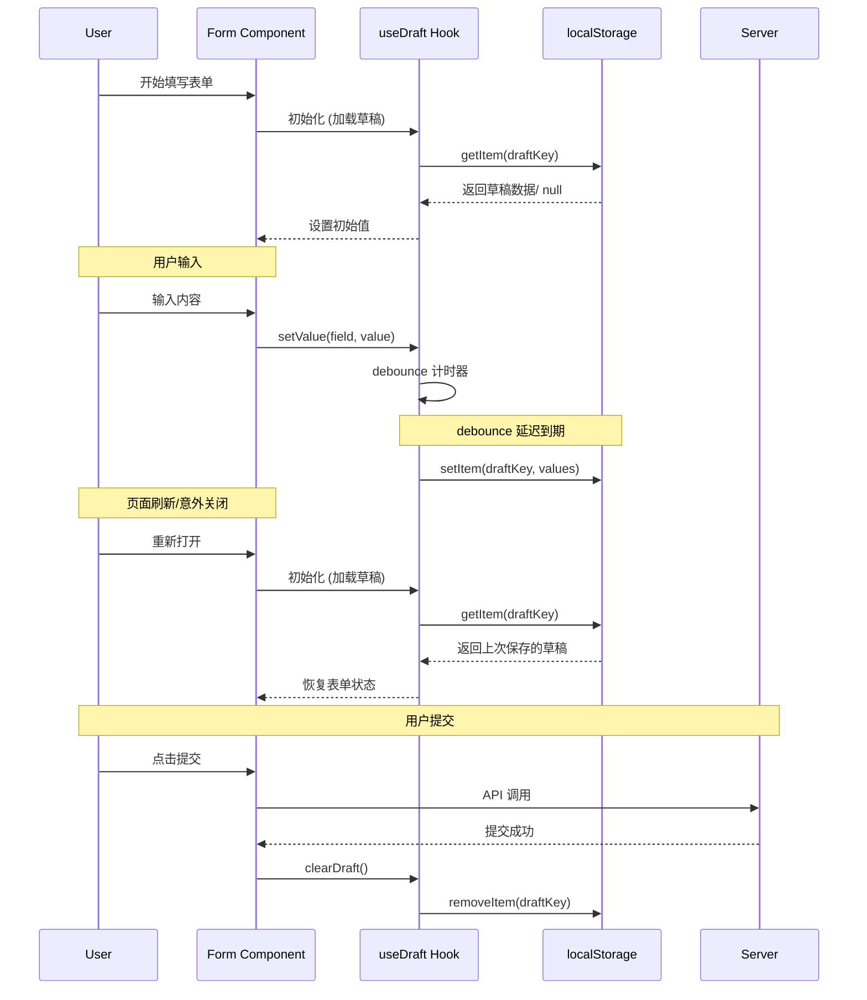
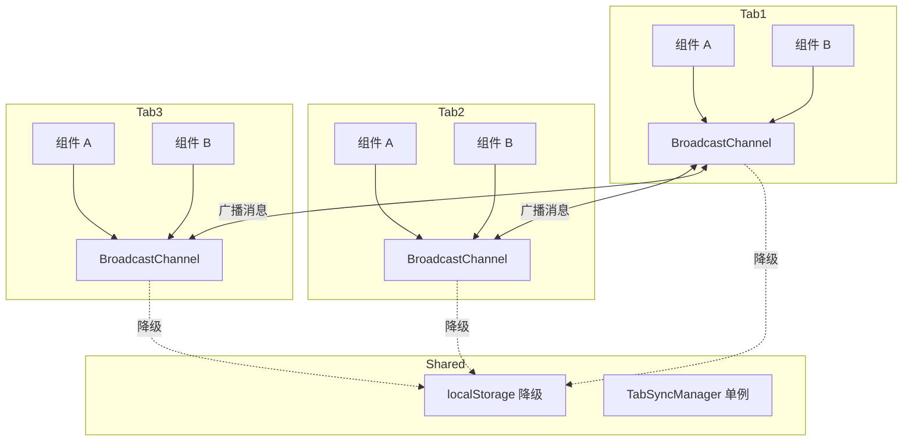
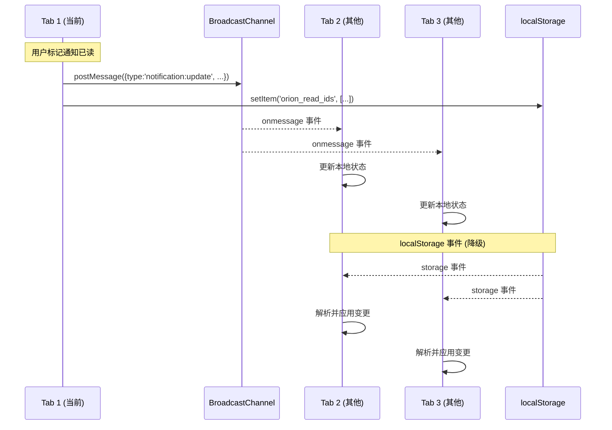

# Orion 平台前端性能优化设计

> 版本：v1.0  
> 创建日期：2026-04-10  
> 最后更新：2026-04-10  
> 负责人：前端团队  
> 适用范围：React 18 + TypeScript 项目

---

## 一、概述

### 1.1 背景

前端架构师评审发现 Orion 平台存在 5 个 P0 级别的性能缺陷：

| 缺陷 | 影响页面 | 严重等级 |
|------|----------|----------|
| WebSocket 内存泄漏 | 03-Pipeline-Run-Details | P0 |
| 图表渲染卡顿 | 06-Efficiency-Dashboard | P0 |
| 虚拟滚动缺失 | 01-Pipeline-List | P0 |
| 表单持久化缺失 | 04-Approval-Workbench | P0 |
| 多 Tab 状态同步缺失 | 05-Notification-Center | P0 |

### 1.2 设计目标

- 消除内存泄漏，确保长时间运行稳定
- 提升大数据量场景下的渲染性能
- 提供流畅的用户交互体验
- 保证多标签页状态一致性
- 防止用户数据丢失

---

## 二、WebSocket 生命周期管理

### 2.1 适用页面

- **03-Pipeline-Run-Details**：实时日志流接收
- **06-Efficiency-Dashboard**：实时指标更新
- **05-Notification-Center**：实时通知推送

### 2.2 连接生命周期状态机



### 2.3 组件生命周期与 WebSocket 绑定



### 2.4 连接建立流程

1. **Token 获取**
   - 从 Zustand Auth Store 获取当前有效 Token
   - Token 即将过期（<5 分钟）时触发刷新
   - Token 无效时返回 null，终止连接

2. **URL 构建**
   - 将 Token 作为 query 参数附加到 WebSocket URL
   - 格式：`wss://api.example.com/ws?token=<encoded_token>`

3. **连接建立**
   - 创建原生 WebSocket 实例
   - 设置 onopen/onclose/onerror/onmessage 处理器
   - 状态变更为 CONNECTING

4. **连接成功处理**
   - 重置重连计数器
   - 状态变更为 CONNECTED
   - 启动心跳机制
   - flush 消息队列中的待发送消息

### 2.5 重连机制

采用**指数退避 + 随机抖动**算法：

| 参数 | 默认值 | 说明 |
|------|--------|------|
| initialDelay | 1000ms | 初始重连延迟 |
| maxDelay | 30000ms | 最大延迟上限 |
| multiplier | 2 | 指数增长倍数 |
| jitter | 0.2 | ±20% 随机抖动 |
| maxAttempts | 10 | 最大重试次数 |

**延迟计算公式：**
```
delay = min(initialDelay × 2^attempt, maxDelay) × (1 ± random × jitter)
```

**重连序列示例：**
```
尝试 1: 1s  (800ms - 1200ms)
尝试 2: 2s  (1.6s - 2.4s)
尝试 3: 4s  (3.2s - 4.8s)
尝试 4: 8s  (6.4s - 9.6s)
尝试 5: 16s (12.8s - 19.2s)
尝试 6+: 30s (上限)
```

### 2.6 心跳保活机制

| 参数 | 默认值 | 说明 |
|------|--------|------|
| interval | 30000ms | 心跳发送间隔 |
| timeout | 10000ms | pong 响应超时 |
| maxMissed | 3 | 最大丢失次数 |

**流程：**
1. 连接成功后启动心跳定时器
2. 每隔 interval 发送 `{"type":"ping","timestamp":xxx}`
3. 启动 timeout 计时器等待 pong 响应
4. 收到 `{"type":"pong"}` 后重置 missed 计数器
5. 连续 maxMissed 次未收到 pong 触发重连

### 2.7 断开处理

**正常断开（码 1000）：**
- 状态变更为 CLOSED
- 不触发重连
- 清理所有资源

**异常断开（其他码）：**
- 检查重连次数是否达到上限
- 未达上限：进入 RECONNECTING 状态，计算退避延迟后重试
- 达到上限：进入 ERROR 状态，通知用户降级处理

**降级策略：**
- SILENT：静默失败（适用于后台连接）
- NOTIFY：Toast 通知用户（适用于前台交互）
- POLLING：降级为 HTTP 轮询（关键业务）

### 2.8 内存泄漏防护

**泄漏点识别与清理：**

| 泄漏点 | 清理时机 | 清理方式 |
|--------|----------|----------|
| WebSocket 实例 | 组件卸载/重连前 | `ws.close()` + `ws = null` |
| 心跳定时器 | 组件卸载/断开时 | `clearInterval()` / `clearTimeout()` |
| 重连定时器 | 组件卸载/连接时 | `clearTimeout()` |
| 消息队列 | 组件卸载时 | `queue.clear()` |
| 事件监听器 | 组件卸载时 | `removeEventListener()` |
| Zustand 订阅 | 组件卸载时 | `unsubscribe()` |

**useEffect 清理模式：**
```typescript
useEffect(() => {
  // 初始化连接
  if (enabled) {
    connect();
  }
  
  // 清理函数 - 确保所有资源释放
  return () => {
    isManualDisconnectRef.current = true;
    clearTimers();      // 清除所有定时器
    messageQueue.clear(); // 清空消息队列
    if (wsRef.current) {
      wsRef.current.close(1000, 'Cleanup');
      wsRef.current = null;
    }
    setConnectionState(ConnectionState.DISCONNECTED);
  };
}, [enabled, url]);
```

---

## 三、图表库选型对比

### 3.1 适用页面

- **06-Efficiency-Dashboard**：多维度效率指标展示
- **03-Pipeline-Run-Details**：执行时间趋势图
- **01-Pipeline-List**：成功率统计图

### 3.2 候选图表库对比



### 3.3 详细对比分析

| 维度 | Recharts | ECharts | Visx |
|------|----------|---------|------|
| **渲染引擎** | SVG | SVG + Canvas | SVG |
| **包体积 (gzip)** | ~180KB | ~250KB | ~50KB (核心) |
| **学习曲线** | 低 | 中 | 高 |
| **TypeScript 支持** | 优秀 | 良好 | 优秀 |
| **React 集成** | 原生 | 封装组件 | 底层原语 |
| **动画支持** | 内置 | 丰富 | 需自行实现 |
| **大数据渲染** | 一般 (千级) | 优秀 (万级) | 良好 (千级) |
| **自定义能力** | 中 | 高 | 极高 |
| **文档质量** | 优秀 | 良好 | 一般 |
| **社区活跃度** | 高 | 极高 | 中 |

### 3.4 性能基准测试（参考）

| 场景 | 数据量 | Recharts | ECharts | Visx |
|------|--------|----------|---------|------|
| 折线图 | 100 点 | 12ms | 8ms | 10ms |
| 折线图 | 1000 点 | 85ms | 25ms | 60ms |
| 折线图 | 10000 点 | 800ms | 120ms | 500ms |
| 柱状图 | 100 点 | 15ms | 10ms | 12ms |
| 柱状图 | 1000 点 | 120ms | 35ms | 80ms |
| 散点图 | 5000 点 | 600ms | 80ms | 400ms |

### 3.5 图表库选型建议

**06-Efficiency-Dashboard 场景特点：**
- 多图表并存（6-8 个图表）
- 数据量中等（百级数据点）
- 需要实时更新（WebSocket 推送）
- 复杂交互（缩放、筛选、下钻）

**推荐方案：ECharts**

**理由：**
1. **Canvas 渲染模式**：大数据量下性能优势明显
2. **内置优化**：自动降采样、视口裁剪
3. **丰富图表类型**：满足复杂业务需求
4. **成熟生态**：问题响应及时，文档齐全
5. **按需引入**：支持 Tree Shaking 减小体积

**备选方案：Recharts**
- 适用于简单图表场景
- 开发效率更高
- 与 React 生态融合更好

### 3.6 图表渲染优化策略

**1. 数据层面优化：**
- 后端预聚合：时间序列数据按视口粒度聚合
- 前端降采样：LTTB (Largest-Triangle-Three-Buckets) 算法
- 增量更新：仅更新变化的数据点

**2. 渲染层面优化：**
- 视口裁剪：仅渲染可视区域数据
- 分层渲染：静态层 (SVG) + 动态层 (Canvas)
- 节流更新：滚动/缩放时限制渲染频率

**3. 组件层面优化：**
- 图表懒加载：可视区域外图表延迟渲染
- 骨架屏占位：加载时展示占位符
- 错误边界：单个图表失败不影响整体

---

## 四、虚拟滚动实现方案

### 4.1 适用页面

- **01-Pipeline-List**：Pipeline 列表（千级数据）
- **03-Pipeline-Run-Details**：日志查看器（万级行）
- **05-Notification-Center**：通知列表（千级数据）

### 4.2 虚拟滚动原理



### 4.3 核心计算逻辑

**参数定义：**
- `itemHeight`: 单项高度（固定或预估）
- `viewportHeight`: 容器可视高度
- `scrollTop`: 当前滚动位置
- `overscan`: 预渲染数量（默认 5）

**计算公式：**
```
startIndex = floor(scrollTop / itemHeight)
visibleCount = ceil(viewportHeight / itemHeight)
endIndex = min(startIndex + visibleCount, totalItems)

renderStart = max(0, startIndex - overscan)
renderEnd = min(totalItems, endIndex + overscan)

offsetTop = renderStart × itemHeight
totalHeight = totalItems × itemHeight
```

### 4.4 列表页实现方案（01-Pipeline-List）

**场景特点：**
- 数据量：1000-5000 条
- 行高固定：48px
- 支持排序、筛选、分页
- 行内操作：展开、暂停、重试

**实现要点：**

1. **表格结构：**
```
┌─────────────────────────────────────────┐
│  表头 (sticky top, z-index: 10)          │
├─────────────────────────────────────────┤
│  ┌─────────────────────────────────┐    │
│  │  视口容器 (overflow: auto)       │    │
│  │  ┌─────────────────────────┐    │    │
│  │  │  总高度占位 ( spacer )   │    │    │
│  │  │  ┌─────────────────┐    │    │    │
│  │  │  │  可视内容层     │    │    │    │
│  │  │  │  (translateY)   │    │    │    │
│  │  │  └─────────────────┘    │    │    │
│  │  └─────────────────────────┘    │    │
│  └─────────────────────────────────┘    │
└─────────────────────────────────────────┘
```

2. **滚动节流：**
- 使用 `requestAnimationFrame` 节流滚动事件
- 避免频繁触发重渲染

3. **动态行高（可选）：**
- 展开行需要测量实际高度
- 使用 `ResizeObserver` 监听高度变化
- 维护行高索引表用于定位

### 4.5 日志查看器实现方案（03-Pipeline-Run-Details）

**场景特点：**
- 数据量：10000+ 行日志
- 行高固定：20px (monospace 字体)
- 实时追加：WebSocket 推送新日志
- 功能需求：搜索、过滤、自动滚动

**实现要点：**

1. **双向虚拟滚动：**
```
┌─────────────────────────────────────┐
│  [时间过滤] [级别过滤] [搜索...]     │
├─────────────────────────────────────┤
│  │  10:23:45 [INFO] Starting...     │
│  │  10:23:46 [DEBUG] Loading...     │
│  │  ... (可视区域) ...              │
│  │  10:24:30 [ERROR] Failed!        │
│  └─────────────────────────────────┘
│  共 15,234 条日志 │ [自动滚动: ON]   │
└─────────────────────────────────────┘
```

2. **日志追加优化：**
- 用户在顶部查看历史时：禁止自动滚动
- 用户在底部查看实时日志：自动滚动到底部
- 使用 `useRef` 存储日志，避免频繁状态更新
- 批量追加：累积多条日志后一次性更新

3. **搜索高亮：**
- 预建立关键词索引
- 虚拟滚动中仅渲染匹配项及其上下文
- 高亮使用 `dangerouslySetInnerHTML` 或标记组件

### 4.6 性能指标

| 指标 | 目标值 | 测量方式 |
|------|--------|----------|
| 初始渲染时间 | < 100ms | React DevTools Profiler |
| 滚动帧率 | > 60fps | Chrome DevTools Performance |
| 内存占用 | < 50MB | Chrome DevTools Memory |
| 支持最大数据量 | 100,000+ | 压力测试 |

### 4.7 滚动位置保持

**问题：** 数据刷新后滚动位置丢失

**解决方案：**
1. 刷新前记录 `scrollTop` 或首项 ID
2. 刷新后恢复滚动位置
3. 使用 `data-index` 或 `data-id` 定位

---

## 五、表单草稿持久化

### 5.1 适用页面

- **04-Approval-Workbench**：审批意见填写
- **03-Pipeline-Run-Details**：参数配置表单
- **06-Efficiency-Dashboard**：筛选条件表单

### 5.2 持久化流程图



### 5.3 核心机制设计

### 5.3.1 Debounce 策略

**配置参数：**

| 参数 | 默认值 | 说明 |
|------|--------|------|
| wait | 1000ms | 防抖等待时间 |
| maxWait | 10000ms | 最大等待时间 |
| leading | false | 是否立即执行 |

**算法逻辑：**
```
输入事件 --> 清除旧定时器 --> 设置新定时器 (wait)
                    ↓
            等待期间再次输入 --> 重置定时器
                    ↓
            等待到期 --> 执行保存
```

**边界情况处理：**
- 用户快速连续输入：只保存最后一次
- 用户长时间输入：每隔 maxWait 强制保存一次
- 页面 unload：立即保存当前值

### 5.3.2 存储键设计

**键名格式：**
```
orion_draft_<pageId>_<formId>_<userId>
```

**示例：**
```
orion_draft_approval_workbench_comment_user_123
orion_draft_pipeline_config_params_user_123
```

**数据结构：**
```json
{
  "values": { /* 表单值 */ },
  "meta": {
    "version": 1,
    "savedAt": 1712736000000,
    "schemaVersion": "v1.0"
  }
}
```

### 5.3.3 存储容量管理

**限制：**
- localStorage 单域限额：5-10MB
- 单个草稿建议：< 100KB

**清理策略：**
1. 提交成功后自动删除对应草稿
2. 启动时清理超过 7 天的草稿
3. 存储接近限额时清理最久未使用的草稿

### 5.4 用户体验设计

### 5.4.1 草稿提示

**状态提示：**
```
┌─────────────────────────────────────────┐
│  [草稿已自动保存 10:23]     [清除草稿]  │
└─────────────────────────────────────────┘
```

**恢复提示（检测到草稿）：**
```
┌─────────────────────────────────────────┐
│  检测到未完成的草稿                      │
│  上次保存：10 分钟前                     │
│                                         │
│  [恢复草稿]  [放弃草稿]                  │
└─────────────────────────────────────────┘
```

### 5.4.2 提交确认

**有草稿时提交：**
```
┌─────────────────────────────────────────┐
│  提交成功！                              │
│  已自动清除草稿                          │
└─────────────────────────────────────────┘
```

**提交失败时：**
```
┌─────────────────────────────────────────┐
│  提交失败，草稿已保留                    │
│  错误：网络超时，请重试                  │
│                                         │
│  [重试]  [保存草稿关闭]                  │
└─────────────────────────────────────────┘
```

### 5.5 与表单验证集成

**执行顺序：**
```
用户输入 --> debounce --> 验证 --> 保存草稿
                ↓
        onChange/onBlur 触发
                ↓
        实时验证反馈
```

**注意事项：**
- 草稿保存不等待验证完成
- 验证错误不影响草稿保存
- 恢复草稿时重新触发验证

---

## 六、多 Tab 状态同步

### 6.1 适用页面

- **05-Notification-Center**：通知已读状态同步
- **04-Approval-Workbench**：审批状态同步
- **全局**：认证状态同步（登出、Token 刷新）

### 6.2 技术选型

| 方案 | 优点 | 缺点 | 选用场景 |
|------|------|------|----------|
| BroadcastChannel | 原生支持、实时 | 不支持跨域、旧浏览器 | 首选 |
| localStorage | 兼容性好 | 非实时、有延迟 | 降级方案 |
| SharedWorker | 功能强大 | 复杂、兼容性一般 | 不选用 |
| postMessage | 灵活 | 需手动管理引用 | 不选用 |

### 6.3 架构设计



### 6.4 状态同步图



### 6.5 同步场景设计

### 6.5.1 通知已读状态同步

**消息结构：**
```json
{
  "type": "notification:update",
  "payload": {
    "notificationId": "notif_123",
    "action": "read" | "unread" | "delete"
  },
  "timestamp": 1712736000000,
  "sourceTabId": "tab_1712736000000_abc123"
}
```

**处理逻辑：**
1. 当前 Tab 用户操作
2. 更新本地 Zustand Store
3. 写入 localStorage 持久化
4. BroadcastChannel 广播
5. 其他 Tab 接收消息，更新本地状态

### 6.5.2 审批状态同步

**消息结构：**
```json
{
  "type": "approval:update",
  "payload": {
    "approvalId": "appr_456",
    "action": "approved" | "rejected" | "transferred",
    "actorId": "user_789",
    "newStatus": "approved"
  }
}
```

**处理逻辑：**
1. 审批人提交审批
2. 乐观更新本地状态
3. 广播审批结果
4. 其他 Tab 收到消息后：
   - 检查是否为同一审批单
   - 更新进度指示器
   - 更新操作按钮状态（已处理则禁用）

### 6.5.3 认证状态同步

**消息结构：**
```json
{
  "type": "auth:change",
  "payload": {
    "event": "login" | "logout" | "refresh",
    "token": "xxx",
    "expiresAt": 1712736000000
  }
}
```

**处理逻辑：**
1. 用户登录/登出/刷新 Token
2. 更新 Auth Store
3. 广播认证状态
4. 其他 Tab 收到消息后：
   - logout: 清除 token，跳转到登录页
   - login: 存储 token，刷新页面
   - refresh: 更新 token，继续操作

### 6.6 冲突处理

**问题：** 多 Tab 同时修改同一资源

**解决方案：**

1. **乐观更新 + 服务端确认：**
   - 本地立即更新 UI
   - 发送请求到服务端
   - 服务端返回最新状态
   - 以服务端为准校正本地状态

2. **版本号机制：**
   - 每个资源带 version 字段
   - 同步时检查版本号
   - 仅当远程版本 >= 本地版本时接受

3. **最后写入优先：**
   - 消息带 timestamp
   - 忽略旧消息
   - 仅应用更新的消息

### 6.7 资源清理

**清理时机：**
- 页面卸载时关闭 BroadcastChannel
- 定期清理 localStorage 过期数据
- 组件卸载时取消订阅

**Tab ID 生成：**
```
tab_<timestamp>_<random_string>
示例：tab_1712736000000_abc123
```

---

## 七、Design Tokens 补充

### 7.1 动画 Tokens

**目的：** 统一动画时长和效果，提供一致的视觉体验

```
┌─────────────────────────────────────────────────────┐
│  Animation Tokens                                    │
├─────────────────────────────────────────────────────┤
│                                                      │
│  Duration (持续时间)                                 │
│  ─────────────────────────────────────────────────   │
│  --animation-duration-instant: 0ms       即时       │
│  --animation-duration-fast: 100ms        快速反馈   │
│  --animation-duration-normal: 200ms      常规动画   │
│  --animation-duration-slow: 300ms        强调动画   │
│  --animation-duration-slower: 500ms      大型动画   │
│                                                      │
│  Easing (缓动函数)                                   │
│  ─────────────────────────────────────────────────   │
│  --animation-easing-linear: linear       匀速       │
│  --animation-easing-ease: ease           默认       │
│  --animation-easing-ease-in: ease-in     加速       │
│  --animation-easing-ease-out: ease-out   减速       │
│  --animation-easing-ease-in-out: ease-in-out 加减速 │
│                                                      │
│  Custom Bezier (自定义贝塞尔)                        │
│  ─────────────────────────────────────────────────   │
│  --animation-easing-smooth: cubic-bezier(0.4, 0, 0.2, 1)  │
│  --animation-easing-bounce: cubic-bezier(0.68, -0.55, 0.265, 1.55) │
│                                                      │
└─────────────────────────────────────────────────────┘
```

### 7.2 层级 Tokens

**目的：** 统一 z-index 层级，避免层级混乱

```
┌─────────────────────────────────────────────────────┐
│  Layer Tokens (z-index)                              │
├─────────────────────────────────────────────────────┤
│                                                      │
│  --z-index-base: 0           基础层                  │
│  --z-index-dropdown: 100     下拉菜单               │
│  --z-index-sticky: 200       吸顶元素               │
│  --z-index-fixed: 300        固定元素               │
│  --z-index-overlay: 400      遮罩层                 │
│  --z-index-modal: 500        模态框                 │
│  --z-index-popover: 600      弹出框                 │
│  --z-index-tooltip: 700      提示框                 │
│  --z-index-toast: 800        通知提示               │
│                                                      │
└─────────────────────────────────────────────────────┘
```

### 7.3 完整缓动参考

| Token | CSS 值 | 适用场景 |
|-------|--------|----------|
| `--animation-easing-smooth` | `cubic-bezier(0.4, 0, 0.2, 1)` | 通用平滑动画 |
| `--animation-easing-enter` | `cubic-bezier(0.0, 0.0, 0.2, 1)` | 入场动画 |
| `--animation-easing-exit` | `cubic-bezier(0.4, 0.0, 1, 1)` | 退场动画 |
| `--animation-easing-emphasize` | `cubic-bezier(0.05, 0, 0.2, 1)` | 强调动画 |
| `--animation-easing-bounce` | `cubic-bezier(0.68, -0.55, 0.265, 1.55)` | 弹性效果 |

### 7.4 使用示例

```css
/* 按钮悬停反馈 */
.button {
  transition: transform var(--animation-duration-fast) var(--animation-easing-smooth),
              background-color var(--animation-duration-fast) var(--animation-easing-smooth);
}

/* 模态框入场 */
.modal-enter {
  animation: modalFadeIn var(--animation-duration-slow) var(--animation-easing-enter);
}

/* 通知滑入 */
.toast-slide-in {
  animation: slideIn var(--animation-duration-normal) var(--animation-easing-bounce);
}

/* 下拉菜单 */
.dropdown {
  z-index: var(--z-index-dropdown);
}

/* Tooltip */
.tooltip {
  z-index: var(--z-index-tooltip);
}
```

---

## 八、实施计划

### 8.1 阶段划分

| 阶段 | 内容 | 预计工时 | 优先级 |
|------|------|----------|--------|
| Phase 1 | WebSocket 生命周期管理 | 3 天 | P0 |
| Phase 2 | 虚拟滚动实现 | 3 天 | P0 |
| Phase 3 | 图表库迁移 | 5 天 | P0 |
| Phase 4 | 表单持久化 | 2 天 | P0 |
| Phase 5 | 多 Tab 同步 | 2 天 | P0 |
| Phase 6 | Design Tokens 补充 | 1 天 | P1 |

### 8.2 验收标准

| 缺陷 | 验收标准 |
|------|----------|
| WebSocket 内存泄漏 | 连续运行 24 小时，内存增长 < 50MB |
| 图表渲染卡顿 | 大数据量下 FPS > 30 |
| 虚拟滚动缺失 | 10000 条数据滚动 FPS > 55 |
| 表单持久化缺失 | 刷新后草稿恢复率 100% |
| 多 Tab 同步缺失 | 状态同步延迟 < 500ms |

---

## 九、附录

### 9.1 文件结构

```
src/
├── hooks/
│   ├── useWebSocket.ts          # WebSocket Hook
│   ├── useVirtualList.ts        # 虚拟滚动 Hook
│   ├── useDraft.ts              # 表单草稿 Hook
│   └── useTabSync.ts            # 多 Tab 同步 Hook
├── stores/
│   ├── authStore.ts             # 认证状态
│   ├── webSocketStore.ts        # WebSocket 状态
│   ├── notificationStore.ts     # 通知状态
│   └── pipelineStore.ts         # Pipeline 状态
├── utils/
│   ├── TabSyncManager.ts        # 多 Tab 同步管理器
│   ├── formValidation.ts        # 表单验证
│   └── messageQueue.ts          # 消息队列
├── components/
│   ├── VirtualList/             # 虚拟列表组件
│   ├── WebSocketErrorBoundary/  # 错误边界
│   └── charts/                  # 图表组件
└── tokens/
    └── design-tokens.css        # Design Tokens
```

### 9.2 依赖清单

```json
{
  "dependencies": {
    "zustand": "^4.5.0",
    "echarts": "^5.5.0",
    "echarts-for-react": "^3.0.2"
  }
}
```

### 9.3 参考文档

- [WebSocket API](https://developer.mozilla.org/en-US/docs/Web/API/WebSocket)
- [BroadcastChannel API](https://developer.mozilla.org/en-US/docs/Web/API/BroadcastChannel)
- [ECharts Documentation](https://echarts.apache.org/en/index.html)
- [Zustand Documentation](https://github.com/pmndrs/zustand)

---

_文档版本：v1.0_  
_创建日期：2026-04-10_  
_审核状态：待审核_
