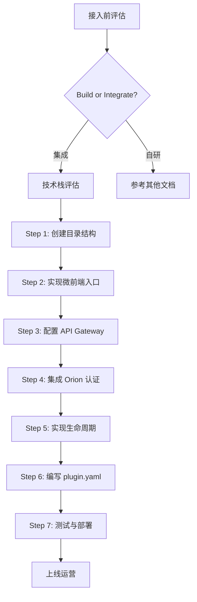

# 外部系统接入指南 (External System Onboarding Guide)

> **文档版本**: v1.0 | **创建日期**: 2026-04-10 | **状态**: ✅ 完成

---

## 一、概述

### 1.1 适用场景

本文档适用于以下场景：

- ✅ 将外部成熟开源系统集成到 Orion 平台（如 orion-visor、orion-knowledge）
- ✅ 将内部独立服务改造为 Orion 插件（如 orion-dba）
- ✅ 开发第三方插件扩展 Orion 功能（Custom Task、AI Skill 等）

### 1.2 前置条件

在开始接入前，请确保：

- [ ] 已阅读 [微服务与微前端架构设计.md](../architecture/微服务与微前端架构设计.md)
- [ ] 已了解 Orion 平台核心架构和 API Gateway 机制
- [ ] 已安装 Node.js >= 16、Go >= 1.19（后端接入需要）
- [ ] 已获取 Orion 平台访问权限和开发环境

### 1.3 接入流程总览



---

## 二、接入前评估

### 2.1 Build vs Integrate 决策树

```
评估维度:
├── 功能成熟度
│   ├── ✅ 已有成熟开源方案 (3k+ stars, 活跃维护) → 集成
│   └── ❌ 无合适方案或需求特殊 → 自研
│
├── 技术栈匹配
│   ├── ✅ 与 Orion 技术栈兼容 (Go/Vue/React) → 集成
│   └── ⚠️ 技术栈差异大但可接受 → 集成 (需额外适配)
│
├── 集成成本
│   ├── ✅ 可独立部署，通过 API 集成 → 集成
│   └── ❌ 需深度修改源码 → 谨慎评估
│
└── 许可证合规
    ├── ✅ Apache-2.0/MIT/BSD → 可集成
    ├── ⚠️ AGPL-3.0 → 需开源修改代码
    └── ❌ 商业许可证 → 不可集成
```

### 2.2 技术栈要求

| 组件 | 推荐技术栈 | 必须支持 | 可选支持 |
|------|-----------|---------|---------|
| **前端** | Vue 3 / React 18 | 支持 UMD 输出、微前端生命周期 | TypeScript、Less/Sass |
| **后端** | Go / Java / Node.js | RESTful API、健康检查 | gRPC、Prometheus 指标 |
| **认证** | - | JWT Token 验证 | SSO/OIDC |
| **部署** | Docker | 容器化部署 | Kubernetes HPA |

---

## 三、接入流程详解

### Step 1: 创建插件目录结构

**标准目录结构**:

```
orion-{name}/
├── backend/                 # 后端代码（可选）
│   ├── cmd/                # 主入口
│   ├── handler/            # 业务逻辑
│   ├── model/              # 数据模型
│   ├── router/             # 路由配置
│   └── go.mod              # Go 依赖管理
├── frontend/                # 前端代码（可选）
│   ├── src/
│   │   ├── apis/           # API 封装
│   │   ├── components/     # 公共组件
│   │   ├── views/          # 页面组件
│   │   ├── main.ts         # 入口文件
│   │   └── App.vue         # 根组件
│   ├── vite.config.ts      # Vite 配置
│   └── package.json
├── scripts/                 # 部署脚本
├── plugin.yaml              # 插件描述文件
├── Dockerfile.backend       # 后端 Dockerfile
├── Dockerfile.frontend      # 前端 Dockerfile
└── README.md
```

**示例**: 参考 [orion-dba](../../orion-dba/) 项目结构

---

### Step 2: 实现微前端入口

**核心要求**: 支持独立运行和微前端嵌入两种模式

**Vue 3 示例** (`main.ts`):

```typescript
import { createApp } from 'vue';
import App from './App.vue';
import router from '@/router';
import Antd from 'ant-design-vue';
import 'ant-design-vue/dist/reset.css';

// 微前端：判断是否运行在 Orion 容器中
const isOrionChild = !!window.__POWERED_BY_ORION__;

// 创建应用实例
function createOrionApp(props: any = {}) {
  const app = createApp(App);
  
  // 注入 Orion 全局状态（如果存在）
  if (props) {
    app.config.globalProperties.$orion = {
      user: props.user,
      permissions: props.permissions,
      token: props.token,
      apiBase: props.apiBase || '/api/v1/db',
    };
  }
  
  app.use(router);
  app.use(Antd);
  
  return app;
}

// 独立运行模式（开发环境）
if (!isOrionChild) {
  const app = createOrionApp();
  app.mount('#app');
  console.log('[orion-plugin] Running in standalone mode');
} else {
  // 微前端子应用模式（生产环境，嵌入 Orion）
  let instance: any = null;
  
  // 生命周期：初始化
  export async function bootstrap() {
    console.log('[orion-plugin] bootstrap');
  }
  
  // 生命周期：挂载
  export async function mount(props: any) {
    console.log('[orion-plugin] mount with props:', props);
    
    instance = createOrionApp(props);
    instance.mount('#orion-plugin-app');
  }
  
  // 生命周期：卸载
  export async function unmount() {
    console.log('[orion-plugin] unmount');
    instance?.unmount();
    instance = null;
  }
}
```

**React 18 示例** (`main.tsx`):

```typescript
import React from 'react';
import ReactDOM from 'react-dom/client';
import App from './App';
import { BrowserRouter } from 'react-router-dom';

const isOrionChild = !!window.__POWERED_BY_ORION__;

function createOrionApp(props: any = {}) {
  return (
    <BrowserRouter>
      <App orion={props} />
    </BrowserRouter>
  );
}

if (!isOrionChild) {
  const root = ReactDOM.createRoot(document.getElementById('root')!);
  root.render(<React.StrictMode><App /></React.StrictMode>);
} else {
  export async function bootstrap() {
    console.log('[orion-plugin] bootstrap');
  }
  
  export async function mount(props: any) {
    const root = ReactDOM.createRoot(document.getElementById('orion-plugin-app')!);
    root.render(<React.StrictMode>{createOrionApp(props)}</React.StrictMode>);
  }
  
  export async function unmount() {
    console.log('[orion-plugin] unmount');
    ReactDOM.unmountComponentAtNode(document.getElementById('orion-plugin-app')!);
  }
}
```

---

### Step 3: 配置 API Gateway 路由

**在 plugin.yaml 中定义路由**:

```yaml
apiVersion: plugin.orion.dev/v1alpha1
kind: Plugin
metadata:
  name: orion-dba
  version: 1.0.0

spec:
  api_gateway:
    routes:
      - path: "/api/v1/db/"
        service: "orion-dba-service"
        strip_prefix: true
        auth: true
        methods: ["GET", "POST", "PUT", "DELETE"]
      
      - path: "/api/v1/db/health"
        service: "orion-dba-service"
        auth: false  # 健康检查无需认证
```

**API Gateway 自动配置示例** (Nginx):

```nginx
location /api/v1/db/ {
    proxy_pass http://orion-dba-service:8090;
    proxy_set_header Host $host;
    proxy_set_header X-Real-IP $remote_addr;
    proxy_set_header X-Orion-Token $http_x_orion_token;
    
    # 健康检查
    location /api/v1/db/health {
        auth_request off;
    }
}
```

---

### Step 4: 集成 Orion 认证

**后端认证中间件** (Go 示例):

```go
// backend/cmd/main.go
func AuthMiddleware() gin.HandlerFunc {
    return func(c *gin.Context) {
        // 微前端模式：使用 X-Orion-Token
        token := c.GetHeader("X-Orion-Token")
        if token == "" {
            // 独立模式：使用 Authorization
            token = strings.TrimPrefix(c.GetHeader("Authorization"), "Bearer ")
        }
        
        if token == "" {
            c.JSON(http.StatusUnauthorized, gin.H{
                "code": 401,
                "message": "Missing authentication token",
            })
            c.Abort()
            return
        }
        
        // 验证 Token（调用 Orion API 或本地验证）
        userInfo, err := verifyOrionToken(token)
        if err != nil {
            c.JSON(http.StatusUnauthorized, gin.H{
                "code": 401,
                "message": "Invalid token: " + err.Error(),
            })
            c.Abort()
            return
        }
        
        // 将用户信息注入上下文
        c.Set("user", userInfo)
        c.Next()
    }
}

func verifyOrionToken(token string) (*UserInfo, error) {
    // 方案 A: 调用 Orion API 验证
    // resp, err := http.Get(orionAPI + "/api/v1/auth/verify?token=" + token)
    
    // 方案 B: 本地 JWT 验证（需共享密钥）
    // claims, err := jwt.Parse(token, ...)
    
    // 方案 C: 反向代理，由 Orion 统一认证
}
```

**前端 API 调用适配**:

```typescript
// src/config/request.ts
import axios from 'axios';

const getOrionConfig = () => {
  const orion = (window as any).$orion || {};
  return {
    token: orion.token || sessionStorage.getItem('jwt'),
    apiBase: orion.apiBase || '/api/v2',
  };
};

const request = axios.create({
  timeout: 200000,
  headers: {
    'Content-Type': 'application/json',
  },
});

request.interceptors.request.use((config) => {
  const { token } = getOrionConfig();
  if (token !== null) {
    // 微前端模式：优先使用 X-Orion-Token
    if (window.__POWERED_BY_ORION__) {
      config.headers['X-Orion-Token'] = token;
    } else {
      config.headers['Authorization'] = `Bearer ${token}`;
    }
  }
  return config;
});

export const getApiBase = () => {
  return getOrionConfig().apiBase;
};

export { request };
```

---

### Step 5: 实现插件生命周期

**plugin.yaml 中的生命周期钩子**:

```yaml
spec:
  hooks:
    pre_install:
      - script: "scripts/pre-install.sh"
        description: "创建数据库表"
        timeout: 300s
    
    post_install:
      - script: "scripts/post-install.sh"
        description: "初始化默认配置"
        timeout: 60s
    
    pre_uninstall:
      - script: "scripts/pre-uninstall.sh"
        description: "备份数据"
        timeout: 300s
    
    post_uninstall:
      - script: "scripts/post-uninstall.sh"
        description: "清理资源"
        timeout: 60s
```

**生命周期脚本示例** (`scripts/pre-install.sh`):

```bash
#!/bin/bash
set -e

echo "Running pre-install hooks..."

# 1. 等待数据库就绪
echo "Waiting for MySQL..."
until mysql -h "$DB_HOST" -u "$DB_USER" -p"$DB_PASSWORD" -e "SELECT 1" &> /dev/null; do
    sleep 1
done

# 2. 执行数据库迁移
echo "Running database migrations..."
./migrate up

# 3. 初始化默认数据
echo "Initializing default data..."
mysql -h "$DB_HOST" -u "$DB_USER" -p"$DB_PASSWORD" "$DB_NAME" < scripts/init-data.sql

echo "Pre-install hooks completed."
```

---

### Step 6: 编写 plugin.yaml 描述文件

**完整示例**:

```yaml
apiVersion: plugin.orion.dev/v1alpha1
kind: Plugin
metadata:
  name: orion-dba
  version: 1.0.0
  displayName: "SQL 审核"
  description: "MySQL SQL 审核/查询/管理平台"
  icon: "/plugins/orion-dba/icon.svg"
  author: "Orion Team"
  license: "Apache-2.0"

spec:
  # 服务配置
  services:
    backend:
      image: registry.company.com/orion/orion-dba-service:1.0.0
      port: 8090
      replicas: 2
      resources:
        cpu: "2"
        memory: "4Gi"
      health_check:
        path: "/api/v1/db/health"
        interval: 30s
        timeout: 10s
    
    frontend:
      image: registry.company.com/orion/orion-dba-app:1.0.0
      port: 3010
      entry: "http://{host}/plugins/orion-dba/app.js"

  # 路由配置
  routes:
    - path: "/dba"
      name: "SQL 审核"
      icon: "Database"
      permission: "dba:access"
      children:
        - path: "/dba/audit"
          name: "SQL 审核"
          permission: "dba:audit"
        - path: "/dba/query"
          name: "SQL 查询"
          permission: "dba:query"

  # 依赖配置
  dependencies:
    services:
      - name: orion-api-gateway
        version: ">=1.0.0"
      - name: orion-platform-service
        version: ">=1.0.0"
    databases:
      - name: mysql
        version: ">=8.0"
    external:
      - name: inception
        version: ">=2.3"

  # 权限配置
  permissions:
    - resource: "dba"
      actions: ["access", "audit", "query", "ticket", "source", "rule"]
      description: "SQL 审核管理权限"

  # 配置项
  config:
    - name: inception.host
      type: string
      required: true
      description: "Inception 服务地址"
    - name: audit.auto_ai_review
      type: boolean
      default: false
      description: "启用 AI 辅助审核"
    - name: query.export_limit
      type: integer
      default: 5000
      description: "查询导出行数限制"
```

---

### Step 7: 测试与部署

**本地开发测试**:

```bash
# 1. 前端独立运行
$ cd frontend
$ yarn install
$ yarn dev
# 访问：http://localhost:3010

# 2. 后端独立运行
$ cd backend
$ go run cmd/main.go
# 访问：http://localhost:8090

# 3. 微前端模式测试
# 在 Orion 基座中添加本地子应用配置
# 访问：http://localhost:3000/dba
```

**Docker 部署**:

```bash
# 1. 构建镜像
$ docker-compose build

# 2. 启动服务
$ docker-compose up -d

# 3. 验证健康检查
$ curl http://localhost:8090/api/v1/db/health
{"status":"ok"}
```

**Kubernetes 部署**:

```bash
# 1. 应用插件配置
$ kubectl apply -f plugin.yaml

# 2. 查看部署状态
$ kubectl get pods -n orion-dba
NAME                              READY   STATUS    RESTARTS   AGE
orion-dba-service-6d4f5b7c8-x2k9  1/1     Running   0          2m
orion-dba-service-6d4f5b7c8-m3n7  1/1     Running   0          2m

# 3. 验证路由
$ curl -H "X-Orion-Token: $TOKEN" http://orion-api/api/v1/db/health
```

---

## 四、检查清单 (Checklist)

### 开发阶段

- [ ] 目录结构符合规范
- [ ] 前端支持独立运行和微前端两种模式
- [ ] 实现完整的生命周期钩子（bootstrap/mount/unmount）
- [ ] 后端 API 支持 Orion Token 认证
- [ ] 配置 API Gateway 路由
- [ ] 编写完整的 plugin.yaml

### 测试阶段

- [ ] 前端独立运行测试通过
- [ ] 后端 API 测试通过
- [ ] 微前端嵌入测试通过
- [ ] 认证集成测试通过
- [ ] 健康检查配置正确
- [ ] 错误处理完善

### 部署阶段

- [ ] Docker 镜像构建成功
- [ ] Kubernetes 部署成功
- [ ] 监控指标暴露（Prometheus）
- [ ] 日志收集配置（Loki/ELK）
- [ ] 告警规则配置

### 文档阶段

- [ ] README.md 完整
- [ ] API 文档完整
- [ ] 部署文档完整
- [ ] 故障排查指南

---

## 五、常见问题 (FAQ)

### Q1: 微前端模式样式冲突怎么办？

**A**: 使用以下方案隔离样式：

1. **CSS Modules**: `import styles from './Component.module.css'`
2. **Scoped CSS**: Vue 组件使用 `<style scoped>`
3. **命名空间**: 全局样式添加前缀 `.orion-dba-`
4. **Shadow DOM**: 极端情况下使用

### Q2: 如何处理跨域问题？

**A**: 通过 API Gateway 统一代理，避免跨域：

```yaml
# API Gateway 配置
routes:
  - path: /api/v1/db/*
    target: orion-dba-service:8090
    cors: true  # 允许跨域
```

### Q3: Token 过期如何处理？

**A**: 前端拦截 401 错误，通知 Orion 基座：

```typescript
request.interceptors.response.use(
  (response) => response,
  (error) => {
    if (error.response?.status === 401) {
      // 微前端模式：通知 Orion 基座
      if (window.__POWERED_BY_ORION__) {
        window.postMessage({ type: 'ORION_SESSION_EXPIRED' }, '*');
      } else {
        // 独立模式：跳转登录页
        router.replace('/login');
      }
    }
    return Promise.reject(error);
  }
);
```

### Q4: 如何共享依赖（如 Vue、React）？

**A**: 使用 Module Federation 共享依赖：

```javascript
// vite.config.ts
export default {
  plugins: [
    federation({
      name: 'orion-dba',
      shared: ['vue', 'ant-design-vue'],
    }),
  ],
};
```

### Q5: 插件如何调用 Orion 核心 API？

**A**: 通过 Orion 全局状态获取 API 基础路径：

```typescript
const apiBase = window.$orion?.apiBase || '/api/v1';
const response = await fetch(`${apiBase}/core/endpoint`);
```

---

## 六、参考文档

- [微服务与微前端架构设计.md](../architecture/微服务与微前端架构设计.md)
- [外部组件集成架构设计.md](../architecture/外部组件集成架构设计.md)
- [微前端开发规范.md](../frontend/micro-frontend-development-guide.md)
- [Plugin SPI 接口设计.md](../adr/ADR-002-Plugin-SPI 接口设计.md)
- [orion-dba 项目示例](../../orion-dba/)

---

_文档版本：v1.0 | 最后更新：2026-04-10 | 维护团队：Orion Platform Team_
