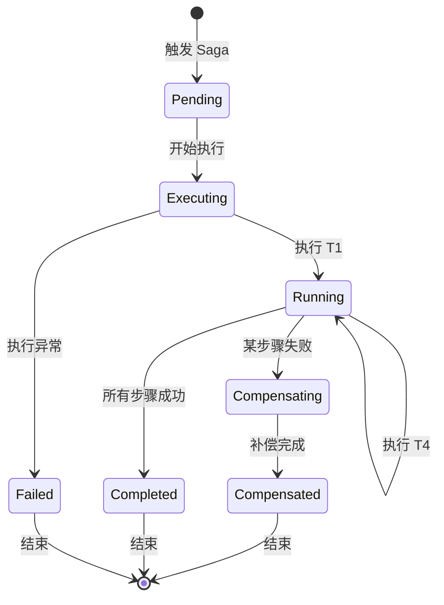
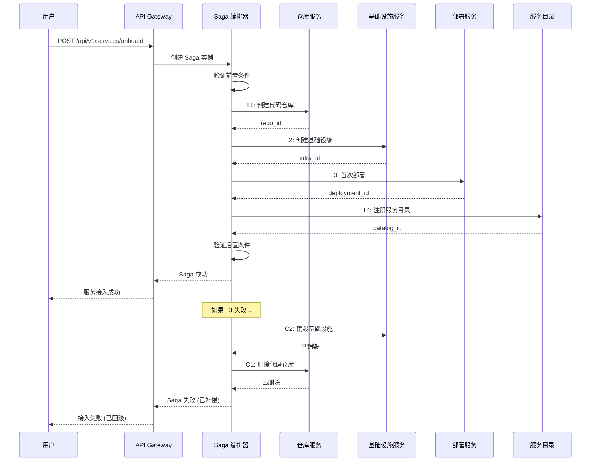

# Orion 分布式事务与数据一致性设计

> 版本：v1.0 | 创建日期：2026-04-10 | 状态：评审中
> 所属模块：M24-事件总线 + M25-数据存储 | 优先级：P0

---

## 一、概述

### 1.1 设计目标

Orion 作为微服务架构平台，存在多个跨服务数据操作场景。本设计旨在解决以下问题：

- **跨服务数据一致性**：Pipeline 完成、服务接入、工单处理等场景的数据一致性保障
- **分布式事务管理**：Saga 模式实现、补偿事务设计、状态机管理
- **幂等性保证**：统一幂等性框架、幂等键生成与验证
- **一致性监控**：对账任务、一致性检查、告警方案
- **一致性级别定义**：各业务场景的最终一致性 vs 强一致性要求

### 1.2 技术选型

| 组件 | 选型 | 说明 |
|------|------|------|
| 分布式事务模式 | Saga + 事件溯源 | 长事务场景用 Saga，状态变更用事件溯源 |
| 幂等性存储 | Redis + PostgreSQL | 热数据用 Redis，冷数据用 PG |
| 一致性监控 | 定时对账任务 + 实时校验 | 关键数据实时校验，非关键数据定时对账 |
| 事件总线 | NATS JetStream | 可靠事件投递，支持事件重放 |

### 1.3 一致性级别定义

Orion 根据业务场景定义 3 级一致性要求：

| 级别 | 名称 | 说明 | 适用场景 | 技术方案 |
|------|------|------|----------|----------|
| **L1** | 强一致性 | 实时一致，不允许数据不一致 | 用户权限、审批状态、财务数据 | 本地事务 + 分布式锁 |
| **L2** | 弱一致性 | 秒级最终一致，允许短暂不一致 | Pipeline 状态、部署记录、工单状态 | Saga + 补偿事务 |
| **L3** | 最终一致性 | 分钟级最终一致，允许延迟 | 效能指标、成本数据、审计日志 | 事件驱动 + 定时对账 |

---

## 二、Saga 模式设计

### 2.1 Saga 模式概述

Saga 是一种长事务管理方案，将长事务拆分为多个本地短事务，每个事务有对应的补偿动作。

```
┌─────────────────────────────────────────────────────────────────────────────┐
│                              Saga 模式原理                                    │
└─────────────────────────────────────────────────────────────────────────────┘

  正常流程:
  ┌─────────┐    ┌─────────┐    ┌─────────┐    ┌─────────┐
  │  T1     │───▶│  T2     │───▶│  T3     │───▶│  T4     │
  │ 构建产物 │    │ 推送镜像 │    │ 更新注册表│    │ 触发部署 │
  └─────────┘    └─────────┘    └─────────┘    └─────────┘

  补偿流程 (T3 失败):
  ┌─────────┐    ┌─────────┐    ┌─────────┐    ┌─────────┐
  │  T1     │───▶│  T2     │───▶│  T3 ❌  │    │  T4 ⏸  │
  └─────────┘    └─────────┘    └─────────┘    └─────────┘
                                       │
                                       ▼
                              ┌─────────────────┐
                              │ C2: 删除镜像     │
                              │ C1: 清理本地产物 │
                              └─────────────────┘
```

### 2.2 关键业务 Saga 设计

#### 2.2.1 Pipeline 完成 Saga

**场景**: Pipeline 执行完成后，需要同步更新多个服务的数据

**参与服务**:
- `orion-pipeline-service`: 更新 PipelineRun 状态
- `orion-platform-service`: 记录审计日志
- `orion-insight-service`: 更新 DORA 指标
- `orion-platform-service` (产物管理): 更新产物状态

**Saga 定义**:

```yaml
saga: pipeline_completion
version: "1.0"
description: "Pipeline 完成后的数据同步"
consistency_level: L2  # 弱一致性，秒级最终一致
timeout: 300s  # 5 分钟超时

steps:
  - id: update_pipeline_status
    name: "更新 PipelineRun 状态"
    service: orion-pipeline-service
    action:
      method: PUT
      path: /api/v1/pipeline-runs/{run_id}/status
      payload:
        status: success
        completed_at: "${timestamp}"
        duration_seconds: "${duration}"
    compensation:
      method: PUT
      path: /api/v1/pipeline-runs/{run_id}/status
      payload:
        status: failed
        compensation_reason: "pipeline_completion_saga_failed"

  - id: record_audit_log
    name: "记录审计日志"
    service: orion-platform-service
    action:
      method: POST
      path: /api/v1/audit-logs
      payload:
        action: "pipeline.completed"
        resource_type: "pipeline_run"
        resource_id: "${run_id}"
        user_id: "${trigger_by}"
        detail:
          status: success
          duration: "${duration}"
    compensation:
      method: DELETE
      path: /api/v1/audit-logs/${audit_log_id}
      # 审计日志通常不删除，标记为无效即可
      payload:
        status: "invalidated"

  - id: update_dora_metrics
    name: "更新 DORA 指标"
    service: orion-insight-service
    action:
      method: POST
      path: /api/v1/dora-metrics/events
      payload:
        team_id: "${team_id}"
        event_type: "deployment"
        timestamp: "${timestamp}"
        pipeline_run_id: "${run_id}"
    compensation:
      method: DELETE
      path: /api/v1/dora-metrics/events/${event_id}

  - id: update_artifact_status
    name: "更新产物状态"
    service: orion-platform-service
    action:
      method: PUT
      path: /api/v1/artifacts/${artifact_id}/status
      payload:
        status: "published"
        published_at: "${timestamp}"
    compensation:
      method: PUT
      path: /api/v1/artifacts/${artifact_id}/status
      payload:
        status: "rollback"
        rollback_reason: "pipeline_completion_saga_failed"

# 事件触发
triggers:
  - event: pipeline.run.completed
    source: orion-pipeline-service

# 错误处理
error_handling:
  retry_policy:
    max_retries: 3
    backoff: exponential
    initial_delay: 1s
    max_delay: 30s
  failure_strategy: compensate  # 失败时执行补偿
```

**状态机**:



#### 2.2.2 服务接入 Saga

**场景**: 零代码服务接入，自动创建代码仓库、基础设施、部署、注册

**参与服务**:
- `orion-pipeline-service`: 创建代码仓库
- `orion-cmdb-service`: 创建基础设施 (K8s/DB/Redis)
- `orion-workflow-service`: 首次部署到 dev 环境
- `orion-cmdb-service`: 注册到服务目录

**Saga 定义**:

```yaml
saga: service_onboarding
version: "1.0"
description: "零代码服务接入流程"
consistency_level: L2
timeout: 600s  # 10 分钟超时

steps:
  - id: create_code_repo
    name: "创建代码仓库"
    service: orion-pipeline-service
    action:
      method: POST
      path: /api/v1/repositories
      payload:
        name: "${service_name}"
        description: "${description}"
        visibility: private
        template: "${language}_microservice_template"
    compensation:
      method: DELETE
      path: /api/v1/repositories/${repo_id}

  - id: create_infrastructure
    name: "创建基础设施"
    service: orion-cmdb-service
    action:
      method: POST
      path: /api/v1/infrastructure
      payload:
        service_name: "${service_name}"
        resources:
          - type: kubernetes_deployment
            config: ${k8s_config}
          - type: mysql_database
            config: ${db_config}
          - type: redis_cache
            config: ${redis_config}
    compensation:
      method: DELETE
      path: /api/v1/infrastructure/${infra_id}
      # 注意：删除基础设施可能需要较长时间，需异步处理
      async: true

  - id: first_deployment
    name: "首次部署到 dev"
    service: orion-workflow-service
    action:
      method: POST
      path: /api/v1/deployments
      payload:
        service_name: "${service_name}"
        environment: dev
        version: "v0.1.0"
        strategy: rolling
    compensation:
      method: DELETE
      path: /api/v1/deployments/${deployment_id}
      # 回滚部署
      payload:
        action: "rollback"

  - id: register_in_catalog
    name: "注册到服务目录"
    service: orion-cmdb-service
    action:
      method: POST
      path: /api/v1/service-catalog
      payload:
        name: "${service_name}"
        type: microservice
        repository: "${repo_url}"
        infrastructure_id: "${infra_id}"
        deployment_id: "${deployment_id}"
        team_id: "${team_id}"
    compensation:
      method: DELETE
      path: /api/v1/service-catalog/${catalog_id}
      # 服务目录删除前需确认无依赖

# 前置条件
preconditions:
  - check: service_name_unique
    query: GET /api/v1/service-catalog?name=${service_name}
    expect: count == 0
  - check: team_exists
    query: GET /api/v1/teams/${team_id}
    expect: status == 200

# 后置条件
postconditions:
  - check: service_deployed
    query: GET /api/v1/deployments?service_name=${service_name}&env=dev
    expect: status == "success"
  - check: service_accessible
    query: GET ${service_dev_url}/health
    expect: status_code == 200
```

**流程图**:



#### 2.2.3 工单处理 Saga

**场景**: 工单从创建到解决的完整流程，涉及工单状态、诊断 Pipeline、通知、SLA 等多个服务

**参与服务**:
- `orion-ticket-service`: 创建工单、更新状态
- `orion-workflow-service`: 触发诊断 Pipeline
- `orion-platform-service`: 发送通知
- `orion-ticket-service`: 更新 SLA 记录

**Saga 定义**:

```yaml
saga: ticket_processing
version: "1.0"
description: "工单自动处理流程"
consistency_level: L2
timeout: 180s  # 3 分钟超时

steps:
  - id: create_ticket
    name: "创建工单"
    service: orion-ticket-service
    action:
      method: POST
      path: /api/v1/tickets
      payload:
        title: "${title}"
        description: "${description}"
        source: "${source}"
        priority: "${priority}"
        assignee_id: "${assignee_id}"
        ai_analysis: "${ai_analysis}"
    compensation:
      method: PUT
      path: /api/v1/tickets/${ticket_id}/status
      payload:
        status: "cancelled"
        cancel_reason: "ticket_processing_saga_failed"

  - id: create_sla_record
    name: "创建 SLA 记录"
    service: orion-ticket-service
    action:
      method: POST
      path: /api/v1/tickets/${ticket_id}/sla
      payload:
        policy_id: "${sla_policy_id}"
        response_deadline: "${response_deadline}"
        resolution_deadline: "${resolution_deadline}"
    compensation:
      # SLA 记录不删除，标记为无效
      method: PUT
      path: /api/v1/sla-records/${sla_record_id}
      payload:
        status: "invalidated"

  - id: trigger_diagnosis
    name: "触发诊断 Pipeline"
    service: orion-workflow-service
    action:
      method: POST
      path: /api/v1/diagnosis-pipelines
      payload:
        ticket_id: "${ticket_id}"
        service: "${service}"
        incident_time: "${incident_time}"
    compensation:
      method: POST
      path: /api/v1/diagnosis-pipelines/${pipeline_id}/cancel
      # 取消正在运行的诊断 Pipeline

  - id: send_notification
    name: "发送通知"
    service: orion-platform-service
    action:
      method: POST
      path: /api/v1/notifications
      payload:
        recipients: ["${assignee_id}", "${backup_assignee_id}"]
        channels: ["dingtalk", "sms"]
        template: "ticket_assigned"
        params:
          ticket_id: "${ticket_id}"
          title: "${title}"
          priority: "${priority}"
          sla_deadline: "${response_deadline}"
    compensation:
      # 通知无法撤回，记录补偿日志
      method: POST
      path: /api/v1/notifications/${notification_id}/compensation
      payload:
        reason: "ticket_processing_saga_failed"
        original_message: "工单 ${ticket_id} 已取消"

# 事件触发
triggers:
  - event: ticket.created
    source: orion-ticket-service
  - event: alert.triggered
    source: orion-workflow-service

# 状态机
state_machine:
  states:
    - pending
    - creating
    - diagnosing
    - assigned
    - completed
    - compensated
  transitions:
    - from: pending
      to: creating
      event: start
    - from: creating
      to: diagnosing
      event: ticket_created
    - from: diagnosing
      to: assigned
      event: diagnosis_completed
    - from: assigned
      to: completed
      event: ticket_resolved
    - from: "*"
      to: compensated
      event: saga_failed
```

### 2.3 Saga 编排器设计

#### 2.3.1 架构设计

```
┌─────────────────────────────────────────────────────────────────────────────┐
│                          Saga 编排器架构                                     │
└─────────────────────────────────────────────────────────────────────────────┘

  ┌─────────────────────────────────────────────────────────────────────────┐
  │                         Saga Orchestrator                               │
  │  ┌───────────────────────────────────────────────────────────────────┐  │
  │  │  Saga Executor                                                    │  │
  │  │  • 执行 Saga 步骤                                                   │  │
  │  │  • 管理事务状态                                                    │  │
  │  │  • 处理补偿逻辑                                                    │  │
  │  └───────────────────────────────────────────────────────────────────┘  │
  │  ┌───────────────────────────────────────────────────────────────────┐  │
  │  │  Saga Store (PostgreSQL)                                          │  │
  │  │  • saga_instances: Saga 实例表                                     │  │
  │  │  • saga_steps: Saga 步骤表                                         │  │
  │  │  • saga_events: Saga 事件表                                        │  │
  │  └───────────────────────────────────────────────────────────────────┘  │
  │  ┌───────────────────────────────────────────────────────────────────┐  │
  │  │  Event Publisher (NATS)                                           │  │
  │  │  • 发布 Saga 开始/完成/失败事件                                      │  │
  │  │  • 订阅触发事件                                                    │  │
  │  └───────────────────────────────────────────────────────────────────┘  │
  └─────────────────────────────────────────────────────────────────────────┘
                                    │
                                    ▼
  ┌─────────────────────────────────────────────────────────────────────────┐
  │                         参与服务 (Participants)                          │
  │  ┌─────────────┐  ┌─────────────┐  ┌─────────────┐  ┌─────────────┐    │
  │  │ Pipeline    │  │ CMDB        │  │ Workflow    │  │ Platform    │    │
  │  │ Service     │  │ Service     │  │ Service     │  │ Service     │    │
  │  └─────────────┘  └─────────────┘  └─────────────┘  └─────────────┘    │
  └─────────────────────────────────────────────────────────────────────────┘
```

#### 2.3.2 数据库表设计

```sql
-- Saga 实例表
CREATE TABLE saga_instances (
    id              UUID PRIMARY KEY DEFAULT gen_random_uuid(),
    saga_id         VARCHAR(64) NOT NULL,          -- Saga 定义 ID
    saga_type       VARCHAR(64) NOT NULL,          -- Saga 类型
    business_key    VARCHAR(256) NOT NULL,         -- 业务键 (如 run_id, ticket_id)

    -- 状态
    status          VARCHAR(32) NOT NULL,          -- pending/running/completed/compensated/failed
    current_step    INT DEFAULT 0,                 -- 当前执行步骤

    -- 上下文
    context         JSONB NOT NULL DEFAULT '{}',   -- Saga 上下文数据

    -- 时间
    started_at      TIMESTAMPTZ DEFAULT NOW(),
    completed_at    TIMESTAMPTZ,
    expires_at      TIMESTAMPTZ,                   -- 过期时间

    -- 元数据
    created_at      TIMESTAMPTZ DEFAULT NOW(),
    updated_at      TIMESTAMPTZ DEFAULT NOW(),

    INDEX idx_saga_instances_business (business_key),
    INDEX idx_saga_instances_status (status),
    INDEX idx_saga_instances_type (saga_type)
);

-- Saga 步骤表
CREATE TABLE saga_steps (
    id              UUID PRIMARY KEY DEFAULT gen_random_uuid(),
    saga_instance_id UUID NOT NULL REFERENCES saga_instances(id),

    step_id         VARCHAR(64) NOT NULL,          -- 步骤 ID
    step_name       VARCHAR(128) NOT NULL,         -- 步骤名称
    step_order      INT NOT NULL,                  -- 步骤顺序

    -- 状态
    status          VARCHAR(32) NOT NULL,          -- pending/running/success/failed/compensated
    request         JSONB,                         -- 请求数据
    response        JSONB,                         -- 响应数据
    error_message   TEXT,                          -- 错误信息

    -- 重试
    retry_count     INT DEFAULT 0,
    max_retries     INT DEFAULT 3,

    -- 时间
    started_at      TIMESTAMPTZ,
    completed_at    TIMESTAMPTZ,

    INDEX idx_saga_steps_instance (saga_instance_id),
    INDEX idx_saga_steps_status (status)
);

-- Saga 事件表 (事件溯源)
CREATE TABLE saga_events (
    id              UUID PRIMARY KEY DEFAULT gen_random_uuid(),
    saga_instance_id UUID NOT NULL REFERENCES saga_instances(id),

    event_type      VARCHAR(64) NOT NULL,          -- saga_started/step_completed/step_failed/saga_completed/saga_compensated
    event_data      JSONB NOT NULL,

    created_at      TIMESTAMPTZ DEFAULT NOW(),

    INDEX idx_saga_events_instance (saga_instance_id),
    INDEX idx_saga_events_type (event_type)
);
```

#### 2.3.3 代码示例

```python
# Saga 编排器核心代码
from dataclasses import dataclass
from enum import Enum
from typing import List, Dict, Any, Optional
import asyncio
import httpx
from datetime import datetime, timedelta

class SagaStatus(str, Enum):
    PENDING = "pending"
    RUNNING = "running"
    COMPLETED = "completed"
    COMPENSATING = "compensating"
    COMPENSATED = "compensated"
    FAILED = "failed"

class StepStatus(str, Enum):
    PENDING = "pending"
    RUNNING = "running"
    SUCCESS = "success"
    FAILED = "failed"
    COMPENSATED = "compensated"

@dataclass
class SagaStep:
    step_id: str
    name: str
    service: str
    action: Dict[str, Any]
    compensation: Dict[str, Any]
    status: StepStatus = StepStatus.PENDING
    response: Optional[Dict] = None
    error: Optional[str] = None

class SagaOrchestrator:
    """
    Saga 编排器
    """

    def __init__(self, saga_id: str, saga_type: str, business_key: str):
        self.saga_id = saga_id
        self.saga_type = saga_type
        self.business_key = business_key
        self.steps: List[SagaStep] = []
        self.status = SagaStatus.PENDING
        self.context: Dict[str, Any] = {}
        self.started_at: Optional[datetime] = None
        self.completed_at: Optional[datetime] = None

    def add_step(self, step: SagaStep):
        """添加 Saga 步骤"""
        self.steps.append(step)

    async def execute(self) -> bool:
        """
        执行 Saga
        返回：是否成功
        """
        self.status = SagaStatus.RUNNING
        self.started_at = datetime.utcnow()

        try:
            # 顺序执行每个步骤
            for i, step in enumerate(self.steps):
                self.current_step = i
                success = await self._execute_step(step)

                if not success:
                    # 步骤失败，执行补偿
                    await self._compensate(from_step=i)
                    self.status = SagaStatus.COMPENSATED
                    return False

            # 所有步骤成功
            self.status = SagaStatus.COMPLETED
            self.completed_at = datetime.utcnow()
            return True

        except Exception as e:
            # 异常处理
            await self._compensate()
            self.status = SagaStatus.FAILED
            self.completed_at = datetime.utcnow()
            raise

    async def _execute_step(self, step: SagaStep) -> bool:
        """
        执行单个步骤
        """
        step.status = StepStatus.RUNNING

        for attempt in range(step.max_retries):
            try:
                # 调用远程服务
                async with httpx.AsyncClient() as client:
                    response = await client.post(
                        f"{step.service}{step.action['path']}",
                        json=self._render_template(step.action['payload'])
                    )
                    response.raise_for_status()

                step.response = response.json()
                step.status = StepStatus.SUCCESS

                # 更新上下文，供后续步骤使用
                self._update_context(step.step_id, step.response)

                return True

            except Exception as e:
                step.error = str(e)
                if attempt == step.max_retries - 1:
                    # 最后一次重试仍失败
                    step.status = StepStatus.FAILED
                    return False
                # 等待后重试
                await asyncio.sleep(2 ** attempt)

        return False

    async def _compensate(self, from_step: int = -1):
        """
        执行补偿
        from_step: 从哪个步骤开始补偿 (-1 表示从最后一个成功步骤开始)
        """
        self.status = SagaStatus.COMPENSATING

        # 确定补偿起始点
        start = from_step if from_step >= 0 else len(self.steps) - 1

        # 逆序执行补偿
        for i in range(start, -1, -1):
            step = self.steps[i]

            if step.status == StepStatus.SUCCESS:
                try:
                    async with httpx.AsyncClient() as client:
                        await client.post(
                            f"{step.service}{step.compensation['path']}",
                            json=self._render_template(step.compensation.get('payload', {}))
                        )
                    step.status = StepStatus.COMPENSATED
                except Exception as e:
                    # 补偿失败，记录日志并告警
                    logger.error(f"补偿失败：{step.name}, 错误：{e}")
                    # 补偿失败需要人工介入

    def _render_template(self, template: Dict) -> Dict:
        """
        渲染模板，替换上下文变量
        """
        # 实现模板变量替换逻辑
        pass

    def _update_context(self, step_id: str, response: Dict):
        """
        更新 Saga 上下文
        """
        self.context[step_id] = response
```

---

## 三、幂等性保证设计

### 3.1 幂等性框架概述

Orion 采用统一的幂等性框架，确保所有写操作在重复执行时产生相同的结果。

```
┌─────────────────────────────────────────────────────────────────────────────┐
│                          幂等性框架架构                                     │
└─────────────────────────────────────────────────────────────────────────────┘

  客户端                          服务端
  ┌─────────┐                    ┌─────────────────────────────────────────┐
  │         │  1. 请求 + Idempotency-Key              │  幂等性中间件       │
  │         │──────────────────────────────────────▶│  • 检查幂等键        │
  │         │                    │  • 查找 Redis      │
  │         │                    │  • 返回缓存结果    │
  │         │                    └─────────────────────────────────────────┘
  │         │                                    │
  │         │  2. 执行结果 + Idempotency-Key      │  业务处理器           │
  │         │◀─────────────────────────────────────│  • 处理业务逻辑       │
  │         │                    │  • 存储结果到 Redis│
  └─────────┘                    └─────────────────────────────────────────┘
```

### 3.2 幂等键生成策略

| 场景 | 幂等键生成规则 | 示例 |
|------|--------------|------|
| Pipeline 触发 | `pipeline:{pipeline_id}:{git_sha}:{trigger_type}` | `pipeline:pl-123:abc123:git-push` |
| 部署操作 | `deploy:{app_id}:{environment}:{version}` | `deploy:order-service:prod:v1.7.0` |
| 工单创建 | `ticket:{source}:{source_id}` | `ticket:alert:prometheus-12345` |
| 审批操作 | `approval:{approval_id}:{user_id}:{decision}` | `approval:app-123:user-456:approved` |
| 通用规则 | `hash(request_body + timestamp + nonce)` | `sha256({...}+1681234567+abc123)` |

### 3.3 幂等性存储设计

```sql
-- 幂等性记录表 (PostgreSQL)
CREATE TABLE idempotency_records (
    idempotency_key   VARCHAR(256) PRIMARY KEY,
    operation_type    VARCHAR(64) NOT NULL,      -- 操作类型
    resource_type     VARCHAR(64),               -- 资源类型
    resource_id       VARCHAR(64),               -- 资源 ID

    -- 请求数据
    request_hash      CHAR(64) NOT NULL,         -- 请求体 Hash (用于验证请求一致性)
    request_data      JSONB,                     -- 完整请求数据 (可选)

    -- 响应数据
    response_status   INT,                       -- 响应状态码
    response_data     JSONB,                     -- 响应数据

    -- 状态
    status            VARCHAR(32) NOT NULL,      -- processing/completed/failed
    locked_by         VARCHAR(64),               -- 锁定者 (防止并发)
    lock_expires_at   TIMESTAMPTZ,               -- 锁过期时间

    -- 时间
    created_at        TIMESTAMPTZ DEFAULT NOW(),
    completed_at      TIMESTAMPTZ,
    expires_at        TIMESTAMPTZ NOT NULL,      -- 记录过期时间 (TTL)

    INDEX idx_idempotency_status (status),
    INDEX idx_idempotency_expires (expires_at)
);

-- Redis 结构
-- Key: orion:idempotency:{idempotency_key}
-- Value: JSON { status, resource_id, response }
-- TTL: 24h
```

### 3.4 幂等性中间件实现

```python
# 幂等性中间件 (FastAPI)
from fastapi import Request, HTTPException
from fastapi.responses import JSONResponse
import hashlib
import json
import redis
from datetime import timedelta
import uuid

class IdempotencyMiddleware:
    """
    幂等性中间件
    """

    def __init__(self, redis_client: redis.Redis, ttl_hours: int = 24):
        self.redis = redis_client
        self.ttl = timedelta(hours=ttl_hours)

    async def __call__(self, request: Request, call_next):
        # 只对写操作启用幂等性
        if request.method not in ["POST", "PUT", "PATCH", "DELETE"]:
            return await call_next(request)

        # 获取幂等键
        idempotency_key = request.headers.get("X-Idempotency-Key")

        if not idempotency_key:
            # 没有幂等键，正常处理
            return await call_next(request)

        # 检查是否已存在
        cached = await self._get_cached_response(idempotency_key)

        if cached:
            # 已处理过，直接返回缓存结果
            return JSONResponse(
                status_code=cached["status"],
                content=cached["response"]
            )

        # 尝试获取锁
        lock_key = f"idempotency:lock:{idempotency_key}"
        lock_value = str(uuid.uuid4())

        # SETNX 获取锁
        if not self.redis.set(lock_key, lock_value, nx=True, ex=60):
            # 获取锁失败，说明有其他请求正在处理
            raise HTTPException(
                status_code=409,
                detail="Concurrent request in progress"
            )

        try:
            # 执行请求
            response = await call_next(request)

            # 缓存响应
            await self._cache_response(
                idempotency_key,
                response.status_code,
                await self._get_response_body(response)
            )

            return response

        finally:
            # 释放锁 (使用 Lua 脚本保证原子性)
            self._release_lock(lock_key, lock_value)

    async def _get_cached_response(self, key: str) -> Optional[Dict]:
        """获取缓存的响应"""
        data = self.redis.get(f"idempotency:{key}")
        return json.loads(data) if data else None

    async def _cache_response(self, key: str, status_code: int, response_body: Dict):
        """缓存响应"""
        data = {
            "status": status_code,
            "response": response_body
        }
        self.redis.setex(
            f"idempotency:{key}",
            self.ttl,
            json.dumps(data)
        )

    def _release_lock(self, lock_key: str, lock_value: str):
        """释放锁 (只释放自己的锁)"""
        lua_script = """
        if redis.call("get", KEYS[1]) == ARGV[1] then
            return redis.call("del", KEYS[1])
        else
            return 0
        end
        """
        self.redis.eval(lua_script, 1, lock_key, lock_value)
```

### 3.5 使用示例

```python
# API 使用示例
from fastapi import FastAPI, Header
from typing import Optional

app = FastAPI()

@app.post("/api/v1/pipeline-runs")
async def trigger_pipeline(
    request: PipelineTriggerRequest,
    x_idempotency_key: Optional[str] = Header(None)
):
    """
    触发 Pipeline 运行

    幂等性保证:
    - 相同的幂等键在 24 小时内返回相同结果
    - 并发请求返回 409 Conflict
    """
    # 幂等性由中间件自动处理
    # 业务代码无需关心

    # 创建 PipelineRun
    run = await pipeline_service.create_run(request)

    return {
        "run_id": run.id,
        "status": "queued"
    }

# 客户端使用示例
import httpx

# 第一次请求
response1 = httpx.post(
    "https://orion.internal/api/v1/pipeline-runs",
    json={"pipeline_id": "pl-123", "git_sha": "abc123"},
    headers={"X-Idempotency-Key": "pipeline:pl-123:abc123:git-push"}
)

# 第二次请求 (相同幂等键)
response2 = httpx.post(
    "https://orion.internal/api/v1/pipeline-runs",
    json={"pipeline_id": "pl-123", "git_sha": "abc123"},
    headers={"X-Idempotency-Key": "pipeline:pl-123:abc123:git-push"}
)

# response2 返回与 response1 完全相同的结果
```

---

## 四、数据一致性监控设计

### 4.1 监控架构

```
┌─────────────────────────────────────────────────────────────────────────────┐
│                      数据一致性监控架构                                     │
└─────────────────────────────────────────────────────────────────────────────┘

  ┌─────────────────────────────────────────────────────────────────────────┐
  │                        一致性检查器 (Checker)                            │
  │  ┌─────────────────┐  ┌─────────────────┐  ┌─────────────────┐         │
  │  │ 实时校验器       │  │ 定时对账任务     │  │ 告警通知器       │         │
  │  │ • 关键数据       │  │ • 非关键数据     │  │ • 钉钉/企微      │         │
  │  │ • 秒级检测       │  │ • 分钟级检测     │  │ • 邮件/短信      │         │
  │  └─────────────────┘  └─────────────────┘  └─────────────────┘         │
  └─────────────────────────────────────────────────────────────────────────┘
                                    │
                                    ▼
  ┌─────────────────────────────────────────────────────────────────────────┐
  │                        检查规则引擎                                     │
  │  ┌─────────────────────────────────────────────────────────────────┐   │
  │  │ 检查规则 (YAML 配置)                                              │   │
  │  │ • pipeline_vs_artifact: Pipeline 状态与产物一致性                 │   │
  │  │ • ticket_vs_assignment: 工单状态与负责人一致性                    │   │
  │  │ • deployment_vs_health: 部署状态与健康检查一致性                  │   │
  │  │ • sla_vs_ticket: SLA 记录与工单一致性                            │   │
  │  └─────────────────────────────────────────────────────────────────┘   │
  └─────────────────────────────────────────────────────────────────────────┘
                                    │
                                    ▼
  ┌─────────────────────────────────────────────────────────────────────────┐
  │                        数据存储层                                       │
  │  ┌─────────────┐  ┌─────────────┐  ┌─────────────┐  ┌─────────────┐   │
  │  │ PostgreSQL  │  │ Redis       │  │ NATS        │  │ Prometheus  │   │
  │  │ (业务数据)  │  │ (缓存)      │  │ (事件)      │  │ (指标)      │   │
  │  └─────────────┘  └─────────────┘  └─────────────┘  └─────────────┘   │
  └─────────────────────────────────────────────────────────────────────────┘
```

### 4.2 一致性检查规则

```yaml
# 一致性检查规则配置
consistency_checks:
  # ── P0 级检查 (实时，秒级) ──
  p0_realtime:
    - name: pipeline_status_consistency
      description: "PipelineRun 状态与 Stage 状态一致性"
      frequency: "*/10s"  # 每 10 秒检查
      query: |
        SELECT pr.id, pr.status, COUNT(s.id) as stage_count
        FROM pipeline_runs pr
        LEFT JOIN pipeline_stages s ON pr.id = s.run_id
        WHERE pr.status = 'success'
          AND (s.status IS NULL OR s.status != 'success')
        GROUP BY pr.id
      alert_threshold: "> 0"  # 不允许有不一致
      alert_level: critical
      auto_fix: false

    - name: approval_status_consistency
      description: "审批状态与记录一致性"
      frequency: "*/10s"
      query: |
        SELECT a.id, a.status, COUNT(r.id) as record_count
        FROM approvals a
        LEFT JOIN approval_records r ON a.id = r.approval_id
        WHERE a.status = 'approved'
          AND (r.id IS NULL OR r.decision != 'approved')
        GROUP BY a.id
      alert_threshold: "> 0"
      alert_level: critical
      auto_fix: false

  # ── P1 级检查 (准实时，分钟级) ──
  p1_near_realtime:
    - name: deployment_health_consistency
      description: "部署状态与健康检查一致性"
      frequency: "*/1m"  # 每分钟检查
      query: |
        SELECT d.id, d.status, h.check_status
        FROM deployments d
        LEFT JOIN deployment_health_checks h ON d.id = h.deployment_id
        WHERE d.status = 'success'
          AND h.check_status = 'failed'
      alert_threshold: "> 0"
      alert_level: warning
      auto_fix: true
      auto_fix_action: "trigger_health_recheck"

    - name: ticket_sla_consistency
      description: "工单 SLA 记录一致性"
      frequency: "*/5m"
      query: |
        SELECT t.id, t.status, s.response_breached
        FROM tickets t
        LEFT JOIN sla_records s ON t.id = s.ticket_id
        WHERE t.status = 'resolved'
          AND s.response_at > s.response_deadline
          AND s.response_breached = false
      alert_threshold: "> 0"
      alert_level: warning
      auto_fix: true
      auto_fix_action: "recalculate_sla"

  # ── P2 级检查 (定时，小时级) ──
  p2_scheduled:
    - name: artifact_registry_consistency
      description: "产物记录与仓库一致性"
      frequency: "0 */1h * * *"  # 每小时检查
      query: |
        SELECT a.id, a.repository_url
        FROM artifacts a
        LEFT JOIN artifact_registry r ON a.digest = r.digest
        WHERE a.status = 'published'
          AND r.id IS NULL
      alert_threshold: "> 5"  # 允许少量不一致
      alert_level: warning
      auto_fix: true
      auto_fix_action: "sync_to_registry"

    - name: cmdb_deployment_consistency
      description: "CMDB 服务目录与部署记录一致性"
      frequency: "0 */6h * * *"  # 每 6 小时检查
      query: |
        SELECT s.id, s.name, COUNT(d.id) as deployment_count
        FROM service_catalog s
        LEFT JOIN deployments d ON s.id = d.service_id
        WHERE s.status = 'active'
          AND d.id IS NULL
      alert_threshold: "> 0"
      alert_level: info
      auto_fix: false
```

### 4.3 对账任务设计

```python
# 对账任务框架
from dataclasses import dataclass
from enum import Enum
from typing import List, Dict, Any, Callable
import asyncio
from datetime import datetime

class CheckLevel(str, Enum):
    CRITICAL = "critical"
    WARNING = "warning"
    INFO = "info"

@dataclass
class ConsistencyCheck:
    name: str
    description: str
    frequency: str  # cron 表达式
    query: str
    alert_threshold: str
    alert_level: CheckLevel
    auto_fix: bool
    auto_fix_action: Optional[str] = None

@dataclass
class CheckResult:
    check_name: str
    executed_at: datetime
    inconsistent_count: int
    inconsistent_records: List[Dict]
    auto_fix_triggered: bool = False
    auto_fix_result: Optional[str] = None

class ConsistencyChecker:
    """
    一致性检查器
    """

    def __init__(self, db_pool, alert_service, auto_fix_service):
        self.db_pool = db_pool
        self.alert_service = alert_service
        self.auto_fix_service = auto_fix_service
        self.checks: List[ConsistencyCheck] = []

    def register_check(self, check: ConsistencyCheck):
        """注册检查"""
        self.checks.append(check)

    async def execute_check(self, check: ConsistencyCheck) -> CheckResult:
        """
        执行单个检查
        """
        async with self.db_pool.acquire() as conn:
            # 执行查询
            rows = await conn.fetch(check.query)

            result = CheckResult(
                check_name=check.name,
                executed_at=datetime.utcnow(),
                inconsistent_count=len(rows),
                inconsistent_records=[dict(row) for row in rows]
            )

            # 检查是否超过阈值
            if self._exceeds_threshold(len(rows), check.alert_threshold):
                # 发送告警
                await self.alert_service.send_alert(
                    level=check.alert_level,
                    title=f"数据一致性告警：{check.name}",
                    message=f"发现 {len(rows)} 条不一致记录",
                    details=result.inconsistent_records[:10]  # 最多 10 条
                )

                # 自动修复
                if check.auto_fix and check.auto_fix_action:
                    try:
                        fix_result = await self.auto_fix_service.execute(
                            check.auto_fix_action,
                            result.inconsistent_records
                        )
                        result.auto_fix_triggered = True
                        result.auto_fix_result = fix_result
                    except Exception as e:
                        logger.error(f"自动修复失败：{check.name}, 错误：{e}")

            return result

    def _exceeds_threshold(self, count: int, threshold: str) -> bool:
        """
        检查是否超过阈值
        支持："> 0", "> 5", ">= 10" 等
        """
        # 实现阈值解析逻辑
        pass

    async def run_all_checks(self):
        """执行所有检查"""
        tasks = [self.execute_check(check) for check in self.checks]
        results = await asyncio.gather(*tasks, return_exceptions=True)
        return results

# 定时调度
from croniter import croniter

async def schedule_checker(checker: ConsistencyChecker):
    """
    定时调度检查器
    """
    while True:
        now = datetime.utcnow()
        for check in checker.checks:
            cron = croniter(check.frequency, now)
            next_run = cron.get_next(datetime)

            if next_run <= now:
                await checker.execute_check(check)

        await asyncio.sleep(60)  # 每分钟检查一次
```

### 4.4 告警方案

```yaml
# 告警配置
alerting:
  channels:
    dingtalk:
      webhook: "${DINGTALK_WEBHOOK}"
      secret: "${DINGTALK_SECRET}"
      template: |
        ## 🔴 数据一致性告警

        **检查项**: {check_name}
        **级别**: {alert_level}
        **不一致数量**: {inconsistent_count}
        **执行时间**: {executed_at}

        **不一致记录**:
        {records}

        [查看详情]({dashboard_url})

    email:
      smtp_server: "${SMTP_SERVER}"
      recipients: ["dba@company.com", "sre@company.com"]
      template: "consistency_alert.html"

    sms:
      provider: "aliyun"
      recipients: ["${DBA_PHONE}", "${SRE_PHONE}"]
      # 仅 P0 级告警发送短信
      trigger_level: "critical"

  escalation:
    # 告警升级策略
    rules:
      - condition: "same_alert_3_times_in_10m"
        action: "escalate_to_director"
      - condition: "critical_not_acknowledged_15m"
        action: "escalate_to_cto"

  rate_limit:
    # 告警限流
    max_alerts_per_minute: 10
    max_same_alert_per_hour: 5
```

---

## 五、最终一致性 vs 强一致性

### 5.1 业务场景一致性要求矩阵

| 业务场景 | 一致性级别 | 允许不一致时间 | 技术方案 | 补偿策略 |
|----------|-----------|--------------|----------|----------|
| **用户权限变更** | L1 强一致 | 0s | 本地事务 + 分布式锁 | 不适用 |
| **审批状态变更** | L1 强一致 | 0s | 本地事务 + 乐观锁 | 不适用 |
| **Pipeline 状态同步** | L2 弱一致 | < 5s | Saga + 事件驱动 | 补偿事务 |
| **部署记录同步** | L2 弱一致 | < 10s | Saga + 事件驱动 | 补偿事务 |
| **工单状态同步** | L2 弱一致 | < 5s | Saga + 事件驱动 | 补偿事务 |
| **DORA 指标计算** | L3 最终一致 | < 5min | 事件驱动 + 定时聚合 | 重新计算 |
| **成本数据同步** | L3 最终一致 | < 15min | 事件驱动 + 定时对账 | 重新对账 |
| **审计日志归档** | L3 最终一致 | < 1h | 异步写入 + 批量归档 | 补写日志 |

### 5.2 一致性级别决策树

```
┌─────────────────────────────────────────────────────────────────────────────┐
│                      一致性级别决策树                                       │
└─────────────────────────────────────────────────────────────────────────────┘

                          是否涉及资金/权限/安全?
                                   │
                    ┌──────────────┴──────────────┐
                    │ YES                         │ NO
                    ▼                             ▼
            ┌─────────────────┐           是否影响用户核心体验?
            │  L1 强一致性     │                   │
            │  • 本地事务     │        ┌──────────┴──────────┐
            │  • 分布式锁     │        │ YES                 │ NO
            │  • 实时一致     │        ▼                     ▼
            └─────────────────┘  ┌─────────────────┐  ┌─────────────────┐
                                 │  L2 弱一致性     │  │  L3 最终一致性   │
                                 │  • Saga 模式     │  │  • 事件驱动     │
                                 │  • 补偿事务     │  │  • 定时对账     │
                                 │  • 秒级一致     │  │  • 分钟级一致   │
                                 └─────────────────┘  └─────────────────┘
```

### 5.3 降级策略

| 故障场景 | 降级行为 | 一致性影响 | 恢复策略 |
|----------|---------|-----------|----------|
| NATS 不可用 | 切进程内队列 + 本地存储 | 事件延迟，最终一致 | NATS 恢复后重放 |
| PostgreSQL 不可用 | 切只读模式 + 本地缓存 | 写操作失败，读操作可用 | PG 恢复后同步 |
| Saga 编排器不可用 | 队列积压 + 告警 | 事务暂停，数据不一致 | 编排器恢复后继续 |
| Redis 不可用 | 降级到 PG 存储幂等键 | 幂等性检查变慢 | Redis 恢复后切换 |

---

## 六、总结与后续工作

### 6.1 设计总结

本设计为 Orion 系统提供了完整的分布式事务与数据一致性解决方案：

1. **Saga 模式**: 为 Pipeline 完成、服务接入、工单处理等关键场景设计了详细的 Saga 流程
2. **幂等性框架**: 统一的幂等键生成、存储、验证机制，支持高并发场景
3. **一致性监控**: 实时校验 + 定时对账 + 告警通知的完整监控体系
4. **一致性级别**: 明确定义各业务场景的一致性要求，平衡性能与一致性

### 6.2 待办事项

| 任务 | 优先级 | 预计工作量 | 负责人 |
|------|--------|-----------|--------|
| Saga 编排器实现 | P0 | 5 人日 | 后端团队 |
| 幂等性中间件实现 | P0 | 3 人日 | 后端团队 |
| 一致性检查规则配置 | P1 | 2 人日 | SRE 团队 |
| 对账任务调度器实现 | P1 | 3 人日 | 后端团队 |
| 告警通知集成 | P1 | 2 人日 | SRE 团队 |
| Saga 管理 UI | P2 | 5 人日 | 前端团队 |

### 6.3 参考文档

- [Orion 完整设计方案](../../Orion-完整设计方案.md)
- [微服务与微前端架构设计](../../微服务与微前端架构设计.md)
- [服务拆分与数据库划分详解](../../服务拆分与数据库划分详解.md)
- [NATS 事件总线功能设计](../event-bus/NATS 事件总线功能设计.md)
- [数据库 Schema 设计](./数据库 Schema 设计.md)

---

_文档版本：v1.0 | 创建日期：2026-04-10 | 最后更新：2026-04-10 | 状态：评审中_
