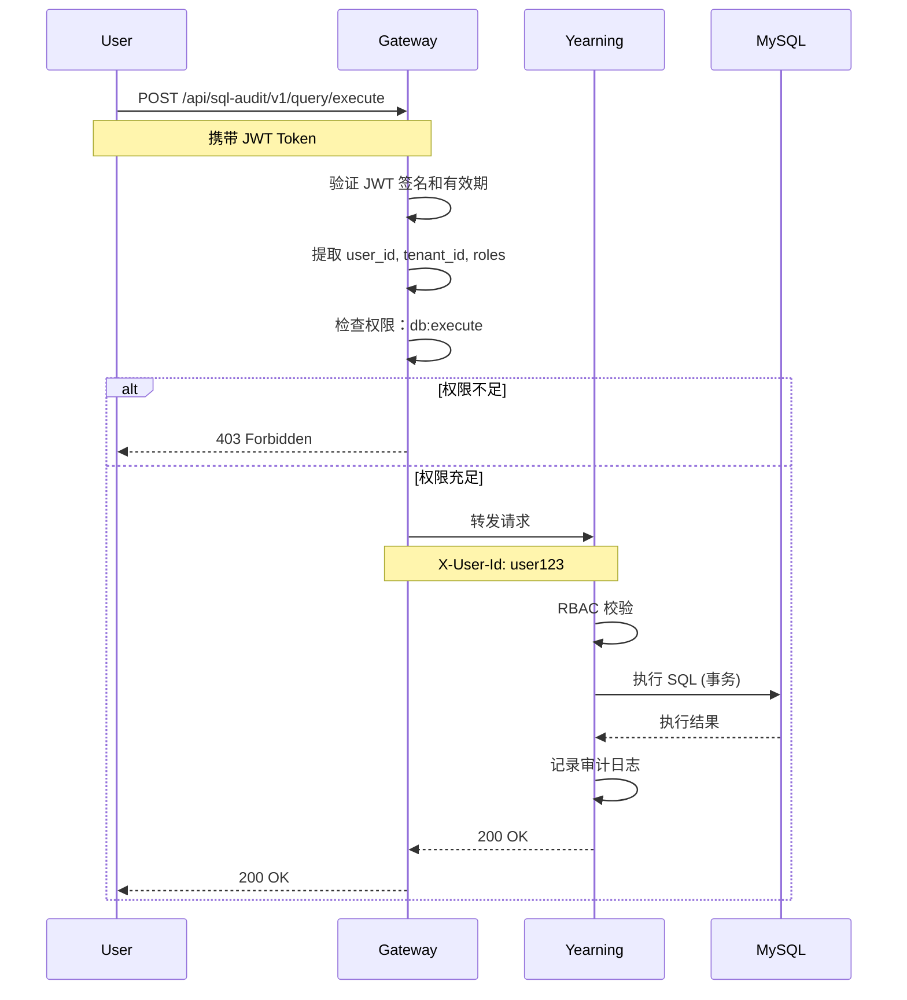

# SQL 审计模块详细设计

> **文档版本**: v1.1 | **创建日期**: 2026-04-10 | **最后更新**: 2026-04-10 | **状态**: 设计完成
> **服务名称**: orion-dba (Yearning 后端 + gemini-next 前端)
> **集成方式**: 独立服务 + 微前端子应用

---

## 一、概述

### 1.1 模块定位

SQL 审计模块为 Orion 平台提供数据库操作审核、执行、回滚能力，包括：
- **SQL 提交**: 开发者提交 SQL 变更申请
- **智能审核**: 规则引擎 + AI 辅助审核
- **审批流程**: 多级审批、会签、或签
- **安全执行**: 自动/手动执行、备份、回滚
- **审计追溯**: 完整操作日志、合规报告

### 1.2 外部组件清单

| 组件 | 定位 | 技术栈 | 许可证 | 部署方式 |
|------|------|--------|--------|---------|
| **orion-dba** (Yearning) | SQL 审计后端 | Go + Vue | AGPL-3.0 | 独立服务 (orion-dba Namespace) |
| **gemini-next** | SQL 审计前端 | React + Vite | AGPL-3.0 | 微前端子应用 (嵌入 Orion 基座) |

**说明**: orion-dba 是 Yearning 在 Orion 平台中的服务名称，包含后端 Yearning 和前端 gemini-next。

### 1.3 集成决策

```
Build vs Integrate:
├── ✅ 集成 orion-dba (Yearning) (不重复造轮子)
│   ├── 3.3k+ stars，成熟稳定
│   ├── 审核规则引擎完善
│   └── 支持 MySQL/PostgreSQL/TiDB
│
└── 🔧 增强 AI 能力 (Orion 差异化)
    ├── AI SQL 优化建议
    ├── 智能风险评估
    ├── 自然语言转 SQL
    └── 审核规则推荐
```

---

## 二、架构设计

### 2.1 整体架构图

```
┌─────────────────────────────────────────────────────────────────────────┐
│                         Orion 平台                                        │
│                                                                         │
│  ┌─────────────────────────────────────────────────────────────────┐   │
│  │                    微前端基座 (orion-base)                        │   │
│  │  ┌──────────────────────────────────────────────────────────┐   │   │
│  │  │  gemini-next (SQL 审计前端子应用)                           │   │   │
│  │  │  ┌──────────┐ ┌──────────┐ ┌──────────┐ ┌──────────┐    │   │   │
│  │  │  │ SQL      │ │ 工单     │ │ 审核     │ │ 审计     │    │   │   │
│  │  │  │ 编辑器   │ │ 管理     │ │ 结果     │ │ 记录     │    │   │   │
│  │  │  └──────────┘ └──────────┘ └──────────┘ └──────────┘    │   │   │
│  │  └──────────────────────────────────────────────────────────┘   │   │
│  └─────────────────────────────────────────────────────────────────┘   │
│                                    │                                    │
│                                    ▼                                    │
│  ┌─────────────────────────────────────────────────────────────────┐   │
│  │                  API Gateway (orion-api-gateway)                 │   │
│  │  ┌─────────────────────────────────────────────────────────┐    │   │
│  │  │  /api/sql-audit/* → orion-dba-service:8000               │    │   │
│  │  │  /api/db/* → orion-dba-service:8000                       │    │   │
│  │  └─────────────────────────────────────────────────────────┘    │   │
│  └─────────────────────────────────────────────────────────────────┘   │
└────────────────────────────────────┬────────────────────────────────────┘
                                     │
                                     ▼
┌─────────────────────────────────────────────────────────────────────────┐
│  orion-dba-service (orion-dba Namespace)                                 │
│                                                                         │
│  ┌─────────────┐ ┌─────────────┐ ┌─────────────┐ ┌─────────────┐      │
│  │ Query Engine│ │ Audit Engine│ │ Workflow    │ │ Backup      │      │
│  │ (查询引擎)  │ │ (审核引擎)  │ │ (流程引擎)  │ │ (备份引擎)  │      │
│  └─────────────┘ └─────────────┘ └─────────────┘ └─────────────┘      │
│  ┌─────────────┐ ┌─────────────┐ ┌─────────────┐ ┌─────────────┐      │
│  │ MySQL       │ │ PostgreSQL  │ │ TiDB        │ │ Oracle      │      │
│  │ 数据源      │ │ 数据源      │ │ 数据源      │ │ 数据源      │      │
│  └─────────────┘ └─────────────┘ └─────────────┘ └─────────────┘      │
└─────────────────────────────────────────────────────────────────────────┘
```

### 2.2 组件职责

| 组件 | 职责 | 关键功能 |
|------|------|---------|
| **gemini-next** | 前端交互 | SQL 编辑器、工单管理、审核结果展示、审计查询 |
| **orion-dba API** | 后端服务 | SQL 解析、规则审核、查询执行、工单流转 |
| **Orion AI Service** | AI 增强层 | SQL 优化建议、风险预测、NL2SQL、规则推荐 |
| **API Gateway** | 统一入口 | 路由分发、JWT 验证、限流、审计日志 |

---

## 三、微前端集成

### 3.1 集成方式

采用 **vite-plugin-federation** Module Federation 方式集成：

```javascript
// orion-base (host) 配置
// vite.config.ts
import federation from '@originjs/vite-plugin-federation'

export default {
  plugins: [
    federation({
      name: 'orion-base',
      remotes: {
        // Orion Core 主应用
        'orion-core': 'http://localhost:3001/assets/remoteEntry.js',
        
        // gemini-next (SQL 审计前端)
        'gemini-next': 'http://localhost:3010/assets/remoteEntry.js',
        
        // orion-knowledge (知识库前端)
        'orion-knowledge': 'http://localhost:3020/assets/remoteEntry.js',
        
        // orion-visor (CMDB 前端)
        'orion-visor': 'http://localhost:3030/assets/remoteEntry.js',
      },
      shared: [
        'react',
        'react-dom',
        '@arco-design/web-react',
        {
          name: 'react',
          version: '18.2.0',
          requiredVersion: '^18.0.0'
        }
      ]
    })
  ]
}
```

### 3.2 gemini-next (remote) 配置

```javascript
// gemini-next (remote) 配置
// vite.config.ts
import federation from '@originjs/vite-plugin-federation'

export default {
  plugins: [
    federation({
      name: 'gemini-next',
      filename: 'assets/remoteEntry.js',
      exposes: {
        './App': './src/App.tsx',
        './SqlEditor': './src/components/SqlEditor/index.tsx',
        './WorkOrderList': './src/components/WorkOrderList/index.tsx',
        './AuditResult': './src/components/AuditResult/index.tsx',
      },
      shared: [
        'react',
        'react-dom',
        '@arco-design/web-react'
      ]
    })
  ],
  build: {
    modulePreload: false,
    target: 'esnext',
    minify: false,
    cssCodeSplit: true
  }
}
```

### 3.3 路由配置

```javascript
// orion-base 路由配置
const routes = [
  {
    path: '/',
    component: BaseLayout,
    children: [
      // Orion Core 路由
      { path: '', component: OrionCore },
      { path: 'pipeline/*', component: PipelineModule },
      { path: 'workflow/*', component: WorkflowModule },
      
      // SQL 审计路由 (gemini-next)
      {
        path: 'sql-audit/*',
        component: () => import('gemini-next/App'),
        meta: {
          module: 'gemini-next',
          title: 'SQL 审计',
          icon: 'database'
        }
      },
      {
        path: 'sql-audit/editor',
        component: () => import('gemini-next/SqlEditor'),
        meta: {
          module: 'gemini-next',
          title: 'SQL 编辑器'
        }
      },
      {
        path: 'sql-audit/workorders',
        component: () => import('gemini-next/WorkOrderList'),
        meta: {
          module: 'gemini-next',
          title: '工单管理'
        }
      }
    ]
  }
]
```

---

## 四、API 集成

### 4.1 API Gateway 路由

```yaml
# API Gateway 配置
router:
  # SQL 审计 API
  - path: /api/sql-audit/*
    target: yearning-service.orion-dba.svc.cluster.local:8000
    strip_prefix: false
    auth: true
    timeout: 60s
    
    # 限流配置
    rate_limit:
      requests_per_second: 100
      burst: 200
    
    # 熔断配置
    circuit_breaker:
      failure_threshold: 5
      recovery_timeout: 30s
  
  # Orion 流水线调用 SQL 审核
  - path: /api/pipeline/sql-audit/*
    target: yearning-service.orion-dba.svc.cluster.local:8000
    auth: true
    rules:
      - POST /api/sql-audit/v1/query/audit    # 提交审核
      - GET  /api/sql-audit/v1/query/status   # 查询状态
      - POST /api/sql-audit/v1/query/execute  # 执行 SQL
      - POST /api/sql-audit/v1/query/rollback # 回滚
```

### 4.2 API 清单

#### 4.2.1 SQL 审核 API

| 接口 | 方法 | 功能 | 请求体 | 响应 |
|------|------|------|--------|------|
| `/api/sql-audit/v1/query/audit` | POST | 提交 SQL 审核 | `{sql, sourceId, action}` | `{auditId, status, rules}` |
| `/api/sql-audit/v1/query/status` | GET | 查询审核状态 | - | `{status, result, suggestions}` |
| `/api/sql-audit/v1/query/execute` | POST | 执行 SQL | `{auditId, executeType}` | `{executionId, status}` |
| `/api/sql-audit/v1/query/rollback` | POST | 回滚 SQL | `{executionId, reason}` | `{rollbackId, status}` |

#### 4.2.2 工单 API

| 接口 | 方法 | 功能 | 请求体 | 响应 |
|------|------|------|--------|------|
| `/api/sql-audit/v1/workorders` | GET | 查询工单列表 | `?status=&type=&page=` | `{items, total}` |
| `/api/sql-audit/v1/workorders/{id}` | GET | 查询工单详情 | - | `{workOrder, approvals, logs}` |
| `/api/sql-audit/v1/workorders/{id}/approve` | POST | 审批工单 | `{action, comment}` | `{status, nextApprover}` |
| `/api/sql-audit/v1/workorders/{id}/cancel` | POST | 取消工单 | `{reason}` | `{status}` |

#### 4.2.3 AI 增强 API (Orion)

| 接口 | 方法 | 功能 | 请求体 | 响应 |
|------|------|------|--------|------|
| `/api/sql-audit/v1/ai/optimize` | POST | AI SQL 优化 | `{sql, dialect}` | `{optimizedSql, suggestions}` |
| `/api/sql-audit/v1/ai/risk-assess` | POST | AI 风险评估 | `{sql, context}` | `{riskLevel, factors, suggestions}` |
| `/api/sql-audit/v1/ai/nl2sql` | POST | 自然语言转 SQL | `{query, schema}` | `{sql, confidence, explanation}` |

---

## 五、认证与授权

### 5.1 SSO 集成架构

```
┌─────────────────────────────────────────────────────────────────┐
│                    Orion SSO (统一认证中心)                       │
│                                                                 │
│  ┌─────────────┐  ┌─────────────┐  ┌─────────────┐             │
│  │ LDAP/AD     │  │ OAuth2      │  │ SAML        │             │
│  │ (企业目录)   │  │ (GitHub 等)   │  │ (企业 SSO)   │             │
│  └─────────────┘  └─────────────┘  └─────────────┘             │
│                             │                                   │
│                             ▼                                   │
│  ┌─────────────────────────────────────────────────────────┐   │
│  │                  JWT Token 签发                           │   │
│  │  {                                                       │   │
│  │    "sub": "user123",                                     │   │
│  │    "tenant_id": "tenant456",                             │   │
│  │    "roles": ["developer", "reviewer"],                   │   │
│  │    "permissions": ["db:read", "db:write", "db:audit"],   │   │
│  │    "exp": 1712764800                                     │   │
│  │  }                                                       │   │
│  └─────────────────────────────────────────────────────────┘   │
└─────────────────────────────────────────────────────────────────┘
                              │
                              ▼
┌─────────────────────────────────────────────────────────────────┐
│                    API Gateway (JWT 验证)                        │
│  • 验证 JWT 签名                                                  │
│  • 检查有效期                                                    │
│  • 提取用户上下文                                                │
│  • 转发到 Yearning (携带 X-User-Id, X-Tenant-Id)               │
└─────────────────────────────────────────────────────────────────┘
                              │
                              ▼
┌─────────────────────────────────────────────────────────────────┐
│                    yearning-service (RBAC 鉴权)                  │
│  • 读取 JWT header 中的用户信息                                    │
│  • 基于角色验证权限                                              │
│  • 记录审计日志                                                  │
└─────────────────────────────────────────────────────────────────┘
```

### 5.2 权限映射

| Orion 角色 | SQL 审计权限 | Yearning 角色映射 |
|-----------|-------------|-----------------|
| **Admin** | 全部权限 | `admin` |
| **DBA** | 审核/执行/回滚/配置 | `dba` |
| **Reviewer** | 审核/查看 | `reviewer` |
| **Developer** | 提交/查看自己的工单 | `developer` |
| **Viewer** | 只读查看 | `viewer` |

### 5.3 权限校验流程



---

## 六、数据流设计

### 6.1 SQL 审核流程

```
1. 开发者提交 SQL (gemini-next)
         │
         ▼
2. Yearning 规则引擎审核
   ├── 语法检查 (ANTLR 解析)
   ├── 规则检查 (内置规则 + 自定义规则)
   ├── 影响分析 (预估影响行数)
   └── 备份策略 (自动备份配置)
         │
         ▼
3. Orion AI Service 增强
   ├── AI 语法优化 (LLM)
   ├── 风险预测 (XGBoost 模型)
   └── 性能建议 (基于历史数据)
         │
         ▼
4. 返回审核结果 (gemini-next 展示)
   ├── 审核通过 → 进入审批流程
   ├── 审核警告 → 确认后继续
   └── 审核拒绝 → 需要修改
```

### 6.2 工单审批流程

```
工单状态机:

draft → submitted → auditing → approved → executing → executed
                │            │            │
                │            │            └──→ failed → rollback → closed
                │            │
                │            └──→ rejected → closed
                │
                └──→ cancelled → closed

审批节点配置:
{
  "workflow": {
    "nodes": [
      {
        "id": "node1",
        "type": "auto_audit",  // 自动审核
        "conditions": {"riskLevel": "low", "affectRows": "<1000"}
      },
      {
        "id": "node2",
        "type": "team_lead",    // 团队负责人审批
        "approvers": ["role:team_lead"]
      },
      {
        "id": "node3",
        "type": "dba",          // DBA 审批
        "approvers": ["role:dba"]
      }
    ]
  }
}
```

### 6.3 SQL 执行流程

```
执行模式:
├── 立即执行：审核通过后立即执行
├── 定时执行：指定未来时间执行
├── 审批后执行：需要多级审批
└── 手动执行：DBA 手动触发

执行保障:
├── 前置备份：自动备份受影响数据
├── 事务执行：在事务中执行，失败自动回滚
├── 进度跟踪：实时显示执行进度
└── 超时控制：超过阈值自动终止
```

---

## 七、部署架构

### 7.1 Kubernetes 部署

```yaml
# yearning-service Deployment
apiVersion: apps/v1
kind: Deployment
metadata:
  name: yearning-service
  namespace: orion-dba
spec:
  replicas: 2
  selector:
    matchLabels:
      app: yearning-service
  template:
    metadata:
      labels:
        app: yearning-service
    spec:
      containers:
        - name: yearning
          image: registry/orion/yearning:3.0.0
          ports:
            - containerPort: 8000
          env:
            - name: JWT_SECRET
              valueFrom:
                secretKeyRef:
                  name: yearning-secret
                  key: jwt-secret
            - name: DB_DSN
              valueFrom:
                secretKeyRef:
                  name: yearning-db
                  key: dsn
            - name: SSO_ENABLED
              value: "true"
            - name: SSO_ORION_URL
              value: "http://orion-sso.orion-core.svc.cluster.local"
          resources:
            requests:
              cpu: 500m
              memory: 512Mi
            limits:
              cpu: 2000m
              memory: 2Gi
          livenessProbe:
            httpGet:
              path: /api/v1/health
              port: 8000
            initialDelaySeconds: 30
            periodSeconds: 10
          readinessProbe:
            httpGet:
              path: /api/v1/ready
              port: 8000
            initialDelaySeconds: 5
            periodSeconds: 5
---
apiVersion: v1
kind: Service
metadata:
  name: yearning-service
  namespace: orion-dba
spec:
  selector:
    app: yearning-service
  ports:
    - port: 8000
      targetPort: 8000
  type: ClusterIP
```

### 7.2 Namespace 隔离

```yaml
# Namespace 定义
namespaces:
  - orion-core        # Orion 核心域
  - orion-dba         # SQL 审计 (Yearning + gemini-next)
  - orion-monitoring  # 可观测性

# 网络策略
networkPolicies:
  orion-dba:
    ingress:
      - from:
          - namespaceSelector:
              matchLabels:
              name: orion-core
          - namespaceSelector:
              matchLabels:
              name: orion-monitoring
        ports:
          - protocol: TCP
            port: 8000
    egress:
      - to:
          - namespaceSelector:
              matchLabels:
              name: orion-core
        ports:
          - protocol: TCP
            port: 443  # SSO
      - to:
          - ipBlock:
              cidr: 0.0.0.0/0
        ports:
          - protocol: TCP
            port: 3306  # MySQL
            port: 5432  # PostgreSQL
```

---

## 八、AI 增强设计

### 8.1 AI SQL 优化

```python
class AISQLOptimizer:
    """AI SQL 优化器"""
    
    def __init__(self):
        self.llm = LLMClient()
        self.rule_engine = YearningRuleEngine()
    
    async def optimize(self, sql: str, dialect: str) -> OptimizationResult:
        # 1. 基础规则审核
        base_result = self.rule_engine.check(sql)
        
        # 2. AI 优化建议
        prompt = self._build_optimize_prompt(sql, dialect, base_result)
        ai_response = await self.llm.generate(prompt)
        
        # 3. 解析 AI 建议
        suggestions = self._parse_suggestions(ai_response)
        
        # 4. 验证优化 SQL
        optimized_sql = self._apply_suggestions(sql, suggestions)
        validated = await self._validate(optimized_sql, dialect)
        
        return OptimizationResult(
            original_sql=sql,
            optimized_sql=optimized_sql,
            suggestions=suggestions,
            performance_improvement=validated.improvement
        )
```

### 8.2 AI 风险评估

| 风险因素 | AI 模型 | 特征 |
|---------|--------|------|
| **语法风险** | Rule-based | 语法复杂度、嵌套深度 |
| **性能风险** | XGBoost | 表大小、索引、执行计划 |
| **数据风险** | Logistic Regression | 影响行数、敏感度 |
| **流程风险** | GNN | 依赖关系、审批链 |

### 8.3 NL2SQL (自然语言转 SQL)

```python
class NL2SQLConverter:
    """自然语言转 SQL 转换器"""
    
    def __init__(self):
        self.llm = LLMClient(model="codellama")
        self.schema_retriever = SchemaRetriever()
    
    async def convert(self, query: str, context: dict) -> ConversionResult:
        # 1. 检索相关 Schema
        schema = await self.schema_retriever.retrieve(
            context.get("database"),
            context.get("tables")
        )
        
        # 2. 构建 Prompt
        prompt = f"""
根据以下数据库 Schema，将自然语言查询转换为 SQL:

Schema:
{schema}

自然语言查询:
{query}

请生成标准的 SQL 查询语句。
"""
        
        # 3. 调用 LLM 生成 SQL
        sql = await self.llm.generate(prompt)
        
        # 4. 验证 SQL 语法
        validated = await self._validate_syntax(sql)
        
        return ConversionResult(
            query=query,
            sql=sql,
            confidence=validated.confidence,
            explanation=self._generate_explanation(sql, schema)
        )
```

---

## 九、监控与可观测性

### 9.1 监控指标

```yaml
# Prometheus 指标
metrics:
  yearning:
    # 审核指标
    - sql_audit_total:          # 审核总数 (counter)
    - sql_audit_latency:        # 审核延迟 (histogram)
    - sql_audit_rejection_rate: # 拒绝率 (gauge)
    
    # 执行指标
    - sql_execute_total:        # 执行总数 (counter)
    - sql_execute_success:      # 成功数 (counter)
    - sql_execute_failed:       # 失败数 (counter)
    - sql_execute_latency:      # 执行延迟 (histogram)
    
    # 工单指标
    - workorder_pending:        # 待审批工单数 (gauge)
    - workorder_approved:       # 已批准工单数 (counter)
    - workorder_rejected:       # 已拒绝工单数 (counter)
    
    # AI 增强指标
    - ai_optimize_requests:     # AI 优化请求数 (counter)
    - ai_optimize_latency:      # AI 优化延迟 (histogram)
    - ai_acceptance_rate:       # AI 建议采纳率 (gauge)
```

### 9.2 审计日志

```json
{
  "timestamp": "2026-04-10T10:30:00Z",
  "event_type": "sql.execute",
  "user_id": "user123",
  "tenant_id": "tenant456",
  "sql_id": "sql-789",
  "sql_content": "UPDATE orders SET status='completed' WHERE id=123",
  "database": "production",
  "table": "orders",
  "affected_rows": 1,
  "execution_time_ms": 45,
  "status": "success",
  "risk_level": "low",
  "approvals": ["user456", "user789"],
  "trace_id": "trace-abc123"
}
```

### 9.3 分布式追踪

```
SQL 审核请求追踪:

trace_id: abc123
│
├── span_id: span1 (orion-api-gateway)
│   └── 操作：路由分发 (2ms)
│
├── span_id: span2 (yearning-service)
│   ├── 子 span: 语法检查 (5ms)
│   ├── 子 span: 规则审核 (15ms)
│   └── 子 span: 影响分析 (10ms)
│
├── span_id: span3 (orion-ai-service)
│   ├── 子 span: AI 优化建议 (200ms)
│   └── 子 span: 风险评估 (50ms)
│
└── span_id: span4 (gemini-next)
    └── 操作：结果展示 (30ms)

总延迟：~312ms
```

---

## 十、容错与降级

### 10.1 熔断策略

```yaml
circuit_breaker:
  yearning:
    failure_threshold: 3      # 连续 3 次失败触发熔断
    recovery_timeout: 60s     # 60 秒后尝试恢复
    half_open_requests: 1     # 半开状态允许 1 次请求
    
  ai_service:
    failure_threshold: 5      # AI 服务 5 次失败熔断
    recovery_timeout: 30s
    half_open_requests: 3
```

### 10.2 降级方案

| 组件 | 降级触发条件 | 降级行为 | 恢复条件 |
|------|-------------|---------|---------|
| **Yearning** | 服务不可用 | 降级为本地规则引擎 + AI 审核 | 服务恢复 |
| **AI Service** | AI 不可用 | 降级为纯规则引擎审核 | 服务恢复 |
| **gemini-next** | 前端异常 | 降级为 Yearning 原生 UI | 修复后切换 |

### 10.3 故障切换流程

```
Yearning 故障切换:

1. 检测到 Yearning 不可用 (连续 3 次健康检查失败)
         │
         ▼
2. API Gateway 触发熔断，返回 503
         │
         ▼
3. Orion Core 降级逻辑
   ├── 规则引擎：使用本地规则库
   ├── AI 审核：LLM + Orion 规则
   └── 工单流程：临时存储，待恢复后同步
         │
         ▼
4. 告警通知 SRE (PagerDuty/钉钉/企业微信)
         │
         ▼
5. SRE 执行 runbook 恢复
```

---

## 十一、安全设计

### 11.1 数据安全

```
数据加密:
├── 传输加密：TLS 1.3 (所有服务间通信)
├── 存储加密：AES-256 (数据库敏感字段)
└── 密钥管理：Vault (统一密钥管理)

敏感数据脱敏:
├── SQL 查询结果：自动脱敏 (手机号/身份证/银行卡)
├── 审计日志：敏感字段加密存储
└── 备份数据：加密存储 + 访问控制
```

### 11.2 脱敏规则

```yaml
desensitization:
  rules:
    - field_pattern: "phone"
      strategy: mask_middle
      example: "138****1234"
    
    - field_pattern: "id_card"
      strategy: mask_birthdate
      example: "110101********1234"
    
    - field_pattern: "bank_card"
      strategy: mask_middle
      example: "6222****1234"
    
    - field_pattern: "email"
      strategy: mask_localpart
      example: "use***@example.com"
  
  # 动态脱敏 (基于角色)
  dynamic:
    roles:
      admin: no_mask
      dba: partial_mask
      developer: full_mask
```

---

## 十二、运维手册

### 12.1 快速部署

```bash
# 部署 SQL 审计模块
cd deploy/orion-dba

# 复制环境变量
cp .env.example .env

# 启动 Yearning 服务
docker compose up -d

# 查看状态
docker compose ps

# 预期输出:
# yearning-service    healthy
# yearning-db         healthy
```

### 12.2 故障排查

```bash
# 检查服务健康状态
kubectl get pods -n orion-dba

# 查看 Yearning 日志
kubectl logs -n orion-dba deploy/yearning-service

# 测试 API 连通性
curl -H "Authorization: Bearer $TOKEN" \
  http://api-gateway/api/sql-audit/health

# 检查数据库连接
kubectl exec -n orion-dba deploy/yearning-service -- \
  yearning-cli db-check
```

---

## 十三、总结

### 13.1 集成收益

| 收益维度 | 说明 |
|---------|------|
| **开发效率** | 复用 Yearning，减少 80%+ 自研工作量 |
| **时间成本** | 上线周期从 6 个月缩短至 1 个月 |
| **质量保障** | 集成经过生产验证的开源方案 (3.3k+ stars) |
| **AI 增强** | 在 Yearning 基础上增加 Orion AI 能力 |

### 13.2 风险提示

| 风险点 | 缓解措施 |
|-------|---------|
| **AGPL 许可证风险** | 独立部署，通过 API 集成，不修改源码 |
| **服务依赖风险** | 熔断 + 降级 + 本地缓存 |
| **安全合规** | 统一认证 + 审计日志 + 权限隔离 |

---

_文档版本：v1.0 | 创建日期：2026-04-10 | 维护团队：Orion Platform Team_
