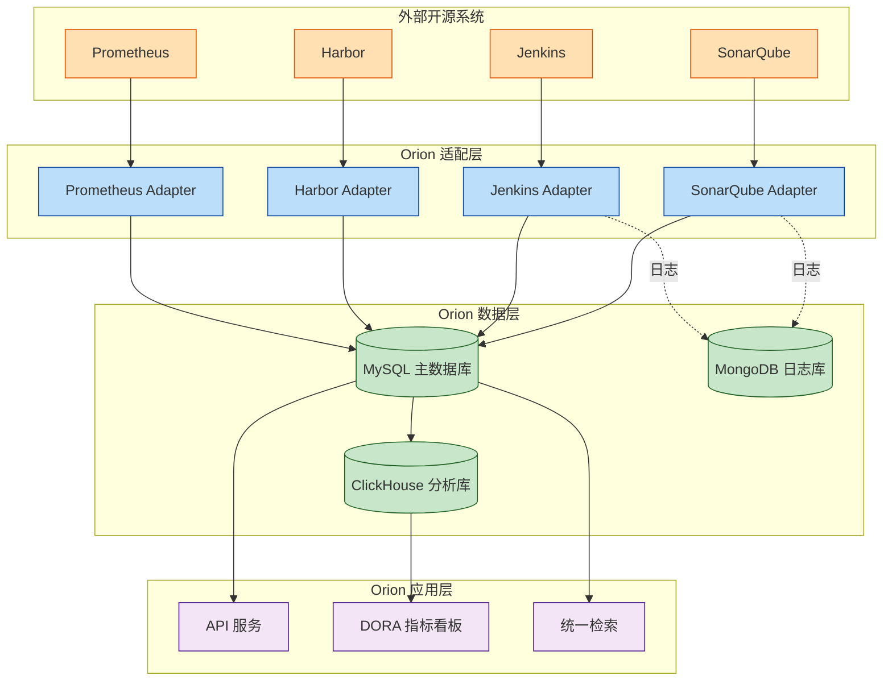

# Orion 外部开源系统接入数据库扩展设计

> 版本：v1.0 | 创建日期：2026-04-10 | 状态：设计完成
> 适用范围：所有接入 Orion 的外部开源系统 (SonarQube/Jenkins/Harbor 等)
> 目标：统一数据模型、即插即用、数据隔离、效能汇聚

---

## 一、设计背景与目标

### 1.1 背景问题

随着 Orion 开放平台战略推进，大量外部开源系统需要接入：

| 系统类型 | 代表系统 | 接入挑战 |
|---------|---------|---------|
| **代码质量** | SonarQube | 项目/问题/质量门禁数据模型映射 |
| **CI/CD 引擎** | Jenkins/GitLab CI | Pipeline 运行数据统一采集 |
| **制品库** | Harbor/Nexus | 镜像/依赖包元数据同步 |
| **监控系统** | Prometheus/Grafana | 告警事件标准化 |
| **文档系统** | Orion-Knowledge | 文档关联与检索 |

**核心挑战**：
- 各系统数据模型不一致，难以统一查询分析
- 多租户隔离需求，不同团队访问不同实例
- 效能数据需要汇聚到 Orion 统一看板
- 需要支持插件化部署，独立升级回滚

### 1.2 设计目标

```
┌─────────────────────────────────────────────────────────────────────────────┐
│                    Orion 外部系统接入数据库设计目标                          │
├─────────────────────────────────────────────────────────────────────────────┤
│                                                                             │
│  1. 统一数据模型                                                            │
│     • 定义标准外部系统数据模型 (External System Data Model, ESDM)           │
│     • 提供数据映射配置，无需修改外部系统 Schema                              │
│     • 支持数据转换和清洗                                                     │
│                                                                             │
│  2. 多租户隔离                                                              │
│     • 基于 tenant_id 的 RLS (Row-Level Security) 隔离                        │
│     • 支持按团队分配外部系统实例                                             │
│     • 配额管理和访问控制                                                     │
│                                                                             │
│  3. 效能数据汇聚                                                            │
│     • 自动采集 DORA 指标相关数据                                             │
│     • 统一效能数据视图，支持跨系统分析                                       │
│     • 实时/定时同步可选                                                      │
│                                                                             │
│  4. 插件化扩展                                                              │
│     • 外部系统元数据注册                                                     │
│     • 适配器配置化，无需代码修改                                             │
│     • 支持热插拔                                                             │
│                                                                             │
└─────────────────────────────────────────────────────────────────────────────┘
```

---

## 二、整体架构

### 2.1 数据库架构总览

```
┌─────────────────────────────────────────────────────────────────────────────┐
│                         Orion 数据库架构 (支持外部系统接入)                   │
├─────────────────────────────────────────────────────────────────────────────┤
│                                                                             │
│  ┌─────────────────────────────────────────────────────────────────────┐   │
│  │                      MySQL 8.0 (主数据库)                             │   │
│  │  ┌───────────────────────────────────────────────────────────────┐  │   │
│  │  │  orion_public (公共数据库)                                     │  │   │
│  │  │  ├── 核心业务表 (users, teams, pipelines...)                   │  │   │
│  │  │  └── 外部系统集成表 (external_systems, adapters...)           │  │   │
│  │  └───────────────────────────────────────────────────────────────┘  │   │
│  │  ┌───────────────────────────────────────────────────────────────┐  │   │
│  │  │  orion_system (系统数据库)                                     │  │   │
│  │  │  ├── 配置管理                                                  │  │   │
│  │  │  └── 审计日志                                                  │  │   │
│  │  └───────────────────────────────────────────────────────────────┘  │   │
│  │  ┌───────────────────────────────────────────────────────────────┐  │   │
│  │  │  team_* (团队数据库，按需隔离)                                  │  │   │
│  │  │  └── 团队私有数据                                              │  │   │
│  │  └───────────────────────────────────────────────────────────────┘  │   │
│  └─────────────────────────────────────────────────────────────────────┘   │
│                                                                             │
│  ┌─────────────────────────────────────────────────────────────────────┐   │
│  │                     ClickHouse (分析数据库)                           │   │
│  │  ┌───────────────────────────────────────────────────────────────┐  │   │
│  │  │  orion_metrics (效能指标)                                      │  │   │
│  │  │  ├── dora_metrics_daily (DORA 指标日报表)                      │  │   │
│  │  │  ├── efficiency_trends (效能趋势)                              │  │   │
│  │  │  └── cross_system_analysis (跨系统分析)                        │  │   │
│  │  └───────────────────────────────────────────────────────────────┘  │   │
│  └─────────────────────────────────────────────────────────────────────┘   │
│                                                                             │
│  ┌─────────────────────────────────────────────────────────────────────┐   │
│  │                  MongoDB (外部系统日志/文档)                          │   │
│  │  ┌───────────────────────────────────────────────────────────────┐  │   │
│  │  │  external_logs (外部系统日志)                                   │  │   │
│  │  │  ├── sonarqube_logs                                            │  │   │
│  │  │  ├── jenkins_logs                                              │  │   │
│  │  │  └── harbor_logs                                               │  │   │
│  │  └───────────────────────────────────────────────────────────────┘  │   │
│  └─────────────────────────────────────────────────────────────────────┘   │
│                                                                             │
└─────────────────────────────────────────────────────────────────────────────┘
```

### 2.2 数据流向



---

## 三、核心表设计

### 3.1 外部系统注册表

```sql
-- 外部系统注册表 (记录所有接入的外部系统实例)
CREATE TABLE orion_public.external_systems (
    id                  CHAR(36) PRIMARY KEY DEFAULT (UUID()),
    system_id           VARCHAR(64) UNIQUE NOT NULL,  -- 系统唯一标识
    
    -- 基本信息
    name                VARCHAR(128) NOT NULL,
    type                ENUM(
        'sonarqube',      -- 代码质量
        'jenkins',        -- CI/CD
        'harbor',         -- 制品库
        'nexus',          -- 依赖库
        'prometheus',     -- 监控
        'grafana',        -- 可视化
        'gitlab',         -- Git+CI
        'jira',           -- 项目管理
        'wiki',           -- 文档
        'custom'          -- 自定义
    ) NOT NULL,
    description         TEXT,
    vendor              VARCHAR(128),
    version             VARCHAR(64),
    
    -- 访问配置
    base_url            VARCHAR(512) NOT NULL,
    api_version         VARCHAR(32),
    auth_type           ENUM(
        'none',
        'basic',
        'token',
        'oauth2',
        'oidc',
        'mtls'
    ) DEFAULT 'token',
    credentials_ref     VARCHAR(255),  -- Vault 路径引用
    
    -- 功能能力
    capabilities        JSON,  -- 支持的功能列表
    /* 示例:
    {
        "webhook": true,
        "api_read": true,
        "api_write": true,
        "sso": true,
        "user_sync": true,
        "metrics_export": true
    }
    */
    
    -- 集成配置
    integration_level   ENUM('L1', 'L2', 'L3', 'L4') DEFAULT 'L1',
    /*
        L1: 基础认证 (SSO + 用户同步)
        L2: 单向集成 (Webhook 推送)
        L3: 双向集成 (事件 + API 双向)
        L4: 深度集成 (AI 增强 + 自愈)
    */
    
    adapter_config      JSON,  -- 适配器配置
    /* 示例:
    {
        "image": "registry/orion/sonarqube-adapter:1.0.0",
        "port": 8090,
        "routes": [...],
        "data_mapping": {...}
    }
    */
    
    -- 多租户配置
    tenant_access       JSON,  -- 可访问的团队列表
    /* 示例: ["team-001", "team-002"] 或 "*" 表示所有团队 */
    
    -- 状态
    status              ENUM('active', 'inactive', 'maintenance') DEFAULT 'active',
    health_status       ENUM('healthy', 'degraded', 'unhealthy') DEFAULT 'unknown',
    last_health_check   DATETIME,
    
    -- 配额
    quota               JSON,
    /* 示例:
    {
        "max_api_calls_per_hour": 10000,
        "max_webhook_events_per_day": 100000,
        "max_storage_gb": 100
    }
    */
    
    -- 元数据
    created_at          DATETIME DEFAULT CURRENT_TIMESTAMP,
    updated_at          DATETIME DEFAULT CURRENT_TIMESTAMP ON UPDATE CURRENT_TIMESTAMP,
    created_by          CHAR(36),
    
    -- 索引
    INDEX idx_systems_type (type),
    INDEX idx_systems_status (status),
    INDEX idx_systems_health (health_status),
    CONSTRAINT fk_systems_created_by FOREIGN KEY (created_by) REFERENCES users(id)
) ENGINE=InnoDB DEFAULT CHARSET=utf8mb4 COLLATE=utf8mb4_unicode_ci;
```

### 3.2 外部系统数据映射表

```sql
-- 外部系统数据模型映射配置表
CREATE TABLE orion_public.external_data_mappings (
    id                  CHAR(36) PRIMARY KEY DEFAULT (UUID()),
    system_id           CHAR(36) NOT NULL,
    
    -- 映射对象
    object_type         VARCHAR(64) NOT NULL,  -- 如 'project', 'pipeline', 'artifact'
    object_name         VARCHAR(128),  -- 人类可读名称
    
    -- 源系统 Schema
    source_schema       JSON NOT NULL,
    /* 示例 (SonarQube Project):
    {
        "type": "object",
        "required": ["key", "name", "organization"],
        "properties": {
            "key": {"type": "string"},
            "name": {"type": "string"},
            "organization": {"type": "string"},
            "created_at": {"type": "string", "format": "date-time"}
        }
    }
    */
    
    -- Orion 标准 Schema
    target_schema       JSON NOT NULL,
    /* 示例 (Orion Project):
    {
        "type": "object",
        "required": ["id", "name", "key", "tenant_id"],
        "properties": {
            "id": {"type": "string"},
            "name": {"type": "string"},
            "key": {"type": "string"},
            "tenant_id": {"type": "string"},
            "created_at": {"type": "string", "format": "date-time"},
            "updated_at": {"type": "string", "format": "date-time"},
            "metadata": {"type": "object"}
        }
    }
    */
    
    -- 映射规则
    mapping_rules       JSON NOT NULL,
    /* 示例:
    [
        {"source": "key", "target": "key", "transform": "none"},
        {"source": "name", "target": "name", "transform": "none"},
        {"source": "organization", "target": "tenant_id", "transform": "org_to_tenant"},
        {"source": "created_at", "target": "created_at", "transform": "timestamp_to_iso8601"},
        {"target": "updated_at", "value": "${now()}"},
        {"target": "metadata.source_system", "value": "sonarqube"}
    ]
    */
    
    -- 同步配置
    sync_mode           ENUM('realtime', 'scheduled', 'manual') DEFAULT 'scheduled',
    sync_interval       INT DEFAULT 3600,  -- 同步间隔 (秒)
    sync_last_run       DATETIME,
    sync_next_run       DATETIME,
    sync_status         ENUM('pending', 'running', 'success', 'failed'),
    sync_error          TEXT,
    
    -- 状态
    status              ENUM('active', 'inactive') DEFAULT 'active',
    
    -- 元数据
    created_at          DATETIME DEFAULT CURRENT_TIMESTAMP,
    updated_at          DATETIME DEFAULT CURRENT_TIMESTAMP ON UPDATE CURRENT_TIMESTAMP,
    
    -- 索引
    UNIQUE KEY uk_system_object (system_id, object_type),
    INDEX idx_mappings_system (system_id),
    INDEX idx_mappings_status (status),
    CONSTRAINT fk_mappings_system FOREIGN KEY (system_id) REFERENCES external_systems(id)
) ENGINE=InnoDB DEFAULT CHARSET=utf8mb4 COLLATE=utf8mb4_unicode_ci;
```

### 3.3 外部系统事件表

```sql
-- 外部系统事件表 (统一事件模型)
CREATE TABLE orion_public.external_events (
    id                  CHAR(36) PRIMARY KEY DEFAULT (UUID()),
    event_id            VARCHAR(128) UNIQUE NOT NULL,  -- 外部系统事件 ID
    
    -- 事件来源
    source_system_id    CHAR(36) NOT NULL,
    source_type         VARCHAR(64) NOT NULL,  -- 如 'sonarqube', 'jenkins'
    source_event_type   VARCHAR(128) NOT NULL,  -- 外部事件类型
    
    -- Orion 事件类型 (标准化)
    orion_event_type    VARCHAR(128) NOT NULL,
    /* 标准事件类型:
        - code.analysis.completed (代码分析完成)
        - quality_gate.passed (质量门禁通过)
        - quality_gate.failed (质量门禁失败)
        - pipeline.started (流水线开始)
        - pipeline.completed (流水线完成)
        - pipeline.failed (流水线失败)
        - artifact.pushed (制品推送)
        - alert.fired (告警触发)
        - alert.resolved (告警恢复)
    */
    
    -- 事件数据
    event_data          JSON NOT NULL,  -- 原始事件数据
    normalized_data     JSON,  -- 标准化后数据
    
    -- 关联资源
    resource_type       VARCHAR(64),  -- 如 'project', 'pipeline'
    resource_id         VARCHAR(128),  -- 外部资源 ID
    orion_resource_id   CHAR(36),  -- Orion 资源 ID
    
    -- 租户信息
    tenant_id           CHAR(36) NOT NULL,
    
    -- 处理状态
    processing_status   ENUM('pending', 'processing', 'completed', 'failed') DEFAULT 'pending',
    processed_at        DATETIME,
    processing_error    TEXT,
    retry_count         INT DEFAULT 0,
    
    -- 时间戳
    event_time          DATETIME NOT NULL,  -- 事件发生时间
    received_at         DATETIME DEFAULT CURRENT_TIMESTAMP,  -- 接收时间
    
    -- 索引
    INDEX idx_events_source (source_system_id),
    INDEX idx_events_type (orion_event_type),
    INDEX idx_events_tenant (tenant_id),
    INDEX idx_events_status (processing_status),
    INDEX idx_events_time (event_time),
    CONSTRAINT fk_events_system FOREIGN KEY (source_system_id) REFERENCES external_systems(id)
) ENGINE=InnoDB DEFAULT CHARSET=utf8mb4 COLLATE=utf8mb4_unicode_ci
PARTITION BY RANGE (YEAR(event_time) * 100 + MONTH(event_time)) (
    PARTITION p202604 VALUES LESS THAN (202605),
    PARTITION p202605 VALUES LESS THAN (202606),
    PARTITION p202606 VALUES LESS THAN (202607),
    PARTITION p202607 VALUES LESS THAN (202608),
    PARTITION p202608 VALUES LESS THAN (202609),
    PARTITION p202609 VALUES LESS THAN (202610),
    PARTITION p202610 VALUES LESS THAN (202611),
    PARTITION p202611 VALUES LESS THAN (202612),
    PARTITION p202612 VALUES LESS THAN (202701)
);
```

### 3.4 外部系统效能指标表

```sql
-- 外部系统效能指标表 (汇聚到 ClickHouse)
CREATE TABLE orion_public.external_metrics (
    id                  CHAR(36) PRIMARY KEY DEFAULT (UUID()),
    
    -- 指标信息
    metric_name         VARCHAR(128) NOT NULL,
    metric_type         ENUM(
        'dora_deployment_frequency',
        'dora_lead_time',
        'dora_change_failure_rate',
        'dora_mttr',
        'code_coverage',
        'code_quality',
        'test_pass_rate',
        'build_success_rate',
        'custom'
    ) NOT NULL,
    
    -- 数据来源
    source_system_id    CHAR(36) NOT NULL,
    source_metric_id    VARCHAR(255),  -- 外部系统指标 ID
    
    -- 关联维度
    tenant_id           CHAR(36) NOT NULL,
    team_id             CHAR(36),
    project_id          CHAR(36),
    pipeline_id         CHAR(36),
    
    -- 指标值
    metric_value        DECIMAL(20,6) NOT NULL,
    metric_unit         VARCHAR(32),  -- 如 'count/day', 'minutes', 'percentage'
    metric_dimension    JSON,  -- 额外维度
    /* 示例:
    {
        "environment": "production",
        "service": "order-service",
        "branch": "main"
    }
    */
    
    -- 时间维度
    time_granularity    ENUM('minute', 'hour', 'day', 'week', 'month') DEFAULT 'day',
    time_bucket         DATETIME NOT NULL,  -- 时间桶
    
    -- 元数据
    created_at          DATETIME DEFAULT CURRENT_TIMESTAMP,
    
    -- 索引
    INDEX idx_metrics_name (metric_name),
    INDEX idx_metrics_tenant (tenant_id),
    INDEX idx_metrics_time (time_bucket),
    UNIQUE KEY uk_metric_unique (metric_name, source_system_id, tenant_id, time_bucket, metric_dimension),
    CONSTRAINT fk_metrics_system FOREIGN KEY (source_system_id) REFERENCES external_systems(id)
) ENGINE=InnoDB DEFAULT CHARSET=utf8mb4 COLLATE=utf8mb4_unicode_ci
PARTITION BY RANGE (YEAR(time_bucket) * 100 + MONTH(time_bucket)) (
    PARTITION p202604 VALUES LESS THAN (202605),
    PARTITION p202605 VALUES LESS THAN (202606),
    PARTITION p202606 VALUES LESS THAN (202607),
    PARTITION p202607 VALUES LESS THAN (202608),
    PARTITION p202608 VALUES LESS THAN (202609),
    PARTITION p202609 VALUES LESS THAN (202610),
    PARTITION p202610 VALUES LESS THAN (202611),
    PARTITION p202611 VALUES LESS THAN (202612),
    PARTITION p202612 VALUES LESS THAN (202701)
);
```

### 3.5 ClickHouse 分析表

```sql
-- ClickHouse 中的 DORA 指标聚合表 (物化视图)
-- 在 MySQL 中定义结构，实际在 ClickHouse 创建

-- DORA 指标日报表
CREATE TABLE IF NOT EXISTS orion_metrics.dora_metrics_daily (
    date                Date,
    tenant_id           String,
    team_id             String,
    
    -- 部署频率 (次/天)
    deployment_frequency Float32,
    deployment_count    UInt32,
    
    -- 交付周期 (分钟)
    lead_time_minutes  Float32,
    lead_time_p50      Float32,
    lead_time_p90      Float32,
    lead_time_p99      Float32,
    
    -- 变更失败率 (%)
    change_failure_rate Float32,
    failed_deployments  UInt32,
    total_deployments   UInt32,
    
    -- 恢复时间 (分钟)
    mttr_minutes       Float32,
    incident_count     UInt32,
    
    -- 数据来源
    source_systems     Array(String),
    
    -- 更新时间
    updated_at         DateTime
) ENGINE = SummingMergeTree()
PARTITION BY toYYYYMM(date)
ORDER BY (date, tenant_id, team_id)
TTL date + INTERVAL 2 YEAR
SETTINGS index_granularity = 8192;

-- 效能趋势表 (支持跨系统对比)
CREATE TABLE IF NOT EXISTS orion_metrics.efficiency_trends (
    date                Date,
    tenant_id           String,
    team_id             String,
    project_id          String,
    
    -- 效能维度
    metric_name        String,
    metric_value       Float32,
    metric_unit        String,
    
    -- 数据来源
    source_system      String,
    source_system_type String,
    
    -- 环比
    wow_change         Float32,  -- 周环比
    mom_change         Float32   -- 月环比
) ENGINE = ReplacingMergeTree()
PARTITION BY toYYYYMM(date)
ORDER BY (date, tenant_id, team_id, metric_name)
TTL date + INTERVAL 1 YEAR;
```

---

## 四、数据同步方案

### 4.1 实时同步 (Webhook)

```yaml
# Webhook 实时同步配置
webhook_sync:
  # 事件接收端点
  endpoint:
    url: "https://orion.company.com/api/v1/events/ingest"
    methods: [POST]
    auth:
      type: hmac_sha256
      secret_ref: "vault:orion/webhook-secret"
  
  # 事件格式转换
  transformation:
    type: jinja2
    template: |
      {
        "event_id": "{{ event.id }}",
        "source_system_id": "{{ system_id }}",
        "source_type": "{{ source_type }}",
        "source_event_type": "{{ event.type }}",
        "orion_event_type": "{{ mapping.orion_event_type }}",
        "event_data": {{ event.data | to_json }},
        "tenant_id": "{{ tenant_id }}",
        "event_time": "{{ event.timestamp }}"
      }
  
  # 可靠性保障
  reliability:
    retry:
      max_attempts: 3
      backoff: exponential
      initial_delay: 1s
    
    dead_letter:
      enabled: true
      storage: mongodb
      collection: external_events_dlq
    
    idempotency:
      enabled: true
      key: "event_id"
      ttl: 86400  # 24 小时
```

### 4.2 定时同步 (CDC)

```yaml
# 定时同步配置 (Change Data Capture)
cdc_sync:
  # 同步任务定义
  jobs:
    - name: sonarqube_projects_sync
      source:
        type: sonarqube
        system_id: "sonarqube-prod"
        endpoint: "/api/projects/search"
        pagination:
          type: page
          page_size: 500
      
      target:
        type: mysql
        table: external_projects
        mapping_ref: "sonarqube_project_mapping"
      
      schedule:
        type: cron
        cron: "0 */6 * * *"  # 每 6 小时
      
      # 增量同步
      incremental:
        enabled: true
        field: "analysis_date"
        lookback: 24h  # 同步最近 24 小时变更
      
      # 冲突处理
      conflict_resolution:
        strategy: "last_write_wins"
        timestamp_field: "updated_at"
```

### 4.3 数据一致性保障

```yaml
# 数据一致性保障配置
consistency:
  # 对账任务
  reconciliation:
    enabled: true
    schedule: "0 2 * * *"  # 每天凌晨 2 点
    
    # 对账规则
    rules:
      - name: project_count_check
        description: "外部系统项目数与 Orion 记录一致"
        source_query: "SELECT COUNT(*) FROM sonarqube_projects"
        target_query: "SELECT COUNT(*) FROM external_projects WHERE source='sonarqube'"
        tolerance: 0  # 不允许差异
      
      - name: event_completeness_check
        description: "事件完整性检查"
        source_query: "SELECT COUNT(*) FROM external_events WHERE processing_status='completed'"
        target_query: "SELECT COUNT(*) FROM processed_events"
        tolerance: 0.01  # 允许 1% 差异
    
    # 告警
    alerting:
      on_mismatch: true
      channels: [slack, email]
      threshold: 0.05  # 差异超过 5% 告警
  
  # 数据修复
  repair:
    auto_repair: true
    repair_strategies:
      - name: missing_record
        action: "insert_from_source"
      - name: stale_record
        action: "update_from_source"
      - name: orphan_record
        action: "mark_for_deletion"
```

---

## 五、多租户隔离

### 5.1 RLS (Row-Level Security) 配置

```sql
-- 启用 RLS
ALTER TABLE orion_public.external_systems ENABLE ROW LEVEL SECURITY;

-- 创建 RLS 策略
CREATE POLICY tenant_isolation_policy ON orion_public.external_systems
    FOR ALL
    USING (
        -- 管理员可访问所有
        EXISTS (
            SELECT 1 FROM users 
            WHERE users.id = @current_user_id 
            AND users.role = 'admin'
        )
        OR
        -- 普通用户只能访问所属团队的系统
        tenant_access = '*' 
        OR 
        JSON_CONTAINS(tenant_access, JSON_QUOTE(@current_tenant_id))
    );

-- 类似策略应用到其他表
CREATE POLICY tenant_isolation_policy ON orion_public.external_events
    FOR ALL
    USING (tenant_id = @current_tenant_id);

CREATE POLICY tenant_isolation_policy ON orion_public.external_metrics
    FOR ALL
    USING (tenant_id = @current_tenant_id);
```

### 5.2 配额管理

```sql
-- 团队配额表
CREATE TABLE orion_public.team_quotas (
    id                  CHAR(36) PRIMARY KEY DEFAULT (UUID()),
    team_id             CHAR(36) UNIQUE NOT NULL,
    
    -- 外部系统配额
    max_external_systems    INT DEFAULT 10,  -- 最多接入外部系统数
    max_api_calls_per_hour  INT DEFAULT 10000,
    max_storage_gb          INT DEFAULT 100,
    
    -- 效能数据保留
    metrics_retention_days  INT DEFAULT 365,
    logs_retention_days     INT DEFAULT 90,
    
    -- 元数据
    created_at          DATETIME DEFAULT CURRENT_TIMESTAMP,
    updated_at          DATETIME DEFAULT CURRENT_TIMESTAMP ON UPDATE CURRENT_TIMESTAMP,
    
    CONSTRAINT fk_quotas_team FOREIGN KEY (team_id) REFERENCES teams(id)
) ENGINE=InnoDB DEFAULT CHARSET=utf8mb4 COLLATE=utf8mb4_unicode_ci;
```

---

## 六、适配器配置示例

### 6.1 SonarQube 适配器

```yaml
# SonarQube 适配器配置 (plugin.yaml)
apiVersion: plugin.orion.dev/v1alpha1
kind: Plugin
metadata:
  name: sonarqube-adapter
  version: 10.4.0-1.0.0

spec:
  # 数据映射配置
  data_mappings:
    project:
      source_schema:
        key: string
        name: string
        organization: string
        created_at: timestamp
      
      target_schema:
        id: string
        name: string
        key: string
        tenant_id: string
        created_at: timestamp
        metadata: object
      
      mapping_rules:
        - source: key
          target: key
          transform: none
        - source: name
          target: name
          transform: none
        - source: organization
          target: tenant_id
          transform: org_to_tenant
        - source: created_at
          target: created_at
          transform: timestamp_to_iso8601
        - target: metadata.source_system
          value: sonarqube
    
    issue:
      source_schema:
        key: string
        rule: string
        severity: string
        status: string
        message: string
        line: integer
      
      target_schema:
        id: string
        type: string
        severity: string
        status: string
        description: string
        location: object
      
      mapping_rules:
        - source: key
          target: id
          transform: none
        - source: rule
          target: type
          transform: rule_to_type
        - source: severity
          target: severity
          transform: none
        - source: message
          target: description
          transform: none

  # 事件订阅
  event_subscriptions:
    - topic: quality_gate.completed
      filter:
        status: ["ERROR", "WARN"]
      sink:
        type: webhook
        url: http://sonarqube-adapter/events/quality-gate
```

### 6.2 Jenkins 适配器

```yaml
# Jenkins 适配器配置
apiVersion: plugin.orion.dev/v1alpha1
kind: Plugin
metadata:
  name: jenkins-adapter
  version: 2.400-1.0.0

spec:
  # DORA 指标采集
  metrics_collection:
    deployment_frequency:
      source:
        type: jenkins
        query: "pipelineRuns.successful"
        group_by: day
      mapping:
        value: "${count}"
        unit: "count/day"
    
    lead_time:
      source:
        type: jenkins
        query: "pipelineRuns.duration"
        from_event: "commit.created"
        to_event: "pipeline.completed"
      mapping:
        value: "${duration_minutes}"
        unit: "minutes"
    
    change_failure_rate:
      source:
        type: jenkins
        query: "pipelineRuns.failed / pipelineRuns.total"
        window: 7d
      mapping:
        value: "${rate}"
        unit: "percentage"
```

---

## 七、实施路线图

### 7.1 分阶段实施

| 阶段 | 时间 | 目标 | 交付物 |
|------|------|------|--------|
| Phase 1 | 2 周 | 数据库 Schema 就绪 | 外部系统表、映射表、事件表 |
| Phase 2 | 2 周 | SonarQube 试点接入 | SonarQube 适配器、数据同步 |
| Phase 3 | 4 周 | Jenkins/Harbor 接入 | CI/CD 数据汇聚、DORA 指标 |
| Phase 4 | 2 周 | 效能看板上线 | ClickHouse 分析、统一看板 |
| Phase 5 | 2 周 | 插件市场发布 | 适配器模板、文档、示例 |

### 7.2 参考实现

| 参考实现 | 描述 | 状态 |
|---------|------|------|
| sonarqube-adapter | SonarQube L4 集成参考 | ✅ 已完成 |
| jenkins-adapter | Jenkins L3 集成参考 | ⏳ 开发中 |
| harbor-adapter | Harbor L3 集成参考 | ⏳ 开发中 |
| prometheus-adapter | Prometheus L2 集成参考 | ⏳ 规划中 |

---

## 八、总结

### 8.1 设计优势

| 优势 | 说明 |
|------|------|
| **统一数据模型** | 外部系统数据标准化，支持跨系统查询分析 |
| **多租户隔离** | RLS + 配额管理，保障数据安全 |
| **即插即用** | 配置化映射，无需修改外部系统 |
| **效能汇聚** | DORA 指标自动采集，统一看板 |
| **可扩展** | 插件化架构，支持新系统快速接入 |

### 8.2 关键指标

- 外部系统接入时间：从 2-4 周缩短到 **3-5 天**
- 数据同步延迟：从分钟级降低到 **秒级**
- 效能数据覆盖率：从 60% 提升到 **95%+**

---

_Orion 外部开源系统接入数据库设计 — 统一模型、即插即用、效能汇聚_

_文档版本：v1.0 | 创建日期：2026-04-10 | 维护团队：Orion Platform Team_
