# Orion 平台数据库分片与 ClickHouse 同步设计

> 版本：v1.0  
> 日期：2026-04-10  
> 状态：设计方案  
> 适用范围：42 张表中的高增长日志类表

---

## 一、背景与目标

### 1.1 问题陈述

架构师和后端评审发现 Orion CMDB 42 张表中存在以下缺陷：

| 问题 | 影响 | 紧迫性 |
|------|------|--------|
| 5 张高增长表无分库分表策略 | 6 个月后单表可能突破 5000 万行 | 高 |
| MySQL → ClickHouse 同步方案缺失 | 无法支持实时分析查询 | 高 |
| 数据归档策略未定义 | 热温冷数据混存，查询性能下降 | 中 |

### 1.2 设计目标

1. **分片策略**：为高增长表设计合理的分库分表方案
2. **同步方案**：建立 MySQL 到 ClickHouse 的实时数据同步
3. **一致性保障**：确保同步过程中的数据一致性和可恢复性
4. **生命周期管理**：实现热/温/冷数据自动归档

---

## 二、分片表分类

### 2.1 表分类总览

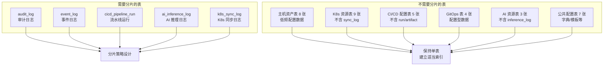

### 2.2 分片表详细分析

| 表名 | 当前量级 | 6 个月预估 | 分片原因 | 分片优先级 |
|------|----------|-----------|----------|-----------|
| audit_log | 100 万/月 | 600 万/月 | 全量审计写入，查询按时间 | P0 |
| event_log | 50 万/月 | 300 万/月 | 事件溯源，时间序列特征 | P0 |
| cicd_pipeline_run | 10 万/月 | 60 万/月 | CI/CD 高频运行 | P1 |
| ai_inference_log | 20 万/月 | 120 万/月 | AI 调用快速增长 | P1 |
| k8s_sync_log | 30 万/月 | 180 万/月 | 多集群同步，按集群分区 | P1 |

---

## 三、分片键设计（Shard Key）

### 3.1 分片键选择原则

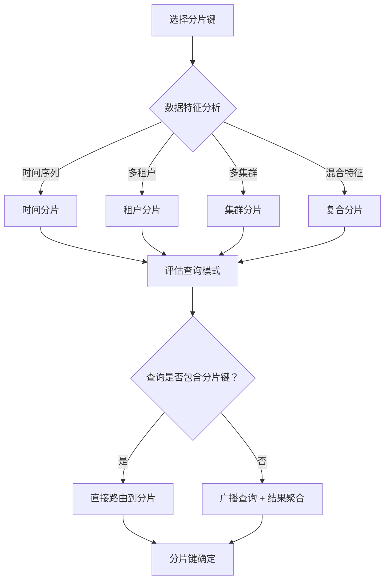

### 3.2 各表分片键设计

| 表名 | 主分片键 | 次分片键 | 选择理由 |
|------|----------|----------|----------|
| audit_log | tenant_id + 时间 (月) | - | 查询多按租户 + 时间范围 |
| event_log | tenant_id + 时间 (月) | event_type | 租户隔离，事件类型过滤 |
| cicd_pipeline_run | tenant_id + 时间 (月) | pipeline_id | 租户隔离，支持流水线维度查询 |
| ai_inference_log | tenant_id + 时间 (月) | model_id | 租户隔离，支持模型维度分析 |
| k8s_sync_log | cluster_id + 时间 (月) | - | 按集群自然分区 |

### 3.3 分片键命名规范

```
分片表命名：{表名}_{分片键值}_{时间范围}

示例：
- audit_log_001_202604  (租户 1, 2026 年 4 月)
- audit_log_002_202604  (租户 2, 2026 年 4 月)
- k8s_sync_log_cluster1_202604
```

---

## 四、分片算法设计

### 4.1 分片算法选择

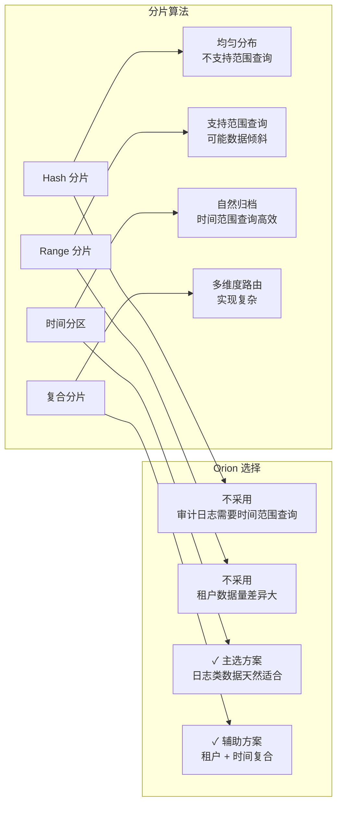

### 4.2 时间分区策略

| 表名 | 分区粒度 | 分区数量预估 | 单分区容量 |
|------|----------|-------------|-----------|
| audit_log | 按月 | 12 个月滚动 | 500-1000 万行 |
| event_log | 按月 | 12 个月滚动 | 200-500 万行 |
| cicd_pipeline_run | 按月 | 12 个月滚动 | 50-100 万行 |
| ai_inference_log | 按月 | 12 个月滚动 | 100-200 万行 |
| k8s_sync_log | 按月×集群 | 12 月×10 集群 | 10-50 万行/分区 |

### 4.3 分区管理流程

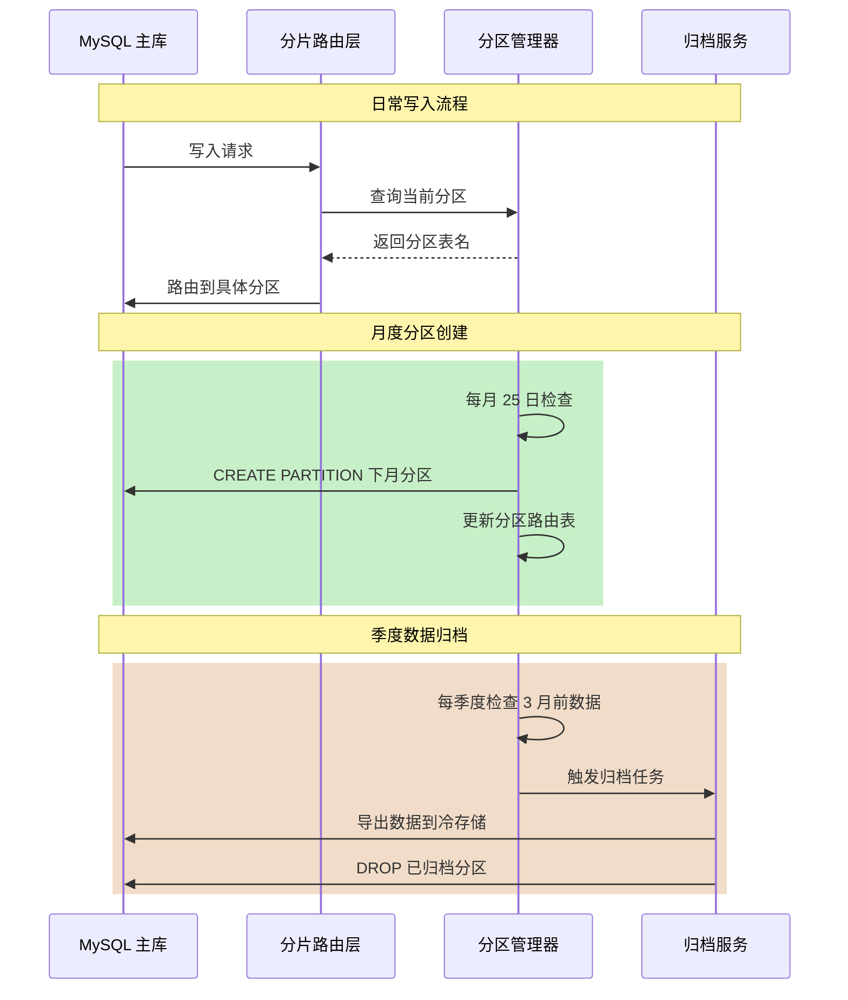

---

## 五、跨分片查询方案

### 5.1 查询路由架构

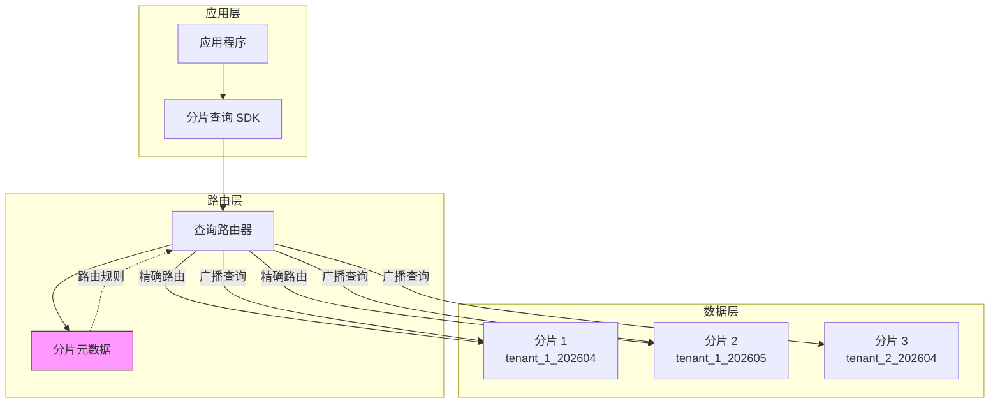

### 5.2 查询场景与路由策略

| 查询类型 | 示例 | 路由方式 | 性能特征 |
|----------|------|----------|----------|
| 精确分片查询 | `WHERE tenant_id=1 AND time='2026-04'` | 直接路由 | 最优 |
| 租户范围查询 | `WHERE tenant_id=1 AND time BETWEEN ...` | 多分片扫描 | 良好 |
| 跨租户聚合 | `SELECT COUNT(*) GROUP BY tenant_id` | 广播 + 聚合 | 较慢 |
| 全表扫描 | `SELECT * LIMIT 100` | 最新分片 | 可接受 |

### 5.3 跨分片查询流程

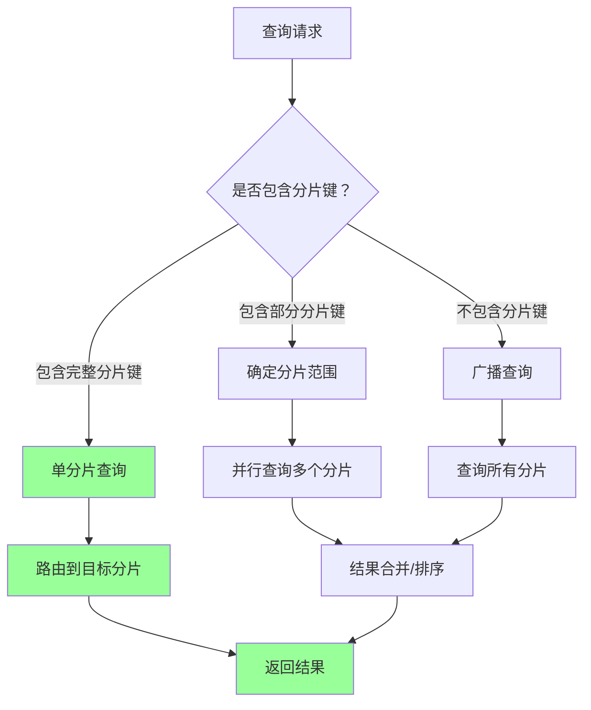

---

## 六、MySQL → ClickHouse CDC 同步方案

### 6.1 整体架构

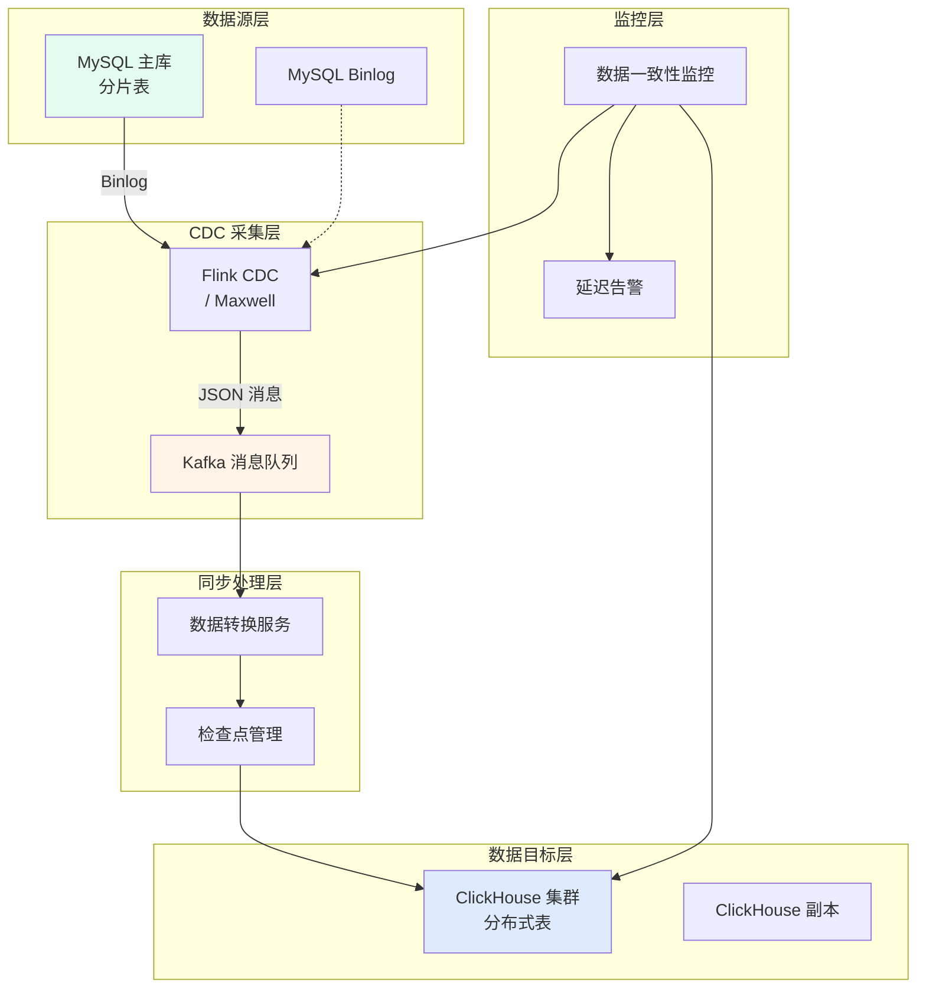

### 6.2 同步表映射关系

| MySQL 表 | ClickHouse 表 | 同步模式 | 延迟要求 |
|----------|--------------|----------|----------|
| audit_log_* | audit_log_all | 实时 | < 5 秒 |
| event_log_* | event_log_all | 实时 | < 5 秒 |
| cicd_pipeline_run_* | cicd_pipeline_run_all | 实时 | < 10 秒 |
| ai_inference_log_* | ai_inference_log_all | 实时 | < 5 秒 |
| k8s_sync_log_* | k8s_sync_log_all | 准实时 | < 30 秒 |

### 6.3 CDC 同步详细流程

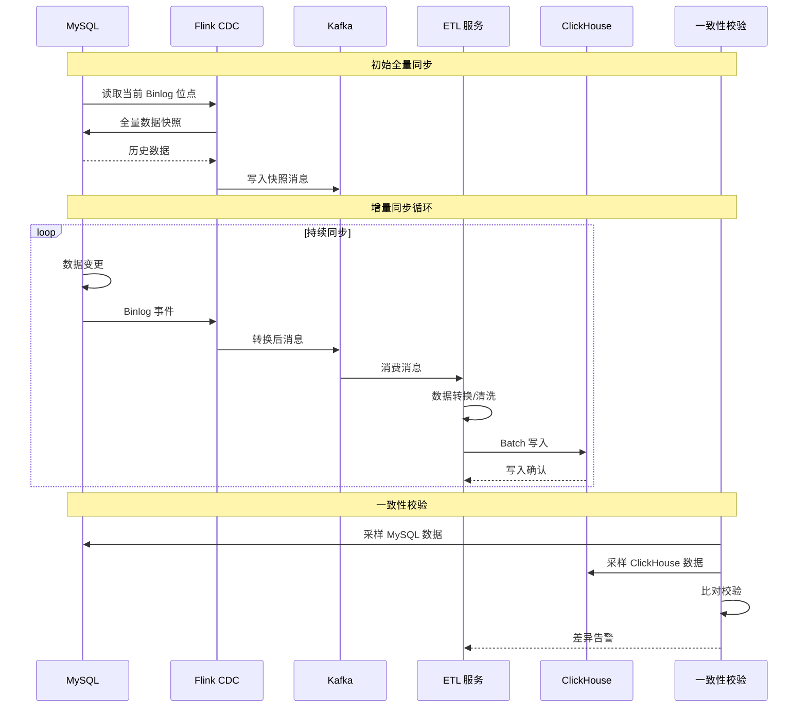

### 6.4 ClickHouse 表结构设计要点

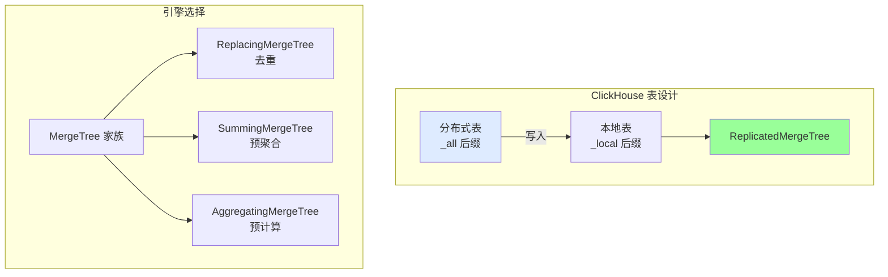

---

## 七、数据一致性保障

### 7.1 一致性模型

| 场景 | 一致性级别 | 实现方式 | 容忍延迟 |
|------|-----------|----------|----------|
| 实时查询 | 最终一致性 | CDC 异步同步 | 5-10 秒 |
| 报表分析 | 最终一致性 | 批量聚合 | 分钟级 |
| 对账审计 | 强一致性 | 定时校验 + 修复 | T+1 |

### 7.2 延迟容忍策略

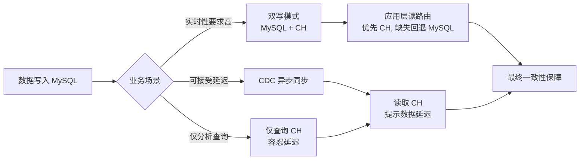

### 7.3 冲突解决策略

| 冲突类型 | 检测方式 | 解决策略 |
|----------|----------|----------|
| 重复写入 | 主键冲突 | 以 MySQL 为准，CH 执行 REPLACE |
| 乱序更新 | 时间戳比对 | 保留最新版本 |
| 删除同步 | 软删除标记 | CDC 捕获 deleted=1 同步删除 |
| 数据差异 | 定时 checksum | 自动重放 Binlog 修复 |

### 7.4 故障恢复流程

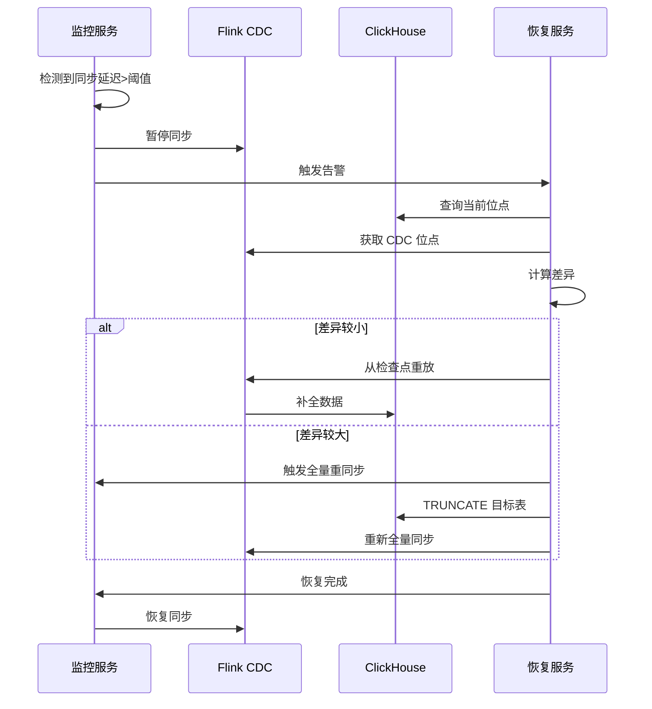

---

## 八、数据归档策略

### 8.1 热/温/冷数据定义

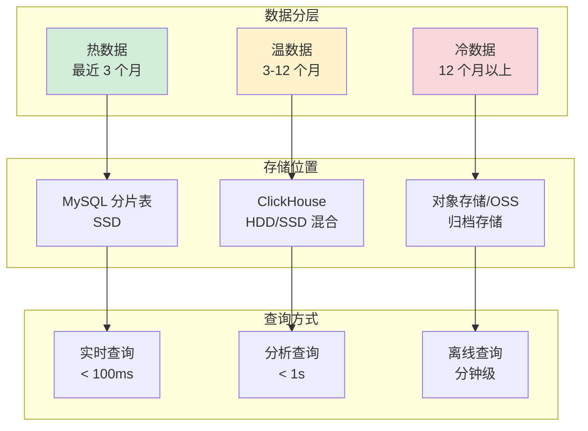

### 8.2 数据生命周期

| 表名 | 热数据保留 | 温数据保留 | 冷数据保留 | 自动删除 |
|------|-----------|-----------|-----------|----------|
| audit_log | 3 个月 | 12 个月 | 永久 | 可选 |
| event_log | 3 个月 | 12 个月 | 永久 | 可选 |
| cicd_pipeline_run | 6 个月 | 24 个月 | 永久 | 可选 |
| ai_inference_log | 3 个月 | 6 个月 | 12 个月 | 是 |
| k8s_sync_log | 1 个月 | 6 个月 | 12 个月 | 是 |

### 8.3 归档流程

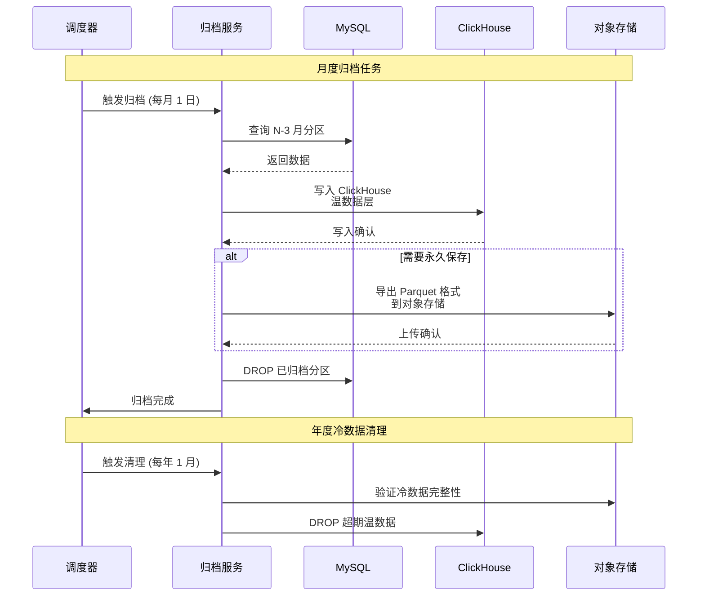

### 8.4 归档后查询方案

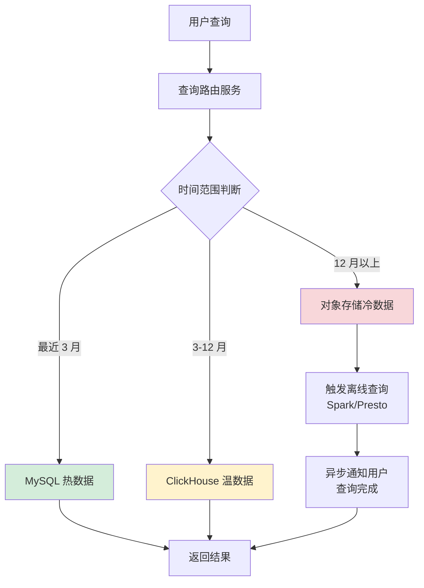

---

## 九、实施计划

### 9.1 阶段划分

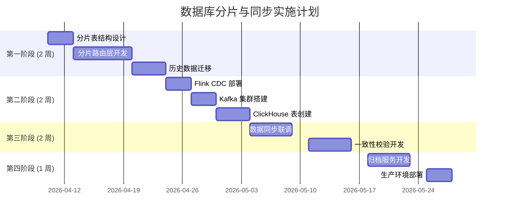

### 9.2 风险与缓解

| 风险 | 影响 | 缓解措施 |
|------|------|----------|
| 数据迁移期间服务中断 | 高 | 双写过渡，灰度切换 |
| CDC 同步延迟过高 | 中 | 增加 Kafka 分区，优化 Batch 大小 |
| 分片键设计不合理 | 高 | 预留二次分片能力 |
| ClickHouse 写入瓶颈 | 中 | 分布式表 + 多副本 |

---

## 十、监控指标

### 10.1 核心监控指标

| 指标 | 目标值 | 告警阈值 |
|------|--------|----------|
| CDC 同步延迟 | < 5 秒 | > 30 秒 |
| 分片数据均衡度 | > 90% | < 70% |
| 查询响应时间 (P99) | < 200ms | > 1s |
| 归档任务成功率 | 100% | < 99% |
| 数据一致性校验通过率 | 100% | < 99.9% |

---

## 附录：术语表

| 术语 | 解释 |
|------|------|
| CDC | Change Data Capture，变更数据捕获 |
| Binlog | MySQL 二进制日志，记录所有数据变更 |
| Shard Key | 分片键，用于确定数据归属的分片 |
| MergeTree | ClickHouse 表引擎家族 |
| TTL | Time To Live，数据生存周期 |

---

_文档版本：v1.0_  
_创建日期：2026-04-10_  
_下次评审：2026-07-10_
