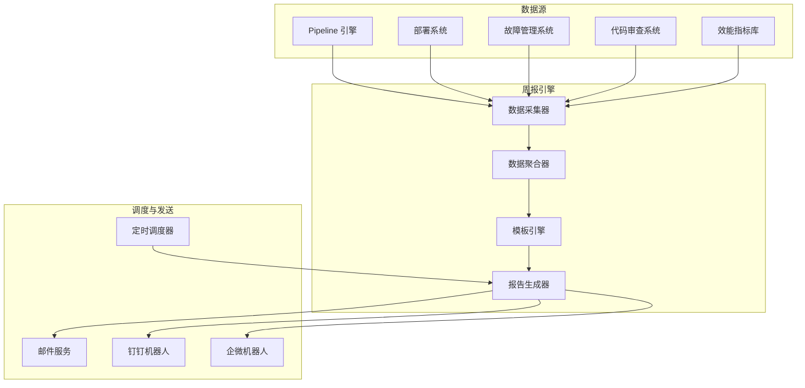

# 自动周报设计

> 版本：v1.0 | 创建日期：2026-04-11 | 状态：草案

---

## 1. 概述

### 1.1 设计目标

自动采集研发效能数据，生成个性化周报，节省 Tech Lead 统计时间，提升团队透明度。

**对应需求**: FR-1.8 — 作为 Tech Lead，我想要自动周报，以便节省统计时间

### 1.2 核心能力

| 能力 | 说明 | 优先级 |
|------|------|--------|
| 自动数据采集 | Pipeline、部署、故障、效能指标 | P0 |
| 周报模板引擎 | 可定制模板、多角色适配 | P0 |
| 定时调度 | 每周一 9 点自动生成 | P0 |
| 多渠道发送 | 邮件、钉钉、企微 | P0 |
| 个性化定制 | 按角色/团队定制内容 | P1 |
| 历史对比 | 与上周/上月对比 | P1 |

### 1.3 周报示例

```
┌─────────────────────────────────────────────────────────────────────────┐
│  📊 支付平台组 · 研发效能周报                                           │
│  周期：2026-04-05 ~ 2026-04-11                                         │
├─────────────────────────────────────────────────────────────────────────┤
│                                                                         │
│  📈 核心指标                                                            │
│  ──────────────────────────────────────────────────────────────────     │
│  • 部署次数：28 次 (↑12% vs 上周)                                        │
│  • 变更前置时间：8.5 分钟 (↓15% vs 上周)                                  │
│  • 变更失败率：3.6% (↓2% vs 上周)                                        │
│  • MTTR: 4.2 分钟 (↓10% vs 上周)                                         │
│                                                                         │
│  ✅ 本周亮点                                                            │
│  ──────────────────────────────────────────────────────────────────     │
│  • CI 时间从 35 分钟降至 8 分钟 (AI 智能测试选择生效)                       │
│  • 自愈引擎自动修复 15 次故障，MTTR 降低 85%                               │
│  • 代码审查一次通过率 82% (↑10%)                                        │
│                                                                         │
│  ⚠️ 需要关注                                                            │
│  ──────────────────────────────────────────────────────────────────     │
│  • 周三部署失败 2 次 (原因：数据库迁移脚本错误)                            │
│  • 2 个服务覆盖率低于 70% 目标                                            │
│                                                                         │
│  👥 团队贡献榜                                                          │
│  ──────────────────────────────────────────────────────────────────     │
│  • 提交最多：张三 (45 commits)                                          │
│  • 审查最多：李四 (38 reviews)                                          │
│  • 修复故障：王五 (12 次)                                                 │
│                                                                         │
│  📋 待办事项                                                            │
│  ──────────────────────────────────────────────────────────────────     │
│  • 3 个高风险变更待审批                                                  │
│  • 5 个技术债项需在本周处理                                               │
│                                                                         │
│  [查看详细报告] [导出 PDF] [订阅设置]                                    │
│                                                                         │
└─────────────────────────────────────────────────────────────────────────┘
```

---

## 2. 周报生成架构

### 2.1 系统架构



### 2.2 组件说明

| 组件 | 职责 | 技术选型 |
|------|------|---------|
| 数据采集器 | 从各系统采集原始数据 | Go + REST Client |
| 数据聚合器 | 数据清洗、聚合、计算 | Go + SQL |
| 模板引擎 | 周报模板渲染 | Go template / Handlebars |
| 报告生成器 | 生成 HTML/PDF 报告 | Go + wkhtmltopdf |
| 定时调度器 | 定时触发周报生成 | Cron + NATS |
| 通知服务 | 多渠道发送 | Go + SMTP/钉钉 API/企微 API |

---

## 3. 数据采集

### 3.1 数据源列表

| 数据源 | 采集内容 | 采集频率 |
|--------|---------|---------|
| **Pipeline 引擎** | 运行次数、成功率、耗时、失败原因 | 实时 |
| **部署系统** | 部署次数、环境、状态、回滚次数 | 实时 |
| **故障管理系统** | 故障数量、MTTR、根因分类、自愈次数 | 实时 |
| **代码审查系统** | 审查次数、一次通过率、平均审查时间 | 实时 |
| **效能指标库** | DORA 四指标、团队对比、趋势 | 每小时 |

### 3.2 数据采集 API

```yaml
# 周报数据采集 API
api:
  base_path: /api/v1/weekly-report/data

  endpoints:
    # Pipeline 数据
    - GET /pipelines
      params:
        - team_id
        - start_date
        - end_date
      response:
        total_runs: number
        success_rate: number
        avg_duration: number
        failure_reasons: array

    # 部署数据
    - GET /deployments
      params:
        - team_id
        - start_date
        - end_date
      response:
        total_deployments: number
        by_environment: object
        rollback_count: number

    # 故障数据
    - GET /incidents
      params:
        - team_id
        - start_date
        - end_date
      response:
        total_incidents: number
        mttr_minutes: number
        auto_resolved: number
        root_causes: array

    # 代码审查数据
    - GET /code-reviews
      params:
        - team_id
        - start_date
        - end_date
      response:
        total_reviews: number
        first_pass_rate: number
        avg_review_time_minutes: number
        top_reviewers: array
```

### 3.3 数据聚合查询

```sql
-- 周报数据聚合查询示例
WITH weekly_metrics AS (
    SELECT
        team_id,
        COUNT(*) FILTER (WHERE status = 'success') as successful_runs,
        COUNT(*) as total_runs,
        AVG(duration_seconds) as avg_duration,
        -- DORA 指标计算
        COUNT(DISTINCT deployment_id) as deployment_frequency,
        PERCENTILE_CONT(0.5) WITHIN GROUP (ORDER BY commit_to_deploy_seconds) as lead_time
    FROM pipeline_runs
    WHERE created_at >= $1 AND created_at < $2
    GROUP BY team_id
)
SELECT
    t.team_name,
    wm.successful_runs,
    wm.total_runs,
    ROUND(wm.successful_runs * 100.0 / NULLIF(wm.total_runs, 0), 2) as success_rate,
    ROUND(wm.avg_duration / 60, 2) as avg_duration_minutes,
    wm.deployment_frequency,
    ROUND(wm.lead_time / 60, 2) as lead_time_minutes,
    -- 与上周对比
    LAG(wm.total_runs) OVER (PARTITION BY team_id ORDER BY week_start) as prev_week_runs
FROM weekly_metrics wm
JOIN teams t ON wm.team_id = t.id
WHERE wm.team_id = $3
ORDER BY week_start DESC;
```

---

## 4. 周报模板引擎

### 4.1 模板结构

```yaml
# 周报模板配置
weekly_report_template:
  sections:
    - id: header
      type: static
      content: |
        <h1>{{team_name}} · 研发效能周报</h1>
        <p>周期：{{start_date}} ~ {{end_date}}</p>
    
    - id: core_metrics
      type: metrics
      title: "📈 核心指标"
      metrics:
        - name: deployment_frequency
          label: 部署次数
          format: number
          comparison: week_over_week
        - name: lead_time
          label: 变更前置时间
          format: duration
          comparison: week_over_week
        - name: change_failure_rate
          label: 变更失败率
          format: percentage
          comparison: week_over_week
        - name: mttr
          label: MTTR
          format: duration
          comparison: week_over_week
    
    - id: highlights
      type: ai_generated
      title: "✅ 本周亮点"
      prompt: |
        基于以下数据生成 3-5 个亮点：
        - 部署次数：{{deployment_frequency}} ({{deployment_frequency_change}})
        - CI 时间：{{ci_duration}} ({{ci_duration_change}})
        - 审查通过率：{{review_pass_rate}} ({{review_pass_rate_change}})
        - 自愈次数：{{auto_resolved_count}}
    
    - id: concerns
      type: ai_generated
      title: "⚠️ 需要关注"
      prompt: |
        基于以下数据生成 2-3 个关注项：
        - 失败部署：{{failed_deployments}}
        - 低覆盖率服务：{{low_coverage_services}}
        - 高风险变更：{{high_risk_changes}}
    
    - id: contributions
      type: leaderboard
      title: "👥 团队贡献榜"
      rankings:
        - name: top_committer
          label: 提交最多
          metric: commit_count
        - name: top_reviewer
          label: 审查最多
          metric: review_count
        - name: top_fixer
          label: 修复故障最多
          metric: incident_resolved_count
    
    - id: action_items
      type: dynamic
      title: "📋 待办事项"
      sources:
        - pending_approvals
        - technical_debt
        - low_coverage_services
```

### 4.2 AI 生成内容

```json
{
  "prompt_template": "你是一位专业的研发效能分析师。请基于以下数据生成周报内容：\n\n**数据**:\n{{json_data}}\n\n**要求**:\n1. 亮点：突出改进和成就，用数据支撑\n2. 关注项：指出问题和风险，给出建议\n3. 语气：积极但客观\n4. 长度：亮点 3-5 条，关注项 2-3 条\n5. 格式：每条以 emoji 开头，简洁明了\n\n**生成内容**:",
  "model": "qwen-max",
  "max_tokens": 500,
  "temperature": 0.7
}
```

---

## 5. 定时调度机制

### 5.1 调度配置

```yaml
# 周报调度配置
schedule:
  # 生成时间：每周一 9:00
  generation:
    cron: "0 9 * * 1"
    timezone: "Asia/Shanghai"
  
  # 发送时间：每周一 9:30 (生成后 30 分钟)
  delivery:
    cron: "30 9 * * 1"
    timezone: "Asia/Shanghai"
  
  # 数据截止时间：每周日 23:59
  data_cutoff:
    cron: "59 23 * * 0"
    timezone: "Asia/Shanghai"

# 触发方式
trigger:
  # 定时触发
  - type: cron
    enabled: true
  
  # 手动触发 (API)
  - type: api
    endpoint: POST /api/v1/weekly-report/generate
  
  # 事件触发 (数据补全后)
  - type: event
    event: weekly_data.complete
```

### 5.2 NATS 事件定义

```json
{
  "event_type": "weekly_report.scheduled",
  "timestamp": "2026-04-11T09:00:00+08:00",
  "payload": {
    "team_id": "payment-team",
    "report_week": "2026-W15",
    "start_date": "2026-04-05",
    "end_date": "2026-04-11",
    "recipients": [
      "tech_lead_li@company.com",
      "payment-team-dingtalk@company.com"
    ],
    "template": "default"
  }
}
```

---

## 6. 多渠道发送

### 6.1 发送渠道

| 渠道 | 格式 | 适用场景 |
|------|------|---------|
| **邮件** | HTML + PDF 附件 | 正式报告、存档 |
| **钉钉** | Markdown 卡片 | 即时通知、快速查看 |
| **企微** | Markdown 卡片 | 即时通知、快速查看 |
| **Slack** | Rich Preview | 国际化团队 |

### 6.2 钉钉机器人消息

```json
{
  "msgtype": "markdown",
  "markdown": {
    "title": "📊 支付平台组 · 研发效能周报",
    "text": "## 📊 支付平台组 · 研发效能周报\n**周期**: 2026-04-05 ~ 2026-04-11\n\n### 📈 核心指标\n- 部署次数：**28 次** (↑12% vs 上周)\n- 变更前置时间：**8.5 分钟** (↓15% vs 上周)\n- 变更失败率：**3.6%** (↓2% vs 上周)\n- MTTR: **4.2 分钟** (↓10% vs 上周)\n\n### ✅ 本周亮点\n- CI 时间从 35 分钟降至 8 分钟\n- 自愈引擎自动修复 15 次故障\n\n[查看详细报告](http://orion/reports/weekly/2026-W15)"
  },
  "at": {
    "isAtAll": true
  }
}
```

---

## 7. 个性化定制

### 7.1 角色适配

| 角色 | 关注内容 | 报告重点 |
|------|---------|---------|
| **Tech Lead** | 团队效能、风险、待办 | 完整报告 + 待办事项 |
| **Developer** | 个人贡献、审查任务 | 个人贡献榜 + 待审查 PR |
| **Org Admin** | 多团队对比、成本 | 团队排名 + 成本分析 |
| **SRE** | 故障、自愈、告警 | 故障统计 + 自愈报告 |

### 7.2 订阅配置

```yaml
# 周报订阅配置
subscription:
  default_recipients:
    - role: tech_lead
      channels: [email, dingtalk]
      template: full
    - role: developer
      channels: [dingtalk]
      template: lite
    - role: org_admin
      channels: [email]
      template: executive
  
  custom_settings:
    - user: tech_lead_li
      additional_recipients:
        - payment-team-dingtalk@company.com
      sections:
        - core_metrics
        - highlights
        - action_items
      format: html
```

---

## 8. API 设计

```yaml
# 周报 API
api:
  base_path: /api/v1/weekly-reports

  endpoints:
    # 生成
    - POST   /generate                    # 手动触发周报生成
    - GET    /generate/{report_id}/status # 查询生成状态
    
    # 查询
    - GET    /                            # 周报列表
    - GET    /{id}                        # 周报详情
    - GET    /{id}/pdf                    # 下载 PDF
    
    # 订阅
    - GET    /subscriptions               # 我的订阅
    - PUT    /subscriptions               # 更新订阅
    - DELETE /subscriptions/{id}          # 取消订阅
    
    # 模板
    - GET    /templates                   # 模板列表
    - PUT    /templates/{id}              # 更新模板
```

---

## 9. 实施计划

| Phase | 时间 | 任务 | 产出 |
|-------|------|------|------|
| **Phase 1** | 1 周 | 数据采集器、聚合查询 | 数据管道 |
| **Phase 2** | 1 周 | 模板引擎、AI 生成 | 报告生成 |
| **Phase 3** | 3 天 | 定时调度、NATS 事件 | 自动触发 |
| **Phase 4** | 2 天 | 多渠道发送 | 邮件/钉钉/企微 |
| **Phase 5** | 2 天 | 订阅配置、个性化 | 用户定制 |

---

_自动周报将 Tech Lead 从繁琐的统计工作中解放出来，专注于团队改进。_
