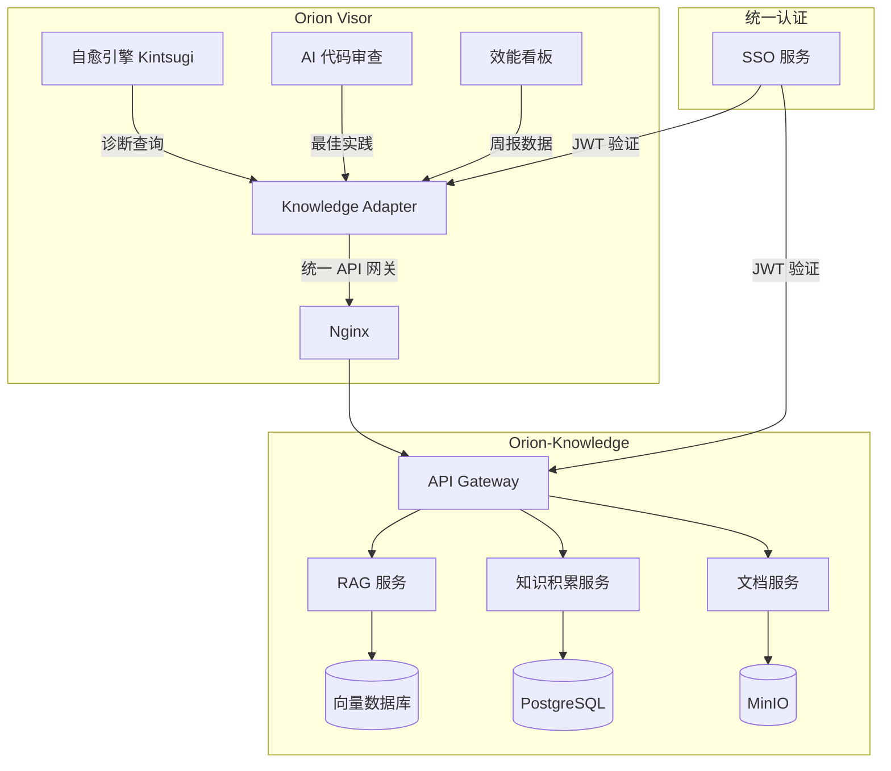
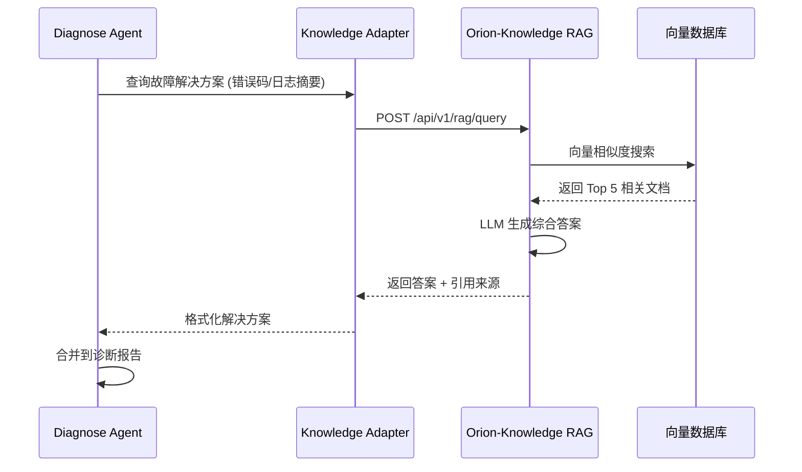
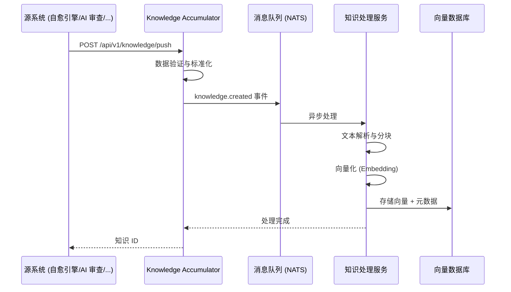
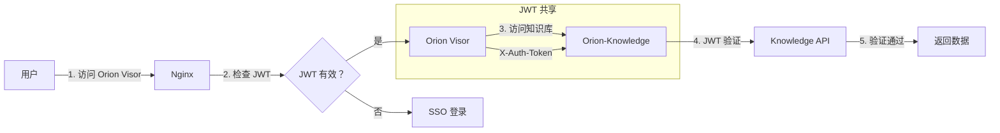

# Orion-Knowledge 集成方案

> 版本：v1.0 | 创建日期：2026-04-11 | 状态：草案

---

## 1. 概述

### 1.1 集成目标

将 Orion-Knowledge 知识库与 Orion Visor 主系统深度集成，实现故障诊断自动查询历史解决方案、知识自动沉淀、统一用户入口。

**对应需求**: US-6.5 — 作为 SRE，我想要故障知识库，以便查询历史解决方案

### 1.2 集成范围

| 集成项 | 说明 | 优先级 |
|--------|------|--------|
| RAG API 对接 | 诊断模块调用知识库 RAG 接口 | P0 |
| 自动知识积累 | 故障/审查/优化记录自动推送 | P0 |
| SSO 集成 | JWT 共享，统一认证 | P0 |
| 统一导航 | 主系统导航栏嵌入入口 | P0 |
| 健康检查 | 知识库可用性感知 | P1 |
| 降级策略 | 知识库不可用时的处理 | P1 |

### 1.3 集成架构



---

## 2. RAG API 对接

### 2.1 诊断查询流程



### 2.2 查询请求格式

```json
{
  "query": "数据库连接池耗尽，错误码：CONNECTION_POOL_EXHAUSTED",
  "context": {
    "service": "payment-service",
    "error_code": "CONNECTION_POOL_EXHAUSTED",
    "log_snippet": "HikariPool-1 - Connection is not available...",
    "metrics": {
      "active_connections": 50,
      "max_connections": 50,
      "wait_queue_size": 128
    }
  },
  "filters": {
    "tags": ["database", "connection-pool", "hikari"],
    "min_relevance": 0.7,
    "max_results": 5
  },
  "options": {
    "include_code_fix": true,
    "include_runbook": true,
    "generate_summary": true
  }
}
```

### 2.3 查询响应格式

```json
{
  "query_id": "rag-20260411-103000-abc123",
  "answer": "根据历史故障记录，数据库连接池耗尽通常由以下原因导致：\n\n1. **连接泄漏**：代码未正确关闭连接\n2. **慢查询**：查询执行时间过长占用连接\n3. **并发量激增**：超出连接池设计容量\n\n**推荐修复方案**：\n1. 临时扩容：将 max_connections 从 50 提升到 100\n2. 启用连接泄漏检测：leakDetectionThreshold=30000\n3. 检查慢查询日志，优化 Top 3 慢 SQL",
  "sources": [
    {
      "doc_id": "kb-db-001",
      "title": "HikariCP 连接池故障排查手册",
      "url": "/knowledge/kb-db-001",
      "relevance_score": 0.92,
      "excerpt": "连接池耗尽的常见原因和解决方案..."
    },
    {
      "doc_id": "kb-incident-2025-042",
      "title": "2025-12-15 支付服务连接池耗尽事故复盘",
      "url": "/knowledge/kb-incident-2025-042",
      "relevance_score": 0.85,
      "excerpt": "根本原因：订单查询 SQL 缺少索引导致慢查询..."
    }
  ],
  "suggested_actions": [
    {
      "type": "runbook",
      "title": "连接池紧急扩容",
      "url": "/runbooks/db-connection-pool-scaling"
    },
    {
      "type": "code_fix",
      "title": "启用连接泄漏检测配置",
      "code": "spring.datasource.hikari.leak-detection-threshold=30000"
    }
  ],
  "metadata": {
    "query_time_ms": 245,
    "vector_search_time_ms": 89,
    "llm_generation_time_ms": 156
  }
}
```

---

## 3. 自动知识积累

### 3.1 知识来源

| 来源 | 触发条件 | 推送内容 |
|------|---------|---------|
| **故障诊断** | 自愈引擎完成诊断 | 故障现象、根因、修复方案、验证结果 |
| **代码审查** | AI 审查发现典型问题 | 问题类型、修复模式、最佳实践 |
| **性能优化** | 性能分析完成 | 瓶颈分析、优化方案、效果对比 |
| **架构决策** | ADR 审批通过 | 决策背景、方案对比、决策结果 |
| **事故复盘** | Postmortem 完成 | 事故时间线、根因、改进措施 |

### 3.2 知识推送流程



### 3.3 知识数据模型

```json
{
  "id": "kb-auto-20260411-001",
  "source": {
    "system": "kintsugi",
    "type": "incident_diagnosis",
    "original_id": "incident-20260411-103000"
  },
  "title": "支付服务数据库连接池耗尽故障诊断",
  "category": "troubleshooting",
  "tags": ["database", "connection-pool", "payment-service", "hikari"],
  "content": {
    "symptoms": "数据库连接池耗尽，错误码：CONNECTION_POOL_EXHAUSTED",
    "root_cause": "订单查询 SQL 缺少索引导致慢查询，占用所有连接",
    "solution": "1. 临时扩容连接池 2. 添加 SQL 索引 3. 启用慢查询监控",
    "verification": "索引添加后，查询时间从 5s 降至 50ms，连接池恢复正常",
    "prevention": "1. 新增 SQL 审核规则 2. 配置慢查询告警"
  },
  "metadata": {
    "service": "payment-service",
    "severity": "P1",
    "duration_minutes": 15,
    "affected_users": 1200,
    "created_by": "kintsugi-agent",
    "reviewed_by": null
  },
  "status": "auto_created",
  "created_at": "2026-04-11T10:30:00Z"
}
```

### 3.4 知识审核流程

```yaml
知识审核:
  自动创建:
    - 状态：auto_created
    - 可见性：仅创建者团队
    - 可被 AI 诊断引用
  
  人工审核:
    - 触发：知识被引用 3 次以上
    - 审核人：Tech Lead / 领域专家
    - 审核结果:
      - approved: 公开给全组织
      - revised: 需要修改
      - rejected: 归档不公开
  
  定期复审:
    - 频率：每季度
    - 检查：知识是否过期、方案是否仍有效
    - 结果：更新/归档/删除
```

---

## 4. SSO 集成方案

### 4.1 认证架构



### 4.2 JWT 传递

```yaml
JWT 配置:
  签发方：orion-sso
  受众：
    - orion-visor
    - orion-knowledge
  
  传递方式:
    - Header: X-Auth-Token: Bearer {jwt}
    - Cookie: orion_session (HttpOnly)
  
  验证逻辑:
    1. 验证签名 (RS256)
    2. 验证有效期 (exp)
    3. 验证受众 (aud)
    4. 提取用户信息 (sub, roles, teams)
```

### 4.3 权限映射

| Orion Visor 角色 | Orion-Knowledge 权限 |
|-----------------|---------------------|
| orion_admin | knowledge_admin (所有权限) |
| org_admin | knowledge_editor (本组织读写) |
| tech_lead | knowledge_editor (本团队读写) |
| developer | knowledge_viewer (本团队读) + contributor (贡献) |
| viewer | knowledge_viewer (本团队读) |

---

## 5. 统一导航集成

### 5.1 导航栏集成

```
┌─────────────────────────────────────────────────────────────────────────┐
│  Orion Visor 导航栏                                                     │
├─────────────────────────────────────────────────────────────────────────┤
│                                                                         │
│  [Orion Logo]  [效能]  [流水线]  [审批]  [AI 审查]  [知识库▼]  [设置]   │
│                                                              │          │
│                         ┌────────────────────────────────────┘          │
│                         │                                               │
│                         │  📚 知识库                                   │
│                         │  ────────────────────                        │
│                         │  📖 文档中心                                 │
│                         │  💬 AI 问答                                   │
│                         │  🔧 故障手册                                 │
│                         │  📊 最佳实践                                 │
│                         │  ────────────────────                        │
│                         │  [管理后台] [我的贡献]                        │
│                         └───────────────────────────────────────────────│
│                                                                         │
└─────────────────────────────────────────────────────────────────────────┘
```

### 5.2 健康状态感知

```yaml
导航栏知识库入口:
  显示逻辑:
    - 知识库健康：显示完整入口
    - 知识库不健康：显示灰色入口 + 提示
    - 知识库不可用：隐藏入口
  
  健康检查:
    endpoint: GET /api/knowledge/health
    interval: 30s
    timeout: 5s
    
  状态指示:
    🟢 健康：正常显示
    🟡 降级：灰色 + "部分功能不可用"
    🔴 不可用：隐藏或显示"维护中"
```

---

## 6. 健康检查与降级

### 6.1 健康检查端点

```yaml
GET /api/knowledge/health

响应示例:
{
  "status": "healthy",
  "timestamp": "2026-04-11T10:30:00Z",
  "components": {
    "api": {
      "status": "healthy",
      "response_time_ms": 12
    },
    "rag_service": {
      "status": "healthy",
      "response_time_ms": 245
    },
    "vector_db": {
      "status": "healthy",
      "connections": 5,
      "max_connections": 20
    },
    "llm": {
      "status": "degraded",
      "response_time_ms": 3500,
      "error_rate": 0.05,
      "message": "LLM 响应延迟高"
    }
  },
  "overall_status": "degraded"
}
```

### 6.2 降级策略

```yaml
降级级别:
  L0 - 正常:
    - 完整 RAG 查询
    - LLM 生成答案
    - 向量相似度搜索
  
  L1 - 部分降级 (LLM 不可用):
    - 返回原始搜索结果
    - 不生成综合答案
    - 显示引用文档列表
  
  L2 - 严重降级 (向量库不可用):
    - 切换到关键词搜索
    - 返回最近 10 篇文档
    - 提示"智能搜索暂时不可用"
  
  L3 - 完全不可用:
    - 隐藏知识库入口
    - 本地缓存常用 Runbook
    - 提示"知识库维护中，预计恢复时间 XX:XX"
```

### 6.3 降级配置

```yaml
degradation:
  thresholds:
    llm_error_rate: 0.1      # LLM 错误率>10% 触发 L1
    vector_db_error_rate: 0.2  # 向量库错误率>20% 触发 L2
    api_error_rate: 0.5      # API 错误率>50% 触发 L3
  
  recovery:
    auto_recovery: true
    health_check_interval: 30s
    consecutive_success: 3   # 连续 3 次成功恢复
```

---

## 7. 实施计划

| Phase | 时间 | 任务 | 产出 |
|-------|------|------|------|
| **Phase 1** | 1 周 | RAG API 对接、诊断查询集成 | 诊断模块可查询知识库 |
| **Phase 2** | 1 周 | 自动知识积累、NATS 事件 | 故障自动推送知识库 |
| **Phase 3** | 3 天 | SSO 集成、JWT 共享 | 统一认证 |
| **Phase 4** | 2 天 | 导航集成、健康检查 | 统一入口 |
| **Phase 5** | 2 天 | 降级策略、测试 | 高可用保障 |

---

## 8. 风险与缓解

| 风险 | 影响 | 缓解措施 |
|------|------|---------|
| 知识库性能问题 | 诊断延迟增加 | 异步查询 + 超时控制 |
| 知识质量参差不齐 | 误导诊断 | 人工审核 + 评分机制 |
| 敏感信息泄露 | 数据安全风险 | 权限隔离 + 内容脱敏 |
| 知识库单点故障 | 功能不可用 | 降级策略 + 本地缓存 |

---

_Orion-Knowledge 集成使知识库从独立系统变为 Orion 平台的智能大脑。_
