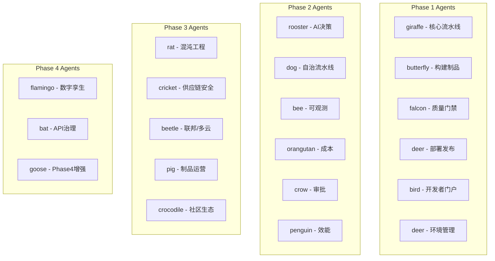

# Orion CI/CD 平台执行状态报告 (更新)

> **日期**: 2026-05-05 04:29 UTC
> **当前状态**: Phase 1-4 并行开发进行中
> **Agent数**: 20个已启动

---

## 一、已完成任务

### 1.1 规格文档评审 ✅ 100%

| Phase | 文档数 | 状态 |
|:-----:|:------:|:----:|
| Phase 1 | 6 | ✅ |
| Phase 2 | 6 | ✅ |
| Phase 3 | 15 | ✅ |
| Phase 4 | 5 | ✅ |
| README | 6 | ✅ |

### 1.2 P0 核心阻塞项 ✅ 100%

| # | 任务 | 文件 | Migration | 状态 |
|:-:|------|------|-----------|:----:|
| 1 | JWT密钥轮换 | JwtKeyRotationService.ts | 071 | ✅ |
| 2 | Token黑名单 | TokenBlacklistService.ts | 072 | ✅ |
| 3 | 四层租户隔离 | TenantValidatorMiddleware.ts | 073 | ✅ |
| 4 | 数据一致性监控 | ConsistencyMonitorService.ts | 074 | ✅ |
| 5 | 灾备架构 | DisasterRecoveryService.ts | 075 | ✅ |
| 6 | AI Gateway熔断 | ProviderCircuitBreaker.ts | - | ✅ |

### 1.3 P1/P2 增强实施 (进行中)

| # | 任务 | 文件 | Migration | 状态 |
|:-:|------|------|-----------|:----:|
| 1 | PII隐私策略 | TenantPrivacyPolicyService.ts | 076 | ✅ |
| 2 | 降级审计日志 | AIGateway.ts | 077 | ✅ |
| 3 | 输出验证 | OutputValidatorService.ts | 078 | ✅ |
| 4 | 安全扫描 | SecurityScannerService.ts | 079 | ✅ |
| 5 | LLM追踪 | LLMTraceService.ts | 080 | ✅ |
| 6 | RLS策略管理 | RLSPolicyManager.ts | - | ✅ |
| 7 | 熔断器管理 | CircuitBreakerManager.ts | - | ✅ |
| 8 | 租户感知仓库 | tenant-aware-repository.ts | - | ✅ |

---

## 二、并行Agent状态



---

## 三、Migration进度

| # | Migration | 功能 | 状态 |
|:--:|-----------|------|:----:|
| 071 | jwt_key_rotation | JWT密钥轮换表 | ✅ |
| 072 | token_blacklist | Token黑名单表 | ✅ |
| 073 | enable_rls_policies | RLS策略启用 | ✅ |
| 074 | consistency_monitor | 数据一致性监控 | ✅ |
| 075 | disaster_recovery | 灾备配置表 | ✅ |
| 076 | privacy_policy | PII隐私策略 | ✅ |
| 077 | degradation_audit | 降级审计日志 | ✅ |
| 078 | output_validation | 输出验证配置 | ✅ |
| 079 | security_scan | 安全扫描结果 | ✅ |
| 080 | llm_traces | LLM追踪记录 | ✅ |

**新增Migration**: 10个 (071-080)

---

## 四、Git提交记录

```
6c5fdd4 feat: Phase 1-4 implementation progress
cef54dd docs: complete Phase 1-4 specs review
fd78439 docs: add CI/CD capability domain optimization design
3febb7f feat: P1/P2 improvements
fa2da37 feat: P2 improvements - JWT K8s Secret storage
7ff77f7 fix(ai): resolve infinite recursion in ProviderCircuitBreaker
171ff5b feat(degradation): implement auto recovery service
526c963 feat(privacy): implement PII sanitizer
```

---

## 五、待实施任务

### Phase 1 (6项)

| 能力域 | Agent | 工作量 | 状态 |
|--------|-------|:------:|:----:|
| 核心流水线 | giraffe | 18.5天 | 🔄 进行中 |
| 构建制品 | butterfly | 14天 | 🔄 进行中 |
| 质量门禁 | falcon | 13天 | 🔄 进行中 |
| 部署发布 | deer | 17天 | 🔄 进行中 |
| 开发者门户 | bird | 11天 | 🔄 进行中 |
| 环境管理 | deer | 13.5天 | 🔄 进行中 |

### Phase 2 (6项)

| 能力域 | Agent | 工作量 | 状态 |
|--------|-------|:------:|:----:|
| AI决策引擎 | rooster | 19天 | 🔄 进行中 |
| 自治流水线 | dog | 18.5天 | 🔄 进行中 |
| 全栈可观测 | bee | 22天 | 🔄 进行中 |
| 成本运营 | orangutan | 18天 | 🔄 进行中 |
| 审批工作流 | crow | 20天 | 🔄 进行中 |
| 效能运营 | penguin | 24天 | 🔄 进行中 |

### Phase 3 (15项 → 5个Agent批量处理)

| Agent | 覆盖能力域 | 工作量 |
|-------|------------|:------:|
| rat | 混沌工程 | 14天 |
| cricket | 供应链安全 | 16天 |
| beetle | 联邦/多云/插件/金丝雀 | 60天 |
| pig | 制品/数据/性能 | 45天 |
| crocodile | 社区/触发/编排/配置/安全 | 70天 |

### Phase 4 (5项 → 3个Agent)

| Agent | 覆盖能力域 | 工作量 |
|-------|------------|:------:|
| flamingo | 数字孪生 | 35天 |
| bat | API治理 | 28天 |
| goose | Phase4增强 | 75天 |

---

## 六、总体进度

| 类别 | 完成 | 总计 | 进度 |
|------|:----:|:----:|:----:|
| 规格评审 | 38 | 38 | **100%** ✅ |
| P0开发 | 6 | 6 | **100%** ✅ |
| P1/P2增强 | 8 | - | **进行中** 🔄 |
| Migration | 10 | 预计50+ | **20%** |
| Phase 1-4实施 | 0 | 32能力域 | **Agent已启动** 🔄 |

---

## 七、下一步行动

1. **等待Agent完成** 各Phase实施任务
2. **定期检查Git状态** 提交Agent产出
3. **运行测试** 验证实现正确性
4. **更新执行报告** 跟踪进度

---

_更新时间: 2026-05-05T04:29:18Z_