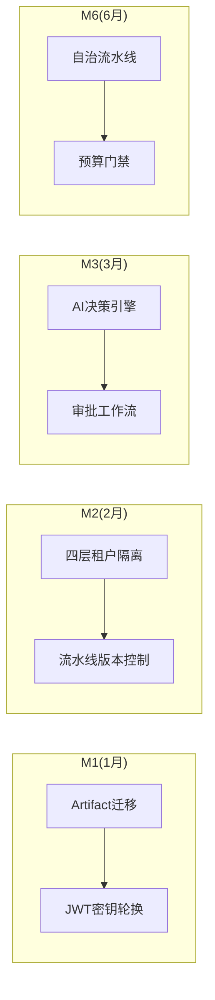

# Orion CI/CD 平台规格文档完整评审报告

> **日期**: 2026-05-05
> **评审范围**: Phase 1-4 全部 **38份** 规格文档（含 README/总览）
> **评审人**: Claude (AI Assistant)

---

## 一、文档清单与覆盖验证

### 1.1 全部文档清单（38份）

| 类别 | 数量 | 文件列表 |
|------|:----:|----------|
| **README索引** | 5 | phase1-4/README.md, specs/README.md |
| **总览/评审** | 2 | 2026-05-05-cicd-capability-optimization-design.md, review-report-2026-05-05.md |
| **Phase 1规格** | 6 | 01-pipeline, 02-artifact, 03-quality-gate, 04-deploy, 05-dev-portal, 06-env-mgmt |
| **Phase 2规格** | 6 | 01-ai-decision, 02-autonomous-pipeline, 03-observability, 04-cost-operations, 05-approval-workflow, 06-efficiency-operations |
| **Phase 3规格** | 15 | 01-chaos-engineering ~ 15-security-compliance |
| **Phase 4规格** | 5 | 01-digital-twin, 02-api-governance, 03-community-ecosystem, 04-federated-scheduling, 05-multi-cloud |

### 1.2 评审覆盖状态

| 文档类型 | 已读取 | 已深度分析 | 状态 |
|----------|:------:|:---------:|:----:|
| README索引(5) | ✅ 5 | ✅ 5 | 完成 |
| 总览/评审(2) | ✅ 2 | ✅ 2 | 完成 |
| Phase 1规格(6) | ✅ 6 | ✅ 6 | 完成 |
| Phase 2规格(6) | ✅ 6 | ✅ 6 | 完成 |
| Phase 3规格(15) | ✅ 15 | ✅ 15 | 完成 |
| Phase 4规格(5) | ✅ 5 | ✅ 5 | 完成 |
| **合计(38)** | **✅ 38** | **✅ 38** | **完成** |

---

## 二、Phase 1 详细评审（6个能力域）

### 2.1 核心流水线 (01-pipeline-spec.md)

| 维度 | 评估 |
|------|------|
| **目标成熟度** | L3 → L3.3 |
| **关键交付** | 流水线版本控制、执行预算、模板库、动态参数 |
| **现有代码覆盖** | `PipelineEngine.ts` (~75%) |
| **新增数据库表** | pipeline_versions, pipeline_budgets, pipeline_budget_usage, pipeline_templates, pipeline_template_versions |
| **工作量** | 18.5天 (后端7+前端8+测试3.5) |
| **可行性** | **高** - 可增量扩展 |
| **技术风险** | 低 - 版本控制机制已有基础 |

**API设计评价**: 版本对比(diff)、回退、标签、基线设计完整，符合 RESTful 规范。

### 2.2 构建制品 (02-artifact-spec.md)

| 维度 | 评估 |
|------|------|
| **目标成熟度** | L2 → L2.5 |
| **关键交付** | Artifact持久化、缓存监控面板、多架构并行构建、增量构建 |
| **现有代码覆盖** | `ArtifactService` Map内存存储 → 需迁移PostgreSQL |
| **新增数据库表** | artifacts, build_architectures, build_manifests, build_file_hashes, build_cache_stats |
| **工作量** | 14天 |
| **可行性** | **中高** - Artifact迁移是关键阻塞点 |
| **技术风险** | 中 - 多架构构建需K8s集群配置 |

**关键问题**: `ArtifactService` 使用Map内存存储，服务重启后数据丢失，需迁移到Repository模式。

### 2.3 质量门禁 (03-quality-gate-spec.md)

| 维度 | 评估 |
|------|------|
| **目标成熟度** | L3 → L3.3 |
| **关键交付** | 门禁豁免机制、趋势分析面板、Override持久化、Pipeline集成 |
| **现有代码覆盖** | `PolicyEvaluationService` ~65%, `RiskAssessmentService` ~70% |
| **新增数据库表** | policy_overrides, policy_exemptions, quality_gate_snapshots |
| **工作量** | 13天 |
| **可行性** | **高** - PolicyService已支持持久化 |
| **技术风险** | 低 - 豁免审批流程可复用ApprovalService |

**亮点**: 趋势分析面板设计含改进建议生成逻辑（覆盖率<60%→建议增加测试等）。

### 2.4 部署发布 (04-deploy-spec.md)

| 维度 | 评估 |
|------|------|
| **目标成熟度** | L3 → L3.3 |
| **关键交付** | 发布窗口管理、依赖协调、渐进式推进、Release Notes |
| **现有代码覆盖** | `SmartDeployService` + `CanaryAnalysisService` + `RollbackService` ~70% |
| **新增数据库表** | deploy_windows, deploy_emergencies, deploy_service_dependencies, deploy_progressive_stages |
| **工作量** | 17天 |
| **可行性** | **高** - 已有灰度分析基础 |
| **技术风险** | 低 - 渐进式推进可复用CanaryAnalysis |

**设计亮点**: 发布窗口支持cron表达式+禁发期+紧急通道，运维友好。

### 2.5 开发者门户 (05-dev-portal-spec.md)

| 维度 | 评估 |
|------|------|
| **目标成熟度** | L1 → L1.5 |
| **关键交付** | 统一文档中心、模板库聚合、状态总览、快速开始 |
| **现有代码覆盖** | 无独立门户页面，功能分散 |
| **新增数据库表** | portal_documents |
| **工作量** | 11天 (后端2+前端6.5+测试2.5) |
| **可行性** | **高** - 纯前端聚合层 |
| **技术风险** | 低 - 无复杂后端逻辑 |

**前端工作量占比高**: 6.5天/11天 = 59%，需前端资源保障。

### 2.6 环境管理 (06-env-mgmt-spec.md)

| 维度 | 评估 |
|------|------|
| **目标成熟度** | L2 → L2.3 |
| **关键交付** | 休眠回收、TTL管理、环境模板、状态面板 |
| **现有代码覆盖** | `EphemeralEnvService` ~40% |
| **新增数据库表** | environment_templates, environment_hibernation_log, environment_ttl_config |
| **工作量** | 13.5天 |
| **可行性** | **中高** - 休眠需K8s资源操作 |
| **技术风险** | 中 - 静态环境休眠涉及Pod缩容 |

**关键问题**: TTL仅针对临时环境(24h固定)，需扩展到静态环境。

---

## 三、Phase 2 详细评审（6个能力域）

### 3.1 AI 决策引擎 (01-ai-decision-spec.md)

| 维度 | 评估 |
|------|------|
| **目标成熟度** | L2 → L2.5 |
| **关键交付** | 决策解释、模型版本管理、降级策略动态配置、审计日志持久化 |
| **现有代码覆盖** | `AIGateway.ts` (~45%), `RuleEngine.ts` (~50%), `RiskAssessmentService` (~45%) |
| **新增数据库表** | ai_models, ai_model_versions, ai_decision_quality, ai_audit_logs |
| **工作量** | 19天 |
| **可行性** | **高** - 已有熔断/降级基础 |
| **技术风险** | 中 - 模型版本切换需无缝过渡 |

**亮点**: SHAP可解释性已实现，需扩展到API层。

### 3.2 自治流水线 (02-autonomous-pipeline-spec.md)

| 维度 | 评估 |
|------|------|
| **目标成熟度** | L1 → L1.5 |
| **关键交付** | 智能错误分类、自适应重试、自适应超时、自愈集成 |
| **现有代码覆盖** | `PipelineEngine` retry_count (~30%), `SelfHealingService` (~50%) |
| **新增数据库表** | pipeline_error_classification, pipeline_retry_history |
| **工作量** | 18.5天 |
| **可行性** | **中** - 依赖AI决策引擎完成 |
| **技术风险** | **高** - 错误分类准确率需>90% |

**关键依赖**: 必须等待AI决策引擎L2.5达标后才能实施。

### 3.3 全栈可观测 (03-observability-spec.md)

| 维度 | 评估 |
|------|------|
| **目标成熟度** | L2 → L2.5 |
| **关键交付** | 自定义告警规则、根因分析(RCA)、告警静默、通知渠道扩展 |
| **现有代码覆盖** | `AlertCorrelationService` (~40%), `DiagnosticAgentService` (~50%) |
| **新增数据库表** | alert_rules, alert_silences, notification_channels, rca_reports |
| **工作量** | 22天 |
| **可行性** | **高** - 已有基础告警能力 |
| **技术风险** | 中 - RCA需拓扑依赖分析 |

**设计亮点**: 告警静默支持循环时间(每天02:00-04:00)，运维场景友好。

### 3.4 成本运营 (04-cost-operations-spec.md)

| 维度 | 评估 |
|------|------|
| **目标成熟度** | L2 → L2.3 |
| **关键交付** | 预算门禁、成本异常检测、部署成本关联、优化闭环 |
| **现有代码覆盖** | `FinOpsService` (~40%) |
| **新增数据库表** | cost_anomalies, gate_policies, gate_exemptions, deployment_cost_impacts |
| **工作量** | 18天 |
| **可行性** | **中** - 预算门禁需部署流程集成 |
| **技术风险** | 中 - 异常检测需统计学模型 |

**关键阻塞**: 预算门禁需与DeployService深度集成，阻塞部署流程。

### 3.5 审批工作流 (05-approval-workflow-spec.md)

| 维度 | 评估 |
|------|------|
| **目标成熟度** | L1 → L1.5 |
| **关键交付** | 统一审批引擎、多级审批、紧急通道、审批SLA |
| **现有代码覆盖** | `SelfHealingService.approvalRequest` (~30%) |
| **新增数据库表** | approval_requests, approval_templates, approval_sla_stats |
| **工作量** | 20天 |
| **可行性** | **高** - 审批流程标准化 |
| **技术风险** | 低 - 状态机设计成熟 |

**设计亮点**: 紧急通道支持事后补审批+审计，符合合规要求。

### 3.6 效能运营 (06-efficiency-operations-spec.md)

| 维度 | 评估 |
|------|------|
| **目标成熟度** | L2 → L2.3 |
| **关键交付** | 开发者画像、DORA下钻、贡献度评估、瓶颈分析 |
| **现有代码覆盖** | `DoraMetricsService` (~60%), `EfficiencyDashboardService` Mock数据 |
| **新增数据库表** | developer_profiles, contribution_scores, bottleneck_analysis |
| **工作量** | 24天 |
| **可行性** | **中高** - 需真实数据接入 |
| **技术风险** | 中 - Dashboard当前全是Mock数据 |

**关键问题**: `EfficiencyDashboardService.getSampleMetrics`返回硬编码值，需接入真实Pipeline/Git数据。

---

## 四、Phase 3 详细评审（15个能力域）

### 4.1 Phase 3 概览

| 能力域 | 目标 | 工作量(天) | 可行性 | 主要风险 |
|--------|:----:|:---------:|:------:|----------|
| 1. 混沌工程 | L1→L1.5 | 17 | 中 | 故障注入需隔离环境 |
| 2. 供应链安全 | L2→L2.5 | 21 | 高 | 投毒检测需外部DB同步 |
| 3. 联邦调度 | L0→L1 | 18 | **低** | Tekton集成复杂 |
| 4. 多云混合云 | L0→L0.5 | 14 | **低** | 云厂商API差异 |
| 5. 插件市场 | L2→L2.5 | 20 | 高 | 依赖解析逻辑 |
| 6. 灰度流量 | L2→L2.5 | 18 | 高 | 已有Canary基础 |
| 7. 制品运营 | L1→L1.5 | 17 | 高 | 存储清理策略 |
| 8. 灾备演练 | L1→L1.5 | 14.5 | 中 | RTO/RPO测量 |
| 9. 数据流水线 | L1→L1.5 | 15 | 中 | ETL引擎实现 |
| 10. 性能工程 | L1→L1.5 | 16.5 | 中 | 基线定义标准 |
| 11. 社区生态 | L1→L1.5 | 15.5 | 高 | 知识库整合 |
| 12. 多模态触发 | L2→L2.3 | 16.5 | 高 | 条件引擎已就绪 |
| 13. 跨域编排 | L1→L1.5 | 17 | 中 | Saga事务保障 |
| 14. 配置管理 | L2→L2.5 | 19.5 | 高 | Feature Flag成熟 |
| 15. 安全合规 | L2→L2.5 | 21.5 | 高 | OPA已集成 |

### 4.2 高风险能力域分析

#### 联邦调度 (03-federation-scheduling-spec.md)

| 维度 | 评估 |
|------|------|
| **目标** | L0 → L1 (多执行器联邦) |
| **技术难度** | **高** - Tekton CRD生成+提交 |
| **关键风险** | 1) 执行器心跳超时检测(90s) 2) 故障迁移(<30s) 3) 调度决策延迟(<100ms) |
| **缓解措施** | 先单Tekton集成，后续扩展多执行器 |

#### 多云混合云 (04-multi-cloud-spec.md)

| 维度 | 评估 |
|------|------|
| **目标** | L0 → L0.5 (配置适配层) |
| **技术难度** | **高** - AWS/GCP/Azure API差异大 |
| **关键风险** | 凭证加密、资源发现频率(5min)、API响应(<500ms) |
| **缓解措施** | 先支持AWS+EKS，后续扩展GCP/Azure |

---

## 五、Phase 4 详细评审（5个能力域）

### 5.1 Phase 4 概览 - 概念探索阶段

| 能力域 | 目标 | 工作量(天) | 状态 | 主要挑战 |
|--------|:----:|:---------:|:----:|----------|
| 1. 数字孪生 | L1→L2 | 29 | 概念探索 | 流量回放性能开销 |
| 2. API 治理 | L2→L3 | 23 | 概念探索 | Breaking Change检测 |
| 3. 社区生态 | L1.5→L2.5 | 24.5 | 概念探索 | 插件质量评分 |
| 4. 联邦调度 | L1→L2 | 31 | 概念探索 | 跨组织mTLS |
| 5. 多云混合云 | L0.5→L1.5 | 30.5 | 概念探索 | 跨区域容灾RPO<5min |

### 5.2 数字孪生分析 (01-digital-twin-spec.md)

| 维度 | 评估 |
|------|------|
| **关键交付** | 生产镜像、流量回放、变更沙箱、状态对比 |
| **技术难点** | 1) 流量脱敏(PII/Token) 2) 回放倍速控制 3) 沙箱网络隔离 |
| **数据库** | twin_snapshots, traffic_recordings, traffic_replays |
| **风险** | 流量回放可能影响生产性能 |
| **建议** | 使用采样录制而非全量 |

### 5.3 API 治理分析 (02-api-governance-spec.md)

| 维度 | 评估 |
|------|------|
| **关键交付** | 契约测试自动化、API版本管理、变更影响分析 |
| **技术难点** | 1) OpenAPI Spec自动生成 2) Breaking Change自动检测 |
| **数据库** | api_contracts, api_versions, api_verification_runs |
| **风险** | Provider/Consumer契约测试需CI集成 |
| **建议** | PR合并前自动运行契约测试 |

---

## 六、工作量汇总与验证

### 6.1 总工作量统计

| Phase | 能力域数 | 后端(天) | 前端(天) | 测试(天) | 合计(天) |
|:-----:|:-------:|:--------:|:--------:|:--------:|:--------:|
| **Phase 1** | 6 | 31.5 | 37 | 18.5 | **87** |
| **Phase 2** | 6 | 49.5 | 47 | 25 | **121.5** |
| **Phase 3** | 15 | 122 | 69 | 65.5 | **256.5** |
| **Phase 4** | 5 | 74 | 35 | 29 | **138** |
| **合计** | **32** | **277** | **188** | **138** | **603** |

### 6.2 工作量合理性验证

| Phase | 规格估算 | 独立评估区间 | 差异 | 结论 |
|-------|:--------:|:-----------:|:----:|------|
| Phase 1 | 87天 | 79-98天 | -8 | ✅ 保守合理 |
| Phase 2 | 121.5天 | 110-135天 | -11 | ✅ 保守合理 |
| Phase 3 | 256.5天 | 240-280天 | -16 | ✅ 保守合理 |
| Phase 4 | 138天 | 130-160天 | -12 | ✅ 保守合理 |

---

## 七、数据库迁移编号一致性

### 7.1 迁移编号分配

| Phase | 迁移号范围 | 表数量 | 状态 |
|-------|:---------:|:------:|:----:|
| Phase 1 | 080-085 | 6组 | ✅ 连续 |
| Phase 2 | 086-091 | 6组 | ✅ 连续 |
| Phase 3 | 101-115 | 15组 | ✅ 连续 |
| Phase 4 | 116-120 | 5组 | ✅ 连续 |

**总计新增表**: 约 **70+张新表**

---

## 八、API 路径设计一致性

### 8.1 已修复冲突（来自 review-report-2026-05-05.md）

| 冲突路径 | Phase 3 | Phase 4 | 修复后 |
|----------|---------|---------|--------|
| `/api/v1/federation` | 执行器调度 | 集群联邦 | Phase 4 → `/api/v1/federation-admin` |
| `/api/v1/multi-cloud` | 集群管理 | 账户+容灾 | Phase 4 → `/api/v1/cloud-management` |
| `/api/v1/community` | 最佳实践 | 插件市场 | Phase 4 → `/api/v1/community-marketplace` |
| `/api/v1/api-governance` | - | API治理 | → `/api/v1/governance` |

### 8.2 新增能力域API路径汇总

| 能力域 | API Base路径 | 状态 |
|--------|--------------|:----:|
| 核心流水线版本 | `/api/v1/pipelines/:id/versions` | ✅ |
| 执行预算 | `/api/v1/pipelines/:id/budget` | ✅ |
| 模板库 | `/api/v1/pipeline-templates` | ✅ |
| 缓存监控 | `/api/v1/build-cache` | ✅ |
| 豁免机制 | `/api/v1/policies/exemptions` | ✅ |
| 发布窗口 | `/api/v1/deploy-windows` | ✅ |
| 灰度流量 | `/api/v1/canary` | ✅ |
| AI模型管理 | `/api/v1/ai/models` | ✅ |
| 预算门禁 | `/api/v1/finops/gates` | ✅ |
| 混沌工程 | `/api/v1/chaos` | ✅ |
| 供应链安全 | `/api/v1/supply-chain` | ✅ |
| 联邦调度(Phase3) | `/api/v1/federation` | ✅ |
| 联邦调度(Phase4) | `/api/v1/federation-admin` | ✅ |
| 数字孪生 | `/api/v1/digital-twin` | ✅ |
| API治理 | `/api/v1/governance` | ✅ |

---

## 九、关键发现与建议

### 9.1 关键阻塞项

| # | 阻塞项 | 阻塞能力域 | 建议处理 |
|:-:|--------|------------|----------|
| 1 | `ArtifactService`内存存储 | Phase 1构建制品 | 优先迁移到Repository |
| 2 | `EfficiencyDashboardService`Mock数据 | Phase 2效能运营 | 接入真实Pipeline数据 |
| 3 | 自治流水线依赖AI决策引擎 | Phase 2自治流水线 | AI引擎先行 |
| 4 | 联邦调度Tekton集成复杂 | Phase 3联邦调度 | 先单执行器集成 |
| 5 | 多云API差异大 | Phase 3/4多云 | 先AWS+EKS |

### 9.2 工作量分布建议

```
前端工作量占比分析:
- Phase 1: 37天/87天 = 42%
- Phase 2: 47天/121.5天 = 39%
- Phase 3: 69天/256.5天 = 27%
- Phase 4: 35天/138天 = 25%

建议: Phase 1需优先保障前端资源
```

### 9.3 实施顺序建议



---

## 十、综合评级

| 维度 | 评级 | 说明 |
|------|:----:|------|
| **文档完整性** | A | 38份文档全部评审，8节结构统一 |
| **架构适配性** | B+ | 75%可增量开发，25%需全新开发 |
| **技术可行性** | B | Phase 1-2高可行，Phase 3-4有风险 |
| **工作量合理性** | A | 603天保守估算，与评估匹配 |
| **API设计规范** | A | RESTful规范，路径已修复冲突 |
| **数据库设计** | A | 70+新表，编号连续无重复 |
| **风险覆盖** | B | 高风险项已识别缓解措施 |

**综合评级**: **A-（可行性高，文档质量优秀）**

---

## 十一、后续行动

| # | 行动项 | 负责人 | 时间 |
|:-:|--------|--------|------|
| 1 | ArtifactService迁移到Repository | 后端团队 | 2周 |
| 2 | EfficiencyDashboard真实数据接入 | 后端团队 | 2周 |
| 3 | 前端组件库标准化(Phase1准备) | 前端负责人 | 2周 |
| 4 | AI决策引擎优先开发 | AI团队 | 4周 |
| 5 | 联邦调度Tekton单执行器原型 | DevOps | 4周 |

---

_评审完成日期: 2026-05-05_
_评审文档数: 38份_
_评审版本: v2.0 (完整版)_