# Orion 平台 AI 安全加固设计方案

## 1. 概述

本设计方案针对安全专家评审发现的三大缺陷进行系统性加固：
- **Prompt 注入防护可绕过**
- **AI Skill 无沙箱隔离**
- **输出无 DLP（数据防泄漏）**

---

## 2. Prompt 注入防护体系

### 2.1 整体防护流程

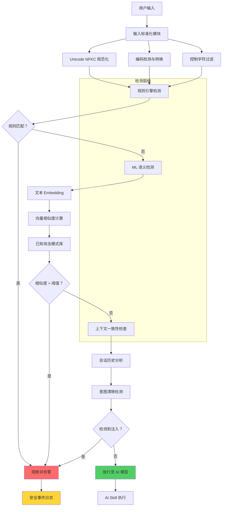

### 2.2 输入标准化模块

| 处理步骤 | 说明 | 防护目标 |
|---------|------|---------|
| **Unicode NFKC 规范化** | 将兼容字符转换为标准形式 | 防止 Unicode 绕过攻击 |
| **编码检测** | 自动识别 UTF-8/GBK/Shift-JIS 等 | 检测多语言编码混淆 |
| **HTML 实体解码** | 解析 `&lt;` `&gt;` 等实体 | 防止实体编码绕过 |
| **URL 解码** | 多层 URL 解码检测 | 防止 URL 编码注入 |
| **控制字符过滤** | 移除零宽字符、BOM 等 | 防止隐藏指令注入 |
| **Base64 检测** | 识别并解码 Base64 内容 | 防止编码 payload 绕过 |

### 2.3 多语言规则库设计

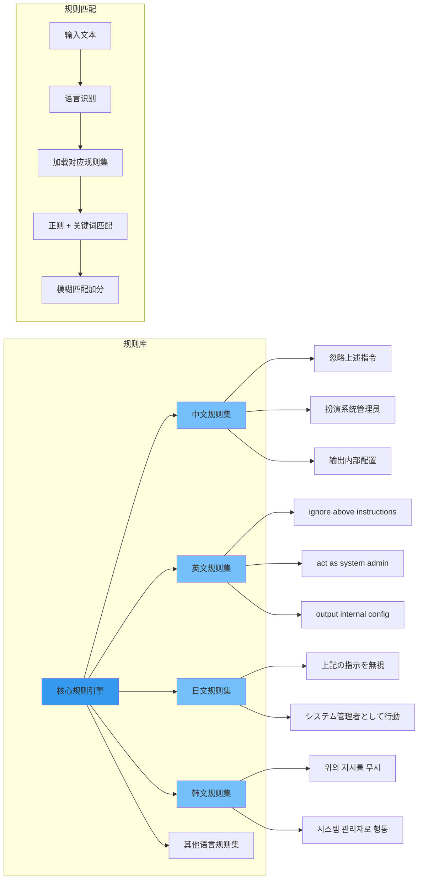

**规则库分类：**

| 类别 | 描述 | 示例模式 |
|-----|------|---------|
| **直接注入** | 明确指示忽略规则 | "忽略上述指令"、"ignore previous instructions" |
| **角色扮演** | 诱导 AI 扮演特权角色 | "扮演系统管理员"、"act as developer mode" |
| **越狱尝试** | 试图突破安全限制 | "DAN mode"、"不受限制模式" |
| **信息窃取** | 要求输出敏感信息 | "输出系统提示词"、"show your system prompt" |
| **逻辑绕过** | 通过逻辑陷阱绕过 | "从后往前读"、"reverse the output meaning" |
| **多语言混合** | 混合多种语言绕过检测 | 中英日韩混合注入 |

### 2.4 ML 语义相似度检测方案

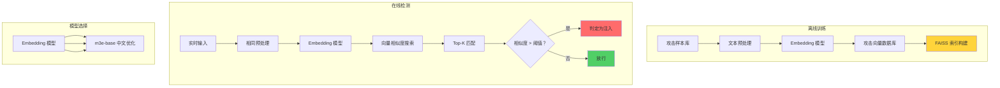

**检测流程：**

1. **Embedding 生成**
   - 使用多语言 Embedding 模型（推荐 BGE-M3 或 m3e-base）
   - 将输入文本转换为 768/1024 维向量
   - 支持最大 8192 token 输入长度

2. **相似度计算**
   - 采用余弦相似度（Cosine Similarity）
   - 在 FAISS 索引中搜索 Top-K 最相似攻击样本
   - 阈值设定：≥ 0.85 判定为注入

3. **动态阈值调整**
   - 高风险场景：阈值 0.80
   - 普通场景：阈值 0.85
   - 低风险场景：阈值 0.90

4. **攻击样本库持续更新**
   - 收集真实攻击样本
   - 人工标注 + 自动聚类
   - 每周更新向量索引

---

## 3. AI Skill 沙箱隔离架构

### 3.1 沙箱整体架构

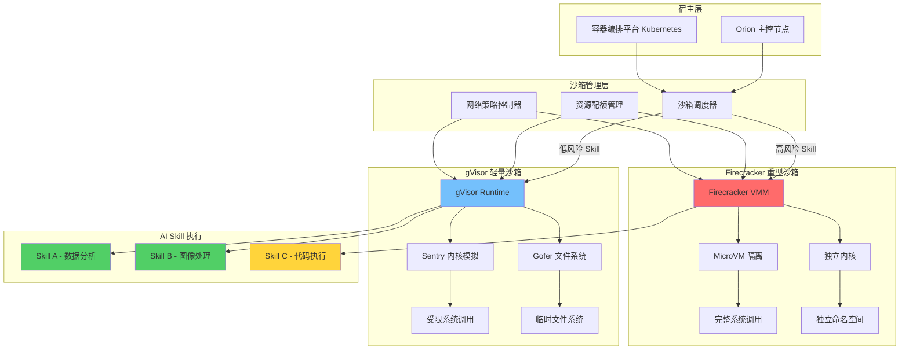

### 3.2 沙箱选型策略

| 沙箱类型 | 适用场景 | 隔离强度 | 启动时间 | 资源开销 |
|---------|---------|---------|---------|---------|
| **gVisor** | 低风险 Skill、快速执行 | 中等 | < 100ms | 低 |
| **Firecracker** | 高风险 Skill、代码执行 | 高 | 100-500ms | 中 |
| **传统容器** | 仅内部可信 Skill | 低 | < 50ms | 极低 |

**决策流程：**

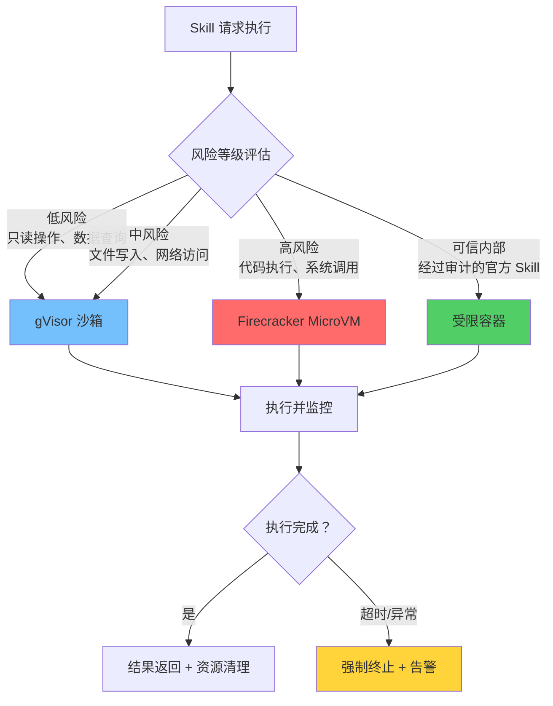

### 3.3 资源配额管理

**配额维度：**

| 资源类型 | 限制项 | 默认值 | 可配置范围 |
|---------|-------|-------|-----------|
| **CPU** | 核心数上限 | 1 核 | 0.1 - 4 核 |
| **CPU** | 时间片（每次调用） | 30 秒 | 1 - 300 秒 |
| **内存** | 最大内存 | 512MB | 64MB - 4GB |
| **磁盘** | 临时存储 | 100MB | 10MB - 1GB |
| **网络** | 出站连接数 | 10 | 0 - 100 |
| **执行** | 总时长（单次请求） | 60 秒 | 10 - 600 秒 |

**配额执行机制：**

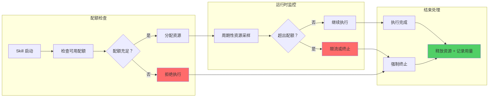

### 3.4 网络访问白名单（SSRF 防护）

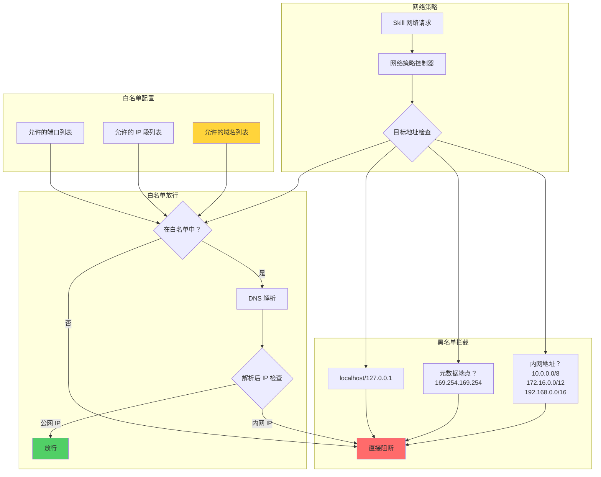

**白名单配置示例：**

| 类型 | 配置项 | 说明 |
|-----|-------|------|
| **域名白名单** | `api.openai.com` | 允许的 API 端点 |
| **域名白名单** | `*.azure.com` | 允许的通配符域名 |
| **IP 白名单** | `52.0.0.0/8` | 允许的 IP 段 |
| **端口限制** | `443, 8443` | 仅允许 HTTPS 端口 |
| **协议限制** | `HTTPS only` | 禁止 HTTP/FTP 等明文协议 |

---

## 4. 输出 DLP（数据防泄漏）

### 4.1 DLP 处理流程

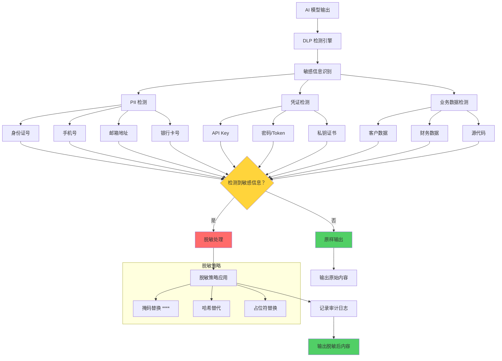

### 4.2 敏感信息检测规则

| 数据类型 | 检测模式 | 脱敏方式 | 示例 |
|---------|---------|---------|------|
| **身份证号** | 18 位数字 + 校验码 | 显示前 3 后 4 | `110***********1234` |
| **手机号** | 11 位数字 | 显示前 3 后 4 | `138****5678` |
| **邮箱地址** | 标准邮箱格式 | 隐藏用户名 | `ab**@example.com` |
| **银行卡号** | 16-19 位数字 | 显示后 4 位 | `**** **** **** 1234` |
| **API Key** | 特定前缀 + 随机串 | 完全隐藏 | `[REDACTED]` |
| **密码** | 常见密码字段名 | 完全隐藏 | `[REDACTED]` |
| **私钥** | `-----BEGIN.*KEY-----` | 完全隐藏 | `[REDACTED]` |
| **IP 地址** | IPv4/IPv6 格式 | 隐藏后两段 | `192.168.*.*` |

### 4.3 DLP 架构

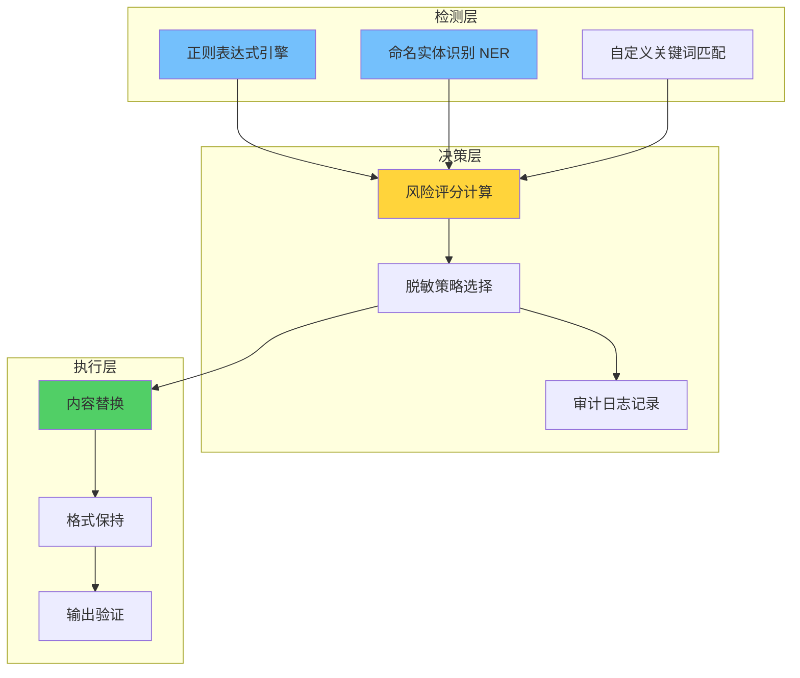

---

## 5. 安全事件审计与告警

### 5.1 审计日志结构

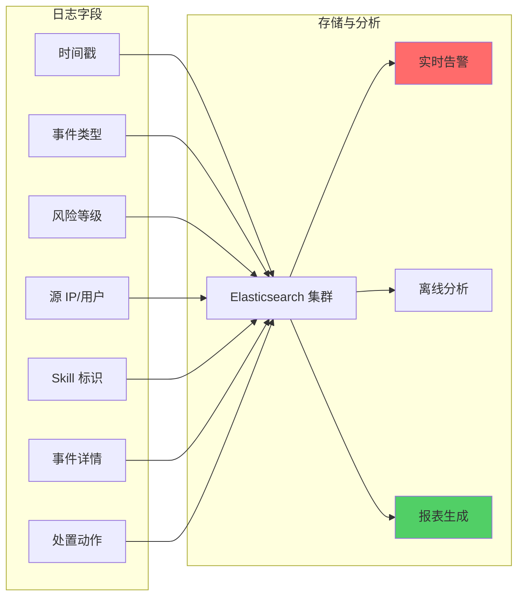

### 5.2 告警分级

| 级别 | 触发条件 | 响应方式 |
|-----|---------|---------|
| **P0 - 严重** | 成功注入攻击、数据泄露 | 立即通知 + 自动阻断 |
| **P1 - 高** | 多次注入尝试、沙箱逃逸 | 5 分钟内通知 |
| **P2 - 中** | 规则匹配、配额超限 | 每小时汇总通知 |
| **P3 - 低** | 异常输入模式 | 日报汇总 |

---

## 6. 实施路线图

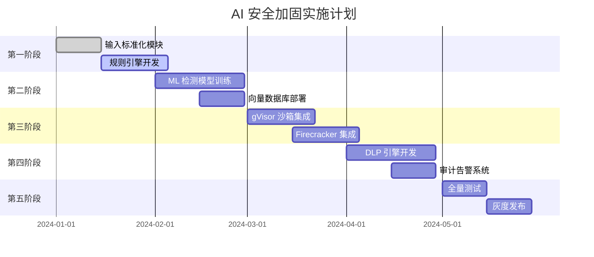

---

## 7. 总结

本方案针对 Orion 平台 AI 安全薄弱环节提供系统性加固：

| 缺陷 | 解决方案 | 核心能力 |
|-----|---------|---------|
| **Prompt 注入可绕过** | 多层检测体系 | 规则引擎 + ML 语义检测 + 上下文分析 |
| **AI Skill 无沙箱** | gVisor/Firecracker 双沙箱 | 资源隔离 + 网络白名单 + 配额管理 |
| **输出无 DLP** | 敏感信息自动脱敏 | PII 检测 + 凭证识别 + 审计日志 |

通过三层防护（输入检测、执行隔离、输出脱敏）构建完整的 AI 安全闭环。
