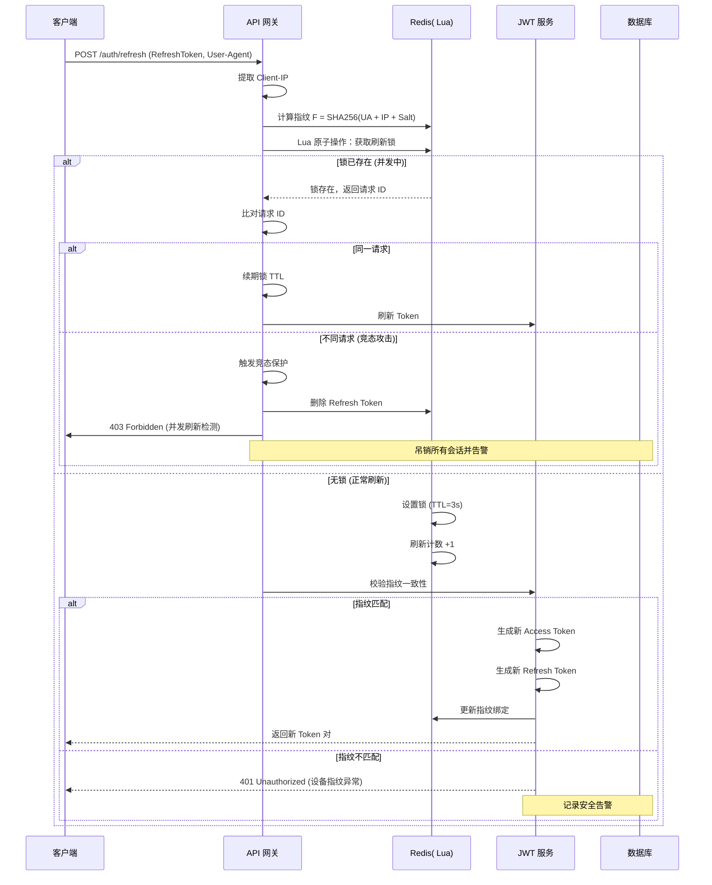
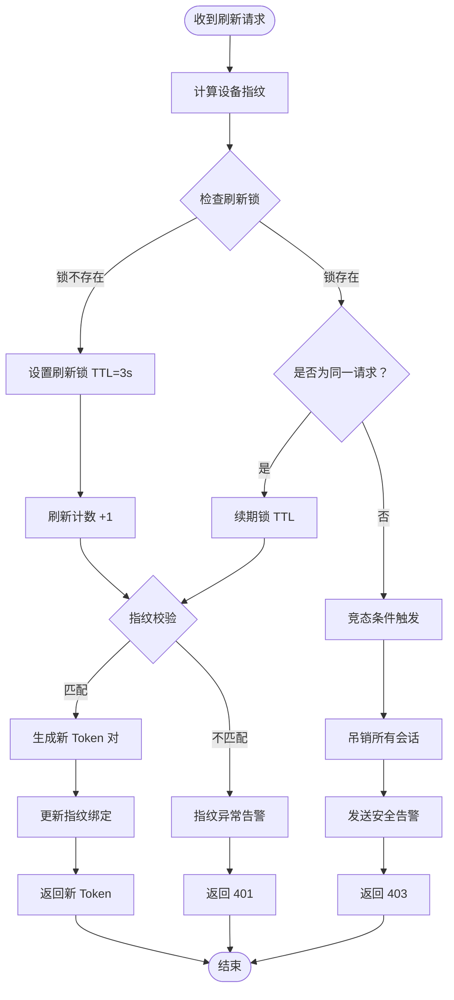
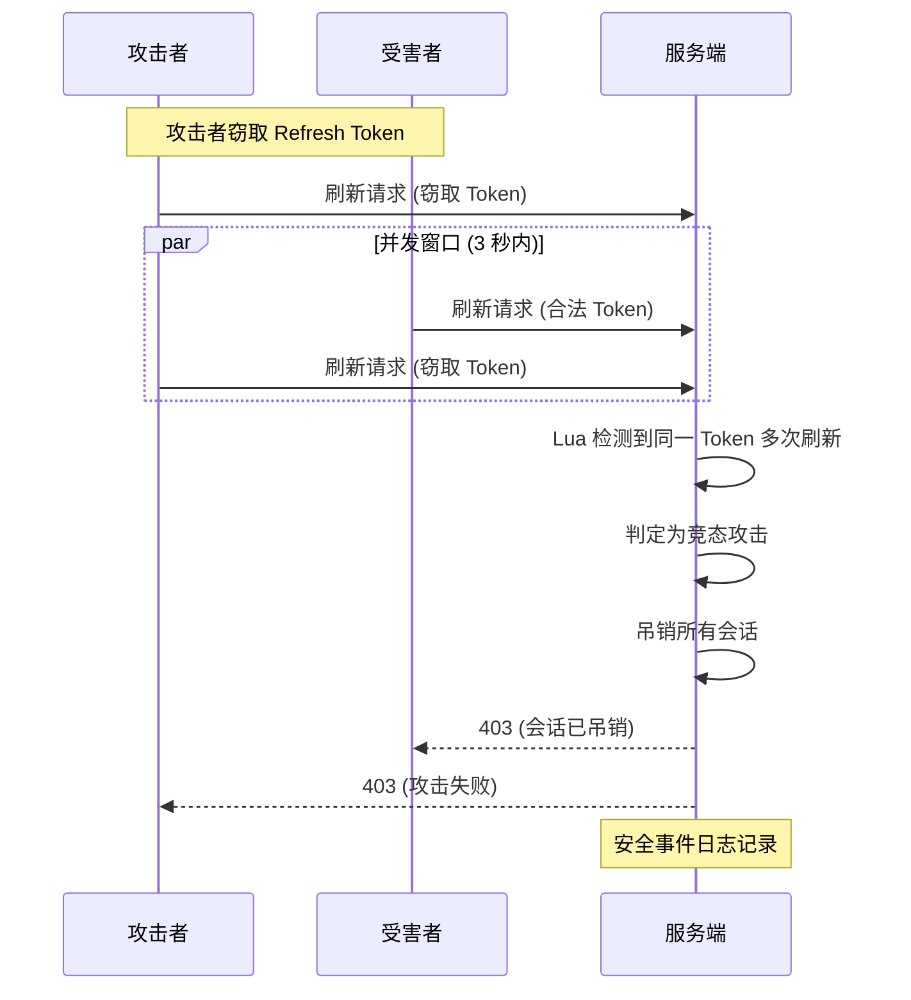
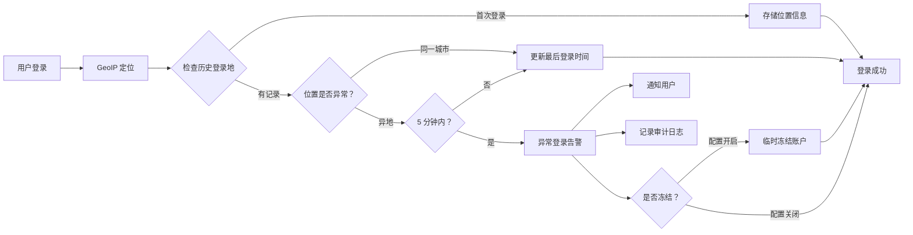
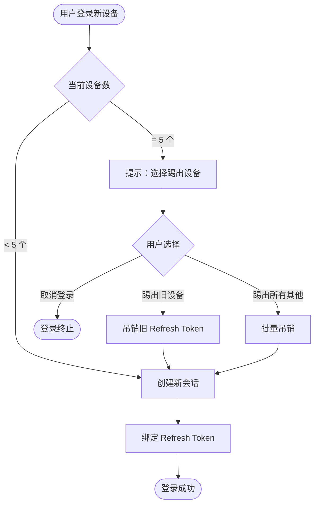

# JWT 并发刷新保护设计方案

## 1. 概述

本方案设计用于解决 Orion 平台 JWT Refresh Token 存在的并发刷新竞态条件安全问题。通过设备指纹绑定、并发检测、异常告警等多层防护机制，确保 Token 刷新过程的安全性。

---

## 2. 核心安全机制

### 2.1 Refresh Token 设备指纹绑定

**绑定策略**：
- 在用户登录生成 Refresh Token 时，采集客户端设备特征
- 指纹组成：`Fingerprint = SHA256(User-Agent + Client-IP + Salt)`
- 指纹存储于 Redis，与 Refresh Token 关联
- 每次刷新请求需校验指纹一致性

**校验流程**：
1. 提取请求头 `User-Agent` 和真实客户端 IP（经代理时取 `X-Forwarded-For` 首个 IP）
2. 计算请求指纹
3. 与 Redis 中存储的指纹比对
4. 不一致 → 拒绝刷新并触发安全告警

---

### 2.2 并发刷新检测（Lua 原子操作）

**检测原理**：
- 利用 Redis Lua 脚本的原子性，确保同一 Refresh Token 的并发刷新请求可被精确捕获
- 为每个 Refresh Token 维护一个「刷新锁」和「刷新计数器」

**数据结构**：
```
Key 命名规范：
- 刷新锁：rt:lock:{refresh_token_hash}     TTL: 3 秒
- 刷新计数：rt:counter:{refresh_token_hash}  TTL: 3 秒
```

**检测逻辑**：
1. 收到刷新请求时，尝试获取刷新锁（Lua 原子操作）
2. 若锁已存在且为同一请求 → 正常续期
3. 若锁已存在但为不同请求 → 检测到并发刷新攻击
4. 锁释放后，检查刷新计数：
   - 计数 > 1 → 竞态条件触发 → 吊销该 Refresh Token 及所有关联会话

---

### 2.3 竞态条件处理

**触发条件**：
- 同一 Refresh Token 在 3 秒窗口内收到 ≥2 次独立刷新请求

**处置动作**：
1. 立即吊销该 Refresh Token
2. 吊销该用户所有活跃会话（Access Token + Refresh Token）
3. 记录安全事件日志
4. 向用户发送「账户异常」通知
5. 可选：临时冻结账户（需二次验证解锁）

---

### 2.4 Access Token 有效期调整

| Token 类型 | 原有效期 | 新有效期 | 说明 |
|------------|----------|----------|------|
| Access Token | 15 分钟 | **5 分钟** | 缩短攻击窗口 |
| Refresh Token | 7 天 | 7 天（不变） | 配合指纹绑定 |

**配套措施**：
- Access Token 加入 `iat`（签发时间）和 `exp`（过期时间）声明
- 前端需在 Token 过期前自动刷新（建议剩余 30 秒时触发）

---

### 2.5 异常登录告警

**检测场景**：
1. **异地同时登录**：同一账户在 5 分钟内从不同地理位置（基于 IP GeoIP）成功登录
2. **设备指纹突变**：Refresh Token 刷新时指纹不匹配
3. **高频刷新**：单设备 1 分钟内刷新 ≥10 次

**告警动作**：
- 记录安全审计日志
- 推送实时告警至安全监控平台
- 发送邮件/短信通知用户
- 可选：自动冻结可疑会话

---

### 2.6 会话管理

**设备数量限制**：
- 单用户最多同时活跃 **5 个设备**
- 新设备登录时，若已达上限 → 提示用户选择踢出旧设备

**主动踢出功能**：
- 用户可在「安全设置」中查看所有活跃设备列表
- 支持按设备逐个踢出或「踢出所有其他设备」
- 踢出操作 → 删除对应 Refresh Token → 使关联 Access Token 失效

**会话数据结构**：
```
Key: session:{user_id}:{device_id}
Value: { refresh_token_hash, fingerprint, ip, location, last_active }
TTL: 7 天（随刷新续期）
```

---

## 3. 时序图

### 3.1 Token 刷新正常流程



---

### 3.2 竞态条件检测流程



---

## 4. 并发刷新攻击示意图



---

## 5. 异常登录检测流程



---

## 6. 会话管理流程图



---

## 7. 安全事件等级定义

| 等级 | 事件类型 | 响应动作 |
|------|----------|----------|
| **P0** | 竞态条件触发（并发刷新） | 立即吊销所有会话，告警，通知用户 |
| **P1** | 设备指纹不匹配 | 拒绝刷新，记录告警日志 |
| **P1** | 异地同时登录 | 告警，通知用户，可选冻结 |
| **P2** | 高频刷新（≥10 次/分钟） | 限流，记录日志 |
| **P2** | 会话数达上限 | 提示用户管理设备 |

---

## 8. 配置参数建议

| 参数 | 建议值 | 说明 |
|------|--------|------|
| `ACCESS_TOKEN_TTL` | 5 分钟 | Access Token 有效期 |
| `REFRESH_TOKEN_TTL` | 7 天 | Refresh Token 有效期 |
| `REFRESH_LOCK_TTL` | 3 秒 | 并发检测锁窗口 |
| `MAX_SESSIONS_PER_USER` | 5 | 单用户最大设备数 |
| `GEO_ANOMALY_WINDOW` | 5 分钟 | 异地登录检测时间窗 |
| `HIGH_FREQ_REFRESH_THRESHOLD` | 10 次/分钟 | 高频刷新阈值 |

---

## 9. 附录：关键 Lua 脚本伪代码

```lua
-- 并发刷新检测 Lua 脚本
-- KEYS[1]: rt:lock:{refresh_token_hash}
-- KEYS[2]: rt:counter:{refresh_token_hash}
-- ARGV[1]: request_id (唯一标识本次请求)
-- ARGV[2]: lock_ttl (3 秒)

local lock = redis.call('GET', KEYS[1])
if lock == false then
    -- 无锁，设置新锁
    redis.call('SET', KEYS[1], ARGV[1], 'EX', ARGV[2])
    redis.call('INCR', KEYS[2])
    redis.call('EXPIRE', KEYS[2], ARGV[2])
    return 'LOCK_ACQUIRED'
elseif lock == ARGV[1] then
    -- 同一请求，续期
    redis.call('EXPIRE', KEYS[1], ARGV[2])
    return 'SAME_REQUEST'
else
    -- 不同请求，竞态条件触发
    redis.call('DEL', KEYS[1])
    redis.call('DEL', KEYS[2])
    return 'RACE_CONDITION'
end
```

---

## 10. 修订记录

| 版本 | 日期 | 修订内容 | 作者 |
|------|------|----------|------|
| 1.0 | 2026-04-10 | 初始版本 | Orion Security Team |
