# Orion 数据隐私合规详细设计

> 版本：v1.0
> 创建日期：2026-04-10
> 负责人：安全团队 + 架构师团队 + 法务合规团队
> 优先级：P0
> 状态：设计完成
> 合规参考：GDPR（欧盟通用数据保护条例）、PIPL（中国个人信息保护法）

---

## 文档导航

| 章节 | 内容 | 页数 |
|------|------|------|
| 1 | 合规背景与法规要求 | GDPR/PIPL 核心条款解读 |
| 2 | 数据分级分类体系 | 四级分类 + 保护措施矩阵 |
| 3 | 数据主体权利实现 | 被遗忘权、可携带权完整流程 |
| 4 | LLM 数据隐私保护 | 脱敏方案、模型选择、调用审计 |
| 5 | 数据保留与销毁策略 | 保留期限表、安全销毁方法 |
| 6 | 隐私合规审计 | 检查清单、审计报告生成 |
| 7 | 技术架构与实现 | 系统组件、数据流、API 设计 |
| 8 | 实施路线图 | 分阶段实施计划、验收标准 |

---

## 1. 合规背景与法规要求

### 1.1 法规适用范围

Orion 系统作为面向全球企业的研发效能平台，需同时满足以下法规要求：

| 法规 | 全称 | 适用范围 | 违规处罚 |
|------|------|---------|---------|
| **GDPR** | General Data Protection Regulation（欧盟通用数据保护条例） | 处理欧盟公民个人数据的组织 | 最高 2000 万欧元或全球年营业额 4% |
| **PIPL** | Personal Information Protection Law（中国个人信息保护法） | 在中国境内处理个人信息的组织 | 最高 5000 万元人民币或上年度营业额 5% |
| **CCPA** | California Consumer Privacy Act（加州消费者隐私法） | 处理加州居民个人信息的组织 | 每次违规 2500-7500 美元 |
| **等保 2.0** | 网络安全等级保护 2.0 | 中国境内网络运营者 | 责令整改、罚款、停业整顿 |

### 1.2 GDPR 核心条款解读

#### 1.2.1 数据处理原则（第 5 条）

| 原则 | 要求 | Orion 实现 |
|------|------|-----------|
| **合法性、公平性、透明性** | 数据处理必须有合法依据，对用户透明 | 隐私政策、用户同意管理、数据处理记录 |
| **目的限制** | 数据只能用于收集时声明的目的 | 数据用途标签、用途变更需重新同意 |
| **数据最小化** | 仅收集实现目的所必需的数据 | 数据收集清单审查、最小权限原则 |
| **准确性** | 个人数据必须准确并及时更新 | 数据校验、用户自助更正 |
| **存储限制** | 数据保留时间不超过必要期限 | 数据保留策略、自动删除机制 |
| **完整性与保密性** | 确保数据安全，防止未授权访问 | 加密、访问控制、审计日志 |

#### 1.2.2 数据主体权利（第 12-23 条）

| 权利 | 条款 | 响应时限 | Orion 实现 |
|------|------|---------|-----------|
| **知情权** | 第 13-14 条 | 收集时 | 隐私政策、数据处理告知 |
| **访问权** | 第 15 条 | 30 天内 | 数据导出功能 |
| **更正权** | 第 16 条 | 30 天内 | 用户自助更正 + 人工审核 |
| **删除权（被遗忘权）** | 第 17 条 | 30 天内 | 数据删除 API、级联删除 |
| **限制处理权** | 第 18 条 | 30 天内 | 数据冻结功能 |
| **可携带权** | 第 20 条 | 30 天内 | 结构化数据导出（JSON/CSV） |
| **反对权** | 第 21 条 | 30 天内 | 营销退订、自动化决策退出 |

#### 1.2.3 数据泄露通知（第 33-34 条）

| 要求 | 时限 | Orion 实现 |
|------|------|-----------|
| **监管机构通知** | 发现泄露后 72 小时内 | 自动告警 + 应急响应流程 |
| **数据主体通知** | 高风险泄露立即通知 | 邮件/短信通知 + 补救建议 |

### 1.3 PIPL 核心条款解读

#### 1.3.1 个人信息分类

| 类型 | 定义 | 示例 | 保护要求 |
|------|------|------|---------|
| **个人信息** | 以电子或其他方式记录的与已识别或可识别的自然人有关的各种信息 | 姓名、邮箱、手机号、IP 地址 | 一般保护 |
| **敏感个人信息** | 一旦泄露或非法使用，容易导致人格尊严受到侵害或人身、财产安全受到危害的个人信息 | 生物识别、宗教信仰、特定身份、医疗健康、金融账户、行踪轨迹 | 严格保护，需单独同意 |
| **匿名化信息** | 经过处理无法识别特定自然人且不能复原的信息 | 统计汇总数据、脱敏后的数据 | 不受 PIPL 约束 |

#### 1.3.2 处理规则

| 要求 | 说明 | Orion 实现 |
|------|------|-----------|
| **告知 - 同意** | 处理前需告知并取得同意 | 隐私政策弹窗、同意记录 |
| **最小必要** | 限于实现处理目的的最小范围 | 数据收集审查、权限最小化 |
| **公开透明** | 公开处理规则，明示处理目的、方式和范围 | 隐私政策、数据处理清单 |
| **准确完整** | 保证数据质量，避免因数据不准确对个人权益造成不利影响 | 数据校验、用户更正 |
| **安全保障** | 采取必要措施保障数据安全 | 加密、访问控制、审计 |

#### 1.3.3 跨境传输要求

| 场景 | 要求 | Orion 实现 |
|------|------|-----------|
| **向境外提供个人信息** | 通过安全评估、认证或订立标准合同 | 数据本地化存储、跨境传输审批 |
| **关键信息基础设施运营者** | 原则上在境内存储，确需出境的需安全评估 | 中国区数据本地化部署 |

### 1.4 Orion 合规目标

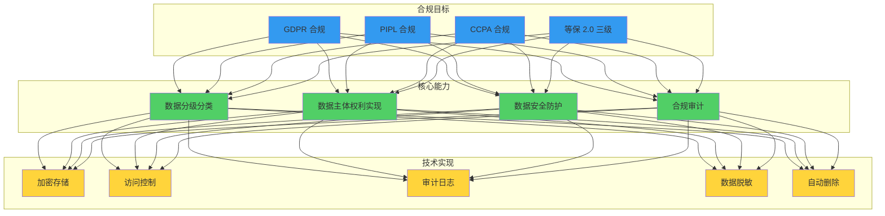

**量化目标：**

| 指标 | 目标值 | 测量方式 |
|------|-------|---------|
| 数据主体请求响应率 | 100% | 请求处理记录 |
| 请求响应及时率 | ≥95%（30 天内） | 响应时间统计 |
| 数据泄露发现时间 | < 1 小时 | 监控告警延迟 |
| 数据删除完整率 | 100% | 删除验证审计 |
| 合规审计覆盖率 | 100% | 审计日志完整性 |
| 员工隐私培训完成率 | 100% | 培训记录 |

---

## 2. 数据分级分类体系

### 2.1 数据分级定义

Orion 采用四级数据分类体系，每级对应不同的保护措施：

| 级别 | 名称 | 定义 | 示例 | 泄露影响 |
|------|------|------|------|---------|
| **L1** | Public（公开） | 可公开访问，无保密要求 | 公开文档、产品手册、官方博客 | 无影响 |
| **L2** | Internal（内部） | 仅限组织内部使用，外部泄露可能造成轻微影响 | 内部流程文档、会议纪要、非敏感配置 | 轻微声誉影响 |
| **L3** | Sensitive（敏感） | 包含个人信息或商业敏感信息，泄露可能造成中等影响 | 用户账号、邮箱、手机号、代码仓库、Pipeline 配置 | 中等声誉/财务影响，可能违反 GDPR/PIPL |
| **L4** | Confidential（机密） | 高度敏感信息，泄露可能造成严重影响 | 密码哈希、API Key、私钥、身份证号、银行卡号、健康数据 | 严重声誉/财务影响，重大合规违规 |

### 2.2 数据分类矩阵

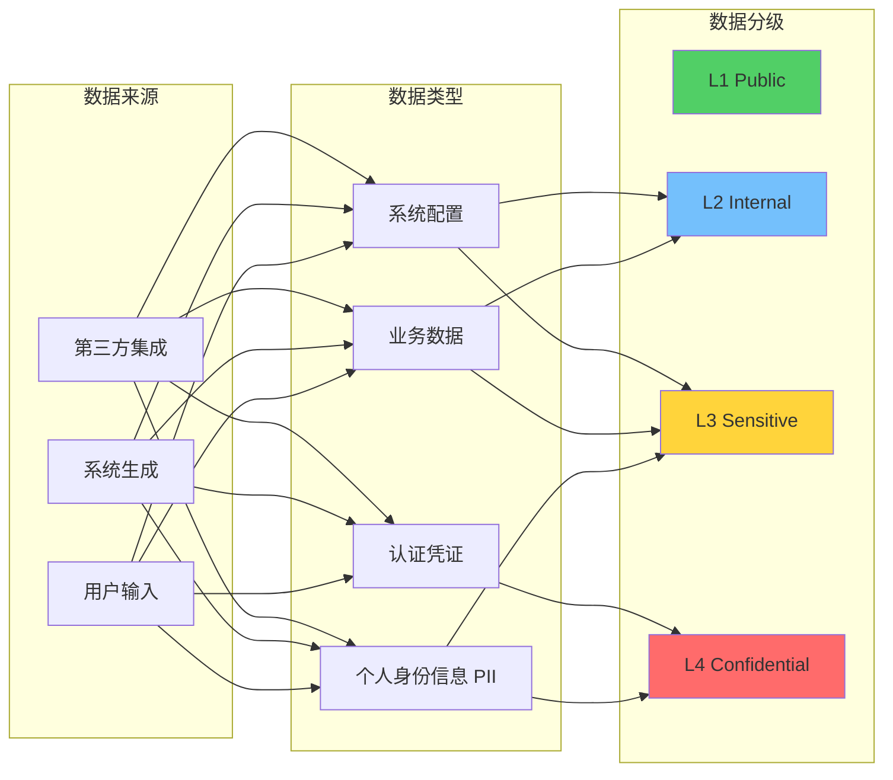

### 2.3 详细数据分类清单

#### 2.3.1 用户相关数据

| 数据项 | 分级 | 存储位置 | 加密要求 | 访问控制 | 保留期限 |
|--------|------|---------|---------|---------|---------|
| 用户名 | L2 | PostgreSQL | 传输加密 | 认证用户 | 账号注销后 30 天 |
| 邮箱地址 | L3 | PostgreSQL | 静态加密 | 本人 + 管理员 | 账号注销后 30 天 |
| 手机号 | L3 | PostgreSQL | 静态加密 | 本人 + 管理员 | 账号注销后 30 天 |
| 真实姓名 | L3 | PostgreSQL | 静态加密 | 本人 + 管理员 | 账号注销后 30 天 |
| 身份证号 | L4 | PostgreSQL | 字段级加密 | 本人 + 法务 | 账号注销后 7 年（合规要求） |
| 密码哈希 | L4 | PostgreSQL | bcrypt 哈希 | 仅认证服务 | 账号注销后立即删除 |
| 会话 Token | L4 | Redis | 静态加密 | 仅持有者 | 过期后立即删除 |
| 登录日志 | L3 | PostgreSQL/ES | 传输加密 | 本人 + 安全团队 | 365 天 |
| 操作审计日志 | L3 | PostgreSQL/ES | 传输加密 | 管理员 + 审计员 | 365 天 |

#### 2.3.2 代码与构建数据

| 数据项 | 分级 | 存储位置 | 加密要求 | 访问控制 | 保留期限 |
|--------|------|---------|---------|---------|---------|
| 源代码 | L3 | GitLab/制品库 | 传输加密 | 项目成员 | 项目删除后 90 天 |
| 构建产物 | L2 | Harbor/Nexus | 传输加密 | 项目成员 | 版本废弃后 180 天 |
| 构建日志 | L2 | Loki/ES | 传输加密 | 项目成员 | 180 天 |
| 测试报告 | L2 | PostgreSQL/ES | 传输加密 | 项目成员 | 180 天 |
| 代码审查意见 | L2 | PostgreSQL | 传输加密 | 项目成员 | 永久（知识沉淀） |
| Secret 扫描结果 | L4 | PostgreSQL | 字段级加密 | 安全团队 | 修复后 90 天 |

#### 2.3.3 Pipeline 与部署数据

| 数据项 | 分级 | 存储位置 | 加密要求 | 访问控制 | 保留期限 |
|--------|------|---------|---------|---------|---------|
| Pipeline 配置 | L2 | PostgreSQL/Git | 传输加密 | 项目成员 | 项目删除后 90 天 |
| 部署记录 | L2 | PostgreSQL | 传输加密 | 项目成员 + 运维 | 365 天 |
| 部署日志 | L2 | Loki/ES | 传输加密 | 项目成员 + 运维 | 180 天 |
| 环境变量（非敏感） | L2 | PostgreSQL | 传输加密 | 项目成员 | 项目删除后 90 天 |
| 环境变量（敏感） | L4 | Vault | 字段级加密 | 仅运行时服务 | 项目删除后立即删除 |
| 回滚记录 | L2 | PostgreSQL | 传输加密 | 项目成员 + 运维 | 365 天 |

#### 2.3.4 AI 相关数据

| 数据项 | 分级 | 存储位置 | 加密要求 | 访问控制 | 保留期限 |
|--------|------|---------|---------|---------|---------|
| Prompt 输入 | L3 | PostgreSQL/Chroma | 静态加密 | 本人 + 项目成员 | 90 天 |
| LLM 输出 | L3 | PostgreSQL/Chroma | 静态加密 | 本人 + 项目成员 | 90 天 |
| 向量嵌入 | L3 | Chroma | 静态加密 | 本人 + 项目成员 | 90 天 |
| AI 技能配置 | L2 | PostgreSQL | 传输加密 | 项目成员 | 技能删除后 90 天 |
| 模型调用日志 | L3 | PostgreSQL/ES | 传输加密 | 本人 + 管理员 | 365 天 |
| 训练数据（如有） | L3/L4 | 隔离存储 | 静态加密 | 仅 AI 服务 | 按数据源分级 |

#### 2.3.5 运维与监控数据

| 数据项 | 分级 | 存储位置 | 加密要求 | 访问控制 | 保留期限 |
|--------|------|---------|---------|---------|---------|
| 指标数据 | L2 | Prometheus | 传输加密 | 运维团队 | 400 天 |
| 日志数据 | L2/L3 | Loki/ES | 传输加密 | 运维 + 项目成员 | 180 天 |
| 链路追踪 | L2 | Jaeger | 传输加密 | 运维 + 项目成员 | 7 天 |
| 告警记录 | L2 | PostgreSQL/ES | 传输加密 | 运维团队 | 365 天 |
| 自愈记录 | L2 | PostgreSQL | 传输加密 | 运维 + 安全 | 365 天 |
| 配置变更审计 | L3 | PostgreSQL | 传输加密 | 管理员 + 审计 | 365 天 |

### 2.4 分级保护措施矩阵

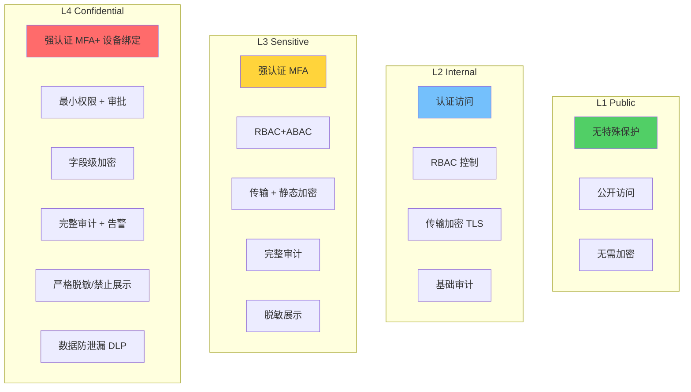

| 保护措施 | L1 Public | L2 Internal | L3 Sensitive | L4 Confidential |
|---------|-----------|-------------|--------------|-----------------|
| **访问控制** | 无限制 | 认证用户 | 授权用户 +MFA | 最小权限 + 审批 +MFA+ 设备绑定 |
| **传输加密** | 推荐 TLS | 强制 TLS 1.3 | 强制 TLS 1.3+mTLS | 强制 TLS 1.3+mTLS+ 私有链路 |
| **静态加密** | 可选 | 存储级加密 | 存储级 + 数据库加密 | 字段级加密（应用层） |
| **密钥管理** | - | 平台密钥 | 独立数据密钥 | 独立密钥 +HSM 保护 |
| **数据脱敏** | 不需要 | 不需要 | 部分脱敏 | 严格脱敏/禁止展示 |
| **审计日志** | 可选 | 基础审计 | 完整审计 | 完整审计 + 实时告警 |
| **数据防泄漏** | 不需要 | 基础 DLP | 中级 DLP | 严格 DLP+ 水印 |
| **备份加密** | 可选 | 加密备份 | 加密备份 + 隔离 | 加密备份 + 多地隔离 + 访问审批 |
| **保留期限** | 永久 | 按需 | 最小必要 | 最小必要 + 到期自动删除 |
| **跨境传输** | 允许 | 允许 | 需评估 | 原则上禁止 |

### 2.5 数据分级自动化识别

#### 2.5.1 识别规则引擎

```typescript
interface DataClassificationRule {
  id: string;
  name: string;
  pattern: RegExp | string;
  dataType: 'email' | 'phone' | 'id_card' | 'bank_card' | 'api_key' | 'password' | 'private_key';
  sensitivity: 'L1' | 'L2' | 'L3' | 'L4';
  action: 'classify' | 'redact' | 'encrypt' | 'alert';
}

const CLASSIFICATION_RULES: DataClassificationRule[] = [
  // L4 - 身份证号（中国）
  {
    id: 'CLS-001',
    name: 'chinese_id_card',
    pattern: /^[1-9]\d{5}(18|19|20)\d{2}(0[1-9]|1[0-2])(0[1-9]|[12]\d|3[01])\d{3}[\dXx]$/,
    dataType: 'id_card',
    sensitivity: 'L4',
    action: 'encrypt'
  },
  
  // L4 - 银行卡号
  {
    id: 'CLS-002',
    name: 'bank_card_number',
    pattern: /\b[3-7]\d{13,18}\b/,
    dataType: 'bank_card',
    sensitivity: 'L4',
    action: 'encrypt'
  },
  
  // L4 - API Key / Secret
  {
    id: 'CLS-003',
    name: 'api_key_secret',
    pattern: /\b(?:api[_-]?key|secret[_-]?key|access[_-]?token)\s*[=:]\s*[A-Za-z0-9\-_]{20,}\b/i,
    dataType: 'api_key',
    sensitivity: 'L4',
    action: 'encrypt'
  },
  
  // L4 - 私钥
  {
    id: 'CLS-004',
    name: 'private_key',
    pattern: /-----BEGIN (?:RSA |EC |DSA |OPENSSH )?PRIVATE KEY-----/,
    dataType: 'private_key',
    sensitivity: 'L4',
    action: 'alert'
  },
  
  // L3 - 邮箱地址
  {
    id: 'CLS-005',
    name: 'email_address',
    pattern: /\b[A-Za-z0-9._%+-]+@[A-Za-z0-9.-]+\.[A-Z|a-z]{2,}\b/,
    dataType: 'email',
    sensitivity: 'L3',
    action: 'classify'
  },
  
  // L3 - 手机号（中国）
  {
    id: 'CLS-006',
    name: 'chinese_phone',
    pattern: /\b1[3-9]\d{9}\b/,
    dataType: 'phone',
    sensitivity: 'L3',
    action: 'classify'
  },
  
  // L3 - 密码字段
  {
    id: 'CLS-007',
    name: 'password_field',
    pattern: /\b(?:password|passwd|pwd)\s*[=:]\s*\S+/i,
    dataType: 'password',
    sensitivity: 'L4',
    action: 'redact'
  }
];
```

#### 2.5.2 自动分级流程

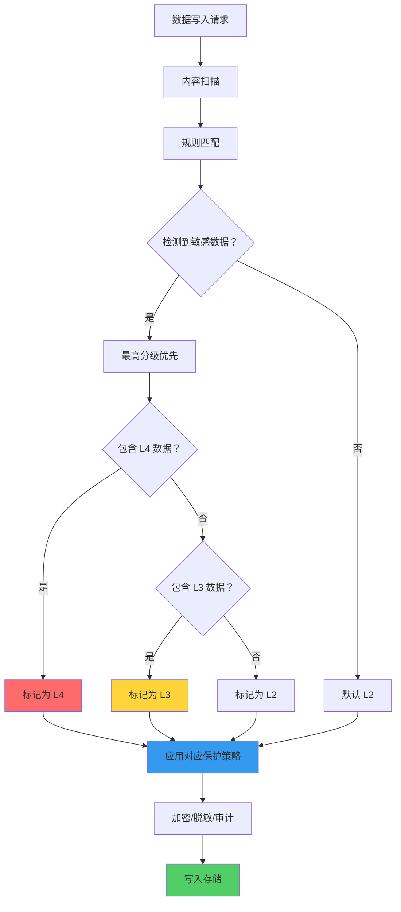

---

## 3. 数据主体权利实现

### 3.1 被遗忘权（Right to be Forgotten）

#### 3.1.1 删除范围定义

当用户行使被遗忘权时，需删除以下所有个人数据：

| 存储系统 | 数据类型 | 删除范围 | 技术实现 |
|---------|---------|---------|---------|
| **PostgreSQL** | 用户档案、账号信息、操作记录 | 全表扫描删除相关 user_id 记录 | 级联删除 + 软删除标记 |
| **Chroma** | 向量嵌入、AI 对话历史 | 删除所有包含用户 PII 的向量 | 元数据过滤删除 |
| **Neo4j** | 用户关系图、服务依赖关系 | 删除用户节点及相关边 | 图遍历删除 |
| **Elasticsearch** | 日志、审计记录、搜索索引 | 删除所有包含用户标识的文档 | 按字段删除 |
| **Redis** | 会话数据、缓存 | 删除所有用户相关 Key | 前缀匹配删除 |
| **对象存储（S3）** | 备份文件、导出文件 | 删除包含用户数据的备份 | 生命周期策略 |
| **日志系统（Loki）** | 应用日志 | 删除包含用户 PII 的日志行 | 日志过滤/脱敏 |
| **第三方系统** | GitLab、Jira 等集成数据 | 同步删除或匿名化 | API 调用/数据同步 |

#### 3.1.2 删除流程

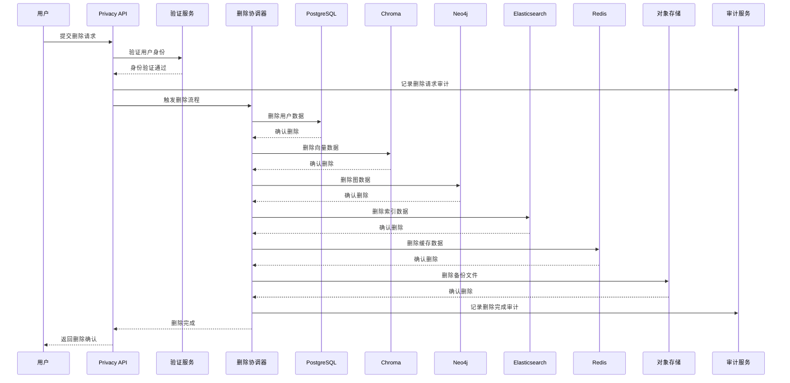

#### 3.1.3 删除 API 设计

```yaml
# OpenAPI 3.0 定义
openapi: 3.0.0
info:
  title: Orion Privacy API
  version: 1.0.0
paths:
  /api/v1/privacy/delete-request:
    post:
      summary: 提交数据删除请求（被遗忘权）
      tags:
        - Privacy
      security:
        - bearerAuth: []
      requestBody:
        required: true
        content:
          application/json:
            schema:
              type: object
              properties:
                reason:
                  type: string
                  enum: [withdraw_consent, account_closure, legal_requirement, other]
                  description: 删除原因
                scope:
                  type: string
                  enum: [all_data, specific_services, ai_data_only]
                  description: 删除范围
                confirmation:
                  type: boolean
                  description: 用户确认理解删除后果
              required:
                - reason
                - confirmation
      responses:
        '202':
          description: 删除请求已受理
          content:
            application/json:
              schema:
                $ref: '#/components/schemas/DeleteRequestResponse'
        '400':
          description: 请求无效
        '401':
          description: 未授权
        '403':
          description: 禁止删除（法律要求保留）

  /api/v1/privacy/delete-status/{request_id}:
    get:
      summary: 查询删除请求状态
      tags:
        - Privacy
      parameters:
        - name: request_id
          in: path
          required: true
          schema:
            type: string
      responses:
        '200':
          description: 删除状态
          content:
            application/json:
              schema:
                $ref: '#/components/schemas/DeleteStatusResponse'

components:
  schemas:
    DeleteRequestResponse:
      type: object
      properties:
        request_id:
          type: string
          description: 删除请求 ID
        status:
          type: string
          enum: [pending, processing, completed, failed]
        estimated_completion:
          type: string
          format: date-time
          description: 预计完成时间
        message:
          type: string
          description: 提示信息
    DeleteStatusResponse:
      type: object
      properties:
        request_id:
          type: string
        status:
          type: string
        progress:
          type: object
          properties:
            postgresql:
              type: string
              enum: [pending, completed, failed]
            chroma:
              type: string
              enum: [pending, completed, failed]
            neo4j:
              type: string
              enum: [pending, completed, failed]
            elasticsearch:
              type: string
              enum: [pending, completed, failed]
            redis:
              type: string
              enum: [pending, completed, failed]
            s3:
              type: string
              enum: [pending, completed, failed]
        completed_at:
          type: string
          format: date-time
        failed_reason:
          type: string
```

#### 3.1.4 删除实现代码

```python
# privacy_service.py - 数据删除协调器
from typing import List, Dict, Optional
from datetime import datetime, timedelta
import asyncio
from dataclasses import dataclass, field
from enum import Enum

class DeletionStatus(Enum):
    PENDING = "pending"
    IN_PROGRESS = "in_progress"
    COMPLETED = "completed"
    FAILED = "failed"

@dataclass
class DeletionProgress:
    storage_system: str
    status: DeletionStatus
    records_deleted: int = 0
    error_message: Optional[str] = None
    completed_at: Optional[datetime] = None

@dataclass
class DeletionRequest:
    request_id: str
    user_id: str
    reason: str
    scope: str
    created_at: datetime
    status: DeletionStatus = DeletionStatus.PENDING
    progress: List[DeletionProgress] = field(default_factory=list)
    completed_at: Optional[datetime] = None

class PrivacyDeletionService:
    """
    数据删除服务 - 实现被遗忘权
    """
    
    def __init__(self, config: PrivacyConfig):
        self.config = config
        self.postgresql = PostgreSQLClient(config.db_uri)
        self.chroma = ChromaClient(config.chroma_uri)
        self.neo4j = Neo4jClient(config.neo4j_uri)
        self.elasticsearch = ElasticsearchClient(config.es_uri)
        self.redis = RedisClient(config.redis_uri)
        self.s3 = S3Client(config.s3_config)
        self.audit = AuditService()
    
    async def create_deletion_request(
        self,
        user_id: str,
        reason: str,
        scope: str = "all_data"
    ) -> DeletionRequest:
        """创建删除请求"""
        request_id = f"del-{datetime.utcnow().isoformat()}-{user_id}"
        
        request = DeletionRequest(
            request_id=request_id,
            user_id=user_id,
            reason=reason,
            scope=scope,
            created_at=datetime.utcnow(),
            progress=[
                DeletionProgress(storage_system="postgresql", status=DeletionStatus.PENDING),
                DeletionProgress(storage_system="chroma", status=DeletionStatus.PENDING),
                DeletionProgress(storage_system="neo4j", status=DeletionStatus.PENDING),
                DeletionProgress(storage_system="elasticsearch", status=DeletionStatus.PENDING),
                DeletionProgress(storage_system="redis", status=DeletionStatus.PENDING),
                DeletionProgress(storage_system="s3", status=DeletionStatus.PENDING),
            ]
        )
        
        # 记录审计日志
        await self.audit.log_event(
            event_type="PRIVACY_DELETION_REQUEST",
            user_id=user_id,
            details={"request_id": request_id, "reason": reason, "scope": scope}
        )
        
        # 异步执行删除
        asyncio.create_task(self._execute_deletion(request))
        
        return request
    
    async def _execute_deletion(self, request: DeletionRequest):
        """执行数据删除"""
        request.status = DeletionStatus.IN_PROGRESS
        
        deletion_tasks = [
            self._delete_postgresql(request),
            self._delete_chroma(request),
            self._delete_neo4j(request),
            self._delete_elasticsearch(request),
            self._delete_redis(request),
            self._delete_s3(request),
        ]
        
        results = await asyncio.gather(*deletion_tasks, return_exceptions=True)
        
        # 检查是否有失败
        all_completed = all(
            p.status == DeletionStatus.COMPLETED 
            for p in request.progress
        )
        
        if all_completed:
            request.status = DeletionStatus.COMPLETED
            request.completed_at = datetime.utcnow()
        else:
            request.status = DeletionStatus.FAILED
        
        # 记录最终审计日志
        await self.audit.log_event(
            event_type="PRIVACY_DELETION_COMPLETED" if all_completed else "PRIVACY_DELETION_FAILED",
            user_id=request.user_id,
            details={
                "request_id": request.request_id,
                "status": request.status.value,
                "progress": [
                    {"system": p.storage_system, "status": p.status.value}
                    for p in request.progress
                ]
            }
        )
    
    async def _delete_postgresql(self, request: DeletionRequest):
        """删除 PostgreSQL 中的数据"""
        progress = self._get_progress(request, "postgresql")
        try:
            async with self.postgresql.transaction() as tx:
                # 1. 软删除用户账号（保留审计需要）
                await tx.execute("""
                    UPDATE users 
                    SET 
                        status = 'deleted',
                        deleted_at = NOW(),
                        email = CONCAT('deleted_', id, '@deleted.local'),
                        phone = NULL,
                        real_name = NULL
                    WHERE id = $1
                """, request.user_id)
                
                # 2. 删除个人数据（级联）
                tables_to_clean = [
                    "user_preferences",
                    "user_sessions",
                    "user_notifications",
                    "ai_conversation_history",
                    "pipeline_run_logs",
                ]
                
                for table in tables_to_clean:
                    result = await tx.execute(f"""
                        DELETE FROM {table}
                        WHERE user_id = $1
                    """, request.user_id)
                    progress.records_deleted += result.rowcount
                
                progress.status = DeletionStatus.COMPLETED
                progress.completed_at = datetime.utcnow()
                
        except Exception as e:
            progress.status = DeletionStatus.FAILED
            progress.error_message = str(e)
            raise
    
    async def _delete_chroma(self, request: DeletionRequest):
        """删除 Chroma 向量库中的数据"""
        progress = self._get_progress(request, "chroma")
        try:
            # 删除包含用户 PII 的向量
            collections = await self.chroma.list_collections()
            for collection in collections:
                # 通过元数据过滤删除
                deleted = await self.chroma.delete(
                    collection_name=collection,
                    where={"user_id": request.user_id}
                )
                progress.records_deleted += deleted
            
            progress.status = DeletionStatus.COMPLETED
            progress.completed_at = datetime.utcnow()
            
        except Exception as e:
            progress.status = DeletionStatus.FAILED
            progress.error_message = str(e)
            raise
    
    async def _delete_neo4j(self, request: DeletionRequest):
        """删除 Neo4j 图数据库中的数据"""
        progress = self._get_progress(request, "neo4j")
        try:
            async with self.neo4j.session() as session:
                # 删除用户节点及相关关系
                result = await session.run("""
                    MATCH (u:User {id: $user_id})
                    DETACH DELETE u
                """, user_id=request.user_id)
                
                progress.records_deleted = result.consume().counters.nodes_deleted
                progress.status = DeletionStatus.COMPLETED
                progress.completed_at = datetime.utcnow()
                
        except Exception as e:
            progress.status = DeletionStatus.FAILED
            progress.error_message = str(e)
            raise
    
    async def _delete_elasticsearch(self, request: DeletionRequest):
        """删除 Elasticsearch 中的数据"""
        progress = self._get_progress(request, "elasticsearch")
        try:
            indices = [
                "audit-logs-*",
                "operation-logs-*",
                "ai-conversations-*",
                "pipeline-logs-*"
            ]
            
            for index_pattern in indices:
                # 删除包含用户 ID 的文档
                response = await self.elasticsearch.delete_by_query(
                    index=index_pattern,
                    query={
                        "term": {"user_id": request.user_id}
                    }
                )
                progress.records_deleted += response["deleted"]
            
            progress.status = DeletionStatus.COMPLETED
            progress.completed_at = datetime.utcnow()
            
        except Exception as e:
            progress.status = DeletionStatus.FAILED
            progress.error_message = str(e)
            raise
    
    async def _delete_redis(self, request: DeletionRequest):
        """删除 Redis 缓存中的数据"""
        progress = self._get_progress(request, "redis")
        try:
            # 删除用户会话
            keys_deleted = 0
            async for key in self.redis.scan_iter(f"session:{request.user_id}:*"):
                await self.redis.delete(key)
                keys_deleted += 1
            
            async for key in self.redis.scan_iter(f"user:cache:{request.user_id}:*"):
                await self.redis.delete(key)
                keys_deleted += 1
            
            progress.records_deleted = keys_deleted
            progress.status = DeletionStatus.COMPLETED
            progress.completed_at = datetime.utcnow()
            
        except Exception as e:
            progress.status = DeletionStatus.FAILED
            progress.error_message = str(e)
            raise
    
    async def _delete_s3(self, request: DeletionRequest):
        """删除对象存储中的备份数据"""
        progress = self._get_progress(request, "s3")
        try:
            # 删除用户相关的备份文件
            prefix = f"backups/user-data/{request.user_id}/"
            deleted_count = await self.s3.delete_objects_by_prefix(
                bucket=self.config.backup_bucket,
                prefix=prefix
            )
            progress.records_deleted = deleted_count
            progress.status = DeletionStatus.COMPLETED
            progress.completed_at = datetime.utcnow()
            
        except Exception as e:
            progress.status = DeletionStatus.FAILED
            progress.error_message = str(e)
            raise
    
    def _get_progress(self, request: DeletionRequest, system: str) -> DeletionProgress:
        """获取指定存储系统的进度对象"""
        for p in request.progress:
            if p.storage_system == system:
                return p
        raise ValueError(f"Unknown storage system: {system}")
```

#### 3.1.5 删除验证与审计

```python
class DeletionVerificationService:
    """删除验证服务 - 确保数据被完整删除"""
    
    async def verify_deletion(self, request_id: str) -> VerificationReport:
        """验证删除是否完整"""
        request = await self.get_deletion_request(request_id)
        
        verification_checks = []
        
        # 1. PostgreSQL 验证
        pg_check = await self._verify_postgresql(request.user_id)
        verification_checks.append(pg_check)
        
        # 2. Chroma 验证
        chroma_check = await self._verify_chroma(request.user_id)
        verification_checks.append(chroma_check)
        
        # 3. Elasticsearch 验证
        es_check = await self._verify_elasticsearch(request.user_id)
        verification_checks.append(es_check)
        
        # 4. Redis 验证
        redis_check = await self._verify_redis(request.user_id)
        verification_checks.append(redis_check)
        
        # 生成验证报告
        all_passed = all(check.passed for check in verification_checks)
        
        report = VerificationReport(
            request_id=request_id,
            user_id=request.user_id,
            verified_at=datetime.utcnow(),
            passed=all_passed,
            checks=verification_checks
        )
        
        # 记录审计日志
        await self.audit.log_event(
            event_type="PRIVACY_DELETION_VERIFICATION",
            user_id=request.user_id,
            details={
                "request_id": request_id,
                "passed": all_passed,
                "checks": [
                    {"system": c.system, "passed": c.passed, "remaining": c.remaining_count}
                    for c in verification_checks
                ]
            }
        )
        
        return report
    
    async def _verify_postgresql(self, user_id: str) -> VerificationCheck:
        """验证 PostgreSQL 中数据是否已删除"""
        # 查询是否还有用户相关数据
        tables_to_check = [
            ("users", "id"),
            ("user_preferences", "user_id"),
            ("ai_conversation_history", "user_id"),
        ]
        
        remaining_count = 0
        for table, column in tables_to_check:
            count = await self.postgresql.fetch_val(f"""
                SELECT COUNT(*) FROM {table} WHERE {column} = $1
            """, user_id)
            remaining_count += count
        
        return VerificationCheck(
            system="postgresql",
            passed=(remaining_count == 0),
            remaining_count=remaining_count
        )
```

### 3.2 数据可携带权（Right to Data Portability）

#### 3.2.1 导出范围定义

| 数据类型 | 导出格式 | 包含内容 |
|---------|---------|---------|
| **个人档案** | JSON | 用户名、邮箱、手机号、创建时间、最后登录时间 |
| **操作历史** | JSON/CSV | Pipeline 触发记录、审批记录、代码审查意见 |
| **AI 对话** | JSON | 所有 AI 对话历史（Prompt + 输出） |
| **配置数据** | YAML/JSON | 个人偏好设置、通知配置 |
| **审计日志** | JSON | 用户相关的所有审计日志 |
| **项目数据** | ZIP | 用户创建的 Pipeline 配置、文档等 |

#### 3.2.2 导出流程

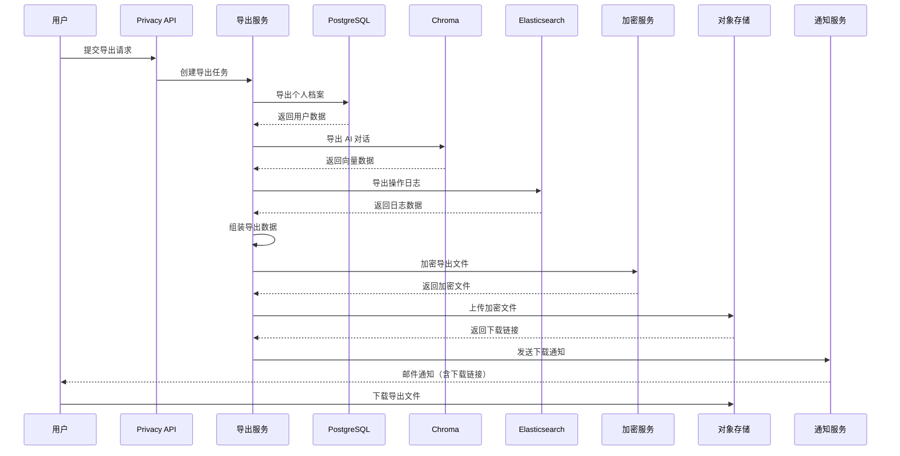

#### 3.2.3 导出 API 设计

```yaml
openapi: 3.0.0
info:
  title: Orion Privacy API - Data Portability
  version: 1.0.0
paths:
  /api/v1/privacy/export-request:
    post:
      summary: 提交数据导出请求（可携带权）
      tags:
        - Privacy
      security:
        - bearerAuth: []
      requestBody:
        required: true
        content:
          application/json:
            schema:
              type: object
              properties:
                format:
                  type: string
                  enum: [json, csv, yaml]
                  default: json
                  description: 导出格式
                scope:
                  type: array
                  items:
                    type: string
                    enum: [profile, activity, ai_conversations, configurations, audit_logs, projects]
                  description: 导出范围
                encryption_password:
                  type: string
                  minLength: 12
                  description: 加密密码（可选，不提供则使用系统密钥）
              required:
                - format
      responses:
        '202':
          description: 导出请求已受理
          content:
            application/json:
              schema:
                $ref: '#/components/schemas/ExportRequestResponse'

  /api/v1/privacy/export-status/{request_id}:
    get:
      summary: 查询导出状态
      tags:
        - Privacy
      parameters:
        - name: request_id
          in: path
          required: true
          schema:
            type: string
      responses:
        '200':
          description: 导出状态
          content:
            application/json:
              schema:
                $ref: '#/components/schemas/ExportStatusResponse'
        '404':
          description: 请求不存在

  /api/v1/privacy/export-download/{request_id}:
    get:
      summary: 下载导出文件
      tags:
        - Privacy
      parameters:
        - name: request_id
          in: path
          required: true
          schema:
            type: string
      responses:
        '200':
          description: 导出文件
          content:
            application/octet-stream:
              schema:
                type: string
                format: binary
        '404':
          description: 文件不存在或已过期
        '410':
          description: 下载链接已过期（7 天后过期）

components:
  schemas:
    ExportRequestResponse:
      type: object
      properties:
        request_id:
          type: string
        status:
          type: string
          enum: [pending, processing, completed, failed]
        estimated_completion:
          type: string
          format: date-time
        message:
          type: string
    ExportStatusResponse:
      type: object
      properties:
        request_id:
          type: string
        status:
          type: string
        progress:
          type: integer
          minimum: 0
          maximum: 100
        download_url:
          type: string
          format: uri
          description: 下载链接（完成后提供，7 天有效）
        expires_at:
          type: string
          format: date-time
          description: 下载链接过期时间
        file_size:
          type: integer
          description: 文件大小（字节）
        completed_at:
          type: string
          format: date-time
```

#### 3.2.4 导出数据结构示例

```json
{
  "export_metadata": {
    "export_id": "exp-20260410-143000-user123",
    "user_id": "user_123",
    "exported_at": "2026-04-10T14:30:00Z",
    "format": "json",
    "version": "1.0"
  },
  "profile": {
    "user_id": "user_123",
    "username": "zhangsan",
    "email": "zhangsan@company.com",
    "phone": "138****5678",
    "real_name": "张*三",
    "created_at": "2025-01-15T09:00:00Z",
    "last_login": "2026-04-10T08:30:00Z",
    "roles": ["developer", "tech_lead"],
    "teams": ["platform-team", "ai-team"]
  },
  "activity": {
    "pipeline_runs": [
      {
        "run_id": "run_001",
        "pipeline_name": "order-service-ci",
        "triggered_at": "2026-04-09T10:00:00Z",
        "status": "success",
        "duration_seconds": 420
      }
    ],
    "approvals": [
      {
        "approval_id": "apr_001",
        "change_id": "chg_001",
        "decision": "approved",
        "comment": "LGTM",
        "created_at": "2026-04-08T15:00:00Z"
      }
    ],
    "code_reviews": [
      {
        "review_id": "rev_001",
        "pr_number": "PR-123",
        "repository": "order-service",
        "comments": [
          {
            "file": "src/order.py",
            "line": 45,
            "comment": "建议添加错误处理",
            "created_at": "2026-04-07T11:00:00Z"
          }
        ]
      }
    ]
  },
  "ai_conversations": [
    {
      "conversation_id": "conv_001",
      "created_at": "2026-04-09T14:00:00Z",
      "messages": [
        {
          "role": "user",
          "content": "帮我分析这个构建失败的原因",
          "timestamp": "2026-04-09T14:00:00Z"
        },
        {
          "role": "assistant",
          "content": "根据日志分析，构建失败是因为...",
          "timestamp": "2026-04-09T14:00:05Z"
        }
      ]
    }
  ],
  "configurations": {
    "preferences": {
      "language": "zh-CN",
      "theme": "dark",
      "notifications": {
        "email": true,
        "slack": true,
        "pipeline_failure": true,
        "approval_required": true
      }
    }
  },
  "audit_logs": [
    {
      "event_id": "evt_001",
      "event_type": "PIPELINE_TRIGGERED",
      "timestamp": "2026-04-09T10:00:00Z",
      "resource": "pipeline:order-service-ci",
      "action": "trigger",
      "result": "success"
    }
  ]
}
```

---

## 4. LLM 数据隐私保护

### 4.1 发送给外部模型前的脱敏方案

#### 4.1.1 PII 识别规则

```python
class PIIDetector:
    """
    PII（个人身份信息）检测器
    支持多语言、多类型的 PII 识别
    """
    
    def __init__(self):
        self.rules = self._load_detection_rules()
        self.ner_model = self._load_ner_model()  # 命名实体识别模型
    
    def detect(self, text: str) -> List[PIIMatch]:
        """检测文本中的 PII"""
        matches = []
        
        # 1. 规则匹配
        for rule in self.rules:
            found = rule.pattern.findall(text)
            for match in found:
                matches.append(PIIMatch(
                    type=rule.data_type,
                    value=match,
                    start=text.index(match),
                    end=text.index(match) + len(match),
                    confidence=1.0,
                    method="regex"
                ))
        
        # 2. NER 模型检测（补充规则无法识别的 PII）
        ner_results = self.ner_model.predict(text)
        for entity in ner_results:
            if entity.label in ['PERSON', 'ORG', 'LOCATION', 'DATE_OF_BIRTH']:
                matches.append(PIIMatch(
                    type=entity.label.lower(),
                    value=entity.text,
                    start=entity.start,
                    end=entity.end,
                    confidence=entity.score,
                    method="ner"
                ))
        
        # 3. 去重（同一 PII 可能被多种方法检测到）
        matches = self._deduplicate_matches(matches)
        
        return matches
    
    def _load_detection_rules(self) -> List[DetectionRule]:
        """加载 PII 检测规则"""
        return [
            # 中国身份证号
            DetectionRule(
                name="chinese_id_card",
                pattern=re.compile(r'[1-9]\d{5}(18|19|20)\d{2}(0[1-9]|1[0-2])(0[1-9]|[12]\d|3[01])\d{3}[\dXx]'),
                data_type="id_card",
                sensitivity="L4"
            ),
            # 中国手机号
            DetectionRule(
                name="chinese_phone",
                pattern=re.compile(r'1[3-9]\d{9}'),
                data_type="phone_number",
                sensitivity="L3"
            ),
            # 邮箱地址
            DetectionRule(
                name="email",
                pattern=re.compile(r'[A-Za-z0-9._%+-]+@[A-Za-z0-9.-]+\.[A-Z|a-z]{2,}'),
                data_type="email",
                sensitivity="L3"
            ),
            # 银行卡号
            DetectionRule(
                name="bank_card",
                pattern=re.compile(r'\b[3-7]\d{13,18}\b'),
                data_type="bank_card",
                sensitivity="L4"
            ),
            # IP 地址
            DetectionRule(
                name="ip_address",
                pattern=re.compile(r'\b(?:\d{1,3}\.){3}\d{1,3}\b'),
                data_type="ip_address",
                sensitivity="L3"
            ),
            # 姓名（中文）
            DetectionRule(
                name="chinese_name",
                pattern=re.compile(r'[\u4e00-\u9fa5]{2,4}'),
                data_type="person_name",
                sensitivity="L3"
            ),
            # API Key / Secret
            DetectionRule(
                name="api_key",
                pattern=re.compile(r'(?:api[_-]?key|secret[_-]?key|access[_-]?token)\s*[=:]\s*[A-Za-z0-9\-_]{20,}', re.I),
                data_type="api_key",
                sensitivity="L4"
            ),
            # 私钥
            DetectionRule(
                name="private_key",
                pattern=re.compile(r'-----BEGIN (?:RSA |EC |DSA |OPENSSH )?PRIVATE KEY-----'),
                data_type="private_key",
                sensitivity="L4"
            ),
        ]
```

#### 4.1.2 脱敏算法

```python
class PIIMasker:
    """
    PII 脱敏器
    支持多种脱敏策略
    """
    
    def mask(self, text: str, matches: List[PIIMatch], strategy: str = 'redact') -> str:
        """
        对文本中的 PII 进行脱敏
        
        Args:
            text: 原始文本
            matches: PII 检测结果
            strategy: 脱敏策略
                - redact: 完全替换为 [REDACTED]
                - mask: 部分掩码（显示首尾）
                - hash: 哈希替代
                - pseudonymize: 假名化（可逆）
                - generalize: 泛化（如具体年龄→年龄段）
        
        Returns:
            脱敏后的文本
        """
        # 按位置排序，从后往前替换（避免位置偏移）
        matches_sorted = sorted(matches, key=lambda m: m.start, reverse=True)
        
        result = text
        for match in matches_sorted:
            if strategy == 'redact':
                replacement = self._redact(match)
            elif strategy == 'mask':
                replacement = self._mask_partial(match)
            elif strategy == 'hash':
                replacement = self._hash(match)
            elif strategy == 'pseudonymize':
                replacement = self._pseudonymize(match)
            elif strategy == 'generalize':
                replacement = self._generalize(match)
            else:
                replacement = '[REDACTED]'
            
            result = result[:match.start] + replacement + result[match.end:]
        
        return result
    
    def _redact(self, match: PIIMatch) -> str:
        """完全替换"""
        return f'[REDACTED:{match.type}]'
    
    def _mask_partial(self, match: PIIMatch) -> str:
        """部分掩码"""
        value = match.value
        length = len(value)
        
        if match.type == 'email':
            # 邮箱：ab**@example.com
            parts = value.split('@')
            masked_name = parts[0][:2] + '*' * (len(parts[0]) - 2) if len(parts[0]) > 2 else '**'
            return f'{masked_name}@{parts[1]}'
        
        elif match.type == 'phone_number':
            # 手机：138****5678
            return value[:3] + '*' * 4 + value[-4:]
        
        elif match.type == 'id_card':
            # 身份证：110***********1234
            return value[:3] + '*' * 11 + value[-4:]
        
        elif match.type == 'bank_card':
            # 银行卡：**** **** **** 1234
            return '*' * 12 + value[-4:]
        
        elif match.type == 'person_name':
            # 姓名：张*三
            if length == 2:
                return value[0] + '*'
            elif length >= 3:
                return value[0] + '*' * (length - 2) + value[-1]
            return '*' * length
        
        else:
            # 默认：显示首尾各 2 字符
            if length <= 4:
                return '*' * length
            return value[:2] + '*' * (length - 4) + value[-2:]
    
    def _hash(self, match: PIIMatch) -> str:
        """哈希替代"""
        import hashlib
        hash_value = hashlib.sha256(match.value.encode()).hexdigest()[:16]
        return f'[HASH:{match.type}:{hash_value}]'
    
    def _pseudonymize(self, match: PIIMatch) -> str:
        """假名化（可逆）"""
        # 使用加密算法生成可逆的假名
        # 实际实现中需要使用安全的加密算法和密钥管理
        import base64
        pseudonym = base64.urlsafe_b64encode(
            hashlib.sha256(match.value.encode()).digest()
        )[:16].decode()
        return f'[PSEUDO:{match.type}:{pseudonym}]'
    
    def _generalize(self, match: PIIMatch) -> str:
        """泛化"""
        if match.type == 'person_name':
            return '[PERSON]'
        elif match.type == 'phone_number':
            return '[PHONE_NUMBER]'
        elif match.type == 'email':
            return '[EMAIL]'
        elif match.type == 'id_card':
            return '[ID_CARD]'
        else:
            return f'[{match.type.upper()}]'
```

#### 4.1.3 脱敏处理流程

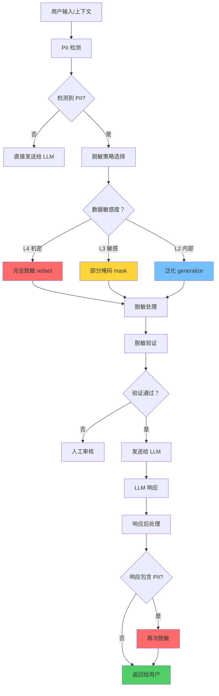

#### 4.1.4 脱敏配置

```yaml
# llm-privacy-config.yaml
llm_privacy:
  # 脱敏策略配置
  masking:
    # 默认策略
    default_strategy: "mask"
    
    # 按数据类型配置策略
    by_data_type:
      id_card: "redact"        # 身份证号 - 完全脱敏
      bank_card: "redact"      # 银行卡号 - 完全脱敏
      api_key: "redact"        # API Key - 完全脱敏
      private_key: "redact"    # 私钥 - 完全脱敏
      password: "redact"       # 密码 - 完全脱敏
      
      phone_number: "mask"     # 手机号 - 部分掩码
      email: "mask"            # 邮箱 - 部分掩码
      person_name: "mask"      # 姓名 - 部分掩码
      
      ip_address: "generalize" # IP 地址 - 泛化
      location: "generalize"   # 位置 - 泛化
    
    # 按 LLM 提供商配置
    by_provider:
      openai:
        # OpenAI 是外部服务，使用严格脱敏
        strategy: "redact"
        allowed_data_types: []  # 不允许发送任何 PII
      
      azure_openai:
        # Azure OpenAI 有企业协议，可放宽
        strategy: "mask"
        allowed_data_types: ["email", "person_name"]
      
      local_qwen:
        # 本地部署模型，可不脱敏
        strategy: "none"
        allowed_data_types: "all"
  
  # 上下文处理
  context:
    # 最大上下文长度
    max_context_length: 8192
    
    # 上下文中的 PII 处理
    pii_in_context:
      # 历史对话中的 PII 是否脱敏
      mask_history: true
      
      # 系统 Prompt 中的 PII 处理
      system_prompt_pii: "remove"
  
  # 响应处理
  response:
    # 检查 LLM 响应是否包含 PII
    check_response_pii: true
    
    # 发现 PII 时的处理
    on_pii_detected: "redact_and_warn"  # redact_and_warn / block / log_only
```

### 4.2 模型选择策略

#### 4.2.1 模型分级

| 模型类型 | 部署方式 | 数据出境 | 适用数据分级 | 示例 |
|---------|---------|---------|-------------|------|
| **本地模型** | 本地 GPU 集群 | 不出境 | L1-L4 全级别 | Qwen-72B（本地部署） |
| **私有云模型** | 企业私有云 | 境内 | L1-L3 | Azure OpenAI（中国区） |
| **公有云模型** | 公有云 API | 可能出境 | L1-L2 | OpenAI GPT-4、Claude |

#### 4.2.2 模型选择决策树

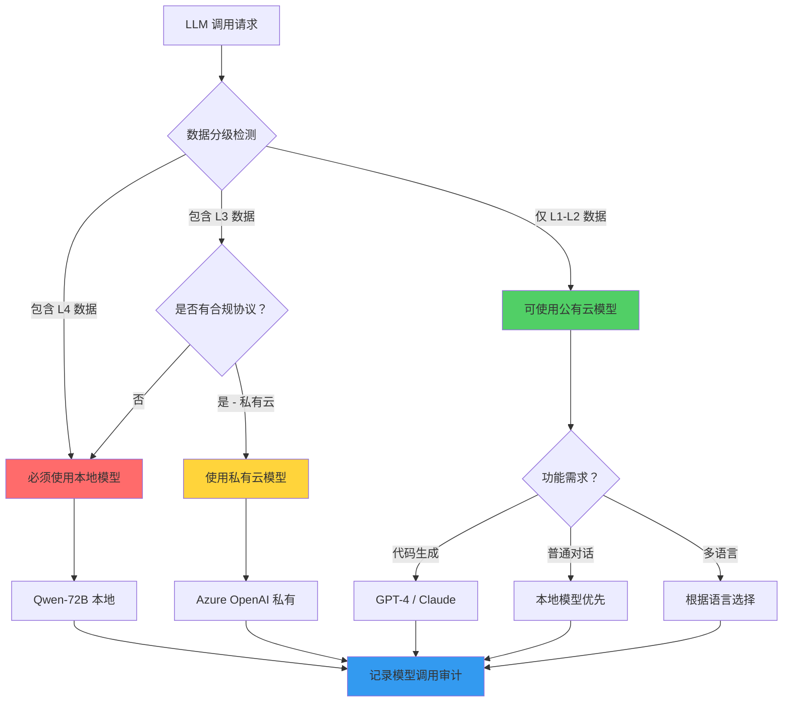

#### 4.2.3 模型选择配置

```yaml
# model-selection-config.yaml
model_selection:
  # 路由规则
  routing_rules:
    - name: "high_sensitivity_data"
      condition:
        data_sensitivity: ["L4"]
      model: "local-qwen-72b"
      reason: "L4 数据禁止出境"
    
    - name: "medium_sensitivity_data"
      condition:
        data_sensitivity: ["L3"]
        has_compliance_agreement: true
      model: "azure-openai-china"
      reason: "L3 数据需私有云处理"
    
    - name: "code_generation"
      condition:
        task_type: "code_generation"
        data_sensitivity: ["L1", "L2"]
      model: "gpt-4"
      reason: "代码生成使用最强模型"
    
    - name: "general_chat"
      condition:
        task_type: "chat"
        data_sensitivity: ["L1", "L2"]
      model: "local-qwen-7b"
      reason: "普通对话优先使用本地模型"
  
  # 模型配置
  models:
    local-qwen-72b:
      endpoint: "http://ai-service.orion.svc:8000/v1/chat/completions"
      api_key_secret: "vault://ai/local-qwen-key"
      max_tokens: 32768
      cost_per_1k_tokens: 0.002  # 内部成本
      latency_p95_ms: 500
      capabilities: ["chat", "code", "analysis"]
      data_residency: "on-premise"
    
    azure-openai-china:
      endpoint: "https://api.openai.azure.cn/v1/chat/completions"
      api_key_secret: "vault://ai/azure-china-key"
      max_tokens: 8192
      cost_per_1k_tokens: 0.015
      latency_p95_ms: 800
      capabilities: ["chat", "code", "analysis"]
      data_residency: "china"
      compliance_agreement: "azure-enterprise-agreement"
    
    gpt-4:
      endpoint: "https://api.openai.com/v1/chat/completions"
      api_key_secret: "vault://ai/openai-key"
      max_tokens: 8192
      cost_per_1k_tokens: 0.03
      latency_p95_ms: 1000
      capabilities: ["chat", "code", "analysis"]
      data_residency: "global"
      allowed_sensitivity: ["L1", "L2"]
```

### 4.3 LLM 调用审计

#### 4.3.1 审计日志结构

```python
@dataclass
class LLMCallAuditLog:
    """LLM 调用审计日志"""
    
    # 基础信息
    log_id: str                          # 日志 ID
    timestamp: datetime                  # 调用时间
    request_id: str                      # 请求 ID（用于链路追踪）
    
    # 用户信息
    user_id: str                         # 用户 ID（脱敏）
    user_role: str                       # 用户角色
    session_id: str                      # 会话 ID
    
    # 请求信息
    task_type: str                       # 任务类型（code_review/chat/analysis）
    input_preview: str                   # 输入预览（前 200 字符，脱敏）
    input_token_count: int               # 输入 Token 数
    input_hash: str                      # 输入哈希（用于去重）
    
    # 脱敏信息
    pii_detected: List[PIIMatch]         # 检测到的 PII
    masking_strategy: str                # 使用的脱敏策略
    masked_input_preview: str            # 脱敏后输入预览
    
    # 模型信息
    model_name: str                      # 使用的模型
    model_provider: str                  # 模型提供商
    model_selection_reason: str          # 模型选择原因
    
    # 响应信息
    output_preview: str                  # 输出预览（前 200 字符）
    output_token_count: int              # 输出 Token 数
    latency_ms: int                      # 响应延迟
    status: str                          # 状态（success/failed/timeout）
    
    # 成本信息
    cost_usd: float                      # 调用成本
    cost_center: str                     # 成本中心（团队/项目）
    
    # 安全信息
    risk_level: str                      # 风险等级（low/medium/high）
    security_events: List[str]           # 安全事件（如 PII 泄露尝试）
    compliance_check: bool               # 合规检查是否通过
    
    # 元数据
    metadata: Dict[str, Any]             # 其他元数据
```

#### 4.3.2 审计日志存储

```yaml
# Elasticsearch 索引模板
{
  "index_patterns": ["llm-audit-*"],
  "template": {
    "settings": {
      "number_of_shards": 3,
      "number_of_replicas": 1,
      "retention": {
        "policy": "365d"  # 保留 365 天
      }
    },
    "mappings": {
      "properties": {
        "log_id": { "type": "keyword" },
        "timestamp": { "type": "date" },
        "request_id": { "type": "keyword" },
        "user_id": { "type": "keyword" },
        "user_role": { "type": "keyword" },
        "task_type": { "type": "keyword" },
        "input_preview": { "type": "text", "index": false },
        "input_token_count": { "type": "integer" },
        "input_hash": { "type": "keyword" },
        "pii_detected": {
          "type": "nested",
          "properties": {
            "type": { "type": "keyword" },
            "sensitivity": { "type": "keyword" },
            "masked": { "type": "boolean" }
          }
        },
        "masking_strategy": { "type": "keyword" },
        "model_name": { "type": "keyword" },
        "model_provider": { "type": "keyword" },
        "output_preview": { "type": "text", "index": false },
        "output_token_count": { "type": "integer" },
        "latency_ms": { "type": "integer" },
        "status": { "type": "keyword" },
        "cost_usd": { "type": "float" },
        "risk_level": { "type": "keyword" },
        "security_events": { "type": "keyword" },
        "compliance_check": { "type": "boolean" }
      }
    }
  }
}
```

#### 4.3.3 审计查询 API

```yaml
openapi: 3.0.0
info:
  title: Orion LLM Audit API
  version: 1.0.0
paths:
  /api/v1/audit/llm-calls:
    get:
      summary: 查询 LLM 调用审计日志
      tags:
        - Audit
      security:
        - bearerAuth: []
      parameters:
        - name: user_id
          in: query
          schema:
            type: string
          description: 按用户 ID 过滤
        - name: model_name
          in: query
          schema:
            type: string
          description: 按模型名称过滤
        - name: task_type
          in: query
          schema:
            type: string
            enum: [code_review, chat, analysis, code_generation]
          description: 按任务类型过滤
        - name: start_time
          in: query
          schema:
            type: string
            format: date-time
          description: 开始时间
        - name: end_time
          in: query
          schema:
            type: string
            format: date-time
          description: 结束时间
        - name: risk_level
          in: query
          schema:
            type: string
            enum: [low, medium, high, critical]
          description: 按风险等级过滤
        - name: limit
          in: query
          schema:
            type: integer
            default: 100
            maximum: 1000
          description: 返回数量限制
      responses:
        '200':
          description: 审计日志列表
          content:
            application/json:
              schema:
                type: object
                properties:
                  total:
                    type: integer
                  logs:
                    type: array
                    items:
                      $ref: '#/components/schemas/LLMCallAuditLog'

  /api/v1/audit/llm-calls/{log_id}:
    get:
      summary: 查询单条 LLM 调用审计日志详情
      tags:
        - Audit
      parameters:
        - name: log_id
          in: path
          required: true
          schema:
            type: string
      responses:
        '200':
          description: 审计日志详情
```

#### 4.3.4 安全告警规则

```yaml
# llm-security-alerts.yaml
security_alerts:
  rules:
    - name: "pii_leak_attempt"
      description: "检测到 PII 泄露尝试"
      condition:
        security_events_contains: "PII_LEAK_ATTEMPT"
      severity: "critical"
      action:
        - notify_security_team
        - block_user_temporarily
        - create_incident
    
    - name: "prompt_injection_detected"
      description: "检测到 Prompt 注入攻击"
      condition:
        security_events_contains: "PROMPT_INJECTION"
      severity: "high"
      action:
        - notify_security_team
        - log_detailed
    
    - name: "excessive_pii_in_input"
      description: "输入中包含大量 PII"
      condition:
        pii_detected_count_gt: 5
      severity: "medium"
      action:
        - warn_user
        - log_detailed
    
    - name: "unauthorized_model_access"
      description: "未授权的模型访问尝试"
      condition:
        status: "forbidden"
        count_gt: 3
        time_window: "5m"
      severity: "high"
      action:
        - notify_security_team
        - block_user_temporarily
    
    - name: "abnormal_token_usage"
      description: "异常 Token 使用"
      condition:
        input_token_count_gt: 50000
      severity: "medium"
      action:
        - log_detailed
        - cost_alert
    
    - name: "high_latency_anomaly"
      description: "响应延迟异常"
      condition:
        latency_ms_gt: 10000
      severity: "low"
      action:
        - log_detailed
```

---

## 5. 数据保留与销毁策略

### 5.1 数据保留期限表

| 数据类型 | 分级 | 保留期限 | 起算时间 | 法律依据 | 到期处理 |
|---------|------|---------|---------|---------|---------|
| **用户账号数据** | L3 | 账号存续期 +30 天 | 账号注销日 | 业务需要 | 删除/匿名化 |
| **登录日志** | L3 | 365 天 | 登录日 | 安全审计需要 | 自动删除 |
| **操作审计日志** | L3 | 365 天 | 操作日 | 等保 2.0/安全审计 | 自动删除 |
| **Pipeline 运行记录** | L2 | 180 天 | 运行日 | 业务需要 | 自动删除 |
| **构建日志** | L2 | 180 天 | 构建日 | 故障排查需要 | 自动删除 |
| **部署记录** | L2 | 365 天 | 部署日 | 变更审计需要 | 自动删除 |
| **AI 对话历史** | L3 | 90 天 | 对话日 | 业务需要 | 自动删除 |
| **代码审查意见** | L2 | 永久 | 审查日 | 知识沉淀 | 归档 |
| **告警记录** | L2 | 365 天 | 告警日 | 运维审计需要 | 自动删除 |
| **指标数据** | L2 | 400 天 | 采集日 | 容量规划需要 | 降采样后删除 |
| **链路追踪数据** | L2 | 7 天 | 追踪日 | 故障排查需要 | 自动删除 |
| **备份数据** | L3 | 90 天 | 备份日 | 灾难恢复需要 | 覆盖旧备份 |
| **合规相关数据** | L4 | 7 年 | 数据产生日 | 税法/审计法要求 | 安全销毁 |
| **事故调查报告** | L3 | 5 年 | 事故关闭日 | 合规需要 | 归档 |
| **培训记录** | L2 | 3 年 | 培训日 | 合规需要 | 自动删除 |

### 5.2 保留策略实现

```yaml
# data-retention-policy.yaml
retention_policies:
  # PostgreSQL 数据保留
  postgresql:
    - table: "login_logs"
      retention_days: 365
      partition_by: "timestamp"
      delete_method: "partition_drop"
      schedule: "0 2 * * *"  # 每天凌晨 2 点
    
    - table: "operation_audit_logs"
      retention_days: 365
      partition_by: "timestamp"
      delete_method: "partition_drop"
      schedule: "0 2 * * *"
    
    - table: "ai_conversation_history"
      retention_days: 90
      partition_by: "user_id"
      delete_method: "row_delete"
      schedule: "0 3 * * *"
    
    - table: "pipeline_run_logs"
      retention_days: 180
      partition_by: "created_at"
      delete_method: "partition_drop"
      schedule: "0 2 * * *"
  
  # Elasticsearch 数据保留
  elasticsearch:
    - index_pattern: "audit-logs-*"
      retention_days: 365
      delete_method: "ilm_delete"
      ilm_policy: "365d-retention"
    
    - index_pattern: "operation-logs-*"
      retention_days: 180
      delete_method: "ilm_delete"
      ilm_policy: "180d-retention"
    
    - index_pattern: "llm-audit-*"
      retention_days: 365
      delete_method: "ilm_delete"
      ilm_policy: "365d-retention"
  
  # Loki 日志保留
  loki:
    - stream_pattern: '{app="pipeline"}'
      retention_days: 180
      delete_method: "retention_config"
    
    - stream_pattern: '{app="audit"}'
      retention_days: 365
      delete_method: "retention_config"
  
  # 对象存储保留
  s3:
    - bucket: "orion-backups"
      prefix: "database/"
      retention_days: 90
      delete_method: "lifecycle_policy"
      transition_to_glacier_days: 30
    
    - bucket: "orion-backups"
      prefix: "user-exports/"
      retention_days: 7
      delete_method: "lifecycle_policy"
```

### 5.3 安全销毁方法

#### 5.3.1 销毁标准

| 存储介质 | 销毁方法 | 标准 | 验证方式 |
|---------|---------|------|---------|
| **数据库记录** | 覆写删除 | NIST SP 800-88 Clear | 查询验证 |
| **文件系统** | 安全删除 | NIST SP 800-88 Purge | 文件扫描 |
| **对象存储** | 生命周期删除 | NIST SP 800-88 Clear | API 验证 |
| **备份磁带** | 消磁/物理销毁 | NIST SP 800-88 Destroy | 销毁证明 |
| **SSD 硬盘** | 安全擦除 | NIST SP 800-88 Purge | 擦除日志 |

#### 5.3.2 销毁流程

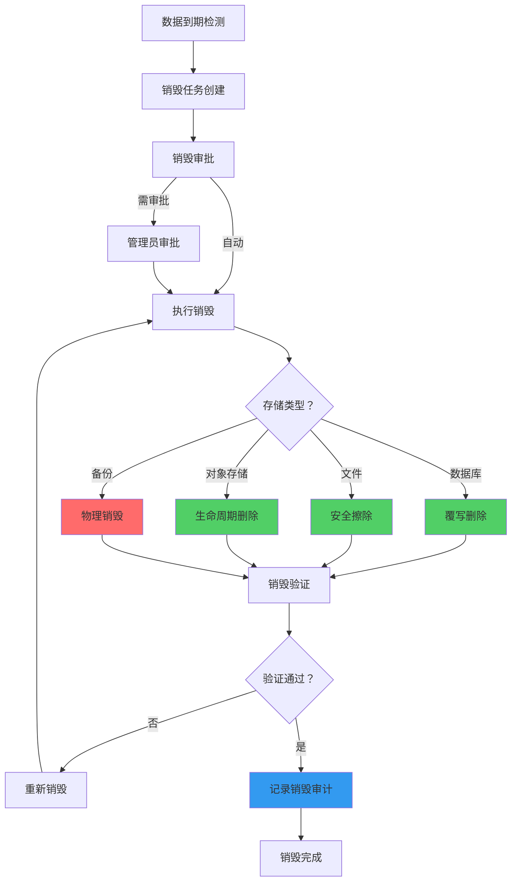

#### 5.3.3 销毁审计日志

```python
@dataclass
class DataDestructionAuditLog:
    """数据销毁审计日志"""
    
    log_id: str
    timestamp: datetime
    destruction_id: str
    
    # 数据信息
    data_type: str                    # 数据类型
    storage_system: str               # 存储系统
    data_range: Dict                  # 数据范围（表名/文件路径/对象前缀）
    record_count: int                 # 记录数量
    data_size_bytes: int              # 数据大小
    
    # 销毁信息
    destruction_method: str           # 销毁方法
    destruction_standard: str         # 遵循标准（如 NIST SP 800-88）
    performed_by: str                 # 执行者（系统/人工）
    approved_by: Optional[str]        # 审批者
    
    # 验证信息
    verification_method: str          # 验证方法
    verification_result: bool         # 验证结果
    verified_by: str                  # 验证者
    verified_at: datetime             # 验证时间
    
    # 合规信息
    legal_basis: str                  # 法律依据
    retention_policy_id: str          # 保留策略 ID
    compliance_check: bool            # 合规检查是否通过
    
    # 元数据
    notes: Optional[str]              # 备注
    evidence_files: List[str]         # 证据文件（销毁证明等）
```

---

## 6. 隐私合规审计

### 6.1 合规检查清单

#### 6.1.1 GDPR 合规检查清单

| 编号 | 检查项 | 检查方法 | 频率 | 责任人 |
|------|-------|---------|------|-------|
| **GDPR-001** | 数据处理是否有合法依据 | 审查数据处理记录 | 每季度 | 法务 + 安全 |
| **GDPR-002** | 隐私政策是否公开透明 | 审查隐私政策文档 | 每半年 | 法务 |
| **GDPR-003** | 用户同意是否有效记录 | 抽查同意记录 | 每月 | 安全 |
| **GDPR-004** | 数据主体请求是否及时响应 | 审查请求处理记录 | 每月 | 隐私官 |
| **GDPR-005** | 数据删除是否完整 | 抽样验证删除结果 | 每月 | 安全 |
| **GDPR-006** | 数据导出是否可用 | 测试导出功能 | 每月 | 安全 |
| **GDPR-007** | 跨境传输是否有合规机制 | 审查传输协议 | 每半年 | 法务 |
| **GDPR-008** | 数据泄露是否在 72 小时内通知 | 审查泄露响应记录 | 每季度 | 安全 |
| **GDPR-009** | DPIA（数据保护影响评估）是否执行 | 审查 DPIA 文档 | 新项目 | 隐私官 |
| **GDPR-010** | DPO（数据保护官）是否任命 | 审查任命文件 | 每年 | 管理层 |

#### 6.1.2 PIPL 合规检查清单

| 编号 | 检查项 | 检查方法 | 频率 | 责任人 |
|------|-------|---------|------|-------|
| **PIPL-001** | 个人信息处理是否告知并取得同意 | 审查同意记录 | 每月 | 法务 |
| **PIPL-002** | 敏感个人信息是否单独同意 | 审查敏感数据处理记录 | 每月 | 法务 |
| **PIPL-003** | 是否遵循最小必要原则 | 审查数据收集清单 | 每季度 | 安全 |
| **PIPL-004** | 个人信息保护负责人是否任命 | 审查任命文件 | 每年 | 管理层 |
| **PIPL-005** | 是否进行个人信息保护影响评估 | 审查 PIA 文档 | 新项目 | 安全 |
| **PIPL-006** | 跨境传输是否通过安全评估 | 审查跨境传输记录 | 每半年 | 法务 |
| **PIPL-007** | 是否建立个人信息保护投诉渠道 | 测试投诉渠道 | 每季度 | 客服 |
| **PIPL-008** | 员工是否接受隐私保护培训 | 审查培训记录 | 每年 | HR |
| **PIPL-009** | 是否制定个人信息安全事件应急预案 | 审查预案 + 演练 | 每年 | 安全 |
| **PIPL-010** | 是否定期进行合规审计 | 审查审计报告 | 每年 | 审计 |

### 6.2 审计报告生成

#### 6.2.1 审计报告结构

```markdown
# Orion 隐私合规审计报告

## 报告信息
- 报告编号：AUD-2026-Q1-001
- 审计期间：2026-01-01 至 2026-03-31
- 审计日期：2026-04-05
- 审计类型：季度合规审计
- 审计人员：张三（隐私官）、李四（安全工程师）

## 执行摘要
本季度 Orion 系统隐私合规状况总体良好，无重大合规风险。
- 合规检查通过率：98%
- 数据主体请求处理：15 件，全部按时响应
- 数据删除请求：8 件，平均完成时间 2 天
- 数据导出请求：7 件，平均完成时间 1 天
- 安全事件：0 起

## 审计范围
- 数据处理活动审查
- 数据主体权利实现验证
- 数据安全措施评估
- 第三方数据处理审查
- 员工隐私培训情况

## 详细发现

### 1. 数据处理活动
| 处理活动 | 合法依据 | 数据类型 | 保留期限 | 合规状态 |
|---------|---------|---------|---------|---------|
| 用户账号管理 | 合同履行 | PII | 账号存续期 +30 天 | ✅ 合规 |
| Pipeline 运行 | 合法利益 | 业务数据 | 180 天 | ✅ 合规 |
| AI 对话处理 | 用户同意 | 对话内容 | 90 天 | ✅ 合规 |

### 2. 数据主体权利
| 权利类型 | 请求数量 | 平均响应时间 | 及时率 | 合规状态 |
|---------|---------|-------------|-------|---------|
| 访问权 | 7 | 1.2 天 | 100% | ✅ 合规 |
| 删除权 | 8 | 2.1 天 | 100% | ✅ 合规 |
| 更正权 | 0 | - | - | ✅ 合规 |
| 可携带权 | 7 | 1.0 天 | 100% | ✅ 合规 |

### 3. 数据安全措施
| 控制措施 | 状态 | 备注 |
|---------|------|------|
| 数据加密 | ✅ 有效 | AES-256-GCM |
| 访问控制 | ✅ 有效 | RBAC+ABAC |
| 审计日志 | ✅ 有效 | 完整记录 |
| 数据脱敏 | ✅ 有效 | PII 自动脱敏 |

### 4. 发现的问题
| 编号 | 问题描述 | 风险等级 | 整改建议 | 责任人 | 截止日期 |
|------|---------|---------|---------|-------|---------|
| FIND-001 | 部分旧日志未加密 | 低 | 启用日志加密 | 运维团队 | 2026-04-30 |

## 整改跟踪
| 编号 | 整改措施 | 状态 | 完成日期 |
|------|---------|------|---------|
| FIND-001 | 启用 Loki 日志加密 | 进行中 | - |

## 结论
Orion 系统本季度隐私合规状况良好，符合 GDPR 和 PIPL 要求。
发现 1 个低风险问题，已制定整改计划。

## 附件
- 合规检查清单
- 数据主体请求记录
- 安全事件报告（如有）
- 整改措施计划

---
报告生成日期：2026-04-05
下次审计日期：2026-07-05
```

#### 6.2.2 自动化审计报告生成

```python
class ComplianceAuditReportGenerator:
    """合规审计报告生成器"""
    
    async def generate_quarterly_report(
        self,
        quarter: str,  # 如 "2026-Q1"
        regulations: List[str] = ["GDPR", "PIPL"]
    ) -> AuditReport:
        """生成季度合规审计报告"""
        
        # 1. 收集审计数据
        gdpr_checklist = await self._collect_gdpr_checklist(quarter)
        pipl_checklist = await self._collect_pipl_checklist(quarter)
        data_subject_requests = await self._collect_ds_requests(quarter)
        security_events = await self._collect_security_events(quarter)
        training_records = await self._collect_training_records(quarter)
        
        # 2. 计算合规指标
        compliance_metrics = self._calculate_metrics(
            gdpr_checklist,
            pipl_checklist,
            data_subject_requests
        )
        
        # 3. 识别问题
        findings = await self._identify_findings(
            gdpr_checklist,
            pipl_checklist,
            security_events
        )
        
        # 4. 生成报告
        report = AuditReport(
            report_id=f"AUD-{quarter}-001",
            period=quarter,
            generated_at=datetime.utcnow(),
            regulations=regulations,
            metrics=compliance_metrics,
            findings=findings,
            conclusion=self._generate_conclusion(compliance_metrics, findings)
        )
        
        # 5. 存储报告
        await self._store_report(report)
        
        # 6. 发送通知
        await self._notify_stakeholders(report)
        
        return report
    
    def _calculate_metrics(
        self,
        gdpr: ChecklistResult,
        pipl: ChecklistResult,
        ds_requests: List[DataSubjectRequest]
    ) -> ComplianceMetrics:
        """计算合规指标"""
        return ComplianceMetrics(
            gdpr_pass_rate=gdpr.pass_rate,
            pipl_pass_rate=pipl.pass_rate,
            ds_request_count=len(ds_requests),
            ds_request_on_time_rate=sum(
                1 for r in ds_requests if r.on_time
            ) / len(ds_requests) if ds_requests else 1.0,
            avg_response_time_days=sum(
                r.response_time.days for r in ds_requests
            ) / len(ds_requests) if ds_requests else 0,
            security_event_count=0,  # 从安全事件统计
            training_completion_rate=0.98  # 从培训记录统计
        )
```

### 6.3 持续合规监控

```python
class ContinuousComplianceMonitor:
    """持续合规监控服务"""
    
    def __init__(self):
        self.monitors = [
            DataSubjectRequestMonitor(),
            DataRetentionMonitor(),
            PIIHandlingMonitor(),
            CrossBorderTransferMonitor(),
            ConsentManagementMonitor(),
        ]
    
    async def start_monitoring(self):
        """启动持续监控"""
        for monitor in self.monitors:
            asyncio.create_task(monitor.run_continuous())
    
    async def check_compliance_status(self) -> ComplianceStatus:
        """检查当前合规状态"""
        results = []
        for monitor in self.monitors:
            result = await monitor.check()
            results.append(result)
        
        overall_status = "compliant" if all(
            r.status == "compliant" for r in results
        ) else "non_compliant"
        
        return ComplianceStatus(
            status=overall_status,
            checked_at=datetime.utcnow(),
            monitor_results=results
        )
```

---

## 7. 技术架构与实现

### 7.1 系统组件架构

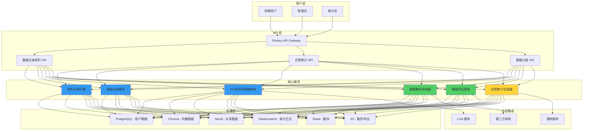

### 7.2 数据流设计

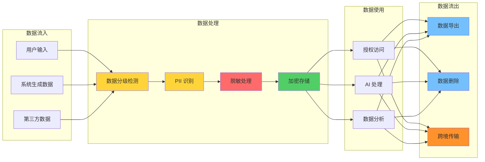

### 7.3 数据库表设计

```sql
-- 隐私合规相关表

-- 1. 数据主体请求记录表
CREATE TABLE privacy_requests (
    id UUID PRIMARY KEY DEFAULT gen_random_uuid(),
    user_id UUID NOT NULL REFERENCES users(id),
    request_type VARCHAR(50) NOT NULL,  -- deletion, export, access, correction
    status VARCHAR(20) NOT NULL DEFAULT 'pending',  -- pending, processing, completed, failed
    reason VARCHAR(500),
    scope JSONB,  -- 请求范围
    created_at TIMESTAMP WITH TIME ZONE DEFAULT NOW(),
    completed_at TIMESTAMP WITH TIME ZONE,
    completed_by UUID REFERENCES users(id),
    failure_reason TEXT,
    metadata JSONB,
    
    INDEX idx_privacy_requests_user_id (user_id),
    INDEX idx_privacy_requests_status (status),
    INDEX idx_privacy_requests_created_at (created_at)
);

-- 2. 数据删除进度表
CREATE TABLE privacy_deletion_progress (
    id UUID PRIMARY KEY DEFAULT gen_random_uuid(),
    request_id UUID NOT NULL REFERENCES privacy_requests(id),
    storage_system VARCHAR(50) NOT NULL,  -- postgresql, chroma, neo4j, elasticsearch, redis, s3
    status VARCHAR(20) NOT NULL,  -- pending, in_progress, completed, failed
    records_deleted INTEGER DEFAULT 0,
    error_message TEXT,
    started_at TIMESTAMP WITH TIME ZONE,
    completed_at TIMESTAMP WITH TIME ZONE,
    
    UNIQUE(request_id, storage_system)
);

-- 3. 数据导出记录表
CREATE TABLE privacy_export_records (
    id UUID PRIMARY KEY DEFAULT gen_random_uuid(),
    request_id UUID NOT NULL REFERENCES privacy_requests(id),
    file_path VARCHAR(500) NOT NULL,
    file_size_bytes BIGINT,
    encryption_method VARCHAR(50),
    download_url TEXT,
    download_count INTEGER DEFAULT 0,
    expires_at TIMESTAMP WITH TIME ZONE NOT NULL,
    created_at TIMESTAMP WITH TIME ZONE DEFAULT NOW(),
    
    INDEX idx_privacy_export_request_id (request_id)
);

-- 4. 数据分级配置表
CREATE TABLE data_classification_rules (
    id UUID PRIMARY KEY DEFAULT gen_random_uuid(),
    rule_name VARCHAR(100) NOT NULL UNIQUE,
    pattern TEXT NOT NULL,  -- 正则表达式
    data_type VARCHAR(50) NOT NULL,  -- email, phone, id_card, etc.
    sensitivity_level VARCHAR(10) NOT NULL,  -- L1, L2, L3, L4
    action VARCHAR(20) NOT NULL,  -- classify, redact, encrypt, alert
    enabled BOOLEAN DEFAULT TRUE,
    created_at TIMESTAMP WITH TIME ZONE DEFAULT NOW(),
    updated_at TIMESTAMP WITH TIME ZONE DEFAULT NOW()
);

-- 5. PII 检测日志表
CREATE TABLE pii_detection_logs (
    id UUID PRIMARY KEY DEFAULT gen_random_uuid(),
    request_id UUID,
    user_id UUID,
    input_hash VARCHAR(64) NOT NULL,  -- 输入内容哈希
    pii_detected JSONB NOT NULL,  -- 检测到的 PII 列表
    masking_strategy VARCHAR(50),
    risk_level VARCHAR(20),
    created_at TIMESTAMP WITH TIME ZONE DEFAULT NOW(),
    
    INDEX idx_pii_logs_user_id (user_id),
    INDEX idx_pii_logs_created_at (created_at)
);

-- 6. LLM 调用审计表
CREATE TABLE llm_call_audit_logs (
    id UUID PRIMARY KEY DEFAULT gen_random_uuid(),
    request_id VARCHAR(100) NOT NULL,
    user_id UUID NOT NULL,
    task_type VARCHAR(50) NOT NULL,
    model_name VARCHAR(100) NOT NULL,
    model_provider VARCHAR(100),
    input_token_count INTEGER,
    output_token_count INTEGER,
    latency_ms INTEGER,
    cost_usd DECIMAL(10,6),
    pii_detected_count INTEGER DEFAULT 0,
    masking_strategy VARCHAR(50),
    risk_level VARCHAR(20),
    security_events JSONB,
    compliance_check_passed BOOLEAN DEFAULT TRUE,
    status VARCHAR(20) NOT NULL,
    created_at TIMESTAMP WITH TIME ZONE DEFAULT NOW(),
    
    INDEX idx_llm_audit_user_id (user_id),
    INDEX idx_llm_audit_model_name (model_name),
    INDEX idx_llm_audit_created_at (created_at)
);

-- 7. 合规审计记录表
CREATE TABLE compliance_audit_records (
    id UUID PRIMARY KEY DEFAULT gen_random_uuid(),
    audit_type VARCHAR(50) NOT NULL,  -- gdpr, pipl, internal
    audit_period VARCHAR(20) NOT NULL,  -- 2026-Q1
    auditor_id UUID NOT NULL REFERENCES users(id),
    checklist_results JSONB NOT NULL,
    findings JSONB,
    overall_status VARCHAR(20) NOT NULL,  -- compliant, non_compliant
    report_path VARCHAR(500),
    created_at TIMESTAMP WITH TIME ZONE DEFAULT NOW(),
    
    INDEX idx_compliance_audit_type (audit_type),
    INDEX idx_compliance_audit_period (audit_period)
);

-- 8. 用户同意记录表
CREATE TABLE user_consent_records (
    id UUID PRIMARY KEY DEFAULT gen_random_uuid(),
    user_id UUID NOT NULL REFERENCES users(id),
    consent_type VARCHAR(100) NOT NULL,  -- privacy_policy, data_processing, marketing
    consent_given BOOLEAN NOT NULL,
    consent_text_version VARCHAR(50) NOT NULL,  -- 同意的文本版本
    ip_address INET,
    user_agent TEXT,
    given_at TIMESTAMP WITH TIME ZONE DEFAULT NOW(),
    withdrawn_at TIMESTAMP WITH TIME ZONE,
    
    INDEX idx_user_consent_user_id (user_id),
    INDEX idx_user_consent_type (consent_type)
);

-- 9. 数据保留策略表
CREATE TABLE data_retention_policies (
    id UUID PRIMARY KEY DEFAULT gen_random_uuid(),
    policy_name VARCHAR(100) NOT NULL UNIQUE,
    data_type VARCHAR(100) NOT NULL,
    storage_system VARCHAR(50) NOT NULL,
    retention_days INTEGER NOT NULL,
    retention_start_point VARCHAR(50) NOT NULL,  -- created_at, deleted_at, etc.
    destruction_method VARCHAR(50) NOT NULL,
    legal_basis TEXT,
    enabled BOOLEAN DEFAULT TRUE,
    last_execution_at TIMESTAMP WITH TIME ZONE,
    created_at TIMESTAMP WITH TIME ZONE DEFAULT NOW(),
    
    INDEX idx_retention_policy_data_type (data_type)
);

-- 10. 数据销毁审计表
CREATE TABLE data_destruction_audit_logs (
    id UUID PRIMARY KEY DEFAULT gen_random_uuid(),
    destruction_id VARCHAR(100) NOT NULL UNIQUE,
    policy_id UUID REFERENCES data_retention_policies(id),
    data_type VARCHAR(100) NOT NULL,
    storage_system VARCHAR(50) NOT NULL,
    record_count INTEGER,
    data_size_bytes BIGINT,
    destruction_method VARCHAR(50) NOT NULL,
    performed_by UUID REFERENCES users(id),
    verification_result BOOLEAN NOT NULL,
    verified_by UUID REFERENCES users(id),
    verified_at TIMESTAMP WITH TIME ZONE NOT NULL,
    evidence_files JSONB,
    created_at TIMESTAMP WITH TIME ZONE DEFAULT NOW(),
    
    INDEX idx_destruction_audit_created_at (created_at)
);
```

---

## 8. 实施路线图

### 8.1 分阶段实施计划

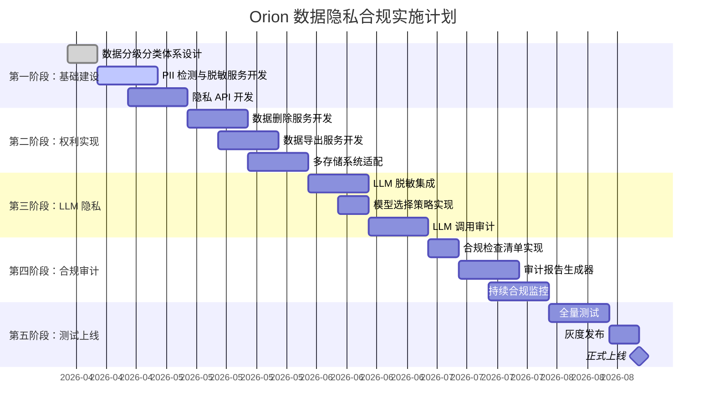

### 8.2 各阶段详细计划

#### 第一阶段：基础建设（2026-04-10 至 2026-05-01）

| 任务 | 负责人 | 交付物 | 验收标准 |
|------|-------|-------|---------|
| 数据分级分类体系设计 | 安全团队 | 数据分级文档 | 覆盖所有数据类型 |
| PII 检测规则开发 | AI 团队 | PII 检测服务 | 识别准确率≥95% |
| 脱敏算法实现 | AI 团队 | 脱敏服务 | 支持 5 种以上策略 |
| 隐私 API 设计 | 后端团队 | OpenAPI 文档 | API 设计评审通过 |
| 数据库表创建 | 后端团队 | 数据库迁移脚本 | 所有表创建成功 |

#### 第二阶段：权利实现（2026-05-01 至 2026-06-05）

| 任务 | 负责人 | 交付物 | 验收标准 |
|------|-------|-------|---------|
| 数据删除服务开发 | 后端团队 | 删除服务代码 | 支持 6 种存储系统 |
| 数据导出服务开发 | 后端团队 | 导出服务代码 | 支持 JSON/CSV/YAML |
| PostgreSQL 删除适配 | 后端团队 | 删除实现 | 级联删除完整 |
| Chroma 删除适配 | AI 团队 | 删除实现 | 向量数据删除 |
| Neo4j 删除适配 | 后端团队 | 删除实现 | 图数据删除 |
| Elasticsearch 删除适配 | 运维团队 | 删除实现 | 索引数据删除 |
| Redis 删除适配 | 运维团队 | 删除实现 | 缓存数据删除 |
| S3 删除适配 | 运维团队 | 删除实现 | 对象数据删除 |

#### 第三阶段：LLM 隐私（2026-06-05 至 2026-07-03）

| 任务 | 负责人 | 交付物 | 验收标准 |
|------|-------|-------|---------|
| LLM 脱敏集成 | AI 团队 | 脱敏中间件 | 所有 LLM 调用经过脱敏 |
| 模型选择策略 | AI 团队 | 路由服务 | 根据数据分级选择模型 |
| LLM 调用审计 | 后端团队 | 审计日志 | 完整记录每次调用 |
| 安全告警规则 | 安全团队 | 告警配置 | 覆盖 6 类安全事件 |

#### 第四阶段：合规审计（2026-07-03 至 2026-07-31）

| 任务 | 负责人 | 交付物 | 验收标准 |
|------|-------|-------|---------|
| 合规检查清单 | 法务团队 | 检查清单文档 | 覆盖 GDPR/PIPL |
| 审计报告生成器 | 后端团队 | 报告生成服务 | 自动生成季度报告 |
| 持续合规监控 | 安全团队 | 监控服务 | 实时合规状态 |
| 数据保留策略 | 运维团队 | 保留配置 | 自动清理到期数据 |

#### 第五阶段：测试上线（2026-07-31 至 2026-08-21）

| 任务 | 负责人 | 交付物 | 验收标准 |
|------|-------|-------|---------|
| 单元测试 | 测试团队 | 测试报告 | 覆盖率≥80% |
| 集成测试 | 测试团队 | 测试报告 | 所有接口测试通过 |
| 渗透测试 | 安全团队 | 渗透报告 | 无高危漏洞 |
| 合规评审 | 法务团队 | 合规评审报告 | GDPR/PIPL 合规 |
| 灰度发布 | 运维团队 | 发布报告 | 1%→5%→20%→100% |
| 正式上线 | 运维团队 | 上线报告 | 所有服务正常 |

### 8.3 验收标准

#### 功能验收

| 功能 | 验收标准 | 测试方法 |
|------|---------|---------|
| 数据分级 | 自动识别准确率≥95% | 抽样测试 100 条数据 |
| PII 检测 | 召回率≥98%，误报率≤2% | 标准测试集 |
| 数据脱敏 | 脱敏后无法还原原始 PII | 人工审查 + 自动化测试 |
| 数据删除 | 6 种存储系统删除完整率 100% | 删除后验证查询 |
| 数据导出 | 导出文件格式正确、数据完整 | 文件验证 + 数据对比 |
| 模型选择 | L4 数据 100% 使用本地模型 | 审计日志分析 |
| LLM 审计 | 调用记录完整率 100% | 日志完整性检查 |
| 合规报告 | 自动生成季度报告 | 报告内容审查 |

#### 性能验收

| 指标 | 目标值 | 测试方法 |
|------|-------|---------|
| PII 检测延迟 | P95 < 50ms | 压测 1000 QPS |
| 脱敏处理延迟 | P95 < 100ms | 压测 1000 QPS |
| 删除请求响应 | P95 < 2s | API 延迟测试 |
| 导出请求响应 | P95 < 5s | API 延迟测试 |
| 审计报告生成 | < 5 分钟 | 端到端测试 |

#### 合规验收

| 要求 | 验收标准 | 验证方法 |
|------|---------|---------|
| GDPR 合规 | 通过第三方合规审计 | 审计报告 |
| PIPL 合规 | 通过第三方合规审计 | 审计报告 |
| 等保 2.0 | 通过等保三级测评 | 测评报告 |
| 数据主体权利 | 请求响应率 100%，及时率≥95% | 请求记录审查 |
| 数据泄露通知 | 发现后 1 小时内告警 | 演练测试 |

---

## 9. 附录

### 9.1 术语表

| 术语 | 英文 | 定义 |
|------|------|------|
| PII | Personally Identifiable Information | 个人身份信息，可以单独或与其他信息结合识别特定自然人的信息 |
| GDPR | General Data Protection Regulation | 欧盟通用数据保护条例 |
| PIPL | Personal Information Protection Law | 中国个人信息保护法 |
| DPIA | Data Protection Impact Assessment | 数据保护影响评估 |
| DPO | Data Protection Officer | 数据保护官 |
| DLP | Data Loss Prevention | 数据防泄漏 |
| NIST | National Institute of Standards and Technology | 美国国家标准与技术研究院 |

### 9.2 参考文档

| 文档 | 链接 |
|------|------|
| GDPR 官方文本 | https://gdpr.eu/ |
| PIPL 官方文本 | https://www.npc.gov.cn/npc/c30834/202108/7c9af12f51334a73b56d7938f99a788a.shtml |
| NIST SP 800-88 | https://csrc.nist.gov/publications/detail/sp/800-88/rev-1/final |
| ISO 27001 | https://www.iso.org/standard/27001 |
| Orion 认证授权与数据加密设计 | /Users/heal/orion-design/docs/security/认证授权与数据加密设计.md |
| Orion Prompt 注入防护设计 | /Users/heal/orion-design/docs/security/ADR-009-Prompt 注入防护设计.md |

### 9.3 变更记录

| 版本 | 日期 | 作者 | 变更描述 |
|------|------|------|---------|
| 1.0 | 2026-04-10 | 安全团队 | 初始版本 |

---

_文档版本：v1.0 | 创建日期：2026-04-10 | 状态：设计完成 | 下一步：进入开发阶段_
