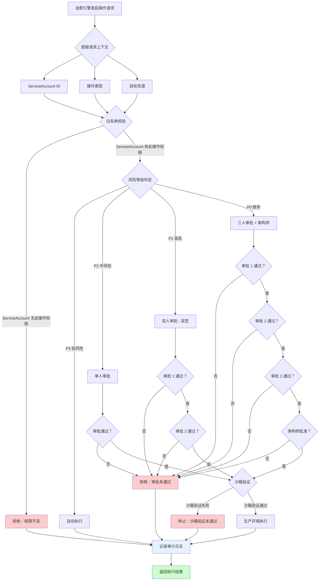
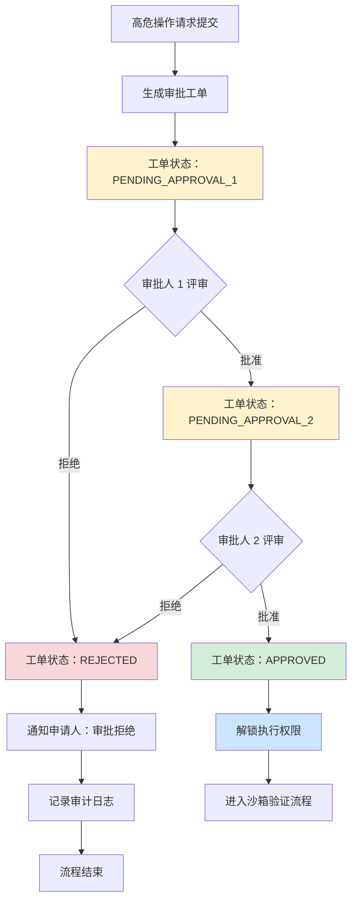
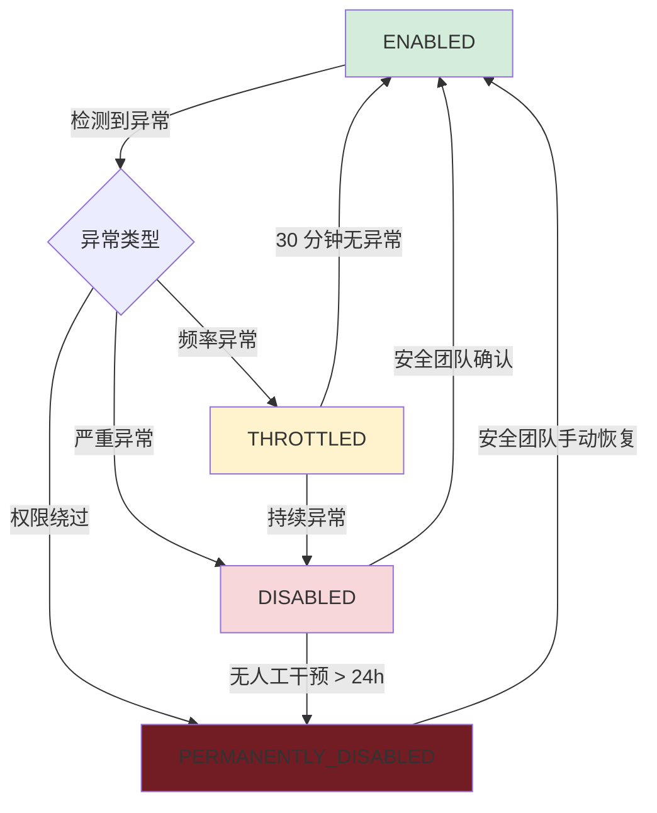
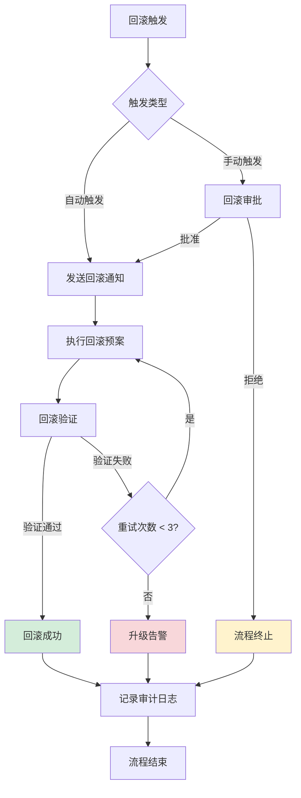

# 自愈引擎权限治理设计

## 1. 概述

### 1.1 背景

Kintsugi 自愈引擎可执行 DDL、回滚、流量切换等高危操作，当前权限边界模糊，存在权限爆炸风险。本设计基于**最小权限原则**和**零信任架构**，建立完整的权限治理体系。

### 1.2 治理目标

- **最小权限**：ServiceAccount 仅允许白名单内的操作
- **双签机制**：高危操作需 2 人独立审批
- **沙箱验证**：修复操作先在沙箱环境验证
- **完整审计**：决策依据 + 执行脚本 + 执行结果全链路记录
- **自毁开关**：检测到异常行为自动禁用
- **可回滚**：所有高危操作具备回滚预案

---

## 2. 高危操作分类与分级

### 2.1 操作风险等级定义

| 等级 | 名称 | 风险描述 | 审批要求 | 执行要求 |
|------|------|----------|----------|----------|
| **P0** | 致命操作 | 可能导致服务中断/数据丢失 | 3 人审批 + 架构师 | 沙箱验证 + 分阶段执行 |
| **P1** | 高危操作 | 可能影响核心业务 | 2 人审批（双签） | 沙箱验证 |
| **P2** | 中风险操作 | 影响有限，可快速恢复 | 1 人审批 | 可跳过沙箱 |
| **P3** | 低风险操作 | 无感知，可自动恢复 | 无需审批 | 自动执行 |

### 2.2 自愈引擎高危操作清单

| 操作类型 | 具体操作 | 风险等级 | 影响范围 |
|----------|----------|----------|----------|
| **DDL 操作** | 添加索引、修改表结构、删除约束 | P1 | 数据库性能/锁表 |
| **流量切换** | 服务路由切换、灰度发布、灾备切换 | P1 | 用户请求路由 |
| **回滚操作** | 部署回滚、配置回滚、数据回滚 | P1 | 服务版本/配置状态 |
| **限流熔断** | 限流策略调整、熔断器强制触发 | P2 | 请求处理能力 |
| **服务重启** | 单实例重启、批量重启、滚动重启 | P2 | 服务可用性 |

---

## 3. 最小权限原则设计

### 3.1 ServiceAccount 白名单机制

```
┌─────────────────────────────────────────────────────────────────┐
│                    ServiceAccount 权限模型                       │
├─────────────────────────────────────────────────────────────────┤
│                                                                 │
│   ┌──────────────┐     ┌──────────────┐     ┌──────────────┐   │
│   │   SA-DBA     │     │  SA-DEPLOY   │     │  SA-NETWORK  │   │
│   ├──────────────┤     ├──────────────┤     ├──────────────┤   │
│   │ • 添加索引   │     │ • 服务重启   │     │ • 流量切换   │   │
│   │ • 删除索引   │     │ • 部署回滚   │     │ • 路由配置   │   │
│   │ • 表结构变更 │     │ • 配置回滚   │     │ • 负载均衡   │   │
│   └──────┬───────┘     └──────┬───────┘     └──────┬───────┘   │
│          │                    │                    │           │
│          └────────────────────┼────────────────────┘           │
│                               │                                 │
│                    ┌──────────▼──────────┐                      │
│                    │   Permission Gate   │                      │
│                    │   (白名单校验)       │                      │
│                    └──────────┬──────────┘                      │
│                               │                                 │
│                    ┌──────────▼──────────┐                      │
│                    │   Target Resource   │                      │
│                    │   (RBAC 绑定)         │                      │
│                    └─────────────────────┘                      │
│                                                                 │
└─────────────────────────────────────────────────────────────────┘

权限绑定规则：
1. 每个 ServiceAccount 预定义允许的操作集合（白名单）
2. 白名单外操作直接拒绝，不进入审批流程
3. ServiceAccount 与具体资源通过 RBAC 绑定，限制作用域
4. 临时权限需单独申请，有效期最长 2 小时
```

### 3.2 权限判定流程



---

## 4. 双签机制设计

### 4.1 双签机制流程



### 4.2 双签机制核心规则

| 规则项 | 要求 |
|--------|------|
| **审批人独立性** | 审批人 2 不能是审批人 1 的直属下级 |
| **审批人资质** | 必须是对应领域的 Owner 或 Backup Owner |
| **审批时效** | 每个审批节点最长等待 4 小时，超时自动升级 |
| **审批依据** | 必须填写审批意见，不能仅点击"同意" |
| **冲突检测** | 审批人不能是操作的申请人或受益人 |
| **紧急通道** | P0 级故障可通过紧急通道，但需事后 24 小时内补齐审批 |

### 4.3 双签审批矩阵

| 操作类型 | 审批人 1 要求 | 审批人 2 要求 |
|----------|--------------|--------------|
| DDL 操作 | DBA Team Lead | 应用负责人 |
| 流量切换 | SRE On-call | 业务负责人 |
| 部署回滚 | 发布负责人 | 应用负责人 |
| 限流熔断 | SRE Team Lead | 业务负责人 |
| 服务重启 | 应用负责人 | SRE On-call |

---

## 5. 沙箱验证流程

### 5.1 沙箱环境架构

```
┌─────────────────────────────────────────────────────────────────┐
│                        沙箱验证架构                              │
├─────────────────────────────────────────────────────────────────┤
│                                                                 │
│  ┌─────────────┐    ┌─────────────┐    ┌─────────────┐         │
│  │  生产配置   │    │  生产数据   │    │  生产拓扑   │         │
│  │   快照      │    │   脱敏副本  │    │   模拟      │         │
│  └──────┬──────┘    └──────┬──────┘    └──────┬──────┘         │
│         │                  │                  │                 │
│         └──────────────────┼──────────────────┘                 │
│                            │                                    │
│                   ┌────────▼────────┐                           │
│                   │  沙箱环境构建器  │                           │
│                   └────────┬────────┘                           │
│                            │                                    │
│                   ┌────────▼────────┐                           │
│                   │   隔离沙箱环境   │                           │
│                   │ (与生产完全隔离) │                           │
│                   └────────┬────────┘                           │
│                            │                                    │
│                   ┌────────▼────────┐                           │
│                   │   执行修复操作   │                           │
│                   └────────┬────────┘                           │
│                            │                                    │
│         ┌──────────────────┼──────────────────┐                 │
│         │                  │                  │                 │
│  ┌──────▼──────┐   ┌──────▼──────┐   ┌──────▼──────┐          │
│  │  健康检查   │   │  影响评估   │   │  回滚验证   │          │
│  └──────┬──────┘   └──────┬──────┘   └──────┬──────┘          │
│         │                  │                  │                 │
│         └──────────────────┼──────────────────┘                 │
│                            │                                    │
│                   ┌────────▼────────┐                           │
│                   │   验证报告生成   │                           │
│                   └────────┬────────┘                           │
│                            │                                    │
│         ┌──────────────────┴──────────────────┐                 │
│         │                                      │                 │
│  ┌──────▼──────┐                     ┌────────▼──────┐         │
│  │ 验证通过    │                     │ 验证失败      │         │
│  │ → 允许执行  │                     │ → 终止操作    │         │
│  └─────────────┘                     └───────────────┘         │
│                                                                 │
└─────────────────────────────────────────────────────────────────┘
```

### 5.2 沙箱验证步骤

| 步骤 | 操作 | 验证项 | 通过标准 |
|------|------|--------|----------|
| **S1** | 环境准备 | 配置/数据/拓扑一致性 | 与生产环境偏差 < 5% |
| **S2** | 执行操作 | 操作可执行性 | 无错误完成 |
| **S3** | 健康检查 | 服务/DB/中间件状态 | 所有健康检查通过 |
| **S4** | 影响评估 | 性能/延迟/错误率 | 指标在阈值内 |
| **S5** | 回滚验证 | 回滚操作可执行 | 成功恢复原状 |
| **S6** | 报告生成 | 汇总所有验证结果 | 生成验证报告 |

### 5.3 沙箱验证超时策略

| 操作类型 | 沙箱验证超时 | 自动终止条件 |
|----------|-------------|--------------|
| DDL 操作 | 30 分钟 | 锁表 > 5 分钟 |
| 流量切换 | 10 分钟 | 错误率 > 1% |
| 部署回滚 | 15 分钟 | 服务不可用 > 3 分钟 |
| 限流熔断 | 5 分钟 | 请求堆积 > 10000 |
| 服务重启 | 10 分钟 | 启动失败 > 2 次 |

---

## 6. 操作审计设计

### 6.1 审计日志结构

```
┌─────────────────────────────────────────────────────────────────┐
│                        审计日志字段                              │
├─────────────────────────────────────────────────────────────────┤
│                                                                 │
│  ┌─────────────────────────────────────────────────────────┐   │
│  │ 决策依据（Decision Context）                             │   │
│  ├─────────────────────────────────────────────────────────┤   │
│  │ • alert_id: 触发自愈的告警 ID                            │   │
│  │ • anomaly_score: 异常检测得分                            │   │
│  │ • root_cause: 根因分析结果                               │   │
│  │ • recommended_action: 推荐操作                           │   │
│  │ • confidence: 推荐置信度                                 │   │
│  │ • affected_services: 受影响服务列表                      │   │
│  └─────────────────────────────────────────────────────────┘   │
│                                                                 │
│  ┌─────────────────────────────────────────────────────────┐   │
│  │ 执行脚本（Execution Script）                             │   │
│  ├─────────────────────────────────────────────────────────┤   │
│  │ • script_hash: 脚本 SHA256 哈希                          │   │
│  │ • script_content: 脚本内容（Base64 编码）                 │   │
│  │ • parameters: 执行参数                                   │   │
│  │ • service_account: 执行 SA 身份                           │   │
│  │ • target_resources: 目标资源列表                         │   │
│  └─────────────────────────────────────────────────────────┘   │
│                                                                 │
│  ┌─────────────────────────────────────────────────────────┐   │
│  │ 执行结果（Execution Result）                             │   │
│  ├─────────────────────────────────────────────────────────┤   │
│  │ • execution_id: 执行 ID                                  │   │
│  │ • start_time: 开始时间                                   │   │
│  │ • end_time: 结束时间                                     │   │
│  │ • status: SUCCESS/FAILURE/PARTIAL                        │   │
│  │ • stdout: 标准输出                                       │   │
│  │ • stderr: 错误输出                                       │   │
│  │ • rollback_triggered: 是否触发回滚                        │   │
│  │ • metrics_before: 执行前指标快照                         │   │
│  │ • metrics_after: 执行后指标快照                          │   │
│  └─────────────────────────────────────────────────────────┘   │
│                                                                 │
└─────────────────────────────────────────────────────────────────┘
```

### 6.2 审计日志存储策略

| 日志类型 | 存储位置 | 保留周期 | 访问权限 |
|----------|----------|----------|----------|
| 决策依据 | Elasticsearch | 90 天 | 只读（安全团队可写） |
| 执行脚本 | 对象存储（版本化） | 365 天 | 只读（安全团队可写） |
| 执行结果 | Elasticsearch + 对象存储 | 365 天 | 只读（安全团队可写） |
| 审批记录 | 关系型数据库 | 永久 | 只读（安全团队可写） |

### 6.3 审计查询能力

- 按 `alert_id` 追溯完整自愈链路
- 按 `service_account` 查询所有操作历史
- 按 `time_range` 查询特定时段操作
- 按 `operation_type` 统计操作分布
- 按 `approval_status` 查询审批合规性

---

## 7. 自毁开关设计

### 7.1 自毁触发条件

| 异常类型 | 检测指标 | 触发阈值 | 响应动作 |
|----------|----------|----------|----------|
| **频率异常** | 单位时间操作次数 | > 10 次/分钟 | 暂停 30 分钟 |
| **范围异常** | 操作影响服务数量 | > 5 个服务 | 立即禁用 |
| **时间异常** | 非工作时间操作 | 工作日 22:00-08:00 | 需额外审批 |
| **模式异常** | 与历史模式偏差 | 异常得分 > 0.9 | 立即禁用 |
| **连续失败** | 操作失败率 | > 50% 连续 3 次 | 暂停 60 分钟 |
| **权限绕过** | 检测到绕过尝试 | 任何次数 | 永久禁用 + 告警 |

### 7.2 自毁开关状态机



### 7.3 自毁恢复流程

1. **THROTTLED 状态**：自动恢复，无需人工干预
2. **DISABLED 状态**：安全团队负责人审批后恢复
3. **PERMANENTLY_DISABLED 状态**：需安全委员会评审后恢复

---

## 8. 误操作回滚预案

### 8.1 回滚预案分类

| 操作类型 | 回滚方式 | 回滚时间目标 | 回滚验证方式 |
|----------|----------|------------|--------------|
| **DDL 操作** | 反向 DDL / 备份恢复 | < 30 分钟 | 表结构校验 + 数据一致性检查 |
| **流量切换** | 路由配置回滚 | < 5 分钟 | 流量分布验证 |
| **部署回滚** | 版本回退 | < 10 分钟 | 服务健康检查 |
| **限流熔断** | 配置还原 | < 2 分钟 | 限流状态验证 |
| **服务重启** | 无需回滚 | N/A | 服务可用性验证 |

### 8.2 回滚预案模板

```
┌─────────────────────────────────────────────────────────────────┐
│                        回滚预案模板                              │
├─────────────────────────────────────────────────────────────────┤
│                                                                 │
│  【基本信息】                                                    │
│  • 原操作 ID: <operation_id>                                    │
│  • 原操作类型: <operation_type>                                 │
│  • 回滚预案版本：v<version>                                     │
│  • 最后更新时间：<timestamp>                                    │
│                                                                 │
│  【回滚触发条件】                                                │
│  • 自动触发：<condition_1>, <condition_2>, ...                  │
│  • 手动触发：审批人确认                                          │
│                                                                 │
│  【回滚步骤】                                                    │
│  1. <step_1> - 预计耗时 <t1>                                    │
│  2. <step_2> - 预计耗时 <t2>                                    │
│  3. <step_3> - 预计耗时 <t3>                                    │
│  ...                                                            │
│                                                                 │
│  【回滚验证】                                                    │
│  • 验证项 1: <check_1> - 通过标准 <criteria_1>                  │
│  • 验证项 2: <check_2> - 通过标准 <criteria_2>                  │
│  ...                                                            │
│                                                                 │
│  【升级联系人】                                                  │
│  • 一级联系人：<contact_1>                                      │
│  • 二级联系人：<contact_2>                                      │
│  • 紧急联系人：<contact_3>                                      │
│                                                                 │
└─────────────────────────────────────────────────────────────────┘
```

### 8.3 回滚执行流程



---

## 9. 总结

本设计方案针对自愈引擎的权限治理建立了完整的防护体系：

| 防护层 | 机制 | 作用 |
|--------|------|------|
| **事前** | 最小权限 + 双签机制 | 防止未授权操作 |
| **事中** | 沙箱验证 | 防止错误操作进入生产 |
| **事后** | 操作审计 + 回滚预案 | 快速恢复 + 问题追溯 |
| **兜底** | 自毁开关 | 防止系统异常导致大规模故障 |

### 9.1 实施建议

1. **Phase 1**：实施最小权限和 ServiceAccount 白名单
2. **Phase 2**：实施双签机制和审批流程
3. **Phase 3**：建设沙箱验证环境
4. **Phase 4**：完善审计和回滚能力
5. **Phase 5**：实施自毁开关

### 9.2 验收标准

- [ ] 所有高危操作均通过双签审批
- [ ] 沙箱验证通过率 100% 后方可执行
- [ ] 审计日志完整率 100%
- [ ] 回滚预案覆盖率 100%
- [ ] 自毁开关测试通过
