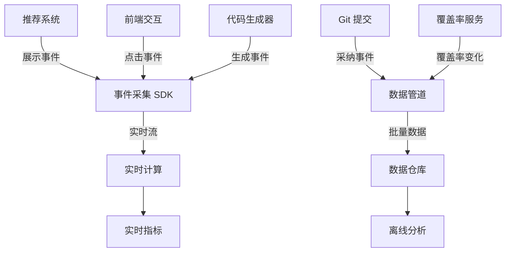
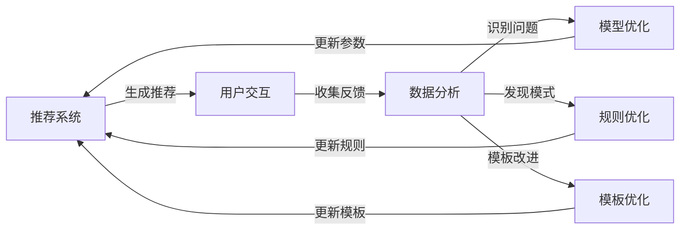

# 测试推荐效果评估设计

> 版本：v1.0 | 创建日期：2026-04-11 | 状态：草案

---

## 1. 概述

### 1.1 设计目标

建立测试推荐系统的效果评估体系，持续优化推荐准确率和覆盖率提升效果。

**对应需求**: US-3.4 — 作为开发者，我想要 AI 推荐新增测试用例，以便提高覆盖率

### 1.2 评估指标

| 指标 | 定义 | 目标值 | 优先级 |
|------|------|--------|--------|
| **推荐采纳率** | 开发者采纳的推荐数 / 总推荐数 | >40% | P0 |
| **推荐准确率** | 有效的推荐数 / 总推荐数 | >70% | P0 |
| **覆盖率提升** | 使用推荐后的覆盖率提升百分比 | +5-10% | P1 |
| **生成代码可用率** | 生成代码无需修改直接可用的比例 | >50% | P1 |
| **误报率** | 无效推荐 / 总推荐数 | <30% | P1 |
| **响应时间** | 从请求到返回推荐的时间 | <5 秒 | P0 |

---

## 2. 评估数据采集

### 2.1 数据埋点

```yaml
埋点事件:
  # 推荐展示
  - event: test_recommendation.shown
    properties:
      - recommendation_id
      - pr_id
      - file_path
      - recommendation_type  # coverage_gap/boundary_test/exception_test
      - estimated_coverage_improvement
      - timestamp
  
  # 推荐交互
  - event: test_recommendation.clicked
    properties:
      - recommendation_id
      - action  # view_details/generate_code/dismiss
      - time_spent_seconds
  
  # 代码生成
  - event: test_code.generated
    properties:
      - recommendation_id
      - generation_time_ms
      - code_lines
      - template_used
  
  # 推荐采纳
  - event: test_recommendation.accepted
    properties:
      - recommendation_id
      - acceptance_type  # as_is/modified/partial
      - modified_lines_count
      - commit_id
  
  # 覆盖率变化
  - event: test_coverage.changed
    properties:
      - file_path
      - before_coverage
      - after_coverage
      - recommendation_ids_applied
```

### 2.2 数据流



---

## 3. 评估模型

### 3.1 准确率计算

```python
class RecommendationAccuracy:
    """
    推荐准确率评估模型
    """
    
    def calculate_precision(self, recommendations, feedback):
        """
        计算精确率：有效推荐 / 总推荐
        
        Args:
            recommendations: 推荐列表
            feedback: 用户反馈列表
        
        Returns:
            precision: 精确率 (0-1)
        """
        valid_count = sum(1 for r in recommendations if self.is_valid(r, feedback))
        total_count = len(recommendations)
        
        return valid_count / total_count if total_count > 0 else 0
    
    def is_valid(self, recommendation, feedback):
        """
        判断推荐是否有效
        
        有效标准:
        1. 用户采纳 (完全或部分)
        2. 用户标记为"有用"
        3. 生成的测试通过执行
        4. 覆盖率确实提升
        """
        # 检查是否被采纳
        if recommendation.accepted:
            return True
        
        # 检查是否有正面反馈
        if feedback.get(recommendation.id, {}).get('helpful', False):
            return True
        
        # 检查生成的测试是否通过
        if recommendation.generated_test_passed:
            return True
        
        # 检查覆盖率是否提升
        if recommendation.coverage_improvement > 0:
            return True
        
        return False
    
    def calculate_recall(self, actual_gaps, recommended_gaps):
        """
        计算召回率：推荐出的缺口 / 实际缺口
        
        Args:
            actual_gaps: 实际覆盖率缺口 (通过后续分析得知)
            recommended_gaps: 推荐的缺口
        
        Returns:
            recall: 召回率 (0-1)
        """
        matched = len(set(actual_gaps) & set(recommended_gaps))
        return matched / len(actual_gaps) if actual_gaps else 0
    
    def calculate_f1_score(self, precision, recall):
        """
        计算 F1 分数
        """
        if precision + recall == 0:
            return 0
        return 2 * (precision * recall) / (precision + recall)
```

### 3.2 覆盖率提升评估

```python
class CoverageImprovement:
    """
    覆盖率提升评估模型
    """
    
    def calculate_improvement(self, before_coverage, after_coverage, recommendations):
        """
        计算覆盖率提升
        
        Args:
            before_coverage: 使用前覆盖率
            after_coverage: 使用后覆盖率
            recommendations: 应用的推荐列表
        
        Returns:
            improvement: 提升百分比
            attribution: 各推荐的贡献度
        """
        total_improvement = after_coverage - before_coverage
        
        # 计算每个推荐的贡献度
        attribution = {}
        for rec in recommendations:
            # 基于推荐被采纳的程度和实际覆盖的行数
            lines_covered = self.count_new_covered_lines(rec)
            attribution[rec.id] = lines_covered
        
        # 归一化贡献度
        total_lines = sum(attribution.values())
        for rec_id in attribution:
            attribution[rec_id] /= total_lines
        
        return total_improvement, attribution
    
    def calculate_roi(self, recommendations):
        """
        计算投入产出比
        
        ROI = (覆盖率提升 * 价值系数) / (开发时间 + 计算资源)
        """
        coverage_gain = sum(r.coverage_improvement for r in recommendations)
        dev_time_hours = sum(r.developer_time_hours for r in recommendations)
        compute_cost = sum(r.compute_cost for r in recommendations)
        
        # 假设覆盖率提升 1% 价值 1 小时开发时间
        value_coefficient = 1.0
        
        benefit = coverage_gain * value_coefficient
        cost = dev_time_hours + (compute_cost / 100)  # 计算资源折算为时间
        
        return benefit / cost if cost > 0 else float('inf')
```

---

## 4. A/B 测试框架

### 4.1 实验设计

```yaml
A/B 测试配置:
  实验目标:
    - 提升推荐采纳率
    - 提高覆盖率提升效果
  
  实验分组:
    - 对照组 (Control): 当前推荐算法
    - 实验组 A: 优化后的推荐算法 (更严格的阈值)
    - 实验组 B: 优化后的推荐算法 + 更详细的解释
  
  分流策略:
    - 按用户 ID 哈希分流
    - 每组 33% 流量
    - 最小样本量：每组 100 个推荐
  
  实验周期: 2 周
  
  成功标准:
    - 采纳率提升 >10%
    - 覆盖率提升 >2%
    - 统计显著性 p < 0.05
```

### 4.2 实验分析

```python
class ABTestAnalysis:
    """
    A/B 测试分析
    """
    
    def analyze_experiment(self, control_group, treatment_group):
        """
        分析实验结果
        
        Args:
            control_group: 对照组数据
            treatment_group: 实验组数据
        
        Returns:
            result: 分析结果
        """
        # 计算各组指标
        control_metrics = self.calculate_metrics(control_group)
        treatment_metrics = self.calculate_metrics(treatment_group)
        
        # 计算提升
        lift = {
            'adoption_rate': (treatment_metrics['adoption_rate'] - control_metrics['adoption_rate']) / control_metrics['adoption_rate'],
            'accuracy': (treatment_metrics['accuracy'] - control_metrics['accuracy']) / control_metrics['accuracy'],
            'coverage_improvement': treatment_metrics['coverage_improvement'] - control_metrics['coverage_improvement']
        }
        
        # 统计显著性检验 (t 检验)
        p_values = {
            'adoption_rate': self.t_test(control_group['adoption'], treatment_group['adoption']),
            'accuracy': self.t_test(control_group['accuracy'], treatment_group['accuracy']),
            'coverage_improvement': self.t_test(control_group['coverage'], treatment_group['coverage'])
        }
        
        # 置信区间
        confidence_intervals = {
            'adoption_rate': self.confidence_interval(lift['adoption_rate']),
            'accuracy': self.confidence_interval(lift['accuracy']),
            'coverage_improvement': self.confidence_interval(lift['coverage_improvement'])
        }
        
        return {
            'lift': lift,
            'p_values': p_values,
            'confidence_intervals': confidence_intervals,
            'significant': all(p < 0.05 for p in p_values.values())
        }
```

---

## 5. 反馈收集机制

### 5.1 显式反馈

```
┌─────────────────────────────────────────────────────────────────────────┐
│  推荐反馈界面                                                           │
├─────────────────────────────────────────────────────────────────────────┤
│                                                                         │
│  💡 建议新增测试用例：测试 calculateDiscount 的 VIP 分支                   │
│  预计覆盖率提升：+5%                                                    │
│                                                                         │
│  [查看测试代码] [一键生成]                                               │
│                                                                         │
│  ──────────────────────────────────────────────────────────────────     │
│  这个推荐有帮助吗？                                                      │
│                                                                         │
│  👍 有用  👎 无用  💬 提供详细反馈                                       │
│                                                                         │
│  [展开详细反馈表单]                                                      │
│  ┌─────────────────────────────────────────────────────────────────┐   │
│  │ 反馈类型：[○ 误报  ○ 重复  ○ 不相关  ○ 代码质量差  ○ 其他]        │   │
│  │                                                                 │   │
│  │ 具体原因：[___________________________________________________] │   │
│  │                                                                 │   │
│  │ [提交反馈]                                                       │   │
│  └─────────────────────────────────────────────────────────────────┘   │
│                                                                         │
└─────────────────────────────────────────────────────────────────────────┘
```

### 5.2 隐式反馈

```yaml
隐式反馈信号:
  正向信号:
    - 点击"查看测试代码" → +1 分
    - 点击"一键生成" → +2 分
    - 生成后提交代码 → +3 分
    - 生成的测试通过 → +1 分
    - 标记为"有用" → +2 分
  
  负向信号:
    - 直接关闭推荐 → -1 分
    - 生成后删除代码 → -2 分
    - 标记为"无用" → -2 分
    - 反馈"误报" → -3 分
  
  信号聚合:
    - 每个推荐聚合所有信号
    - 计算综合得分 (-5 到 +10)
    - 得分 <0 标记为低质量推荐
    - 得分 >5 标记为高质量推荐
```

---

## 6. 持续优化流程

### 6.1 优化闭环



### 6.2 优化策略

```yaml
优化策略:
  # 基于反馈的优化
  误报优化:
    - 分析 Top 10 误报推荐
    - 识别共同特征
    - 调整过滤规则
    - 重新训练模型
  
  # 基于采纳的优化
  高采纳推荐分析:
    - 分析 Top 10 高采纳推荐
    - 提取成功模式
    - 推广到其他场景
    - 优化推荐排序
  
  # 基于覆盖率的优化
  覆盖率缺口分析:
    - 识别长期未覆盖的代码
    - 分析原因 (难以测试/不重要)
    - 调整推荐优先级
    - 生成更有针对性的测试
```

---

## 7. 评估报告

### 7.1 周报模板

```
┌─────────────────────────────────────────────────────────────────────────┐
│  测试推荐效果周报 · 2026-W15                                            │
├─────────────────────────────────────────────────────────────────────────┤
│                                                                         │
│  📊 核心指标                                                            │
│  ──────────────────────────────────────────────────────────────────     │
│  • 总推荐数：456 个 (↑15% vs 上周)                                       │
│  • 采纳率：42% (↑5% vs 上周) ✅ 达到目标                                 │
│  • 准确率：73% (↑3% vs 上周) ✅ 达到目标                                 │
│  • 覆盖率提升：+6.2% (平均) ✅ 达到目标                                  │
│  • 生成代码可用率：55% (↑5% vs 上周) ✅ 达到目标                         │
│                                                                         │
│  📈 趋势分析                                                            │
│  ──────────────────────────────────────────────────────────────────     │
│  • 采纳率连续 3 周上升，优化策略生效                                     │
│  • 边界值测试推荐准确率最高 (85%)                                        │
│  • 异常测试推荐采纳率最低 (28%)，需优化                                  │
│                                                                         │
│  ⚠️ 问题识别                                                            │
│  ──────────────────────────────────────────────────────────────────     │
│  • 15% 的推荐被标记为"重复" → 需加强去重                                  │
│  • 复杂方法的推荐准确率偏低 (45%) → 需改进 AST 分析                        │
│                                                                         │
│  🎯 下周优化重点                                                        │
│  ──────────────────────────────────────────────────────────────────     │
│  1. 优化推荐去重算法                                                     │
│  2. 改进复杂方法的 AST 分析                                               │
│  3. A/B 测试新的推荐排序策略                                             │
│                                                                         │
└─────────────────────────────────────────────────────────────────────────┘
```

---

## 8. API 设计

```yaml
# 评估 API
api:
  base_path: /api/v1/test-recommendation/metrics

  endpoints:
    # 实时指标
    - GET    /realtime                       # 实时推荐指标
    - GET    /realtime/{recommendation_id}   # 单个推荐指标
    
    # 历史分析
    - GET    /historical                     # 历史趋势
    - GET    /accuracy                       # 准确率分析
    - GET    /adoption                       # 采纳率分析
    - GET    /coverage-improvement           # 覆盖率提升分析
    
    # A/B 测试
    - GET    /experiments                    # 实验列表
    - POST   /experiments                    # 创建实验
    - GET    /experiments/{id}/results       # 实验结果
    
    # 反馈
    - POST   /feedback                       # 提交反馈
    - GET    /feedback/summary               # 反馈汇总
    
    # 报告
    - GET    /reports/weekly                 # 周报
    - GET    /reports/monthly                # 月报
```

---

## 9. 实施计划

| Phase | 时间 | 任务 | 产出 |
|-------|------|------|------|
| **Phase 1** | 3 天 | 数据埋点、采集管道 | 数据采集系统 |
| **Phase 2** | 3 天 | 评估模型、指标计算 | 评估引擎 |
| **Phase 3** | 2 天 | A/B 测试框架 | 实验平台 |
| **Phase 4** | 2 天 | 反馈收集、报告生成 | 反馈系统 |

---

_测试推荐效果评估系统确保推荐质量持续提升，形成数据驱动的优化闭环。_
