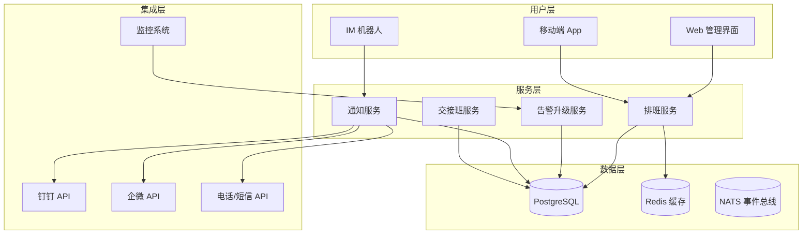
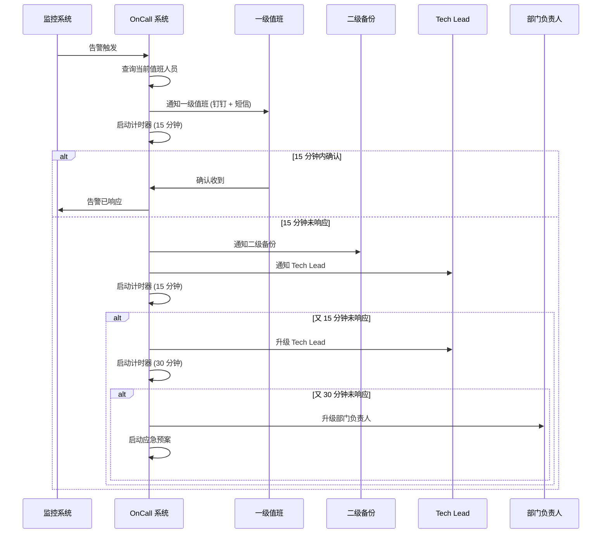
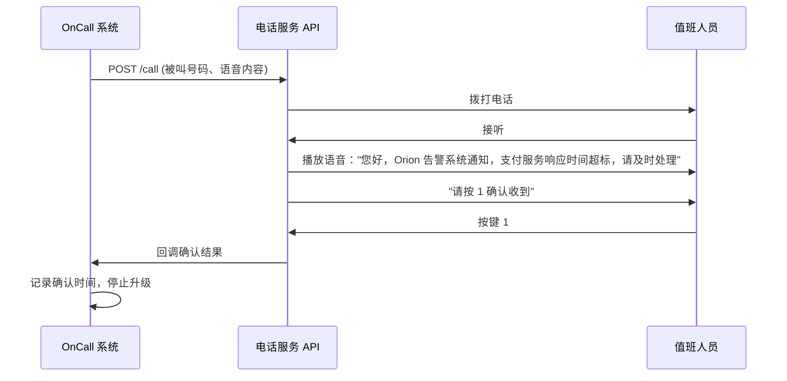
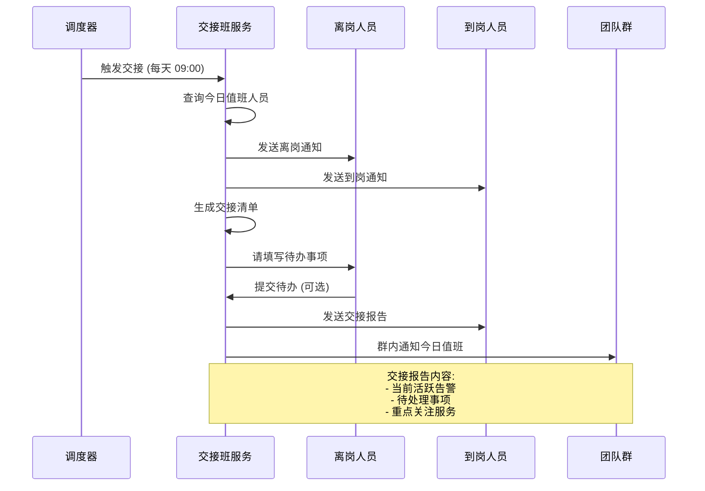

# OnCall 排班系统设计

> 版本：v1.0 | 创建日期：2026-04-11 | 状态：草案

---

## 1. 概述

### 1.1 设计目标

构建完整的 On-Call 排班管理系统，支持轮班、替班、告警升级，确保故障及时响应。

**对应需求**: 
- US-8.4 — 作为 SRE，我想要 On-Call 排班，以便明确值班人员
- US-8.5 — 作为 SRE，我想要告警升级，以便紧急时找到人

### 1.2 核心能力

| 能力 | 说明 | 优先级 |
|------|------|--------|
| 排班管理 | 轮班、替班、节假日 | P0 |
| 告警升级 | 未响应自动升级 | P0 |
| 多渠道通知 | 钉钉/企微/电话/短信 | P0 |
| 交接班 | 自动交接、待办同步 | P1 |
| 统计报表 | 值班时长、响应时间 | P1 |
| 疲劳检测 | 避免过度值班 | P2 |

### 1.3 系统定位

```
┌─────────────────────────────────────────────────────────────────────────┐
│  OnCall 系统在运维体系中的位置                                          │
├─────────────────────────────────────────────────────────────────────────┤
│                                                                         │
│  监控系统 ──→ 告警聚合 ──→ OnCall 系统 ──→ 通知值班人员                   │
│                              │                                          │
│                              ├── 排班管理                               │
│                              ├── 告警升级                               │
│                              ├── 通知渠道                               │
│                              └── 交接班                                 │
│                                                                         │
│  告警响应流程：                                                          │
│  1. 监控检测到异常                                                      │
│  2. 告警聚合 (减少 80% 重复)                                              │
│  3. 查询当前值班人员                                                    │
│  4. 发送通知 (钉钉 + 短信)                                              │
│  5. 15 分钟未响应 → 升级上级                                             │
│  6. 30 分钟未响应 → 升级部门负责人                                       │
│  7. 60 分钟未响应 → 启动应急预案                                         │
│                                                                         │
└─────────────────────────────────────────────────────────────────────────┘
```

---

## 2. OnCall 排班系统架构

### 2.1 架构分层



### 2.2 组件说明

| 组件 | 职责 | 技术选型 |
|------|------|---------|
| 排班服务 | 排班表管理、替班处理 | Go + Echo |
| 告警升级服务 | 升级策略、超时检测 | Go + Cron |
| 通知服务 | 多渠道通知、确认追踪 | Go + 钉钉/企微 API |
| 交接班服务 | 自动交接、待办同步 | Go + NATS |
| 数据存储 | 排班数据、告警记录 | PostgreSQL + Redis |

---

## 3. 排班规则

### 3.1 排班模型

```yaml
# 排班表定义
schedule:
  id: "sre-team-2026-Q2"
  name: "SRE 团队 2026 年 Q2 排班"
  team_id: "sre-team"
  
  # 轮班周期
  rotation:
    type: "weekly"  # daily/weekly/monthly
    start_date: "2026-04-01"
    end_date: "2026-06-30"
  
  # 值班时段
  shift:
    weekday:
      - start: "09:00"
        end: "18:00"
        timezone: "Asia/Shanghai"
    weekend:
      - start: "10:00"
        end: "17:00"
        timezone: "Asia/Shanghai"
  
  # 值班人员顺序
  oncall_order:
    - user_id: "sre-wang"
      name: "王大伟"
      week: 1
    - user_id: "sre-li"
      name: "李强"
      week: 2
    - user_id: "sre-zhang"
      name: "张三"
      week: 3
  
  # 备份人员 (二级升级)
  backup_order:
    - user_id: "sre-lead-liu"
      name: "刘主任"
  
  # 节假日处理
  holiday_policy:
    type: "skip"  # skip/swap
    holidays:
      - date: "2026-05-01"
        name: "劳动节"
      - date: "2026-06-01"
        name: "儿童节"
```

### 3.2 替班规则

```yaml
替班管理:
  替班申请:
    - 申请人选择替班人
    - 选择替班日期
    - 填写替班原因
    - 提交审批 (Tech Lead)
  
  审批流程:
    - 自动检查替班人是否空闲
    - Tech Lead 审批
    - 审批通过 → 更新排班表
    - 通知相关人员
  
  限制条件:
    - 每人每月最多替班 2 次
    - 不能连续替班超过 3 天
    - 替班人必须有相应资质
```

### 3.3 排班 API

```yaml
# 排班管理 API
api:
  base_path: /api/v1/oncall

  endpoints:
    # 排班表
    - GET    /schedules                    # 获取排班列表
    - POST   /schedules                    # 创建排班表
    - GET    /schedules/{id}               # 获取排班详情
    - PUT    /schedules/{id}               # 更新排班表
    - DELETE /schedules/{id}               # 删除排班表
    
    # 当前值班
    - GET    /current                      # 获取当前值班人员
    - GET    /current/backup               # 获取备份人员
    
    # 替班
    - POST   /swap-requests                # 申请替班
    - GET    /swap-requests                # 替班列表
    - POST   /swap-requests/{id}/approve   # 审批替班
    - POST   /swap-requests/{id}/reject    # 拒绝替班
    
    # 日历
    - GET    /calendar                     # 获取值班日历
```

---

## 4. 告警升级策略

### 4.1 升级流程



### 4.2 升级策略配置

```yaml
# 升级策略定义
escalation_policy:
  id: "default-policy"
  name: "默认升级策略"
  
  levels:
    - level: 1
      name: "一级值班"
      notify_after_seconds: 0  # 立即通知
      channels: [dingtalk, sms]
      recipients: [primary_oncall]
      timeout_minutes: 15
    
    - level: 2
      name: "二级备份"
      notify_after_seconds: 900  # 15 分钟后
      channels: [dingtalk, sms, phone]
      recipients: [backup_oncall]
      timeout_minutes: 15
    
    - level: 3
      name: "Tech Lead"
      notify_after_seconds: 1800  # 30 分钟后
      channels: [dingtalk, phone]
      recipients: [tech_lead]
      timeout_minutes: 30
    
    - level: 4
      name: "部门负责人"
      notify_after_seconds: 3600  # 60 分钟后
      channels: [phone]
      recipients: [dept_head]
      timeout_minutes: 60
    
    - level: 5
      name: "应急预案"
      notify_after_seconds: 7200  # 120 分钟后
      channels: [phone]
      recipients: [emergency_team]
      actions:
        - create_incident
        - notify_all_stakeholders
        - start_war_room
  
  # 升级条件
  conditions:
    - severity: P0
      policy: "aggressive"  # 激进升级 (缩短超时)
    - severity: P1
      policy: "default"
    - severity: P2
      policy: "relaxed"  # 宽松升级 (延长超时)
  
  # 免打扰时段
  quiet_hours:
    enabled: false  # P0 告警不受免打扰限制
    start: "22:00"
    end: "08:00"
```

### 4.3 告警确认

```yaml
告警确认:
  确认方式:
    - 钉钉按钮："收到"/"处理中"/"已解决"
    - 短信回复："Y"确认
    - 电话按键：1 确认
    - Web 界面：确认按钮
  
  确认后的动作:
    - 停止升级计时器
    - 更新告警状态为"处理中"
    - 开始处理计时
    - 30 分钟未解决 → 发送提醒
  
  超时未确认:
    - 自动升级到下一级
    - 记录未响应事件
    - 计入值班绩效
```

---

## 5. 通知渠道集成

### 5.1 通知渠道

| 渠道 | 延迟 | 到达率 | 适用场景 |
|------|------|--------|---------|
| **钉钉** | <5 秒 | 95% | 日常通知、非紧急告警 |
| **企微** | <5 秒 | 95% | 日常通知、非紧急告警 |
| **短信** | <30 秒 | 99% | 紧急告警、升级通知 |
| **电话** | <60 秒 | 99.9% | P0 告警、多级升级 |
| **邮件** | <5 分钟 | 90% | 日报、周报、总结 |

### 5.2 钉钉通知模板

```json
{
  "msgtype": "actionCard",
  "actionCard": {
    "title": "🚨 P0 告警：支付服务响应时间超标",
    "text": "## 🚨 P0 告警\n\n**服务**: payment-service\n**告警**: 响应时间 P99 > 500ms\n**当前值**: 850ms\n**阈值**: 500ms\n**开始时间**: 2026-04-11 10:30:00\n**持续时间**: 5 分钟\n\n[查看监控面板](http://grafana/d/xxx)\n[查看 Runbook](http://runbooks/payment-latency)",
    "btnOrientation": "0",
    "btns": [
      {
        "title": "✅ 收到",
        "actionURL": "callback://acknowledge?alert_id=123"
      },
      {
        "title": "🔧 处理中",
        "actionURL": "callback://in_progress?alert_id=123"
      },
      {
        "title": "📞 电话会议",
        "actionURL": "tel:+86-400-xxx-xxxx"
      }
    ]
  }
}
```

### 5.3 电话通知流程



---

## 6. 交接班管理

### 6.1 自动交接流程



### 6.2 交接报告模板

```markdown
## 📋 OnCall 交接报告

**日期**: 2026-04-11
**离岗**: 王大伟
**到岗**: 李强

### 🔴 当前活跃告警 (2)
1. [P1] 订单服务错误率偏高 - 处理中
2. [P2] 缓存命中率下降 - 观察中

### 📝 待处理事项 (3)
1. 跟进订单服务性能优化 PR
2. 今晚 20:00 数据库维护窗口
3. 明天上午 SRE 周会

### ⚠️ 重点关注
- 今晚有促销活动，预计流量增长 50%
- 数据库维护期间可能偶发抖动

---
[查看详细报告](http://oncall/handover/20260411)
```

---

## 7. 统计与报表

### 7.1 统计指标

| 指标 | 说明 | 计算方式 |
|------|------|---------|
| **值班时长** | 每人值班总时长 | 累加值班时段 |
| **响应时间** | 从告警到确认的时间 | 平均值、P95 |
| **解决时间** | 从告警到解决的时间 | 平均值、P95 |
| **升级率** | 需要升级的告警比例 | 升级次数/总告警数 |
| **未响应率** | 超时未响应的告警比例 | 未响应数/总告警数 |
| **疲劳指数** | 值班频率是否过高 | 近 7 天值班天数 |

### 7.2 周报表

```
┌─────────────────────────────────────────────────────────────────────────┐
│  OnCall 周报 · SRE 团队                                                  │
│  周期：2026-04-05 ~ 2026-04-11                                         │
├─────────────────────────────────────────────────────────────────────────┤
│                                                                         │
│  📊 告警统计                                                            │
│  ──────────────────────────────────────────────────────────────────     │
│  • 总告警数：156 次 (↓20% vs 上周)                                       │
│  • P0 告警：2 次                                                         │
│  • P1 告警：15 次                                                        │
│  • P2 告警：139 次                                                       │
│                                                                         │
│  ⏱️ 响应时间                                                            │
│  ──────────────────────────────────────────────────────────────────     │
│  • 平均响应：3.5 分钟 (↓10% vs 上周)                                     │
│  • P95 响应：8.2 分钟                                                    │
│  • 升级率：5% (↓2% vs 上周)                                             │
│                                                                         │
│  👥 值班统计                                                            │
│  ──────────────────────────────────────────────────────────────────     │
│  • 王大伟：5 天，响应 45 次，平均 2.8 分钟                                 │
│  • 李  强：2 天，响应 18 次，平均 3.2 分钟                                 │
│  • 张  三：0 天 (休假)                                                    │
│                                                                         │
│  ⚠️ 异常事件                                                            │
│  ──────────────────────────────────────────────────────────────────     │
│  • 4 月 8 日 03:15 P0 告警，升级至 Tech Lead (值班人员手机静音)            │
│                                                                         │
└─────────────────────────────────────────────────────────────────────────┘
```

---

## 8. 数据库设计

### 8.1 排班表

```sql
CREATE TABLE oncall_schedules (
    id BIGSERIAL PRIMARY KEY,
    team_id VARCHAR(64) NOT NULL,
    name VARCHAR(256) NOT NULL,
    rotation_type VARCHAR(32) NOT NULL,  -- daily/weekly/monthly
    start_date DATE NOT NULL,
    end_date DATE NOT NULL,
    created_by VARCHAR(64),
    created_at TIMESTAMP DEFAULT CURRENT_TIMESTAMP
);

CREATE TABLE oncall_shifts (
    id BIGSERIAL PRIMARY KEY,
    schedule_id BIGINT REFERENCES oncall_schedules(id),
    user_id VARCHAR(64) NOT NULL,
    start_time TIMESTAMP NOT NULL,
    end_time TIMESTAMP NOT NULL,
    shift_type VARCHAR(32) DEFAULT 'regular',  -- regular/backup/holiday
    is_swap BOOLEAN DEFAULT false,
    swapped_from BIGINT,  -- 原值班人
    created_at TIMESTAMP DEFAULT CURRENT_TIMESTAMP
);

CREATE INDEX idx_oncall_shifts_user_time ON oncall_shifts(user_id, start_time, end_time);
```

### 8.2 告警升级记录

```sql
CREATE TABLE alert_escalations (
    id BIGSERIAL PRIMARY KEY,
    alert_id VARCHAR(64) NOT NULL,
    level INT NOT NULL,
    recipient VARCHAR(64) NOT NULL,
    channel VARCHAR(32) NOT NULL,
    sent_at TIMESTAMP DEFAULT CURRENT_TIMESTAMP,
    acknowledged_at TIMESTAMP,
    acknowledged_by VARCHAR(64),
    escalated_at TIMESTAMP,
    status VARCHAR(32) DEFAULT 'pending'  -- pending/acknowledged/escalated
);

CREATE INDEX idx_alert_escalations_alert ON alert_escalations(alert_id, status);
CREATE INDEX idx_alert_escalations_time ON alert_escalations(sent_at);
```

---

## 9. 实施计划

| Phase | 时间 | 任务 | 产出 |
|-------|------|------|------|
| **Phase 1** | 1 周 | 排班管理、替班功能 | 排班系统 MVP |
| **Phase 2** | 1 周 | 告警升级、通知集成 | 升级策略引擎 |
| **Phase 3** | 3 天 | 交接班、统计报表 | 交接自动化 |
| **Phase 4** | 2 天 | 疲劳检测、优化 | 体验优化 |

---

_OnCall 排班系统确保每个告警都能及时响应，每个值班人员都清晰明确。_
