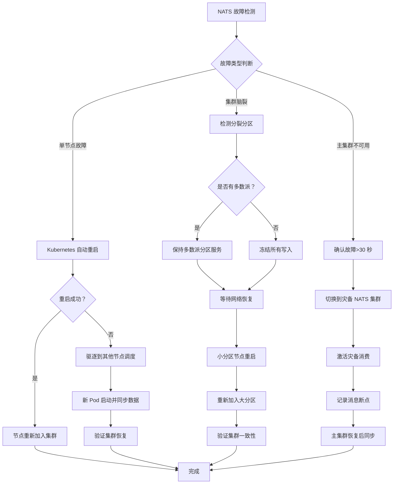
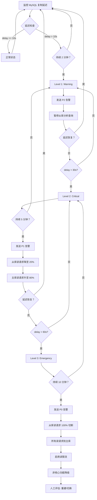
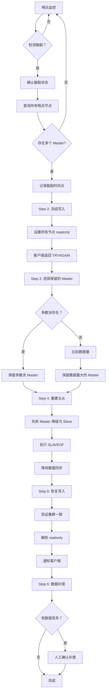
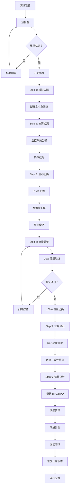
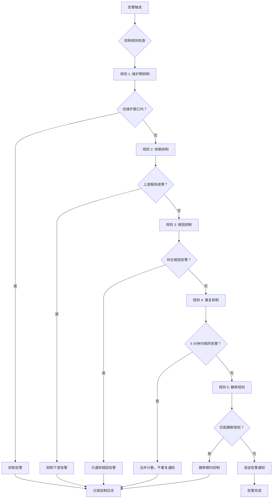
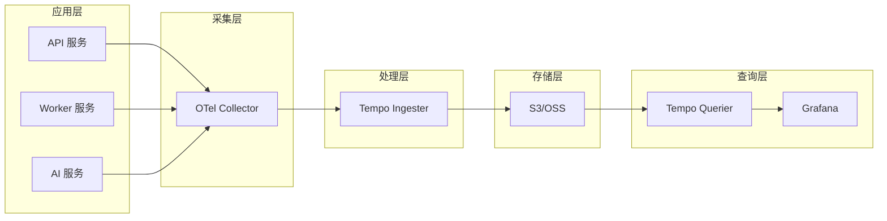

# Orion SRE 运维加固设计

> 版本：v1.0  
> 创建日期：2026-04-10  
> 负责人：SRE 团队  
> 优先级：P0  
> 状态：设计完成  
> 背景：SRE 评审发现 5 个 P0 缺陷需修复

---

## 一、缺陷概述与修复目标

### 1.1 SRE 评审发现的 P0 缺陷

| 缺陷编号 | 缺陷描述 | 风险等级 | 影响范围 |
|---------|---------|---------|---------|
| DEFECT-001 | NATS 故障切换无 runbook | P0 | 事件总线中断，全系统解耦失效 |
| DEFECT-002 | MySQL 主从延迟无降级 | P0 | 数据不一致，读写分离失效 |
| DEFECT-003 | Redis 脑裂无处理 | P0 | 缓存数据不一致，会话丢失 |
| DEFECT-004 | ClickHouse 备份空白 | P0 | 成本/日志数据永久丢失风险 |
| DEFECT-005 | DR 演练缺失 | P0 | 真实故障时无法有效切换 |

### 1.2 修复目标

```
┌─────────────────────────────────────────────────────────────────┐
│              SRE 运维加固目标                                    │
├─────────────────────────────────────────────────────────────────┤
│                                                                 │
│  可用性目标：                                                   │
│  • NATS 集群可用性：99.99% (年度宕机 < 53 分钟)                   │
│  • MySQL 主从延迟：< 10s (P99), < 30s (P100)                    │
│  • Redis 集群可用性：99.99%                                     │
│  • ClickHouse 备份成功率：100% (每日验证)                        │
│  • DR 切换 RTO：< 30 分钟，RPO: < 5 分钟                          │
│                                                                 │
│  运维目标：                                                     │
│  • 所有核心组件有明确 runbook                                   │
│  • 故障切换自动化率 > 80%                                       │
│  • 告警风暴抑制率 > 70%                                         │
│  • 月度 DR 演练执行率 100%                                       │
│                                                                 │
└─────────────────────────────────────────────────────────────────┘
```

---

## 二、NATS 故障切换 Runbook

### 2.1 NATS 集群架构

```
┌─────────────────────────────────────────────────────────────────┐
│              NATS 集群架构                                       │
├─────────────────────────────────────────────────────────────────┤
│                                                                 │
│  ┌─────────────────────────────────────────────────────────┐   │
│  │                  NATS Cluster (3 节点)                     │   │
│  │  ┌─────────┐    ┌─────────┐    ┌─────────┐             │   │
│  │  │ nats-0  │◄──►│ nats-1  │◄──►│ nats-2  │             │   │
│  │  │ (Seed)  │    │         │    │         │             │   │
│  │  │ Leader* │    │ Peer    │    │ Peer    │             │   │
│  │  └────┬────┘    └────┬────┘    └────┬────┘             │   │
│  │       │              │              │                   │   │
│  │       └──────────────┴──────────────┘                   │   │
│  │                    RAFT 共识                              │   │
│  └─────────────────────────────────────────────────────────┘   │
│                           │                                     │
│         ┌─────────────────┼─────────────────┐                   │
│         │                 │                 │                   │
│         ▼                 ▼                 ▼                   │
│  ┌─────────────┐   ┌─────────────┐   ┌─────────────┐          │
│  │ orion-api   │   │ orion-worker│   │ 其他服务     │          │
│  │ (JetStream) │   │ (JetStream) │   │ (JetStream) │          │
│  └─────────────┘   └─────────────┘   └─────────────┘          │
│                                                                 │
│  JetStream 配置：                                               │
│  • 存储类型：File (持久化)                                     │
│  • 副本数：3 (跨节点复制)                                       │
│  • 保留策略：Limits (最大 10GB/Stream)                          │
│                                                                 │
└─────────────────────────────────────────────────────────────────┘
```

### 2.2 NATS 故障场景与切换流程

```
┌─────────────────────────────────────────────────────────────────┐
│              NATS 故障切换流程                                   │
├─────────────────────────────────────────────────────────────────┤
│                                                                 │
│  场景 1: 单节点故障                                              │
│  ┌─────────────────────────────────────────────────────────┐   │
│  │                                                         │   │
│  │  检测：                                                  │   │
│  │  • Pod 状态：NotReady / CrashLoopBackOff                 │   │
│  │  • 健康检查：连续 3 次失败                                 │   │
│  │  • 集群状态：RAFT 节点数 < 3                              │   │
│  │                                                         │   │
│  │  自动处理：                                              │   │
│  │  Step 1: Kubernetes 自动重启故障 Pod                      │   │
│  │  Step 2: 若重启失败，驱逐到其他节点重新调度                │   │
│  │  Step 3: 新 Pod 加入集群，自动数据同步                     │   │
│  │  Step 4: 验证集群副本数恢复 = 3                          │   │
│  │                                                         │   │
│  │  人工介入条件：                                          │   │
│  │  • 自动恢复失败 > 10 分钟                                 │   │
│  │  • 数据同步异常                                          │   │
│  │                                                         │   │
│  └─────────────────────────────────────────────────────────┘   │
│                          │                                      │
│                          ▼                                      │
│  场景 2: 集群脑裂 (Network Partition)                            │
│  ┌─────────────────────────────────────────────────────────┐   │
│  │                                                         │   │
│  │  检测：                                                  │   │
│  │  • 集群分裂：检测到 2 个独立 quorum                         │   │
│  │  • 客户端报告：连接不同节点返回不同数据                    │   │
│  │  • 监控告警：nats_cluster_members != 3                   │   │
│  │                                                         │   │
│  │  处理流程：                                              │   │
│  │  Step 1: 确认脑裂 (检查各节点视图)                         │   │
│  │  Step 2: 隔离小分区 (阻断跨分区网络)                       │   │
│  │  Step 3: 等待网络恢复 (通常 < 60 秒)                        │   │
│  │  Step 4: 小分区节点重启，重新加入大分区                    │   │
│  │  Step 5: 验证集群一致性                                   │   │
│  │                                                         │   │
│  └─────────────────────────────────────────────────────────┘   │
│                          │                                      │
│                          ▼                                      │
│  场景 3: 主集群完全不可用                                        │
│  ┌─────────────────────────────────────────────────────────┐   │
│  │                                                         │   │
│  │  检测：                                                  │   │
│  │  • 所有 3 节点不可达                                       │   │
│  │  • 客户端连接失败率 100%                                  │   │
│  │  • 消息积压告警                                           │   │
│  │                                                         │   │
│  │  切换流程：                                              │   │
│  │  Step 1: 确认主集群不可用 (>30 秒)                         │   │
│  │  Step 2: 切换客户端连接到灾备 NATS 集群                     │   │
│  │  Step 3: 激活灾备集群消费                                 │   │
│  │  Step 4: 通知研发检查消息积压                             │   │
│  │  Step 5: 主集群恢复后，同步积压消息                        │   │
│  │                                                         │   │
│  └─────────────────────────────────────────────────────────┘   │
│                                                                 │
└─────────────────────────────────────────────────────────────────┘
```

### 2.3 NATS 故障切换 Mermaid 流程图



### 2.4 NATS 健康检查命令

| 检查项 | 命令 | 预期结果 |
|--------|------|---------|
| Pod 状态 | `kubectl get pods -l app=nats` | 3/3 Running |
| 集群成员 | `nats-server-health` | 3 members |
| JetStream | `nats stream ls` | 列出所有 Stream |
| 连接测试 | `nats pub test "hello"` | 成功发布 |
| 延迟检查 | `nats latency` | < 50ms |

---

## 三、MySQL 主从延迟分级降级

### 3.1 MySQL 主从架构

```
┌─────────────────────────────────────────────────────────────────┐
│              MySQL 主从架构                                      │
├─────────────────────────────────────────────────────────────────┤
│                                                                 │
│  ┌─────────────────────────────────────────────────────────┐   │
│  │                   主库 (Primary)                          │   │
│  │  • 处理所有写操作                                        │   │
│  │  • 处理 50% 读操作                                        │   │
│  │  • Binlog 实时生成                                       │   │
│  └─────────────────────┬───────────────────────────────────┘   │
│                        │ Binlog 异步复制                        │
│         ┌──────────────┴──────────────┐                        │
│         │                             │                        │
│         ▼                             ▼                        │
│  ┌─────────────┐               ┌─────────────┐                │
│  │  从库 1      │               │  从库 2      │                │
│  │  (读负载)   │               │  (热备)     │                │
│  │  50% 读操作  │               │  灾备       │                │
│  └─────────────┘               └─────────────┘                │
│                                                                 │
│  复制延迟监控：                                                 │
│  • 指标：Seconds_Behind_Master                                 │
│  • 采集频率：每 5 秒                                             │
│  • 告警阈值：10s / 30s / 60s 三级                              │
│                                                                 │
└─────────────────────────────────────────────────────────────────┘
```

### 3.2 主从延迟分级降级策略

```
┌─────────────────────────────────────────────────────────────────┐
│              MySQL 主从延迟分级降级策略                          │
├─────────────────────────────────────────────────────────────────┤
│                                                                 │
│  ┌─────────────────────────────────────────────────────────┐   │
│  │  Level 1: 延迟 > 10 秒 (Warning)                          │   │
│  ├─────────────────────────────────────────────────────────┤   │
│  │                                                         │   │
│  │  触发条件：                                              │   │
│  │  • Seconds_Behind_Master > 10s 持续 2 分钟                │   │
│  │                                                         │   │
│  │  告警动作：                                              │   │
│  │  • 发送 P2 告警给 DBA                                     │   │
│  │  • 记录延迟趋势到监控图表                                 │   │
│  │                                                         │   │
│  │  自动处理：                                              │   │
│  │  • 暂停从库上的分析查询                                  │   │
│  │  • 降低从库复制线程优先级 (slave_parallel_workers 调整)   │   │
│  │                                                         │   │
│  │  读请求路由：                                            │   │
│  │  • 保持不变 (主库 50%, 从库 50%)                           │   │
│  │                                                         │   │
│  └─────────────────────────────────────────────────────────┘   │
│                          │                                      │
│                          ▼                                      │
│  ┌─────────────────────────────────────────────────────────┐   │
│  │  Level 2: 延迟 > 30 秒 (Critical)                         │   │
│  ├─────────────────────────────────────────────────────────┤   │
│  │                                                         │   │
│  │  触发条件：                                              │   │
│  │  • Seconds_Behind_Master > 30s 持续 5 分钟                │   │
│  │                                                         │   │
│  │  告警动作：                                              │   │
│  │  • 发送 P1 告警给 DBA + SRE                               │   │
│  │  • 通知应用团队                                           │   │
│  │                                                         │   │
│  │  自动处理：                                              │   │
│  │  • 从库读请求占比降至 20%                                 │   │
│  │  • 主库读请求占比升至 80%                                 │   │
│  │  • 暂停非关键同步任务                                     │   │
│  │                                                         │   │
│  │  读请求路由：                                            │   │
│  │  • 强一致性读：路由到主库                                 │   │
│  │  • 最终一致性读：仍可到从库 (带警告)                       │   │
│  │                                                         │   │
│  └─────────────────────────────────────────────────────────┘   │
│                          │                                      │
│                          ▼                                      │
│  ┌─────────────────────────────────────────────────────────┐   │
│  │  Level 3: 延迟 > 60 秒 (Emergency)                        │   │
│  ├─────────────────────────────────────────────────────────┤   │
│  │                                                         │   │
│  │  触发条件：                                              │   │
│  │  • Seconds_Behind_Master > 60s 持续 10 分钟               │   │
│  │                                                         │   │
│  │  告警动作：                                              │   │
│  │  • 发送 P0 告警给 DBA + SRE + 技术负责人                   │   │
│  │  • 启动应急预案                                           │   │
│  │                                                         │   │
│  │  自动处理：                                              │   │
│  │  • 从库读请求 100% 切断                                   │   │
│  │  • 所有读请求路由到主库                                   │   │
│  │  • 启用读限流保护主库                                     │   │
│  │  • 非核心功能降级 (报表/分析暂停)                          │   │
│  │                                                         │   │
│  │  人工决策：                                              │   │
│  │  • 评估是否需要从库重建                                   │   │
│  │  • 评估是否需要切换主库                                   │   │
│  │                                                         │   │
│  └─────────────────────────────────────────────────────────┘   │
│                                                                 │
└─────────────────────────────────────────────────────────────────┘
```

### 3.3 MySQL 延迟降级 Mermaid 流程图



### 3.4 读请求路由配置

| 延迟级别 | 主库读比例 | 从库读比例 | 强一致性读路由 | 限流阈值 |
|---------|-----------|-----------|--------------|---------|
| 正常 (<10s) | 50% | 50% | 主库 | 1000 QPS |
| Level 1 (>10s) | 50% | 50% | 主库 | 1000 QPS |
| Level 2 (>30s) | 80% | 20% | 主库 | 800 QPS |
| Level 3 (>60s) | 100% | 0% | 主库 | 500 QPS |

---

## 四、Redis 哨兵脑裂检测与恢复

### 4.1 Redis 哨兵架构

```
┌─────────────────────────────────────────────────────────────────┐
│              Redis 哨兵高可用架构                                │
├─────────────────────────────────────────────────────────────────┤
│                                                                 │
│  ┌─────────────────────────────────────────────────────────┐   │
│  │              Redis Sentinel Cluster (3 节点)               │   │
│  │  ┌─────────┐    ┌─────────┐    ┌─────────┐             │   │
│  │  │sentinel-0│   │sentinel-1│   │sentinel-2│             │   │
│  │  │         │    │         │    │         │             │   │
│  │  └────┬────┘    └────┬────┘    └────┬────┘             │   │
│  │       │              │              │                   │   │
│  │       └──────────────┼──────────────┘                   │   │
│  │                      │                                  │   │
│  │               Quorum = 2 (多数派决策)                    │   │
│  └──────────────────────┼──────────────────────────────────┘   │
│                         │                                       │
│         ┌───────────────┴───────────────┐                       │
│         │                               │                       │
│         ▼                               ▼                       │
│  ┌─────────────┐                 ┌─────────────┐               │
│  │ redis-master│                 │ redis-slave │               │
│  │ (主节点)    │◄──────复制──────►│ (从节点)    │               │
│  └─────────────┘                 └─────────────┘               │
│                                                                 │
│  脑裂场景：                                                     │
│  • 网络分区导致哨兵分裂成两个独立组                             │
│  • 两组都选举出自己的 master                                    │
│  • 客户端可能连接到不同的 master                                │
│                                                                 │
└─────────────────────────────────────────────────────────────────┘
```

### 4.2 Redis 脑裂检测机制

```
┌─────────────────────────────────────────────────────────────────┐
│              Redis 哨兵脑裂检测与恢复                            │
├─────────────────────────────────────────────────────────────────┤
│                                                                 │
│  脑裂检测条件 (满足任一即触发)                                   │
│  ┌─────────────────────────────────────────────────────────┐   │
│  │                                                         │   │
│  │  条件 1: 多 Master 检测                                   │   │
│  │  • 检测到 2 个不同的 master 地址                            │   │
│  │  • 两个 master 都可写                                     │   │
│  │  • 数据开始 diverge                                      │   │
│  │                                                         │   │
│  │  条件 2: 哨兵投票异常                                     │   │
│  │  • 同一 epoch 内收到多个 master 选举请求                    │   │
│  │  • 无法形成多数派 quorum                                  │   │
│  │                                                         │   │
│  │  条件 3: 客户端报告不一致                                  │   │
│  │  • 不同客户端连接到不同 master                            │   │
│  │  • 写入数据无法在另一 master 查询到                        │   │
│  │                                                         │   │
│  └─────────────────────────────────────────────────────────┘   │
│                          │                                      │
│                          ▼                                      │
│  脑裂恢复流程                                                    │
│  ┌─────────────────────────────────────────────────────────┐   │
│  │                                                         │   │
│  │  Step 1: 确认脑裂状态                                     │   │
│  │  • 查询所有哨兵节点的 master 信息                          │   │
│  │  • 验证是否存在多个 master                               │   │
│  │  • 记录脑裂时间点和影响范围                              │   │
│  │                                                         │   │
│  │  Step 2: 冻结写入 (防止数据 diverge 扩大)                  │   │
│  │  • 通过哨兵发送 CLUSTER SET-CONFIG-EPOCH 命令             │   │
│  │  • 临时将所有节点设为 readonly                            │   │
│  │  • 客户端写入返回 TRYAGAIN 错误                            │   │
│  │                                                         │   │
│  │  Step 3: 选择保留的 Master                                │   │
│  │  • 优先保留多数派哨兵认可的 master                        │   │
│  │  • 若票数相同，保留数据量更大的 master                     │   │
│  │  • 记录将被丢弃的 master 数据                              │   │
│  │                                                         │   │
│  │  Step 4: 重新建立主从关系                                 │   │
│  │  • 失败的 master 降级为 slave                             │   │
│  │  • 执行 SLAVEOF 指向保留的 master                          │   │
│  │  • 等待数据同步完成                                       │   │
│  │                                                         │   │
│  │  Step 5: 恢复写入                                         │   │
│  │  • 验证集群状态一致                                       │   │
│  │  • 解除 readonly 限制                                     │   │
│  │  • 通知客户端恢复写入                                     │   │
│  │                                                         │   │
│  │  Step 6: 数据补偿 (如有必要)                               │   │
│  │  • 对比脑裂期间的数据差异                                 │   │
│  │  • 人工确认需要保留的数据                                 │   │
│  │  • 手动补偿丢失的写入                                     │   │
│  │                                                         │   │
│  └─────────────────────────────────────────────────────────┘   │
│                                                                 │
└─────────────────────────────────────────────────────────────────┘
```

### 4.3 Redis 脑裂恢复 Mermaid 流程图



### 4.4 Redis 哨兵配置参数

| 参数 | 推荐值 | 说明 |
|------|--------|------|
| `sentinel quorum` | 2 | 多数派票数 |
| `sentinel down-after-milliseconds` | 5000 | 故障检测时间 |
| `sentinel failover-timeout` | 60000 | 切换超时 |
| `sentinel parallel-syncs` | 1 | 并行同步数 |
| `cluster-node-timeout` | 5000 | 节点超时 |
| `cluster-require-full-coverage` | no | 部分可用 |

---

## 五、ClickHouse 备份方案

### 5.1 ClickHouse 备份架构

```
┌─────────────────────────────────────────────────────────────────┐
│              ClickHouse 备份架构                                 │
├─────────────────────────────────────────────────────────────────┤
│                                                                 │
│  ┌─────────────────────────────────────────────────────────┐   │
│  │              ClickHouse Cluster (3 节点)                   │   │
│  │  ┌─────────┐    ┌─────────┐    ┌─────────┐             │   │
│  │  │ click-0 │    │ click-1 │    │ click-2 │             │   │
│  │  │ (Shard1)│    │ (Shard2)│    │ (Shard3)│             │   │
│  │  └────┬────┘    └────┬────┘    └────┬────┘             │   │
│  │       │              │              │                   │   │
│  │       └──────────────┼──────────────┘                   │   │
│  │                      │                                  │   │
│  │               数据分片存储                                 │   │
│  └──────────────────────┼──────────────────────────────────┘   │
│                         │                                       │
│                         ▼                                       │
│  ┌─────────────────────────────────────────────────────────┐   │
│  │           clickhouse-backup 工具 (Sidecar)                │   │
│  │  ┌─────────────────────────────────────────────────┐     │   │
│  │  │  • 基于 hardlink 的增量备份                       │     │   │
│  │  │  • 支持压缩和加密                                 │     │   │
│  │  │  • 上传到 S3/OSS 对象存储                         │     │   │
│  │  │  • 支持 PITR 恢复                                 │     │   │
│  │  └─────────────────────────────────────────────────┘     │   │
│  └─────────────────────────────────────────────────────────┘   │
│                         │                                       │
│                         ▼                                       │
│  ┌─────────────────────────────────────────────────────────┐   │
│  │              S3 对象存储 (备份目标)                        │   │
│  │  • Bucket: orion-clickhouse-backup                      │   │
│  │  • 生命周期：30 天标准存储 → 90 天低频 → 365 天归档          │   │
│  │  • 跨区域复制：上海机房 (异地容灾)                          │   │
│  │  • 版本控制：启用                                        │   │
│  └─────────────────────────────────────────────────────────┘   │
│                                                                 │
└─────────────────────────────────────────────────────────────────┘
```

### 5.2 ClickHouse 备份策略

```
┌─────────────────────────────────────────────────────────────────┐
│              ClickHouse 备份策略                                 │
├─────────────────────────────────────────────────────────────────┤
│                                                                 │
│  备份类型与频率                                                  │
│  ┌─────────────────────────────────────────────────────────┐   │
│  │                                                         │   │
│  │  全量备份：                                              │   │
│  │  • 频率：每周日 02:00                                    │   │
│  │  • 保留：4 份 (约 1 个月)                                  │   │
│  │  • 工具：clickhouse-backup create full                   │   │
│  │  • 存储：S3 标准存储                                      │   │
│  │                                                         │   │
│  │  增量备份：                                              │   │
│  │  • 频率：每日 02:00 (周一到周六)                           │   │
│  │  • 保留：7 份                                             │   │
│  │  • 工具：clickhouse-backup create incremental            │   │
│  │  • 存储：S3 标准存储                                      │   │
│  │                                                         │   │
│  │  Partition 备份：                                         │   │
│  │  • 频率：每小时                                          │   │
│  │  • 保留：24 份 (1 天)                                      │   │
│  │  • 工具：clickhouse-backup create partition              │   │
│  │  • 存储：本地 SSD (快速恢复)                               │   │
│  │                                                         │   │
│  │  Schema 备份：                                            │   │
│  │  • 频率：每次 DDL 变更后                                   │   │
│  │  • 保留：永久 (Git 版本控制)                               │   │
│  │  • 工具：clickhouse-backup create schema                 │   │
│  │  • 存储：Git 仓库                                         │   │
│  │                                                         │   │
│  └─────────────────────────────────────────────────────────┘   │
│                          │                                      │
│                          ▼                                      │
│  备份验证流程                                                    │
│  ┌─────────────────────────────────────────────────────────┐   │
│  │                                                         │   │
│  │  日常验证：                                              │   │
│  │  • 检查备份任务状态 (成功/失败)                           │   │
│  │  • 验证备份文件大小 (与历史对比)                          │   │
│  │  • Checksum 完整性校验                                   │   │
│  │                                                         │   │
│  │  周验证：                                                │   │
│  │  • 随机抽取 1 个备份进行恢复测试                           │   │
│  │  • 验证恢复后数据一致性                                   │   │
│  │  • 记录恢复时间 (RTO 评估)                                 │   │
│  │                                                         │   │
│  │  月验证：                                                │   │
│  │  • 完整 DR 演练 (在灾备环境恢复)                            │   │
│  │  • 验证跨区域备份可用性                                   │   │
│  │  • 输出演练报告和改进计划                                 │   │
│  │                                                         │   │
│  └─────────────────────────────────────────────────────────┘   │
│                                                                 │
└─────────────────────────────────────────────────────────────────┘
```

### 5.3 clickhouse-backup 配置

| 配置项 | 推荐值 | 说明 |
|--------|--------|------|
| `BACKUP_NAME` | `{table}_{timestamp}` | 备份命名格式 |
| `REMOTE_STORAGE` | s3 | 存储类型 |
| `S3_BUCKET` | orion-clickhouse-backup | 桶名 |
| `S3_PATH` | backups/{shard}/ | 路径 |
| `COMPRESSION_FORMAT` | lz4 | 压缩格式 |
| `ENCRYPTION` | aes-256 | 加密方式 |
| `RETENTION_FULL` | 4 | 全量备份保留数 |
| `RETENTION_INCREMENTAL` | 7 | 增量备份保留数 |
| `RETENTION_HOURLY` | 24 | 小时备份保留数 |

### 5.4 ClickHouse 恢复流程

```
┌─────────────────────────────────────────────────────────────────┐
│              ClickHouse 恢复流程                                 │
├─────────────────────────────────────────────────────────────────┤
│                                                                 │
│  场景 1: 单表恢复                                                │
│  ┌─────────────────────────────────────────────────────────┐   │
│  │  Step 1: 列出可用备份                                     │   │
│  │         clickhouse-backup list remote                    │   │
│  │                                                         │   │
│  │  Step 2: 下载备份                                         │   │
│  │         clickhouse-backup pull {backup_name}             │   │
│  │                                                         │   │
│  │  Step 3: 恢复表数据                                       │   │
│  │         clickhouse-backup restore {backup_name}          │   │
│  │                         --tables {database}.{table}      │   │
│  │                                                         │   │
│  │  Step 4: 验证数据完整性                                   │   │
│  │         SELECT count() FROM {table}                      │   │
│  │                                                         │   │
│  └─────────────────────────────────────────────────────────┘   │
│                          │                                      │
│                          ▼                                      │
│  场景 2: 整库恢复                                                │
│  ┌─────────────────────────────────────────────────────────┐   │
│  │  Step 1: 创建空数据库                                     │   │
│  │         CREATE DATABASE {database}                       │   │
│  │                                                         │   │
│  │  Step 2: 恢复 Schema                                      │   │
│  │         clickhouse-backup restore schema {backup_name}   │   │
│  │                         --database {database}            │   │
│  │                                                         │   │
│  │  Step 3: 恢复数据                                         │   │
│  │         clickhouse-backup restore {backup_name}          │   │
│  │                         --database {database}            │   │
│  │                                                         │   │
│  │  Step 4: 验证数据一致性                                   │   │
│  │         对比源表和目标表的 count()                        │   │
│  │                                                         │   │
│  └─────────────────────────────────────────────────────────┘   │
│                          │                                      │
│                          ▼                                      │
│  场景 3: PITR 恢复 (时间点恢复)                                   │
│  ┌─────────────────────────────────────────────────────────┐   │
│  │  Step 1: 找到目标时间点前的最近备份                        │   │
│  │         clickhouse-backup list remote | grep {timestamp} │   │   │
│  │                                                         │   │
│  │  Step 2: 恢复该备份                                       │   │
│  │         clickhouse-backup restore {backup_name}          │   │
│  │                                                         │   │
│  │  Step 3: 应用 Binlog/WAL 到目标时间点                       │   │
│  │         (如有需要，手动回放变更)                           │   │
│  │                                                         │   │
│  │  Step 4: 验证数据状态                                     │   │
│  │                                                         │   │
│  └─────────────────────────────────────────────────────────┘   │
│                                                                 │
└─────────────────────────────────────────────────────────────────┘
```

---

## 六、DR 切换演练计划

### 6.1 DR 演练目标与范围

```
┌─────────────────────────────────────────────────────────────────┐
│              DR 切换演练计划                                     │
├─────────────────────────────────────────────────────────────────┤
│                                                                 │
│  演练目标：                                                     │
│  ┌─────────────────────────────────────────────────────────┐   │
│  │                                                         │   │
│  │  • 验证灾备架构有效性                                     │   │
│  │  • 熟悉切换流程和工具                                     │   │
│  │  • 测量实际 RTO/RPO                                       │   │
│  │  • 发现并修复流程缺陷                                     │   │
│  │  • 满足合规要求 (年度至少 4 次完整演练)                      │   │
│  │                                                         │   │
│  └─────────────────────────────────────────────────────────┘   │
│                                                                 │
│  演练范围：                                                     │
│  ┌─────────────────────────────────────────────────────────┐   │
│  │                                                         │   │
│  │  核心服务：                                              │   │
│  │  • Orion API 服务                                        │   │
│  │  • Tekton Pipeline 引擎                                  │   │
│  │  • ArgoCD GitOps                                         │   │
│  │                                                         │   │
│  │  数据层：                                                │   │
│  │  • MySQL 主从切换                                         │   │
│  │  • Redis 哨兵切换                                         │   │
│  │  • NATS 集群切换                                          │   │
│  │  • ClickHouse 数据恢复                                    │   │
│  │                                                         │   │
│  │  存储层：                                                │   │
│  │  • 对象存储跨区域访问                                     │   │
│  │  • 配置文件 Git 同步                                      │   │
│  │                                                         │   │
│  └─────────────────────────────────────────────────────────┘   │
│                                                                 │
└─────────────────────────────────────────────────────────────────┘
```

### 6.2 DR 演练频率与类型

```
┌─────────────────────────────────────────────────────────────────┐
│              DR 演练频率与类型                                   │
├─────────────────────────────────────────────────────────────────┤
│                                                                 │
│  ┌─────────────────────────────────────────────────────────┐   │
│  │  月度演练 (Light Drill)                                   │   │
│  ├─────────────────────────────────────────────────────────┤   │
│  │                                                         │   │
│  │  时间：每月最后一个周五 10:00-12:00                       │   │
│  │  时长：2 小时                                             │   │
│  │  参与：SRE 团队 + DBA                                     │   │
│  │                                                         │   │
│  │  演练内容：                                              │   │
│  │  • 单组件切换测试 (轮流覆盖)                               │   │
│  │    - Month 1: MySQL 主从切换                              │   │
│  │    - Month 2: Redis 哨兵切换                              │   │
│  │    - Month 3: NATS 集群切换                               │   │
│  │    - Month 4: ClickHouse 恢复                            │   │
│  │  • 备份恢复验证                                          │   │
│  │  • 监控告警测试                                          │   │
│  │                                                         │   │
│  │  成功标准：                                              │   │
│  │  • 切换时间 < 目标 RTO                                    │   │
│  │  • 数据损失 < 目标 RPO                                    │   │
│  │  • 服务验证通过                                          │   │
│  │                                                         │   │
│  └─────────────────────────────────────────────────────────┘   │
│                          │                                      │
│                          ▼                                      │
│  ┌─────────────────────────────────────────────────────────┐   │
│  │  季度演练 (Full DR Drill)                                 │   │
│  ├─────────────────────────────────────────────────────────┤   │
│  │                                                         │   │
│  │  时间：每季度最后一个月 14:00-18:00                       │   │
│  │  时长：4 小时                                             │   │
│  │  参与：SRE + DBA + 开发 + 测试+业务代表                    │   │
│  │                                                         │   │
│  │  演练内容：                                              │   │
│  │  • 机房级故障模拟 (北京→上海切换)                          │   │
│  │  • 全组件联合切换                                        │   │
│  │  • 业务功能验证                                          │   │
│  │  • 回切测试 (上海→北京)                                   │   │
│  │                                                         │   │
│  │  成功标准：                                              │   │
│  │  • 整体 RTO < 30 分钟                                     │   │
│  │  • 整体 RPO < 5 分钟                                      │   │
│  │  • 核心业务功能 100% 验证通过                              │   │
│  │  • 用户无明显感知                                        │   │
│  │                                                         │   │
│  └─────────────────────────────────────────────────────────┘   │
│                          │                                      │
│                          ▼                                      │
│  ┌─────────────────────────────────────────────────────────┐   │
│  │  年度演练 (Compliance Drill)                              │   │
│  ├─────────────────────────────────────────────────────────┤   │
│  │                                                         │   │
│  │  时间：每年 11 月                                         │   │
│  │  时长：1 天                                               │   │
│  │  参与：全员 + 外部审计                                    │   │
│  │                                                         │   │
│  │  演练内容：                                              │   │
│  │  • 真实流量切换 (10% 生产流量)                             │   │
│  │  • 第三方依赖故障模拟                                    │   │
│  │  • 安全事件应急响应                                     │   │
│  │  • 合规审计检查                                          │   │
│  │                                                         │   │
│  │  成功标准：                                              │   │
│  │  • 通过外部审计认证                                     │   │
│  │  • 满足监管要求                                          │   │
│  │  • 无重大流程缺陷                                        │   │
│  │                                                         │   │
│  └─────────────────────────────────────────────────────────┘   │
│                                                                 │
└─────────────────────────────────────────────────────────────────┘
```

### 6.3 DR 演练 Mermaid 流程图



### 6.4 DR 演练检查清单

| 阶段 | 检查项 | 负责人 | 状态 |
|------|--------|--------|------|
| **演练前** | 备份完整性验证 | DBA | ☐ |
| | 灾备环境健康检查 | SRE | ☐ |
| | 通知相关人员 | PM | ☐ |
| | 准备监控仪表板 | SRE | ☐ |
| **演练中** | 故障模拟执行 | SRE | ☐ |
| | 切换命令执行 | DBA | ☐ |
| | 业务功能验证 | 测试 | ☐ |
| | RTO/RPO 记录 | SRE | ☐ |
| **演练后** | 回切执行 | SRE | ☐ |
| | 问题复盘会议 | 全体 | ☐ |
| | 改进计划制定 | SRE | ☐ |
| | 文档更新 | SRE | ☐ |

---

## 七、告警抑制规则设计

### 7.1 告警风暴场景分析

```
┌─────────────────────────────────────────────────────────────────┐
│              告警风暴场景分析                                    │
├─────────────────────────────────────────────────────────────────┤
│                                                                 │
│  典型告警风暴场景                                                │
│  ┌─────────────────────────────────────────────────────────┐   │
│  │                                                         │   │
│  │  场景 1: 节点故障连锁反应                                  │   │
│  │  ────────────────────────────────────────────────────   │   │
│  │  根因：Node-01 宕机                                       │   │
│  │  衍生告警：                                               │   │
│  │  • NodeNotReady × 1 (根因)                               │   │
│  │  • PodNotReady × 20 (该节点上的 Pod)                      │   │
│  │  • ServiceDegraded × 5 (服务降级)                         │   │
│  │  • HighErrorRate × 3 (错误率上升)                         │   │
│  │  • HighLatency × 3 (延迟上升)                             │   │
│  │  抑制策略：只通知根因告警，衍生告警标记为关联               │   │
│  │                                                         │   │
│  │  场景 2: 数据库故障连锁反应                                │   │
│  │  ────────────────────────────────────────────────────   │   │
│  │  根因：MySQL 主库不可用                                    │   │
│  │  衍生告警：                                               │   │
│  │  • MySQLDown × 1 (根因)                                  │   │
│  │  • DBConnectionFailed × 10 (应用连接失败)                 │   │
│  │  • APIErrorRate ↑ × 5 (API 错误率上升)                     │   │
│  │  • QueueBacklog ↑ × 3 (任务积压)                          │   │
│  │  抑制策略：数据库告警优先，应用告警抑制 5 分钟               │   │
│  │                                                         │   │
│  │  场景 3: 网络分区连锁反应                                  │   │
│  │  ────────────────────────────────────────────────────   │   │
│  │  根因：机房网络中断                                        │   │
│  │  衍生告警：                                               │   │
│  │  • NetworkPartition × 1 (根因)                           │   │
│  │  • AllServicesDown × 20 (全部服务不可达)                  │   │
│  │  • HealthCheckFailed × 50 (健康检查失败)                  │   │
│  │  抑制策略：网络告警优先，其他告警全部抑制                   │   │
│  │                                                         │   │
│  └─────────────────────────────────────────────────────────┘   │
│                                                                 │
└─────────────────────────────────────────────────────────────────┘
```

### 7.2 告警抑制规则 Mermaid 图



### 7.3 告警抑制规则详情

| 规则名称 | 触发条件 | 抑制动作 | 抑制时长 |
|---------|---------|---------|---------|
| **维护窗口抑制** | 在计划维护时间内 | 抑制所有非 P0 告警 | 维护窗口期 |
| **节点故障抑制** | NodeNotReady 触发 | 抑制该节点 PodNotReady 告警 | 10 分钟 |
| **数据库故障抑制** | MySQLDown/RedisDown | 抑制应用层 DBConnectionFailed | 10 分钟 |
| **网络故障抑制** | NetworkPartition | 抑制所有服务不可达告警 | 15 分钟 |
| **级联故障抑制** | 根因告警已触发 | 抑制衍生告警，标记关联 | 30 分钟 |
| **重复告警抑制** | 5 分钟内相同告警 | 合并计数，只通知 1 次 | 5 分钟 |
| **已知问题静默** | 匹配已知 Bug 规则 | 静默不通知，记录日志 | 配置时长 |
| **告警风暴保护** | 1 分钟内告警>50 条 | 只通知 P0，其他聚合 | 15 分钟 |

### 7.4 告警依赖关系配置

```
告警依赖树：

NetworkPartition (根)
├── AllServicesDown (抑制)
└── HealthCheckFailed (抑制)

NodeNotReady (根)
└── PodNotReady × N (抑制)

MySQLDown (根)
├── DBConnectionFailed (抑制)
├── APIErrorRate (抑制)
└── QueueBacklog (抑制)

RedisDown (根)
├── CacheConnectionFailed (抑制)
└── SessionLost (抑制)

NATSDown (根)
├── MessageBacklog (抑制)
└── EventDeliveryFailed (抑制)
```

---

## 八、分布式链路追踪方案

### 8.1 链路追踪架构选型

```
┌─────────────────────────────────────────────────────────────────┐
│              分布式链路追踪架构                                  │
├─────────────────────────────────────────────────────────────────┤
│                                                                 │
│  选型对比：Jaeger vs Tempo                                      │
│  ┌─────────────────────────────────────────────────────────┐   │
│  │                                                         │   │
│  │  Jaeger (CNCF 毕业项目)                                   │   │
│  │  ───────────────────────────────────────────────────    │   │
│  │  优点：                                                  │   │
│  │  • 成熟稳定，社区活跃                                     │   │
│  │  • 功能完整 (Trace/_metrics/依赖图)                      │   │
│  │  • 支持多种存储后端 (ElasticSearch/Cassandra)            │   │
│  │  • 原生支持 OpenTracing/OpenTelemetry                    │   │
│  │                                                         │   │
│  │  缺点：                                                  │   │
│  │  • 存储成本较高 (需要 ES/Cassandra)                       │   │
│  │  • 运维复杂度较高                                        │   │
│  │  • 大规模性能有瓶颈                                       │   │
│  │                                                         │   │
│  │  适用场景：中小型集群，功能完整性优先                      │   │
│  │                                                         │   │
│  └─────────────────────────────────────────────────────────┘   │
│                          │                                      │
│                          ▼                                      │
│  ┌─────────────────────────────────────────────────────────┐   │
│  │  Grafana Tempo (新兴方案)                                 │   │
│  │  ───────────────────────────────────────────────────    │   │
│  │  优点：                                                  │   │
│  │  • 轻量级，运维简单                                       │   │
│  │  • 基于对象存储 (S3/OSS)，成本低                          │   │
│  │  • 与 Grafana 深度集成                                    │   │
│  │  • 高压缩率，存储效率高                                   │   │
│  │                                                         │   │
│  │  缺点：                                                  │   │
│  │  • 相对年轻，功能不如 Jaeger 完整                          │   │
│  │  • 查询性能依赖对象存储                                   │   │
│  │                                                         │   │
│  │  适用场景：大规模部署，成本敏感                           │   │
│  │                                                         │   │
│  └─────────────────────────────────────────────────────────┘   │
│                                                                 │
│  Orion 平台选型：Tempo                                         │
│  ──────────────────────                                        │
│  • 理由：与现有 Grafana 栈深度集成，降低运维成本                 │   │
│  • 存储：S3 对象存储 (与日志/指标统一)                          │   │
│  • 采样：Head-based (10%) + Tail-based (异常 100%)            │   │
│                                                                 │
└─────────────────────────────────────────────────────────────────┘
```

### 8.2 链路追踪数据流

```
┌─────────────────────────────────────────────────────────────────┐
│              链路追踪数据流                                      │
├─────────────────────────────────────────────────────────────────┤
│                                                                 │
│  数据生成 → 采集 → 处理 → 存储 → 查询                            │
│                                                                 │
│  ┌──────────┐    ┌──────────┐    ┌──────────┐                 │
│  │ 应用层    │    │ 采集层    │    │ 处理层    │                 │
│  │          │    │          │    │          │                 │
│  │ OpenTelem│───►│ OTEL     │───►│ Tempo    │                 │
│  │ SDK      │    │ Collector│    │ Ingester │                 │
│  │          │    │          │    │          │                 │
│  └──────────┘    └──────────┘    └────┬─────┘                 │
│                                        │                       │
│                                        ▼                       │
│  ┌──────────┐    ┌──────────┐    ┌──────────┐                 │
│  │ 查询层    │    │ 存储层    │    │ 存储层    │                 │
│  │          │    │          │    │          │                 │
│  │ Grafana  │◄───│ Tempo    │◄───│ S3/OSS   │                 │
│  │ Dashboard│    │ Querier  │    │ (对象存储)│                 │
│  │          │    │          │    │          │                 │
│  └──────────┘    └──────────┘    └──────────┘                 │
│                                                                 │
│  Trace 数据格式示例：                                           │
│  {                                                            │
│    "trace_id": "abc123def456",                                │
│    "span_id": "span001",                                      │
│    "parent_span_id": "",                                      │
│    "service_name": "orion-api",                               │
│    "operation_name": "POST /api/v1/pipelines",                │
│    "start_time": "2026-04-10T14:30:00.000Z",                  │
│    "duration_ms": 2500,                                       │
│    "tags": {"env": "prod", "version": "1.0.0"},               │
│    "logs": [{"timestamp": "...", "message": "..."}]           │
│  }                                                            │
│                                                                 │
└─────────────────────────────────────────────────────────────────┘
```

### 8.3 链路追踪接入规范

```
┌─────────────────────────────────────────────────────────────────┐
│              链路追踪接入规范                                    │
├─────────────────────────────────────────────────────────────────┤
│                                                                 │
│  必打点规范 (所有服务必须实现)                                   │
│  ┌─────────────────────────────────────────────────────────┐   │
│  │                                                         │   │
│  │  HTTP 入口：                                             │   │
│  │  • 在 API Gateway/服务入口处创建根 Span                   │   │
│  │  • 提取/注入 TraceID (X-Trace-ID Header)                 │   │
│  │  • 记录：方法、路径、状态码、延迟                         │   │
│  │                                                         │   │
│  │  数据库调用：                                            │   │
│  │  • 在 SQL 执行前创建 Span                                  │   │
│  │  • 记录：操作类型、表名、执行时间                          │   │
│  │  • SQL 语句脱敏后记录 (隐藏敏感数据)                        │   │
│  │                                                         │   │
│  │  外部服务调用：                                          │   │
│  │  • 在 HTTP/RPC 调用前创建 Span                             │   │
│  │  • 注入 TraceID 到请求头                                   │   │
│  │  • 记录：目标服务、方法、响应状态、延迟                    │   │
│  │                                                         │   │
│  │  消息队列：                                              │   │
│  │  • 在消息发布/消费时创建 Span                              │   │
│  │  • TraceID 通过消息头传递                                  │   │
│  │  • 记录：队列名、消息 ID、处理时间                         │   │
│  │                                                         │   │
│  │  AI 服务调用：                                            │   │
│  │  • 在 LLM 调用前创建 Span                                   │   │
│  │  • 记录：模型名、输入摘要、输出摘要、Token 数、延迟          │   │
│  │                                                         │   │
│  └─────────────────────────────────────────────────────────┘   │
│                                                                 │
│  TraceID 传递规范                                                │
│  ┌─────────────────────────────────────────────────────────┐   │
│  │                                                         │   │
│  │  HTTP 调用：                                             │   │
│  │  • X-Trace-ID: {trace_id}                                │   │
│  │  • X-Span-ID: {span_id}                                  │   │
│  │  • X-Parent-Span-ID: {parent_span_id}                    │   │
│  │                                                         │   │
│  │  消息队列：                                              │   │
│  │  • trace_id: {trace_id}                                  │   │
│  │  • span_id: {span_id}                                    │   │
│  │  • parent_span_id: {parent_span_id}                      │   │
│  │                                                         │   │
│  │  数据库调用：                                            │   │
│  │  • 通过会话变量传递                                       │   │
│  │  • SET @trace_id = '{trace_id}'                          │   │
│  │                                                         │   │
│  └─────────────────────────────────────────────────────────┘   │
│                                                                 │
└─────────────────────────────────────────────────────────────────┘
```

### 8.4 链路追踪 Mermaid 架构图



---

## 九、总结与实施计划

### 9.1 功能清单

| 功能模块 | 状态 | 说明 |
|---------|------|------|
| NATS 故障切换 Runbook | ✅ | 单节点/脑裂/集群故障处理流程 |
| MySQL 主从延迟降级 | ✅ | 10s/30s/60s 三级降级策略 |
| Redis 哨兵脑裂恢复 | ✅ | 检测/冻结/恢复/补偿流程 |
| ClickHouse 备份方案 | ✅ | clickhouse-backup 工具配置 |
| DR 切换演练计划 | ✅ | 月度/季度/年度演练计划 |
| 告警抑制规则 | ✅ | 7 类抑制规则防止告警风暴 |
| 分布式链路追踪 | ✅ | Tempo 架构与接入规范 |

### 9.2 实施优先级

```
┌─────────────────────────────────────────────────────────────────┐
│              实施优先级与计划                                    │
├─────────────────────────────────────────────────────────────────┤
│                                                                 │
│  Phase 1 (Week 1-2): 紧急修复                                    │
│  ────────────────────────────────────────────────────────────   │
│  • 实施告警抑制规则 (防止告警风暴)                                │   │
│  • 配置 MySQL 主从延迟监控与降级                                 │   │
│  • 部署 Redis 哨兵脑裂检测                                       │   │
│                                                                 │
│  Phase 2 (Week 3-4): 备份加固                                    │
│  ────────────────────────────────────────────────────────────   │
│  • 部署 clickhouse-backup 工具                                   │   │
│  • 配置 ClickHouse 备份策略                                      │   │
│  • 实施 NATS 故障切换流程                                        │   │
│                                                                 │
│  Phase 3 (Week 5-6): 可观测性                                    │
│  ────────────────────────────────────────────────────────────   │
│  • 部署 Tempo 链路追踪                                           │   │
│  • 接入核心服务 Span 数据                                         │   │
│  • 配置 Grafana 仪表板                                           │   │
│                                                                 │
│  Phase 4 (Week 7-8): DR 演练                                     │
│  ────────────────────────────────────────────────────────────   │
│  • 执行首次月度 DR 演练                                          │   │
│  • 验证所有切换流程                                              │   │
│  • 输出演练报告和改进计划                                        │   │
│                                                                 │
└─────────────────────────────────────────────────────────────────┘
```

### 9.3 验收标准

| 缺陷编号 | 验收标准 | 验证方法 |
|---------|---------|---------|
| DEFECT-001 | NATS 切换 < 5 分钟 | 模拟故障，测量切换时间 |
| DEFECT-002 | MySQL 延迟降级生效 | 模拟延迟，验证读路由切换 |
| DEFECT-003 | Redis 脑裂可检测恢复 | 模拟脑裂，验证自动恢复 |
| DEFECT-004 | ClickHouse 备份成功率 100% | 检查备份任务状态 |
| DEFECT-005 | DR 演练 RTO < 30min | 执行季度 DR 演练 |

---

_文档版本：v1.0_  
_创建日期：2026-04-10_  
_负责人：SRE 团队_  
_状态：设计完成，可进入实施_
