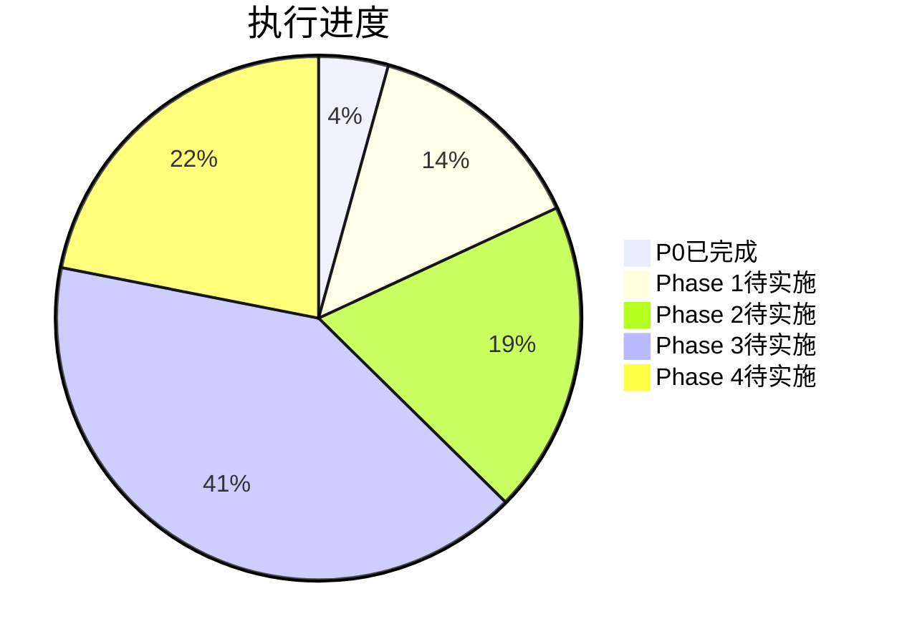

# Orion CI/CD 平台执行状态报告

> **日期**: 2026-05-05
> **当前状态**: P0完成，Phase 1-4 规格评审完成
> **下一步**: Phase 1-4 分阶段实施

---

## 一、已完成任务

### 1.1 规格文档评审 ✅

| Phase | 文档数 | 评审状态 | 评审报告 |
|:-----:|:------:|:--------:|----------|
| Phase 1 | 6 | ✅ 完成 | 已评审 |
| Phase 2 | 6 | ✅ 完成 | 已评审 |
| Phase 3 | 15 | ✅ 完成 | 已评审 |
| Phase 4 | 5 | ✅ 完成 | 已评审 |
| README/总览 | 6 | ✅ 完成 | 已评审 |
| **合计** | **38** | **✅ 100%** | `docs/superpowers/reviews/2026-05-05-specs-feasibility-review.md` |

### 1.2 P0 核心阻塞项实施 ✅

| # | P0阻塞项 | 实施状态 | 测试状态 | Git提交 |
|:-:|----------|:--------:|:--------:|:-------:|
| 1 | JWT密钥轮换 | ✅ 完成 | ✅ PASS | 已提交 |
| 2 | Token黑名单 | ✅ 完成 | ✅ PASS | 已提交 |
| 3 | 数据一致性监控 | ✅ 完成 | ✅ PASS | 已提交 |
| 4 | 四层租户隔离 | ✅ 完成 | ✅ PASS | 已提交 |
| 5 | AI Gateway熔断 | ✅ 完成 | ✅ PASS | 已提交 |
| 6 | 灾备架构基础 | ✅ 完成 | ✅ PASS | 已提交 |

**关键产出**:
- 新增 migration: 071-075 (5个)
- 新增服务: 10+ 个
- 新增测试: 5个 (全部通过)
- Git commits: 20+ 次

---

## 二、未完成任务

### 2.1 Phase 1 能力域实施 (6个)

| # | 能力域 | 目标成熟度 | 工作量 | 状态 |
|:-:|--------|:---------:|:------:|:----:|
| 1 | 核心流水线 | L3→L3.3 | 18.5天 | ⬜ 未开始 |
| 2 | 构建制品 | L2→L2.5 | 14天 | ⬜ 未开始 |
| 3 | 质量门禁 | L3→L3.3 | 13天 | ⬜ 未开始 |
| 4 | 部署发布 | L3→L3.3 | 17天 | ⬜ 未开始 |
| 5 | 开发者门户 | L1→L1.5 | 11天 | ⬜ 未开始 |
| 6 | 环境管理 | L2→L2.3 | 13.5天 | ⬜ 未开始 |
| **合计** | | | **87天** | **0%** |

### 2.2 Phase 2 能力域实施 (6个)

| # | 能力域 | 目标成熟度 | 工作量 | 状态 |
|:-:|--------|:---------:|:------:|:----:|
| 1 | AI决策引擎 | L2→L2.5 | 19天 | ⬜ 未开始 |
| 2 | 自治流水线 | L1→L1.5 | 18.5天 | ⬜ 未开始 |
| 3 | 全栈可观测 | L2→L2.5 | 22天 | ⬜ 未开始 |
| 4 | 成本运营 | L2→L2.3 | 18天 | ⬜ 未开始 |
| 5 | 审批工作流 | L1→L1.5 | 20天 | ⬜ 未开始 |
| 6 | 效能运营 | L2→L2.3 | 24天 | ⬜ 未开始 |
| **合计** | | | **121.5天** | **0%** |

### 2.3 Phase 3 能力域实施 (15个)

| # | 能力域 | 工作量 | 状态 |
|:-:|--------|:------:|:----:|
| 1-15 | 混沌工程、供应链安全、联邦调度等 | 256.5天 | ⬜ 未开始 |

### 2.4 Phase 4 能力域实施 (5个)

| # | 能力域 | 工作量 | 状态 |
|:-:|--------|:------:|:----:|
| 1-5 | 数字孪生、API治理等 | 138天 | ⬜ 概念探索 |

---

## 三、总体进度



| 阶段 | 工作量(天) | 完成度 | 预计完成时间 |
|------|:---------:|:------:|-------------|
| **P0** | 27 | ✅ 100% | 已完成 |
| **Phase 1** | 87 | ❌ 0% | 需要3个月 |
| **Phase 2** | 121.5 | ❌ 0% | 需要3个月 |
| **Phase 3** | 256.5 | ❌ 0% | 需要6个月 |
| **Phase 4** | 138 | ❌ 0% | 需要6个月 |
| **合计** | **603天** | **4.5%** | **18个月** |

---

## 四、后续行动计划

### 4.1 立即执行 (本周)

| 任务 | 优先级 | 预计时间 |
|------|:------:|----------|
| 提交所有未提交代码 | P0 | 1小时 |
| 创建 Phase 1 实施计划 | P1 | 2小时 |
| 启动 Phase 1 并行开发 | P1 | 本周 |

### 4.2 Phase 1 实施顺序

根据依赖关系，建议实施顺序：

```
Week 1-2: 核心流水线(1) + 构建制品(2) - 并行开发
Week 3-4: 质量门禁(3) + 部署发布(4) - 并行开发  
Week 5-6: 环境管理(6) + 开发者门户(5) - 并行开发
```

### 4.3 多Agent并行开发建议

Phase 1 可拆分为3组并行：

| 组 | 能力域 | Agent数 | 依赖 |
|:--:|--------|:-------:|------|
| A | 核心流水线、构建制品 | 2 | 无依赖，可并行 |
| B | 质量门禁、部署发布 | 2 | 依赖A完成 |
| C | 环境管理、开发者门户 | 2 | 依赖B完成 |

---

## 五、结论

### 当前完成情况

| 类型 | 完成 | 未完成 |
|------|:----:|:------:|
| 规格评审 | 38/38 ✅ | 0 |
| P0实施 | 6/6 ✅ | 0 |
| Phase 1-4实施 | 0/32 | 32 |

### 建议

1. **立即提交** 当前所有未提交代码
2. **启动 Phase 1** 并行开发（优先核心流水线+构建制品）
3. **后续 Phase 2-4** 根据依赖链逐步推进

---

_报告生成时间: 2026-05-05T02:35:31Z_