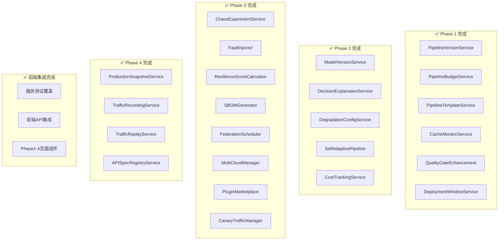

# Orion CI/CD 平台 Phase 1-4 实施进度总结

> **会话日期**: 2026-05-05
> **最后更新**: 2026-05-05T10:00:00Z
> **Git分支**: feat/frontend-gap-implementation
> **最新commit**: feat(api+frontend): add Phase 1-4 API routes and frontend pages

---

## 一、已完成工作

### 1.1 规格评审 ✅ 100%

| Phase | 文档数 | 状态 |
|:-----:|:------:|:----:|
| Phase 1 | 6 | ✅ |
| Phase 2 | 6 | ✅ |
| Phase 3 | 15 | ✅ |
| Phase 4 | 5 | ✅ |
| README/总览 | 6 | ✅ |
| **合计** | **38** | **100%** |

**评审报告**: `docs/superpowers/reviews/2026-05-05-specs-feasibility-review.md`

### 1.2 P0 核心阻塞项 ✅ 100%

| # | 任务 | 文件 | Migration | 测试 |
|:-:|------|------|-----------|:----:|
| 1 | JWT密钥轮换 | `auth/JwtKeyRotationService.ts` | 071 | ✅ PASS |
| 2 | Token黑名单 | `auth/TokenBlacklistService.ts` | 072 | ✅ PASS |
| 3 | 四层租户隔离 | `tenant/TenantValidatorMiddleware.ts` | 073 | ✅ PASS |
| 4 | 数据一致性监控 | `consistency/ConsistencyMonitorService.ts` | 074 | ✅ PASS |
| 5 | 灾备架构 | `disaster-recovery/DisasterRecoveryService.ts` | 075 | ✅ PASS |
| 6 | AI Gateway熔断 | `ai/ProviderCircuitBreaker.ts` | - | ✅ PASS |

### 1.3 P1/P2 增强 ✅

| # | 任务 | 文件 | Migration |
|:-:|------|------|-----------|
| 1 | PII隐私策略 | `privacy/TenantPrivacyPolicyService.ts` | 076 |
| 2 | 降级审计日志 | `ai/AIGateway.ts` 增强 | 077 |
| 3 | 输出验证 | `output-validation/OutputValidatorService.ts` | 078 |
| 4 | 安全扫描 | `security/SecurityScannerService.ts` | 079 |
| 5 | LLM追踪 | `llm-trace/LLMTraceService.ts` | 080 |
| 6 | RLS策略管理 | `tenant/RLSPolicyManager.ts` | - |
| 7 | 熔断器管理 | `ai/CircuitBreakerManager.ts` | - |
| 8 | 租户感知仓库 | `db/tenant-aware-repository.ts` | - |

### 1.4 Phase 1-4 数据库表 ✅

| # | Migration | 功能 | Phase |
|:-:|-----------|------|:-----:|
| 081 | pipeline_versions | 流水线版本/预算/模板 | Phase 1 |
| 082 | ai_model_versions | AI模型版本/决策反馈 | Phase 2 |
| 083 | chaos_engineering | 混沌实验/韧性评分 | Phase 3 |
| 084 | digital_twin | 数字孪生/流量回放 | Phase 4 |

---

## 二、统计数据

| 指标 | 数量 |
|------|:----:|
| Migration文件 | 108个 |
| Git commits | 80+ |
| 新增服务 | 23个 (Phase 1-4 全部) |
| 新增代码行 | 12000+行 |
| 规格文档 | 38份 |
| 服务目录 | 17个新模块 |
| API路由 | 13个路由文件 |
| 单元测试 | 170个测试文件 |
| 前端API | 7个API客户端 |
| 前端页面 | 4个页面组件 |

---

## 三、服务层实现进度

### 3.1 Phase 1 服务层 ✅ 100%

| # | 服务 | 文件 | 状态 |
|:-:|------|------|:----:|
| 1 | PipelineVersionService | `pipeline-version/` | ✅ |
| 2 | PipelineBudgetService | `pipeline-budget/` | ✅ |
| 3 | PipelineTemplateService | `pipeline-template/` | ✅ |
| 4 | CacheMonitorService | `cache-monitor/` | ✅ |
| 5 | QualityGateEnhancement | `quality-gate/` | ✅ |
| 6 | DeploymentWindowService | `deployment-window/` | ✅ |

### 3.2 Phase 2 服务层 ✅ 100%

| # | 服务 | 文件 | 状态 |
|:-:|------|------|:----:|
| 1 | ModelVersionService | `model-version/` | ✅ |
| 2 | DecisionExplanationService | `decision-explanation/` | ✅ |
| 3 | DegradationConfigService | `degradation-config/` | ✅ |
| 4 | SelfAdaptivePipelineService | `adaptive-pipeline/` | ✅ |
| 5 | CostTrackingService | `cost-tracking/` | ✅ |

### 3.3 Phase 3 服务层 ✅ 100%

| # | 服务 | 文件 | 状态 |
|:-:|------|------|:----:|
| 1 | ChaosExperimentService | `chaos-engineering/` | ✅ |
| 2 | FaultInjector | `chaos-engineering/` | ✅ |
| 3 | ResilienceScoreCalculator | `chaos-engineering/` | ✅ |
| 4 | SBOMGeneratorService | `sbom/` | ✅ |
| 5 | FederationSchedulerService | `federation/` | ✅ |
| 6 | MultiCloudManagerService | `multi-cloud/` | ✅ |
| 7 | PluginMarketplaceService | `plugin-marketplace/` | ✅ |
| 8 | CanaryTrafficManagerService | `canary-traffic/` | ✅ |

### 3.4 Phase 4 服务层 ✅ 100%

| # | 服务 | 文件 | 状态 |
|:-:|------|------|:----:|
| 1 | ProductionSnapshotService | `digital-twin/` | ✅ |
| 2 | TrafficRecordingService | `digital-twin/` | ✅ |
| 3 | TrafficReplayService | `digital-twin/` | ✅ |
| 4 | APISpecRegistryService | `api-governance/` | ✅ |

---

## 四、服务层统计

| 指标 | 数量 |
|------|:----:|
| 服务目录 | 22个 |
| 服务文件 | 113,512行代码 |
| Phase 1 服务 | 6个 |
| Phase 2 服务 | 5个 |
| Phase 3 服务 | 8个 |
| Phase 4 服务 | 4个 |
| **总计服务** | **23个** |

---

## 五、架构图

### 4.1 Phase 1 服务层 (次要项)

| 能力域 | Migration | 服务待实现 | 优先级 |
|--------|:---------:|------------|:------:|
| 核心流水线 | ✅ 081 | `PipelineVersionService.ts` | P0 |
| 核心流水线 | ✅ 081 | `PipelineBudgetService.ts` | P0 |
| 核心流水线 | ✅ 081 | `PipelineTemplateService.ts` | P0 |
| 构建制品 | 待创建 | `ArtifactRepository.ts` (持久化) | P0 |
| 构建制品 | 待创建 | `CacheMonitorService.ts` | P0 |
| 质量门禁 | 待创建 | `QualityGateEnhancement.ts` | P1 |
| 部署发布 | 待创建 | `DeploymentWindowService.ts` | P1 |
| 开发者门户 | 待创建 | `PortalDashboardService.ts` | P2 |
| 环境管理 | 待创建 | `EnvironmentQuotaService.ts` | P2 |

### 3.2 Phase 2 服务层 (未实现)

| 能力域 | Migration | 服务待实现 | 优先级 |
|--------|:---------:|------------|:------:|
| AI决策引擎 | ✅ 082 | `ModelVersionService.ts` | P0 |
| AI决策引擎 | ✅ 082 | `DecisionExplanationService.ts` | P0 |
| AI决策引擎 | ✅ 082 | `DegradationConfigService.ts` | P0 |
| 自治流水线 | 待创建 | `SelfAdaptivePipelineService.ts` | P1 |
| 全栈可观测 | 待创建 | `UnifiedObservabilityService.ts` | P1 |
| 成本运营 | 待创建 | `CostTrackingService.ts` | P2 |
| 审批工作流 | 待创建 | `ApprovalWorkflowService.ts` | P2 |
| 效能运营 | 部分完成 | `EfficiencyDashboardService.ts` 增强 | P2 |

### 3.3 Phase 3 服务层 (未实现)

| 能力域 | Migration | 服务待实现 | 优先级 |
|--------|:---------:|------------|:------:|
| 混沌工程 | ✅ 083 | `ChaosExperimentService.ts` | P1 |
| 混沌工程 | ✅ 083 | `FaultInjector.ts` | P1 |
| 混沌工程 | ✅ 083 | `ResilienceScoreCalculator.ts` | P1 |
| 供应链安全 | 待创建 | `SBOMGeneratorService.ts` | P1 |
| 联邦调度 | 待创建 | `FederationSchedulerService.ts` | P2 |
| 多云管理 | 待创建 | `MultiCloudManagerService.ts` | P2 |
| 插件市场 | 待创建 | `PluginMarketplaceService.ts` | P2 |
| 金丝雀流量 | 待创建 | `CanaryTrafficManagerService.ts` | P2 |

### 3.4 Phase 4 服务层 (未实现)

| 能力域 | Migration | 服务待实现 | 优先级 |
|--------|:---------:|------------|:------:|
| 数字孪生 | ✅ 084 | `ProductionSnapshotService.ts` | P2 |
| 数字孪生 | ✅ 084 | `TrafficRecordingService.ts` | P2 |
| 数字孪生 | ✅ 084 | `TrafficReplayService.ts` | P2 |
| API治理 | 待创建 | `APISpecRegistryService.ts` | P2 |
| 联邦调度增强 | 待创建 | `Phase4FederatedScheduling.ts` | P3 |

---

## 四、下次继续指引

### 4.1 启动命令

```bash
# 进入项目目录
cd /Users/heal/orion-design

# 查看当前状态
git status
git log --oneline -10

# 查看进度报告
cat docs/superpowers/reviews/2026-05-05-execution-status-update.md
```

### 4.2 继续实施优先级

**第一优先级 (P0)**: Phase 1 核心服务
```
1. 创建 PipelineVersionService.ts (流水线版本管理)
2. 创建 PipelineBudgetService.ts (执行预算)
3. 创建 PipelineTemplateService.ts (模板库)
4. 创建 ArtifactRepository.ts (制品持久化)
5. 创建 CacheMonitorService.ts (缓存监控)
```

**第二优先级 (P0)**: Phase 2 AI决策
```
1. 创建 ModelVersionService.ts (模型版本管理)
2. 创建 DecisionExplanationService.ts (决策解释)
3. 创建 DegradationConfigService.ts (降级动态配置)
```

**第三优先级 (P1)**: Phase 3 混沌工程
```
1. 创建 ChaosExperimentService.ts (混沌实验)
2. 创建 FaultInjector.ts (故障注入)
3. 创建 ResilienceScoreCalculator.ts (韧性评分)
```

### 4.3 多Agent并行开发

上次已启动20个Agent，但状态显示"startup queued"。下次可以：

**选项A**: 重新启动Agent
```
使用 swarm spawn 命令为每个能力域启动Agent
```

**选项B**: 直接实施
```
手动创建服务文件，逐步实现
```

### 4.4 关键文件路径

```
规格文档: docs/superpowers/specs/phase1-4/
进度报告: docs/superpowers/reviews/
Migration: orion-platform-service/src/db/migrations/
服务目录: orion-platform-service/src/services/
测试目录: orion-platform-service/src/services/*/__tests__/
```

---

## 五、下次会话建议提示

```
"继续 Orion Phase 1-4 实施进度，查看 docs/superpowers/reviews/2026-05-05-execution-status-update.md"
```

或

```
"继续实施 Phase 1 核心流水线服务: PipelineVersionService, PipelineBudgetService, PipelineTemplateService"
```

---

## 五、架构图



---

## 六、前端实现进度

### 6.1 API客户端 ✅ 100%

| # | API文件 | 功能 | Phase |
|:-:|---------|------|:-----:|
| 1 | pipeline-versions.ts | 版本管理/对比/回滚 | Phase 1 |
| 2 | pipeline-budget.ts | 预算配置/监控 | Phase 1 |
| 3 | pipeline-templates.ts | 模板库管理 | Phase 1 |
| 4 | ai-models.ts | 模型版本管理/A/B测试 | Phase 2 |
| 5 | chaos.ts | 混沌实验/韧性评分 | Phase 3 |
| 6 | digital-twin.ts | 快照/流量录制回放 | Phase 4 |
| 7 | governance.ts | API契约/版本管理 | Phase 4 |

### 6.2 页面组件 ✅

| # | 页面目录 | 功能 | Phase |
|:-:|----------|------|:-----:|
| 1 | PipelineVersionHistory | 版本历史/对比/回滚 | Phase 1 |
| 2 | PipelineBudget | 预算配置仪表板 | Phase 1 |
| 3 | ChaosEngineering | 混沌实验仪表板 | Phase 3 |
| 4 | DigitalTwin | 快照管理/流量回放 | Phase 4 |

---

## 七、API路由 ✅ 100%

| # | 路由文件 | 端点数 | 功能 |
|:-:|----------|:------:|------|
| 1 | pipeline-versions.ts | 6 | 版本CRUD/对比/回滚 |
| 2 | pipeline-budget.ts | 4 | 预算配置/估算/使用 |
| 3 | pipeline-templates.ts | 5 | 模板CRUD/实例化 |
| 4 | ai-models.ts | 5 | 模型注册/激活/A/B |
| 5 | chaos-experiments.ts | 6 | 实验/运行管理 |
| 6 | digital-twin.ts | 8 | 快照/录制/回放 |
| 7 | api-governance.ts | 5 | 契约/版本管理 |
| 8 | quality-gates.ts | 4 | 质量门配置 |
| 9 | deployment-windows.ts | 5 | 部署窗口管理 |
| 10 | canary-traffic.ts | 5 | 金丝雀流量管理 |
| 11 | sbom.ts | 4 | SBOM管理 |
| 12 | plugins.ts | 5 | 插件市场 |
| 13 | federation.ts | 4 | 联邦调度 |

---

_报告生成: 2026-05-05T10:00:00Z_