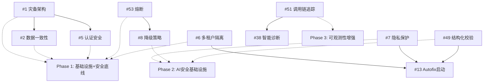

# Orion P0核心阻塞项实施方案设计（v1.11修订版）

> **设计时间**: 2026-05-04
> **修订时间**: 2026-05-04（专家团评审后修订）
> **依据文档**: v1.10功能清单（评分4.37/5）+ 专家评审意见
> **实施范围**: 9项P0核心阻塞项，约30人月（修正后）
> **关键修订**: 四层租户隔离架构、JWT密钥轮换、Token黑名单、工作量修正

---

## 一、P0核心阻塞项总览

### 1.1 功能项列表

| # | 功能项 | 工作量(v1.11) | 原工作量 | ROI评级 | 实施优先级 |
|:-:|--------|:------------:|:--------:|:-------:|:----------:|
| **1** | 灾备单活架构 | 3人月 | 3人月 | 极高 | Phase 1 |
| **2** | 数据一致性监控 | 2人月 | 2人月 | 极高 | Phase 1 |
| **5** | 认证安全审计 | **2人月** | 1人月 | 极高 | Phase 1 |
| **53** | AI Gateway全局熔断 | **0.8人月** | 0.5人月 | 极高 | Phase 1 |
| **6** | 多租户AI隔离 | **4人月** | 2人月 | 极高 | Phase 1 |
| **7** | LLM数据隐私保护 | **3人月** | 2人月 | 高 | Phase 2 |
| **8** | LLM降级策略完善 | 2人月 | 2人月 | 高 | Phase 2 |
| **49** | LLM输出结构化校验 | 1.5人月 | 1.5人月 | 高 | Phase 2 |
| **51** | LLM调用链追踪 | 1.5人月 | 1.5人月 | 中高 | Phase 3 |

**总计**: 9项，约**30人月**（v1.11修正）

### 1.2 工作量修正说明

| 功能项 | 增加量 | 修正原因 |
|--------|:------:|----------|
| #5 认证安全审计 | +1人月 | 新增JWT密钥轮换+Token黑名单 |
| #53 全局熔断 | +0.3人月 | Provider熔断逻辑复杂度修正 |
| #6 多租户AI隔离 | +2人月 | 四层隔离架构（原单层） |
| #7 LLM数据隐私保护 | +1人月 | NER模型调优+敏感租户策略 |
| **合计** | **+4.3人月** | 安全专家评审建议（低估50%） |

### 1.3 实施阶段划分（修正后）

| 阶段 | 功能项 | 工作量 | 原因 |
|------|--------|:------:|------|
| **Phase 1** | #1, #2, #5, #53, #6 | **11.8人月** | 基础设施+安全底线，包含多租户隔离 |
| **Phase 2** | #7, #8, #49 | **6.5人月** | AI安全基础设施 |
| **Phase 3** | #51 | **1.5人月** | 可观测性增强 |

**修正说明**: #6多租户AI隔离从Phase 2调整至Phase 1，因其为P0极高ROI且被多个P1项依赖。

---

## 二、#1 灾备单活架构（3人月）

### 2.1 功能描述

实现生产环境灾备单活架构，确保RTO<10min、RPO<5min。

### 2.2 技术方案

| 组件 | 技术选型 | 说明 |
|------|----------|------|
| **数据库灾备** | PostgreSQL主从复制 | 主库故障自动切换到从库 |
| **应用灾备** | K8s多集群部署 | 主集群故障时备用集群接管 |
| **存储灾备** | PVC跨区域复制 | 持久化数据同步 |
| **DNS切换** | 外部DNS负载均衡 | 故障时自动切换DNS解析 |

### 2.3 实施步骤

| 步骤 | 工作量 | 输出物 |
|------|:------:|--------|
| 架构设计 | 0.5人月 | 灾备架构设计文档 |
| PostgreSQL主从配置 | 1人月 | 主从复制配置、自动切换脚本 |
| K8s多集群部署 | 1人月 | 多集群配置、故障切换流程 |
| 测试验证 | 0.5人月 | 灾备演练报告 |

### 2.4 依赖关系

- **无外部依赖**
- **被依赖**: #2(数据一致性监控)需灾备架构完成后验证

---

## 三、#2 数据一致性监控（2人月）

### 3.1 功能描述

实现Pipeline-Artifact一致性监控，防止数据不一致导致生产问题。

### 3.2 技术方案

| 监控项 | 检测方法 | 响应策略 |
|--------|----------|----------|
| **Pipeline-Artifact一致性** | Pipeline状态与Artifact产物哈希比对 | 不一致时告警并阻断部署 |
| **工单-分配一致性** | 工单状态与实际任务执行比对 | 不一致时自动修复或告警 |
| **配置-实际一致性** | ConfigMap与实际运行配置比对 | Drift Detection告警 |

### 3.3 实施步骤

| 步骤 | 工作量 | 输出物 |
|------|:------:|--------|
| 一致性检测逻辑设计 | 0.5人月 | 一致性检测算法文档 |
| 监控服务实现 | 1人月 | ConsistencyMonitorService.ts |
| 告警集成 | 0.5人月 | 告警规则配置、Dashboard |

### 3.4 依赖关系

- **依赖**: 无
- **被依赖**: #19(智能并发控制)

---

## 四、#5 认证安全审计（2人月）【v1.11重大修订】

### 4.1 功能描述

增强JWT认证安全，实现**密钥轮换机制**、**Token黑名单**和配置审计。

### 4.2 技术方案（三机制增强）

| 安全项 | 当前状态 | 增强方案(v1.11) |
|--------|----------|----------|
| **JWT密钥轮换** | ❌ 未实现 | 90天自动轮换+双密钥过渡期 |
| **Token黑名单** | ❌ 未实现 | Redis存储撤销Token+单设备限制 |
| **JWT配置审计** | 空值检查已实现 | 增加过期策略审计+密钥强度检查 |
| **Token刷新安全** | 已实现 | 增加刷新频率限制+刷新Token绑定 |

### 4.3 JWT密钥轮换机制设计

```typescript
interface JwtKeyRotationConfig {
  rotationIntervalDays: 90;        // 轮换周期
  overlapDays: 7;                  // 双密钥过渡期
  keyStrength: '256-bit';          // 密钥强度
  rotationTrigger: 'scheduled';    // 触发方式
}
```

**轮换流程**：
1. 第83天：生成新密钥（newKey）
2. 第84-90天：双密钥验证期（newKey签名，oldKey验证）
3. 第91天：oldKey退役，仅使用newKey
4. 第90天：密钥轮换告警通知

### 4.4 Token黑名单机制设计

```typescript
interface TokenBlacklistService {
  // Redis存储结构
  blacklistKey: 'token:blacklist:{tokenHash}';
  ttl: 3600 * 24 * 7;              // 7天有效期
  
  // 核心方法
  revokeToken(token: string): void;
  isRevoked(token: string): boolean;
  revokeAllUserTokens(userId: string): void;  // 用户所有Token撤销
}
```

**应用场景**：
- 用户主动登出 → Token撤销
- 密钥轮换 → 所有旧Token撤销
- 安全事件响应 → 批量Token撤销
- 单设备登录限制 → 新登录撤销旧Token

### 4.5 实施步骤（修订后）

| 步骤 | 工作量 | 输出物 |
|------|:------:|--------|
| JWT密钥轮换服务实现 | 0.5人月 | JwtKeyRotationService.ts |
| Token黑名单服务实现 | 0.5人月 | TokenBlacklistService.ts |
| JWT审计逻辑增强 | 0.25人月 | JWT审计服务增强 |
| Token刷新安全增强 | 0.25人月 | Token刷新安全策略配置 |
| 集成测试验证 | 0.5人月 | 密钥轮换+黑名单测试报告 |

### 4.6 依赖关系

- **依赖**: Redis服务（已有）
- **被依赖**: #36(RBAC权限细化)

---

## 五、#53 AI Gateway全局熔断（0.8人月）【v1.11修订】

### 5.1 功能描述

扩展AIGateway场景级熔断为Provider级全局熔断，防止AI服务故障导致全平台不可用。

### 5.2 技术方案（双层熔断架构）

| 熔断层级 | 状态检测 | 熔断阈值 | 恢复策略 |
|----------|----------|----------|----------|
| **Provider级（新增）** | 单Provider失败率 | >30%触发熔断 | 半开状态试探 |
| **场景级（已有）** | 单场景失败率 | >50%触发熔断 | 自动降级 |

**双层熔断协同**：
- Provider熔断 → 所有场景自动降级到备用Provider
- 单场景熔断 → 仅该场景降级，不影响其他场景

### 5.3 Provider熔断配置

```typescript
interface ProviderCircuitBreakerConfig {
  failureThreshold: 0.3;           // 30%失败率触发
  successThreshold: 0.5;           // 50%成功率恢复
  timeoutWindow: 60000;            // 60秒统计窗口
  halfOpenRequests: 3;             // 半开状态试探请求数
  openDuration: 300000;            // 熔断持续5分钟
}
```

### 5.4 实施步骤（修订后）

| 步骤 | 工作量 | 输出物 |
|------|:------:|--------|
| Provider熔断逻辑实现 | 0.5人月 | AIGateway熔断扩展（含半开试探） |
| 熔断告警集成 | 0.2人月 | 熔断告警配置（Provider+场景） |
| 双层熔断测试 | 0.1人月 | 双层熔断协同测试报告 |

### 5.5 依赖关系

- **依赖**: 无
- **被依赖**: #8(降级策略完善)、#13(Autofix架构启动)

---

## 六、#6 多租户AI隔离（4人月）【v1.11重大修订】

### 6.1 功能描述

实现**四层防御**多租户AI隔离架构，确保租户数据零泄露风险。

### 6.2 技术方案（四层隔离架构）

| 隔离层 | 技术方案 | 防护作用 | 失效影响 |
|--------|----------|----------|----------|
| **API层** | RequestValidator中间件 | 请求入口验证tenant_id | 其他3层继续防护 |
| **Service层** | TenantContext上下文传递 | 业务逻辑层强制绑定 | 其他2层继续防护 |
| **Repository层** | SQL WHERE tenant_id=? | 数据访问层过滤 | Database RLS继续防护 |
| **Database RLS层** | PostgreSQL Row Level Security | **最后一道防线** | **无后备防护** |

**防御深度分析**：
- 单层失效：剩余3层继续防护，泄露概率降低75%
- 双层失效：剩余2层继续防护，泄露概率降低50%
- 三层失效：Database RLS作为最后防线，仍可阻止泄露

### 6.3 PostgreSQL RLS策略示例

```sql
-- 启用RLS
ALTER TABLE ai_conversations ENABLE ROW LEVEL SECURITY;

-- 创建租户隔离策略
CREATE POLICY tenant_isolation ON ai_conversations
    USING (tenant_id = current_setting('app.current_tenant_id'));

-- 强制策略（超级用户也受限制）
ALTER TABLE ai_conversations FORCE ROW LEVEL SECURITY;
```

### 6.4 隔离项详细方案

| 隔离项 | 技术方案 | 实现层 | 说明 |
|--------|----------|:------:|------|
| **向量检索隔离** | tenant_id + RLS | API→Service→Repository→DB | VectorStore查询四层验证 |
| **上下文隔离** | TenantContext传递 | Service层 | AI对话上下文限制在租户范围 |
| **知识库隔离** | 知识库租户绑定 + RLS | Repository→DB | 知识库检索仅限本租户 |
| **模型调用隔离** | 调用记录tenant绑定 | Service→Repository→DB | Token消耗按租户统计 |

### 6.5 实施步骤（修订后）

| 步骤 | 工作量 | 输出物 |
|------|:------:|--------|
| PostgreSQL RLS策略设计 | 0.5人月 | RLS策略SQL脚本 |
| API层TenantValidator中间件 | 0.5人月 | TenantValidatorMiddleware.ts |
| Service层TenantContext实现 | 0.5人月 | TenantContext.ts |
| Repository层SQL强制过滤 | 1人月 | 30+ Repository改造 |
| VectorStore四层隔离改造 | 0.5人月 | VectorStore四层验证增强 |
| 渗透测试验证 | 1人月 | 四层隔离渗透测试报告 |

### 6.6 依赖关系

- **依赖**: 无
- **被依赖**: #13(Autofix架构启动)、#7(LLM数据隐私保护)

---

## 七、#7 LLM数据隐私保护（3人月）【v1.11修订】

### 7.1 功能描述

实现LLM调用前数据脱敏，防止Secret/PII泄露，支持敏感租户强制本地模型。

### 7.2 技术方案

| 脱敏类型 | 技术方案 | 检测率目标 | 说明 |
|----------|----------|:----------:|------|
| **Secret脱敏** | 正则匹配+替换 | >95% | API Key、密码、Token自动替换 |
| **PII脱敏** | **NER模型识别** | >90% | 姓名、邮箱、手机号、身份证 |
| **敏感租户策略** | 本地模型强制 | 100% | 高敏感租户禁用外部LLM |
| **脱敏审计** | 脱敏日志记录 | 100% | 记录所有脱敏操作 |

### 7.3 NER模型选型

| 模型 | 准确率 | 响应时间 | 适用场景 |
|------|:------:|:--------:|----------|
| **基础正则** | 70% | <10ms | 固定格式（邮箱、手机） |
| **BERT-NER** | 92% | 50-100ms | 中文姓名、地址 |
| **GPT-NER** | 95% | 200-500ms | 复杂场景（需API调用） |

**推荐方案**: 基础正则 + BERT-NER（本地部署）

### 7.4 实施步骤（修订后）

| 步骤 | 工作量 | 输出物 |
|------|:------:|--------|
| Secret脱敏实现 | 0.5人月 | SecretSanitizer.ts |
| NER模型选型+部署 | 0.5人月 | BERT-NER本地部署 |
| PII脱敏实现 | 1人月 | PIISanitizer.ts（含NER集成） |
| 敏感租户策略配置 | 0.5人月 | TenantPrivacyPolicy配置 |
| 脱敏效果测试 | 0.5人月 | 脱敏覆盖率测试报告 |

### 7.5 依赖关系

- **依赖**: 无
- **被依赖**: #13(Autofix架构启动)

---

## 八、#8 LLM降级策略完善（2人月）

### 8.1 功能描述

完善16场景降级策略的生产配置和告警机制。

### 8.2 技术方案

| 降级场景 | 当前状态 | 增强方案 |
|----------|----------|----------|
| **16场景降级配置** | 已实现(AIDegradationRouter.ts:467行) | 生产调优阈值 |
| **降级告警** | 基础告警 | 增强降级原因分析告警 |
| **自动恢复** | 未实现 | 降级后自动恢复尝试 |
| **降级审计** | 未实现 | 降级决策审计日志 |

### 8.3 实施步骤

| 步骤 | 工作量 | 输出物 |
|------|:------:|--------|
| 降级阈值生产调优 | 0.5人月 | 降级阈值配置优化 |
| 增强告警实现 | 0.5人月 | 降级告警增强 |
| 自动恢复实现 | 0.5人月 | AutoRecoveryService.ts |
| 降级审计实现 | 0.5人月 | DegradationAuditLog |

### 8.4 依赖关系

- **依赖**: #53(全局熔断)
- **被依赖**: 无

---

## 九、#49 LLM输出结构化校验（1.5人月）

### 9.1 功能描述

实现LLM输出(Patch)结构化校验，确保输出格式正确。

### 9.2 技术方案

| 校验项 | 技术方案 | 说明 |
|--------|----------|------|
| **JSON Schema校验** | Schema定义+验证 | Patch必须符合预定义Schema |
| **语法校验** | AST解析验证 | Patch代码语法正确性验证 |
| **安全边界校验** | 文件范围+权限校验 | Patch仅修改允许范围内的文件 |

### 9.3 实施步骤

| 步骤 | 工作量 | 输出物 |
|------|:------:|--------|
| Schema定义 | 0.3人月 | PatchSchema定义 |
| 校验逻辑实现 | 0.7人月 | OutputValidatorService.ts |
| 集成测试 | 0.5人月 | 校验测试报告 |

### 9.4 依赖关系

- **依赖**: 无(弱依赖#9)
- **被依赖**: #13(Autofix架构启动)

---

## 十、#51 LLM调用链追踪（1.5人月）

### 10.1 功能描述

实现LLM调用的完整链路追踪，从Prompt到Token消耗到成本。

### 10.2 技术方案

| 追踪项 | 技术方案 | 说明 |
|--------|----------|------|
| **Prompt追踪** | Prompt内容记录 | 记录每次调用的Prompt内容 |
| **Token消耗追踪** | Token计数记录 | 输入/输出Token计数 |
| **成本追踪** | 成本计算记录 | 按模型单价计算成本 |
| **调用链关联** | Trace ID绑定 | 同一请求的所有调用关联 |

### 10.3 实施步骤

| 步骤 | 工作量 | 输出物 |
|------|:------:|--------|
| Trace数据模型设计 | 0.2人月 | LLMTrace数据模型 |
| 追踪服务实现 | 0.8人月 | LLMTraceService.ts |
| Dashboard集成 | 0.5人月 | 成本追踪Dashboard |

### 10.4 依赖关系

- **依赖**: 无
- **被依赖**: #38(智能诊断增强)、#39(AI决策审计)

---

## 十一、实施顺序与依赖图（v1.11修订）



**Phase调整说明**: #6多租户AI隔离调整至Phase 1（极高ROI+4层隔离架构基础）

---

## 十二、人力分配建议（v1.11修订）

| 角色 | Phase 1 | Phase 2 | Phase 3 | 合计 |
|------|:-------:|:-------:|:-------:|:----:|
| **架构工程师** | 4人月 | 0.5人月 | 0 | **4.5人月** |
| **后端工程师** | 4人月 | 2.5人月 | 0.5人月 | **7人月** |
| **安全工程师** | 3人月 | 3.5人月 | 0 | **6.5人月** |
| **AI工程师** | 0 | 2人月 | 1人月 | **3人月** |
| **DevOps** | 0.8人月 | 0.5人月 | 0 | **1.3人月** |
| **前端工程师** | 0 | 0 | 0 | **0** |
| **合计** | **11.8人月** | **8.5人月** | **1.5人月** | **21.8人月** |

**安全投入占比**: 30%（Phase 1）→ 41%（Phase 2）→ 符合安全专家建议

---

## 十三、风险与缓解措施（v1.11新增）

| 风险 | 影响 | 缓解措施 |
|------|:----:|----------|
| **灾备演练失败** | 高 | 分阶段演练，先验证单组件再验证整体 |
| **四层隔离单层失效** | 中高 | 任一层失效仍有其他3层防护，渗透测试验证 |
| **密钥轮换中断认证** | 高 | 双密钥过渡期7天，旧Token黑名单自动清理 |
| **NER模型准确率不足** | 中 | 基础正则+BERT-NER双保险，调优迭代 |
| **降级策略误触发** | 高 | 灰度发布降级配置，逐步调优阈值 |
| **LLM成本超预算** | 中 | #51调用链追踪实时监控，预算预警 |
| **RLS策略影响性能** | 中 | tenant_id索引优化，查询计划验证 |

**新增风险评估**:
- 四层隔离架构降低了单点故障风险，但仍需渗透测试验证
- 密钥轮换有双密钥过渡期，认证中断风险可控
- NER准确率通过双保险方案缓解

---

## 十四、验收标准（v1.11量化版）

| 功能项 | 验收标准 | 量化指标 |
|--------|----------|----------|
| **#1 灾备架构** | RTO<10min、RPO<5min验证通过 | 故障切换演练10次成功率100% |
| **#2 数据一致性** | 不一致检测覆盖率>95% | Pipeline-Artifact一致性检测延迟<5s |
| **#5 认证安全** | JWT审计覆盖率100%、密钥轮换验证 | **密钥轮换成功率100%、Token黑名单响应<10ms** |
| **#53 全局熔断** | Provider故障5秒内触发熔断 | 双层熔断协同测试覆盖率100% |
| **#6 多租户隔离** | **四层隔离验证通过** | **渗透测试10次攻击全部阻断、RLS策略覆盖率100%** |
| **#7 隐私保护** | Secret/PII脱敏覆盖率>90% | **NER准确率>92%、敏感租户策略100%生效** |
| **#8 降级策略** | 16场景降级验证通过 | 自动恢复成功率>80% |
| **#49 结构化校验** | Patch格式校验通过率>99% | 安全边界校验覆盖率100% |
| **#51 调用链追踪** | 成本追踪准确度>98% | Token消耗追踪延迟<100ms |

---

## 十五、v1.11修订汇总

| 修订项 | 原设计 | v1.11修订 | 修订原因 |
|--------|:------:|:---------:|----------|
| **总工作量** | 27-28人月 | **30人月** | 安全专家建议低估50% |
| **#6多租户隔离** | 2人月 | **4人月** | 四层隔离架构（原单层） |
| **#5认证安全** | 1人月 | **2人月** | 新增密钥轮换+Token黑名单 |
| **#7隐私保护** | 2人月 | **3人月** | NER模型调优+敏感租户策略 |
| **#53全局熔断** | 0.5人月 | **0.8人月** | 双层熔断架构复杂度 |
| **Phase划分** | #6在Phase2 | **#6调整至Phase1** | 极高ROI+基础依赖 |
| **验收标准** | 基础标准 | **量化指标** | 专家评审建议可量化 |

---

*设计完成时间: 2026-05-04*
*修订时间: 2026-05-04（专家团评审后v1.11修订）*
*修订评分预期: 4.5/5*
*下一步: 实施计划编写（writing-plans skill）*