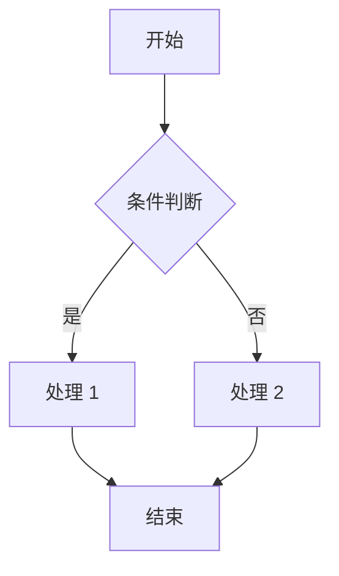

# 模块技术规格文档模板

> 使用方式：复制此模板到 `modules/MXX-模块名称.md`，填入具体内容

---

## 一、模块概述

| 字段 | 内容 |
|------|------|
| 模块编号 | MXX |
| 模块名称 | |
| 所属层级 | Layer 1-5 |
| 优先级 | P0 / P1 / P2 |
| 负责人 | |
| 技术负责人 | |
| 预计开始日期 | |
| 预计完成日期 | |

### 1.1 模块职责

> 用一句话描述这个模块是做什么的

### 1.2 功能列表

- [ ] 功能 1
- [ ] 功能 2
- [ ] 功能 3

### 1.3 与其他模块的关系

```
上游模块 → 本模块 → 下游模块
```

---

## 二、API 设计

### 2.1 REST API

| 方法 | 路径 | 描述 | 认证 | 限流 |
|------|------|------|------|------|
| GET | /api/v1/xxx | | 是 | 100/min |
| POST | /api/v1/xxx | | 是 | 50/min |

### 2.2 请求/响应示例

```yaml
# 请求
POST /api/v1/xxx
Content-Type: application/json
Authorization: Bearer {token}

{
  "field1": "value1"
}

# 响应
HTTP/1.1 200 OK
Content-Type: application/json

{
  "code": 0,
  "data": {},
  "message": "success"
}
```

### 2.3 错误码定义

| 错误码 | HTTP 状态 | 描述 |
|--------|-----------|------|
| XXX_001 | 400 | |
| XXX_002 | 401 | |
| XXX_003 | 403 | |
| XXX_004 | 404 | |
| XXX_005 | 500 | |

---

## 三、数据模型

### 3.1 数据库表设计

```sql
CREATE TABLE xxx (
    id VARCHAR(64) PRIMARY KEY,
    name VARCHAR(256) NOT NULL,
    created_at TIMESTAMP DEFAULT CURRENT_TIMESTAMP,
    updated_at TIMESTAMP DEFAULT CURRENT_TIMESTAMP ON UPDATE CURRENT_TIMESTAMP,
    INDEX idx_name (name),
    INDEX idx_created (created_at)
);
```

### 3.2 字段说明

| 字段 | 类型 | 必填 | 默认值 | 说明 |
|------|------|------|--------|------|
| id | VARCHAR(64) | 是 | - | 主键，UUID |
| name | VARCHAR(256) | 是 | - | 名称 |

### 3.3 数据流转图

```
输入 → [处理逻辑] → 输出
        ↓
    [数据库]
```

---

## 四、核心逻辑

### 4.1 流程图



### 4.2 关键算法

```python
def key_function(params):
    """
    函数说明
    
    Args:
        params: 参数说明
    
    Returns:
        返回值说明
    """
    pass
```

### 4.3 状态机

```
状态 1 --事件/条件--> 状态 2
状态 2 --事件/条件--> 状态 3
```

---

## 五、依赖与集成

### 5.1 内部依赖

| 依赖模块 | 依赖类型 | 说明 |
|---------|---------|------|
| MXX | 强依赖 | |
| MXX | 弱依赖 | |

### 5.2 外部依赖

| 依赖项 | 类型 | 版本 | 说明 |
|--------|------|------|------|
| Tekton | CI 引擎 | v0.5+ | |
| PostgreSQL | 数据库 | v15+ | |

### 5.3 集成点

```yaml
集成点：
  - 名称：
    协议：HTTP / gRPC / 消息队列
    方向：出 / 入
    超时：
    重试策略:
```

---

## 六、配置与部署

### 6.1 配置项

```yaml
# config.yaml
module_name:
  enabled: true
  # 配置项说明
  key1: value1
  key2: value2
```

| 配置项 | 类型 | 默认值 | 必填 | 说明 |
|--------|------|--------|------|------|
| enabled | boolean | true | 否 | 是否启用 |
| key1 | string | - | 是 | 说明 |

### 6.2 部署架构

```yaml
部署:
  副本数：3
  资源:
    requests:
      cpu: 500m
      memory: 512Mi
    limits:
      cpu: 1000m
      memory: 1Gi
  HPA:
    min: 2
    max: 10
    target_cpu_utilization: 70
```

### 6.3 环境变量

| 变量名 | 说明 | 默认值 |
|--------|------|--------|
| DB_HOST | 数据库地址 | localhost |
| DB_PORT | 数据库端口 | 5432 |

---

## 七、监控与告警

### 7.1 核心指标

| 指标名 | 类型 | 标签 | 说明 |
|--------|------|------|------|
| xxx_request_total | counter | method, status | 请求总数 |
| xxx_request_duration_seconds | histogram | method | 请求耗时 |

### 7.2 日志规范

```json
{
  "level": "info",
  "timestamp": "2026-04-10T09:00:00Z",
  "module": "MXX",
  "trace_id": "xxx",
  "message": "操作成功",
  "extra": {}
}
```

### 7.3 告警规则

| 规则名 | 条件 | 严重级别 | 通知渠道 |
|--------|------|---------|---------|
| xxx_error_rate | 错误率>5% 持续 5min | WARNING | Slack |
| xxx_unavailable | 健康检查失败 3 次 | CRITICAL | PagerDuty |

---

## 八、测试策略

### 8.1 单元测试

- 覆盖率目标：≥80%
- 测试框架：pytest / vitest

### 8.2 集成测试

| 测试场景 | 输入 | 预期输出 | 自动化 |
|---------|------|---------|--------|
| 场景 1 | | | ✅ |
| 场景 2 | | | ✅ |

### 8.3 性能测试

| 指标 | 目标值 | 实测值 |
|------|--------|--------|
| P99 延迟 | < 100ms | |
| QPS | > 100 | |

---

## 九、风险与缓解

| 风险 | 影响 | 概率 | 缓解措施 |
|------|------|------|---------|
| 风险 1 | 高 | 中 | 措施 |
| 风险 2 | 中 | 低 | 措施 |

---

## 十、待办事项

- [ ] 任务 1
- [ ] 任务 2
- [ ] 任务 3

---

## 十一、变更记录

| 版本 | 日期 | 作者 | 变更内容 |
|------|------|------|---------|
| v1.0 | 2026-04-10 | | 初始版本 |

---

_文档末尾_
